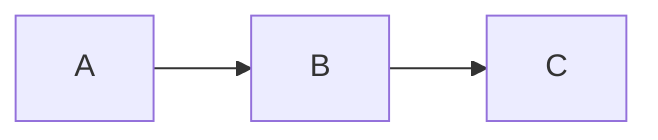

<script src="../node_modules/mermaid/dist/mermaid.min.js"></script>
<script src="../lattice-runtime.js"></script>

# Mermaid Error Test

```mermaid
graph TD
    A[Start] --> B{Is it?}
    INTENTIONAL_GARBAGE_TOKEN >>>>>> ?!?!
    --[broken syntax that mermaid cannot parse
```

---

# Valid one


