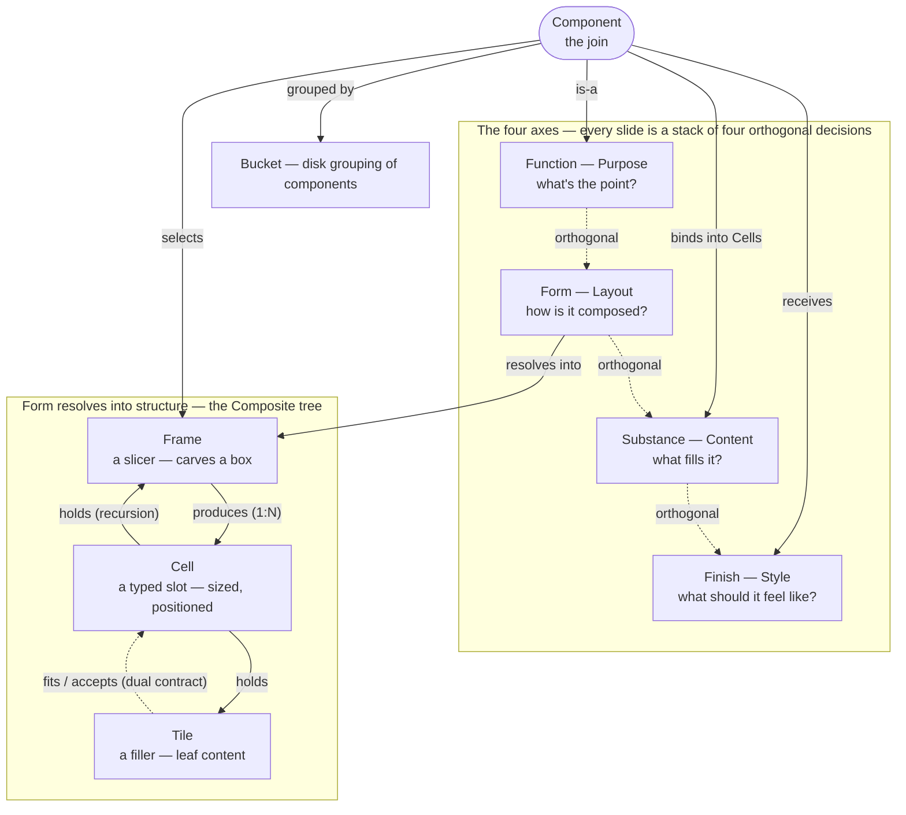

# Concepts — the one map

**Function · Form · Substance · Finish, and the Frame / Cell / Tile they
resolve into.** This is the top-of-stack map: it names *every* concept Lattice
ships, on *both* levels, and the relationships between them — the lattice they
form. Read it first; then drop into the canonical doc that owns each piece in
depth.

It joins the two levels rather than re-deriving them. `design/design-system.md`
owns the four-axis model (Function · Form · Substance · Finish) and the component
catalog. `design/forms.md` owns the structural nouns (Frame · Cell · Tile) and
the composition model. A reader meets the axes in one doc and the nouns in the
other and never sees that they are one system at two scales — that is the gap
this doc closes. It owns only the *relationships*; every definition below is a
one-line restatement that links down.

---

## 1. The whole system in two sentences

> **A slide is composed along four orthogonal axes — Function, Form, Substance,
> Finish.** **Form** is the structural axis, and it resolves into a recursive
> tree: *a Frame divides a box into Cells; each Cell holds a Tile — or another
> Frame.*

Everything else is which concept owns which decision, and how the two sentences
connect. The connector is the **component**: a component *is-a* Function, it
*selects* a Frame (its `form:` value), it *binds* Substance into the Cells that
Frame produces, and it *receives* Finish.

---

## 2. The lattice

Solid edges are containment / selection (the structural spine); dashed edges are
the orthogonality of the axes and the `accepts` / `fits` containment contract.
The recursion is the `Cell --holds--> Frame` edge: a Cell can hold a Tile (leaf)
*or* another Frame (composite), and that uniform treatment is the whole system.

---

## 3. Level 1 — the four axes

Four orthogonal, independently-swappable decisions: swap one and the others hold
— change the palette and the shape is untouched; change the shape and the data
is untouched. Each axis is owned by a different audience and enforced in a
different place, so each audience owns exactly one axis without reaching into
another's.

| Axis (system) | Human word | The question | Owned by | Encoded / enforced by | Canonical doc |
|---|---|---|---|---|---|
| **Function** | Purpose | what's the point of this slide? | deck authors | `function` field on every manifest + validator (the families live in `components.json`) | `design-system.md` §3 |
| **Form** | Layout | how is it composed? | layout designers | `form` field + the `lib/forms/` catalog — Frame/Cell/Tile manifests + gates (the Frame types live in `forms.json`) | `forms.md` (model) · `design-system.md` §4 |
| **Substance** | Content | what fills it? | engine maintainers | `substance` field + the per-substance render kernel (the sources — prose · structure · series · graph, plus `mixed` — live in `components.json`) | `design-system.md` §5 |
| **Finish** | Style | what should it feel like? | theme designers | palette tokens (`themes/*.css`) + variant tiers (`lib/base/base.variants.css` + per-component `.styles.css`) | `design-system.md` §6.5 · `theming.md` |

**The one word we legislate against is "look"** — it collides between *Layout*
(Form) and *Style* (Finish). Resolve "make it look different" into one or the
other before acting (`design-system.md` §2.5).

---

## 4. Level 2 — Form's three nouns

Form is the only axis that decomposes — because it is the only one whose answer
is itself a **recursive structure**: composition nests into itself (a Frame's
Cell can hold another Frame). Function only classifies, Substance *fills* the
Cells, and Finish styles the whole tree — none of those nests, so none needs a
noun set of its own (their "level 2" is a flat vocabulary — the substance
sources, the variant tiers). The three nouns answer a question only Form asks.

It resolves into a **Composite** tree — slicers that make boxes (Frames), fillers
that fill them (Tiles), and the typed slot between (Cells); each row of the table
below changes for an independent reason (`forms.md` §3, the SOLID reading).
(`forms.md` §2 counts *four* nouns — Form itself, plus these three structural
ones; this map owns the join, so it lists the three that do the carving.)

| Noun | Is | One axis of change | Replaces (pre-rename) | Canonical doc |
|---|---|---|---|---|
| **Frame** | a **slicer** — carves a box into sub-boxes; the root *and* every nested division | a composition pattern is added (a new layout) | `island group` / `group` | `forms.md` §2, §5 |
| **Cell** | a **typed slot** — an empty, sized, positioned, resolution-blind box | the layout/geometry changes (a slot moves) | `berth` | `forms.md` §2, §5, §6 |
| **Tile** | a **filler** — leaf content sized to fill one Cell, bound to a source | a data source changes (a new `meta:` format, a state variant) | `island` | `forms.md` §2, §5 |

The connective tissue is the **`accepts` / `fits` contract**: a Cell declares
which kinds it `accepts`; a Tile (or Frame) declares which Cells it `fits`. That
dual is a single piece of data — one source feeds both the author-lint and the
Frame-generation guardrail — and it is what keeps a footer Tile out of a masthead
Cell. Each Cell is also **resolution-blind**: it resolves to a deterministic px
box independent of its content, and clips rather than bleeds (`forms.md` §6).

The live Frame / Cell / Tile catalog (with current counts) is `dist/docs/forms.json`.

---

## 5. The join — Component and Bucket

A **component is this same grammar one scale down**, not a parallel system. Its
`form:` value is a Frame type, its slots are Cells, and the author's markdown
fills them the way a Tile fills a Cell. In OOP terms it **has-a** Frame and binds
Substance into the Cells that Frame produces; it also carries a Function and
receives Finish. The slide's main Cell is simply `accepts: [a component]`
(`forms.md` §4).

A **Bucket** is the orthogonal, purely-organisational concept: the *disk*
grouping of components. Seven buckets match the Function families one-to-one;
five diverge (`chart`, `diagram`, `math`, `code`, `legal`) to colocate
components that share a renderer kernel or authoring vocabulary. A component's
`function` is unchanged by its bucket — the `bucket` field just says where the
folder lives (`design-system.md` §9).

The live component catalog (with current counts) is `dist/docs/components.json`.

---

## 6. Abstract vs. concrete — the three rungs

The same concept shows up at three levels of concreteness, and the jumps are the
whole pipeline: a slide is built by realizing abstract *types* as catalog *data*,
then interpreting that data into *pixels*.

| Rung | What it is | Example |
|---|---|---|
| **1 — abstract** | a type / axis / kind — vocabulary and schema | the *Form* axis; the *Frame* slicer kind; the Form values |
| **2 — concrete-as-data** | a catalog entry — manifest / definition / CSS on disk, validated | the `split-panel` Frame manifest; the `cards-grid` component; a theme |
| **3 — concrete-at-render** | the realized instance — pixels in the PDF | this slide's carved boxes, resolved Cells, populated Tiles |

The four axes (Function · Form · Substance · Finish) all live at **rung 1** — they
are dimensions of decision, not things. Form is no exception *here* (it is still
an abstraction); what makes it special in §4 is that its *values* form a tree,
which is why only its nouns descend into rungs 2 and 3. **Frame** and **Tile** are
*interfaces* and **Cell** is a *class* at rung 1 (`forms.md` §3); a manifest at
rung 2; a box or content at rung 3. The
catch is that **rung 2 only looks concrete** — the manifests are inert *data (an
AST), not runtime objects*. The sole instantiated rung is render, when the
transform kernels + CSS grid interpret that AST; the three render paths are three
interpreters of the one tree (`forms.md` §3).

---

## 7. The relationships, named

The edges of §2's diagram, as a table — each is the relationship this doc exists
to make explicit, with where it is encoded.

| From → To | Relationship | Encoded where |
|---|---|---|
| Function ⟂ Form ⟂ Substance ⟂ Finish | **orthogonal** — independently swappable | the four are separate manifest fields, separately owned |
| Form → Frame / Cell / Tile | **resolves into** (Composite) | `lib/forms/` manifests + `forms.json` |
| Frame → Cell | **produces** (1:N) | a Frame manifest lists its `cells`; integrity gate checks they exist |
| Cell → Tile \| Frame | **holds** (recursion) | `Cell.accepts` kinds incl. `frame` |
| Tile → Cell | **fits / occupies** | `Tile.fits`, dual of `Cell.accepts`; validated |
| Component → Function | **is-a** | `function` field |
| Component → Frame | **selects** | `form` field (one of the Frame types) |
| Component → Substance | **binds** into Cells | `substance` field + kernel |
| Component → Finish | **receives** | variant tiers + theme tokens |
| Component → Bucket | **grouped by** | `bucket` field (defaults to Function) |

---

## 8. What the lattice answers

Because the concepts and their edges are catalogued, an author or agent can
*navigate* the model instead of scrolling a gallery:

- **"What component fits this Function?"** → query `components.json` by `function`.
- **"Which Frame should I pick?"** → the Frame types (`forms.json`); a
  component declares one in `form:`.
- **"Which Cells does this Frame produce?"** → the Frame manifest lists them;
  validated at load.
- **"Can this Tile dock here?"** → the `Tile.fits` / `Cell.accepts` dual.
- **"What Substance does this need?"** → the `substance` field fixes the kernel.
- **"Which Finish modifiers apply?"** → variant tier lookup + theme tokens.

---

## 9. Encoded vs. prose — current state

The **vocabulary** of every concept is encoded and self-enforcing: the Frame /
Cell / Tile catalogs (manifests + JSON-schemas + integrity gates in
`lib/forms/index.js`), the component catalog (`function` / `form` / `substance` /
`bucket` fields + validator), and the variant tiers. The relationships *within*
a catalog are encoded and gated (a Frame's `cells`, a Tile's `fits`).

**The cross-level relationship graph itself — the §2 lattice, the §7 edge table —
is now encoded too**, as the concept ontology `lib/concepts/concepts.json`,
projected to the machine catalog `dist/docs/concepts.json` (beside
`components.json` / `forms.json`). Its **drift gate** runs two tiers: every
node's claimed vocabulary must resolve in the live catalogs (and the counts are
*derived* from them, never hand-typed); and every **structural backbone edge**
must be honored by the engine — the recursion edge requires a Cell that really
`accepts: frame`, the join edges require the `function` / `form` / `substance`
fields they claim, and so on. The axis-orthogonality edges and `component →
Finish` have no catalog to check against, so they are encoded *assertions*, gated
only for internal consistency (`Finish` is the one axis with no single encoded
vocabulary, so it carries no `source`).

What remains **prose** — by necessity, not oversight:

- **The node descriptors** — each concept's human word, question, and one-line
  definition in the ontology — are hand-authored and paraphrase this doc and
  `design-system.md`; nothing gates that prose against the docs (there is no
  structured source to derive it from), so it is a residual, low-churn drift
  surface.

- **Form's *execution*** is at the "light coupling" rung: the manifests are a
  *validated* contract, but the render still places via hand-written transforms +
  CSS. Moving to manifest-driven placement is staged, not yet implemented — see
  `forms.md` §11 and
  `engineering/decisions/2026-06-16-form-manifest-medium-independent-contract.md`.
- **Design judgment** — when a variant warrants a new component, when a bucket
  should diverge from its Function — is a rule for humans, not a schema.

---

## See also

- `design/design-system.md` — the four-axis model in depth: the Functions, Forms,
  Substances, the Finish tiers, and the component catalog. **Owns the axes.**
- `design/forms.md` — the Form composition model in depth: Frame / Cell / Tile,
  the Composite pattern, the resolution-blind Cell contract, the manifest.
  **Owns the structural nouns.**
- `design/theming.md` — Finish at the palette level (role-based tokens).
- `engineering/architecture.md` — where each construct lives in code (CSS vs the
  cataloged JS transforms) and the three render paths.
- `dist/docs/concepts.json` — the machine-readable encoding of *this* map (nodes
  + typed edges), generated from `lib/concepts/concepts.json` and drift-gated
  against the catalogs below.
- `dist/docs/components.json`, `dist/docs/forms.json` — the machine catalogs the
  lattice is navigated through.
