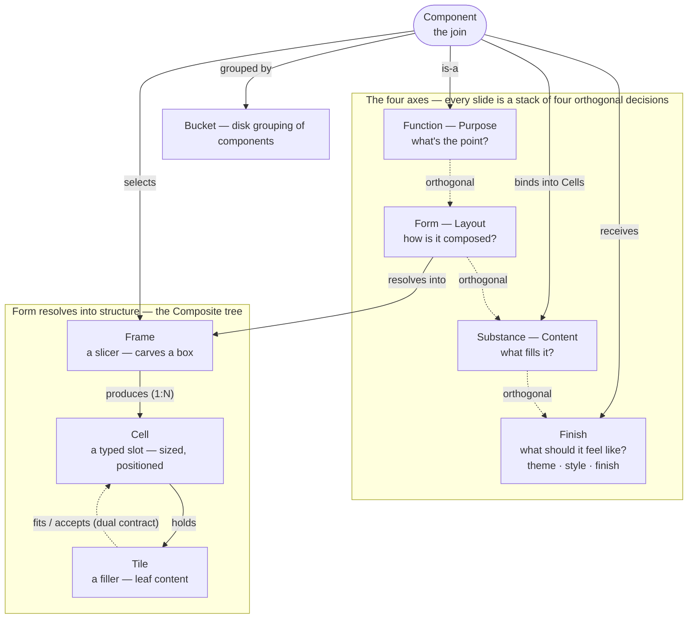

# Concepts — the one map

**Function · Form · Substance · Finish, and the Frame / Cell / Tile they
resolve into.** This is the top-of-stack map: it names *every* concept Lattice
ships, on *both* levels, and the relationships between them — the lattice they
form. Read it first; then drop into the canonical doc that owns each piece in
depth.

It joins the two levels rather than re-deriving them. `design/design-system.md`
owns the four-axis model (Function · Form · Substance · Finish) and the component
catalog. `design/forms.md` owns the structural nouns (Frame · Cell · Tile) and
the composition model. A reader meets the axes in one doc and the nouns in the
other and never sees that they are one system at two scales — that is the gap
this doc closes. It owns only the *relationships*; every definition below is a
one-line restatement that links down.

---

## 1. The whole system in two sentences

> **A slide is composed along four orthogonal axes — Function, Form, Substance,
> Finish.** **Form** is the structural axis, and it resolves into a tree:
> *a Frame divides a box into Cells; each Cell holds a Tile* (the content Cell
> hosts the author's Component).

Everything else is which concept owns which decision, and how the two sentences
connect. The connector is the **component**: a component *is-a* Function, it
*selects* a Frame (its `form:` value), it *binds* Substance into the Cells that
Frame produces, and it *receives* Finish.

---

## 2. The lattice

Solid edges are containment / selection (the structural spine); dashed edges are
the orthogonality of the axes and the `accepts` / `fits` containment contract.
A Cell holds a Tile; the content Cell's Tile hosts the author's Component. (A Cell
holding *another Frame* — making the tree recurse without limit — was considered
and **rejected**: cool but useless for a slide. See `design/forms.md` §1 and
`engineering/decisions/2026-06-18-frame-recursion-cells.md`.)

---

## 3. Level 1 — the four axes

Four orthogonal, independently-swappable decisions: swap one and the others hold
— change the palette and the shape is untouched; change the shape and the data
is untouched. Each axis is owned by a different audience and enforced in a
different place, so each audience owns exactly one axis without reaching into
another's.

| Axis | Human word | The question | Owned by |
|---|---|---|---|
| **Function** | Purpose | what's the point of this slide? | deck authors |
| **Form** | Layout | how is it composed? | layout designers |
| **Substance** | Content | what fills it? | engine maintainers |
| **Finish** | Finish | what should it feel like? | theme designers |

The **Finish** axis is set through three composable front-matter registers, each
its own key: `theme:` (the palette), `mode:` (the rendering *mode* — the
typographic hand: `boardroom` / `sketch`), and `finish:` (the *backdrop* layer
stack: `none` / `atrium` …). *"Mode" is the human word for that rendering-hand
register specifically.* (The key is `mode:`, not `style:` — Marp already owns
`style:` for inline-CSS injection.)

**The one word we legislate against is "look"** — it collides between *Layout*
(Form) and the *Mode/Finish* feel. Resolve "make it look different" into one or
the other before acting.

---

## 4. Level 2 — Form's three nouns

Form is the only axis that decomposes — because it is the only one whose answer
is itself a **composed structure**: a Frame carves the slide into Cells, and each
Cell holds a Tile (the content Cell's Tile hosts a Component with its own internal
layout). Function only classifies, Substance *fills* the Cells, and Finish styles
the whole — none of those has a structure of its own, so none needs a noun set
(their "level 2" is a flat vocabulary — the substance sources, the variant tiers).
The three nouns answer a question only Form asks.

It resolves into a **Composite** tree — slicers that make boxes (Frames), fillers
that fill them (Tiles), and the typed slot between (Cells). There are three nouns,
not two, because each changes for an independent reason.

| Noun | Is | Changes when… |
|---|---|---|
| **Frame** | a **slicer** — carves a box into sub-boxes; the root *and* every nested division | a new composition pattern (layout) is added |
| **Cell** | a **typed slot** — an empty, sized, positioned, resolution-blind box | the layout or geometry changes (a slot moves) |
| **Tile** | a **filler** — leaf content sized to fill one Cell, bound to a source | a data source changes |

The connective tissue is a **typed contract**: a Cell declares which kinds it
*accepts*; a Tile declares which Cells it *fits*. That dual is what
keeps a footer out of a masthead. Each Cell is also **resolution-blind**: it
resolves to a deterministic box independent of its content, and clips rather than
bleeds.

---

## 5. The join — Component and Bucket

A **component is this same grammar one scale down**, not a parallel system. Its
Form value is a Frame type, its slots are Cells, and the author's markdown fills
them the way a Tile fills a Cell. It **has-a** Frame and binds Substance into the
Cells that Frame produces; it also carries a Function and receives Finish — the
four axes and the three nouns meeting on one slide.

A **Bucket** is the orthogonal, purely-organisational concept: the grouping
components are filed under. Most buckets match the Function families one-to-one; a
few (chart, diagram, math, code, legal) diverge to keep related components
together. A component's Function is unchanged by its bucket — the bucket just says
where it is filed.

---

## 6. Abstract vs. concrete — the three rungs

The same concept shows up at three levels of concreteness, and the jumps are the
whole pipeline: a slide is built by realizing abstract *types* as catalog *data*,
then interpreting that data into *pixels*.

| Rung | What it is | Example |
|---|---|---|
| **1 — abstract** | a type / axis / kind — the vocabulary | the *Form* axis; the *Frame* kind; the Form values |
| **2 — concrete-as-data** | a named entry the engine reads | the `split-panel` layout; the `cards-grid` component; a theme |
| **3 — concrete-at-render** | the realized instance — pixels on the slide | this slide's carved boxes, resolved Cells, populated Tiles |

The four axes all live at **rung 1** — they are dimensions of decision, not
things. Form is no exception there; what makes it special is that its *values*
form a tree, which is why only its nouns descend into rungs 2 and 3. The catch is
that **rung 2 only looks concrete** — the data is inert until render; the only
rung that is truly *instantiated* is the slide itself.

---

## 7. The relationships, named

The edges of §2's diagram, named — each is a relationship this map exists to make
explicit.

| From → To | Relationship |
|---|---|
| Function ⟂ Form ⟂ Substance ⟂ Finish | **orthogonal** — independently swappable |
| Form → Frame / Cell / Tile | **resolves into** (Composite) |
| Frame → Cell | **produces** (one to many) |
| Cell → Tile | **holds** |
| Tile → Cell | **fits / occupies** |
| Component → Function | **is-a** |
| Component → Frame | **selects** |
| Component → Substance | **binds** into Cells |
| Component → Finish | **receives** |
| Component → Bucket | **grouped by** |

---

## 8. What the lattice answers

Because the concepts and their edges are catalogued, an author or agent can
*navigate* the model instead of scrolling a gallery:

- **"What component fits this Function?"** → filter by Function.
- **"Which Frame should I pick?"** → choose one of the Frame types; a component declares it.
- **"Which Cells does this Frame produce?"** → the Frame names them.
- **"Can this Tile dock here?"** → the *accepts* / *fits* pair answers it.
- **"What Substance does this need?"** → the Substance fixes the renderer.
- **"Which Finish applies?"** → the theme and its variants.

How each of these is *encoded and enforced in code* — the field, catalog, and
drift gate behind every concept and relationship — is the engine's concern, and
lives in `engineering/architecture.md` (*The concept model in code*).

---

## See also

- `design/design-system.md` — the four-axis model in depth: the Functions, Forms,
  Substances, the Finish tiers, and the component catalog. **Owns the axes.**
- `design/forms.md` — the Form composition model in depth: Frame / Cell / Tile,
  the Composite pattern, the resolution-blind Cell contract, the manifest.
  **Owns the structural nouns.**
- `design/theming.md` — Finish at the palette level (role-based tokens).
- `engineering/architecture.md` — **The concept model in code**: how every axis,
  noun, and relationship on this map is encoded and enforced (the field, catalog,
  and drift gate behind each), plus where each construct lives and the three
  render paths. **Owns the implementation view.**
- `dist/docs/concepts.json` — the machine-readable encoding of *this* map (nodes
  + typed edges), generated from `lib/concepts/concepts.json` and drift-gated
  against the catalogs below.
- `dist/docs/components.json`, `dist/docs/forms.json` — the machine catalogs the
  lattice is navigated through.
