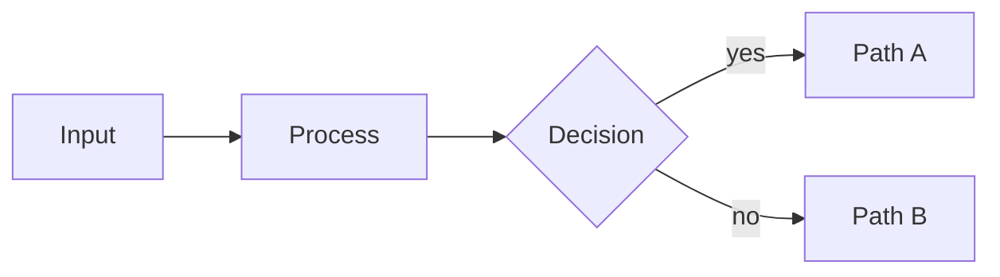

# Lattice — Component Reference

> Canonical reference for every Lattice slide component, aggregated from the component manifests (the single source of truth). Generated by `tools/build-docs-portal.js` — do not edit by hand; edit the manifests and re-run `npm run docs:portal`.

**59 components · 12 buckets.** For the themable, browsable edition see [components.html](./components.html).

## Contents

- [Anchor](#anchor) — where you are in the deck.
  - [`closing`](#closing)
  - [`divider`](#divider)
  - [`subtopic`](#subtopic)
  - [`title`](#title)
- [Statement](#statement) — one declarative claim per slide.
  - [`big-number`](#big-number)
  - [`content`](#content)
  - [`quote`](#quote)
  - [`split-brief`](#split-brief)
  - [`split-list`](#split-list)
  - [`split-statement`](#split-statement)
- [Inventory](#inventory) — parallel sets of related items.
  - [`actors`](#actors)
  - [`agenda`](#agenda)
  - [`cards-grid`](#cards-grid)
  - [`cards-side`](#cards-side)
  - [`cards-stack`](#cards-stack)
  - [`cards-wide`](#cards-wide)
  - [`checklist`](#checklist)
  - [`glossary`](#glossary)
  - [`list`](#list)
  - [`list-tabular`](#list-tabular)
  - [`principles`](#principles)
  - [`tldr`](#tldr)
- [Comparison](#comparison) — how two or more options differ.
  - [`before-after`](#before-after)
  - [`compare-prose`](#compare-prose)
  - [`compare-table`](#compare-table)
  - [`decision`](#decision)
  - [`matrix-2x2`](#matrix-2x2)
  - [`redline`](#redline)
  - [`split-compare`](#split-compare)
  - [`verdict-grid`](#verdict-grid)
- [Progression](#progression) — ordered movement through stages or time.
  - [`journey`](#journey)
  - [`list-criteria`](#list-criteria)
  - [`list-steps`](#list-steps)
  - [`roadmap`](#roadmap)
  - [`split-steps`](#split-steps)
  - [`timeline`](#timeline)
- [Evidence](#evidence) — data that supports the argument.
  - [`kpi`](#kpi)
  - [`split-metric`](#split-metric)
  - [`stats`](#stats)
- [Imagery](#imagery) — visuals that carry their own meaning.
  - [`featured`](#featured)
  - [`image`](#image)
- [Chart](#chart) — series-substance data visualizations (SVG kernel).
  - [`gantt`](#gantt)
  - [`kanban`](#kanban)
  - [`piechart`](#piechart)
  - [`progress`](#progress)
  - [`quadrant`](#quadrant)
  - [`radar`](#radar)
  - [`state-chart`](#state-chart)
  - [`timeline-list`](#timeline-list)
  - [`word-cloud`](#word-cloud)
- [Diagram](#diagram) — graph-substance network visuals (external renderer).
  - [`diagram`](#diagram)
- [Math](#math) — typeset equations and proofs.
  - [`math`](#math)
- [Code](#code) — syntax-highlighted source code blocks.
  - [`code`](#code)
  - [`compare-code`](#compare-code)
- [Legal](#legal) — citation-aware layouts for statutes, obligations, and regulatory change.
  - [`authority-chain`](#authority-chain)
  - [`citation-card`](#citation-card)
  - [`obligation-matrix`](#obligation-matrix)
  - [`regulatory-update`](#regulatory-update)
  - [`statute-stack`](#statute-stack)

## Anchor

*where you are in the deck.*

### closing

> Final slide. Dark canvas mirror of title.

**Function** anchor · **Form** bookend · **Substance** prose

Last slide of every deck. Restates the takeaway or call-to-action. Like title, suppresses header/footer/pagination — the dark canvas signals "we're done."

#### When to use

- **Last slide of every deck.** Closes the bookend pair with title. Restates the takeaway, the call to action, or the next-steps line. The dark canvas tells the audience visually that the presentation is over.
- **Single takeaway line.** The h1 is the slide. Keep it to one editorial line that summarizes the whole deck or names the action the audience should take. The eyebrow can carry a sub-line or link.
- **Accent modifier for emphasis.** Pair with the universal `accent` modifier to recolor the focal heading. Useful when the closing line is a quote or a key decision the deck has been building toward.

#### When NOT to use

- **Multi-line h1.** Keep the closing line to one editorial sentence. The layout is centered and large — two-line closings get cramped and lose impact.
- **Header or footer overrides.** Don't reinstate `_header:` or `_footer:` on the closing. The dark canvas is the "we're done" signal; chrome breaks it. Use the `silent` modifier to suppress all three in one token.
- **Mid-deck closing.** If the audience needs a strong statement mid-deck, use `big-number` or `content` with the `dark` modifier. Reserving closing for the final slide preserves its bookend role.

#### Authoring

```markdown
<!-- _class: closing -->
<!-- _paginate: false -->
<!-- _header: '' -->
<!-- _footer: '' -->

# Closing takeaway or call to action

`Optional eyebrow`
```

#### Slots

| Slot | Selector | Required | Description |
|---|---|---|---|
| `heading` | `h1` | yes | Closing line — takeaway, thank-you, or call to action. |
| `eyebrow` | `p > code` | no | Optional category label. |
| `subtitle` | `p` | no | Optional supporting line. |

#### Anatomy

```text
┌─────────────────────────────────────────┐
│            [dark background]            │
│                                         │
│                 CLOSING                 │
│                                         │
│             Take this away              │
│              ── accent ──               │
│                                         │
│                                         │
└─────────────────────────────────────────┘
```

#### Variants (layout-specific)

##### `numbered` — Numbered — independent closing counter

Stamps an auto-incrementing closing number, independent of the divider section counter. Useful for serialized deck families where each deck closes on numbered note `Closing 04`.

```markdown
<!-- _class: closing silent numbered -->

# Take this away.

`Closing 04`
```

#### Universal modifiers

This layout accepts all universal variants (`dark`, `compact`, `loose`, `accent`, state markers, treatments). See [reference/design-system.md §6.5](../../reference/design-system.md#65-universal-variants--three-tiers) for the catalog.

#### Related components

- [`title`](#title) — opens the deck — same dark-bookend chrome
- [`divider`](#divider) — mid-deck section breaks — same dark canvas
- [`big-number`](#big-number) — single emphatic statement mid-deck without the bookend signal

#### Demo deck

See [closing.gallery.pdf](../../lib/components/anchor/closing/closing.gallery.light.pdf) for rendered examples of every variant.

### divider

> Section boundary slide. Dark canvas with a single heading.

**Function** anchor · **Form** divider · **Substance** prose

Marks the start of a major section. Use sparingly — every divider is a context switch for the audience. A 30-slide deck typically has 3-5 dividers; more becomes navigation noise.

#### When to use

- **Major section starts.** Marks the boundary between two themed sections of the deck. The dark canvas is a strong context-switch signal — use it when the audience needs to re-orient.
- **Sparingly.** A 30-slide deck typically has 3-5 dividers. More becomes navigation noise; the signal weakens if every third slide is a divider.
- **With an eyebrow.** An inline-code paragraph above the h1 stamps a section number or category label. Useful for serialized decks where the audience needs to remember which section they're in.

#### When NOT to use

- **More than five per deck.** Each divider is a hard context switch. Too many dilutes the signal and slows the audience. Group related content under fewer sections instead.
- **Section title that doesn't earn a section.** If the next 3-4 slides aren't a coherent unit, a subtopic (lighter, on the bright canvas) is the right tool. Reserve dividers for genuine section starts.
- **Header or footer overrides.** Don't reinstate `_header:` or `_footer:` on a divider. The dark canvas is meant to be uninterrupted; chrome belongs on body slides.

#### Authoring

```markdown
<!-- _class: divider -->
<!-- _paginate: false -->
<!-- _header: '' -->
<!-- _footer: '' -->

`Section 01`

# Section name
```

#### Slots

| Slot | Selector | Required | Description |
|---|---|---|---|
| `heading` | `h1` | yes | Section name. |
| `eyebrow` | `p > code` | no | Optional section number or category label above h1. |

#### Anatomy

```text
┌─────────────────────────────────────────┐
│            [dark background]            │
│                                         │
│               SECTION 02                │
│                                         │
│            Section headline             │
│              ── accent ──               │
│                                         │
│                                         │
└─────────────────────────────────────────┘
```

#### Variants (layout-specific)

##### `numbered` — Numbered — auto-incrementing section index

Stamps an auto-incrementing section number in the corner. Each divider in the deck increments the counter; closing slides carry an independent counter.

```markdown
<!-- _class: divider silent numbered -->

`Section 03`

# Inventory
```

#### Universal modifiers

This layout accepts all universal variants (`dark`, `compact`, `loose`, `accent`, state markers, treatments). See [reference/design-system.md §6.5](../../reference/design-system.md#65-universal-variants--three-tiers) for the catalog.

#### Related components

- [`title`](#title) — opens the deck — same dark-bookend chrome
- [`subtopic`](#subtopic) — lighter mid-section orientation on the bright canvas
- [`closing`](#closing) — closes the deck — completes the bookend trio

#### Demo deck

See [divider.gallery.pdf](../../lib/components/anchor/divider/divider.gallery.light.pdf) for rendered examples of every variant.

### subtopic

> Sub-section boundary — lighter than divider, no canvas reskin.

**Function** anchor · **Form** divider · **Substance** prose

Introduces a specific topic within a section. Use between divider and content slides for finer orientation. Same light canvas as content slides, centered heading, no special background — a lighter cousin to the dark divider.

#### When to use

- **Between divider and content.** After the dark divider opens a section, a subtopic narrows the focus to one specific topic before the audience hits the first content slide. Finer-grained orientation.
- **Lighter than divider.** Same bright canvas as body slides — keeps the visual rhythm intact while still signaling a topic shift. Lighter context-switch cost than a divider.
- **Eyebrow names the topic family.** The inline-code paragraph above the heading is the breadcrumb. "Section 02 · Module 03" tells the audience exactly where they are in the deck's hierarchy.

#### When NOT to use

- **Used as a divider replacement.** If the next slides are an entirely new section, reach for divider (dark canvas, h1). Subtopic is for sub-section orientation, not section starts.
- **Stacked subtopics.** Two subtopic slides back-to-back means the first didn't introduce anything. Merge them or move directly to content.
- **h1 instead of h2.** The layout expects h2 (subtopic name is one level below the section title). Promoting to h1 makes the slide compete visually with the divider.

#### Authoring

```markdown
<!-- _class: subtopic -->

`Topic family`

## Sub-topic name.
```

#### Slots

| Slot | Selector | Required | Description |
|---|---|---|---|
| `heading` | `h2` | yes | Sub-topic name. |
| `eyebrow` | `p > code` | no | Optional eyebrow label above h2. |

#### Anatomy

```text
┌─────────────────────────────────────────┐
│                                         │
│                                         │
│                MODULE 03                │
│                                         │
│            Sub-topic heading            │
│          One-line orientation           │
│                                         │
│                                         │
└─────────────────────────────────────────┘
```

#### Variants (layout-specific)

##### `numbered` — Numbered — auto-incrementing module index

Stamps an auto-incrementing module number. Each subtopic carries an independent counter from divider's section counter, so "Section 02 · Module 04" makes sense.

```markdown
<!-- _class: subtopic numbered -->

`Module 04`

## Then the next sub-topic, numbered automatically.
```

#### Universal modifiers

This layout accepts all universal variants (`dark`, `compact`, `loose`, `accent`, state markers, treatments). See [reference/design-system.md §6.5](../../reference/design-system.md#65-universal-variants--three-tiers) for the catalog.

#### Related components

- [`divider`](#divider) — major section starts — darker, h1, dedicated canvas
- [`title`](#title) — opens the deck — same dark-bookend chrome as divider
- [`content`](#content) — the body slides that follow a subtopic

#### Demo deck

See [subtopic.gallery.pdf](../../lib/components/anchor/subtopic/subtopic.gallery.light.pdf) for rendered examples of every variant.

### title

> Opening slide. Dark canvas, centered, no chrome.

**Function** anchor · **Form** bookend · **Substance** prose

First slide of every deck. Sets the topic and the visual tone. Suppresses header, footer, and pagination (or use the universal `silent` modifier for the same effect in one token).

#### When to use

- **First slide of every deck.** Sets topic, audience, and visual tone in one glance. The dark canvas anchors the deck visually so subsequent slides feel like a continuous document.
- **Brand or section bookends.** Pair with `divider` (mid-deck section breaks) and `closing` (the final slide) for the full anchor trio. All three share the dark-bookend treatment.
- **Pitch and proposal openings.** When the audience needs the headline and the framing line before any data. The subtitle paragraph is where the framing line goes.

#### When NOT to use

- **Mid-deck statements.** Use `big-number` or `content` for emphatic statements inside a deck. Reaching for the title chrome mid-deck breaks the bookend signal.
- **Multi-line h1.** Keep the h1 to one editorial line. The layout is centered and large — two-line titles get cramped and lose impact.
- **Header or footer overrides.** Don't add back `_header:` or `_footer:` on a title slide. The dark canvas is meant to be uninterrupted; chrome belongs on body slides.

#### Authoring

```markdown
<!-- _class: title -->
<!-- _paginate: false -->
<!-- _header: '' -->
<!-- _footer: '' -->

# Deck title goes here

`Category · Date or audience`

One-line subtitle that frames the deck.
```

#### Slots

| Slot | Selector | Required | Description |
|---|---|---|---|
| `heading` | `h1` | yes | Deck title. |
| `eyebrow` | `p > code` | no | Optional category label below the h1 (inline-code paragraph). |
| `subtitle` | `p` | no | Optional plain-paragraph subtitle below the eyebrow. |

#### Anatomy

```text
┌─────────────────────────────────────────┐
│            [dark background]            │
│                                         │
│              EYEBROW LABEL              │
│                                         │
│           Display Title Here            │
│              ── accent ──               │
│           Subtitle or tagline           │
│                                         │
└─────────────────────────────────────────┘
```

#### Universal modifiers

This layout accepts all universal variants (`dark`, `compact`, `loose`, `accent`, state markers, treatments). See [reference/design-system.md §6.5](../../reference/design-system.md#65-universal-variants--three-tiers) for the catalog.

#### Related components

- [`divider`](#divider) — mid-deck section breaks — same dark-bookend chrome
- [`closing`](#closing) — the final slide — closes the bookend pair
- [`subtopic`](#subtopic) — lighter mid-deck orientation slide on the bright canvas

#### Demo deck

See [title.gallery.pdf](../../lib/components/anchor/title/title.gallery.light.pdf) for rendered examples of every variant.

## Statement

*one declarative claim per slide.*

### big-number

> Single oversized number as the focal claim.

**Function** statement · **Form** canvas · **Substance** prose

Use to make one metric land. The number should be the headline — supporting text is one short caption. The whole slide is the chart.

#### When to use

- **One metric carries the slide.** When the audience needs to remember exactly one number from this part of the deck. The whole slide is the chart — no surrounding context, no comparisons, no axes.
- **Headline that earns the canvas.** Reach for big-number when the metric is the argument: cost reduced by 4×, audience reach grew 92%, time-to-decision dropped from 14 days to 4. One claim, one canvas.
- **Eyebrow names the metric class.** The inline-code eyebrow contextualizes the number ("Audience recall", "Q3 revenue", "Latency p99"). The number is the value; the eyebrow is the label.

#### When NOT to use

- **Multiple metrics on one slide.** Two big numbers on one canvas dilute both. Use `stats` for a row of three metrics or `kpi` for a grid of four; reserve big-number for genuinely solo claims.
- **Caption longer than one line.** If the caption needs a sentence to explain, the number isn't carrying the slide. Either trim the number's claim or move to `content` where prose has room.
- **Decorative numbers without an argument.** "99.99% uptime" by itself is a boast, not a claim. Big-number works when the number is the answer to a question the audience came in with.

#### Authoring

```markdown
<!-- _class: big-number -->

`Optional eyebrow`

- 92%
  - of the audience remembers a single number from a deck.
```

#### Slots

| Slot | Selector | Required | Description |
|---|---|---|---|
| `eyebrow` | `p > code` | no | Optional label above the number. |
| `number` | `ul > li:first-child` | yes | First list item: the giant number. |
| `caption` | `ul > li:first-child > ul > li` | no | One-line caption below the number (nested bullet). |

#### Anatomy

```text
┌─────────────────────────────────────────┐
│  header                                 │
│  EYEBROW                                │
│                                         │
│                 ┌─────┐                 │
│                 │ 42× │                 │
│                 └─────┘                 │
│                                         │
│      Caption explains the number.       │
│  footer                           1/19  │
└─────────────────────────────────────────┘
```

#### Universal modifiers

This layout accepts all universal variants (`dark`, `compact`, `loose`, `accent`, state markers, treatments). See [reference/design-system.md §6.5](../../reference/design-system.md#65-universal-variants--three-tiers) for the catalog.

#### Related components

- [`stats`](#stats) — row of 2-3 metrics, comparable visual weight
- [`kpi`](#kpi) — grid of 4-6 metrics with status indicators
- [`split-metric`](#split-metric) — the metric needs a paragraph of context alongside it
- [`content`](#content) — the argument is mostly prose with a number embedded

#### Demo deck

See [big-number.gallery.pdf](../../lib/components/statement/big-number/big-number.gallery.light.pdf) for rendered examples of every variant.

### content

> Generic prose slide — heading plus paragraphs or a short list.

**Function** statement · **Form** canvas · **Substance** prose

The catch-all for explanatory content that doesn't fit a more structured layout. Resist using it when a more specific component (cards-grid, stats, compare-prose) would shape the content better.

#### When to use

- **Explanatory prose that doesn't shape.** A paragraph that develops one idea. No comparisons to spell out, no inventory to grid, no metric to highlight — just prose with a heading. The catch-all when shape would be forced.
- **Under forty words.** Content slides earn their place when they're brief. Past 40 words the slide becomes a wall of text and the audience stops reading. Trim or split into two slides.
- **Optional short bullet list.** If the paragraph wants two or three loose qualifications, a bullet list below the prose is fine. For more than that, the content is really structured — move to a `list` or `cards-stack` slide.

#### When NOT to use

- **Forced shape into prose.** If the content is a comparison, use compare-prose. If it's a list of options, use cards-grid. If it's a sequence, use list-steps. Reaching for content when shape exists wastes the slide.
- **Wall of text.** More than 40 words and the audience tunes out. The layout doesn't fight back — it'll happily render a 200-word paragraph that nobody reads. Split or trim.
- **Multiple headings.** Content carries one heading and one idea. Two h2s on one slide reads as two slides crammed together. Split into two content slides or use a structured layout.

#### Authoring

```markdown
<!-- _class: content -->

## Slide heading.

The explanatory paragraph that develops the heading goes here. Keep the slide under forty words.

- Optional supporting point one.
- Optional supporting point two.
```

#### Slots

| Slot | Selector | Required | Description |
|---|---|---|---|
| `heading` | `h2` | yes | Slide heading. |
| `body` | `section > p, section > ul` | yes | Paragraphs or a short bullet list under the heading. Keep under ~40 words. |

#### Anatomy

```text
┌─────────────────────────────────────────┐
│  header                                 │
│  EYEBROW                                │
│  Single-idea heading.                   │
│                                         │
│  Paragraph carries the slide.           │
│  One idea expanded into prose,          │
│  no lists, no chrome.                   │
│                                         │
│  footer                           1/19  │
└─────────────────────────────────────────┘
```

#### Universal modifiers

This layout accepts all universal variants (`dark`, `compact`, `loose`, `accent`, state markers, treatments). See [reference/design-system.md §6.5](../../reference/design-system.md#65-universal-variants--three-tiers) for the catalog.

#### Related components

- [`quote`](#quote) — the prose IS a quote — let the quotation chrome carry it
- [`big-number`](#big-number) — the prose IS a metric — let the number carry it
- [`cards-grid`](#cards-grid) — the prose IS a parallel list of items
- [`compare-prose`](#compare-prose) — the prose IS a two-way comparison
- [`list-steps`](#list-steps) — the prose IS an ordered sequence

#### Demo deck

See [content.gallery.pdf](../../lib/components/statement/content/content.gallery.light.pdf) for rendered examples of every variant.

### quote

> A pulled quotation, centered, with attribution.

**Function** statement · **Form** canvas · **Substance** prose

Use to land a phrase verbatim — customer voice, expert claim, mission statement. Keep under ~25 words. The quote IS the slide; the attribution is the supporting credit.

#### When to use

- **Verbatim language matters.** When the audience needs to hear the words exactly as they were said — customer feedback, expert claim, regulatory text, mission statement. Paraphrasing would lose the impact.
- **One breath of reading.** Keep the quotation under ~25 words. The audience reads silently in one breath; longer than that and they're scanning, not feeling the words.
- **Attribution earns the quote.** Anonymous quotes feel weak. Attribute the speaker, their role, and the context ("Head of Product, Pilot Team 3" beats just "a customer"). The attribution is the credibility.

#### When NOT to use

- **Paragraph-length quotes.** If the quote runs past 25 words, the slide is reading like a wall of text. Trim aggressively or use `split-statement` (gives the quote half the slide alongside spelled-out implications).
- **Multiple quotes per slide.** Two quotes on one canvas dilute both. The whole point is that one quote earns the whole slide. For a montage of customer voices, use successive quote slides.
- **Decorative quotes.** If the quote could be paraphrased without losing anything, the slide doesn't need to be a quote slide. Move the idea into `content` and skip the chrome.

#### Authoring

```markdown
<!-- _class: quote -->

> The quoted sentence sits here, kept short enough to read in one breath.

Attribution — Person, Role
```

#### Slots

| Slot | Selector | Required | Description |
|---|---|---|---|
| `quotation` | `blockquote > p` | yes | The quoted text. |
| `attribution` | `section > p:last-child` | no | Attribution line below the quote. |

#### Anatomy

```text
┌─────────────────────────────────────────┐
│  header                                 │
│                                         │
│       "A pulled quote that fills        │
│        the centre of the slide."        │
│                                         │
│          — Attribution, source          │
│                                         │
│  footer                           1/19  │
└─────────────────────────────────────────┘
```

#### Universal modifiers

This layout accepts all universal variants (`dark`, `compact`, `loose`, `accent`, state markers, treatments). See [reference/design-system.md §6.5](../../reference/design-system.md#65-universal-variants--three-tiers) for the catalog.

#### Related components

- [`split-statement`](#split-statement) — the quote needs implications spelled out alongside it
- [`content`](#content) — the language is paraphrasable — let prose carry it
- [`big-number`](#big-number) — the most memorable thing is a metric, not a phrase

#### Demo deck

See [quote.gallery.pdf](../../lib/components/statement/quote/quote.gallery.light.pdf) for rendered examples of every variant.

### split-brief

> Executive brief — dark left anchor, findings list on the right with left-rule chrome.

**Function** statement · **Form** split · **Substance** structure

Use when one paragraph of executive context needs to read alongside three or four substantiating findings. The dark left panel is the anchor; the right panel is the evidence.

#### When to use

- **Executive context + findings.** When the slide needs both a paragraph of framing AND a list of substantiating points. The dark left panel carries the framing; the right list carries the evidence. Pure list (no framing) belongs in `list` or `cards-stack`.
- **Three to four findings.** Sweet spot is 3-4 findings. Fewer wastes the layout's grid; more crowds the right panel and the audience loses scannability.
- **Executive audiences.** The brief shape mirrors how analysts and execs structure memos: thesis on the left, evidence on the right. Reach for split-brief when the deck reads like a memo, not a presentation.

#### When NOT to use

- **More than 5 findings.** Past 5 findings, the right panel becomes a wall of bullets and the layout's balance breaks. Split into two slides or use `cards-stack` for a fuller list.
- **Lede that's not a sentence.** The lede is the framing. A fragment or eyebrow-style phrase wastes the role. Write one declarative sentence that sets up why the findings matter.
- **Findings without titles.** The **Title.** at the start of each li is what makes the right panel scannable. A naked sentence per bullet reads as paragraph soup; the bold lead is the structure.

#### Authoring

```markdown
<!-- _class: split-brief -->

`Eyebrow context`

## Headline that anchors the brief.

One-sentence framing paragraph explaining what the findings cover.

- **First finding.** Supporting detail explaining the first finding.
- **Second finding.** Supporting detail explaining the second finding.
- **Third finding.** Supporting detail explaining the third finding.
```

#### Slots

| Slot | Selector | Required | Description |
|---|---|---|---|
| `eyebrow` | `p:first-of-type > code` | no | Optional inline-code eyebrow above the heading. |
| `heading` | `h2` | yes | Heading shown in the dark left anchor. |
| `lede` | `p` | yes | One-sentence framing paragraph under the heading. |
| `findings` | `ul > li` | yes | Right-side findings. Lead each with **Title.** then nested body lines. |

#### Anatomy

```text
┌─────────────────────────────────────────┐
│  header                                 │
│  ┌────────────┐                         │
│  │ BRIEF      │  Executive paragraph    │
│  │            │  on the right carries   │
│  │ Brief      │  the body content,      │
│  │ title      │  two or three lines.    │
│  └────────────┘                         │
│  footer                           1/19  │
└─────────────────────────────────────────┘
```

#### Universal modifiers

This layout accepts all universal variants (`dark`, `compact`, `loose`, `accent`, state markers, treatments). See [reference/design-system.md §6.5](../../reference/design-system.md#65-universal-variants--three-tiers) for the catalog.

#### Related components

- [`split-list`](#split-list) — the right side is a list of supporting points, not findings
- [`split-statement`](#split-statement) — the left side carries a quote, not a thesis
- [`cards-stack`](#cards-stack) — the slide is mostly the list of findings; no executive framing needed
- [`tldr`](#tldr) — 5+ one-line takeaways without supporting detail

#### Demo deck

See [split-brief.gallery.pdf](../../lib/components/statement/split-brief/split-brief.gallery.light.pdf) for rendered examples of every variant.

### split-list

> Featured left panel + supporting list on the right.

**Function** statement · **Form** panel · **Substance** structure

Use when one prominent statement deserves a dark sidebar and the right side carries the substantiating points.

#### When to use

- **Thesis plus proof.** One bold claim deserves dedicated visual weight on the left; supporting points sit to the right. Use when the audience needs to hear the claim before the evidence.
- **Section openers with substance.** More substantive than a divider, but still anchored by a single statement. Three to four supporting points keep the panel from feeling cluttered.
- **Mirror for image-heavy decks.** The `mirror` variant flips the panel to the right. Useful when the deck's visual rhythm wants accents on alternating sides.

#### When NOT to use

- **Longer than four points.** If the right side runs past four points, the panel and list lose balance. Move to `cards-stack` for longer lists or split into two slides.
- **No panel headline.** The dark panel exists to carry a statement. An empty or generic heading wastes the strongest visual real estate on the slide.
- **Stacking many split-list slides in a row.** The dark sidebar is a strong visual signal. Three split-list slides back-to-back numbs the audience to it. Intersperse with content or stats.

#### Authoring

```markdown
<!-- _class: split-list -->

## Panel headline that frames the side points.

### Section rubric

- First point
  - Supporting sentence explaining the first point.
- Second point
  - Supporting sentence explaining the second point.
- Third point
  - Supporting sentence explaining the third point.
```

#### Slots

| Slot | Selector | Required | Description |
|---|---|---|---|
| `panel-heading` | `h2` | yes | Heading shown in the dark left panel. |
| `panel-eyebrow` | `h3` | no | Optional rubric label below the panel heading. |
| `points` | `ul > li` | yes | Right-side supporting points. Lead each with **Label.** then body text. |

#### Anatomy

```text
┌─────────────────────────────────────────┐
│  header                                 │
│  ┌────────────┐                         │
│  │ EYEBROW    │  Section heading        │
│  │            │                         │
│  │ Panel      │  - Point one            │
│  │ title      │  - Point two            │
│  │            │  - Point three          │
│  └────────────┘                         │
│  footer                           1/19  │
└─────────────────────────────────────────┘
```

#### Variants (layout-specific)

##### `mirror` — Mirror — panel on the right

Flips the dark accent panel from the left to the right. Use when the deck's visual rhythm wants alternating accent sides, or when the right-to-left reading flow suits the claim.

```markdown
<!-- _class: split-list mirror -->

## And the same claim, now with the panel on the right.

### Use when

- Decks with image slides
  - Image bleed sits left; the panel reads as a closing statement on the right.
- Alternating visual rhythm
  - Pair a default split-list and a mirrored one across a section to keep the eye moving.
- Right-to-left framing
  - The argument reads more naturally when the claim follows the evidence rather than preceding it.
```

#### Universal modifiers

This layout accepts all universal variants (`dark`, `compact`, `loose`, `accent`, state markers, treatments). See [reference/design-system.md §6.5](../../reference/design-system.md#65-universal-variants--three-tiers) for the catalog.

#### Related components

- [`split-statement`](#split-statement) — thesis + one big-number — quantitative version of split-list
- [`split-brief`](#split-brief) — title-style left + executive paragraph right
- [`big-number`](#big-number) — single statement, no supporting list — the full-canvas version
- [`cards-stack`](#cards-stack) — the right-side list grows past four points

#### Demo deck

See [split-list.gallery.pdf](../../lib/components/statement/split-list/split-list.gallery.light.pdf) for rendered examples of every variant.

### split-statement

> Pull quote — half the slide committed to one quoted idea on a dark left panel, supporting list on the right.

**Function** statement · **Form** split · **Substance** structure

Use when one quotation deserves the full attention of a slide and the implications need spelling out. Distinct from `quote` (which is the whole slide); split-statement gives equal room to quote and consequences.

#### When to use

- **Quote + implications.** When a quotation matters AND you need to spell out the consequences alongside it. Pure quote (no implications) → `quote` slide. Pure list (no quote) → `cards-stack`. split-statement is the hybrid.
- **Expert claims that argue for action.** Customer voice, analyst quote, founder principle — the kind of phrase that ought to drive a decision. The right panel makes the decision explicit so the audience doesn't have to infer it.
- **Two-line quotation max.** The left panel is large but not infinite. Past two sentences the italic display font crowds. Trim the quote or split into a `quote` slide followed by an `cards-stack` of implications.

#### When NOT to use

- **Implications that just paraphrase the quote.** If the right-panel bullets are restating what the quote said, the slide is doing two jobs that should be one. Either trust the quote (use `quote`) or make implications that genuinely extend it.
- **Quote shorter than the implications.** When the quote is one phrase and the right panel has three paragraphs of body, the visual balance breaks. Either lengthen the quote (within reason) or move to `split-brief` (lede + findings).
- **No attribution.** The inline-code cite line is what makes a pull quote credible. An unattributed quote in a deck reads as the author's invention; attribution earns the visual weight.

#### Authoring

```markdown
<!-- _class: split-statement -->

> The quotation, one or two sentences worth committing half the slide to.

`Speaker · Role, Organisation, Year`

- **First implication.** What this quote means for the work in front of us.
- **Second implication.** A second-order consequence worth naming.
- **Third implication.** The action this quote argues for.
```

#### Slots

| Slot | Selector | Required | Description |
|---|---|---|---|
| `quotation` | `blockquote` | yes | The pull quote — one or two sentences, italic display font in the dark left panel. |
| `cite` | `p:first-of-type > code` | no | Optional attribution in an inline-code paragraph after the blockquote. |
| `implications` | `ul > li` | yes | Right-side supporting points. Lead each with **Title.** then nested body. |

#### Anatomy

```text
┌─────────────────────────────────────────┐
│  header                                 │
│  ┌────────────┐                         │
│  │            │  ┌─────────┐            │
│  │ Claim on   │  │   42×   │            │
│  │ the left   │  └─────────┘            │
│  │            │  Caption beside it      │
│  └────────────┘                         │
│  footer                           1/19  │
└─────────────────────────────────────────┘
```

#### Universal modifiers

This layout accepts all universal variants (`dark`, `compact`, `loose`, `accent`, state markers, treatments). See [reference/design-system.md §6.5](../../reference/design-system.md#65-universal-variants--three-tiers) for the catalog.

#### Related components

- [`quote`](#quote) — the quote IS the slide — no implications needed
- [`split-brief`](#split-brief) — the left carries a thesis statement, not a quote
- [`split-list`](#split-list) — the right side is supporting points, no quoted claim on the left

#### Demo deck

See [split-statement.gallery.pdf](../../lib/components/statement/split-statement/split-statement.gallery.light.pdf) for rendered examples of every variant.

## Inventory

*parallel sets of related items.*

### actors

> Roster of responsibilities owned by named actors.

**Function** inventory · **Form** ledger · **Substance** structure

Use to show 'who owns what' across a process, codebook, or org chart. Two-column layout: actor on left, responsibilities on right.

#### When to use

- **Who owns what.** Each row pairs a named actor with the slice of work they own. Use when the audience needs to know accountability, not process flow.
- **Three to six actors.** The ledger reads cleanly up to about six rows. Past that, split the roster across two slides or roll up adjacent roles.
- **One-line responsibilities.** Each actor's body is a short responsibility summary, not a job description. Detail belongs on a follow-up slide or in an appendix.

#### When NOT to use

- **Process sequence.** If the rows describe stages in order, use list-steps or process-flow. actors is for parallel ownership, not handoff sequence.
- **Long per-actor prose.** More than one sentence per row crowds the ledger. Move the detail to a dedicated slide and keep actors as the index.
- **Roles without names.** If the labels are job titles in the abstract ("the engineer"), reach for cards-stack or list. The actors layout earns its weight when the names are named.

#### Authoring

```markdown
<!-- _class: actors -->

## Who owns each part of the process.

- **First actor.** Owns the first part of the lifecycle.
- **Second actor.** Owns the second part.
- **Third actor.** Owns the third part.
- **Fourth actor.** Owns the fourth part.
```

#### Slots

| Slot | Selector | Required | Description |
|---|---|---|---|
| `title` | `h2` | yes | Slide heading. |
| `rows` | `ul > li` | yes | One row per actor. Lead each li with **Actor Name.** then a short responsibility summary. |

#### Anatomy

```text
┌─────────────────────────────────────────┐
│  header                                 │
│  Actors heading.                        │
│                                         │
│  Role A    Owner name                   │
│            - responsibility one         │
│  Role B    Owner name                   │
│            - responsibility two         │
│                                         │
│  footer                           1/19  │
└─────────────────────────────────────────┘
```

#### Universal modifiers

This layout accepts all universal variants (`dark`, `compact`, `loose`, `accent`, state markers, treatments). See [reference/design-system.md §6.5](../../reference/design-system.md#65-universal-variants--three-tiers) for the catalog.

#### Related components

- [`list-tabular`](#list-tabular) — rows are reference entries, not owners
- [`cards-stack`](#cards-stack) — each item needs two sentences of body text
- [`principles`](#principles) — stating shared rules rather than per-actor responsibilities
- [`glossary`](#glossary) — the left column is a term, not an actor

#### Demo deck

See [actors.gallery.pdf](../../lib/components/inventory/actors/actors.gallery.light.pdf) for rendered examples of every variant.

### agenda

> Auto-numbered table of contents for the deck.

**Function** inventory · **Form** stack · **Substance** structure

Use as the second slide of any multi-section deck. Numbers are generated; authors just write the section titles.

#### When to use

- **Second slide of the deck.** Right after the title, before the first section. Orients the audience and sets the cadence of what's coming.
- **Three to six sections.** Sweet spot is four. Past six sections the list crowds and the audience stops counting. Roll up or split the deck.
- **Reuse with progress variants.** Drop the same agenda between sections with `progress-N` to show how far through the deck the room is. Lightweight wayfinding.

#### When NOT to use

- **Sub-bullets per section.** The agenda is a wayfinder, not a treatment. If a section needs decomposition, that belongs on a subtopic divider when the section opens — not here.
- **Unnumbered list.** Authoring with `-` instead of `1.` loses the numbered chrome the layout depends on. Always use ordered list syntax.
- **Single-section decks.** If the deck has no sections to enumerate, skip the agenda. Empty wayfinding is more friction than no wayfinding.

#### Authoring

```markdown
<!-- _class: agenda -->

## What this deck covers.

1. First section title
2. Second section title
3. Third section title
4. Fourth section title
```

#### Slots

| Slot | Selector | Required | Description |
|---|---|---|---|
| `title` | `h2` | yes | Slide heading — typically 'Agenda' or 'What we'll cover'. |
| `items` | `ol > li` | yes | Ordered list of section titles. |

#### Anatomy

```text
┌─────────────────────────────────────────┐
│  header                                 │
│  Agenda heading.                        │
│                                         │
│  01  First section topic                │
│  02  Second section topic               │
│  03  Third section topic                │
│  04  Fourth section topic               │
│                                         │
│  footer                           1/19  │
└─────────────────────────────────────────┘
```

#### Variants (layout-specific)

##### `progress-1` — Progress · section 1

Wayfinding for the start of the deck — the first item is current, the rest are dimmed ahead.

```markdown
<!-- _class: agenda progress-1 -->

## Where we are now.

1. The four-layer model — Function · Form · Substance · Finish
2. Component manifests — the single source of truth
3. The shipped components, grouped by function
4. Discovery — scaffolder, snippets, this gallery
5. What ships next — open questions and follow-ups
```

##### `progress-2` — Progress · section 2

The same agenda dropped between sections one and two — the second item is marked as the current position.

```markdown
<!-- _class: agenda progress-2 -->

## Where we are now.

1. The four-layer model — Function · Form · Substance · Finish
2. Component manifests — the single source of truth
3. The forty-five shipped components, grouped by function
4. Discovery — scaffolder, snippets, this gallery
5. What ships next — open questions and follow-ups
```

##### `progress-3` — Progress · section 3

Same wayfinding pattern, current position moved to the third item.

```markdown
<!-- _class: agenda progress-3 -->

## Where we are now.

1. The four-layer model — Function · Form · Substance · Finish
2. Component manifests — the single source of truth
3. The forty-five shipped components, grouped by function
4. Discovery — scaffolder, snippets, this gallery
5. What ships next — open questions and follow-ups
```

##### `progress-4` — Progress · section 4

Current position on the fourth item — three sections done, two to go.

```markdown
<!-- _class: agenda progress-4 -->

## Where we are now.

1. The four-layer model — Function · Form · Substance · Finish
2. Component manifests — the single source of truth
3. The forty-five shipped components, grouped by function
4. Discovery — scaffolder, snippets, this gallery
5. What ships next — open questions and follow-ups
```

##### `progress-5` — Progress · section 5

Current position on the fifth item — the last section opening, used as a final wayfinder before the closing.

```markdown
<!-- _class: agenda progress-5 -->

## Where we are now.

1. The four-layer model — Function · Form · Substance · Finish
2. Component manifests — the single source of truth
3. The forty-five shipped components, grouped by function
4. Discovery — scaffolder, snippets, this gallery
5. What ships next — open questions and follow-ups
```

##### `progress-6` — Progress · section 6

Same wayfinding pattern on a longer, nine-section agenda — current position at the sixth item.

```markdown
<!-- _class: agenda progress-6 -->

## Where we are now.

1. Why we're here — the problem in one slide
2. Where we are today — current architecture
3. The proposal — what changes
4. Migration plan — phases and gates
5. Risks and mitigations
6. Cost and timeline
7. Team and ownership
8. Open questions
9. Decision and next steps
```

##### `progress-7` — Progress · section 7

Current position at the seventh of nine sections — most of the deck is behind us.

```markdown
<!-- _class: agenda progress-7 -->

## Where we are now.

1. Why we're here — the problem in one slide
2. Where we are today — current architecture
3. The proposal — what changes
4. Migration plan — phases and gates
5. Risks and mitigations
6. Cost and timeline
7. Team and ownership
8. Open questions
9. Decision and next steps
```

##### `progress-8` — Progress · section 8

Current position at the eighth of nine sections — the home stretch.

```markdown
<!-- _class: agenda progress-8 -->

## Where we are now.

1. Why we're here — the problem in one slide
2. Where we are today — current architecture
3. The proposal — what changes
4. Migration plan — phases and gates
5. Risks and mitigations
6. Cost and timeline
7. Team and ownership
8. Open questions
9. Decision and next steps
```

##### `progress-9` — Progress · section 9

Current position at the final section — everything before it is marked done.

```markdown
<!-- _class: agenda progress-9 -->

## Where we are now.

1. Why we're here — the problem in one slide
2. Where we are today — current architecture
3. The proposal — what changes
4. Migration plan — phases and gates
5. Risks and mitigations
6. Cost and timeline
7. Team and ownership
8. Open questions
9. Decision and next steps
```

#### Universal modifiers

This layout accepts all universal variants (`dark`, `compact`, `loose`, `accent`, state markers, treatments). See [reference/design-system.md §6.5](../../reference/design-system.md#65-universal-variants--three-tiers) for the catalog.

#### Related components

- [`subtopic`](#subtopic) — opening a single section mid-deck
- [`divider`](#divider) — marking a section boundary without restating the menu
- [`tldr`](#tldr) — closing the deck with the takeaways the agenda promised
- [`title`](#title) — the slide immediately preceding the agenda

#### Demo deck

See [agenda.gallery.pdf](../../lib/components/inventory/agenda/agenda.gallery.light.pdf) for rendered examples of every variant.

### cards-grid

> 2–4 parallel items, similar weight, scannable in a grid.

**Function** inventory · **Form** grid · **Substance** structure

Use when the audience needs to compare or scan a small set of options at a glance. Avoid for more than 4 items — split into multiple slides. For ordered/numbered steps, use list-steps instead.

#### When to use

- **Parallel items.** Four cards or fewer, each item gets equal weight in the layout. Audience compares them at a glance.
- **Scannable at a glance.** The audience absorbs the whole set in one look — no scrolling, no eye-leaping between rows.
- **Equal information density.** Each card carries roughly the same text length. Uneven density makes the grid feel unbalanced.
- **Order is decorative.** When sequence carries meaning, use list-steps or list-criteria instead. cards-grid is for parallel options.

#### When NOT to use

- **More than 4 items.** Split into multiple slides instead. The grid loses scannability past 4 cards.
- **Order carries meaning.** Use list-steps or list-criteria. cards-grid is for parallel options, not sequences.
- **Lopsided density.** Equalize the prose when one card has three sentences and the rest have one. Otherwise change layout.
- **Inline-code-only body.** A body bullet containing only `code` gets promoted to an eyebrow label. Mix it with surrounding prose.

#### Authoring

```markdown
<!-- _class: cards-grid -->

## Slide heading.

- **First card title.** Body text for the first card, one sentence.
- **Second card title.** Body text for the second card, one sentence.
- **Third card title.** Body text for the third card, one sentence.
- **Fourth card title.** Body text for the fourth card, one sentence.
```

#### Slots

| Slot | Selector | Required | Description |
|---|---|---|---|
| `title` | `h2` | yes | Slide heading. |
| `cards` | `ul > li` | yes | Each list item becomes one card. Authoring contract: a top-level bullet is the card title (renders bold by default); an indented bullet underneath carries the body text (renders normal weight via the nested-list rule). |
| `insight` | `blockquote` | no | Optional key-insight panel above the cards. |

#### Anatomy

```text
┌─────────────────────────────────────────┐
│  header                                 │
│                  LABEL                  │
│               Grid Title                │
│                                         │
│  ┌──────────────┐     ┌──────────────┐  │
│  │ Card Title 1 │     │ Card Title 2 │  │
│  │ content      │     │ content      │  │
│  └──────────────┘     └──────────────┘  │
│  ┌──────────────┐     ┌──────────────┐  │
│  │ Card Title 3 │     │ Card Title 4 │  │
│  │ content      │     │ content      │  │
│  └──────────────┘     └──────────────┘  │
│  footer                           1/19  │
└─────────────────────────────────────────┘
```

#### Variants (layout-specific)

##### `four` — Four columns

Four equal columns instead of two. Pair with `compact` so the cards retain breathing room.

```markdown
<!-- _class: cards-grid four compact -->

## Four phases, four owners.

- Intake.
  - PM. Collect raw signals.
- Score.
  - Analyst. Apply weights.
- Decide.
  - Lead. Pick the call.
- Calibrate.
  - Team. Compare to actuals.
```

##### `three` — Three columns

Three equal columns instead of the default two. The 2+1 last-child span rule is reset to `auto`.

```markdown
<!-- _class: cards-grid three -->

## The framework has three components.

- Signal Intake.
  - Weekly structured collection across customer conversations, market data, and competitive moves. Normalized into a common schema.
- Scoring Model.
  - Each signal scored on three dimensions — confidence, recency, strategic relevance. Weights are reviewed quarterly.
- Decision Log.
  - Every decision recorded with the signals that informed it, the options considered, and the criteria applied.
```

##### `numbered` — Numbered cards

Authored as `ol` (`1.` source), the grid stamps a flush top-left accent corner tag on each card. Sublist must be indented 3 spaces to clear the `1. ` prefix.

```markdown
<!-- _class: cards-grid -->

## Signal Intake produces three outputs.

1. Weekly Signal Brief
   - A ranked list of the top 10 signals from the prior week, with confidence scores and source attribution. Distributed to product leads every Monday.
2. Anomaly Alerts
   - Real-time flags when a signal exceeds the 2σ threshold on any dimension. Routed to the accountable PM with a 4-hour response SLA.
3. Monthly Signal Index
   - The source of truth for the calibration loop. Required reading before each retrospective.
```

##### `mirror` — Mirror (no-op on symmetric grids)

The universal `mirror` modifier is declared for completeness but has no visible effect — cards-grid is a symmetric layout with no inherent left/right asymmetry to flip.

```markdown
<!-- _class: cards-grid mirror -->

## Mirror is a no-op here.

- First card.
  - Same position with or without `mirror`.
- Second card.
  - Same position with or without `mirror`.
- Third card.
  - Symmetric grids have nothing to flip.
- Fourth card.
  - This slide renders identically to the default.
```

#### Universal modifiers

This layout accepts all universal variants (`dark`, `compact`, `loose`, `accent`, state markers, treatments). See [reference/design-system.md §6.5](../../reference/design-system.md#65-universal-variants--three-tiers) for the catalog.

#### Related components

- [`list-steps`](#list-steps) — items carry an explicit sequence
- [`cards-stack`](#cards-stack) — items stack vertically as full-width rows
- [`cards-side`](#cards-side) — two-card horizontal comparison
- [`cards-wide`](#cards-wide) — three full-width rows for longer prose per item
- [`verdict-grid`](#verdict-grid) — comparing options against shared criteria

#### Demo deck

See [cards-grid.gallery.pdf](../../lib/components/inventory/cards-grid/cards-grid.gallery.light.pdf) for rendered examples of every variant.

### cards-side

> Two cards side-by-side, co-equal.

**Function** inventory · **Form** split · **Substance** structure

Use for an explicit pair — two options, two phases, two artifacts presented with equal weight.

#### When to use

- **An explicit pair.** Exactly two items that deserve equal visual weight. Two options under consideration, two phases of a rollout, two halves of a contract.
- **Neutral comparison.** When the slide should not take sides. cards-side stays balanced; compare-prose declares a winner via connector chrome.
- **Short, parallel body.** Each card carries one to two sentences of similar length. Lopsided density breaks the layout's symmetry and the audience reads it as preference.

#### When NOT to use

- **Three or more cards.** cards-side is built for exactly two slots. For three parallel items use cards-grid three; for four use cards-grid four.
- **One side is the answer.** If the deck has already chosen, use compare-prose with the winner highlighted. cards-side reads as undecided — that's the wrong signal when you've decided.
- **Long-form body per card.** More than two sentences per card crowds the split. For richer side-by-side bodies, move to split-list or two stacked rows of cards-wide.

#### Authoring

```markdown
<!-- _class: cards-side -->

## Slide heading.

- **Left card title.** Body text for the left card, two short sentences.
- **Right card title.** Body text for the right card, two short sentences.
```

#### Slots

| Slot | Selector | Required | Description |
|---|---|---|---|
| `title` | `h2` | yes | Slide heading. |
| `cards` | `ul > li` | yes | Exactly two list items, each one card. Authoring contract: a top-level bullet is the card title (renders bold by default); an indented bullet underneath carries the body text. |

#### Anatomy

```text
┌─────────────────────────────────────────┐
│  header                                 │
│            Two-card heading             │
│                                         │
│  ┌──────────────┐     ┌──────────────┐  │
│  │ Option A     │     │ Option B     │  │
│  │ body text    │     │ body text    │  │
│  └──────────────┘     └──────────────┘  │
│                                         │
│  footer                           1/19  │
└─────────────────────────────────────────┘
```

#### Variants (layout-specific)

##### `numbered` — Numbered cards

Authored as `ol` (`1.` source). Each card gets a flush top-left accent corner tag — useful when the pair carries an implicit order ("before" and "after", phase one and phase two).

```markdown
<!-- _class: cards-side -->

## Two phases, in order.

1. Discovery
   - Interviews with seven design partners, weekly cohort calls, and a structured artifact review. Lands a problem statement the team can defend.
2. Pilot
   - Two-week build cycles against the artifact, weekly demos to partners, exit interviews. Lands a go/no-go recommendation with cost and risk attached.
```

#### Universal modifiers

This layout accepts all universal variants (`dark`, `compact`, `loose`, `accent`, state markers, treatments). See [reference/design-system.md §6.5](../../reference/design-system.md#65-universal-variants--three-tiers) for the catalog.

#### Related components

- [`cards-grid`](#cards-grid) — three or four parallel items, not two
- [`cards-stack`](#cards-stack) — two items that read top-to-bottom, not left-right
- [`compare-prose`](#compare-prose) — the comparison has a winner you want to declare
- [`split-list`](#split-list) — one side is framing, the other is supporting evidence

#### Demo deck

See [cards-side.gallery.pdf](../../lib/components/inventory/cards-side/cards-side.gallery.light.pdf) for rendered examples of every variant.

### cards-stack

> Parallel items stacked vertically, full-width cards.

**Function** inventory · **Form** stack · **Substance** structure

Use when the items want vertical reading order — sequential exploration rather than a-glance comparison. 2–3 items work best.

#### When to use

- **Vertical reading order.** The audience scans top-to-bottom, not grid-style. Use when each card builds on the previous one as the eye moves down the slide.
- **Two sentences per card.** More body than cards-grid can hold without crowding. cards-stack lets each card carry one or two short sentences without losing the layout balance.
- **Two or three items.** Sweet spot is three. Past that the slide overflows — split across multiple slides or switch to cards-grid with shorter body text per card.

#### When NOT to use

- **Four or more items.** The stack overflows past three. For four parallel items reach for cards-grid four; for richer per-item bodies, cards-wide handles three or four rows.
- **One-line cards.** If each card is a single short phrase, the stack reads as a padded list. Drop to `list` or `tldr` and reclaim the vertical space.
- **Forced sequence.** Cards-stack is parallel content read in vertical order, not a numbered sequence. For explicit steps, use list-steps or list-criteria.

#### Authoring

```markdown
<!-- _class: cards-stack -->

## Slide heading.

- **First card title.** Body text for the first stacked card, two short sentences max.
- **Second card title.** Body text for the second stacked card.
- **Third card title.** Body text for the third stacked card.
```

#### Slots

| Slot | Selector | Required | Description |
|---|---|---|---|
| `title` | `h2` | yes | Slide heading. |
| `cards` | `ul > li` | yes | Each list item becomes one stacked card. Authoring contract: a top-level bullet is the card title (renders bold by default); an indented bullet underneath carries the body text. |

#### Anatomy

```text
┌─────────────────────────────────────────┐
│  header                                 │
│  Stacked-cards heading.                 │
│                                         │
│  ┌───────────────────────────────────┐  │
│  │ Card title 1 — claim or label     │  │
│  │ body text fills the wide row      │  │
│  └───────────────────────────────────┘  │
│  ┌───────────────────────────────────┐  │
│  │ Card title 2 — claim or label     │  │
│  └───────────────────────────────────┘  │
│  footer                           1/19  │
└─────────────────────────────────────────┘
```

#### Variants (layout-specific)

##### `horizontal` — Horizontal cards

Stacked rows pivot to a left-aligned title column with the body to its right — useful when the card titles are short labels and the body carries the weight.

```markdown
<!-- _class: cards-stack horizontal -->

## Three patterns, each with its own pull.

- Inventory.
  - Equal-weight items the audience scans without ordering. The cards-grid family lives here — grid, stack, wide, side.
- Comparison.
  - Two or more items weighed against shared criteria. The verdict and compare families live here — they take sides.
- Progression.
  - Items that carry an explicit sequence. The list-steps and timeline families live here — order is load-bearing.
```

##### `numbered` — Numbered stack

Authored as `ol` (`1.` source). Each row carries a flush corner number — use when the stack carries an implicit count ("three options", "four phases") even if the order is interchangeable.

```markdown
<!-- _class: cards-stack -->

## Three reasons to keep cards-stack at three items.

1. Cognitive load
   - Three is the threshold the audience can hold without effort. Past three, the slide demands working memory the room shouldn't have to spend.
2. Vertical real estate
   - Each stacked card needs ~30% of the slide height to breathe. Four cards force you to shrink the cards until they stop reading as cards.
3. Build path symmetry
   - cards-stack pairs with cards-grid (3-4 items) and cards-wide (3-4 rows). Keeping cards-stack at 2-3 keeps the family's choices clean.
```

#### Universal modifiers

This layout accepts all universal variants (`dark`, `compact`, `loose`, `accent`, state markers, treatments). See [reference/design-system.md §6.5](../../reference/design-system.md#65-universal-variants--three-tiers) for the catalog.

#### Related components

- [`cards-grid`](#cards-grid) — three or four parallel items in a scannable grid
- [`cards-wide`](#cards-wide) — three or four rows with more substantial per-card body
- [`cards-side`](#cards-side) — exactly two items in left-right balance
- [`list-steps`](#list-steps) — items carry an explicit, ordered sequence

#### Demo deck

See [cards-stack.gallery.pdf](../../lib/components/inventory/cards-stack/cards-stack.gallery.light.pdf) for rendered examples of every variant.

### cards-wide

> Three or four wide rows, each a full-width card.

**Function** inventory · **Form** stack · **Substance** structure

Use when each item has enough body text to want its own row but the slide should still scan top-to-bottom.

#### When to use

- **Substantial per-row body.** Each item carries one to two sentences — more than a cards-grid card can hold without crowding. The wide row gives the body real estate.
- **Top-to-bottom reading.** The audience absorbs one row at a time rather than the whole set at a glance. Use when sequence-of-reading matters even if items are parallel.
- **Three or four rows.** The layout is sized for three or four wide cards. Past four the slide gets dense; for longer reference lists move to list-tabular.

#### When NOT to use

- **Five or more rows.** The slide tips into wall-of-text past four rows. Move to list-tabular for reference density, or split across two cards-wide slides.
- **One-line rows.** If each row is a short phrase the wide cards look padded. Drop to `list` or `tldr` and let the short text speak for itself.
- **Comparison framing.** cards-wide is parallel inventory, not comparison. If the rows are weighed against shared criteria, use compare-table or verdict-grid.

#### Authoring

```markdown
<!-- _class: cards-wide -->

## Slide heading.

- **First row title.** Body text for the first wide row, one or two sentences.
- **Second row title.** Body text for the second wide row.
- **Third row title.** Body text for the third wide row.
```

#### Slots

| Slot | Selector | Required | Description |
|---|---|---|---|
| `title` | `h2` | yes | Slide heading. |
| `cards` | `ul > li` | yes | Three or four list items, each one wide row. Lead each with **Card Title.** then 1–2 sentences. |

#### Anatomy

```text
┌─────────────────────────────────────────┐
│  header                                 │
│  Three wide rows heading.               │
│  ┌───────────────────────────────────┐  │
│  │ Wide row 1 — full content width   │  │
│  └───────────────────────────────────┘  │
│  ┌───────────────────────────────────┐  │
│  │ Wide row 2 — full content width   │  │
│  └───────────────────────────────────┘  │
│  ┌───────────────────────────────────┐  │
│  │ Wide row 3 — full content width   │  │
│  └───────────────────────────────────┘  │
│  footer                           1/19  │
└─────────────────────────────────────────┘
```

#### Universal modifiers

This layout accepts all universal variants (`dark`, `compact`, `loose`, `accent`, state markers, treatments). See [reference/design-system.md §6.5](../../reference/design-system.md#65-universal-variants--three-tiers) for the catalog.

#### Related components

- [`cards-stack`](#cards-stack) — two or three rows with shorter body per card
- [`cards-grid`](#cards-grid) — four or fewer parallel items in a scannable grid
- [`list-tabular`](#list-tabular) — five or more reference-style rows
- [`list-steps`](#list-steps) — rows carry an explicit, ordered sequence

#### Demo deck

See [cards-wide.gallery.pdf](../../lib/components/inventory/cards-wide/cards-wide.gallery.light.pdf) for rendered examples of every variant.

### checklist

> Items with state markers — done, partial, todo.

**Function** inventory · **Form** stack · **Substance** structure

Use for completion reports, readiness audits, or pre-flight checks. State markers [x]/[-]/[ ] produce green/amber/red glyphs.

#### When to use

- **Completion reports.** Use when the audience needs to see what's done, what's in progress, and what's outstanding. The state glyphs are the load-bearing signal.
- **Readiness audits.** Pre-launch, pre-release, pre-flight. A short list where the mix of green / amber / red tells the room whether to proceed.
- **Five to eight items.** Short enough that the audience can take in the state mix at a glance. Past eight, split into two checklists by phase or owner.

#### When NOT to use

- **All-done lists.** If every item is `[x]` the state markers are decoration. Use `list` or `tldr` for celebratory recaps; checklist earns its weight when the mix matters.
- **Long per-item prose.** Each item is one short line. If a row needs a sentence of explanation, the right home is cards-stack or list-tabular.
- **Custom state markers.** Only `[x]`, `[-]`, and `[ ]` map to the glyph palette. Authoring `[?]` or `[!]` renders as literal text and breaks the visual contract.

#### Authoring

```markdown
<!-- _class: checklist -->

## Pre-launch readiness.

- [x] First item that is fully done.
- [x] Second item that is fully done.
- [-] Third item that is partially complete with a caveat.
- [ ] Fourth item that is not yet started.
```

#### Slots

| Slot | Selector | Required | Description |
|---|---|---|---|
| `title` | `h2` | yes | Slide heading. |
| `items` | `ul > li` | yes | Each item prefixed with [x] (done), [-] (partial), or [ ] (todo). Plain text follows the marker. |

#### Anatomy

```text
┌─────────────────────────────────────────┐
│  header                                 │
│  Checklist heading.                     │
│                                         │
│  [x] Completed item — green tint        │
│  [-] Partial item — amber tint          │
│  [ ] Open item — red tint               │
│  [x] Another completed item             │
│                                         │
│  footer                           1/19  │
└─────────────────────────────────────────┘
```

#### Universal modifiers

This layout accepts all universal variants (`dark`, `compact`, `loose`, `accent`, state markers, treatments). See [reference/design-system.md §6.5](../../reference/design-system.md#65-universal-variants--three-tiers) for the catalog.

#### Related components

- [`list`](#list) — items have no state — just bullets
- [`tldr`](#tldr) — summary lines without per-item completion tracking
- [`list-tabular`](#list-tabular) — rows need a label-plus-description structure, not state
- [`cards-stack`](#cards-stack) — each item needs two sentences of body

#### Demo deck

See [checklist.gallery.pdf](../../lib/components/inventory/checklist/checklist.gallery.light.pdf) for rendered examples of every variant.

### glossary

> Two-column term/definition table with auto-derived alphabetic range pill.

**Function** inventory · **Form** ledger · **Substance** structure

Use for jargon-heavy decks where the audience needs a reference page. The runtime auto-adds a range pill (e.g. 'A – G') to the heading.

#### When to use

- **Jargon-heavy decks.** When the audience needs a reference page they can flip back to. Acronyms, domain terms, internal names — anything the speaker won't define inline.
- **Five to eight entries per slide.** The ledger is sized for a short page. For longer glossaries, split alphabetically across multiple slides — the runtime stamps each with its range pill.
- **Short definitions.** Each definition is one sentence — a working gloss, not an essay. Long definitions belong on their own subtopic slide where the term is the heading.

#### When NOT to use

- **Multi-sentence definitions.** Each entry is one short line. If a definition needs context or examples, the term deserves its own slide — use subtopic with the term as the heading.
- **Mixed term lengths.** If some terms are single words and others are full phrases, the left column gets ragged. Trim long terms to their canonical short form.
- **Hand-written range pill.** The runtime derives the range pill (e.g. "A – G") from the entries. Authoring it into the heading double-stamps it.

#### Authoring

```markdown
<!-- _class: glossary -->

## Glossary

- Adjacency
  - The relationship between two slides that share an audience or context.
- Anchor
  - A title, divider, subtopic, or closing slide that orients the audience.
- Cadence
  - The deck's pacing — how much new information per slide.
```

#### Slots

| Slot | Selector | Required | Description |
|---|---|---|---|
| `title` | `h2` | yes | Slide heading — typically 'Glossary'. |
| `entries` | `ul > li` | yes | Nested bullets: outer li is the term, inner li is the definition. |

#### Anatomy

```text
┌─────────────────────────────────────────┐
│  header                                 │
│  Glossary heading.                      │
│                                         │
│  Term A    Definition or gloss.         │
│  Term B    Definition or gloss.         │
│  Term C    Definition or gloss.         │
│  Term D    Definition or gloss.         │
│                                         │
│  footer                           1/19  │
└─────────────────────────────────────────┘
```

#### Universal modifiers

This layout accepts all universal variants (`dark`, `compact`, `loose`, `accent`, state markers, treatments). See [reference/design-system.md §6.5](../../reference/design-system.md#65-universal-variants--three-tiers) for the catalog.

#### Related components

- [`list-tabular`](#list-tabular) — rows are key/value reference, not term/definition
- [`subtopic`](#subtopic) — one term needs a full slide of explanation
- [`actors`](#actors) — the left column is a named person, not a term
- [`principles`](#principles) — the entries are stated rules, not defined terms

#### Demo deck

See [glossary.gallery.pdf](../../lib/components/inventory/glossary/glossary.gallery.light.pdf) for rendered examples of every variant.

### list

> Plain bullet list under a heading.

**Function** inventory · **Form** stack · **Substance** prose

Use only when the items are genuinely a list (5–6 short points). For anything richer, prefer cards-grid, cards-stack, or list-tabular.

#### When to use

- **Genuinely a list.** Five to six short points, each under twelve words. No internal structure per item — just a heading and the bullets.
- **Numbered when order matters.** Use `ol` (`1.` source) when sequence is load-bearing; `ul` when order is interchangeable. Numbers render as a tabular leading column.
- **Pills via inline code.** Inline code at the end of a row becomes a pill (status tag, metric, owner). Lets the list double as a lightweight ledger without changing layout.

#### When NOT to use

- **Title plus body per item.** If each bullet is `**Title.** body`, the layout under-serves it. Move to cards-stack (2-3 items) or list-tabular (5+ rows) instead.
- **Wall of long bullets.** Past twelve words per line the slide becomes paragraph soup. Either trim or move to content for prose, cards-stack for structured items.
- **Two-item lists.** Two bullets read as a thin slide. For pairs, reach for cards-side or compare-prose — both give the pair the weight it deserves.

#### Authoring

```markdown
<!-- _class: list -->

## Slide heading.

- First short bullet point.
- Second short bullet point.
- Third short bullet point.
- Fourth short bullet point.
- Fifth short bullet point.
```

#### Slots

| Slot | Selector | Required | Description |
|---|---|---|---|
| `title` | `h2` | yes | Slide heading. |
| `items` | `ul > li, ol > li` | yes | List items. Keep each under ~12 words. |

#### Anatomy

```text
┌─────────────────────────────────────────┐
│  header                                 │
│  List heading.                          │
│                                         │
│  - First bulleted item                  │
│  - Second bulleted item                 │
│  - Third bulleted item                  │
│  - Fourth bulleted item                 │
│                                         │
│  footer                           1/19  │
└─────────────────────────────────────────┘
```

#### Universal modifiers

This layout accepts all universal variants (`dark`, `compact`, `loose`, `accent`, state markers, treatments). See [reference/design-system.md §6.5](../../reference/design-system.md#65-universal-variants--three-tiers) for the catalog.

#### Related components

- [`tldr`](#tldr) — single-line takeaways at the end of a section
- [`cards-stack`](#cards-stack) — each item has a title plus body sentence
- [`list-tabular`](#list-tabular) — five or more rows with label-plus-description
- [`checklist`](#checklist) — items carry state markers (done / partial / todo)

#### Demo deck

See [list.gallery.pdf](../../lib/components/inventory/list/list.gallery.light.pdf) for rendered examples of every variant.

### list-tabular

> Hairline-ruled ledger of items — name on the left, body on the right.

**Function** inventory · **Form** ledger · **Substance** structure

Use for compact reference tables: glossary-style entries, key/value pairs, specs. Four primary variants (def, metric, spec, register) tune the visual treatment; secondary modifiers (rule, solid, stacked, outline) refine each.

#### When to use

- **Compact reference rows.** Five or more rows where each row is a name plus a short description or value. Glossary-style entries, key/value pairs, technical specs.
- **Pick one primary variant.** `def` for editorial, `metric` for tiled values, `spec` for technical keys, `register` for tagged pills. Default (no variant) is the hairline ledger.
- **Numbered automatically.** Author as `ol` (`1.` source). The leading column is the counter — `def` and `spec.stacked` enlarge it to span both rows.

#### When NOT to use

- **Three or fewer rows.** The ledger needs density to justify its shape. For two or three items, reach for cards-stack or cards-wide — the rows get the room to breathe.
- **Long per-row prose.** Each row is a name plus a sentence. If the description runs two or three sentences, move to cards-wide or split across slides.
- **Stacking two primary variants.** `def`, `metric`, `spec`, and `register` are mutually exclusive. Pair each only with its secondary modifier (def+rule, metric+solid, spec+stacked, register+outline).

#### Authoring

```markdown
<!-- _class: list-tabular -->

## Slide heading.

- **First entry.** Description or value for the first entry.
- **Second entry.** Description or value for the second entry.
- **Third entry.** Description or value for the third entry.
- **Fourth entry.** Description or value for the fourth entry.
```

#### Slots

| Slot | Selector | Required | Description |
|---|---|---|---|
| `title` | `h2` | yes | Slide heading. |
| `rows` | `ul > li` | yes | Each list item is one row. Lead each with **Name.** then the description/value. |

#### Anatomy

```text
┌─────────────────────────────────────────┐
│  header                                 │
│  Ledger heading.                        │
│                                         │
│  01  Term      value     metadata       │
│  02  Term      value     metadata       │
│  03  Term      value     metadata       │
│  04  Term      value     metadata       │
│                                         │
│  footer                           1/19  │
└─────────────────────────────────────────┘
```

#### Variants (layout-specific)

##### `def` — Editorial (def)

Big counter spans both rows; eyebrow above the name. Use when the entries are conceptual definitions that want editorial weight.

```markdown
<!-- _class: list-tabular def -->

## The four layers of the design system.

1. Function `Purpose`
   - Why the slide exists — the communication job it does. Seven families.
2. Form `Composition`
   - The spatial shape the slide takes. Eleven shapes.
3. Substance `Data`
   - The kind of content that fills the shape. Four contracts.
4. Finish `Treatment`
   - The palette, typography, and chrome applied last. Theme-controlled.
```

##### `metric` — Tile (metric)

Meta renders as a bordered tile on the right — useful when each row carries a numeric value or a status the audience scans.

```markdown
<!-- _class: list-tabular metric -->

## Renderer parity — current scoreboard.

1. Marp CLI build path `334 / 334`
2. lattice-emulator inline path `334 / 334`
3. marp-vscode runtime DOM path `327 / 334`
4. Cross-renderer page-count parity `pass`
```

##### `spec` — Technical key (spec)

Mono name as a key, accent-coloured. Technical-reference feel — config keys, API parameters, environment flags.

```markdown
<!-- _class: list-tabular spec -->

## Environment flags the build path reads.

1. `LATTICE_THEME` `string`
   - Override the deck's declared theme at build time. Default: theme from front-matter.
2. `LATTICE_CACHE` `0 | 1`
   - Toggle the render helper's hash-keyed cache. Default: 1 locally, 0 on CI.
3. `LATTICE_TRACE` `0 | 1`
   - Emit per-slide transform timing to stderr. Default: 0.
```

##### `register` — Tagged pill (register)

Meta renders as an accent-soft pill — status registers, tagged inventories, role registers where the meta is a category.

```markdown
<!-- _class: list-tabular register -->

## Active components — release status.

1. cards-grid `stable`
2. split-brief `stable`
3. radar-chart `beta`
4. quadrant-chart `beta`
5. kanban-board `alpha`
```

##### `rule` — def + rule

Adds a continuous accent rail down the left edge of `def`. Anchors the column visually when the entries are long and the eye needs a guide.

```markdown
<!-- _class: list-tabular def rule -->

## The four layers of the design system.

1. Function `Purpose`
   - Why the slide exists — the communication job it does. Seven families.
2. Form `Composition`
   - The spatial shape the slide takes. Eleven shapes.
3. Substance `Data`
   - The kind of content that fills the shape. Four contracts.
4. Finish `Treatment`
   - The palette, typography, and chrome applied last. Theme-controlled.
```

##### `solid` — metric + solid

Fills the metric tile with accent colour instead of the bordered default. Use when the values are headline numbers the room should land on first.

```markdown
<!-- _class: list-tabular metric solid -->

## Quarterly headline metrics.

1. Net new ARR `$4.2M`
2. Logo retention `94%`
3. Time-to-value (median) `11d`
4. Pipeline coverage `3.2x`
```

##### `stacked` — spec + stacked

Description drops to its own row beneath the spec name. Counter enlarges to span both rows. Use when the description is longer than one line.

```markdown
<!-- _class: list-tabular spec stacked -->

## API endpoints exposed by the deck-server.

1. `GET /decks/:id` `200 | 404`
   - Returns the rendered deck metadata, slide manifest, and signed PDF URL.
2. `POST /decks/:id/render` `202 | 409`
   - Enqueues a re-render. 409 if a render is already in flight for this deck.
3. `DELETE /decks/:id/cache` `204 | 404`
   - Evicts the cached PDF and forces a cold re-render on the next read.
```

##### `outline` — register + outline

Renders the register tag as a hairline-bordered outline pill instead of the filled accent-soft default. Lighter visual weight when the deck has many register slides in a row.

```markdown
<!-- _class: list-tabular register outline -->

## Active components — release status.

1. cards-grid `stable`
2. split-brief `stable`
3. radar-chart `beta`
4. quadrant-chart `beta`
5. kanban-board `alpha`
```

#### Universal modifiers

This layout accepts all universal variants (`dark`, `compact`, `loose`, `accent`, state markers, treatments). See [reference/design-system.md §6.5](../../reference/design-system.md#65-universal-variants--three-tiers) for the catalog.

#### Related components

- [`glossary`](#glossary) — term/definition pairs with auto-derived range pill
- [`cards-stack`](#cards-stack) — two or three richer items, not a ledger
- [`actors`](#actors) — the left column is a named person, not a key
- [`principles`](#principles) — rows are stated rules, not reference entries
- [`list`](#list) — rows are bullets without a label-plus-description shape

#### Demo deck

See [list-tabular.gallery.pdf](../../lib/components/inventory/list-tabular/list-tabular.gallery.light.pdf) for rendered examples of every variant.

### principles

> Declared statements — short stated principles, each with a one-line justification.

**Function** inventory · **Form** stack · **Substance** structure

Use for design tenets, working agreements, or guiding rules. Each principle reads as a complete sentence; the justification is below.

#### When to use

- **Working agreements.** Team tenets, design principles, decision rules. Use when the slide's job is to declare how the room makes calls, not to show data.
- **Stated as commands.** Each principle is a short imperative sentence — "Default to X", "Name the actor". Statements with hedging language lose the principle's bite.
- **Three to six items.** More than six principles and the audience stops remembering them. If you have more, prioritize: the principles slide carries the load-bearing few.

#### When NOT to use

- **Aspirations, not principles.** "Be empathetic" is a value, not a principle. Principles are decision rules — they say what to do when two options conflict. Reach for content if it's a values statement.
- **Long per-principle prose.** Each justification is one sentence. If a principle needs a paragraph of context, give it its own slide and let principles act as the index.
- **Hedged statements.** "We try to default to X" reads as a wish. Drop the hedge — principles are declared, not negotiated. "Default to X" lands harder.

#### Authoring

```markdown
<!-- _class: principles -->

## How we make calls when the spec is silent.

- **Bias to action.** Default to shipping a defensible answer over chasing a perfect one.
- **Decisions over options.** Document the choice, not the menu we evaluated.
- **Cheaper to reverse than to debate.** Reversible calls don't need a meeting.
```

#### Slots

| Slot | Selector | Required | Description |
|---|---|---|---|
| `title` | `h2` | yes | Slide heading. |
| `principles` | `ul > li` | yes | One li per principle. Lead each with **The principle.** then a justification sentence. |

#### Anatomy

```text
┌─────────────────────────────────────────┐
│  header                                 │
│  Principles heading.                    │
│                                         │
│  01  First principle, stated.           │
│  02  Second principle, stated.          │
│  03  Third principle, stated.           │
│                                         │
│  footer                           1/19  │
└─────────────────────────────────────────┘
```

#### Variants (layout-specific)

##### `numbered` — Numbered principles

Authored as `ol` (`1.` source). Useful when the principles are ordered by priority — the first principle wins when two conflict.

```markdown
<!-- _class: principles -->

## How we resolve conflicts — top wins.

1. **Default to the choice that is cheaper to reverse.** Reversibility beats every other tie-breaker.
2. **Name the actor, never the system.** Anonymous accountability is no accountability.
3. **Write down the bet on the same slide as the choice.** Calibration depends on it.
4. **Form follows function.** Let audience need shape the layout.
5. **One main idea per slide.** If you can't summarise it, split it.
```

##### `lettered` — Lettered

Swaps the decimal counter for an A. / B. / C. letter sequence. Use when the principles are referenced by letter elsewhere in the deck or discussion.

```markdown
<!-- _class: principles lettered -->

## How we make calls when the spec is silent.

- **Default to the cheaper-to-reverse choice.** Reversible calls don't need a meeting; only the irreversible ones do.
- **Name the actor, never the system.** "The PM decides" lands; "the process decides" hides accountability.
- **Write the bet on the same slide as the choice.** The decision and its predicted outcome live together — the calibration loop depends on it.
- **Form follows function.** Let the audience's need shape the layout, not the other way around.
- **One main idea per slide.** If you can't summarise it in one sentence, split it across two.
```

##### `roman` — Roman

Numbers the principles with lower-case Roman numerals (i, ii, iii). Reads as a more formal canon — house rules, doctrine, a charter.

```markdown
<!-- _class: principles roman -->

## The editorial canon.

- **Plain words beat clever ones.** If a board member needs a glossary, the slide failed.
- **One claim per sentence.** Compound claims hide the one a reader would dispute.
- **Show the number, then the verdict.** Evidence first earns the conclusion that follows.
- **Cut the adverb, keep the verb.** "Grew sharply" is weaker than "doubled."
- **End on the decision, not the summary.** The last slide should ask for something.
```

##### `bullet` — Bullet

Drops the numeric counter for a plain bullet. Use when the principles are a set with no rank or sequence — order carries no meaning.

```markdown
<!-- _class: principles bullet -->

## What we optimise for, in no particular order.

- **Reversibility over consensus.** Make the cheap-to-undo call now; reserve the meeting for the one-way doors.
- **Clarity over completeness.** A slide that says one true thing beats one that says five hedged ones.
- **Ownership over process.** Name the person; processes don't get paged.
- **Evidence over instinct.** Write the prediction down so the instinct can be scored later.
```

#### Universal modifiers

This layout accepts all universal variants (`dark`, `compact`, `loose`, `accent`, state markers, treatments). See [reference/design-system.md §6.5](../../reference/design-system.md#65-universal-variants--three-tiers) for the catalog.

#### Related components

- [`actors`](#actors) — rules attach to named owners, not shared tenets
- [`tldr`](#tldr) — single-line takeaways without justification body
- [`list`](#list) — items are short bullets without title + body shape
- [`cards-stack`](#cards-stack) — each principle needs two sentences of body

#### Demo deck

See [principles.gallery.pdf](../../lib/components/inventory/principles/principles.gallery.light.pdf) for rendered examples of every variant.

### tldr

> Single-line takeaways — the deck or section's headline points.

**Function** inventory · **Form** stack · **Substance** structure

Use at the end of a section or deck to restate the takeaways in one line each. Each line should be a complete claim, not a category label.

#### When to use

- **Section or deck recap.** Use at the close of a section or the end of the deck to restate what the room should walk out remembering. The audience reads it as 'if you forget everything else, remember this.'
- **Complete one-line claims.** Each line is a full claim the audience could quote back — not a category label or a bullet of jargon. If a line needs context, split it into two slides or pick a richer layout.
- **Four to six lines.** Sweet spot is five. Past six the recap stops feeling like a tldr and starts feeling like a list. Trim or split across two tldr slides.

#### When NOT to use

- **Category labels, not claims.** "Pricing" or "Architecture" wastes the slot — the audience can't act on a label. Each line is the claim itself: "Pricing simplifies to three tiers," not "Pricing."
- **Wall of long lines.** Past about fifteen words the line stops scanning and the recap reads as paragraph soup. Trim ruthlessly or move the longer item to its own subtopic slide.
- **Mid-deck use.** tldr earns its weight at the end. In the middle of a deck it pre-empts the section it's recapping. Use subtopic to open a section and tldr to close it.

#### Authoring

```markdown
<!-- _class: tldr -->

## What this section showed.

- The first takeaway as a complete one-line claim.
- The second takeaway as a complete one-line claim.
- The third takeaway as a complete one-line claim.
- The fourth takeaway as a complete one-line claim.
```

#### Slots

| Slot | Selector | Required | Description |
|---|---|---|---|
| `title` | `h2` | yes | Slide heading — typically 'In summary' or 'What this means'. |
| `lines` | `ul > li` | yes | One line per takeaway. Keep each under ~15 words. |

#### Anatomy

```text
┌─────────────────────────────────────────┐
│  header                                 │
│  TL;DR heading.                         │
│                                         │
│  — First takeaway, single line.         │
│  — Second takeaway, single line.        │
│  — Third takeaway, single line.         │
│  — Fourth takeaway, single line.        │
│                                         │
│  footer                           1/19  │
└─────────────────────────────────────────┘
```

#### Variants (layout-specific)

##### `numbered` — Numbered takeaways

Authored as `ol` (`1.` source). Adds a `01.`, `02.` counter prefix to each line — useful when the recap doubles as a numbered set the audience can reference back to.

```markdown
<!-- _class: tldr numbered -->

## Five takeaways from this section.

1. Components stay short — `cards-grid` not `inventory.grid.cards`.
2. The four layers organise the catalog; they do not name components.
3. Manifests are the single source of truth for every component.
4. Discovery happens via the scaffolder and IDE snippets, not the directive.
5. Forty-five components ship — one folder each.
```

#### Universal modifiers

This layout accepts all universal variants (`dark`, `compact`, `loose`, `accent`, state markers, treatments). See [reference/design-system.md §6.5](../../reference/design-system.md#65-universal-variants--three-tiers) for the catalog.

#### Related components

- [`list`](#list) — lines are general bullets, not section takeaways
- [`principles`](#principles) — each line is a stated rule with a justification body
- [`closing`](#closing) — the slide is the deck's final word, not a section recap
- [`agenda`](#agenda) — previewing what's coming at the top of the deck

#### Demo deck

See [tldr.gallery.pdf](../../lib/components/inventory/tldr/tldr.gallery.light.pdf) for rendered examples of every variant.

## Comparison

*how two or more options differ.*

### before-after

> Explicit state-change comparison — what was, what is.

**Function** comparison · **Form** split · **Substance** structure

Use to show the transformation produced by a change. Left = the prior state; right = the new state. Reads as a story, not a debate.

#### When to use

- **Story of a change.** Two states, one transformation — the audience reads left-to-right as a narrative, not a debate. Use after a decision has been made and shipped.
- **Concrete prior and new state.** Both sides are factual descriptions of the system. The arrow between them is the change itself; the cards substantiate it.
- **Equal-density prose.** Each card carries roughly the same length of body text. Lopsided density makes the After look heavier than the Before and the comparison breaks.

#### When NOT to use

- **Two competing options.** Use `compare-prose` or `split-compare` when both sides are alternatives under consideration. before-after is for a change that already happened.
- **More than two states.** If there is a middle state or a sequence of changes, use `list-steps` to show the progression. before-after is binary by construction.
- **Editorial labels on the cards.** The card label is always Before or After. Renaming them to Old way / New way defeats the universal grammar and breaks reader expectations.

#### Authoring

```markdown
<!-- _class: before-after -->

## What the change did.

- **Before.** How the system or process worked before the change, in one or two sentences.
- **After.** How the system or process works now, in one or two sentences.
```

#### Slots

| Slot | Selector | Required | Description |
|---|---|---|---|
| `title` | `h2` | yes | Slide heading naming the change. |
| `states` | `ul > li` | yes | Exactly two list items. Authoring contract: a top-level bullet is the state label (Before / After); an indented bullet underneath carries the 1-2 sentence description. |

#### Anatomy

```text
┌─────────────────────────────────────────┐
│  header                                 │
│          State change heading           │
│                                         │
│  ┌──────────────┐     ┌──────────────┐  │
│  │ Before /     │  →  │ After /      │  │
│  │ the prior    │     │ the new      │  │
│  │ state        │     │ state        │  │
│  └──────────────┘     └──────────────┘  │
│  footer                           1/19  │
└─────────────────────────────────────────┘
```

#### Variants (layout-specific)

##### `banner-tag` — Banner tag — slot label as full-width header strip

Flips each card from a flush-corner label tag into a full-width header strip. Use when the slot label is the architectural signal of the card (categorical case: BUILD / WHY NOT BUY / WHY NOT DELAY), not a quiet marker.

```markdown
<!-- _class: before-after banner-tag -->

## Three reasons we are building.

- BUILD
  - The platform is the product. Owning it owns the roadmap.
- WHY NOT BUY
  - No vendor matches our compliance posture without surrender of control.
- WHY NOT DELAY
  - Cost of waiting compounds: each quarter spent on workarounds is one fewer quarter on the platform.
```

#### Universal modifiers

This layout accepts all universal variants (`dark`, `compact`, `loose`, `accent`, state markers, treatments). See [reference/design-system.md §6.5](../../reference/design-system.md#65-universal-variants--three-tiers) for the catalog.

#### Related components

- [`compare-prose`](#compare-prose) — two alternatives being weighed, not a transformation
- [`split-compare`](#split-compare) — binary decision with a verdict bar
- [`redline`](#redline) — the change is in verbatim text, not structural state
- [`list-steps`](#list-steps) — the change has more than two phases

#### Demo deck

See [before-after.gallery.pdf](../../lib/components/comparison/before-after/before-after.gallery.light.pdf) for rendered examples of every variant.

### compare-prose

> Two prose options side-by-side with a labeled corner tag on each.

**Function** comparison · **Form** split · **Substance** structure

Use to weigh two approaches against each other in body text. Add the `chosen` or `decision` modifier to mark the verdict; add `vertical` to stack top/bottom instead of side-by-side.

#### When to use

- **Two prose alternatives.** Both sides are full sentences of argument, not lists of facts. The audience reads each column as a paragraph and weighs them against each other.
- **Equal-density prose.** Each card carries roughly the same body length. One short and one long breaks the visual symmetry that makes the comparison legible.
- **Add a verdict modifier when chosen.** Layer `chosen`, `decision`, or `vertical` to name the editorial intent. The default (neutral two-up) reads as still-being-decided.

#### When NOT to use

- **Code comparison.** Use `compare-code` for two fenced blocks. compare-prose is for sentences, not snippets.
- **Three or more options.** compare-prose is strictly two. For three or more, use `cards-grid three` or `verdict-grid` with criteria badges.
- **Verbatim text differences.** When the diff lives inside the prose itself — legal language, contract clauses — use `redline` so insertions and deletions render inline.

#### Authoring

```markdown
<!-- _class: compare-prose -->

## Heading framing the comparison.

- **First option.** Two-sentence description of the first option, including the strongest argument for it.
- **Second option.** Two-sentence description of the second option, including the strongest argument for it.
```

#### Slots

| Slot | Selector | Required | Description |
|---|---|---|---|
| `title` | `h2` | yes | Slide heading framing the comparison. |
| `options` | `ul > li` | yes | Exactly two list items, each one option. Lead each with **Option label.** then 1–3 sentences. |

#### Anatomy

```text
┌─────────────────────────────────────────┐
│  header                                 │
│                  LABEL                  │
│            Comparison Title             │
│                                         │
│  ┌──────────────┐     ┌──────────────┐  │
│  │ Before /     │  →  │ After /      │  │
│  │ Option A     │     │ Option B     │  │
│  │              │     │              │  │
│  └──────────────┘     └──────────────┘  │
│                                         │
│  footer                           1/19  │
└─────────────────────────────────────────┘
```

#### Variants (layout-specific)

##### `mirror` — Mirror — swap left and right

Flips the two cards left-to-right. Use when the deck's visual rhythm or the natural reading order wants the second option on the left.

```markdown
<!-- _class: compare-prose mirror -->

## Same comparison, columns swapped.

- First option
  - Now rendered on the right, second in the reading order. Useful when the natural argument flow wants the alternative considered before the lead.
- Second option
  - Now rendered on the left. Pair with `chosen` to mark the swapped position as the verdict.
```

##### `chosen` — Chosen — second card is the winner

Marks the right card as the verdict with an accent left edge and tinted background. The post-processor always emits left-then-right; put the considered option first and the choice second.

```markdown
<!-- _class: compare-prose chosen -->

## The right card is the verdict.

- Build in-house
  - Full control of the schema and roadmap, but 2–3 engineer-quarters before feature parity. Maintenance burden stays internal.
- Buy + configure
  - Ships in 6 weeks, not 9 months. Engineering capacity redirects to product-layer features; exit risk is manageable via contractual data export.
```

##### `decision` — Decision — left rejected, right chosen, connector labelled

The full editorial composition: left card de-emphasised (struck title + muted body), right card emphasised, the connector amplified and labelled DECISION. The most common variant in real decks.

```markdown
<!-- _class: compare-prose decision -->

## Build vs buy — decided.

- Build in-house
  - Full control of the schema and roadmap, but 2–3 engineer-quarters before feature parity. Maintenance burden stays internal.
- Buy + configure
  - Ships in 6 weeks, not 9 months. Engineering capacity redirects to product-layer features; exit risk is manageable via contractual data export.
```

##### `vertical` — Vertical — stack cards top-to-bottom

Stacks the two cards vertically and rotates the connector 90°. Use for long-body comparisons where the side-by-side format would crowd the prose.

```markdown
<!-- _class: compare-prose vertical -->

## Long-body options stacked for room.

- Build in-house
  - Full control over the schema and the roadmap, with 2–3 engineer-quarters before feature parity. Ongoing maintenance burden stays internal; the team owns every escalation, every migration, every breaking change. Worth it when the data model is the differentiation; expensive when it isn't.
- Buy + configure
  - Ships in 6 weeks rather than 9 months, with engineering capacity redirecting to product-layer features the customer actually pays for. Exit risk is bounded by contractual data export; switching cost is a known number rather than a moving target. The right call when the data layer is plumbing rather than differentiation.
```

##### `banner-tag` — Banner tag — slot label as full-width header strip

Flips each card from a flush-corner label tag into a full-width header strip. Use when the slot label is the architectural signal of the card (categorical case: BUILD / WHY NOT BUY / WHY NOT DELAY), not a quiet marker.

```markdown
<!-- _class: compare-prose banner-tag -->

## Three reasons we are building.

- BUILD
  - The platform is the product. Owning it owns the roadmap.
- WHY NOT BUY
  - No vendor matches our compliance posture without surrender of control.
- WHY NOT DELAY
  - Cost of waiting compounds: each quarter spent on workarounds is one fewer quarter on the platform.
```

##### `rejected` — Rejected

Strikes the second option's title and dims its card — the inverse of `chosen`. Use when the slide's job is to record the path NOT taken and why.

```markdown
<!-- _class: compare-prose rejected -->

## We went with managed Postgres, not the self-hosted cluster.

- Managed Postgres
  - Higher monthly spend, but zero on-call burden and automatic failover. The team ships features instead of babysitting replication.
- Self-hosted cluster
  - Cheaper raw compute, but the operational tax — patching, backups, 3am pages — falls on a four-person team that can't absorb it.
```

#### Universal modifiers

This layout accepts all universal variants (`dark`, `compact`, `loose`, `accent`, state markers, treatments). See [reference/design-system.md §6.5](../../reference/design-system.md#65-universal-variants--three-tiers) for the catalog.

#### Related components

- [`before-after`](#before-after) — two states of one system, not two alternatives
- [`compare-code`](#compare-code) — the columns are code, not prose
- [`split-compare`](#split-compare) — the verdict needs a bottom recommendation bar
- [`verdict-grid`](#verdict-grid) — three or more options scored against shared criteria
- [`decision`](#decision) — the verdict slide that lands after a comparison

#### Demo deck

See [compare-prose.gallery.pdf](../../lib/components/comparison/compare-prose/compare-prose.gallery.light.pdf) for rendered examples of every variant.

### compare-table

> Multi-row comparison table with consistent columns.

**Function** comparison · **Form** ledger · **Substance** prose

Use when you have 3+ options or 4+ rows of criteria. Wider data than compare-prose can hold legibly.

#### When to use

- **Wider than compare-prose.** Three or more options, or four or more rows of criteria. compare-prose maxes out at two columns and short bodies; compare-table scales further.
- **Cells are short phrases.** Each cell is a value, a phrase, or a state marker — not a paragraph. If the cells need sentences, use `verdict-grid` or `cards-stack`.
- **Stable column meaning.** Every row reads the same way across columns. Mixing column meanings row-to-row breaks the table's scannability.

#### When NOT to use

- **Cells full of prose.** Long sentences in a table cell wrap awkwardly and force the column wider. Move to `verdict-grid` for criteria with body text, or `cards-stack` for full prose rows.
- **More than 6 rows.** Past 6 rows the table density crowds the slide. Split into two slides or summarise the rows that don't differentiate.
- **State-marker rows.** When most cells are pass/fail/partial badges, the right layout is `obligation-matrix` or `verdict-grid`. compare-table is for textual values.

#### Authoring

```markdown
<!-- _class: compare-table -->

## Heading framing the comparison.

| Criterion | Option A | Option B | Option C |
| --- | --- | --- | --- |
| First criterion | Value | Value | Value |
| Second criterion | Value | Value | Value |
| Third criterion | Value | Value | Value |
```

#### Slots

| Slot | Selector | Required | Description |
|---|---|---|---|
| `title` | `h2` | yes | Slide heading framing the comparison. |
| `table` | `table` | yes | Markdown table with header row and 2+ data rows. |

#### Anatomy

```text
┌─────────────────────────────────────────┐
│  header                                 │
│  LABEL                                  │
│  Here are the numbers side by side.     │
│                                         │
│  ┌───────────┬───────────┬───────────┐  │
│  │           │ Option A  │ Option B  │  │
│  ├───────────┼───────────┼───────────┤  │
│  │ Row 1     │ ✓         │ ✕         │  │
│  │ Row 2     │ ✕         │ ✓         │  │
│  │ Row 3     │ ✓         │ ✓         │  │
│  │ Row 4     │ ⚠         │ ✓         │  │
│  └───────────┴───────────┴───────────┘  │
│  Footnote text for scope caveats.       │
│  footer                          11/19  │
└─────────────────────────────────────────┘
```

#### Universal modifiers

This layout accepts all universal variants (`dark`, `compact`, `loose`, `accent`, state markers, treatments). See [reference/design-system.md §6.5](../../reference/design-system.md#65-universal-variants--three-tiers) for the catalog.

#### Related components

- [`compare-prose`](#compare-prose) — exactly two options with prose bodies
- [`verdict-grid`](#verdict-grid) — options scored against criteria with pass/partial/fail badges
- [`obligation-matrix`](#obligation-matrix) — many regimes compared against shared obligations
- [`cards-stack`](#cards-stack) — each row needs full-prose breathing room rather than a tabular cell

#### Demo deck

See [compare-table.gallery.pdf](../../lib/components/comparison/compare-table/compare-table.gallery.light.pdf) for rendered examples of every variant.

### decision

> The verdict slide — one chosen path, named explicitly.

**Function** comparison · **Form** canvas · **Substance** structure

Use after a comparison slide to land the decision. The chosen option is the focal element; the rejected ones (if shown) are subordinated.

#### When to use

- **Land the verdict.** Follows a comparison slide to make the chosen path unambiguous. The heading carries the verb of the decision; the cards substantiate it.
- **Two to four justifications.** Each card is one short rationale — the chosen path first, then a Why-not card for each rejected alternative. More than four crowds the horizontal strip.
- **After the comparison.** Pair with `compare-prose` or `split-compare` upstream — that slide does the weighing, this slide lands the answer. Reaching for decision without a prior comparison reads as edict.

#### When NOT to use

- **No clear chosen path.** If the cards don't name one focal verdict, the slide is back to being a comparison. Use `compare-prose` or `split-compare`; reserve decision for the resolved call.
- **Long body per card.** Each card is one sentence of rationale. Paragraphs belong on the comparison slide upstream, not on the verdict slide.
- **Generic heading.** The h2 carries the decision verb — Build, not buy. Adopt the framework. Pause the rollout. A heading like Next steps wastes the focal real estate.

#### Authoring

```markdown
<!-- _class: decision -->

## What we are doing.

- **Chosen path.** One-line rationale for the decision.
- **Rejected option.** One-line rationale for why this didn't fit.
```

#### Slots

| Slot | Selector | Required | Description |
|---|---|---|---|
| `title` | `h2` | yes | Slide heading framing the decision. |
| `options` | `ul > li` | yes | List items. Authoring contract: a top-level bullet is the option name (renders bold by default); an indented bullet underneath carries the short rationale. The chosen option carries the focal styling. |

#### Anatomy

```text
┌─────────────────────────────────────────┐
│  header                                 │
│            Verdict heading.             │
│                                         │
│  ┌───────────────────────────────────┐  │
│  │ DECISION                          │  │
│  │ Single-sentence verdict line      │  │
│  │ with rationale beneath.           │  │
│  └───────────────────────────────────┘  │
│                                         │
│  footer                           1/19  │
└─────────────────────────────────────────┘
```

#### Variants (layout-specific)

##### `banner-tag` — Banner tag — slot label as full-width header strip

Flips each card from a flush-corner label tag into a full-width header strip. Use when the slot label is the architectural signal of the card (categorical case: BUILD / WHY NOT BUY / WHY NOT DELAY), not a quiet marker.

```markdown
<!-- _class: decision banner-tag -->

## Three reasons we are building.

- BUILD
  - The platform is the product. Owning it owns the roadmap.
- WHY NOT BUY
  - No vendor matches our compliance posture without surrender of control.
- WHY NOT DELAY
  - Cost of waiting compounds: each quarter spent on workarounds is one fewer quarter on the platform.
```

#### Universal modifiers

This layout accepts all universal variants (`dark`, `compact`, `loose`, `accent`, state markers, treatments). See [reference/design-system.md §6.5](../../reference/design-system.md#65-universal-variants--three-tiers) for the catalog.

#### Related components

- [`compare-prose`](#compare-prose) — the comparison slide that should precede decision
- [`split-compare`](#split-compare) — comparison and verdict on one slide instead of two
- [`closing`](#closing) — the deck ends without a single-call verdict
- [`big-number`](#big-number) — the decision is a quantitative commitment

#### Demo deck

See [decision.gallery.pdf](../../lib/components/comparison/decision/decision.gallery.light.pdf) for rendered examples of every variant.

### matrix-2x2

> Static 2×2 quadrant grid with author-placed items per cell.

**Function** comparison · **Form** matrix · **Substance** structure

Use for categorical 2×2 reasoning when the items are fixed and you control which cell each lands in. For data-plotted scatter on continuous axes, use quadrant instead.

#### When to use

- **Categorical 2×2 reasoning.** SWOT, Eisenhower, BCG growth-share, risk × impact, build-vs-buy. The two axes are discrete labels and you place each item by judgement.
- **Fixed, author-placed items.** You know which cell each item belongs in and the placement is the editorial argument. Data-plotted scatter on continuous axes belongs in `quadrant`.
- **Bottom-right accent matters.** The fourth cell carries the accent ring as the conventional outcome or high-priority quadrant. Place the items you want emphasised there.

#### When NOT to use

- **Continuous-axis data.** If items have x/y coordinates rather than quadrant labels, use `quadrant`. matrix-2x2 is author-placed categorical, not plotted.
- **Empty quadrants left blank.** An empty cell still needs a label or an explicit (none) placeholder. A missing card breaks the 2×2 symmetry.
- **More than 4 items per cell.** Each quadrant holds 1–4 items. Past that the cells crowd. Promote inner items to their own slide if needed.

#### Authoring

```markdown
<!-- _class: matrix-2x2 -->

## Where each option lives.

- **High value · Low cost.**
  - First item in this quadrant
  - Second item
- **High value · High cost.**
  - First item in this quadrant
- **Low value · Low cost.**
  - First item in this quadrant
- **Low value · High cost.**
  - First item in this quadrant
```

#### Slots

| Slot | Selector | Required | Description |
|---|---|---|---|
| `title` | `h2` | yes | Slide heading naming the framework. |
| `axes` | `ul > li` | yes | Four outer list items (one per cell). Lead each with **Quadrant label.** then the items as inner bullets. |

#### Anatomy

```text
┌─────────────────────────────────────────┐
│  header                                 │
│           2×2 matrix heading            │
│                                         │
│  ┌──────────────┐     ┌──────────────┐  │
│  │ Q1: top L    │     │ Q2: top R    │  │
│  │ axis y+      │     │ axis y+      │  │
│  └──────────────┘     └──────────────┘  │
│  ┌──────────────┐     ┌──────────────┐  │
│  │ Q3: bot L    │     │ Q4: bot R    │  │
│  └──────────────┘     └──────────────┘  │
│  footer                           1/19  │
└─────────────────────────────────────────┘
```

#### Universal modifiers

This layout accepts all universal variants (`dark`, `compact`, `loose`, `accent`, state markers, treatments). See [reference/design-system.md §6.5](../../reference/design-system.md#65-universal-variants--three-tiers) for the catalog.

#### Related components

- [`quadrant`](#quadrant) — items have continuous x/y coordinates rather than discrete quadrant labels
- [`verdict-grid`](#verdict-grid) — options scored across more than two dimensions
- [`obligation-matrix`](#obligation-matrix) — many rows × many columns of state-marker cells
- [`cards-grid`](#cards-grid) — the items don't divide along two axes

#### Demo deck

See [matrix-2x2.gallery.pdf](../../lib/components/comparison/matrix-2x2/matrix-2x2.gallery.light.pdf) for rendered examples of every variant.

### redline

> Clause-by-clause comparison — verbatim language with inline <ins>/<del> tracking the amendment.

**Function** comparison · **Form** canvas · **Substance** prose

Use when an amendment's diff is the slide. The blockquote carries the redlined text with ins/del markers; the trailing list explains why the diff matters operationally.

#### When to use

- **Verbatim text matters.** When the amendment is the language — legal clauses, regulatory paragraphs, contract terms. Paraphrasing would lose the exact words the parties are bound by.
- **Diff is the slide.** The inline `<ins>` and `<del>` markers are the editorial argument. The audience reads what changed by scanning the green and red inline marks, not by toggling between two blocks.
- **Why-this-matters trailer.** End with a single operational sentence explaining what the diff means for the team's work. The clause is the evidence; the trailer is the implication.

#### When NOT to use

- **Code diffs.** For two code snippets side-by-side, use `compare-code`. redline is for natural language — legal, regulatory, contractual — not source code.
- **Paraphrased clauses.** If the quoted text isn't verbatim, the diff is meaningless. Either render the actual clause with its diff, or move to `compare-prose` for narrative comparison.
- **Long passage with one tiny diff.** If one word changed in a paragraph, quote only the affected sentence or two. A wall of unchanged text with one inline mark buries the change.

#### Authoring

```markdown
<!-- _class: redline -->

## Headline naming the amendment.

`Citation reference · amendment name (year)`

> Verbatim language with <del>old wording</del> <ins>new wording</ins> inline so the diff reads cleanly.

- **Why this matters.** What the amendment changes in operational terms, in one sentence.
```

#### Slots

| Slot | Selector | Required | Description |
|---|---|---|---|
| `heading` | `h2` | yes | Slide heading naming the amendment or change. |
| `citation` | `p:first-of-type > code` | yes | Inline-code citation of the amended provision (e.g. 'Cal. Civ. Code §1798.135 · SB-362 (2024)'). |
| `redline` | `blockquote` | yes | The amended language. Use <del>old text</del> and <ins>new text</ins> inline. |
| `implications` | `ul > li` | no | Optional explanation. Use **Why this matters** for the operational read. |

#### Anatomy

```text
┌─────────────────────────────────────────┐
│  header                                 │
│  Clause diff heading.                   │
│                                         │
│  The original clause text with          │
│  ~~struck-through removals~~ and        │
│  __underlined insertions__ shown        │
│  inline in the prose stream.            │
│                                         │
│  footer                           1/19  │
└─────────────────────────────────────────┘
```

#### Variants (layout-specific)

##### `annotated` — Annotated — numbered margin notes

Adds numbered sup markers in the quoted passage and renders the trailing list as numbered annotations. Use when the diff has several distinct changes that each need their own reviewer rationale.

```markdown
<!-- _class: redline annotated -->

## SB-362 rewrote the opt-out link rule — annotated.

`Cal. Civ. Code §1798.135 · amendment SB-362 (2024)`

> A business that <del>collects</del> <ins>collects, sells, or shares</ins><sup>1</sup> consumers' personal information shall provide <del>two or more</del> <ins>at least one</ins><sup>2</sup> designated method for submitting requests to opt-out, <ins>including, at minimum, a clear and conspicuous link on the homepage titled "Your Privacy Choices,"</ins><sup>3</sup> for use by consumers.

- **Scope expansion.** Collapses sale and sharing into one duty.
- **Method floor.** One method is now sufficient; previously two were required.
- **Link mandate.** Pins a uniform link title across all businesses.
```

##### `three-col` — Three-col — old | new | rationale

Splits the passage into three columns: prior text on the left, new text in the middle, reviewer rationale on the right. Use when both the diff and the why need to be on-screen together.

```markdown
<!-- _class: redline three-col -->

## SB-362 — old, new, and why side-by-side.

`Cal. Civ. Code §1798.135 · amendment SB-362 (2024)`

> A business that collects consumers' personal information shall provide two or more designated methods for submitting requests to opt out of the sale of their personal information.

> A business that collects, sells, or shares consumers' personal information shall provide at least one designated method for submitting requests to opt-out, including a clear and conspicuous homepage link titled "Your Privacy Choices," for use by consumers to direct the business not to sell or share their personal information.

- **Scope.** Sale and sharing fold into one duty.
- **Method floor.** One method now suffices.
- **Link title.** Homepage label is mandatory and standardised.
```

##### `split` — Split — old | new side by side

Two blockquotes laid out in columns: prior text on the left under an OLD label, amended text on the right under NEW. Use when the passages are short enough to read across.

```markdown
<!-- _class: redline split -->

## SB-362 — before and after, side by side.

`Cal. Civ. Code §1798.135 · amendment SB-362 (2024)`

> A business that collects consumers' personal information shall provide two or more designated methods for submitting requests to opt out of the sale of their personal information.

> A business that collects, sells, or shares consumers' personal information shall provide at least one designated method for submitting requests to opt-out, including a clear and conspicuous homepage link titled "Your Privacy Choices."

- **Why this matters.** The left column is the prior text; the right is the amendment. Reading across makes the scope expansion obvious.
```

##### `stacked` — Stacked — old block atop new

Stacks the prior text (struck, labelled OLD — prior text) above the current text (labelled NEW · current). Use when the passages are too long to sit side by side.

```markdown
<!-- _class: redline stacked -->

## SB-362 — prior text struck, current below.

`Cal. Civ. Code §1798.135 · amendment SB-362 (2024)`

> A business that collects consumers' personal information shall provide two or more designated methods for submitting requests to opt out of the sale of their personal information.

> A business that collects, sells, or shares consumers' personal information shall provide at least one designated method for submitting requests to opt-out, including a clear and conspicuous homepage link titled "Your Privacy Choices."

- **Why this matters.** Stacking keeps the reading order vertical when each passage is a full sentence or more.
```

#### Universal modifiers

This layout accepts all universal variants (`dark`, `compact`, `loose`, `accent`, state markers, treatments). See [reference/design-system.md §6.5](../../reference/design-system.md#65-universal-variants--three-tiers) for the catalog.

#### Related components

- [`compare-code`](#compare-code) — the diff is source code, not natural language
- [`compare-prose`](#compare-prose) — two narrative alternatives, not verbatim amendments
- [`before-after`](#before-after) — the change is structural state, not text
- [`obligation-matrix`](#obligation-matrix) — comparing many regimes against shared obligations

#### Demo deck

See [redline.gallery.pdf](../../lib/components/comparison/redline/redline.gallery.light.pdf) for rendered examples of every variant.

### split-compare

> Two options + verdict — dark frame on the left, 2-column option grid + accent verdict bar on the right.

**Function** comparison · **Form** split · **Substance** structure

Use when a decision frames a binary choice and the recommendation must be unambiguous. Second top-level list item is always the preferred option (gets the accent badge). The verdict blockquote pins the recommendation across the bottom.

#### When to use

- **Binary decision with a recommendation.** The slide must close the question with one chosen path. Use when the audience needs both the trade-off and the verdict on one slide, not on two.
- **Comparable facts per option.** Each side carries 2–4 short bullets — the same kind of fact across both. Lopsided facts break the visual symmetry.
- **Verdict in one sentence.** The trailing blockquote is the recommendation distilled to a single line. Anything longer belongs in spoken commentary, not the verdict bar.

#### When NOT to use

- **Three or more options.** split-compare is strictly two — first card is the alternative, second card is the preferred. For three options, use `verdict-grid` or successive `decision` slides.
- **No verdict.** The blockquote is mandatory. Without it the slide collapses to a comparison without a call — use `compare-prose` for that case.
- **Preferred on the left.** Layout convention pins the preferred option to the second (right) card. Putting the recommendation first breaks the reading flow and the accent badge lands on the wrong card.

#### Authoring

```markdown
<!-- _class: split-compare -->

`Decision Required`

## Headline that frames the choice.

One-sentence context paragraph explaining the stakes.

- Alternative option
  - First fact about the alternative
  - Second fact about the alternative
- Preferred option
  - First fact about the preferred path
  - Second fact about the preferred path

> The recommendation in one decisive sentence.
```

#### Slots

| Slot | Selector | Required | Description |
|---|---|---|---|
| `frame` | `p:first-of-type > code` | no | Optional inline-code frame label above the heading (e.g. 'Decision Required'). |
| `heading` | `h2` | yes | Decision framing in the dark left panel. |
| `context` | `p` | yes | One-sentence context paragraph under the heading. |
| `options` | `ul > li` | yes | Exactly two top-level items. First is the alternative; second is the preferred option. |
| `verdict` | `blockquote` | yes | The recommendation — one short sentence in a blockquote. |

#### Anatomy

```text
┌─────────────────────────────────────────┐
│  header                                 │
│  ┌────────────┐  ┌──────────────────┐   │
│  │ OPTION     │  │ Choice A         │   │
│  │ A vs B     │  └──────────────────┘   │
│  │            │  ┌──────────────────┐   │
│  │ verdict    │  │ Choice B         │   │
│  └────────────┘  └──────────────────┘   │
│  footer                           1/19  │
└─────────────────────────────────────────┘
```

#### Universal modifiers

This layout accepts all universal variants (`dark`, `compact`, `loose`, `accent`, state markers, treatments). See [reference/design-system.md §6.5](../../reference/design-system.md#65-universal-variants--three-tiers) for the catalog.

#### Related components

- [`compare-prose`](#compare-prose) — the comparison is undecided — no verdict bar yet
- [`decision`](#decision) — the verdict slide that follows a separate comparison
- [`split-brief`](#split-brief) — the right side is findings, not paired options
- [`verdict-grid`](#verdict-grid) — three or more options scored against shared criteria

#### Demo deck

See [split-compare.gallery.pdf](../../lib/components/comparison/split-compare/split-compare.gallery.light.pdf) for rendered examples of every variant.

### verdict-grid

> Options scored against criteria as a verdict matrix.

**Function** comparison · **Form** grid · **Substance** structure

Use to evaluate 2–4 options against the same set of criteria, with pass/partial/fail badges. Each card represents one option; badges per criterion.

#### When to use

- **Two to four options.** Each card is one option; the grid keeps two cards per row. Past four options the cards crowd and the criteria badges lose legibility.
- **Shared criteria across cards.** Every option is scored on the same set of criteria, in the same order. Drifting criteria between cards defeats the at-a-glance scan the layout exists for.
- **Pass / partial / fail grammar.** Criteria use the universal `[x]` / `[-]` / `[ ]` / `[/]` state markers — shared with `checklist` and `obligation-matrix`. The badge chrome handles the rest.

#### When NOT to use

- **Exactly two options.** Two options with shared criteria belong in `compare-prose` or `split-compare`. verdict-grid earns its layout at 3+ options.
- **Free-form text on the badge line.** Each inner bullet starts with a state marker, not a sentence. Naked prose breaks the badge chrome and the criteria stop scanning as a row.
- **Cards with different criteria.** When each option needs its own criteria list, the comparison fails — use `cards-stack` so each card has full prose breathing room instead.

#### Authoring

```markdown
<!-- _class: verdict-grid -->

## Which option meets the criteria.

- **First option.**
  - [x] First criterion
  - [-] Second criterion
  - [ ] Third criterion
- **Second option.**
  - [x] First criterion
  - [x] Second criterion
  - [-] Third criterion
- **Third option.**
  - [ ] First criterion
  - [-] Second criterion
  - [x] Third criterion
```

#### Slots

| Slot | Selector | Required | Description |
|---|---|---|---|
| `title` | `h2` | yes | Slide heading naming the choice. |
| `options` | `ul > li` | yes | Outer li per option, lead with **Option name.**. Inner li per criterion, prefixed with [x]/[-]/[ ] then the criterion text. |

#### Anatomy

```text
┌─────────────────────────────────────────┐
│  header                                 │
│  Verdict grid heading.                  │
│                                         │
│  ┌──────────────┐     ┌──────────────┐  │
│  │ Option A [x] │     │ Option B [-] │  │
│  │ rationale    │     │ rationale    │  │
│  └──────────────┘     └──────────────┘  │
│  ┌──────────────┐     ┌──────────────┐  │
│  │ Option C [ ] │     │ Option D [x] │  │
│  └──────────────┘     └──────────────┘  │
│  footer                           1/19  │
└─────────────────────────────────────────┘
```

#### Universal modifiers

This layout accepts all universal variants (`dark`, `compact`, `loose`, `accent`, state markers, treatments). See [reference/design-system.md §6.5](../../reference/design-system.md#65-universal-variants--three-tiers) for the catalog.

#### Related components

- [`compare-prose`](#compare-prose) — exactly two options with prose bodies
- [`split-compare`](#split-compare) — two options with a bottom verdict bar
- [`obligation-matrix`](#obligation-matrix) — many regimes scored on shared obligations in a table
- [`compare-table`](#compare-table) — cells are textual values, not state markers
- [`checklist`](#checklist) — one set of criteria, not many options against them

#### Demo deck

See [verdict-grid.gallery.pdf](../../lib/components/comparison/verdict-grid/verdict-grid.gallery.light.pdf) for rendered examples of every variant.

## Progression

*ordered movement through stages or time.*

### journey

> Native user-journey chart — sections of tasks, each tagged with actor(s) and a 1-5 mood. Renders as section bars, task chips, plumb lines, and mood faces.

**Function** progression · **Form** timeline · **Substance** structure

Use when a process or experience needs charting as a horizontal sequence of moments, each scored for affect. Five variants reshape the same source list: default (Mermaid-style classic), heatmap (mood-tinted chips), curve (mood polyline with axis), swimlane (per-actor rows), weighted (chip widths proportional to `+volume`).

#### When to use

- **Affect is part of the story.** When a process matters not just for its steps but for how each step feels. The 1-5 mood score makes the emotional contour part of the chart instead of buried in narration.
- **Actors share the trail.** Use when multiple actors hand off through the sequence — customer, sales, onboarding, support. The `@actor` tokens make the handoff visible on every task chip.
- **One source, five lenses.** Author the journey once and re-render under any variant. Heatmap for fastest scan, curve for trend, swimlane for actor load, weighted for traffic-mix — same data, different argument.

#### When NOT to use

- **Process without affect.** If the mood scores are all the same or arbitrary, the chart is doing less work than `timeline` or `list-steps`. Reserve journey for sequences where the affect changes meaningfully.
- **More than ten tasks.** Past ten tasks the chips compress and the labels become unreadable. Group into fewer sections, or split the journey at a natural break.
- **Volume tokens without weighted.** The `+N` volume token is meaningful only under the `weighted` variant. On the other four it is parsed but invisible — strip it from the markdown or commit to weighted.

#### Authoring

```markdown
<!-- _class: journey -->

## Walking through my Tuesday morning.

- Wake up
  - Hit snooze `@me` `:2`
  - Make coffee `@me` `:4`
- Commute
  - Subway `@me` `:1`
  - Walk `@me` `:5`
- Work
  - Standup `@team` `:3`
  - Deep work `@me` `:5`
```

#### Slots

| Slot | Selector | Required | Description |
|---|---|---|---|
| `heading` | `h1, h2` | yes | Slide heading naming the journey or process. |
| `sections` | `ul > li` | yes | Top-level li per section. Lead with the section name; nested ul carries tasks. Each task carries inline-code tokens: `@actor` (one or more), `:N` mood 1-5, optional `+N` volume (used by .weighted). |

#### Anatomy

```text
┌─────────────────────────────────────────┐
│  header                                 │
│          User journey heading           │
│                                         │
│        [Awar] → [Sign] → [Use ]         │
│                                         │
│         :)        :|        :)          │
│          (satisfaction track)           │
│  footer                           1/19  │
└─────────────────────────────────────────┘
```

#### Variants (layout-specific)

##### `heatmap` — Heatmap — mood-tinted chips

Task chips are tinted by their mood score; plumb lines and faces are suppressed. The fastest variant to scan when the audience only needs to see which moments hurt.

```markdown
<!-- _class: journey heatmap -->

## Heatmap · where the trial drops off.

- Evaluate
  - Read case study `@prospect` `:5`
  - Book demo `@prospect` `:4`
- Trial
  - Trial signup `@prospect` `:3`
  - Workspace setup `@user` `:1`
- Activate
  - First report `@user` `:3`
  - Daily use `@user` `:5`
```

##### `curve` — Curve — mood polyline with axis

Renders the mood scores as a polyline over the task sequence with a y-axis scale and section bands behind. Use when the trend across the journey is the headline.

```markdown
<!-- _class: journey curve -->

## Curve · the affect contour.

- Evaluate
  - Read case study `@prospect` `:5`
  - Book demo `@prospect` `:4`
- Trial
  - Trial signup `@prospect` `:3`
  - Workspace setup `@user` `:1`
- Activate
  - First report `@user` `:3`
  - Daily use `@user` `:5`
```

##### `swimlane` — Swimlane — per-actor rows

One row per actor; a dot marks every task that actor participates in, sized by that task's mood. Use when the question is who carries the journey and where the handoffs land.

```markdown
<!-- _class: journey swimlane -->

## Swimlane · who owns each moment.

- Evaluate
  - Read case study `@prospect` `:5`
  - Live demo `@prospect` `@sales` `:4`
- Trial
  - Trial signup `@prospect` `:3`
  - Workspace setup `@user` `@onboarding` `:1`
- Activate
  - First report `@user` `:3`
  - Daily use `@user` `:5`
```

##### `weighted` — Weighted — chip widths by volume

Chip widths scale to the `+volume` token; chip colour still encodes mood. Two dimensions at once — schedule shape and traffic-mix — for journeys with skewed loads.

```markdown
<!-- _class: journey weighted -->

## Weighted · where the traffic actually lands.

- Discover
  - Search `@prospect` `:4` `+45`
  - Referral `@prospect` `:5` `+18`
- Convert
  - Pricing page `@prospect` `:3` `+12`
  - Checkout `@prospect` `:2` `+10`
- Support
  - Settings `@user` `:3` `+8`
  - Help docs `@user` `:4` `+7`
```

#### Universal modifiers

This layout accepts all universal variants (`dark`, `compact`, `loose`, `accent`, state markers, treatments). See [reference/design-system.md §6.5](../../reference/design-system.md#65-universal-variants--three-tiers) for the catalog.

#### Related components

- [`timeline`](#timeline) — linear sequence without per-step mood or actors
- [`list-steps`](#list-steps) — process needs descriptive body per step, no chart
- [`gantt`](#gantt) — schedule of overlapping tasks across lanes
- [`kanban`](#kanban) — current status by stage rather than sequence over time

#### Demo deck

See [journey.gallery.pdf](../../lib/components/progression/journey/journey.gallery.light.pdf) for rendered examples of every variant.

### list-criteria

> Numbered criteria list — each requirement is a row with rationale.

**Function** progression · **Form** ledger · **Substance** structure

Use to enumerate the criteria a decision must meet, in priority order. Numbering signals weight; each row reads as a complete requirement.

#### When to use

- **Criteria that must all be satisfied.** When the audience needs to read each requirement as a complete gate, not a suggestion. The numbered ledger format signals 'these are the rules' rather than 'here are some options'.
- **Order encodes priority.** The leading-zero counter (`01`, `02`, …) reads as rank. Put the load-bearing criterion first; the audience uses position as a weight.
- **Three to six rows.** Below three the ledger feels under-furnished; above six the row gap closes and the audience loses scannability. Group adjacent criteria or split into two slides.

#### When NOT to use

- **Parallel options, not gates.** If the items are alternatives the audience is choosing between, use `cards-grid` or `verdict-grid`. list-criteria is for requirements all of which must hold.
- **Rationale longer than two lines.** Each row is a one-sentence rationale. If a criterion needs a paragraph, lift it to `list-steps` or `split-brief` where the body has room to breathe.
- **Missing criterion title.** The bold lead on each li is what makes the ledger scannable. A naked sentence per row reads as paragraph soup; the bold title is the structure.

#### Authoring

```markdown
<!-- _class: list-criteria -->

## What every decision must satisfy.

1. **First criterion**
   - Short rationale for why this matters.
2. **Second criterion**
   - Short rationale.
3. **Third criterion**
   - Short rationale.
4. **Fourth criterion**
   - Short rationale.
```

#### Slots

| Slot | Selector | Required | Description |
|---|---|---|---|
| `title` | `h2` | yes | Slide heading naming the framework. |
| `criteria` | `ol > li` | yes | One li per criterion. Author as `**Criterion name**` then a nested `- rationale` bullet (card-style nested format, not the forbidden inline `**Title.** body`). |

#### Anatomy

```text
┌─────────────────────────────────────────┐
│  header                                 │
│  Criteria heading.                      │
│                                         │
│  01  First criterion — gloss            │
│  02  Second criterion — gloss           │
│  03  Third criterion — gloss            │
│  04  Fourth criterion — gloss           │
│                                         │
│  footer                           1/19  │
└─────────────────────────────────────────┘
```

#### Universal modifiers

This layout accepts all universal variants (`dark`, `compact`, `loose`, `accent`, state markers, treatments). See [reference/design-system.md §6.5](../../reference/design-system.md#65-universal-variants--three-tiers) for the catalog.

#### Related components

- [`list-steps`](#list-steps) — rows are procedural steps with longer body, not gating criteria
- [`checklist`](#checklist) — rows carry done/in-flight/planned state markers
- [`verdict-grid`](#verdict-grid) — options scored against shared criteria
- [`principles`](#principles) — tenets or values rather than gates a decision must clear
- [`list-tabular`](#list-tabular) — rows carry structured metadata alongside the name and description

#### Demo deck

See [list-criteria.gallery.pdf](../../lib/components/progression/list-criteria/list-criteria.gallery.light.pdf) for rendered examples of every variant.

### list-steps

> Vertical sequence of steps, each with full description body.

**Function** progression · **Form** timeline · **Substance** structure

Use for richer sequential processes where each step needs a paragraph rather than a label. More verbose than timeline; more structured than a plain ordered list.

#### When to use

- **Steps need a sentence each.** When each step carries a label plus a sentence of description. Lighter rosters of steps with short labels live in `timeline`; richer descriptions belong here.
- **Three to five steps.** Two steps wastes the layout's ledger feel; six begins to crowd. Group adjacent steps or split the process at a natural phase break.
- **Prefix word names the unit.** The default `STEP` prefix can swap to `PHASE`, `STAGE`, `MILESTONE`, `RANK`, or `TIER`. Pick the noun that matches how the audience already thinks about the process.

#### When NOT to use

- **Light labels, no body.** If each step is a single label with no description, use `timeline`. list-steps earns its chrome only when the body adds substance.
- **Parallel options.** If the rows are alternatives the audience compares, use `cards-grid` or `verdict-grid`. The numbered prefix here reads as sequence — using it for parallel items mis-cues the audience.
- **Author-typed step numbers.** Don't write `**STEP 01**` into the markdown. The badge is CSS-generated from the `ol` counter; manual numbering double-stamps and breaks on reordering.

#### Authoring

```markdown
<!-- _class: list-steps -->

## How to roll this out.

1. First step — a sentence describing what you do here.
2. Second step — a sentence describing what you do here.
3. Third step — a sentence describing what you do here.
4. Fourth step — a sentence describing what you do here.
```

#### Slots

| Slot | Selector | Required | Description |
|---|---|---|---|
| `title` | `h2` | yes | Slide heading naming the process. |
| `steps` | `ol > li` | yes | Ordered list; each li gets a step number. Body can be one paragraph or a nested bullet list. |

#### Anatomy

```text
┌─────────────────────────────────────────┐
│  header                                 │
│  Step-by-step heading.                  │
│                                         │
│  [STEP 01]  First step label            │
│             supporting body             │
│  [STEP 02]  Second step label           │
│             supporting body             │
│                                         │
│  footer                           1/19  │
└─────────────────────────────────────────┘
```

#### Variants (layout-specific)

##### `vertical` — Vertical — strip flips column to row

Flips the step strip from a vertical stack into a horizontal row; arrow connectors rotate to down-arrows. Pairs well with `compact` for three-step decks where each step needs body-paragraph room.

```markdown
<!-- _class: list-steps vertical compact -->

## Three phases, vertically arranged.

1. Discover
   - Interview eight stakeholders. Open questions only — listening for friction, not confirming assumptions.
2. Frame
   - Half-day workshop to align on root cause. Output is a ranked problem statement.
3. Decide
   - Written sign-off on what is in scope, what is out, and what requires a separate decision.
```

##### `phase` — Phase — badge prefix becomes PHASE

Swaps the default `STEP` prefix for `PHASE`. Use when the process is a sequence of phases rather than individual actions — common for rollout plans, release trains, and engagement models.

```markdown
<!-- _class: list-steps phase -->

## A four-phase engagement model.

1. Discovery
   - Eight weeks. Stakeholder interviews, current-state audit, and a problem-framing workshop produce a signed scope.
2. Design
   - Six weeks. Two design partners co-build the operating model and the change-management plan.
3. Pilot
   - Twelve weeks. One business unit runs the model end-to-end with weekly retrospectives.
4. Rollout
   - Phased by region. Pilot learnings shape the rollout cadence; central team owns the playbook.
```

##### `milestone` — Milestone — badge prefix becomes MILESTONE

Swaps the prefix to `MILESTONE`. Use when each row is a discrete delivery checkpoint rather than an ongoing activity. Pairs with `lettered` for milestones tracked by letter rather than number.

```markdown
<!-- _class: list-steps milestone lettered -->

## Three milestones to GA.

1. Closed beta
   - Five design-partner accounts live on the platform. Daily standups; weekly retros.
2. Open beta
   - Self-serve signup at the marketing site. Pricing visible but not enforced.
3. GA
   - Billing enforcement on. SLA enters effect. Support escalation paths published.
```

##### `lettered` — Lettered — counter format becomes A, B, C

Replaces the leading-zero decimal counter with letters. Composes with any prefix; useful when the rows are options or tracks rather than ordered work.

```markdown
<!-- _class: list-steps lettered -->

## Three tracks for the next quarter.

1. Platform hardening
   - Multi-tenant DEKs, automated rotation, and the crypto-shred runbook land in this track.
2. Compliance posture
   - Examiner pack v2 and the centralised audit log ship for the Q3 audit window.
3. Developer surface
   - Polyglot SDK parity and the new CLI flags close out the API roadmap.
```

##### `stage` — Stage

Badge prefix becomes `STAGE 01`, `STAGE 02`, …

```markdown
<!-- _class: list-steps stage -->

## Three stages, with explicit stage prefixes.

1. Plan
   - Define the work and the artifacts each stage produces.
2. Execute
   - Run the work against the plan; track variance.
3. Review
   - Compare actuals to plan; capture lessons for the next cycle.
```

##### `rank` — Rank

Badge prefix becomes `RANK 01`, `RANK 02`, … Use for ordered lists where each position is a competitive rank.

```markdown
<!-- _class: list-steps rank -->

## Top three risks, ranked by exposure.

1. Renewal cohort
   - $2.1M ARR at risk if pricing comp gap persists.
2. Pipeline conversion
   - 11 pp below Q1; legal review is the chokepoint.
3. Competitive displacement
   - Seven losses to one competitor in the $80-200K tier.
```

##### `tier` — Tier

Badge prefix becomes `TIER 01`, `TIER 02`, … Use for stratified groupings where each tier is qualitatively distinct.

```markdown
<!-- _class: list-steps tier roman -->

## Three engagement tiers.

1. Strategic
   - Quarterly executive review, dedicated success manager.
2. Growth
   - Monthly check-in, shared success pool.
3. Self-serve
   - Async docs, community support.
```

##### `roman` — Roman numerals

Counter format becomes `I`, `II`, `III` (composes with any prefix).

```markdown
<!-- _class: list-steps phase roman -->

## Three phases, roman-numeral counter.

1. Discovery
   - Identify the constraints and the success criteria.
2. Design
   - Sketch options against the constraints; pick one.
3. Delivery
   - Build, ship, measure.
```

#### Universal modifiers

This layout accepts all universal variants (`dark`, `compact`, `loose`, `accent`, state markers, treatments). See [reference/design-system.md §6.5](../../reference/design-system.md#65-universal-variants--three-tiers) for the catalog.

#### Related components

- [`timeline`](#timeline) — shorter labels per step, horizontal axis instead of vertical cards
- [`list-criteria`](#list-criteria) — gating requirements rather than a sequence of actions
- [`split-steps`](#split-steps) — phase label + heading on the left, steps on the right
- [`roadmap`](#roadmap) — phased grid across multiple workstreams
- [`principles`](#principles) — tenets or values rather than a procedural sequence

#### Demo deck

See [list-steps.gallery.pdf](../../lib/components/progression/list-steps/list-steps.gallery.light.pdf) for rendered examples of every variant.

### roadmap

> Phased multi-workstream grid — phases across the top, workstreams down the side.

**Function** progression · **Form** matrix · **Substance** structure

Use to show what ships in each phase across multiple parallel workstreams. Cells render as state-token discs (pass/warn/fail/skip).

#### When to use

- **Phased delivery across workstreams.** When the question is what each team ships in each phase. Workstreams down the side, phases across the top, deliverables in the cells — the whole plan reads in one glance.
- **State markers are the second channel.** Every cell can lead with `[x]` shipped, `[-]` in flight, `[ ]` planned, or `[/]` out of scope. The audience sees both 'what' and 'how it's going' without a separate status slide.
- **Phase headers carry meta pills.** Append `` `Q2 2026` `` to a phase header and the renderer anchors a meta pill on the right of the column. Use it for date, owner, or status tags that frame the phase.

#### When NOT to use

- **One workstream.** A single row of phases is a `timeline` or `list-steps`, not a roadmap. Roadmap earns its grid only when at least two workstreams move in parallel.
- **No state markers.** A grid of bare deliverables loses half its value. Add `[x]`/`[-]`/`[ ]`/`[/]` so the audience reads progress alongside scope.
- **Past five workstreams.** More than five rows compresses cell text and the lane stripes lose their categorical read. Group adjacent workstreams or split by phase.

#### Authoring

```markdown
<!-- _class: roadmap -->

`Layout · roadmap`

## What ships in each phase, by workstream.

| Workstream | Foundation `Q2 2026`  | Hardening `Q3 2026`    | Scale `Q4 2026`           |
| ---------- | --------------------- | ---------------------- | ------------------------- |
| Platform   | [x] Codebook signing  | [-] Multi-tenant DEKs  | [ ] Per-purpose codebooks |
| Operations | [x] Manual rotation   | [-] Automated rotation | [ ] Crypto-shred          |
| Compliance | [x] Audit trail       | [x] Centralised log    | [ ] Examiner pack         |
| SDK        | [x] Java              | [/] .NET               | [ ] Polyglot parity       |

State markers `[x]/[-]/[ ]/[/]` are universal: ✓ shipped, ◐ in flight, ○ planned, ╱ out of scope.
```

#### Slots

| Slot | Selector | Required | Description |
|---|---|---|---|
| `title` | `h2` | yes | Slide heading naming the plan. |
| `rows` | `ul > li` | yes | Outer li per workstream, lead with **Workstream.**. Inner bullets per phase, marked [x]/[-]/[ ]/[/] then the deliverable. |

#### Anatomy

```text
┌─────────────────────────────────────────┐
│  header                                 │
│  Phased roadmap heading.                │
│                                         │
│  ┌───────────┬───────────┬───────────┐  │
│  │           │ Q1        │ Q2        │  │
│  ├───────────┼───────────┼───────────┤  │
│  │ Track A   │ ▓▓▓░░░    │ ▓▓▓▓▓░    │  │
│  │ Track B   │ ░▓▓▓▓░    │ ▓▓▓░░░    │  │
│  └───────────┴───────────┴───────────┘  │
│  footer                           1/19  │
└─────────────────────────────────────────┘
```

#### Variants (layout-specific)

##### `horizons` — Horizons — three-horizon planning framing

Tints the phase columns as Horizon 1 / 2 / 3 (now / next / later) per the McKinsey three-horizons framing. Use when the planning frame is strategic-horizon-aware rather than fiscal-quarter-aware.

```markdown
<!-- _class: roadmap horizons -->

`Three-horizon planning`

## Where the platform invests across horizons.

| Workstream | Horizon 1 `Now`          | Horizon 2 `Next`         | Horizon 3 `Later`         |
| ---------- | ------------------------ | ------------------------ | ------------------------- |
| Platform   | [x] Codebook signing     | [-] Multi-tenant DEKs    | [ ] Per-purpose codebooks |
| Operations | [x] Manual rotation      | [-] Automated rotation   | [ ] Crypto-shred          |
| Compliance | [x] Audit trail          | [x] Centralised log      | [ ] Examiner pack         |
| SDK        | [x] Java                 | [/] .NET                 | [ ] Polyglot parity       |

Horizons frame the read: H1 is core business, H2 is emerging, H3 is the option set.
```

##### `status` — Status — heavy state treatment

Promotes the state markers ([x]/[-]/[ ]/[/]) to the dominant read: tinted cell grounds, an uppercase state eyebrow, and a corner state disc. Use for the standing delivery-status review.

```markdown
<!-- _class: roadmap status -->

`Layout · roadmap status`

## Delivery status by workstream.

| Workstream | Foundation `Q2 2026` | Hardening `Q3 2026`    | Scale `Q4 2026`           |
| ---------- | -------------------- | ---------------------- | ------------------------- |
| Platform   | [x] Codebook signing | [-] Multi-tenant DEKs  | [ ] Per-purpose codebooks |
| Operations | [x] Manual rotation  | [-] Automated rotation | [ ] Crypto-shred          |
| Compliance | [x] Audit trail      | [x] Centralised log    | [ ] Examiner pack         |
| SDK        | [x] Java             | [/] .NET               | [ ] Polyglot parity       |

State markers `[x]/[-]/[ ]/[/]` are universal: ✓ shipped, ◐ in flight, ○ planned, ╱ out of scope.
```

##### `swimlane` — Swimlane — horizontal tracks

Renders each workstream as a horizontal track across the phase columns, so a reader scans one team's whole journey left-to-right before moving to the next.

```markdown
<!-- _class: roadmap swimlane -->

`Layout · roadmap swimlane`

## Each team's track across the year.

| Workstream | Foundation `Q2 2026` | Hardening `Q3 2026`    | Scale `Q4 2026`           |
| ---------- | -------------------- | ---------------------- | ------------------------- |
| Platform   | Codebook signing     | Multi-tenant DEKs      | Per-purpose codebooks     |
| Operations | Manual rotation      | Automated rotation     | Crypto-shred              |
| Compliance | Audit trail          | Centralised log        | Examiner pack             |
| SDK        | Java                 | .NET                   | Polyglot parity           |
```

##### `milestones` — Milestones — calendar-aware

Treats the phase headers as dated milestones, carrying their date pill as a subtitle. Use when the cadence of the dates is part of the story, not just the sequence.

```markdown
<!-- _class: roadmap milestones -->

`Layout · roadmap milestones`

## The dated path to GA.

| Workstream | Beta `Q2 2026`       | RC `Q3 2026`           | GA `Q4 2026`              |
| ---------- | -------------------- | ---------------------- | ------------------------- |
| Platform   | Codebook signing     | Multi-tenant DEKs      | Per-purpose codebooks     |
| Operations | Manual rotation      | Automated rotation     | Crypto-shred              |
| Compliance | Audit trail          | Centralised log        | Examiner pack             |
```

#### Universal modifiers

This layout accepts all universal variants (`dark`, `compact`, `loose`, `accent`, state markers, treatments). See [reference/design-system.md §6.5](../../reference/design-system.md#65-universal-variants--three-tiers) for the catalog.

#### Related components

- [`gantt`](#gantt) — continuous task bars across a date axis rather than discrete phase cells
- [`kanban`](#kanban) — current state by stage rather than phased schedule
- [`list-steps`](#list-steps) — single workstream sequence without parallel lanes
- [`verdict-grid`](#verdict-grid) — options scored against shared criteria, not phased delivery
- [`checklist`](#checklist) — single list with state markers, no workstream dimension

#### Demo deck

See [roadmap.gallery.pdf](../../lib/components/progression/roadmap/roadmap.gallery.light.pdf) for rendered examples of every variant.

### split-steps

> Sequential process — phase label + heading on the left, numbered step timeline on the right with a connecting line.

**Function** progression · **Form** split · **Substance** structure

Use when a multi-step process needs a phase anchor (week N, sprint, milestone) alongside the ordered steps that compose it. Ordered list renders with auto-numbered discs; unordered list uses plain discs.

#### When to use

- **Phase anchor on the left, steps on the right.** When a phase number, name, and intro paragraph need to read alongside the ordered steps that compose it. The left panel is the orientation; the right panel is the work.
- **Three to five steps per phase.** Below three the right panel feels under-furnished; above five the timeline spine compresses and the body lines run together. Group adjacent steps or split into two phase slides.
- **Phase chip names the slot.** The inline-code phase chip (`01`, `02`, `Sprint 3`, `Week 4`) becomes the decorative left-panel watermark. Pick a chip the audience can recognise from a deck cover or roadmap.

#### When NOT to use

- **Standalone process, no phase anchor.** If the slide is one ordered process with no phase context, use `list-steps` or `timeline`. split-steps earns its split only when the left panel adds orientation.
- **Steps longer than two sentences.** Each right-side step is a title plus a sentence or two. If a step needs a paragraph, lift to `list-steps` where the cards have body room.
- **More than one phase per slide.** split-steps is one phase per slide; the watermark and intro paragraph anchor that single phase. Use consecutive split-steps slides for sequential phases.

#### Authoring

```markdown
<!-- _class: split-steps -->

`02`

## Phase name

One-sentence summary describing what this phase produces.

1. **First step.** What happens and what gets produced.
2. **Second step.** What follows and how it's validated.
3. **Third step.** What closes the phase out.
```

#### Slots

| Slot | Selector | Required | Description |
|---|---|---|---|
| `phase` | `p:first-of-type > code` | no | Optional inline-code phase number or label (e.g. '02'). |
| `heading` | `h2` | yes | Phase heading shown over the watermark phase number. |
| `summary` | `p` | yes | One-sentence summary of what this phase covers. |
| `steps` | `ol > li` | yes | Right-side steps. Use ordered list for numbered discs; lead each with **Title.** then nested body. |

#### Anatomy

```text
┌─────────────────────────────────────────┐
│  header                                 │
│  ┌────────────┐                         │
│  │ PHASE      │  01  First step here    │
│  │            │  02  Second step here   │
│  │ Title      │  03  Third step here    │
│  │            │  04  Fourth step here   │
│  └────────────┘                         │
│  footer                           1/19  │
└─────────────────────────────────────────┘
```

#### Universal modifiers

This layout accepts all universal variants (`dark`, `compact`, `loose`, `accent`, state markers, treatments). See [reference/design-system.md §6.5](../../reference/design-system.md#65-universal-variants--three-tiers) for the catalog.

#### Related components

- [`list-steps`](#list-steps) — standalone ordered process without a phase anchor
- [`timeline`](#timeline) — horizontal sequence of short-labelled steps
- [`roadmap`](#roadmap) — phased grid across multiple workstreams
- [`split-list`](#split-list) — left-anchor + right-list shape without a step sequence
- [`split-brief`](#split-brief) — executive framing with substantiating findings rather than steps

#### Demo deck

See [split-steps.gallery.pdf](../../lib/components/progression/split-steps/split-steps.gallery.light.pdf) for rendered examples of every variant.

### timeline

> Horizontal ordered steps along a single axis, each a labeled dot.

**Function** progression · **Form** timeline · **Substance** structure

Use for sequential processes with 3–6 stages. Ordered list (ol) renders numbered circles; unordered (ul) renders plain dots.

#### When to use

- **Short labels on a horizontal axis.** When each stage is a short label plus a sentence — the audience reads the whole sequence as a single arc. Richer per-step bodies belong in `list-steps`.
- **Three to six stages.** Below three the axis feels under-furnished; above six the dots crowd and the labels collide. Group adjacent stages or split into two slides.
- **Ordered or unordered.** Use `ol` for numbered circles (sequence is the point); use `ul` for plain dots (the stages are a journey rather than a ranked sequence).

#### When NOT to use

- **Long body per step.** If each stage needs a paragraph, lift to `list-steps` where the cards have body room. Prose crammed into a timeline label crowds the axis.
- **Parallel options, not sequence.** If the items are alternatives rather than ordered stages, use `cards-grid`. The horizontal axis here reads as time.
- **Past six stages.** More than six dots compresses the axis and the labels collide. Split into two slides or roll up adjacent stages.

#### Authoring

```markdown
<!-- _class: timeline -->

## How the process flows.

1. **First stage**
   - *Short description of what happens here.*
2. **Second stage**
   - *Short description.*
3. **Third stage**
   - *Short description.*
4. **Fourth stage**
   - *Short description.*
```

#### Slots

| Slot | Selector | Required | Description |
|---|---|---|---|
| `title` | `h2` | yes | Slide heading naming the process. |
| `steps` | `ol > li, ul > li` | yes | One li per step. Lead each with **Step label** then a nested bullet for the description. |

#### Anatomy

```text
┌─────────────────────────────────────────┐
│  header                                 │
│            Timeline heading             │
│                                         │
│       [Q1   ] → [Q2   ] → [Q3   ]       │
│                                         │
│    signal  →  decision  →  outcome      │
│                                         │
│  footer                           1/19  │
└─────────────────────────────────────────┘
```

#### Universal modifiers

This layout accepts all universal variants (`dark`, `compact`, `loose`, `accent`, state markers, treatments). See [reference/design-system.md §6.5](../../reference/design-system.md#65-universal-variants--three-tiers) for the catalog.

#### Related components

- [`list-steps`](#list-steps) — each step needs body-paragraph room, not just a label
- [`split-steps`](#split-steps) — a phase anchor + heading reads on the left, steps on the right
- [`journey`](#journey) — each step carries actors and mood, not just a label
- [`gantt`](#gantt) — tasks have duration and overlap across multiple workstreams
- [`roadmap`](#roadmap) — phased grid across multiple workstreams rather than a single axis

#### Demo deck

See [timeline.gallery.pdf](../../lib/components/progression/timeline/timeline.gallery.light.pdf) for rendered examples of every variant.

## Evidence

*data that supports the argument.*

### kpi

> Executive KPI system — one base, five layout modifiers.

**Function** evidence · **Form** ledger · **Substance** structure

Use for KPI dashboards with status framing — current value, target, trend, attention-needed. Bare `kpi` resolves to the briefing layout; the five modifiers tune the visual emphasis for different audiences (ops, compliance, investor, headline).

#### When to use

- **Status framing matters as much as the number.** Reach for kpi when the audience needs value, target, trend, AND status indicator together. For ungoverned metric rows use stats; for a single hero number use big-number.
- **Pick the modifier from the audience.** Board / investor reviews use the bare briefing default. SRE / SLO reviews use `ops`. Auditor / regulator packs use `compliance`. Year-over-year growth stories use `trajectory`. A single hero metric with body copy uses `spotlight`.
- **One contract across all five.** Every modifier reads the same `### eyebrow / ## headline / 1. **value** / nested bullets / status pills` authoring contract. Switching modifiers should never require rewriting the prose.

#### When NOT to use

- **Decorative pills without status semantics.** The pills tint the layout (warn, breach, on-track). Don't use them as freeform tags — `On plan`, `At risk`, `Breaching`, `Compliant`, `Remediating` are the vocabulary the engine recognises.
- **More than four KPIs in attention or spotlight.** `attention` highlights the metric that needs the room; `spotlight` monumentalises one number. Past four KPIs the visual hierarchy collapses — split into two slides.
- **No targets, no trends.** If the KPIs carry only current values, the slide is a stats row, not a kpi dashboard. Use stats and reclaim the room.

#### Authoring

```markdown
<!-- _class: kpi -->

### Financial · Q4 2026
## Revenue ahead of plan; margin and cash both expanded.

1. **$2.4B**
   - Total revenue
   - target $2.2B · +9% `On plan` `Board`
2. **42%**
   - Gross margin
   - +2pp QoQ `On plan` `Audit`
3. **$1.1B**
   - Cash & equivalents
   - +$180M QoQ `On plan` `Investor`
```

#### Slots

| Slot | Selector | Required | Description |
|---|---|---|---|
| `title` | `h2` | yes | Slide heading naming the KPI group. |
| `subtitle` | `h3` | no | Optional subtitle below the heading. |
| `kpis` | `ul > li` | yes | One li per KPI. Lead with **Metric name** then nested bullets for value, target, trend, status. |

#### Anatomy

```text
┌─────────────────────────────────────────┐
│  header                                 │
│  KPI grid heading.                      │
│                                         │
│  ┌──────────────┐     ┌──────────────┐  │
│  │  42×    ✓    │     │  87%    ✓    │  │
│  │  growth      │     │  uptake      │  │
│  └──────────────┘     └──────────────┘  │
│  ┌──────────────┐     ┌──────────────┐  │
│  │  3.2k   ⚠    │     │  91%    ✓    │  │
│  └──────────────┘     └──────────────┘  │
│  footer                           1/19  │
└─────────────────────────────────────────┘
```

#### Variants (layout-specific)

##### `target` — Variance-against-target

Bare-bones variance dashboard — each KPI shows current value against target with the gap framed plainly. Best for working sessions where the gap, not the status, is the conversation.

```markdown
<!-- _class: kpi target -->

## Where we are against quarter targets.

1. **94%**
   - Signal-classification success
   - target 99%, gap is "known issue"
2. **18 min**
   - p99 decision close
   - target 20 min, beating target
3. **18**
   - Decisions logged
   - target 340, gap is "cultural"
4. **1**
   - Calibration cycles run
   - target 6, gap is "structural"
```

##### `attention` — Attention — the slipping metric leads

Promotes the one KPI in trouble to hero scale, with the supporting three holding their normal rank. Use when one number needs the room and the others provide reassurance.

```markdown
<!-- _class: kpi attention -->

### Authentication · Q4 2026
## One metric below target; remediation under way.

1. **94%**
   - Token-issuance success
   - target 99% · -5pp `At risk` `Board`
2. **8 ms**
   - p99 detokenize
   - target 10 ms `On plan` `SRE`
3. **0**
   - Examiner findings
   - target 0 `On plan` `Audit`
4. **3.2×**
   - Detokenize headroom
   - target 2× `On plan` `Platform`
```

##### `ops` — Ops — SLO / SLA grid

2×2 grid optimised for SRE-style SLO review. Breaching metrics tint to `--warn`; the layout is designed to be scanned quickly during an incident review or on-call hand-off.

```markdown
<!-- _class: kpi ops -->

### Platform · Q4 2026
## One latency target slipping; everything else inside SLO.

1. **99.92%**
   - API availability
   - SLO 99.95% · -0.03pp `At risk` `SRE`
2. **42 ms**
   - p99 read latency
   - SLO 50 ms · -16% headroom `On track` `SRE`
3. **18 ms**
   - p99 write latency
   - SLO 15 ms · +20% `Breaching` `Platform`
4. **0.04%**
   - Error budget burn (28d)
   - SLO 1% · 4% consumed `On track` `Reliability`
```

##### `compliance` — Compliance — binary state

Binary-state pills (`Compliant`, `Remediating`, `Open`) with a source footer for the regulatory register. Best for audit committee packs, examiner reviews, and quarterly compliance walk-throughs.

```markdown
<!-- _class: kpi compliance -->

### Compliance · Q4 2026
## Three frameworks clean; one open finding under remediation.

1. **0**
   - SOC 2 Type II open findings
   - 2026 audit complete `Compliant` `Auditor`
2. **0**
   - PCI-DSS open findings
   - QSA review Oct 2026 `Compliant` `QSA`
3. **1**
   - GDPR open findings
   - remediation due Q1 2027 `Remediating` `DPO`
4. **0**
   - Internal audit material findings
   - quarterly review complete `Compliant` `Audit Committee`

Source · regulatory register · weekly export
```

##### `trajectory` — Trajectory — year-over-year cards

Four-up cards with categorical stripes that read as period-over-period movement. Best for investor letters, year-end reviews, and any deck where the YoY delta is the headline.

```markdown
<!-- _class: kpi trajectory -->

### Growth · FY26 vs FY25
## Every growth lever moved forward this year.

1. **$420M**
   - ARR
   - +28% YoY `YoY +28%` `Investor`
2. **94%**
   - Net dollar retention
   - +3pp YoY `YoY +3pp` `Investor`
3. **2,840**
   - Enterprise logos
   - +540 net new `YoY +23%` `Board`
4. **$148K**
   - Average contract value
   - +$22K vs FY25 `YoY +18%` `Board`
```

##### `spotlight` — Spotlight — monumentalised hero metric

Hero KPI gets a paragraph of body copy and a row of context pills; the supporting three render at normal weight underneath. Best for the headline slide of an investor update or earnings narrative.

```markdown
<!-- _class: kpi spotlight -->

### Headline · Q4 2026
## The number behind the quarter.

1. **$420M**
   - Annual recurring revenue
   - First quarter past the $400M threshold; up 28% year-over-year and ahead of the FY26 plan by $18M.
   - `Headline` `Board` `Investor`
2. **94%**
   - Net dollar retention
   - +3pp YoY `On plan`
3. **2,840**
   - Enterprise logos
   - +540 net new `On plan`
4. **$148K**
   - Average contract value
   - +$22K vs prior year `On plan`
```

#### Universal modifiers

This layout accepts all universal variants (`dark`, `compact`, `loose`, `accent`, state markers, treatments). See [reference/design-system.md §6.5](../../reference/design-system.md#65-universal-variants--three-tiers) for the catalog.

#### Related components

- [`stats`](#stats) — metric row without targets or status pills
- [`big-number`](#big-number) — a single number is the whole argument
- [`split-metric`](#split-metric) — one KPI with a paragraph of supporting prose
- [`progress`](#progress) — completion percentages across parallel workstreams
- [`timeline-list`](#timeline-list) — milestones in time, not metrics at a moment

#### Demo deck

See [kpi.gallery.pdf](../../lib/components/evidence/kpi/kpi.gallery.light.pdf) for rendered examples of every variant.

### split-metric

> One number owns the room — light left with the hero metric, dark right with supporting findings.

**Function** evidence · **Form** split · **Substance** structure

Use when a single KPI is the argument. The hero number is the headline; the right-side list explains why the number matters and what the trend implies.

#### When to use

- **One KPI deserves the room.** When a single number — NRR, NPS, gross margin, error budget burn — carries the slide and the audience needs to see why it matters. The hero scale on the left earns the focus; the right panel earns the explanation.
- **Three findings, not three numbers.** The right panel is for the implications of the headline number — the driver, the trend, the unlock. If the panel needs four more metrics to explain the first, use `kpi` instead.
- **Italics for the unit.** Wrap the unit in `*…*` (e.g. `114*%*`, `4.2*×*`, `$420*M*`) so the headline reads as 'one-fourteen percent' rather than letting the symbol dominate the eye. The italic glyph drops a weight relative to the number.

#### When NOT to use

- **Two metrics on the left panel.** If two numbers compete for the hero slot the layout breaks visually. Either trust one number to carry the slide or move to `stats` for a metric row.
- **Findings that just restate the number.** Bullets like 'NRR is 114%' or 'Up from 110%' don't earn the panel — the headline already said that. Use the right-side findings for the driver, the cohort, and the unlock.
- **No context line under the metric.** A number with no measurement window or cohort is a boast, not a finding. The context line is what makes the metric audit-defensible — name the cohort, the window, the comparison.

#### Authoring

```markdown
<!-- _class: split-metric -->

`Metric name`

## 114*%*

Measurement window and qualifying detail in one short sentence.

- **First supporting point.** Why this metric matters and what's driving it.
- **Second supporting point.** What concentration or trend explains it.
- **Third supporting point.** What this number unlocks or threatens.
```

#### Slots

| Slot | Selector | Required | Description |
|---|---|---|---|
| `unit` | `p:first-of-type > code` | no | Optional inline-code unit label above the metric (e.g. 'Net Revenue Retention'). |
| `metric` | `h2` | yes | The hero number. Wrap a unit in *italics* (e.g. '114*%*') to render at smaller weight. |
| `context` | `p` | yes | One-sentence context line below the metric — measurement window, cohort, comparison. |
| `findings` | `ul > li` | yes | Right-side supporting findings. Lead each with **Title.** then nested body. |

#### Anatomy

```text
┌─────────────────────────────────────────┐
│  header                                 │
│  ┌────────────┐                         │
│  │ METRIC     │  ┌─────────┐            │
│  │            │  │   42×   │            │
│  │ Heading    │  └─────────┘            │
│  │            │  Caption text           │
│  └────────────┘                         │
│  footer                           1/19  │
└─────────────────────────────────────────┘
```

#### Universal modifiers

This layout accepts all universal variants (`dark`, `compact`, `loose`, `accent`, state markers, treatments). See [reference/design-system.md §6.5](../../reference/design-system.md#65-universal-variants--three-tiers) for the catalog.

#### Related components

- [`big-number`](#big-number) — the number is the whole slide — no supporting findings needed
- [`stats`](#stats) — a row of comparable headline metrics instead of one focal KPI
- [`kpi`](#kpi) — the metric needs targets, status pills, and a dashboard frame
- [`split-statement`](#split-statement) — the left is a quote, not a metric
- [`split-brief`](#split-brief) — the left is a thesis statement, not a number

#### Demo deck

See [split-metric.gallery.pdf](../../lib/components/evidence/split-metric/split-metric.gallery.light.pdf) for rendered examples of every variant.

### stats

> Row of 3–5 stat tiles, each with a big number and a label.

**Function** evidence · **Form** stack · **Substance** structure

Use for at-a-glance metric rows — quarterly results, headline KPIs. Each tile reads as Big Number + caption.

#### When to use

- **Three to five headline metrics.** Quarterly results, pilot outcomes, year-end summary — anywhere a small set of independent numbers tells the story together. Each tile reads as a `big-number` in miniature.
- **Numbers are the headline.** Lead with the number, follow with a one-line caption. The tile is for the metric and a label, not for explanation; if the caption wants a sentence, use `kpi` or `split-metric` instead.
- **Independent metrics, not parts of a whole.** Stats rows are for headline KPIs that don't sum to anything — close rate, recall rate, dollars saved, days cut. For part-to-whole breakdowns reach for `piechart`.

#### When NOT to use

- **Six or more tiles.** Past five tiles the row compresses and the numbers shrink below boardroom legibility. Split into two rows or move to `kpi` where the dashboard grid gives each metric its own card.
- **Tiles with no number.** If a tile is mostly prose with a small number, the visual hierarchy inverts and the row reads as a list. Stats is for **bold-number + caption** — anything more belongs in `cards-grid`.
- **Status framing without pills.** If each metric needs a target, a trend, and a status indicator, you're authoring a dashboard, not a stats row. Move to `kpi`, which carries that vocabulary.

#### Authoring

```markdown
<!-- _class: stats -->

`Impact · Pilot Results`

## Six months of results across four product teams.

`Measured against pre-framework baseline, same teams, same market conditions.`

1. **73%** faster close
2. **4.2×** signal recall
3. **$1.2M** prevented losses
4. **−18d** avg cycle time
```

#### Slots

| Slot | Selector | Required | Description |
|---|---|---|---|
| `title` | `h2` | yes | Slide heading framing the metrics. |
| `subtitle` | `p > code` | no | Optional subtitle (inline-code paragraph after h2). |
| `tiles` | `ul > li` | yes | One li per stat tile. Format: a single line with **Number** then a nested bullet for the caption. |

#### Anatomy

```text
┌─────────────────────────────────────────┐
│  header                                 │
│            Stats row heading            │
│                                         │
│    42×          87%          3.2k       │
│   growth      uptake        users       │
│                                         │
│                                         │
│  footer                           1/19  │
└─────────────────────────────────────────┘
```

#### Universal modifiers

This layout accepts all universal variants (`dark`, `compact`, `loose`, `accent`, state markers, treatments). See [reference/design-system.md §6.5](../../reference/design-system.md#65-universal-variants--three-tiers) for the catalog.

#### Related components

- [`big-number`](#big-number) — one number is enough to carry the slide
- [`kpi`](#kpi) — metrics need targets, trends, and status pills
- [`split-metric`](#split-metric) — one focal KPI with a paragraph of supporting prose
- [`piechart`](#piechart) — the numbers are parts of a whole, not independent
- [`progress`](#progress) — the metrics are completion percentages across workstreams

#### Demo deck

See [stats.gallery.pdf](../../lib/components/evidence/stats/stats.gallery.light.pdf) for rendered examples of every variant.

## Imagery

*visuals that carry their own meaning.*

### featured

> Featured card + sub-grid — one prominent item with supporting cards.

**Function** imagery · **Form** panel · **Substance** mixed

Use after a comparison or evaluation to land the recommendation: the featured card is the winner; the sub-grid shows the alternatives or context.

#### When to use

- **Land the recommendation.** Use featured as the closing slide of a comparison or evaluation arc — the featured card is the verdict; the sub-grid holds the runners-up the audience needs to see weren't overlooked.
- **One hero, three context cards.** The layout reads cleanest with one featured card and three supporting ones. Two supporting cards leave the sub-grid lopsided; four crowd the right side and the hierarchy flattens.
- **Mixed substance is the point.** The featured card earns a longer body paragraph; the sub-grid cards stay one-sentence. Lopsided density between hero and grid is the visual signal — it's what tells the audience which card is the answer.

#### When NOT to use

- **Equal-weight options.** If all four items deserve the same weight, use `cards-grid`. featured demands a winner; without one the layout overstates the lead and the audience feels manipulated.
- **Hero card with one-line body.** A one-sentence featured card defeats the asymmetry — the sub-grid bullets out-mass it. Either give the hero the paragraph it needs or move to `cards-grid` where every card holds equal weight.
- **Sub-grid that argues against the hero.** If the supporting cards undermine the recommendation, the slide is a debate, not a verdict. Use `verdict-grid` for criteria-based scoring or `cards-side` for explicit two-option comparison.

#### Authoring

```markdown
<!-- _class: featured -->

## Applying the criteria, here is where the evidence points.

- **Featured recommendation.** One to two sentences making the case.
- **Supporting card.** Short context on a related option.
- **Supporting card.** Short context on another option.
- **Supporting card.** Short context on another option.
```

#### Slots

| Slot | Selector | Required | Description |
|---|---|---|---|
| `title` | `h2` | yes | Slide heading framing the recommendation. |
| `items` | `ul > li` | yes | First li becomes the featured card; remaining lis form the sub-grid. Authoring contract: a top-level bullet is the card title (renders bold by default); an indented bullet underneath carries the body text. |

#### Anatomy

```text
┌─────────────────────────────────────────┐
│  header                                 │
│  Featured hero heading.                 │
│  ┌───────────────────────────────────┐  │
│  │ HERO — featured item              │  │
│  │ body text and detail              │  │
│  └───────────────────────────────────┘  │
│  ┌──────────────┐     ┌──────────────┐  │
│  │ Support 1    │     │ Support 2    │  │
│  └──────────────┘     └──────────────┘  │
│  footer                           1/19  │
└─────────────────────────────────────────┘
```

#### Variants (layout-specific)

##### `mirror` — Mirror — featured on the right

Flips the layout: the supporting sub-grid sits on the left, the featured card on the right. Use when the surrounding deck reads left-to-right and the hero needs to fall on the page-turn edge.

```markdown
<!-- _class: featured mirror -->

## After the audit, the recommendation lands on the right.

- Self-contained component folders.
  - One folder per component holding manifest, styles, transform (if needed), example, and README. Matches the pattern every mature design system uses, and lets the scaffolder, bundler, and docs generator read a single source of truth.
- Bundler concatenates CSS at build time.
  - Per-component sources combine into the shipped lattice stylesheet via the build-css tool.
- Manifests are the single source of truth.
  - Scaffolder, snippets, this gallery, and docs all read from the same JSON.
- Tests stay scoped.
  - One test file per component under the components test path.
```

#### Universal modifiers

This layout accepts all universal variants (`dark`, `compact`, `loose`, `accent`, state markers, treatments). See [reference/design-system.md §6.5](../../reference/design-system.md#65-universal-variants--three-tiers) for the catalog.

#### Related components

- [`cards-grid`](#cards-grid) — all options carry equal weight; no winner declared
- [`verdict-grid`](#verdict-grid) — options scored against shared criteria, not picked
- [`cards-side`](#cards-side) — two options side by side, no hierarchy between them
- [`decision`](#decision) — the recommendation needs an explicit pro/con frame
- [`split-brief`](#split-brief) — the recommendation is a thesis sentence + supporting findings

#### Demo deck

See [featured.gallery.pdf](../../lib/components/imagery/featured/featured.gallery.light.pdf) for rendered examples of every variant.

### image

> Image as the slide's anchor, with optional text alongside.

**Function** imagery · **Form** canvas · **Substance** prose

Use when a visual carries meaning on its own. Modifiers control how the image fills the slide: `full` for edge-to-edge, `contain` for letterboxed, `museum` for a matted/framed treatment.

#### When to use

- **The visual carries meaning.** Product screenshots, architectural photographs, plots, satellite imagery — anywhere the image makes the argument and the prose is annotation. If the visual is decorative, drop it and use `content` instead.
- **Pick the modifier from the asset.** Photographs with subject-to-edge bleed → `full`. Plots, screenshots, or assets with whitespace that should be preserved → `contain`. Single hero images that deserve gallery framing → `museum`. The default (image right) is the working pick for talking-head slides.
- **Caption earns its line.** If the prose alongside the image just describes what the image shows, drop it — the audience can see the picture. The text slot is for the so-what: what the audience should take away from the visual.

#### When NOT to use

- **Decorative stock photo.** A generic photograph of 'people in a meeting' next to a content slide is filler. Use `content` and trust the prose; reserve image for visuals that argue for themselves.
- **Image too small to read.** A diagram or screenshot small enough to fit inside a half-canvas text slot is unreadable from the back of the room. Reach for `image full` or `image contain`, or move the diagram to its own `diagram` slide.
- **Image with five paragraphs of caption.** If the prose dominates and the image is a sidebar, you have a `content` slide that happens to have a photo. Either trust the image (drop the prose) or trust the prose (drop the image).

#### Authoring

```markdown
<!-- _class: image -->

## Image right is the default — text leads, evidence follows.

Replace the bg image below with your own asset. The image fills its half-canvas slot edge-to-edge; a 1px hairline marks the join between text and image.


```

#### Slots

| Slot | Selector | Required | Description |
|---|---|---|---|
| `image` | `img` | yes | Marp background image syntax: `` or ``. |
| `heading` | `h2` | no | Optional heading in the text slot. |
| `body` | `p` | no | Optional caption or body text. |

#### Anatomy

```text
┌─────────────────────────────────────────┐
│  header                                 │
│                                         │
│    ┌──────────────────┐                 │
│    │                  │  Text slot      │
│    │   [image area]   │  on the side,   │
│    │                  │  optional       │
│    └──────────────────┘  caption.       │
│                                         │
│  footer                           1/19  │
└─────────────────────────────────────────┘
```

#### Variants (layout-specific)

##### `full` — Full — image fills the canvas edge to edge

The image covers the entire slide. Heading and body text overlay the lower portion on a dark contrast scrim (full slide width, content padded inside). Use for high-impact opener or closer slides where the photograph is the message.

```markdown
<!-- _class: image full -->

## Full bleed makes the photo the slide.

Text overlays the lower portion on a contrast scrim. Use for openers, closers, or any moment when the image deserves the whole canvas.


```

##### `contain` — Contain — letterboxed for plots and screenshots

Full-bleed variant: the image preserves its aspect inside the slide and the surrounding area fills with the matte token. Text overlay uses the same bottom-scrim treatment as `full`. Default pick for plots, screenshots, and any non-photographic asset where every pixel of the image matters.

```markdown
<!-- _class: image contain -->

## Contain preserves the asset's own framing.

Letterboxed against the slide background — useful for plots, dashboards, and screenshots where every pixel of the image matters.


```

##### `museum` — Museum — matted and framed

Full-bleed variant: image inset on a `--bg-alt` matte (40px top/sides, 100px at the bottom) with a 1px hairline frame. Text reads on the matte at the bottom as a mono eyebrow label + body caption — editorial placard, no scrim. Use for the one hero image in a deck that deserves a wall-piece treatment.

```markdown
<!-- _class: image museum -->

## Museum framing gives one image the wall.

Matte border plus a hairline frame. Reserve for case-study openers, brand moments, archival material — the image that the deck remembers.


```

##### `mirror` — Mirror — text right, image left

Flips the default split: text leads from the right, image anchors from the left. Use when the surrounding deck reads right-to-left across a spread or when the page-turn lands on the image edge.

```markdown
<!-- _class: image mirror -->

## Mirror lands the image on the left.

Text leads from the right; image anchors from the left. Use when the surrounding spread reads right-to-left or when the page-turn cue lands on the image side.


```

#### Universal modifiers

This layout accepts all universal variants (`dark`, `compact`, `loose`, `accent`, state markers, treatments). See [reference/design-system.md §6.5](../../reference/design-system.md#65-universal-variants--three-tiers) for the catalog.

#### Related components

- [`featured`](#featured) — the recommendation is a card, not an image
- [`diagram`](#diagram) — the visual is a Mermaid graph, not a photo or screenshot
- [`content`](#content) — the slide is mostly prose with one inline visual
- [`title`](#title) — the image is a bookend hero, not the body of a slide
- [`quote`](#quote) — the slide is a quotation, not an image

#### Demo deck

See [image.gallery.pdf](../../lib/components/imagery/image/image.gallery.light.pdf) for rendered examples of every variant.

## Chart

*series-substance data visualizations (SVG kernel).*

### gantt

> Gantt chart — task bars across a date axis.

**Function** progression · **Form** timeline · **Substance** series

Use for project plans with overlapping or staggered tasks. Each task is a bar on the time axis; bars can span multiple periods and carry status tints.

#### When to use

- **Overlapping work across lanes.** When tasks run in parallel across multiple workstreams and the audience needs to see who is busy when. The lane-stacked bars make concurrency visible at a glance.
- **Span is the story.** Each bar's length encodes its duration. Use gantt when start dates, end dates, and overlap are what you want the audience to remember.
- **Status pills add a second channel.** Tint bars with `done` / `live` / `at-risk` / `blocked` to layer health onto schedule. The plan reads as both 'when' and 'how it's going' in one chart.

#### When NOT to use

- **Single workstream.** One lane of bars is a timeline, not a gantt. Use `timeline` or `list-steps` when there is no parallel work to coordinate.
- **More than five lanes.** Past five workstreams the bars compress and the labels crowd. Group lanes (collapse 'SDK' subdomains into 'SDK') or split into two slides.
- **No spans.** If tasks are point-in-time milestones rather than durations, use `timeline` or `roadmap milestones`. gantt earns its chrome only when bars have meaningful length.

#### Authoring

```markdown
<!-- _class: gantt -->

`2026 Q1 → 2026 Q4`

## What ships in each phase, by workstream.

Three workstreams across four quarters. Status pills tint each bar.

- Platform
  - Codebook signing `Q1 → Q2` `done`
  - Multi-tenant DEKs `Q2 → Q3` `live`
  - Per-purpose codebooks `Q3 → Q4` `at-risk`
- Operations
  - Manual rotation `Q1 → Q2` `done`
  - Automated rotation `Q2 → Q3` `live`
  - Crypto-shred `Q3 → Q4`
- Compliance
  - Audit trail `Q1 → Q2` `done`
  - Centralised log `Q2 → Q3`
  - Examiner pack `Q3 → Q4`
```

#### Slots

| Slot | Selector | Required | Description |
|---|---|---|---|
| `title` | `h2` | yes | Slide heading naming the plan. |
| `tasks` | `ul > li` | yes | Outer li per workstream lane; nested bullets per task. Each task carries inline-code tokens for span (`Q1 → Q2`) and optional status (`done` / `live` / `at-risk` / `blocked`). |

#### Anatomy

```text
┌─────────────────────────────────────────┐
│  header                                 │
│  Gantt chart heading.                   │
│                                         │
│  Task A         ▓▓▓▓▓▓▓▓▓▓▓▓▓▓░░░░░░    │
│  Task B         ▓▓▓▓▓▓▓▓░░░░░░░░░░░░    │
│  Task C         ▓▓▓▓▓▓▓▓▓▓▓▓▓▓▓▓▓▓░░    │
│  Task D         ▓▓▓▓▓▓░░░░░░░░░░░░░░    │
│                                         │
│  footer                           1/19  │
└─────────────────────────────────────────┘
```

#### Universal modifiers

This layout accepts all universal variants (`dark`, `compact`, `loose`, `accent`, state markers, treatments). See [reference/design-system.md §6.5](../../reference/design-system.md#65-universal-variants--three-tiers) for the catalog.

#### Related components

- [`roadmap`](#roadmap) — phased grid of deliverables across workstreams without continuous spans
- [`timeline`](#timeline) — single-lane sequence of milestones
- [`kanban`](#kanban) — current state by stage rather than schedule by lane
- [`list-steps`](#list-steps) — sequential process with descriptive steps, no parallel lanes

#### Demo deck

See [gantt.gallery.pdf](../../lib/components/chart/gantt/gantt.gallery.light.pdf) for rendered examples of every variant.

### kanban

> Kanban board — columns of cards by stage.

**Function** progression · **Form** timeline · **Substance** series

Use for status snapshots: what's in each lane (todo/doing/done or similar). Each column is a stage; each card is a work item.

#### When to use

- **Status snapshot by stage.** When the audience needs to see what is in each lane right now — backlog, in progress, review, done. The board reads as the current state of the work, not its history or schedule.
- **Mixed card density is informative.** Lanes that bulge or thin out tell the story — a fat 'in progress' column flags a WIP overload; an empty 'review' column flags a handoff stall. The visual imbalance is the signal.
- **Cards carry size and status meta.** Trailing inline-code badges (`S`/`M`/`L`/`XL`) sit in the title row; status pills (`at-risk`, `blocked`) push right on the meta row. The card stays scannable while the second channel of information rides along.

#### When NOT to use

- **Schedule, not status.** If the question is when each task ships rather than where it sits today, reach for `gantt` (spans) or `roadmap` (phases). Kanban is a snapshot, not a timeline.
- **More than five lanes.** Past five columns the cards compress and the column headers crowd. Group adjacent stages or split into two boards (e.g. by team) instead.
- **Cards without meta.** A board of bare titles wastes the layout's affordances. Add at least a size badge and a lane label so the audience can scan workload and ownership at a glance.

#### Authoring

```markdown
<!-- _class: kanban -->

`Phase 2 · Sprint 14`

## Where Phase 2 work stands today.

Four columns, mixed card density. Size badge sits in the title row.

- Backlog
  - Per-purpose codebooks `S`
  - Crypto-shred runbook `M`
  - Dependency dashboard `S`
- In progress
  - Multi-tenant DEKs `M`
    - platform `at-risk`
  - Examiner pack v2 `L`
    - compliance
- Review
  - Centralised log `S`
    - compliance
- Done
  - Codebook signing `M`
  - Manual rotation `S`
```

#### Slots

| Slot | Selector | Required | Description |
|---|---|---|---|
| `title` | `h2` | yes | Slide heading. |
| `lanes` | `ul > li` | yes | Outer li per lane (stage), lead with **Stage name.**. Inner bullets per card in that lane. |

#### Anatomy

```text
┌─────────────────────────────────────────┐
│  header                                 │
│  Kanban heading.                        │
│                                         │
│  TODO         DOING        DONE         │
│  [card 1]     [card 4]     [card 7]     │
│  [card 2]     [card 5]     [card 8]     │
│  [card 3]     [card 6]                  │
│                                         │
│  footer                           1/19  │
└─────────────────────────────────────────┘
```

#### Universal modifiers

This layout accepts all universal variants (`dark`, `compact`, `loose`, `accent`, state markers, treatments). See [reference/design-system.md §6.5](../../reference/design-system.md#65-universal-variants--three-tiers) for the catalog.

#### Related components

- [`gantt`](#gantt) — schedule of overlapping tasks across lanes, not current state
- [`roadmap`](#roadmap) — phased grid of deliverables across workstreams
- [`checklist`](#checklist) — single list of items with done/in-flight/planned states
- [`verdict-grid`](#verdict-grid) — options scored against shared criteria, not stage-tracked

#### Demo deck

See [kanban.gallery.pdf](../../lib/components/chart/kanban/kanban.gallery.light.pdf) for rendered examples of every variant.

### piechart

> Pie or donut chart with legend — proportional wedges.

**Function** evidence · **Form** canvas · **Substance** series

Use for part-to-whole breakdowns with three to six slices. Add the `donut` modifier for a hole in the middle — visually cleaner for executive decks.

#### When to use

- **Three to six parts of a whole.** Time allocation, budget breakdown, mix-of-business. Past six slices the wedges become unreadable and the legend overwhelms — split or pick the top five plus an `Other` slice.
- **Proportions matter more than precision.** Pie charts are good at 'roughly a third', bad at 'is it 28% or 31%?'. If exact differences are the argument, reach for a bar chart (`progress`) where the eye can compare lengths directly.
- **Donut for executive decks.** The `donut` modifier hollows the centre — cleaner, less crowded, and the hole reads as composed rather than as a missing slice. Default to donut for board / investor decks; reserve solid pies for analyst working sessions.

#### When NOT to use

- **Slices that don't sum to a whole.** A pie of unrelated metrics is meaningless — the visual implies parts of a whole. If your values are independent measures, use stats or a bar chart instead.
- **Two slices.** A two-slice pie is just a percentage with extra steps. Use big-number or split-metric — the audience can read '38% / 62%' faster than they can decode a half-and-half disc.
- **Comparing two pies.** Side-by-side pies force the audience to compare wedge angles across two figures — humans are bad at this. Use grouped bars or a slope chart to land the comparison cleanly.

#### Authoring

```markdown
<!-- _class: piechart donut -->

`H1 2026 · 1,840 person-hours`

## Where the engineering quarter went.

Wedges drawn proportionally; legend reads in author order with raw values.

- Codebook platform `46%`
- Operations runbook `22%`
- Compliance work `18%`
- Pilot support `9%`
- Toil and on-call `5%`
```

#### Slots

| Slot | Selector | Required | Description |
|---|---|---|---|
| `title` | `h2` | yes | Slide heading framing the breakdown. |
| `slices` | `ul > li` | yes | One li per slice. Format: `Label — value` (values are proportional). |

#### Anatomy

```text
┌─────────────────────────────────────────┐
│  header                                 │
│          Distribution heading           │
│                                         │
│                  ╭──────╮               │
│                 │▓▓▓░░░░│               │
│             │▓▓░░░░░│  ◆ 40%            │
│             │░░░▓▓▓░│  ◇ 35%            │
│              ╰──────╯   ○ 25%           │
│  footer                           1/19  │
└─────────────────────────────────────────┘
```

#### Variants (layout-specific)

##### `donut` — Donut — hollow centre

Hollows the pie into a donut. Visually cleaner for executive decks; the centre can be left blank or used for a total label. Default pick for board and investor material.

```markdown
<!-- _class: piechart donut -->

`H1 2026 · 1,840 person-hours`

## Where the engineering quarter went.

Wedges drawn proportionally; legend reads in author order with raw values.

- Codebook platform `46%`
- Operations runbook `22%`
- Compliance work `18%`
- Pilot support `9%`
- Toil and on-call `5%`
```

#### Universal modifiers

This layout accepts all universal variants (`dark`, `compact`, `loose`, `accent`, state markers, treatments). See [reference/design-system.md §6.5](../../reference/design-system.md#65-universal-variants--three-tiers) for the catalog.

#### Related components

- [`progress`](#progress) — comparable parts but precise differences matter
- [`stats`](#stats) — the values are independent metrics, not a partition
- [`big-number`](#big-number) — the headline is one slice, not the breakdown
- [`kpi`](#kpi) — the slices need status framing and targets

#### Demo deck

See [piechart.gallery.pdf](../../lib/components/chart/piechart/piechart.gallery.light.pdf) for rendered examples of every variant.

### progress

> Horizontal progress bars — one row per item, percentage filled.

**Function** evidence · **Form** canvas · **Substance** series

Use for status-tracking across multiple parallel items (project readiness, OKR progress, capacity utilization). Status colors via on-track/at-risk/blocked.

#### When to use

- **Parallel workstreams at a glance.** When the audience needs to scan five to eight workstreams and immediately spot the ones in trouble. The bar length carries the magnitude; the status pill carries the verdict.
- **Percent-complete is the natural unit.** Readiness, OKR progress, capacity utilization, rollout coverage. Any series where each row is a 0–100% completion against its own scale fits the layout. Mixed units belong in `kpi`.
- **Status framing matters as much as the number.** Use the `on-track`, `at-risk`, `blocked`, `deferred`, `done` vocabulary — the engine tints the bar fill to match. A 68% bar reads very differently when it is `at-risk` than when it is `on-track`.

#### When NOT to use

- **Comparing unrelated metrics.** Revenue % of target, latency vs SLO, and headcount fill aren't comparable on a shared bar scale. Use `kpi` for value/target/status tiles or `stats` for an independent metric row.
- **More than eight rows.** Past eight workstreams the bars compress and the labels truncate. Split the view by owner or workstream group; the audience can't scan twelve bars at once anyway.
- **Decorative status pills.** Don't invent new status words for tone. `on-track`, `at-risk`, `blocked`, `deferred`, `done` are the vocabulary the engine recognises; everything else renders as a plain pill and breaks the at-a-glance read.

#### Authoring

```markdown
<!-- _class: progress -->

`H1 2026 · Phase 1 readiness`

## Phase 1 readiness, by workstream.

Snapshot taken at 14:00 UTC. Status pills tint the bar fill.

- Codebook platform `92%` `on-track`
- Operations runbook `68%` `at-risk`
- Compliance audit pack `81%` `on-track`
- SDK polyglot parity `34%` `deferred`
- Dependency dashboard `12%` `blocked`
```

#### Slots

| Slot | Selector | Required | Description |
|---|---|---|---|
| `title` | `h2` | yes | Slide heading framing the progress view. |
| `eyebrow` | `p > code` | no | Optional eyebrow caption above the heading. |
| `subtitle` | `p` | no | Optional plain subtitle after the heading. |
| `rows` | `ul > li` | yes | One li per item. Format: `Label — N% — status` where status is on-track / at-risk / blocked / done. |

#### Anatomy

```text
┌─────────────────────────────────────────┐
│  header                                 │
│  Progress heading.                      │
│                                         │
│  Goal A      ▓▓▓▓▓▓▓▓▓▓▓▓▓▓░░░░░░ 70%   │
│  Goal B      ▓▓▓▓▓▓▓▓▓▓░░░░░░░░░░ 50%   │
│  Goal C      ▓▓▓▓▓▓▓▓▓▓▓▓▓▓▓▓▓▓░░ 90%   │
│                                         │
│  footer                           1/19  │
└─────────────────────────────────────────┘
```

#### Universal modifiers

This layout accepts all universal variants (`dark`, `compact`, `loose`, `accent`, state markers, treatments). See [reference/design-system.md §6.5](../../reference/design-system.md#65-universal-variants--three-tiers) for the catalog.

#### Related components

- [`kpi`](#kpi) — value + target + status tiles, not a single percent
- [`stats`](#stats) — independent headline metrics, no completion scale
- [`gantt`](#gantt) — the rows are time-bound and need a date axis
- [`checklist`](#checklist) — binary done / not-done across a flat list
- [`timeline-list`](#timeline-list) — the workstreams resolve in sequence, not in parallel

#### Demo deck

See [progress.gallery.pdf](../../lib/components/chart/progress/progress.gallery.light.pdf) for rendered examples of every variant.

### quadrant

> Native 2×2 scatter chart — items plotted on two continuous axes.

**Function** evidence · **Form** scatter · **Substance** series

Use to position items by two numeric attributes (cost × value, effort × impact). Data-driven; for static categorical 2×2 grids, use matrix-2x2.

#### When to use

- **Two numeric axes carry the analysis.** Effort × impact, cost × value, probability × severity, reach × confidence. Both axes are continuous and the position on each genuinely matters — that's the argument quadrant is built to make.
- **Categorical grouping clusters the dots.** Items grouped under list headings (`Strategic Bets`, `Quick Wins`, `Defer`, `Time Sinks`) share a colour, so the eye can read the cluster before the individual point. The grouping is editorial, not derived from coordinates.
- **Six to twelve items.** Below six the chart wastes the canvas — write it as prose. Past twelve the labels overlap and the quadrant becomes a constellation. Trim the long tail or break it across two slides.

#### When NOT to use

- **Static categorical 2×2.** If the quadrants are fixed labels (Important × Urgent, Build × Buy × Partner × Defer) and items are placed by category not coordinate, use `matrix-2x2`. `quadrant` is data-driven; `matrix-2x2` is conceptual.
- **Single axis matters.** If one axis is decorative and only the other carries meaning, you have a ranking, not a scatter. Use `progress` for percent-complete or `kpi` for ranked metrics with status.
- **Coordinates without an audience-shared scale.** If `8, 80` requires a footnote to interpret, the slide doesn't pay off. Either label the axis units in the eyebrow (`Effort 0–10 → Reach 0–100`) or normalise to a familiar scale before authoring.

#### Authoring

```markdown
<!-- _class: quadrant -->

`Effort 0–10 → Reach 0–100`

## Where to put the next dollar.

Effort estimated in story-points; reach as percent of addressable users.

- Strategic Bets
  - Codebook caching `3, 70`
  - Multi-tenant DEKs `5, 85`
- Quick Wins
  - Per-purpose codebooks `8, 80`
  - Snapshot exports `9, 55`
- Defer
  - Vendor scoping `2, 30`
  - Manual rotation `1, 22`
- Time Sinks
  - Custom audit log UI `7, 18`
  - Bespoke SCIM `9, 28`
```

#### Slots

| Slot | Selector | Required | Description |
|---|---|---|---|
| `title` | `h2` | yes | Slide heading framing the analysis. |
| `axes` | `p > code` | no | Optional axis-label eyebrow (inline-code paragraph). |
| `items` | `ul > li` | yes | One li per item. Format: `Label — x, y[, size]`. |

#### Anatomy

```text
┌─────────────────────────────────────────┐
│  header                                 │
│         Quadrant chart heading          │
│                                         │
│    high ▲    ◆       ◆                  │
│         │ ◆    ●                        │
│         │       ●  ◆                    │
│         │  ●         ●                  │
│     low └──────────────►                │
│           low        high               │
│  footer                           1/19  │
└─────────────────────────────────────────┘
```

#### Variants (layout-specific)

##### `bubble` — Bubble — third value sizes the dot

A third number in each pill (`x, y, size`) scales the dot by honest √-area. Use when a magnitude — revenue, headcount, spend — rides alongside the two positioning axes.

```markdown
<!-- _class: quadrant bubble -->

`Effort 0–10 → Reach 0–100`

## Where to put the next dollar — sized by revenue at stake.

- Strategic Bets
  - Codebook caching `3, 70, 2.4`
  - Multi-tenant DEKs `5, 85, 4.1`
- Quick Wins
  - Per-purpose codebooks `8, 80, 0.9`
  - Snapshot exports `9, 55, 0.6`
- Defer
  - Vendor scoping `2, 30, 0.4`
- Time Sinks
  - Custom audit log UI `7, 18, 1.3`
```

##### `trail` — Trail — before → after

Two coordinate pills per item (`x, y` then `x2, y2`) draw a trail from the old position to the new one. Use to show how initiatives moved across a period.

```markdown
<!-- _class: quadrant trail -->

`Effort 0–10 → Reach 0–100`

## How each bet moved after one quarter.

- Strategic Bets
  - Codebook caching `5, 60` `3, 78`
  - Multi-tenant DEKs `7, 70` `5, 88`
- Quick Wins
  - Snapshot exports `9, 45` `8, 62`
- Time Sinks
  - Custom audit log UI `6, 25` `7, 16`
```

##### `cohort` — Cohort — convex-hull tint per group

Tints a convex hull behind each top-level group so the clusters read as cohorts, not just loose dots. Use when group membership is part of the argument.

```markdown
<!-- _class: quadrant cohort -->

`Effort 0–10 → Reach 0–100`

## Where to put the next dollar — clustered by theme.

- Strategic Bets
  - Codebook caching `3, 70`
  - Multi-tenant DEKs `5, 85`
- Quick Wins
  - Per-purpose codebooks `8, 80`
  - Snapshot exports `9, 55`
- Defer
  - Vendor scoping `2, 30`
  - Manual rotation `1, 22`
- Time Sinks
  - Custom audit log UI `7, 18`
  - Bespoke SCIM `9, 28`
```

##### `threshold` — Threshold — target lines + zones

Replaces the centre midlines with target lines declared in the eyebrow (`· targets tx, ty`) and labels the resulting zones. Use for go/no-go reads against an explicit bar.

```markdown
<!-- _class: quadrant threshold -->

`Effort 0–10 → Reach 0–100 · targets 5, 50`

## Against the go/no-go thresholds.

- Strategic Bets
  - Codebook caching `3, 70`
  - Multi-tenant DEKs `5, 85`
- Quick Wins
  - Per-purpose codebooks `8, 80`
- Defer
  - Vendor scoping `2, 30`
- Time Sinks
  - Custom audit log UI `7, 18`
```

##### `magic` — Magic — MQ tribute

A Gartner-style Magic Quadrant tribute: vendor labels and the iconic Leaders / Challengers / Visionaries / Niche Players quadrant names. Order the groups TL → TR → BL → BR.

```markdown
<!-- _class: quadrant magic -->

`Completeness of vision 0–100 → Ability to execute 0–100`

## The codebook-tooling Magic Quadrant.

- Challengers
  - Legacy Inc `30, 82`
- Leaders
  - Lattice `85, 88`
  - Vault Corp `72, 76`
- Niche Players
  - Boutique KMS `25, 28`
- Visionaries
  - Cipher Labs `82, 34`
```

##### `minimal` — Minimal — no fill, faint grid

Composable modifier: drops the quadrant fills for a faint grid and bare dots. Layers on the default or any quadrant variant when the tinting would compete with the dots.

```markdown
<!-- _class: quadrant minimal -->

`Effort 0–10 → Reach 0–100`

## Where to put the next dollar — unadorned.

- Strategic Bets
  - Codebook caching `3, 70`
  - Multi-tenant DEKs `5, 85`
- Quick Wins
  - Per-purpose codebooks `8, 80`
  - Snapshot exports `9, 55`
- Defer
  - Vendor scoping `2, 30`
- Time Sinks
  - Custom audit log UI `7, 18`
```

#### Universal modifiers

This layout accepts all universal variants (`dark`, `compact`, `loose`, `accent`, state markers, treatments). See [reference/design-system.md §6.5](../../reference/design-system.md#65-universal-variants--three-tiers) for the catalog.

#### Related components

- [`matrix-2x2`](#matrix-2x2) — the 2×2 is categorical, not coordinate-based
- [`radar`](#radar) — items rated across more than two criteria
- [`progress`](#progress) — percent-complete on a single axis
- [`piechart`](#piechart) — part-to-whole, not bivariate position
- [`verdict-grid`](#verdict-grid) — comparing options against shared categorical criteria

#### Demo deck

See [quadrant.gallery.pdf](../../lib/components/chart/quadrant/quadrant.gallery.light.pdf) for rendered examples of every variant.

### radar

> Native radar / spider chart — items rated across multiple axes.

**Function** evidence · **Form** scatter · **Substance** series

Use to compare 2–4 options across the same 4–8 criteria. Each option becomes a polygon; overlap shows where strengths align.

#### When to use

- **Same criteria, multiple options.** Competitive comparison, vendor evaluation, candidate scoring — anywhere two to four options need to be rated on the same four-to-eight criteria. The polygon shapes show the trade-off pattern at a glance.
- **Shape is the argument.** Radar charts are good at 'we are strong here and weak there' — the lopsided polygon is the message. If precise pairwise comparisons matter more than the silhouette, use a grouped bar chart or `verdict-grid`.
- **Shared zero-to-ten scale.** Every axis must use the same scale so the polygons are comparable. Mixed units (ms, $, count) collapse the chart's meaning — normalise to a shared 0–10 or 0–100 before authoring.

#### When NOT to use

- **More than four series.** Five overlapping polygons become a tangle of edges. Trim to the two or three options the audience is actually choosing between; the rest belong in an appendix table.
- **Three or fewer axes.** Three axes makes a triangle — barely a shape. Below four criteria, the spider collapses and the slide should be a `cards-grid` or `verdict-grid` instead.
- **Mixed scales across axes.** If one axis is 0–10 and another is 0–10,000, the larger axis dominates the polygon and the comparison is misleading. Normalise everything to a shared scale first.

#### Authoring

```markdown
<!-- _class: radar -->

`Scale · 0–10`

## How we stack up across the buying criteria.

- Lattice
  - Performance `9`
  - Pricing `7`
  - Support `8`
  - Ecosystem `6`
  - Security `9`
- Rival North
  - Performance `7`
  - Pricing `8`
  - Support `6`
  - Ecosystem `9`
  - Security `7`
- Rival West
  - Performance `6`
  - Pricing `9`
  - Support `7`
  - Ecosystem `8`
  - Security `8`
```

#### Slots

| Slot | Selector | Required | Description |
|---|---|---|---|
| `title` | `h2` | yes | Slide heading framing the comparison. |
| `axes` | `p > code` | no | Optional eyebrow listing the axes. |
| `series` | `ul > li` | yes | One li per series (option). Format: `Label — v1, v2, v3, v4, …` one number per axis. |

#### Anatomy

```text
┌─────────────────────────────────────────┐
│  header                                 │
│           Radar chart heading           │
│                                         │
│                  A                      │
│                 /·\                     │
│              E ●───● B                  │
│                │   │                    │
│              D ●───● C                  │
│  footer                           1/19  │
└─────────────────────────────────────────┘
```

#### Variants (layout-specific)

##### `target` — Target — actual vs reference ring

Reads the series named `Target` (or `Goal`/`Plan`) as a dashed reference polygon; each axis where the actual falls short gets a rose gap segment along the spoke, surplus a quiet green one. The shortfall is the read.

```markdown
<!-- _class: radar target -->

`Scale · 0–100`

## Where we are against the quarter plan.

- Actual
  - Hiring `72`
  - Runway `88`
  - Pipeline `54`
  - Retention `91`
  - Compliance `66`
  - Velocity `78`
- Target
  - Hiring `90`
  - Runway `85`
  - Pipeline `80`
  - Retention `90`
  - Compliance `95`
  - Velocity `75`
```

##### `delta` — Delta — before vs after

Takes exactly two series — before, then after. The before polygon is muted; a change segment rides each spoke, green where the metric rose, rose where it fell. Built for the period-over-period QBR story.

```markdown
<!-- _class: radar delta -->

`Scale · 0–10`

## What moved over the half, and which way.

- H1
  - Velocity `5`
  - Quality `6`
  - Morale `4`
  - Coverage `5`
  - Onboarding `3`
- H2
  - Velocity `8`
  - Quality `7`
  - Morale `4`
  - Coverage `6`
  - Onboarding `7`
```

##### `benchmark` — Benchmark — hero vs envelope

Draws the first series as the hero line and collapses every other series into a single min–max envelope band — one shape and your line instead of five tangled polygons. Strong where you clear the band, exposed where you sit inside it.

```markdown
<!-- _class: radar benchmark -->

`Scale · 0–10`

## Are we inside the pack, or outside it.

- Us
  - Performance `9`
  - Price `6`
  - Support `8`
  - Ecosystem `7`
  - Docs `9`
  - Security `8`
- Competitor A
  - Performance `7`
  - Price `8`
  - Support `6`
  - Ecosystem `9`
  - Docs `5`
  - Security `7`
- Competitor B
  - Performance `6`
  - Price `9`
  - Support `7`
  - Ecosystem `6`
  - Docs `6`
  - Security `6`
- Competitor C
  - Performance `8`
  - Price `5`
  - Support `5`
  - Ecosystem `8`
  - Docs `7`
  - Security `9`
```

##### `quadrant` — Quadrant — axes grouped into sectors

Takes a three-level list (series → group → axis); each group becomes a tinted sector with its name on the rim and a dashed mean arc. For boards that think in themes, not twelve loose axes.

```markdown
<!-- _class: radar quadrant -->

`Scale · 0–5`

## Our capability profile, read by theme.

- Our capability
  - People
    - Hiring `4`
    - Retention `3`
    - Bench depth `2`
  - Process
    - Cadence `5`
    - Rigor `4`
  - Technology
    - Platform `4`
    - Tooling `3`
    - Automation `2`
  - Risk
    - Compliance `3`
    - Resilience `4`
```

##### `small-multiples` — Small-multiples — one mini radar per series

Gives each series its own mini radar on a shared scale, laid out in a row — the honest read when an overlay of four-plus series would be mush. Scan the shapes, spot the outlier.

```markdown
<!-- _class: radar small-multiples -->

`Scale · 0–10`

## Four product lines, the same five criteria.

- Atlas
  - Adoption `8`
  - Margin `6`
  - NPS `7`
  - Velocity `9`
  - Risk `4`
- Beacon
  - Adoption `5`
  - Margin `9`
  - NPS `6`
  - Velocity `5`
  - Risk `7`
- Cinder
  - Adoption `7`
  - Margin `4`
  - NPS `8`
  - Velocity `6`
  - Risk `5`
- Drift
  - Adoption `6`
  - Margin `7`
  - NPS `5`
  - Velocity `7`
  - Risk `8`
```

##### `minimal` — Minimal — stroke-only

Composable modifier: drops the polygon fills for a stroke-only read on a faint grid. Layers on the default or any radar variant when the fills would muddy the comparison.

```markdown
<!-- _class: radar minimal -->

`Scale · 0–10`

## The same comparison, fills dropped.

- Lattice
  - Performance `9`
  - Pricing `7`
  - Support `8`
  - Ecosystem `6`
  - Security `9`
- Rival North
  - Performance `7`
  - Pricing `8`
  - Support `6`
  - Ecosystem `9`
  - Security `7`
```

#### Universal modifiers

This layout accepts all universal variants (`dark`, `compact`, `loose`, `accent`, state markers, treatments). See [reference/design-system.md §6.5](../../reference/design-system.md#65-universal-variants--three-tiers) for the catalog.

#### Related components

- [`quadrant`](#quadrant) — two axes are enough — the other six dimensions drop out
- [`verdict-grid`](#verdict-grid) — the criteria are categorical (pass/fail), not graded
- [`kpi`](#kpi) — the comparison is one option's metrics, not multi-option
- [`compare-table`](#compare-table) — a precise tabular comparison reads better than a shape
- [`piechart`](#piechart) — the question is part-to-whole, not multi-criterion

#### Demo deck

See [radar.gallery.pdf](../../lib/components/chart/radar/radar.gallery.light.pdf) for rendered examples of every variant.

### state-chart

> Native state machine diagram — states as a numbered list, transitions as nested inline-code refs.

**Function** progression · **Form** timeline · **Substance** graph

Use to show a finite-state machine — the discrete states a system can be in and the events that move between them. Authors write a numbered list; each state's index becomes its stable ref so transitions cite numbers, not names. The numbering is the layout: state i renders at row i, so there is no auto-layout problem to solve.

#### When to use

- **Finite, named states with discrete events.** When the slide is about a system with a small set of named places it can be in (Draft / Submitted / Approved / Archived) and the events that move between them (submit, approve, reject). The numbered authoring forces you to enumerate every state up front; the inline refs force you to be explicit about every transition.
- **Sequential authoring as a forcing function.** Numbering the states makes the author commit to an order. Reading the list top-to-bottom is reading the machine from start to terminal. This is the same forcing function that `list-steps` and `agenda` apply — a sequence the reader can scan in one pass.
- **Native theming without Mermaid overhead.** Mermaid's `stateDiagram-v2` works but requires a CSS override cascade with `!important` to theme cleanly (see `docs/theming.md`). A native state chart uses palette tokens directly — no overrides, no mmdc subprocess, no version-coupled SVG class names.

#### When NOT to use

- **More than ~8 states.** Vertical stacks of ten or more states stop reading as a machine and start reading as a list. If the system has many states, group them into phases and show one phase at a time, or step back to a higher-level abstraction. The chart's job is to make the topology obvious in one glance.
- **Hierarchical or parallel states.** v1 grammar is one flat list of states with one outgoing arrow per nested bullet. Composite states, orthogonal regions, history nodes — anything Mermaid's `stateDiagram-v2` does and this layout doesn't — belong in a Mermaid fence via the `diagram` component.
- **Continuous processes.** If the diagram is really a workflow with stages that overlap or block (queue depth, throughput, capacity), a `gantt` or `kanban` chart reads better. State charts are for discrete, mutually-exclusive states the system flips between.

#### Authoring

```markdown
<!-- _class: state-chart -->

`Submission lifecycle`

## Document approval flow.

How a draft moves from author to archive.

1. Draft `start`
   - `submit => 2`
   - `discard => 6`
2. Submitted `on-track`
   - `review => 3`
3. In Review
   - `approve => 4`
   - `reject => 1`
   - `revise => self`
4. Approved `done`
   - `publish => 5`
5. Published `live`
   - `archive => 6`
6. Archived `end`

*Rejected drafts return to the author; revisions stay in review.*
```

#### Slots

| Slot | Selector | Required | Description |
|---|---|---|---|
| `title` | `h2` | yes | Slide heading framing the state machine. |
| `eyebrow` | `p > code` | no | Optional eyebrow naming the machine or domain. |
| `states` | `ol > li` | yes | One li per state. Index is the stable ref. Trailing inline code is a closed metadata vocabulary: `start`, `end`, or one of the chart-status keywords (on-track, at-risk, blocked, done, live, decision, deferred, warn, pilot, fail). Multiple metadata tokens allowed; order is irrelevant. Unknown trailing codes are left in the rendered label. |
| `transitions` | `ol > li > ul > li` | no | Outgoing transitions from a state — one per nested bullet. Each carries a single inline-code arrow `event=>N` or `=>N` (event optional). Target is a state index or the literal `self` for self-loops. Whitespace inside the inline code is insignificant. |

#### Variants (layout-specific)

##### `lr` — Left-to-right

Lays the machine out horizontally (Mermaid `direction LR`) instead of the default top-to-bottom column. Forward skips bow below the row, back-edges above. Compose with `inline` for a horizontal chip row.

```markdown
<!-- _class: state-chart lr -->

## Build pipeline.

1. Source `start`
   - `compile => 2`
2. Compiled
   - `test => 3`
3. Tested
   - `deploy => 4`
   - `fail => 1`
4. Deployed `end`
```

##### `inline` — Inline

Drops the SVG edge layer; transitions render inline as chips inside each state node. Pure HTML — graceful fallback if the SVG layer is undesirable, or for very dense decks.

```markdown
<!-- _class: state-chart inline -->

## Connection retry.

1. Connecting `start`
   - `retry => self`
   - `ok => 2`
   - `fail => 3`
2. Connected `live`
   - `disconnect => 1`
3. Failed `end`
```

##### `curved` — Curved

Routes skip and back edges as single Bézier arcs instead of the default orthogonal racetracks (round-out, straight run, round-in). Each curve's peak is solved so its arc still clears the widest node in its span. Orthogonal to direction — compose with `lr`.

```markdown
<!-- _class: state-chart curved -->

## Document approval (curved).

1. Draft `start`
   - `submit => 2`
   - `discard => 5`
2. In Review `on-track`
   - `approve => 3`
   - `revise => self`
   - `reject => 1`
3. Approved
   - `publish => 4`
4. Published `live`
   - `archive => 5`
5. Archived `end`
```

#### Universal modifiers

This layout accepts all universal variants (`dark`, `compact`, `loose`, `accent`, state markers, treatments). See [reference/design-system.md §6.5](../../reference/design-system.md#65-universal-variants--three-tiers) for the catalog.

#### Related components

- [`diagram`](#diagram) — the machine has hierarchical states, parallel regions, or guards that need Mermaid's full state-diagram grammar
- [`journey`](#journey) — the sequence is a user's path through tasks with mood / affect, not a system's discrete states
- [`timeline-list`](#timeline-list) — events are points in time rather than transitions between named states
- [`list-steps`](#list-steps) — a linear procedure with no branching — state-chart is overkill if there are no choices to make
- [`roadmap`](#roadmap) — parallel workstreams across phases, not a single machine's transitions

#### Demo deck

See [state-chart.gallery.pdf](../../lib/components/chart/state-chart/state-chart.gallery.light.pdf) for rendered examples of every variant.

### timeline-list

> Date-stamped event list — spine with date pills, status pills, and body.

**Function** evidence · **Form** timeline · **Substance** series

Use for milestone history or annotated timelines. Each item gets a date pill on the left, status pill on the right, body in the middle.

#### When to use

- **Milestones in time.** Project history, regulatory deadlines, deployment phases, incident post-mortems — anywhere the sequence is in calendar time and each entry needs a date, a verdict, and a sentence of body. The date pill anchors the spine.
- **Annotated, not just chronological.** Reach for timeline-list when each milestone needs a status read (`decision`, `live`, `at-risk`, `done`) AND a sentence of context. For a plain ordered list use `list-steps`; for time-bound bars use `gantt`.
- **Four to seven entries.** Below four the spine looks empty; past seven the body bullets compress. Trim the long tail or split the timeline by phase — a 'past' deck and a 'next' deck both read better than a twelve-item spine.

#### When NOT to use

- **Date-less steps.** If the items don't carry calendar dates, you have a sequence, not a timeline. Use `list-steps` for an ordered list or `journey` for stage-by-stage progress without a date axis.
- **Date-range bars.** If each milestone needs a start and an end on a shared time axis, the slide is a Gantt chart. Use `gantt` — the bar geometry will convey the durations the pill cannot.
- **Status pills as decoration.** The status pill is a verdict — `decision`, `live`, `at-risk`, `blocked`, `done`. Don't invent freeform tags; the engine only tints the recognised vocabulary, and decorative pills break the at-a-glance read.

#### Authoring

```markdown
<!-- _class: timeline-list -->

`Codebook architecture`

## How the codebook architecture arrived in production.

Four stages over eighteen months. Date pill leads each item; status pill trails.

1. `2024 Q3` Vault round-trip
   - First production tokenization shipped on a centralised vault. p99 60 ms.
2. `2025 Q1` Codebook proposal `decision`
   - Architecture review accepts the in-process model. Build approved.
3. `2025 Q3` Codebook GA `live`
   - Phase 1 rollout complete; 12 production tenants on the new path.
4. `2026 Q1` Multi-tenant DEKs `live`
   - Hardening shipped; codebook caching cut p99 below 5 ms.
```

#### Slots

| Slot | Selector | Required | Description |
|---|---|---|---|
| `title` | `h2` | yes | Slide heading framing the timeline. |
| `events` | `ul > li` | yes | One li per event. Format: `Date — status — Title` then nested body bullets. |

#### Anatomy

```text
┌─────────────────────────────────────────┐
│  header                                 │
│  Date-stamped timeline.                 │
│                                         │
│  2024-01-15  Event one — short note     │
│  2024-03-02  Event two — short note     │
│  2024-05-19  Event three — short note   │
│                                         │
│  footer                           1/19  │
└─────────────────────────────────────────┘
```

#### Universal modifiers

This layout accepts all universal variants (`dark`, `compact`, `loose`, `accent`, state markers, treatments). See [reference/design-system.md §6.5](../../reference/design-system.md#65-universal-variants--three-tiers) for the catalog.

#### Related components

- [`gantt`](#gantt) — milestones occupy date ranges, not single moments
- [`list-steps`](#list-steps) — the sequence has no dates, just an order
- [`journey`](#journey) — stage-by-stage progress without calendar dates
- [`roadmap`](#roadmap) — the timeline is forward-looking and bucketed by horizon
- [`progress`](#progress) — the events are parallel workstreams with completion percentages

#### Demo deck

See [timeline-list.gallery.pdf](../../lib/components/chart/timeline-list/timeline-list.gallery.light.pdf) for rendered examples of every variant.

### word-cloud

> Spiral-packed word cloud — items sized by weight.

**Function** evidence · **Form** canvas · **Substance** series

Use for qualitative summaries — retrospective themes, survey verbatims. Word size encodes frequency or weight; not a precise data viz.

#### When to use

- **Qualitative themes at a glance.** Retrospective summaries, survey verbatims, theme extraction, sentiment scans. The cloud lands what the corpus is about; the silhouette and the biggest words are the read.
- **Weight is approximate, not exact.** Word size encodes relative frequency or weight, but the eye reads 'biggest' and 'second biggest' before any precise ratio. Reach for word-cloud when the rank matters more than the count.
- **Eight to twenty items.** Below eight the spiral looks bare and the layout wastes the canvas. Past about twenty the smallest words become unreadable. Trim the long tail or cap the cloud at a 'top 15' before authoring.

#### When NOT to use

- **Precise comparisons.** If the audience needs to know that 'manifest' is 1.6× 'function', the spiral packing actively misleads. Use `progress` or a bar chart where the eye can compare lengths directly.
- **Two or three words.** A three-word cloud is a list with extra steps. Use `stats` for a metric row or `big-number` for a single weighted headline.
- **Multi-word phrases.** Each li should be a single token. Multi-word phrases blow out the layout and crowd the spiral; if your data is phrases, normalise to keywords first or use `quote` for verbatim text.

#### Authoring

```markdown
<!-- _class: word-cloud -->

## What the team called out this quarter.

- velocity — 12
- ownership — 9
- handoffs — 7
- review — 6
- testing — 5
- onboarding — 4
- spec — 3
- triage — 3
```

#### Slots

| Slot | Selector | Required | Description |
|---|---|---|---|
| `title` | `h2` | yes | Slide heading framing the cloud. |
| `words` | `ul > li` | yes | One li per word. Format: `word — weight` (weight is a number). |

#### Anatomy

```text
┌─────────────────────────────────────────┐
│  header                                 │
│         Weighted words heading          │
│                                         │
│         alpha   BIG_TERM   beta         │
│          emergent   HUGE                │
│            minor   medium               │
│         tiny      LARGE   keyword       │
│  footer                           1/19  │
└─────────────────────────────────────────┘
```

#### Variants (layout-specific)

##### `constellation` — Constellation — airy, two-tone

A wider size spread, no rotation, and an accent-pair palette — words sit like a constellation with generous spacing. Use for a small, high-impact vocabulary.

```markdown
<!-- _class: word-cloud constellation -->

## What this branch named, by weight.

- component `124`
- manifest `78`
- function `64`
- form `52`
- substance `47`
- gallery `41`
- variant `32`
- universal `28`
- cascade `22`
```

##### `dense` — Dense — tight pack

A tighter spiral, narrower size spread, and more rotation pack many terms into the canvas. Use for a long tail of vocabulary where coverage matters more than any single word.

```markdown
<!-- _class: word-cloud dense -->

## Every term this branch touched.

- component `124`
- manifest `78`
- function `64`
- form `52`
- substance `47`
- gallery `41`
- folder `36`
- variant `32`
- universal `28`
- cascade `22`
- scaffolder `18`
- bundler `14`
- transform `12`
- selector `10`
- palette `9`
```

##### `spectrum` — Spectrum — heat ramp

Colours words along a heat ramp by weight instead of cycling the categorical palette — the hottest terms read first. No rotation, so the ramp stays legible.

```markdown
<!-- _class: word-cloud spectrum -->

## What this branch named, by weight.

- component `124`
- manifest `78`
- function `64`
- form `52`
- substance `47`
- gallery `41`
- folder `36`
- variant `32`
- universal `28`
- cascade `22`
```

##### `focal` — Focal — one dominant term

The widest size spread and steepest curve make the top term tower over the rest. Use when one word IS the message and the others are supporting context.

```markdown
<!-- _class: word-cloud focal -->

## The one word that defined the branch.

- variants `140`
- component `60`
- manifest `48`
- gallery `40`
- docs `34`
- gap `28`
- declared `22`
- hidden `18`
- generator `14`
```

#### Universal modifiers

This layout accepts all universal variants (`dark`, `compact`, `loose`, `accent`, state markers, treatments). See [reference/design-system.md §6.5](../../reference/design-system.md#65-universal-variants--three-tiers) for the catalog.

#### Related components

- [`progress`](#progress) — the weights need precise visual comparison
- [`stats`](#stats) — the headline metrics are independent numbers, not a corpus
- [`piechart`](#piechart) — the items are parts of a whole, not free-form themes
- [`quote`](#quote) — the verbatim language matters more than the frequency
- [`tldr`](#tldr) — the qualitative summary is prose, not a packed cloud

#### Demo deck

See [word-cloud.gallery.pdf](../../lib/components/chart/word-cloud/word-cloud.gallery.light.pdf) for rendered examples of every variant.

## Diagram

*graph-substance network visuals (external renderer).*

### diagram

> Mermaid diagram as the slide's centerpiece.

**Function** evidence · **Form** canvas · **Substance** graph

Use for relational or topological visuals — flowcharts, sequence diagrams, state machines, ER diagrams. The diagram should occupy at least half the slide.

#### When to use

- **Relational structure is the message.** Flowcharts, sequence diagrams, state machines, ER diagrams, journey maps. The relationships between nodes carry meaning the audience needs to see at a glance.
- **Diagram occupies at least half the canvas.** If the heading and prose dominate and the diagram is a sidebar, it is a content slide that happens to have a diagram. Reach for diagram when the graph IS the slide.
- **Palette tokens render automatically.** Mermaid blocks are pre-rendered to SVG with palette tokens injected via `%%{init}%%`. Don't hand-set colors — the diagram inherits the active theme so dark / accent variants work without re-authoring.

#### When NOT to use

- **Tabular data on axes.** Quantitative datapoints across two axes are not flowchart material. Use quadrant, radar, progress, piechart, or timeline-list — the series-substance components are designed for plotted data.
- **Twenty-node spaghetti.** Past a dozen nodes the diagram stops being scannable. Split into two slides, hide leaf nodes behind a summary node, or move to a multi-page diagram-doc reference.
- **Inline color overrides.** Hand-set node colors break the theme contract. Let palette tokens drive everything; if you need to highlight one node, use mermaid's `class` mechanism so the highlight survives theme remapping.

#### Authoring

```markdown
<!-- _class: diagram -->

## How signals move from input to decision.


```

#### Slots

| Slot | Selector | Required | Description |
|---|---|---|---|
| `title` | `h2` | yes | Slide heading framing what the diagram shows. |
| `subtitle` | `p > code` | no | Optional eyebrow caption. |
| `mermaid` | `div.mermaid, svg` | yes | Fenced ```mermaid block, pre-rendered to SVG at build time. |

#### Anatomy

```text
┌─────────────────────────────────────────┐
│  header                                 │
│  Diagram heading.                       │
│                                         │
│       ┌────┐    ┌────┐    ┌────┐        │
│       │ A  │ →  │ B  │ →  │ C  │        │
│       └────┘    └────┘    └────┘        │
│                                         │
│        (Mermaid rendered as SVG)        │
│  footer                           1/19  │
└─────────────────────────────────────────┘
```

#### Universal modifiers

This layout accepts all universal variants (`dark`, `compact`, `loose`, `accent`, state markers, treatments). See [reference/design-system.md §6.5](../../reference/design-system.md#65-universal-variants--three-tiers) for the catalog.

#### Related components

- [`code`](#code) — the implementation, not the topology, is the argument
- [`quadrant`](#quadrant) — items positioned by two numeric attributes
- [`radar`](#radar) — options rated across several criteria
- [`timeline-list`](#timeline-list) — the graph is a sequence in time, not a topology
- [`content`](#content) — the diagram is one element in a prose slide

#### Demo deck

See [diagram.gallery.pdf](../../lib/components/diagram/diagram/diagram.gallery.light.pdf) for rendered examples of every variant.

## Math

*typeset equations and proofs.*

### math

> Boardroom-quality math layouts for mathematicians, quants, ML researchers, physicists, statisticians, and economists. KaTeX-rendered equations with persona-appropriate surround.

**Function** evidence · **Form** canvas · **Substance** prose

Use when the slide IS the equation. KaTeX renders `$$…$$` as centred display blocks and `$…$` inline. Variants surround the math with the structure each persona expects: hero + legend (feature), step + justification (derivation), Definition/Theorem/Proof cards (theorem), side-by-side comparison (compare), equation + plot (canvas), matrix + properties (matrix), estimate ± uncertainty + interpretation (stats).

#### When to use

- **The equation IS the argument.** When a single closed-form expression, identity, or estimator carries the slide. KaTeX renders it; Lattice gives it the room. For surrounding prose with one inline `$x$`, use content.
- **Pick the variant from the persona.** Quants reach for feature and stats. ML researchers reach for canvas (equation + plot). Pure mathematicians reach for theorem and derivation. Linear-algebra-heavy work reaches for matrix. The base layout works for everyone.
- **Legend, not footnotes.** The `where:` list under the equation defines every symbol introduced. The audience should never have to scroll back to remember what $\hat\beta$ or $X$ stands for.

#### When NOT to use

- **Two display equations in the base layout.** The bare math layout is built around one hero equation. For side-by-side display, use `math compare`. For a derivation chain, use `math derivation`. Stacking two `$$` blocks in the base layout breaks the visual contract.
- **Symbols without a legend.** An equation with three undefined symbols is a puzzle, not a claim. Either every non-trivial symbol gets a legend entry, or the equation is simple enough that the audience knows it cold.
- **ASCII math instead of KaTeX.** Writing `beta_hat = (X'X)^-1 X'y` as plain text bypasses the renderer. Always wrap math in `$$…$$` (display) or `$…$` (inline) — KaTeX is the entire reason this layout exists.

#### Authoring

```markdown
<!-- _class: math -->

### Eyebrow · context

## One-sentence framing of what the equation establishes.

$$ y = f(x) $$

- $y$ — what we predict
- $x$ — input variable
- $f$ — the relation under study
```

#### Slots

| Slot | Selector | Required | Description |
|---|---|---|---|
| `eyebrow` | `h3:first-child` | no | Optional rubric label above the heading (e.g. 'Linear regression · OLS'). |
| `heading` | `h2` | yes | One-sentence framing of what the math establishes. |
| `equation` | `p` | yes | Display equation wrapped in `$$…$$`. KaTeX renders centred. |
| `legend` | `ul > li` | no | 'where:' legend. Each li introduces an `$x$` symbol followed by its definition. |

#### Anatomy

```text
┌─────────────────────────────────────────┐
│  header                                 │
│  Equation heading.                      │
│                                         │
│                 E  =  m c²              │
│                                         │
│    E = energy (joules)                  │
│    m = mass (kilograms)                 │
│    c = speed of light                   │
│  footer                           1/19  │
└─────────────────────────────────────────┘
```

#### Variants (layout-specific)

##### `feature` — Feature — hero equation + legend

Alias for the base layout — eyebrow, headline, hero equation, legend. Use when you want to make the persona framing explicit in the class list.

```markdown
<!-- _class: math feature -->

### Logistic regression · MLE

## The log-likelihood we maximise.

$$ \ell(\beta) = \sum_{i=1}^{n} \left[ y_i \log \sigma(x_i^\top \beta) + (1 - y_i) \log\bigl(1 - \sigma(x_i^\top \beta)\bigr) \right] $$

- $\ell$ — log-likelihood, concave in $\beta$
- $\sigma$ — logistic link, $\sigma(z) = 1/(1+e^{-z})$
- $y_i$ — observed label, $\in \{0,1\}$
- $x_i$ — feature vector for observation $i$
```

##### `derivation` — Derivation — proof chain with justification column

Two-column table: derivation steps on the left, the justification for each step on the right. Best for first-principles proofs, induction arguments, and any chain where every step needs to be defensible.

```markdown
<!-- _class: math derivation -->

## Derivative of $f$ from first principles.

| Step                                                     | Justification             |
| -------------------------------------------------------- | ------------------------- |
| $f(x+h) = f(x) + f'(x)\,h + O(h^2)$                      | Taylor expansion, $n = 2$ |
| $f(x+h) - f(x) = f'(x)\,h + O(h^2)$                      | subtract $f(x)$           |
| $\dfrac{f(x+h)-f(x)}{h} = f'(x) + O(h)$                  | divide by $h \neq 0$      |
| $\displaystyle\lim_{h\to 0} \dfrac{f(x+h)-f(x)}{h} = f'(x)$ | take the limit            |
```

##### `theorem` — Theorem — Definition / Theorem / Proof cards

Stacked colour-coded blockquote cards in the formal-statement vocabulary mathematicians expect — Definition, Theorem, Lemma, Proof. The card boundary preserves the convention that each formal statement is its own atom.

```markdown
<!-- _class: math theorem -->

## Intermediate Value Theorem.

> **Definition.** A function $f : [a,b] \to \mathbb{R}$ is *continuous* on $[a,b]$ if $\lim_{x\to c} f(x) = f(c)$ for every $c \in [a,b]$.

> **Theorem.** Let $f$ be continuous on $[a,b]$ and let $y$ lie strictly between $f(a)$ and $f(b)$. Then there exists $c \in (a,b)$ with $f(c) = y$.

> **Proof.** Set $S = \{x \in [a,b] : f(x) < y\}$. $S$ is non-empty and bounded; let $c = \sup S$. Continuity at $c$ forces $f(c) = y$. $\square$
```

##### `compare` — Compare — two- or three-column equations

Side-by-side equation comparison. Each column has its own h3 label, display equation, and one-line gloss. Best for frequentist-vs-Bayesian, batch-vs-streaming, primal-vs-dual.

```markdown
<!-- _class: math compare -->

## Frequentist vs Bayesian point estimate.

### Frequentist

$$ \hat\theta_{\text{MLE}} = \arg\max_\theta\, p(y \mid \theta) $$

Maximises the likelihood — no prior. Uncertainty quantified by the sampling distribution of $\hat\theta$ across hypothetical repeats.

### Bayesian

$$ \hat\theta_{\text{MAP}} = \arg\max_\theta\, p(\theta \mid y) $$

Maximises the posterior — conditions on the prior $p(\theta)$. Uncertainty is the posterior itself, no repeated sampling required.
```

##### `canvas` — Canvas — equation left, plot right

Pairs a hero equation with a `latticeplot` chart. Best when the shape of the function is half the argument — sigmoids, distributions, decision boundaries.

```markdown
<!-- _class: math canvas -->

## The sigmoid.

$$ \sigma(x) = \dfrac{1}{1 + e^{-x}} $$

Maps $\mathbb{R} \to (0,1)$. $S$-shaped, $\sigma(0) = 0.5$, steepest slope at the origin.

```latticeplot
{
  "data": [
    { "fn": "1 / (1 + exp(-x))" },
    { "fn": "tanh(x)" }
  ],
  "xAxis": { "domain": [-6, 6], "label": "x" },
  "yAxis": { "domain": [-1.1, 1.1], "label": "f(x)" },
  "grid": true
}
```
```

##### `matrix` — Matrix — matrix + properties

Hero matrix with a properties / dimensions / interpretation legend. Best for design matrices, transition matrices, covariance matrices — anywhere the structure of the matrix matters as much as its values.

```markdown
<!-- _class: math matrix -->

## The design matrix $X$.

$$
X = \begin{pmatrix}
1 & x_{11} & \cdots & x_{1p} \\
1 & x_{21} & \cdots & x_{2p} \\
\vdots & \vdots & \ddots & \vdots \\
1 & x_{n1} & \cdots & x_{np}
\end{pmatrix}
$$

- **shape** — $n \times (p+1)$
- **rows** — observations
- **cols** — intercept + $p$ features
- **rank** — full-rank for OLS to have a unique solution
- **column 0** — all-ones, absorbs the intercept
```

##### `stats` — Stats — estimate ± uncertainty

Point estimate with uncertainty (CI, $p$-value, $n$) followed by plain-English interpretation. Best for treatment-effect slides, regression coefficients, A/B test readouts.

```markdown
<!-- _class: math stats -->

## Effect of the treatment.

$$ \hat\beta = 0.42 \pm 0.03 $$

> 95% CI: $[0.36,\; 0.48]$
> $p < 0.001 \quad\cdot\quad n = 1{,}204$

For every additional unit of exposure, the outcome rises by 0.42 SD — roughly an **8%** shift on the baseline. Effect size is the headline; the $p$-value just rules out chance.
```

##### `decompose` — Matrix · decompose — factorisation sequence

A compound of `matrix`: lays out a factorisation as a sequence of matrices (A = U Σ Vᵀ, LU, QR). Author it as `math matrix decompose`. Use when the structure of the decomposition is the point.

```markdown
<!-- _class: math matrix decompose -->

## Singular value decomposition.

$$
A = U \Sigma V^{\top}
$$

- **$A$** — the $m \times n$ matrix being factorised
- **$U$** — $m \times m$ orthonormal left singular vectors
- **$\Sigma$** — $m \times n$ diagonal of singular values, descending
- **$V^{\top}$** — $n \times n$ orthonormal right singular vectors
- **use** — low-rank approximation: keep the top-$k$ singular values
```

#### Universal modifiers

This layout accepts all universal variants (`dark`, `compact`, `loose`, `accent`, state markers, treatments). See [reference/design-system.md §6.5](../../reference/design-system.md#65-universal-variants--three-tiers) for the catalog.

#### Related components

- [`code`](#code) — the implementation, not the equation, is the argument
- [`diagram`](#diagram) — the structure of the model, not its closed form
- [`stats`](#stats) — a row of statistical results without a single equation focus
- [`content`](#content) — one inline equation inside a paragraph of prose

#### Demo deck

See [math.gallery.pdf](../../lib/components/math/math/math.gallery.light.pdf) for rendered examples of every variant.

## Code

*syntax-highlighted source code blocks.*

### code

> Single fenced code block as the slide's centerpiece.

**Function** evidence · **Form** canvas · **Substance** prose

Use when the code IS the slide — an API snippet, a config example, a migration. For comparing two versions, use compare-code.

#### When to use

- **The code is the argument.** When a single snippet answers the question on the slide — the shape of an API call, the surface of a config, the body of a migration. Authoring follows the snippet, not the other way around.
- **Language hint earns the highlight.** Always include the language tag on the fence (```js, ```python, ```sql). The highlighter only triggers when the language is named; without it the slide reads as undifferentiated mono.
- **Twenty lines or fewer.** Past about twenty lines the type shrinks below boardroom legibility. Trim ruthlessly — keep imports out, elide bodies with `// ...`, and let the rest of the deck carry the surrounding context.

#### When NOT to use

- **Comparing two versions.** If you need before/after, use compare-code — it gives both snippets parallel framing. code is for a single snippet doing one job.
- **Code-as-decoration.** A screenshot of an IDE or a snippet the audience cannot read defeats the layout. If the code is too long to legibly fit, the slide isn't a code slide — it's a content slide that talks about code.
- **No language hint.** A bare fence renders as undifferentiated mono. Always tag the language so the highlighter and the reviewer both know what they are looking at.

#### Authoring

```markdown
<!-- _class: code -->

## What the new endpoint looks like.

```js
app.post('/api/v2/auth', async (req, res) => {
  const session = await issueSession(req.body);
  res.json({ session });
});
```
```

#### Slots

| Slot | Selector | Required | Description |
|---|---|---|---|
| `title` | `h2` | yes | Slide heading framing what the code shows. |
| `code` | `pre > code` | yes | Fenced code block — language tag drives syntax highlighting. |

#### Anatomy

```text
┌─────────────────────────────────────────┐
│  header                                 │
│  Code block heading.                    │
│                                         │
│  ┌───────────────────────────────────┐  │
│  │ function example() {              │  │
│  │   return 'syntax highlighted';    │  │
│  │ }                                 │  │
│  └───────────────────────────────────┘  │
│                                         │
│  footer                           1/19  │
└─────────────────────────────────────────┘
```

#### Universal modifiers

This layout accepts all universal variants (`dark`, `compact`, `loose`, `accent`, state markers, treatments). See [reference/design-system.md §6.5](../../reference/design-system.md#65-universal-variants--three-tiers) for the catalog.

#### Related components

- [`compare-code`](#compare-code) — before/after snippet comparison
- [`diagram`](#diagram) — the architecture matters more than the code
- [`math`](#math) — the equation is the argument, not the implementation
- [`content`](#content) — code is one piece of a longer prose explanation

#### Demo deck

See [code.gallery.pdf](../../lib/components/code/code/code.gallery.light.pdf) for rendered examples of every variant.

### compare-code

> Two fenced code blocks side-by-side, each with a label.

**Function** comparison · **Form** split · **Substance** structure

Use to contrast a before/after refactor, two API styles, or two configurations. Each side gets an h3 label and one fenced block.

#### When to use

- **Concrete code on both sides.** Both sides hold short, readable snippets — refactor before/after, two API styles, two configurations. The diff is the point of the slide.
- **Equal-length snippets.** Snippets render side-by-side. Wildly different lengths break the visual balance — trim aggressively or split into two slides.
- **Names the change.** The h3 label on each side names what the reader is looking at (Before, After, v1, v2). Without labels the audience has to infer.

#### When NOT to use

- **One side is prose.** If one column is code and the other is description, use a single fenced block with surrounding prose. compare-code is for code-versus-code.
- **Snippets longer than 14 lines.** The text shrinks below readability past 14 lines per side. Split into two slides or extract the key delta into a smaller diff.
- **Three-way comparison.** compare-code is binary. For three configurations or three implementations, use prose with successive fenced blocks or a `compare-table`.

#### Authoring

```markdown
<!-- _class: compare-code -->

## Heading framing the comparison.

### Before

```js
function before() {
  return 'old';
}
```

### After

```js
function after() {
  return 'new';
}
```
```

#### Slots

| Slot | Selector | Required | Description |
|---|---|---|---|
| `title` | `h2` | yes | Slide heading framing the comparison. |
| `left` | `section > h3:first-of-type + pre` | yes | Left label (h3) and code block. |
| `right` | `section > h3:nth-of-type(2) + pre` | yes | Right label (h3) and code block. |

#### Anatomy

```text
┌─────────────────────────────────────────┐
│  header                                 │
│  Code comparison heading.               │
│                                         │
│  ┌──────────────┐     ┌──────────────┐  │
│  │ // before    │     │ // after     │  │
│  │ foo();       │     │ bar();       │  │
│  │ baz();       │     │ qux();       │  │
│  └──────────────┘     └──────────────┘  │
│  footer                           1/19  │
└─────────────────────────────────────────┘
```

#### Variants (layout-specific)

##### `mirror` — Mirror — swap left and right

Flips the left and right columns. Useful when the deck's visual rhythm wants the after-state on the left, or when the natural reading order is new-then-old.

```markdown
<!-- _class: compare-code mirror -->

`After & before · Component manifest loading`

## Folder-shape lookup, with the prior approach for reference.

`After · folder shape`

```js
function loadOne(name) {
  const p = path.join(
    __dirname, 'lib', 'components',
    name, 'manifest.json'
  );
  return JSON.parse(fs.readFileSync(p, 'utf8'));
}
```

`Before · flat file`

```js
function loadOne(name) {
  const p = path.join(
    __dirname, 'lib', 'components',
    `${name}.json`
  );
  return JSON.parse(fs.readFileSync(p, 'utf8'));
}
```
```

#### Universal modifiers

This layout accepts all universal variants (`dark`, `compact`, `loose`, `accent`, state markers, treatments). See [reference/design-system.md §6.5](../../reference/design-system.md#65-universal-variants--three-tiers) for the catalog.

#### Related components

- [`before-after`](#before-after) — the change is state, not code
- [`compare-prose`](#compare-prose) — the comparison is prose-versus-prose
- [`redline`](#redline) — the change is in verbatim text or legal language
- [`compare-table`](#compare-table) — three or more variants on shared dimensions

#### Demo deck

See [compare-code.gallery.pdf](../../lib/components/code/compare-code/compare-code.gallery.light.pdf) for rendered examples of every variant.

## Legal

*citation-aware layouts for statutes, obligations, and regulatory change.*

### authority-chain

> Provenance chain — statute to regulation to guidance to case, walked in order.

**Function** progression · **Form** timeline · **Substance** structure

Use when the audience needs to see how a rule descends: what the statute says, how the agency implemented it, what guidance interpreted it, and what cases have applied it. Ordered list because the order is the argument.

#### When to use

- **Provenance is the argument.** Use when the audience needs to see exactly where a rule comes from and how it has been interpreted. The chain itself is the evidence that the obligation is grounded, not invented.
- **Tier labels carry the read.** Statute, regulation, guidance, case — each tier has a different legal weight. The left-rail label tells the audience what kind of source they are looking at before they read the citation.
- **Three to five tiers, no more.** The chain reads top-to-bottom on a single canvas. Past five rows the connectors compress and the tier labels lose room. Group sub-cases into the parent row's gloss or split into two slides.

#### When NOT to use

- **Flat list of citations.** If the rows have no tier hierarchy, use `list-criteria` or `regulatory-update`. authority-chain earns its chrome only when the descent from statute to case is the point.
- **Missing citation chip.** The inline-code citation is the row's anchor; without it the gloss reads as opinion. Always cite, even for guidance and case rows.
- **Out-of-order tiers.** The chain reads as a descent: statute first, case last. Reversing it or skipping a tier breaks the metaphor the audience is using to follow you.

#### Authoring

```markdown
<!-- _class: authority-chain -->

## Rule name — the chain, tier by tier.

1. Statute
   - `Citation reference`
   - One-line gloss naming the body that issued it and what it does.
2. Regulation
   - `Citation reference`
   - One-line gloss naming the agency rule.
3. Guidance
   - `Citation reference`
   - One-line gloss naming the staff guidance.
4. Case
   - `Citation reference`
   - One-line gloss naming the precedent.
```

#### Slots

| Slot | Selector | Required | Description |
|---|---|---|---|
| `heading` | `h2` | yes | Slide heading naming the rule whose chain is being walked. |
| `links` | `ol > li` | yes | Ordered list of authority tiers (Statute, Regulation, Guidance, Case). Each leads with the tier label; nested ul carries the citation (code) and the one-line gloss. |

#### Anatomy

```text
┌─────────────────────────────────────────┐
│  header                                 │
│  Statute → case heading.                │
│                                         │
│  § Statute        — top tier            │
│      ↓                                  │
│    Regulation     — middle tier         │
│      ↓                                  │
│    Case law       — bottom tier         │
│  footer                           1/19  │
└─────────────────────────────────────────┘
```

#### Variants (layout-specific)

##### `branching` — Branching — statute root with child branches

Renders nested children as connected branches off the parent tier. Use when one statute spawns multiple regulations, guidance docs, or cases worth surfacing in the same view.

```markdown
<!-- _class: authority-chain branching -->

## COPPA — one statute, many branches.

1. Statute
   - `15 U.S.C. §6501` COPPA, 1998
   - `16 C.F.R. Part 312` FTC implementing rule
   - `FTC Six-Step Compliance Plan` staff guidance
   - `In re Epic Games · 2022` $245M consent order
   - `In re YouTube/Google · 2019` $170M consent order
```

##### `trail` — Trail — horizontal numbered trail with arrows

Transposes the vertical chain into a left-to-right trail of numbered cards joined by arrows. Use when the slide canvas favours a wide read and the tiers fit in four short steps.

```markdown
<!-- _class: authority-chain trail -->

## COPPA — statute through case, left to right.

1. Statute
   - `15 U.S.C. §6501`
   - Verifiable parental consent for under-13 data.
2. Regulation
   - `16 C.F.R. Part 312`
   - FTC implementing rule.
3. Guidance
   - `FTC Six-Step Plan`
   - Cited in every consent order.
4. Case
   - `Epic Games · 2022`
   - $245M consent order.
```

##### `pyramid` — Pyramid — hierarchy by tier weight

Renders the tiers as a weighted pyramid, the controlling authority widest at the base. Use when the point is the hierarchy of authority itself, not the timeline.

```markdown
<!-- _class: authority-chain pyramid -->

## COPPA — the authority pyramid.

1. Statute
   - `15 U.S.C. §6501`
   - Congress, 1998 — verifiable parental consent for under-13 data.
2. Regulation
   - `16 C.F.R. Part 312`
   - FTC implementing rule; the 2013 rewrite expanded covered identifiers.
3. Guidance
   - `FTC Six-Step Compliance Plan`
   - Staff guidance — non-binding, but cited in every consent order.
4. Case
   - `In re Epic Games · 2022`
   - $245M consent order operationalised the "actual knowledge" standard.
```

##### `bracket` — Bracket — connected cards

Lays the tiers out as bracketed cards joined by strong connectors, emphasising that each rung derives its force from the one above it.

```markdown
<!-- _class: authority-chain bracket -->

## How the GDPR fine traces back to the treaty.

1. Treaty
   - `Charter of Fundamental Rights, Art. 8`
   - EU primary law — protection of personal data is a fundamental right.
2. Regulation
   - `GDPR (EU) 2016/679`
   - Directly applicable across all member states; sets the Art. 83 fine tiers.
3. Guidance
   - `EDPB Guidelines 04/2022`
   - Harmonised methodology for calculating administrative fines.
4. Decision
   - `DPC v. Meta · 2023`
   - €1.2B fine — the largest GDPR penalty to date.
```

#### Universal modifiers

This layout accepts all universal variants (`dark`, `compact`, `loose`, `accent`, state markers, treatments). See [reference/design-system.md §6.5](../../reference/design-system.md#65-universal-variants--three-tiers) for the catalog.

#### Related components

- [`regulatory-update`](#regulatory-update) — period-bounded changelog rather than a single rule's lineage
- [`list-criteria`](#list-criteria) — flat enumeration of requirements without tier hierarchy
- [`timeline`](#timeline) — the sequence is chronological events, not legal tiers
- [`list-steps`](#list-steps) — the rows are procedural steps rather than authority tiers

#### Demo deck

See [authority-chain.gallery.pdf](../../lib/components/legal/authority-chain/authority-chain.gallery.light.pdf) for rendered examples of every variant.

### citation-card

> Single authoritative reference — heading + citation + verbatim quote + plain-English gloss.

**Function** evidence · **Form** canvas · **Substance** prose

Use when one citation IS the slide. The blockquote carries the verbatim language; the trailing list explains what it means and what we must do about it.

#### When to use

- **One citation carries the slide.** When a single statute, contract clause, regulation, or standard is doing the argumentative work. The citation IS the evidence; the slide gives it the room to be read.
- **Verbatim language matters.** Reach for citation-card when the exact wording is load-bearing — definitions, scope clauses, exception language. The blockquote preserves the language unmodified so the gloss can interpret it.
- **Audience needs the 'so what'.** The gloss list translates legalese into plain English and names the concrete action. Without it the slide is a quotation; with it the slide is a decision.

#### When NOT to use

- **Multiple citations on one slide.** If you are stacking two or three statutes, use statute-stack instead — citation-card is built for the canvas-weight treatment of a single authority.
- **Paraphrased 'quote'.** If you are rewriting the source language, drop the citation framing and use content or split-statement. The whole point of citation-card is verbatim language with attribution.
- **Gloss longer than the quote.** When the plain-English explanation runs three paragraphs, the citation is no longer the focus. Trim the gloss to one sentence plus a `What we must do` action, or move to content.

#### Authoring

```markdown
<!-- _class: citation-card -->

## Headline framing what this citation establishes.

`Citation reference · short name`

> Verbatim quotation of the cited language.

- Plain-English interpretation of what the language covers.
- **What we must do.** The concrete action this citation argues for.
```

#### Slots

| Slot | Selector | Required | Description |
|---|---|---|---|
| `heading` | `h2` | yes | Slide heading framing what the citation establishes. |
| `citation` | `p:first-of-type > code` | yes | Inline-code paragraph with the citation reference (e.g. 'Cal. Civ. Code §1798.140(o) · CCPA/CPRA'). |
| `quotation` | `blockquote` | yes | Verbatim quote of the cited language. |
| `gloss` | `ul > li` | no | Optional plain-English interpretation. Use **What we must do** for the actionable item. |

#### Anatomy

```text
┌─────────────────────────────────────────┐
│  header                                 │
│  Single authority heading.              │
│                                         │
│  ┌───────────────────────────────────┐  │
│  │ § Citation reference here         │  │
│  │ — full title of authority         │  │
│  │ Holding or principle gloss        │  │
│  └───────────────────────────────────┘  │
│  footer                           1/19  │
└─────────────────────────────────────────┘
```

#### Variants (layout-specific)

##### `pull-quote` — Pull-quote treatment

Promotes the blockquote to a pull-quote scale — the verbatim language reads as the headline; the gloss compresses to the actionable item.

```markdown
<!-- _class: citation-card pull-quote -->

## "Personal information" includes the household, not just the person.

`Cal. Civ. Code §1798.140(o) · CCPA/CPRA`

> Information that identifies, relates to, describes, is reasonably capable of being associated with, or could reasonably be linked, directly or indirectly, with a particular consumer or household.

- What we must do.
  - Audit pixel inventory; treat household IDs as PI in DSAR workflows.
```

##### `split` — Split — quote | gloss columns

Puts the verbatim quotation in the left column and the plain-English gloss in the right, with the citation spanning the top. Use when quote and interpretation deserve equal weight.

```markdown
<!-- _class: citation-card split -->

## CCPA defines "sale" broadly.

`Cal. Civ. Code §1798.140(ad) · CCPA/CPRA`

> "Sale" means selling, renting, releasing, disclosing, disseminating, making available, transferring, or otherwise communicating a consumer's personal information to a third party for monetary or other valuable consideration.

- The catch is "other valuable consideration."
  - Data-for-service swaps and ad-tech cookie syncs can qualify as sales even when no money changes hands.
```

##### `margin` — Margin — annotated quotation

Sets the quotation as the body with the gloss running as margin notes alongside. Use for close reading where each clause earns its own annotation.

```markdown
<!-- _class: citation-card margin -->

## The GDPR lawful-basis test.

`GDPR Art. 6(1)(f) · legitimate interests`

> Processing is lawful only if and to the extent that processing is necessary for the purposes of the legitimate interests pursued by the controller, except where such interests are overridden by the interests or fundamental rights of the data subject.

- Two-part test.
  - Necessity first, then a balancing exercise against the data subject's rights. Document both halves or the basis fails on audit.
```

##### `triptych` — Triptych — three panels

Splits the slide into three panels — citation, verbatim text, and gloss — for a formal, framed presentation of a single authority.

```markdown
<!-- _class: citation-card triptych -->

## What "personal data" covers under GDPR.

`GDPR Art. 4(1) · definitions`

> 'Personal data' means any information relating to an identified or identifiable natural person; an identifiable person is one who can be identified, directly or indirectly, by reference to an identifier such as a name, an identification number, location data, or an online identifier.

- Online identifiers count.
  - IP addresses, cookie IDs, and device fingerprints are personal data — scope your notice and retention accordingly.
```

#### Universal modifiers

This layout accepts all universal variants (`dark`, `compact`, `loose`, `accent`, state markers, treatments). See [reference/design-system.md §6.5](../../reference/design-system.md#65-universal-variants--three-tiers) for the catalog.

#### Related components

- [`statute-stack`](#statute-stack) — two or three citations need to land on one slide
- [`quote`](#quote) — the source is a person, not a document
- [`split-statement`](#split-statement) — a quote with three or four implications
- [`content`](#content) — the citation is one input among several in a prose argument

#### Demo deck

See [citation-card.gallery.pdf](../../lib/components/legal/citation-card/citation-card.gallery.light.pdf) for rendered examples of every variant.

### obligation-matrix

> Regulation × obligation grid — state-marker cells encode applies / partial / exempt at a glance.

**Function** comparison · **Form** matrix · **Substance** structure

Use when many regimes need comparing across the same obligations. Cells carry the universal state-token grammar ([x] applies, [-] partial, [ ] exempt, [/] out of scope) shared with checklist / verdict-grid / roadmap.

#### When to use

- **Many regimes, shared obligations.** Three or more regulations or jurisdictions compared across the same set of duties. The grid lets the reader scan a row to know a regime and a column to know an obligation.
- **State markers, not values.** Cells are pass/partial/fail/skip — the universal `[x]` / `[-]` / `[ ]` / `[/]` grammar. For textual cell values use `compare-table`.
- **Risk axis with heat.** The `heat` variant flips the palette so applies = alarm and exempt = relief. Use when the matrix is read for exposure, not for coverage.

#### When NOT to use

- **Two regimes only.** Past one row vs another the grid loses its purpose. Use `compare-prose` or `compare-table` for two-regime comparisons.
- **Mixed cell content.** Don't mix state markers with prose values in the same matrix — the cell width has to grow to fit prose and the marker grid collapses. Pick one cell type.
- **Missing legend.** The trailing paragraph naming filled/half/empty is what onboards a first-time reader. Skipping it forces the audience to guess the mapping.

#### Authoring

```markdown
<!-- _class: obligation-matrix -->

## Headline framing what the matrix compares.

| Regulation | Obligation A | Obligation B | Obligation C |
| ---------- | :----------: | :----------: | :----------: |
| Regime 1   | [x]          | [x]          | [-]          |
| Regime 2   | [x]          | [-]          | [x]          |
| Regime 3   | [x]          | [ ]          | [x]          |

Filled = applies, half = partial, empty = exempt.
```

#### Slots

| Slot | Selector | Required | Description |
|---|---|---|---|
| `heading` | `h2` | yes | Slide heading framing what the matrix compares. |
| `matrix` | `table` | yes | Markdown table — rows are regulations, columns are obligations. Use state markers ([x] / [-] / [ ] / [/]) in cells. |
| `legend` | `p` | no | Optional trailing paragraph explaining the state-marker meanings or what to take from the matrix. |

#### Anatomy

```text
┌─────────────────────────────────────────┐
│  header                                 │
│  Regulation × duty heading.             │
│                                         │
│  ┌───────────┬───────────┬───────────┐  │
│  │           │ Duty A    │ Duty B    │  │
│  ├───────────┼───────────┼───────────┤  │
│  │ Reg 1     │ ✓         │ ✕         │  │
│  │ Reg 2     │ ✓         │ ✓         │  │
│  │ Reg 3     │ ⚠         │ ✓         │  │
│  └───────────┴───────────┴───────────┘  │
│  footer                           1/19  │
└─────────────────────────────────────────┘
```

#### Variants (layout-specific)

##### `heat` — Heat — risk-axis palette

Flips the palette so applies reads as alarm and exempt reads as relief. Adds cell-background tints so the table reads as a heat map at a glance. Use when the matrix is being scanned for exposure, not coverage.

```markdown
<!-- _class: obligation-matrix heat -->

## Same regimes, read for exposure — heat map.

| Regulation | Notice | Consent | Retention | Breach | DSAR  |
| ---------- | :----: | :-----: | :-------: | :----: | :---: |
| GDPR       | [x]    | [x]     | [x]       | [x]    | [x]   |
| CCPA/CPRA  | [x]    | [-]     | [x]       | [x]    | [x]   |
| LGPD       | [x]    | [x]     | [x]       | [x]    | [x]   |
| PIPEDA     | [x]    | [x]     | [-]       | [x]    | [-]   |
| HIPAA      | [x]    | [x]     | [x]       | [x]    | [-]   |
| GLBA       | [x]    | [-]     | [-]       | [x]    | [ ]   |

Red = applies (exposure), green = exempt (relief). Brackets frame the structure.
```

##### `asymmetric` — Asymmetric — card-per-row layout

Promotes each regulation to its own card with the obligations rendered as inline state pills. Use when row labels need room for a body sentence and the comparison-density of the default grid would crowd them.

```markdown
<!-- _class: obligation-matrix asymmetric -->

## Privacy obligations — card-per-regime layout.

| Regulation | Notice | Consent | Retention | Breach | DSAR  |
| ---------- | :----: | :-----: | :-------: | :----: | :---: |
| GDPR       | [x]    | [x]     | [x]       | [x]    | [x]   |
| CCPA/CPRA  | [x]    | [-]     | [x]       | [x]    | [x]   |
| LGPD       | [x]    | [x]     | [x]       | [x]    | [x]   |

Each row promotes to a card with body-level breathing room.
```

#### Universal modifiers

This layout accepts all universal variants (`dark`, `compact`, `loose`, `accent`, state markers, treatments). See [reference/design-system.md §6.5](../../reference/design-system.md#65-universal-variants--three-tiers) for the catalog.

#### Related components

- [`compare-table`](#compare-table) — cells are textual values, not state markers
- [`verdict-grid`](#verdict-grid) — options scored against criteria with a per-card layout instead of a table
- [`matrix-2x2`](#matrix-2x2) — two axes, four cells, qualitative placement
- [`checklist`](#checklist) — one set of obligations against one regime, not many

#### Demo deck

See [obligation-matrix.gallery.pdf](../../lib/components/legal/obligation-matrix/obligation-matrix.gallery.light.pdf) for rendered examples of every variant.

### regulatory-update

> Change log against a baseline — numbered list of statutes/cases/rules with citation, summary, and effective date.

**Function** progression · **Form** ledger · **Substance** structure

Use when a quarter's regulatory motion needs a single-slide digest. Each row carries the change name, the citation (inline code), the summary, and the effective-date marker (inline code).

#### When to use

- **Period-bounded digest.** When a quarter or half of regulatory motion needs to land as a single scannable ledger. The audience sees what moved, when it took effect, and where to read it — without flipping through a multi-page memo.
- **Citation is the proof.** Each row anchors on its inline-code citation chip. Without the citation the row reads as opinion; with it, the row earns its place in a compliance brief.
- **Effective-date pill closes the row.** The trailing `Effective Mon YYYY` chip tells the audience whether the change is live, imminent, or final. The pill is the row's call-to-action signal.

#### When NOT to use

- **Single rule's lineage.** If the slide walks one rule from statute through case, use `authority-chain`. regulatory-update is a period digest.
- **Past six rows.** More than six items compresses the row gap and the citation chips run out of room. Split by jurisdiction.
- **Missing summary or citation.** Each row needs all three sub-items — citation, summary, effective date. Otherwise the row reads as rumour.

#### Authoring

```markdown
<!-- _class: regulatory-update -->

## Headline naming the period or theme.

`Scope label · jurisdiction tier`

1. Change name
   - `Citation reference`
   - Summary in one sentence.
   - `Effective Mon YYYY`
2. Change name
   - `Citation reference`
   - Summary in one sentence.
   - `Effective Mon YYYY`
3. Change name
   - `Citation reference`
   - Summary in one sentence.
   - `Effective Mon YYYY`
```

#### Slots

| Slot | Selector | Required | Description |
|---|---|---|---|
| `heading` | `h2` | yes | Slide heading framing the period or theme of the changes. |
| `scope` | `p:first-of-type > code` | no | Optional inline-code scope label (e.g. 'Federal · State · International'). |
| `items` | `ol > li` | yes | Ordered list of changes. Each item leads with a plain text name; nested ul carries citation (code), summary, and effective date (code). |

#### Anatomy

```text
┌─────────────────────────────────────────┐
│  header                                 │
│  Change log heading.                    │
│                                         │
│  2024-Q1  Added clause 4.2 — gloss      │
│  2024-Q2  Revised clause 5 — gloss      │
│  2024-Q3  Deleted clause 6 — gloss      │
│                                         │
│  footer                           1/19  │
└─────────────────────────────────────────┘
```

#### Variants (layout-specific)

##### `timeline` — Timeline — chronological spine instead of ranked ledger

Renders the rows as a chronological spine — effective-date chips align on the right and the chrome reads as a calendar rather than a ranking. Use when chronology is the read, not weight.

```markdown
<!-- _class: regulatory-update timeline -->

## Privacy and AI motion — Q1 2026 by effective date.

`Federal · State · International`

1. EU AI Act
   - `Title III`
   - Conformity-assessment pre-market obligation took effect.
   - `Effective Feb 2026`
2. Colorado AI Act
   - `SB 24-205`
   - Developer and deployer duties for consequential-decision systems.
   - `Effective Feb 2026`
3. FTC v. Avast
   - `§5 unfairness`
   - $16.5M consent order; clarifies the deception standard for privacy branding.
   - `Final Mar 2026`
4. Texas DPSA
   - `§541.151`
   - DSAR opt-out portal mandatory; small-business safe-harbor narrowed.
   - `Effective Mar 2026`
```

##### `priority` — Priority — ranked by exposure rather than chronology

Stamps a priority rail on the left of each row and ranks by exposure rather than effective date. Use for board updates where the audience needs 'what to do' before 'when it landed'.

```markdown
<!-- _class: regulatory-update priority -->

## Q1 motion ranked by exposure.

`Top three · by ARR at risk`

1. EU AI Act
   - `Title III`
   - High-risk system inventory due before April.
   - `Effective Feb 2026`
2. Colorado AI Act
   - `SB 24-205`
   - Deployer disclosures required; copy in flight.
   - `Effective Feb 2026`
3. Texas DPSA
   - `§541.151`
   - DSAR opt-out portal mandatory.
   - `Effective Mar 2026`
```

##### `cards` — Cards — one panel per item

Breaks the running list into discrete cards, one per development. Use when each item is independent and the audience may photograph a single card.

```markdown
<!-- _class: regulatory-update cards -->

## Privacy and AI motion — Q1 2026.

`Federal · State · International`

1. EU AI Act
   - `Title III`
   - Conformity-assessment pre-market obligation took effect.
   - `Effective Feb 2026`
2. Colorado AI Act
   - `SB 24-205`
   - Developer and deployer duties for consequential-decision systems.
   - `Effective Feb 2026`
3. FTC v. Avast
   - `§5 unfairness`
   - $16.5M consent order; clarifies the deception standard for privacy branding.
   - `Final Mar 2026`
4. Texas DPSA
   - `§541.151`
   - DSAR opt-out portal mandatory; small-business safe-harbor narrowed.
   - `Effective Mar 2026`
```

##### `diff-bands` — Diff-bands — grouped by change kind

Groups items under colour-coded h3 bands by the kind of change — Added, Amended, Repealed, Enforced. Use when the type of action matters as much as the instrument.

```markdown
<!-- _class: regulatory-update diff-bands -->

## What changed this quarter, by kind.

### Added

1. Colorado AI Act
   - `SB 24-205`
   - New developer and deployer duties for consequential-decision systems.

### Amended

2. CCPA regulations
   - `§7027`
   - Opt-out preference signal handling clarified and tightened.

### Repealed

3. Small-business carve-out
   - `§541.107`
   - The blanket exemption was narrowed and partially repealed.

### Enforced

4. FTC v. Avast
   - `§5 unfairness`
   - $16.5M consent order finalised against deceptive privacy branding.
```

#### Universal modifiers

This layout accepts all universal variants (`dark`, `compact`, `loose`, `accent`, state markers, treatments). See [reference/design-system.md §6.5](../../reference/design-system.md#65-universal-variants--three-tiers) for the catalog.

#### Related components

- [`authority-chain`](#authority-chain) — single rule walked statute → regulation → guidance → case
- [`list-criteria`](#list-criteria) — flat enumeration of requirements without dates or citations
- [`timeline`](#timeline) — chronological sequence of events on a single axis
- [`list-tabular`](#list-tabular) — structured metadata per row but no regulatory framing

#### Demo deck

See [regulatory-update.gallery.pdf](../../lib/components/legal/regulatory-update/regulatory-update.gallery.light.pdf) for rendered examples of every variant.

### statute-stack

> Citation hierarchy — federal / state / local rows with citation, headline obligation, and status.

**Function** inventory · **Form** ledger · **Substance** structure

Use when three or four parallel jurisdictions need to read at a glance: each row carries the jurisdiction label, the citation, the obligation summary, and an effective-date marker.

#### When to use

- **Three parallel jurisdictions.** Federal / state / local — or any three peer regimes — that the room must hold side-by-side. The hue rotation cues which row is which without a legend.
- **Citation plus obligation plus status.** Each row is a three-part record: the citation (mono chip), the headline obligation in prose, the status pill. Use when all three matter; for citation-only, reach for list-tabular.
- **Compliance briefings.** Reach for statute-stack when the deck reads as a regulatory memo — counsel and operations need the same view of the same record at the same time.

#### When NOT to use

- **More than four rows.** The three-column rail collapses past four jurisdictions. For longer registers move to `lane` (table form) or split across two statute-stack slides by topic.
- **Citation without obligation.** Without the headline obligation sentence, the layout reads as a citation list. Use list-tabular spec when only the citation matters.
- **Mixed entry shapes.** Every row needs the same three parts — citation, obligation, status. A row missing the status pill or with prose instead of a citation breaks the visual contract.

#### Authoring

```markdown
<!-- _class: statute-stack -->

## Jurisdiction comparison framing the three obligations.

- Federal
  - `Citation · Statute name`
  - Headline obligation in one sentence.
  - `Status or effective date`
- State
  - `Citation · Statute name`
  - Headline obligation in one sentence.
  - `Status or effective date`
- Local
  - `Citation · Statute name`
  - Headline obligation in one sentence.
  - `Status or effective date`
```

#### Slots

| Slot | Selector | Required | Description |
|---|---|---|---|
| `heading` | `h2` | yes | Slide heading framing what the three rows compare. |
| `rows` | `ul > li` | yes | One li per jurisdiction. Lead with the jurisdiction label as a plain text first line; nested ul items carry the citation (inline code), obligation summary, and status (inline code). |

#### Anatomy

```text
┌─────────────────────────────────────────┐
│  header                                 │
│  Citation stack heading.                │
│                                         │
│  § Title 1 — Authority                  │
│      §§ Subsection — gloss              │
│  § Title 2 — Authority                  │
│      §§ Subsection — gloss              │
│                                         │
│  footer                           1/19  │
└─────────────────────────────────────────┘
```

#### Variants (layout-specific)

##### `hierarchy` — Authority pyramid

Stacks the rows vertically with descending row heights — Federal tallest, State mid, Local shortest. Use when the jurisdictions are nested in authority, not peers.

```markdown
<!-- _class: statute-stack hierarchy -->

## Children's data — authority cascades downward.

- Federal
  - `15 U.S.C. §6501 · COPPA`
  - Verifiable parental consent for under-13 personal data.
  - `In effect since 2000`
- State
  - `Cal. Civ. Code §1798.120 · CCPA/CPRA`
  - Opt-in for selling or sharing under-16 data; opt-out for over-16.
  - `Enforced 2023`
- Local
  - `NYC Admin Code §22-1201`
  - Bias-audit obligation for AEDTs used in employment decisions.
  - `Effective 2023`
```

##### `bands` — Horizontal bands

Each jurisdiction becomes a full-width horizontal row with a label column on the left and the body inlined to the right. Use for compact compliance briefs where vertical real estate is tight.

```markdown
<!-- _class: statute-stack bands -->

## Children's data — at-a-glance scorecard.

- Federal
  - `15 U.S.C. §6501 · COPPA`
  - Verifiable parental consent for under-13 personal data.
  - `In effect since 2000`
- State
  - `Cal. Civ. Code §1798.120 · CCPA/CPRA`
  - Opt-in for selling or sharing under-16 data; opt-out for over-16.
  - `Enforced 2023`
- Local
  - `NYC Admin Code §22-1201`
  - Bias-audit obligation for AEDTs used in employment decisions.
  - `Effective 2023`
```

##### `preemption` — Preemption cascade

Vertical stack with a downward arrow between each card. Use when the slide must show that the upper jurisdiction preempts or supersedes the one below.

```markdown
<!-- _class: statute-stack preemption -->

## Federal preemption — how the cascade flows.

- Federal
  - `15 U.S.C. §6501 · COPPA`
  - Sets the floor for under-13 personal data collection.
  - `Preempts conflicting state rules`
- State
  - `Cal. Civ. Code §1798.120 · CCPA/CPRA`
  - Stricter opt-in regime on top of COPPA's baseline.
  - `Survives preemption`
- Local
  - `NYC Admin Code §22-1201`
  - Bias-audit obligation distinct from privacy preemption scope.
  - `Independent of preemption`
```

##### `lane` — Markdown table

Pivots to a markdown table — columns for jurisdiction, citation, obligation, status. Use for register-style briefings where the audience scans down each column.

```markdown
<!-- _class: statute-stack lane -->

## Children's data — register view.

| Jurisdiction | Citation              | Headline obligation       | Status      |
| ------------ | --------------------- | ------------------------- | ----------- |
| Federal      | 15 U.S.C. §6501       | Parental consent <13 data | In effect   |
| State        | Cal. Civ. Code §1798  | Notice + opt-out + DSAR   | Enforced    |
| Local        | NYC §22-1201          | Annual AEDT bias audit    | Effective   |
```

#### Universal modifiers

This layout accepts all universal variants (`dark`, `compact`, `loose`, `accent`, state markers, treatments). See [reference/design-system.md §6.5](../../reference/design-system.md#65-universal-variants--three-tiers) for the catalog.

#### Related components

- [`list-tabular`](#list-tabular) — the rows are citation-only references, no obligation prose
- [`obligation-matrix`](#obligation-matrix) — obligations cross-tab against actors or controls
- [`authority-chain`](#authority-chain) — the rows are a delegation lineage, not parallel jurisdictions
- [`compare-table`](#compare-table) — the comparison is across criteria, not jurisdictions

#### Demo deck

See [statute-stack.gallery.pdf](../../lib/components/legal/statute-stack/statute-stack.gallery.light.pdf) for rendered examples of every variant.

