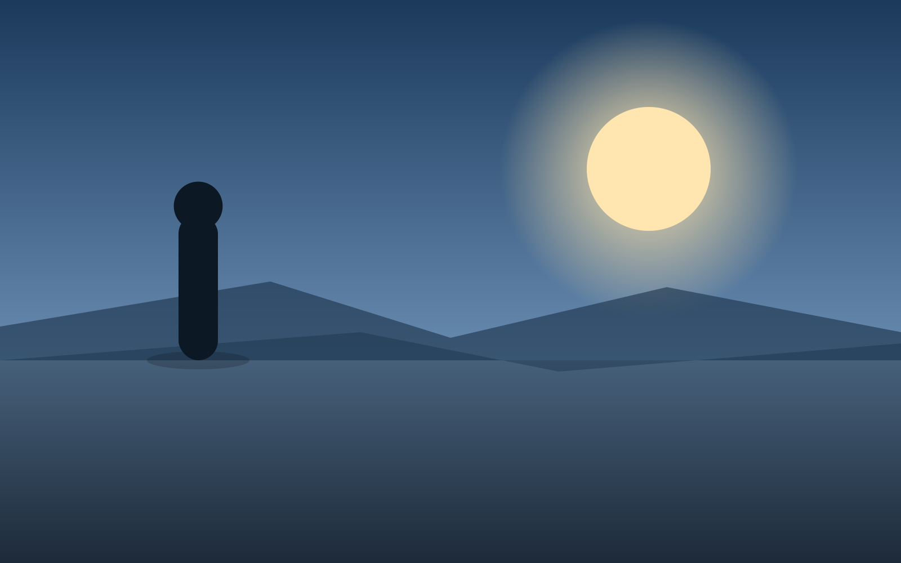
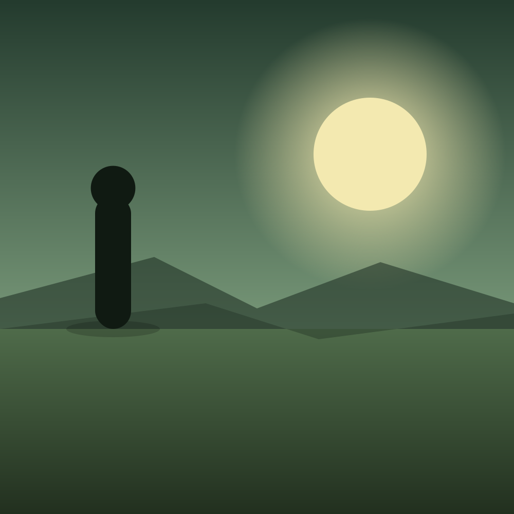
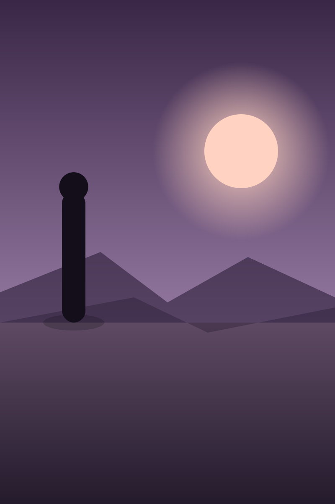

<!-- _class: title silent -->

# The image layout that thinks for you

`Imagery · adaptive composition`

You hand it any rectangle. It reads the asset's shape, weighs the deck it's on, and resolves a boardroom composition — no modifier to pick.

---

<!-- _class: statement -->

## Every other layout controls its content's shape. Image is the one exception — so it adapts to yours.

---

<!-- _class: image -->
<!-- _footer: "wide photo → clean — the card takes the photo's own shape" -->

## Activation is where the trial is won or lost.

Two-thirds of trials that reach the first generated report convert; the ones that stall almost never do. A moderate photo gets the **clean** default — a floated card shaped to the asset, so the crop is ≈ zero.

---

<!-- _class: image -->
<!-- _footer: "square photo → clean — same default, a square card" -->

## The signal, framed and centered.

The card adapts: a squarish photo sits in a square card. One default, every moderate shape, no letterboxing and no lost subject.

---

<!-- _class: image -->
<!-- _footer: "tall photo → split — shown whole in a full-height column" -->

## Built for the long climb.

An extreme aspect would waste a card, so the resolver upgrades to **split** — a full-height column that shows the whole portrait photo, the argument running alongside.

---

<!-- _class: image -->
<!-- _footer: "panorama → spotlight — full-bleed, with a SOLID card" -->

## A panorama earns the full frame.

When the photo already matches the canvas, **spotlight** lets it go full-bleed — and the message rides a solid card, so legibility never depends on the photo.

---

<!-- _class: image gallery -->
<!-- _footer: "opt-in · gallery — contain a diagram, zero crop" -->

## Exhibit 1 — the network, contained.

Two treatments stay opt-in because they can't be safe for a photo we can't see. **gallery** contains the whole asset on a matte — for diagrams and screenshots where the whitespace is the point.

---

<!-- _class: image statement -->
<!-- _footer: "opt-in · statement — the editorial gamble, taken on purpose" -->

## The setup step is the real funnel.

**statement** rides the title on the photo over a scrim — a deliberate, editorial moment you reach for when you know the image carries it.

---

<!-- _class: image spotlight -->
<!-- _footer: "override · image spotlight forces cover on a tall photo" -->

## And when you want the crop, you just say so.

The resolver protects an author who doesn't think about it. Name a composition and it yields — `image spotlight` forces a full-bleed cover on this tall photo, accepting the crop.

---

<!-- _class: closing silent -->

## One markdown. Five compositions. Both orientations.

`<!-- _class: image -->` + a photo. The layout does the rest.
