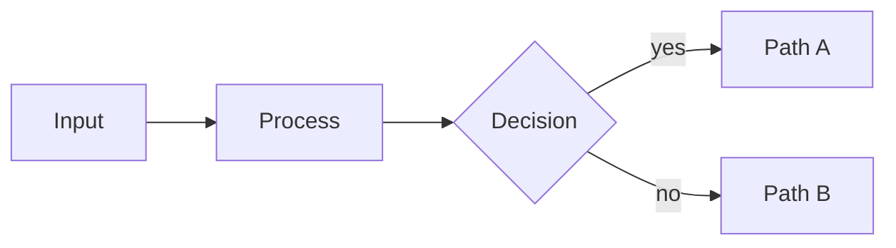

---

<!-- _class: title -->
<!-- _paginate: false -->
<!-- _header: "" -->
<!-- _footer: "Title slide · title" -->

# Lattice Component Gallery

`45 components · 7 function families`

Every `example.md` in lib/components/, rendered.

---

<!-- _class: divider -->
<!-- _paginate: false -->
<!-- _header: "" -->
<!-- _footer: "Section break · divider" -->

`Section 01 · 4 components`

# Anchor

---

<!-- _class: closing -->
<!-- _footer: "Closing slide · closing" -->
<!-- _paginate: false -->
<!-- _header: '' -->
<!-- _footer: '' -->

# Closing takeaway or call to action

`Optional eyebrow`

---

<!-- _class: divider silent -->
<!-- _footer: "Section break · divider" -->

`Section 01`

# Section name

---

<!-- _class: subtopic -->
<!-- _footer: "Sub-topic intro · subtopic" -->

`Topic family`

## Sub-topic name.

---

<!-- _class: title -->
<!-- _footer: "Title slide · title" -->
<!-- _paginate: false -->
<!-- _header: '' -->
<!-- _footer: '' -->

# Deck title goes here

`Category · Date or audience`

One-line subtitle that frames the deck.

---

<!-- _class: divider -->
<!-- _paginate: false -->
<!-- _header: "" -->
<!-- _footer: "Section break · divider" -->

`Section 02 · 4 components`

# Statement

---

<!-- _class: big-number -->
<!-- _footer: "Single hero metric · big-number" -->

`Optional eyebrow`

- 92%
  - of the audience remembers a single number from a deck.

---

<!-- _class: content -->
<!-- _footer: "Single-idea prose · content" -->

## Slide heading.

The explanatory paragraph that develops the heading goes here. Keep the slide under forty words.

- Optional supporting point one.
- Optional supporting point two.

---

<!-- _class: quote -->
<!-- _footer: "Pulled quotation · quote" -->

> The quoted sentence sits here, kept short enough to read in one breath.

Attribution — Person, Role

---

<!-- _class: split-panel -->
<!-- _footer: "Featured panel + list · split-panel" -->

## Panel headline that frames the side points.

### Section rubric

- **First point.** Supporting sentence explaining the first point.
- **Second point.** Supporting sentence explaining the second point.
- **Third point.** Supporting sentence explaining the third point.

---

<!-- _class: divider -->
<!-- _paginate: false -->
<!-- _header: "" -->
<!-- _footer: "Section break · divider" -->

`Section 03 · 12 components`

# Inventory

---

<!-- _class: actors -->
<!-- _footer: "Roster of actors · actors" -->

## Who owns each part of the process.

- **First actor.** Owns the first part of the lifecycle.
- **Second actor.** Owns the second part.
- **Third actor.** Owns the third part.
- **Fourth actor.** Owns the fourth part.

---

<!-- _class: agenda -->
<!-- _footer: "Numbered TOC · agenda" -->

## What this deck covers.

1. First section title
2. Second section title
3. Third section title
4. Fourth section title

---

<!-- _class: cards-grid -->
<!-- _footer: "2-4 parallel cards · cards-grid" -->

## Slide heading.

- **First card title.** Body text for the first card, one sentence.
- **Second card title.** Body text for the second card, one sentence.
- **Third card title.** Body text for the third card, one sentence.
- **Fourth card title.** Body text for the fourth card, one sentence.

---

<!-- _class: cards-side -->
<!-- _footer: "Two cards side-by-side · cards-side" -->

## Slide heading.

- **Left card title.** Body text for the left card, two short sentences.
- **Right card title.** Body text for the right card, two short sentences.

---

<!-- _class: cards-stack -->
<!-- _footer: "Vertical card stack · cards-stack" -->

## Slide heading.

- **First card title.** Body text for the first stacked card, two short sentences max.
- **Second card title.** Body text for the second stacked card.
- **Third card title.** Body text for the third stacked card.

---

<!-- _class: cards-wide -->
<!-- _footer: "Three wide rows · cards-wide" -->

## Slide heading.

- **First row title.** Body text for the first wide row, one or two sentences.
- **Second row title.** Body text for the second wide row.
- **Third row title.** Body text for the third wide row.

---

<!-- _class: checklist -->
<!-- _footer: "State-marker items · checklist" -->

## Pre-launch readiness.

- [x] First item that is fully done.
- [x] Second item that is fully done.
- [-] Third item that is partially complete with a caveat.
- [ ] Fourth item that is not yet started.

---

<!-- _class: glossary -->
<!-- _footer: "Term/definition table · glossary" -->

## Glossary

- Adjacency
  - The relationship between two slides that share an audience or context.
- Anchor
  - A title, divider, subtopic, or closing slide that orients the audience.
- Cadence
  - The deck's pacing — how much new information per slide.

---

<!-- _class: list -->
<!-- _footer: "Bullet list · list" -->

## Slide heading.

- First short bullet point.
- Second short bullet point.
- Third short bullet point.
- Fourth short bullet point.
- Fifth short bullet point.

---

<!-- _class: list-tabular -->
<!-- _footer: "Hairline ledger · list-tabular" -->

## Slide heading.

- **First entry.** Description or value for the first entry.
- **Second entry.** Description or value for the second entry.
- **Third entry.** Description or value for the third entry.
- **Fourth entry.** Description or value for the fourth entry.

---

<!-- _class: principles -->
<!-- _footer: "Declared principles · principles" -->

## How we make calls when the spec is silent.

- **Bias to action.** Default to shipping a defensible answer over chasing a perfect one.
- **Decisions over options.** Document the choice, not the menu we evaluated.
- **Cheaper to reverse than to debate.** Reversible calls don't need a meeting.

---

<!-- _class: tldr -->
<!-- _footer: "Single-line takeaways · tldr" -->

## What this section showed.

- The first takeaway as a complete one-line claim.
- The second takeaway as a complete one-line claim.
- The third takeaway as a complete one-line claim.
- The fourth takeaway as a complete one-line claim.

---

<!-- _class: divider -->
<!-- _paginate: false -->
<!-- _header: "" -->
<!-- _footer: "Section break · divider" -->

`Section 04 · 7 components`

# Comparison

---

<!-- _class: before-after -->
<!-- _footer: "State change · before-after" -->

## What the change did.

- **Before.** How the system or process worked before the change, in one or two sentences.
- **After.** How the system or process works now, in one or two sentences.

---

<!-- _class: compare-code -->
<!-- _footer: "Two-code comparison · compare-code" -->

## Heading framing the comparison.

### Before

```js
function before() {
  return 'old';
}
```

### After

```js
function after() {
  return 'new';
}
```

---

<!-- _class: compare-prose -->
<!-- _footer: "Two-prose comparison · compare-prose" -->

## Heading framing the comparison.

- **First option.** Two-sentence description of the first option, including the strongest argument for it.
- **Second option.** Two-sentence description of the second option, including the strongest argument for it.

---

<!-- _class: compare-table -->
<!-- _footer: "Comparison table · compare-table" -->

## Heading framing the comparison.

| Criterion | Option A | Option B | Option C |
| --- | --- | --- | --- |
| First criterion | Value | Value | Value |
| Second criterion | Value | Value | Value |
| Third criterion | Value | Value | Value |

---

<!-- _class: decision -->
<!-- _footer: "The verdict · decision" -->

## What we are doing.

- **Chosen path.** One-line rationale for the decision.
- **Rejected option.** One-line rationale for why this didn't fit.

---

<!-- _class: matrix-2x2 -->
<!-- _footer: "Static 2×2 quadrants · matrix-2x2" -->

## Where each option lives.

- **High value · Low cost.**
  - First item in this quadrant
  - Second item
- **High value · High cost.**
  - First item in this quadrant
- **Low value · Low cost.**
  - First item in this quadrant
- **Low value · High cost.**
  - First item in this quadrant

---

<!-- _class: verdict-grid -->
<!-- _footer: "Options vs criteria · verdict-grid" -->

## Which option meets the criteria.

- **First option.**
  - [x] First criterion
  - [-] Second criterion
  - [ ] Third criterion
- **Second option.**
  - [x] First criterion
  - [x] Second criterion
  - [-] Third criterion
- **Third option.**
  - [ ] First criterion
  - [-] Second criterion
  - [x] Third criterion

---

<!-- _class: divider -->
<!-- _paginate: false -->
<!-- _header: "" -->
<!-- _footer: "Section break · divider" -->

`Section 05 · 6 components`

# Progression

---

<!-- _class: gantt -->
<!-- _footer: "Gantt chart · gantt" -->

`2026 Q1 → 2026 Q4`

## What ships in each phase, by workstream.

Three workstreams across four quarters. Status pills tint each bar.

- Platform
  - Codebook signing `Q1 → Q2` `done`
  - Multi-tenant DEKs `Q2 → Q3` `live`
  - Per-purpose codebooks `Q3 → Q4` `at-risk`
- Operations
  - Manual rotation `Q1 → Q2` `done`
  - Automated rotation `Q2 → Q3` `live`
  - Crypto-shred `Q3 → Q4`
- Compliance
  - Audit trail `Q1 → Q2` `done`
  - Centralised log `Q2 → Q3`
  - Examiner pack `Q3 → Q4`

---

<!-- _class: kanban -->
<!-- _footer: "Kanban board · kanban" -->

`Phase 2 · Sprint 14`

## Where Phase 2 work stands today.

Four columns, mixed card density. Size badge sits in the title row.

- Backlog
  - Per-purpose codebooks `S`
  - Crypto-shred runbook `M`
  - Dependency dashboard `S`
- In progress
  - Multi-tenant DEKs `M`
    - platform `at-risk`
  - Examiner pack v2 `L`
    - compliance
- Review
  - Centralised log `S`
    - compliance
- Done
  - Codebook signing `M`
  - Manual rotation `S`

---

<!-- _class: list-criteria -->
<!-- _footer: "Numbered criteria · list-criteria" -->

## What every decision must satisfy.

1. **First criterion.** Short rationale for why this matters.
2. **Second criterion.** Short rationale.
3. **Third criterion.** Short rationale.
4. **Fourth criterion.** Short rationale.

---

<!-- _class: list-steps -->
<!-- _footer: "Step-by-step list · list-steps" -->

## How to roll this out.

1. First step — a sentence describing what you do here.
2. Second step — a sentence describing what you do here.
3. Third step — a sentence describing what you do here.
4. Fourth step — a sentence describing what you do here.

---

<!-- _class: roadmap -->
<!-- _footer: "Phased roadmap grid · roadmap" -->

`Layout · roadmap`

## What ships in each phase, by workstream.

| Workstream | Foundation `Q2 2026`  | Hardening `Q3 2026`    | Scale `Q4 2026`           |
| ---------- | --------------------- | ---------------------- | ------------------------- |
| Platform   | [x] Codebook signing  | [-] Multi-tenant DEKs  | [ ] Per-purpose codebooks |
| Operations | [x] Manual rotation   | [-] Automated rotation | [ ] Crypto-shred          |
| Compliance | [x] Audit trail       | [x] Centralised log    | [ ] Examiner pack         |
| SDK        | [x] Java              | [/] .NET               | [ ] Polyglot parity       |

State markers `[x]/[-]/[ ]/[/]` are universal: ✓ shipped, ◐ in flight, ○ planned, ╱ out of scope.

---

<!-- _class: timeline -->
<!-- _footer: "Ordered timeline · timeline" -->

## How the process flows.

1. **First stage**
   - *Short description of what happens here.*
2. **Second stage**
   - *Short description.*
3. **Third stage**
   - *Short description.*
4. **Fourth stage**
   - *Short description.*

---

<!-- _class: divider -->
<!-- _paginate: false -->
<!-- _header: "" -->
<!-- _footer: "Section break · divider" -->

`Section 06 · 10 components`

# Evidence

---

<!-- _class: code -->
<!-- _footer: "Single code block · code" -->

## What the new endpoint looks like.

```js
app.post('/api/v2/auth', async (req, res) => {
  const session = await issueSession(req.body);
  res.json({ session });
});
```

---

<!-- _class: diagram -->
<!-- _footer: "Mermaid diagram · diagram" -->

## How signals move from input to decision.



---

<!-- _class: kpi -->
<!-- _footer: "Executive KPI grid · kpi" -->

### Financial · Q4 2026
## Revenue ahead of plan; margin and cash both expanded.

1. **$2.4B**
   - Total revenue
   - target $2.2B · +9% `On plan` `Board`
2. **42%**
   - Gross margin
   - +2pp QoQ `On plan` `Audit`
3. **$1.1B**
   - Cash & equivalents
   - +$180M QoQ `On plan` `Investor`

---

<!-- _class: piechart donut -->
<!-- _footer: "Pie / donut chart · piechart" -->

`H1 2026 · 1,840 person-hours`

## Where the engineering quarter went.

Wedges drawn proportionally; legend reads in author order with raw values.

- Codebook platform `46%`
- Operations runbook `22%`
- Compliance work `18%`
- Pilot support `9%`
- Toil and on-call `5%`

---

<!-- _class: progress -->
<!-- _footer: "Progress bars · progress" -->

`H1 2026 · Phase 1 readiness`

## Phase 1 readiness, by workstream.

Snapshot taken at 14:00 UTC. Status pills tint the bar fill.

- Codebook platform `92%` `on-track`
- Operations runbook `68%` `at-risk`
- Compliance audit pack `81%` `on-track`
- SDK polyglot parity `34%` `deferred`
- Dependency dashboard `12%` `blocked`

---

<!-- _class: quadrant -->
<!-- _footer: "2×2 scatter chart · quadrant" -->

`Effort 0–10 → Reach 0–100`

## Where to put the next dollar.

Effort estimated in story-points; reach as percent of addressable users.

- Strategic Bets
  - Codebook caching `3, 70`
  - Multi-tenant DEKs `5, 85`
- Quick Wins
  - Per-purpose codebooks `8, 80`
  - Snapshot exports `9, 55`
- Defer
  - Vendor scoping `2, 30`
  - Manual rotation `1, 22`
- Time Sinks
  - Custom audit log UI `7, 18`
  - Bespoke SCIM `9, 28`

---

<!-- _class: radar -->
<!-- _footer: "Radar / spider chart · radar" -->

`Scale · 0–10`

## How we stack up across the buying criteria.

- Lattice
  - Performance `9`
  - Pricing `7`
  - Support `8`
  - Ecosystem `6`
  - Security `9`
- Rival North
  - Performance `7`
  - Pricing `8`
  - Support `6`
  - Ecosystem `9`
  - Security `7`
- Rival West
  - Performance `6`
  - Pricing `9`
  - Support `7`
  - Ecosystem `8`
  - Security `8`

---

<!-- _class: stats -->
<!-- _footer: "KPI numbers · stats" -->

`Impact · Pilot Results`

## Six months of results across four product teams.

`Measured against pre-framework baseline, same teams, same market conditions.`

1. **73%** faster close
2. **4.2×** signal recall
3. **$1.2M** prevented losses
4. **−18d** avg cycle time

---

<!-- _class: timeline-list -->
<!-- _footer: "Date-stamped timeline · timeline-list" -->

`Codebook architecture`

## How the codebook architecture arrived in production.

Four stages over eighteen months. Date pill leads each item; status pill trails.

1. `2024 Q3` Vault round-trip
   - First production tokenization shipped on a centralised vault. p99 60 ms.
2. `2025 Q1` Codebook proposal `decision`
   - Architecture review accepts the in-process model. Build approved.
3. `2025 Q3` Codebook GA `live`
   - Phase 1 rollout complete; 12 production tenants on the new path.
4. `2026 Q1` Multi-tenant DEKs `live`
   - Hardening shipped; codebook caching cut p99 below 5 ms.

---

<!-- _class: word-cloud -->
<!-- _footer: "Weighted word cloud · word-cloud" -->

## What the team called out this quarter.

- velocity — 12
- ownership — 9
- handoffs — 7
- review — 6
- testing — 5
- onboarding — 4
- spec — 3
- triage — 3

---

<!-- _class: divider -->
<!-- _paginate: false -->
<!-- _header: "" -->
<!-- _footer: "Section break · divider" -->

`Section 07 · 2 components`

# Imagery

---

<!-- _class: featured -->
<!-- _footer: "Featured + sub-grid · featured" -->

## Applying the criteria, here is where the evidence points.

- **Featured recommendation.** One to two sentences making the case.
- **Supporting card.** Short context on a related option.
- **Supporting card.** Short context on another option.
- **Supporting card.** Short context on another option.

---

<!-- _class: image -->
<!-- _footer: "Image + text slot · image" -->

## Image right is the default — text leads, evidence follows.

Replace the bg image below with your own asset. The image fills its half-canvas slot edge-to-edge; a 1px hairline marks the join between text and image.


---

<!-- _class: closing -->
<!-- _paginate: false -->
<!-- _header: "" -->
<!-- _footer: "Closing · closing" -->

# That is every component.

`docs/design-system.md · lib/components/`
