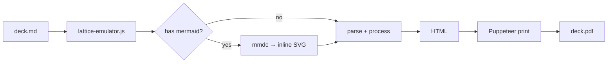

---

<!-- _class: title -->
<!-- _paginate: false -->
<!-- _header: "" -->
<!-- _footer: "Title slide · title" -->

# Lattice Component Gallery

`58 components · 7 function families`

Every `example.md` in lib/components/, rendered.

---

<!-- _class: divider -->
<!-- _paginate: false -->
<!-- _header: "" -->
<!-- _footer: "Section break · divider" -->

`Section 01 · 4 components`

# Anchor

---

<!-- _class: closing -->
<!-- _footer: "Closing slide · closing" -->
<!-- _paginate: false -->
<!-- _header: "" -->
<!-- _footer: "" -->

# Function · Form · Substance · Finish.

`docs/design-system.md`

---

<!-- _class: divider -->
<!-- _footer: "Section break · divider" -->
<!-- _paginate: false -->
<!-- _header: "" -->
<!-- _footer: "" -->

`Section 03`

# Inventory

---

<!-- _class: subtopic -->
<!-- _footer: "Sub-topic intro · subtopic" -->

`Anchor family · light divider`

## Subtopic introduces a specific topic within a section.

---

<!-- _class: title -->
<!-- _footer: "Title slide · title" -->
<!-- _paginate: false -->
<!-- _header: "" -->
<!-- _footer: "" -->

# The component model in one deck

`Lattice · Component Gallery`

Forty-five components, one page each, by function family.

---

<!-- _class: divider -->
<!-- _paginate: false -->
<!-- _header: "" -->
<!-- _footer: "Section break · divider" -->

`Section 02 · 6 components`

# Statement

---

<!-- _class: big-number -->
<!-- _footer: "Single hero metric · big-number" -->

`Audience recall`

- 92%
  - of the audience remembers a single number from a deck. Make it count.

---

<!-- _class: content -->
<!-- _footer: "Single-idea prose · content" -->

## The catch-all prose slide.

Use `content` when no more specific component fits. A heading, a paragraph, optionally a short bullet list. Keep the slide under forty words.

- For lists of items, prefer `list`, `cards-grid`, or `cards-stack`.
- For comparisons, prefer `compare-prose` or `compare-table`.
- For single metrics, prefer `big-number` or `stats`.

---

<!-- _class: quote -->
<!-- _footer: "Pulled quotation · quote" -->

> The signal was always there. We just didn't have a system that forced us to look at it before we'd already decided. The framework's value isn't the data — it's the moment in the calendar when the question gets asked.

— Head of Product, Pilot Team 3

---

<!-- _class: split-brief -->
<!-- _footer: "Executive brief · split-brief" -->

`Q2 Performance Review`

## Enterprise revenue stalled in Q2

Three structural factors explain 90% of the shortfall — all addressable before Q4 close.

- Renewal pricing complexity is driving churn at the segment ceiling
  - Four accounts totaling $2.1M ARR declined renewal. Win/loss interviews point to a quote-to-contract gap, not value perception.
- Pipeline conversion dropped 11 pp below Q1 — legal review is the chokepoint
  - Contract length increased 18 days on average. Root cause is a security addendum introduced in March.
- Competitive displacement accelerated in the $80–200K ACV tier
  - Seven losses to a single competitor. Time-to-value gap is the exposure.

---

<!-- _class: split-panel -->
<!-- _footer: "Featured panel + list · split-panel" -->

## A featured statement on the left lands the argument.

### Use when

- **One claim deserves emphasis.** The panel headline carries the weight; the right side substantiates.
- **You need both a thesis and proof.** Statement on the left, evidence list on the right.
- **The right side is short.** Three to four supporting points; longer lists belong in `cards-stack`.
- **Modifier mirror flips it.** Image-style decks often want the panel on the right.

---

<!-- _class: split-statement -->
<!-- _footer: "Pull quote + impact · split-statement" -->

> The best product does not win. The most understood product does.

`Morgan Chase · Head of Product, Vercel, 2024`

- Clarity is a product decision, not a marketing one
  - If a prospect cannot articulate our value in one sentence, the product has a communication architecture problem.
- Onboarding is the product's first argument for itself
  - The moment a user first succeeds defines their frame for everything that follows.
- Understanding, not delight, is the retention driver at scale
  - Users who understand the system's logic stay through friction. Build for comprehension.

---

<!-- _class: divider -->
<!-- _paginate: false -->
<!-- _header: "" -->
<!-- _footer: "Section break · divider" -->

`Section 03 · 13 components`

# Inventory

---

<!-- _class: actors -->
<!-- _footer: "Roster of actors · actors" -->

## Who owns each part of the lifecycle.

- **Author.** Drafts the deck; owns content and framing.
- **Reviewer.** Validates clarity, factual accuracy, and audience-fit.
- **Engineer.** Ensures the build path renders the same PDF Marp preview shows.
- **Designer.** Owns the visual contract; palette tokens, layout balance, typography.
- **Operator.** Schedules the briefing; controls the room and the projector.

---

<!-- _class: agenda -->
<!-- _footer: "Numbered TOC · agenda" -->

## What this deck covers.

1. The four-layer model — Function · Form · Substance · Finish
2. Component manifests — the single source of truth
3. The forty-five shipped components, grouped by function
4. Discovery — scaffolder, snippets, this gallery
5. What ships next — open questions and follow-ups

---

<!-- _class: cards-grid -->
<!-- _footer: "2-4 parallel cards · cards-grid" -->

## When to reach for cards-grid.

- Parallel items
  - Four cards or fewer, each item gets equal weight in the layout. Audience compares them at a glance.
- Scannable at a glance
  - The audience absorbs the whole set in one look — no scrolling, no eye-leaping between rows.
- Equal information density
  - Each card carries roughly the same text length. Uneven density makes the grid feel unbalanced.
- Order is decorative
  - When sequence carries meaning, use list-steps or list-criteria instead. cards-grid is for parallel options.

---

<!-- _class: cards-side -->
<!-- _footer: "Two cards side-by-side · cards-side" -->

## Two cards, equal weight, side-by-side.

- Use for an explicit pair
  - Two options, two phases, two artifacts presented with equal weight. The slide reads as a comparison without taking sides.
- Different from compare-prose
  - compare-prose adds connector chrome and a chosen modifier; cards-side stays neutral. Pick cards-side when neither option is the winner.

---

<!-- _class: cards-stack -->
<!-- _footer: "Vertical card stack · cards-stack" -->

## When to reach for cards-stack.

- **Vertical reading order matters.** The audience scans top to bottom, not grid-style. Each card builds on the previous one as the eye moves down the slide.
- **Each card has more body than a grid card.** Two sentences instead of one. cards-grid forces parallel density; cards-stack lets each card breathe with longer body text.
- **Two to three items, not four-plus.** Beyond three cards the slide overflows. For more items, split across multiple slides or switch to cards-grid with shorter text.

---

<!-- _class: cards-wide -->
<!-- _footer: "Three wide rows · cards-wide" -->

## When the items want full-width rows.

1. Each item has substantial body text
   - One to two sentences per item, more than a cards-grid card can hold without crowding. The row layout gives the body room to breathe.
2. The slide scans top-to-bottom
   - Reading order is sequential rather than parallel. The audience absorbs one row at a time rather than the whole set at a glance.
3. Three or four rows feels right
   - Beyond four rows the slide gets dense. For more items prefer list-tabular; for fewer items with shorter body prefer cards-stack.

---

<!-- _class: checklist -->
<!-- _footer: "State-marker items · checklist" -->

## Pre-flight checklist for a new component.

- [x] Pick function and form coordinates per the spec
- [x] Write the manifest with name, function, form, substance, and slots
- [x] Author CSS rules scoped to the section class
- [-] Add a transform module if substance is structure or series
- [-] Write a substantive example and README
- [ ] Update the templates catalog reference
- [ ] Add unit tests under the new component test path

---

<!-- _class: glossary -->
<!-- _footer: "Term/definition table · glossary" -->

## Glossary

- Component
  - A self-contained unit at lib/components, one folder per component, with manifest plus styles plus example plus optional transform plus README.
- Function
  - The communication purpose a slide serves; one of seven families (Anchor, Statement, Inventory, Comparison, Progression, Evidence, Imagery).
- Form
  - The spatial composition of a slide; one of eleven shapes (bookend, divider, canvas, grid, stack, ledger, panel, matrix, scatter, timeline, split).
- Manifest
  - The JSON description of a component, consumed by the scaffolder, snippets, docs catalog, and autocomplete.
- Substance
  - The kind of data that fills the form; one of four (prose, structure, series, graph).

---

<!-- _class: list -->
<!-- _footer: "Bullet list · list" -->

## When the items truly are a list.

- Five to six short points, each under twelve words.
- No internal structure per item — if items have title + body, use cards-stack instead.
- Numbered (ol) when order matters; bulleted (ul) when it does not.
- Inline-code metadata at the end of a row becomes a pill via the universal-pill recipe.
- For richer items with descriptions, prefer list-tabular.

---

<!-- _class: list-tabular -->
<!-- _footer: "Hairline ledger · list-tabular" -->

## The four substance contracts a component plugs into.

1. Prose
   - Headings, paragraphs, inline emphasis — Marp markdown into semantic HTML.
   - _CSS-only; no post-processor required_
2. Structure
   - Headings plus nested lists with conventions; a post-processor rewrites the list into purpose-built DOM.
   - _Per-component transform.js in lib/components_
3. Series
   - Tabular DSL — axes and datapoints as bullets, parsed into geometry.
   - _Chart-family kernel (radar, quadrant, piechart, gantt, kanban)_
4. Graph
   - External graph language (Mermaid today; D2 or PlantUML in the future).
   - _External CLI; palette injected at build time_

---

<!-- _class: principles -->
<!-- _footer: "Declared principles · principles" -->

## How we make calls when the spec is silent.

1. Default to the choice that is cheaper to reverse.
2. Name the actor, never the system.
3. Write down the bet on the same slide as the choice.
4. Form follows function — let the audience need shape the layout.
5. One main idea per slide; split if you cannot summarise it in one sentence.

---

<!-- _class: statute-stack -->
<!-- _footer: "Citation hierarchy · statute-stack" -->

## Children's data — three jurisdictions, three obligations.

- Federal
  - `15 U.S.C. §6501 · COPPA`
  - Verifiable parental consent for under-13 personal data.
  - Operators must post a clear notice and a deletion route.
  - `In effect since 2000`
- State
  - `Cal. Civ. Code §1798.120 · CCPA/CPRA`
  - Opt-in for selling or sharing under-16 data; opt-out for over-16.
  - DSAR handling within 45 days; deletion verified.
  - `Enforced 2023`
- Local
  - `NYC Admin Code §22-1201`
  - Bias-audit obligation for AEDTs used in employment decisions.
  - Annual audit + candidate notice + public summary.
  - `Effective 2023`

When the room wants three parallel facts at a glance.

---

<!-- _class: tldr -->
<!-- _footer: "Single-line takeaways · tldr" -->

## What this section will tell you, in five lines.

- Components stay short — `cards-grid` not `inventory.grid.cards`.
- The four layers organise the catalog; they do not name components.
- Manifests are the single source of truth for every component.
- Discovery happens via the scaffolder and IDE snippets, not the directive.
- Forty-five components ship — one folder each.

---

<!-- _class: divider -->
<!-- _paginate: false -->
<!-- _header: "" -->
<!-- _footer: "Section break · divider" -->

`Section 04 · 10 components`

# Comparison

---

<!-- _class: before-after -->
<!-- _footer: "State change · before-after" -->

## What the manifest refactor produced.

- **Before.** 35 layouts scattered across one 10,382-line lattice.css monolith. Per-layout rules grepped, not folder-located. No central metadata.
- **After.** 45 components self-contained at lib/components, one folder each with manifest plus styles plus example plus README. Bundler concatenates per-component CSS; loader exposes the catalog via JSON.

---

<!-- _class: compare-code -->
<!-- _footer: "Two-code comparison · compare-code" -->

`Before & after · Component manifest loading`

## Flat-file lookup versus folder-shape lookup.

`Before · flat file`

```js
const fs = require('node:fs');
const path = require('node:path');

function loadOne(name) {
  const p = path.join(
    __dirname, 'lib', 'components',
    `${name}.json`
  );
  return JSON.parse(fs.readFileSync(p, 'utf8'));
}

const cards = loadOne('cards-grid');
```

`After · folder shape`

```js
const fs = require('node:fs');
const path = require('node:path');

function loadOne(name) {
  const p = path.join(
    __dirname, 'lib', 'components',
    name, 'manifest.json'
  );
  return JSON.parse(fs.readFileSync(p, 'utf8'));
}

const cards = loadOne('cards-grid');
```

---

<!-- _class: compare-prose -->
<!-- _footer: "Two-prose comparison · compare-prose" -->

## Two options, equal weight, head-to-head.

- First option
  - Two-sentence description of the first option, including the strongest argument for it. Equal-density prose lets the audience compare line by line.
- Second option
  - Two-sentence description of the second option, including the strongest argument for it. Modifier chosen marks the verdict when a decision has been made.

---

<!-- _class: compare-table -->
<!-- _footer: "Comparison table · compare-table" -->

## Where the four substance contracts come from.

| Substance | Author writes | Renderer | Output |
| --- | --- | --- | --- |
| prose | headings, paragraphs, lists | Marp markdown → semantic HTML | DOM |
| structure | nested lists with conventions | lib/*.js post-processor | DOM |
| series | tabular DSL (axes + datapoints) | chart-family kernel | SVG |
| graph | external graph language | external CLI (mmdc, future d2) | SVG |

---

<!-- _class: decision -->
<!-- _footer: "The verdict · decision" -->

## What we are doing.

- **Chosen path.** Self-contained per-component folders at lib/components, one folder per component. Holds manifest plus styles plus optional transform plus example plus README.
- **Rejected option.** Flat files alongside each other in lib/components. Defeats the self-contained goal and leaves transform.js scattered.

---

<!-- _class: matrix-2x2 -->
<!-- _footer: "Static 2×2 quadrants · matrix-2x2" -->

## Where each component substance lives.

- **Author-driven · DOM output.**
  - prose — headings + paragraphs
  - structure — nested lists
- **Author-driven · SVG output.**
  - series — tabular DSL
  - graph — external language
- **Data-driven · DOM output.**
  - (Lattice does not target this cell)
- **Data-driven · SVG output.**
  - chart-family kernels — radar, quadrant, piechart, gantt, kanban, progress, timeline-list

---

<!-- _class: obligation-matrix -->
<!-- _footer: "Regulation × duty · obligation-matrix" -->

## Privacy obligations across regimes — neutral grid.

| Regulation | Notice | Consent | Retention | Breach | DSAR  |
| ---------- | :----: | :-----: | :-------: | :----: | :---: |
| GDPR       | [x]    | [x]     | [x]       | [x]    | [x]   |
| CCPA/CPRA  | [x]    | [-]     | [x]       | [x]    | [x]   |
| LGPD       | [x]    | [x]     | [x]       | [x]    | [x]   |
| PIPEDA     | [x]    | [x]     | [-]       | [x]    | [-]   |
| HIPAA      | [x]    | [x]     | [x]       | [x]    | [-]   |
| GLBA       | [x]    | [-]     | [-]       | [x]    | [ ]   |

Filled = applies, half = partial, empty = exempt. Neutral ink — data first.

---

<!-- _class: redline -->
<!-- _footer: "Clause diff · redline" -->

## SB-362 rewrote the opt-out link rule.

`Cal. Civ. Code §1798.135 · amendment SB-362 (2024)`

> A business that <del>collects</del> <ins>collects, sells, or shares</ins> consumers' personal information shall provide <del>two or more</del> <ins>at least one</ins> designated method for submitting requests to opt-out, <ins>including, at minimum, a clear and conspicuous link on the homepage titled "Your Privacy Choices,"</ins> for use by consumers to <del>opt out of the sale of</del> <ins>direct the business not to sell or share</ins> their personal information.

- **Why this matters.** SB-362 collapses "sale" and "sharing" into one duty and pins a uniform link title — homepage chrome and DSAR workflows both need a uniform UX.

---

<!-- _class: split-compare -->
<!-- _footer: "Two options + verdict · split-compare" -->

`Decision Required`

## Build the data layer or buy it?

Both paths are viable. The difference is where we spend the next 18 months.

- Build in-house
  - Full control over schema and roadmap
  - 2–3 engineer-quarters to reach feature parity
  - Ongoing maintenance burden stays internal
- Buy + configure
  - Ship in 6 weeks, not 9 months
  - Engineering capacity redirects to product-layer features
  - Exit risk manageable — data export contractually guaranteed

> Buy the infrastructure. Build the differentiation. Revisit in 24 months.

---

<!-- _class: verdict-grid -->
<!-- _footer: "Options vs criteria · verdict-grid" -->

## Which option meets the criteria.

- **Folder shape.**
  - [x] Self-contained per component
  - [x] Familiar pattern from other libraries
  - [x] Tests can live with their component
- **Flat files.**
  - [x] Less restructuring upfront
  - [-] Per-component grouping by filename only
  - [ ] No room for transform.js or example.md
- **Hybrid.**
  - [-] Manifest stays flat, other files in subfolder
  - [ ] Splits the component across two locations
  - [ ] Defeats the self-contained goal

---

<!-- _class: divider -->
<!-- _paginate: false -->
<!-- _header: "" -->
<!-- _footer: "Section break · divider" -->

`Section 05 · 10 components`

# Progression

---

<!-- _class: authority-chain -->
<!-- _footer: "Statute → case · authority-chain" -->

## COPPA — the chain, tier by tier.

1. Statute
   - `15 U.S.C. §6501`
   - Congress, 1998 — verifiable parental consent for under-13 data.
2. Regulation
   - `16 C.F.R. Part 312`
   - FTC implementing rule; 2013 rewrite expanded covered identifiers.
3. Guidance
   - `FTC Six-Step Compliance Plan`
   - Staff guidance — non-binding, but cited in every consent order.
4. Case
   - `In re Epic Games · 2022`
   - $245M consent order — operationalised "actual knowledge" standard.

---

<!-- _class: gantt -->
<!-- _footer: "Gantt chart · gantt" -->

`2026 Q1 → 2026 Q4`

## What ships in each phase, by workstream.

Three workstreams across four quarters. Status pills tint each bar.

- Platform
  - Codebook signing `Q1 → Q2` `done`
  - Multi-tenant DEKs `Q2 → Q3` `live`
  - Per-purpose codebooks `Q3 → Q4` `at-risk`
- Operations
  - Manual rotation `Q1 → Q2` `done`
  - Automated rotation `Q2 → Q3` `live`
  - Crypto-shred `Q3 → Q4`
- Compliance
  - Audit trail `Q1 → Q2` `done`
  - Centralised log `Q2 → Q3`
  - Examiner pack `Q3 → Q4`

---

<!-- _class: journey -->
<!-- _footer: "User-journey chart · journey" -->

## Customer onboarding · trial → activation

- Evaluate
  - Read case study `@prospect` `:5`
  - Book demo `@prospect` `:4`
  - Live demo `@prospect` `@sales` `:4`
- Trial
  - Trial signup `@prospect` `:3`
  - Workspace setup `@user` `@onboarding` `:1`
- Activate
  - First report `@user` `:3`
  - Daily use `@user` `:5`

> **Setup is the chokepoint.** Mood drops three points between trial signup and first report — the only stretch we own end-to-end and the only place we can move conversion this quarter.

---

<!-- _class: kanban -->
<!-- _footer: "Kanban board · kanban" -->

`Phase 2 · Sprint 14`

## Where Phase 2 work stands today.

Four columns, mixed card density. Size badge sits in the title row.

- Backlog
  - Per-purpose codebooks `S`
  - Crypto-shred runbook `M`
  - Dependency dashboard `S`
- In progress
  - Multi-tenant DEKs `M`
    - platform `at-risk`
  - Examiner pack v2 `L`
    - compliance
- Review
  - Centralised log `S`
    - compliance
- Done
  - Codebook signing `M`
  - Manual rotation `S`

---

<!-- _class: list-criteria -->
<!-- _footer: "Numbered criteria · list-criteria" -->

## What every component manifest must satisfy.

1. **Stable name**
   - Kebab-case, matching the class directive authors type when invoking the component.
2. **Function coordinate**
   - One of seven families per the four-layer model: anchor, statement, inventory, comparison, progression, evidence, imagery.
3. **Form coordinate**
   - One of eleven spatial shapes: bookend, divider, canvas, grid, stack, ledger, panel, matrix, scatter, timeline, split.
4. **Substance coordinate**
   - One of four plugin contracts: prose, structure, series, graph.
5. **Skeleton plus example**
   - Skeleton scaffolds blank slides for the new-slide CLI; example.md demonstrates the component substantively for the gallery.

---

<!-- _class: list-steps -->
<!-- _footer: "Step-by-step list · list-steps" -->

## How to add a new component to Lattice.

1. Create the component folder with a manifest declaring name, function, form, substance, slots, and skeleton.
2. Write the styles scoped to the section class. Wrap in the components layer once the cascade migration completes.
3. Add a transform module if the substance is structure or series. Wire it into all three render paths.
4. Author example.md and README.md. Regenerate the catalog gallery from the manifests.
5. Add a unit test under the component test path. Run the full suite locally before pushing.

---

<!-- _class: regulatory-update -->
<!-- _footer: "Change log · regulatory-update" -->

## Privacy & AI motion — Q1 2026.

`Federal · State · International`

1. EU AI Act
   - `Title III`
   - Conformity-assessment pre-market obligation took effect.
   - `Effective Feb 2026`
2. Colorado AI Act
   - `SB 24-205`
   - Developer + deployer duties for consequential-decision systems.
   - `Effective Feb 2026`
3. FTC v. Avast
   - `§5 unfairness`
   - $16.5M consent order; clarifies the deception standard for privacy branding.
   - `Final Mar 2026`
4. Texas DPSA
   - `§541.151`
   - DSAR opt-out portal mandatory; small-business safe-harbor narrowed.
   - `Effective Mar 2026`

---

<!-- _class: roadmap -->
<!-- _footer: "Phased roadmap grid · roadmap" -->

`Layout · roadmap`

## What ships in each phase, by workstream.

| Workstream | Foundation `Q2 2026`  | Hardening `Q3 2026`    | Scale `Q4 2026`           |
| ---------- | --------------------- | ---------------------- | ------------------------- |
| Platform   | [x] Codebook signing  | [-] Multi-tenant DEKs  | [ ] Per-purpose codebooks |
| Operations | [x] Manual rotation   | [-] Automated rotation | [ ] Crypto-shred          |
| Compliance | [x] Audit trail       | [x] Centralised log    | [ ] Examiner pack         |
| SDK        | [x] Java              | [/] .NET               | [ ] Polyglot parity       |

State markers `[x]/[-]/[ ]/[/]` are universal: ✓ shipped, ◐ in flight, ○ planned, ╱ out of scope.

---

<!-- _class: split-steps -->
<!-- _footer: "Phase + steps · split-steps" -->

`02`

## Discovery & Scoping

Four weeks. Shared definition of the problem before any solution work begins.

1. Stakeholder Interviews
   - Eight cross-functional conversations. Open questions only — listening for friction, not confirming assumptions.
2. Current-State Audit
   - System inventory, workflow documentation, and data quality review.
3. Problem Framing Workshop
   - Half-day session to align on root cause. Output is a ranked problem statement the team signs off on.
4. Scope Confirmation
   - Written sign-off on what is in, what is out, what requires a separate decision.

---

<!-- _class: timeline -->
<!-- _footer: "Ordered timeline · timeline" -->

## How a deck moves from draft to share.

1. **Draft**
   - *Author writes markdown with appropriate `_class` directives.*
2. **Build**
   - *`npm run build:<deck>` renders HTML then PDF via Puppeteer.*
3. **Review**
   - *Reviewer opens the raw PDF link; per-feature deck shows the change in context.*
4. **Ship**
   - *Merge the PR; CI rebuilds against main and updates the gallery.*

---

<!-- _class: divider -->
<!-- _paginate: false -->
<!-- _header: "" -->
<!-- _footer: "Section break · divider" -->

`Section 06 · 13 components`

# Evidence

---

<!-- _class: citation-card -->
<!-- _footer: "Single authority · citation-card" -->

## What counts as "personal information" under CCPA.

`Cal. Civ. Code §1798.140(o) · CCPA/CPRA`

> "Personal information" means information that identifies, relates to, describes, is reasonably capable of being associated with, or could reasonably be linked, directly or indirectly, with a particular consumer or household.

- In plain English: any data tied to a household or device, not just a named person — IP addresses, cookie IDs, and device fingerprints are all in scope.
- **What we must do.** Treat household-level identifiers as PI in our notice, retention, and DSAR workflows. Audit pixel and tag inventory next quarter.

---

<!-- _class: code -->
<!-- _footer: "Single code block · code" -->

## What loading a manifest looks like.

```js
const { loadAll, groupByFunction } = require("./lib/components");

const manifests = loadAll();           // 45 components, validated
const byFunction = groupByFunction(manifests);

for (const m of byFunction.evidence) {
  console.log(m.name, m.form, m.substance);
}
```

---

<!-- _class: diagram -->
<!-- _footer: "Mermaid diagram · diagram" -->

## How a Lattice slide goes from markdown to PDF.



---

<!-- _class: kpi -->
<!-- _footer: "Executive KPI grid · kpi" -->

### Financial · Q4 2026
## Revenue ahead of plan; margin and cash both expanded.

1. **$2.4B**
   - Total revenue
   - target $2.2B · +9% `On plan` `Board`
2. **42%**
   - Gross margin
   - +2pp QoQ `On plan` `Audit`
3. **$1.1B**
   - Cash & equivalents
   - +$180M QoQ `On plan` `Investor`

---

<!-- _class: math -->
<!-- _footer: "Math equation + legend · math" -->

### Linear regression · OLS

## The closed-form estimator.

$$ \hat\beta = (X^\top X)^{-1} X^\top y $$

- $\hat\beta$ — OLS coefficient vector
- $X$ — design matrix, $n \times p$
- $y$ — response vector, length $n$
- $X^\top X$ — Gram matrix, $p \times p$, must be invertible

---

<!-- _class: piechart donut -->
<!-- _footer: "Pie / donut chart · piechart" -->

`H1 2026 · 1,840 person-hours`

## Where the engineering quarter went.

Wedges drawn proportionally; legend reads in author order with raw values.

- Codebook platform `46%`
- Operations runbook `22%`
- Compliance work `18%`
- Pilot support `9%`
- Toil and on-call `5%`

---

<!-- _class: progress -->
<!-- _footer: "Progress bars · progress" -->

`H1 2026 · Phase 1 readiness`

## Phase 1 readiness, by workstream.

Snapshot taken at 14:00 UTC. Status pills tint the bar fill.

- Codebook platform `92%` `on-track`
- Operations runbook `68%` `at-risk`
- Compliance audit pack `81%` `on-track`
- SDK polyglot parity `34%` `deferred`
- Dependency dashboard `12%` `blocked`

---

<!-- _class: quadrant -->
<!-- _footer: "2×2 scatter chart · quadrant" -->

`Effort 0–10 → Reach 0–100`

## Where to put the next dollar.

Effort estimated in story-points; reach as percent of addressable users.

- Strategic Bets
  - Codebook caching `3, 70`
  - Multi-tenant DEKs `5, 85`
- Quick Wins
  - Per-purpose codebooks `8, 80`
  - Snapshot exports `9, 55`
- Defer
  - Vendor scoping `2, 30`
  - Manual rotation `1, 22`
- Time Sinks
  - Custom audit log UI `7, 18`
  - Bespoke SCIM `9, 28`

---

<!-- _class: radar -->
<!-- _footer: "Radar / spider chart · radar" -->

`Scale · 0–10`

## How we stack up across the buying criteria.

- Lattice
  - Performance `9`
  - Pricing `7`
  - Support `8`
  - Ecosystem `6`
  - Security `9`
- Rival North
  - Performance `7`
  - Pricing `8`
  - Support `6`
  - Ecosystem `9`
  - Security `7`
- Rival West
  - Performance `6`
  - Pricing `9`
  - Support `7`
  - Ecosystem `8`
  - Security `8`

---

<!-- _class: split-metric -->
<!-- _footer: "One hero metric · split-metric" -->

`Net Revenue Retention`

## 114*%*

Measured across all customers active for 12+ months, March 31 cohort.

- Existing customers are growing faster than we lose them
  - At 114%, every churned dollar is offset by $1.14 in expansion. The base compounds without new-logo dependency.
- Expansion is concentrated — three segments drive 80% of the gain
  - Enterprise accounts in the 201–500 seat range upgrade at twice the SMB rate.
- Sustained above 110%, this unlocks a capital-efficient growth path
  - NRR above 110% meets the investor threshold for venture-category efficiency.

---

<!-- _class: stats -->
<!-- _footer: "KPI numbers · stats" -->

`Impact · Pilot Results`

## Six months of results across four product teams.

`Measured against pre-framework baseline, same teams, same market conditions.`

1. **73%** faster close
2. **4.2×** signal recall
3. **$1.2M** prevented losses
4. **−18d** avg cycle time

---

<!-- _class: timeline-list -->
<!-- _footer: "Date-stamped timeline · timeline-list" -->

`Codebook architecture`

## How the codebook architecture arrived in production.

Four stages over eighteen months. Date pill leads each item; status pill trails.

1. `2024 Q3` Vault round-trip
   - First production tokenization shipped on a centralised vault. p99 60 ms.
2. `2025 Q1` Codebook proposal `decision`
   - Architecture review accepts the in-process model. Build approved.
3. `2025 Q3` Codebook GA `live`
   - Phase 1 rollout complete; 12 production tenants on the new path.
4. `2026 Q1` Multi-tenant DEKs `live`
   - Hardening shipped; codebook caching cut p99 below 5 ms.

---

<!-- _class: word-cloud -->
<!-- _footer: "Weighted word cloud · word-cloud" -->

## What this branch named, by weight.

- component `124`
- manifest `78`
- function `64`
- form `52`
- substance `47`
- gallery `41`
- folder `36`
- variant `32`
- universal `28`
- cascade `22`
- scaffolder `18`
- bundler `14`

---

<!-- _class: divider -->
<!-- _paginate: false -->
<!-- _header: "" -->
<!-- _footer: "Section break · divider" -->

`Section 07 · 2 components`

# Imagery

---

<!-- _class: featured -->
<!-- _footer: "Featured + sub-grid · featured" -->

## Applying the criteria, here is where the evidence points.

- **Self-contained component folders.** One folder per component holding manifest, styles, transform (if needed), example, and README. Matches the pattern every mature design system uses.
- **Bundler concatenates CSS at build time.** Per-component sources combine into the shipped lattice stylesheet via the build-css tool. Committed bundle with a CI gate.
- **Manifests are the single source of truth.** Scaffolder, snippets, this gallery, and docs all read from the same JSON.
- **Tests stay scoped.** One test file per component under the components test path, runnable as a scoped npm script.

---

<!-- _class: image -->
<!-- _footer: "Image + text slot · image" -->

## Image right is the default — text leads, evidence follows.

The image fills its half-canvas slot edge-to-edge. A 1px hairline marks the join between text and image — boardroom polish, no placeholder pattern visible behind a real photo. Replace the bg image directive with your own asset.


---

<!-- _class: closing -->
<!-- _paginate: false -->
<!-- _header: "" -->
<!-- _footer: "Closing · closing" -->

# That is every component.

`docs/design-system.md · lib/components/`
