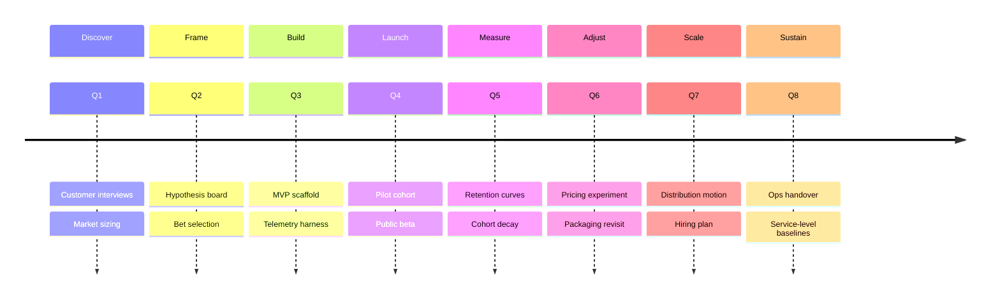
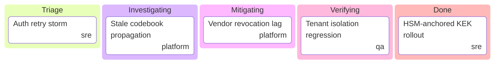
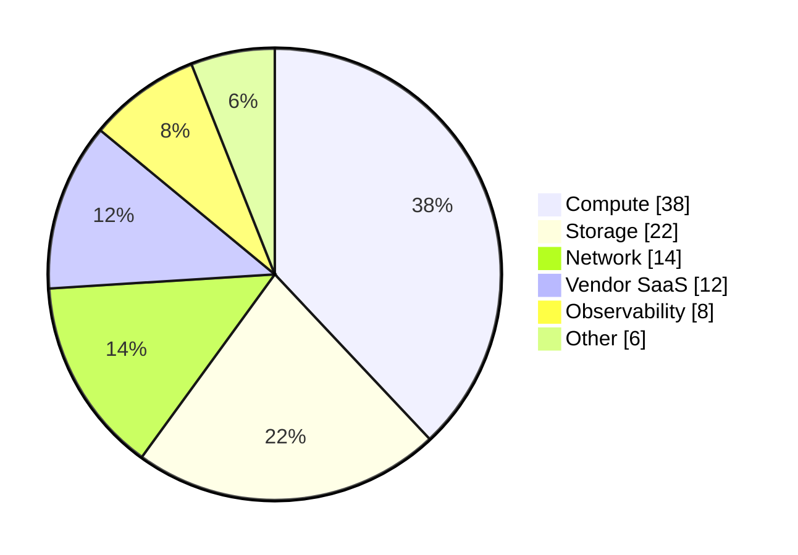

<!-- _class: title -->
<!-- _paginate: false -->
<!-- _footer: "Title slide · title" -->

# Diagram tokens

`Mermaid SVG · palette-blind · WCAG AA asserted`

Per-diagram CSS overrides moved from each palette into `lattice.css`'s
**DIAGRAM OVERRIDES** section. Palettes are token-only. Mermaid's
`themeCSS` init parameter is gone. Every band/text pair is asserted
to clear 4.5:1 in light and dark.

---

<!-- _class: divider -->
<!-- _paginate: false -->
<!-- _footer: "Section divider · divider" -->

`Section 01`

## What changed.

---

<!-- _class: content -->
<!-- _footer: "Before / after" -->

## Architecture in one diff.

**Before**

- Each palette file ends with `/* ===== MERMAID THEME CSS ===== */`, followed by ~540 lines of per-diagram CSS overrides.
- `lattice-emulator.js` splits the palette on the sentinel, resolves `var()` to literal hex, strips the `section ` prefix, injects via Mermaid's `%%{init: { themeCSS: … } }%%`.
- Tokens carry Mermaid nomenclature: `--mermaid-primary-color`, `--mermaid-pie-purple`, `--mermaid-gantt-active`, …

**After**

- Each palette declares `--diagram-*` tokens only. No sentinel, no overrides block.
- Per-diagram CSS lives in `lattice.css`'s DIAGRAM OVERRIDES section, palette-blind via `var(--diagram-*)`. Loaded by every render path; reaches the inline SVG via host cascade.
- No `themeCSS` injection. Mermaid only receives `themeVariables`.

---

<!-- _class: content -->
<!-- _footer: "Token taxonomy" -->

## Tokens by role, not by consumer.

Replaces every `--mermaid-*` token with a role-named `--diagram-*`. A new
palette is purely a token-declaration job — no per-palette CSS rules
needed.

- `--diagram-band-1`..`--diagram-band-12` — the 12-slot pale-fill cycle for sections, columns, levels, slices, leaves.
- `--diagram-band-text-1`..`--diagram-band-text-12` — paired text, pinned to a fixed dark hex (bands stay pale in both modes; text on top must too). Asserted ≥4.5:1.
- `--diagram-stroke`, `--diagram-line`, `--diagram-accent-warm` — structural.
- `--diagram-quadrant-N-{fill,text}` — quadrant chart, fill + text paired.
- `--diagram-state-{active,done,critical,today,grid}` — gantt task lifecycle.
- `--diagram-note-{bg,stroke}`, `--diagram-error-{bg,text}` — note and alarm.
- `--cat-blue..mauve` stays — categorical mid-tone consumed beyond Mermaid (KPI, chart-family).

---

<!-- _class: divider -->
<!-- _paginate: false -->
<!-- _footer: "Section divider · divider" -->

`Section 02`

## Bands in action.

---

<!-- _class: diagram -->
<!-- _footer: "Mermaid timeline · 8 sections cycling --diagram-band-1..8" -->

## Timeline cycles the band.

> First period reads correctly even though Mermaid emits class `section--1` (the off-by-one quirk in its renderer). Covered explicitly + via `cScaleLabel0..11`.

---

<!-- _class: diagram -->
<!-- _footer: "Mermaid kanban · columns on --diagram-band-1..6" -->

## Kanban columns on the band.

> Each column draws from a different `--diagram-band-N`. Tickets sit on `--bg-alt` to read as cards on the swim-lane, distinct from the column hue.

---

<!-- _class: diagram -->
<!-- _footer: "Mermaid pie · 6 slices cycling --diagram-band-1..6" -->

## Pie shares the cycle.

> Identical surface contract as kanban; same fills, same paired dark text.

---

<!-- _class: divider -->
<!-- _paginate: false -->
<!-- _footer: "Section divider · divider" -->

`Section 03`

## How it stays honest.

---

<!-- _class: content -->
<!-- _footer: "Test surface" -->

## Tested, not asserted.

Two unit-tier checks now ride on every commit. Either failing fails CI.

- **`test/unit/palette.test.js`** — every shipped palette must declare all required `--diagram-*` tokens, must NOT carry the legacy MERMAID THEME CSS sentinel, must NOT carry legacy `--mermaid-*` token declarations.
- **`test/unit/contrast.test.js`** — for both indaco and cuoio, in both light and dark mode: every band/text pair clears 4.5:1, every quadrant fill/text pair clears 4.5:1, `--text-heading` clears 4.5:1 on `--bg` and `--bg-alt`, `--diagram-error-text` clears 4.5:1 on `--diagram-error-bg`.

If a palette tweak slips below the bar the test fails loudly — lift the
text or lift the surface, never lower the bar.

---

<!-- _class: closing -->
<!-- _paginate: false -->
<!-- _footer: "Closing · closing" -->

# Cleaner palettes, tested contrast.

`docs/notes/2026-05-12-diagram-tokens.md`

One fewer abstraction. No `themeCSS` parser limits. No Mermaid
nomenclature leaking into the palette layer. Every text-on-band pair
asserted AA in light AND dark.
