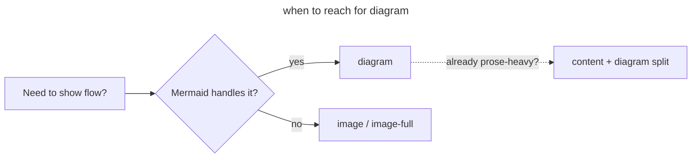

<!-- _class: title -->
<!-- _paginate: false -->
<!-- _footer: "Title slide · title" -->

# A Field Guide to Lattice Layouts

`Authoring · 2026 Edition`

Every slide in this deck explains the layout it is rendered with — what it is, when to use it, and when to reach for something else

---

<!-- _class: divider -->
<!-- _paginate: false -->
<!-- _footer: "Section break · divider" -->

`Section 01 · Bookends and prose`

## The first thing to learn is which layouts open, anchor, and close a deck.

---

<!-- _class: subtopic -->
<!-- _footer: "Centered orientation · subtopic" -->

`Layout · subtopic`

## A subtopic slide announces a sub-section without resetting the deck.

Use it mid-section to mark a new beat without the heavy chrome of a `divider`. The headline is centred, the eyebrow is short. There is room for one paragraph of context — no cards, no lists, no images.

---

<!-- _class: content -->
<!-- _footer: "Single-idea prose · content" -->

`Layout · content`

## Content is the workhorse — one heading, one paragraph, one idea.

Reach for `content` whenever you have a single claim to make and a few sentences of support. The eyebrow tag (the inline-code line above the heading) is optional but recommended for orientation. Resist adding a card grid here — if the page wants cards, switch layouts. If a slide tries to do two things, it will land as half a slide.

---

<!-- _class: diagram -->
<!-- _footer: "Component diagram · diagram" -->

`Layout · diagram`

## Diagram pairs a Mermaid block with an eyebrow caption.

`Use for architecture, flow, or sequence — anything a Mermaid graph reads better than prose`



---

<!-- _class: stats -->
<!-- _footer: "KPI numbers · stats" -->

`Layout · stats`

## Stats foregrounds three or four numbers as the editorial point.

`Use it when the slide's argument is the numbers themselves, not a story they support.`

1. **3–4** ideal count
2. **1** big number per cell
3. **≤4** words per label
4. **0** decorative units

---

<!-- _class: cards-grid -->
<!-- _footer: "2×2 card grid · cards-grid" -->

`Layout · cards-grid`

## Cards-grid is the default for four parallel ideas.

- What it is
  - A 2×2 grid of equal-weight cards. Author with a top-level list; each item becomes a card title, each nested item becomes the body.
- When to use
  - You have exactly 4 parallel claims that read at a similar level of generality.
- When not to use
  - You have 3 cards (use `cards-grid three` or `cards-wide`) or 2 cards (use `compare-prose` or a 2-card cards-grid).
- Composes with
  - `dark`, `compact`, `loose`, `mirror`, and the modifiers `three` / `four`.

---

<!-- _class: cards-grid -->
<!-- _footer: "Inline code in cards · cards-grid" -->

`Layout · cards-grid` `inline code in cards`

## Inline code chips render inside card titles and body alike.

- Card title with code `v2.4`
  - Wrap any backtick-fenced literal in card titles for inline code chips. They use the accent-soft surface so they do not fight the heading.
- Body code is fine too `inline`
  - Inline `code` inside the body uses the same chip treatment. Do not use code chips for headings — that is what the eyebrow is for.
- Status-style chips
  - Card titles ending in a code chip read like a label + status pair. Useful for `required` / `optional` / version markers.
- One chip is enough
  - Two chips on the same title fight each other. If you need two pieces of metadata, drop one into the body or use `list-tabular`.

---

<!-- _class: cards-grid -->
<!-- _footer: "2 top + 1 bottom · cards-grid" -->

`Layout · cards-grid` `numbered, 3-card`

## Three numbered cards fall back to a 2-top-1-bottom arrangement.

1. Use a numbered list to get sequence
   - The grid recognizes ordered lists and prefixes each card with its number. Do this when the cards are sequential beats, not parallel ideas.
2. Three cards is the awkward count
   - 2×2 grids tolerate a fourth card; with three, the layout drops the last to a wide bottom slot. Acceptable, but `cards-wide` is often cleaner.
3. Numbering is editorial, not decorative
   - If the order does not matter, use unordered bullets. Numbered cards say to the reader "read these in order."

---

<!-- _class: cards-stack -->
<!-- _footer: "Vertical card stack · cards-stack" -->

`Layout · cards-stack`

## Cards-stack is the right call for 2–3 substantive beats.

- **Use when each card carries a paragraph.** Cards-grid cells get cramped when you need three or four sentences per card. Stack lets the prose breathe and keeps the eye reading top-to-bottom.
- **Avoid when the beats are short.** If each card is a single line, stack feels sparse. Switch to `cards-grid compact` or `list` for shorter copy.

---

<!-- _class: cards-grid -->
<!-- _footer: "Side-by-side cards · cards-grid" -->

`Layout · cards-grid` `2 cards`

## Two cards in a cards-grid become a clean side-by-side.

- Side-by-side, no connector
  - Two cards laid out horizontally with equal width. No arrow between them, no winner marker. Useful when you want a parallel read without implying causality.
- Reach for `compare-prose` instead when…
  - You want a connector arrow and a below-note. The `compare-prose` chrome reads as "two options that relate to each other"; this layout reads as "two parallel modes."

---

<!-- _class: compare-prose -->
<!-- _footer: "Two options + connector · compare-prose" -->

`Layout · compare-prose`

## Compare-prose adds a connector arrow and an optional below-note.

- Option A
  - The first card. Holds enough body text to fill comfortably. Source order is significant — the second card is what the `chosen` modifier targets.
- Option B
  - The second card. The arrow between them implies direction or relationship: before / after, input / output, considered / chosen.

A trailing paragraph after the cards becomes the below-note. Use it for one explanatory sentence, never for additional argument.

---

<!-- _class: quote -->
<!-- _footer: "Pull quote · quote" -->

> Quote layouts pull a single voice out of the deck and frame it as the editorial point — not as evidence, but as the page's argument.

— Use sparingly. One per section maximum.

---

<!-- _class: timeline -->
<!-- _footer: "Horizontal timeline · timeline" -->

`Layout · timeline`

## Timeline lays five-or-fewer steps across the canvas horizontally.

1. Step name
   - _One italic line of body text per step_
2. Sequence is intrinsic
   - _Use ordered lists; the layout numbers them for you_
3. Five steps is the ceiling
   - _Beyond that, switch to list-steps vertical or timeline-list_
4. Body stays terse
   - _Each line is a caption, not a paragraph_
5. Composes with `dark`
   - _The connector dots and spine remap automatically_

---

<!-- _class: list -->
<!-- _footer: "Card list stack · list" -->

`Layout · list`

## List is a stacked card list — use it for rule sets and "what it does / does not" pages.

- Each top-level bullet becomes a card with an accent left-edge.
- Use unordered bullets for parallel rules, numbered lists for sequenced ones.
- Five to seven items is the comfortable upper bound — beyond that, split the slide.
- Body text is a single line per item; if you need more, switch to `cards-stack`.
- Composes cleanly with `dark`, `compact`, and `loose`.

---

<!-- _class: list -->
<!-- _footer: "Numbered list · list" -->

`Layout · list` `numbered`

## Numbered lists give the same layout an explicit sequence.

1. Use ordered markdown (`1.` / `2.`) when the order matters editorially.
2. The layout renders the number as a leading badge, not a decorative count.
3. Mix-and-match is allowed: numbered cards in one slide, bulleted in another.
4. Beyond seven items, the rhythm gets crowded — split or switch layouts.

---

<!-- _class: big-number -->
<!-- _footer: "Hero stat · big-number" -->

`Layout · big-number`

- 1×
  - One number, one supporting paragraph. Use it when the slide's argument is a single anchor metric — a magnitude that earns its own page. Anything more than one number belongs in `stats`.

---

<!-- _class: split-panel -->
<!-- _footer: "Dark panel + content · split-panel" -->

## Split-panel · section opener with a dark accent column

`Layout · split-panel`

### What it is

A two-column section opener. The left column is a dark accent panel carrying the section number, an eyebrow, and the deck watermark; the right column carries a heading and a numbered list of sub-topics.

1. Use as a deep-dive opener
   - It reads as the start of a section that has internal structure worth previewing.
1. Three to five sub-topics
   - Fewer feels thin; more crowds the right column.
1. Composes with mirror
   - `split-panel mirror` flips the dark column to the right.

---

<!-- _class: closing -->
<!-- _footer: "Dark closing bookend · closing" -->
<!-- _paginate: false -->

`Layout · closing`

## Closing bookends the deck on a dark canvas.

`Use it for the final slide — a CTA, a working-session ask, or the next-step you want the audience to leave with. Pagination is suppressed by convention; one closing per deck.`

---

<!-- _class: cards-grid -->
<!-- _footer: "Finding + key insight · cards-grid" -->

`Variant · cards-grid with finding + key insight`

## A trailing blockquote becomes the slide's key insight.

- What it is
  - The cards layout you already know, with a `>` blockquote after the cards. The blockquote renders as an accent-tinted callout below the grid.
- When to use
  - Findings slides — the cards carry the data, the callout carries the takeaway.
- Authoring rule
  - One blockquote, one line. Multi-line callouts crowd the grid.
- Composes with
  - All cards-grid variants, `dark`, `compact`. The callout adapts to the canvas.

> One trailing blockquote becomes the key insight; one trailing italic paragraph becomes a source annotation.

---

<!-- _class: cards-grid -->
<!-- _footer: "Key insight + below-note · cards-grid" -->

`Variant · cards-grid with insight + below-note`

## Add a plain trailing paragraph for a below-note under the insight.

- The pattern
  - Cards followed by a `>` blockquote followed by a plain paragraph. All three render in the same slide without crowding.
- The hierarchy
  - Cards = data. Blockquote = takeaway. Paragraph = footnote / context.
- The rule
  - One of each, in that order. Two paragraphs after the blockquote will not stack cleanly.
- The escape hatch
  - If you need more chrome than this, you are on the wrong layout — try `featured`.

> The blockquote is the editorial verdict; the trailing paragraph is the small print.

The below-note sits under the insight after a hairline rule. Use it for source attribution, methodology, or one contextual sentence.

---

<!-- _class: cards-grid -->
<!-- _footer: "Key insight + annotation · cards-grid" -->

`Variant · cards-grid with insight + italic annotation`

## A trailing italic-only paragraph becomes a quieter annotation.

- The italic-only test
  - The whole paragraph wrapped in `_..._` markers — no surrounding regular text — triggers the annotation treatment.
- It looks different from the below-note
  - Smaller type, italic, no rule above. Use when the line is a citation rather than a footnote.
- One trick per slide
  - You can have an annotation OR a below-note, not both. The cascade prefers annotation when both appear.

> The cards say what; the blockquote says so what; the annotation says where it came from.

_The italic annotation reads as source attribution — quiet, citational, easy to skip._

---

<!-- _class: cards-wide -->
<!-- _footer: "3 full-width cards · cards-wide" -->

`Layout · cards-wide`

## Cards-wide is the right call for three sequential beats with body text.

1. Three is the sweet spot
   - The layout is built for exactly three full-width cards. Each card spans the canvas horizontally and has room for two or three sentences of body text.
2. Use for "three findings", "three risks", "three failure modes"
   - When you need to elaborate on each beat with a paragraph, `cards-wide` gives the prose room without the cramped feel of a 3-column grid.
3. Avoid when the cards need to be parallel
   - If the three cards read as parallel parts of a whole, switch to `cards-grid three` for the tighter visual rhythm.

---

<!-- _class: list-criteria -->
<!-- _footer: "Numbered criteria · list-criteria" -->

`Layout · list-criteria`

## List-criteria stacks named criteria with descriptions.

- Speed
  - The layout is for "named axis + definition" content. Each criterion gets a bold label and a one-line definition.
- Auditability
  - Use it when the deck needs to introduce the axes that a later slide (`verdict-grid`, `compare-table`) will score against.
- Adoption
  - Three to five criteria is comfortable. Six starts to crowd the canvas.
- Composes with
  - `dark`, `compact`. Avoid pairing with `loose` — list-criteria already carries vertical rhythm.

---

<!-- _class: verdict-grid -->
<!-- _footer: "2×2 verdict grid · verdict-grid" -->

`Layout · verdict-grid`

## Verdict-grid scores 4 options against 4 criteria with checkboxes.

- Option A · Skipped
  - [x] Pass marker
  - [-] Partial marker
  - [x] Pass marker
  - [ ] Fail marker
  - Description text below the verdicts. Three to four lines is the comfortable cap per cell.
- Option B · Partial
  - [ ] Fail marker
  - [x] Pass marker
  - [x] Pass marker
  - [ ] Fail marker
  - Use the `[x]` / `[ ]` / `[-]` GitHub-flavored task markers — the layout converts them into pass/fail/partial pills.
- Option C · Risky
  - [x] Pass marker
  - [x] Pass marker
  - [-] Partial marker
  - [ ] Fail marker
  - Authoring tip: keep the criterion names in the same order across all four cards, or the visual reading breaks down.
- Option D · Recommended
  - [x] Pass marker
  - [x] Pass marker
  - [x] Pass marker
  - [x] Pass marker
  - The all-pass card is the editorial verdict. There is no built-in "winner" badge — make it land through copy.

---

<!-- _class: compare-table -->
<!-- _footer: "Comparison table · compare-table" -->

`Layout · compare-table`

## Compare-table renders a markdown table with chrome that reads at projector range.

| When to use     | Use compare-table                          | Use verdict-grid                       |
| --------------- | ------------------------------------------ | -------------------------------------- |
| Many criteria   | ✓                                          | ✗                                      |
| Many options    | ✓                                          | Caps at 4                              |
| Per-cell prose  | ✗                                          | ✓                                      |
| Heavy chrome    | ✗ (typography-only)                        | ✓ (cards + pills)                      |
| Reading rhythm  | Scan vertically                            | Scan horizontally                      |

_The same data fits both — pick the form that matches how the audience will read it._

---

<!-- _class: glossary -->
<!-- _footer: "Glossary · glossary (auto-table, auto-pill)" -->

`Layout · glossary`

## Glossary

- Annotation
  - A trailing italic-only paragraph on a card-bearing slide. Renders smaller and quieter than a below-note.
- Below-note
  - A trailing plain paragraph on a card-bearing slide. Sits under a hairline rule; carries one contextual sentence.
- Card
  - The accent-edged content unit used by `cards-grid`, `cards-stack`, `cards-wide`, `featured`, and several other layouts.
- Eyebrow
  - The short inline-code line above a slide heading. Renders in the accent colour at small caps weight.
- Insight
  - A trailing blockquote on a card-bearing slide. Renders as an accent-tinted callout below the cards.
- Modifier
  - A class added alongside the layout class — `dark`, `compact`, `loose`, `mirror`, `numbered`, `accent`. Composable in most cases.
- Slot
  - A named region of a layout — title, header, footer, eyebrow, watermark, content area. Most layouts pre-reserve their slots.

---

<!-- _class: glossary -->
<!-- _footer: "Glossary continued · glossary (auto-table, auto-pill)" -->

`Layout · glossary` `continued`

## Glossary

- Spectrum stripe
  - The default top border on light slides — a multi-stop gradient. The `accent` modifier replaces it with one solid colour.
- Status pill
  - A trailing inline-code chip on a card title that the layout reads as a status label (`on-track`, `at-risk`, etc.). Used by `progress` and `timeline-list`.
- Watermark
  - The deck-name string anchored to the bottom edge of `divider`, `subtopic`, `closing`, and `split-panel` slides. Reads from frontmatter.
- Connector
  - The arrow rendered between two cards in `compare-prose`, `before-after`, and `decision`. Vertical or horizontal depending on layout.
- Below-note
  - See above. Listed twice because it earns its weight in authoring practice.
- Pillage
  - Not a real term. The glossary auto-paginates the entries; you can split a glossary across two slides without losing rhythm.

---

<!-- _class: featured -->
<!-- _footer: "Featured + 2 sub-cards · featured" -->

`Layout · featured`

## Featured is one hero card plus two supporting cards.

- The hero card · the one editorial point
  - The first card in the markdown becomes the hero. It carries the accent-tinted background and the editorial weight. Use it for the slide's central claim.
- First supporting card
  - Subsequent cards stack to the right. They support, qualify, or extend the hero claim. Two supporting cards is the sweet spot — three crowds the column.
- Second supporting card
  - Composition tip: pair `featured mirror` with a deck that reads right-to-left, or when the hero claim should land last in the audience scan.

---

<!-- _class: compare-prose -->
<!-- _footer: "Two options + connector · compare-prose" -->

`Layout · compare-prose` `with below-note`

## Two cards, one connector, one explanatory note below.

- Option A
  - The first card. The connector arrow between the two cards reads left-to-right by default — it implies progression, comparison, or causality.
- Option B
  - The second card. The visual hierarchy is symmetric until you add `chosen` (right wins) or `decision` (left rejected, right chosen).

The trailing paragraph is the below-note: one explanatory sentence under a hairline rule. Reach for it when the comparison needs context the cards cannot carry.

---

<!-- _class: list-steps -->
<!-- _footer: "Horizontal steps · list-steps" -->

`Layout · list-steps`

## List-steps is a horizontal sequence with a connector spine.

1. Three to four steps
   - Five fits but starts to feel cramped. Beyond five, switch to `list-steps vertical` or `timeline-list`.
2. The connector is editorial
   - Each step connects to the next with an arrow — the layout reads as a process, not a parallel set.
3. Composes with phase / milestone
   - `phase` renames the prefix STEP → PHASE. `milestone` renames it to MILESTONE. `lettered` swaps numbers for letters.
4. Composes with vertical
   - `list-steps vertical` stacks the steps as rows; useful when each step needs more body text than a horizontal row can hold.

---

<!-- _class: list-tabular -->
<!-- _footer: "Tabular list · list-tabular" -->

`Layout · list-tabular`

## List-tabular adds a metadata column to each list item.

1. The pattern
   - Each item has three lines: title, body, italic-meta
   - _Authoring · 3-line item_
2. Use for definition + meta
   - Glossary-like content where each term carries a unit, source, or category
   - _Reach · keep meta short_
3. The italic third line
   - Wrap the third line in `_..._` to flag it as the meta column
   - _Convention · italic = meta_
4. Six items is comfortable
   - Eight crowds the canvas; if you need more, split or switch to `glossary`
   - _Capacity · ~6 rows_

---

<!-- _class: content -->
<!-- _footer: "Header and footer demo · content" -->
<!-- _header: "Lattice · Layout Field Guide" -->
<!-- _footer: "Header stays uppercase · footer renders as written" -->

`Frontmatter · header and footer`

## Header stays uppercase — footer renders as written.

Set `header:` and `footer:` in deck frontmatter for default chrome on every slide. Override per-slide with `<!-- _header: -->` and `<!-- _footer: -->` directives. The header always uppercases via CSS `text-transform`; the footer renders exactly as authored, so reach for sentence case there. The `_paginate: false` directive suppresses pagination on a single slide — used here on `title` and `closing`.

---

<!-- _class: code -->
<!-- _footer: "Single code block · code" -->

`Layout · code`

## Code reserves the slide for a single fenced code block.

`Authoring rule · one block per slide`

```javascript
// Use the `code` layout when one snippet
// IS the slide. The layout sets a max
// width, generous padding, and locks
// the eyebrow above the block.

const layout = "code";
const blocks = 1;          // exactly one
const supportsLanguages = "every Marp-supported lang";

// For two blocks (before/after, A/B),
// switch to `compare-code`.
```

---

<!-- _class: compare-code -->
<!-- _footer: "Two code blocks · compare-code" -->

`Layout · compare-code`

## Compare-code shows two snippets side-by-side with eyebrows above each.

`Before · the lazy way`

```python
# Two code blocks with no chrome.
# Reader has to figure out which
# is which.
def before(x):
    return x * 2
```

`After · compare-code`

```python
# Eyebrows above each block label
# them. The connector between the
# blocks implies progression.
def after(x):
    return x * 2  # but explained
```

---

<!-- _class: image -->
<!-- _footer: "Real image · image" -->

`Layout · image`

## Image is half-canvas image right, half-canvas text left.

The default places the image in the right slot and the text in the left. Drop the asset in with the standard Marp `bg right fit` directive — Lattice respects native aspect ratios and fills any remaining bands with the lattice pattern. Authors should expect to see the image they dropped in, not a cropped variant.


---

<!-- _class: image left -->
<!-- _footer: "Real image · image left" -->

`Layout · image left`

## Image left flips the orientation — image left, text right.

Use `image left` (or the cross-cutting `image mirror` modifier) when you want the image to land first in the audience's reading order. Common case: portrait assets that read better as a leading visual than as a trailing one. The text padding swaps to match.


---

<!-- _class: image-full -->
<!-- _footer: "Image full · image-full" -->
<!-- _paginate: false -->

## Image-full · the full-bleed canvas slide

A full-bleed image with optional overlay text. Use it for hero visuals, section dividers with imagery, or showcase moments. Pagination is suppressed by convention since these slides usually act as bookends.


---

<!-- _class: divider dark -->
<!-- _paginate: false -->
<!-- _footer: "Dark variant — section break · divider dark" -->

`Modifier · dark`

# The dark modifier inverts the canvas without changing the layout.

Add `dark` alongside any layout class — palette remaps automatically through CSS variables

---

<!-- _class: content dark -->
<!-- _footer: "Dark variant — prose · content dark" -->

`Modifier · dark` `on content`

## Dark is a palette swap, not a different layout.

Every colour in the system references CSS custom properties — `--bg`, `--text-heading`, `--text-body`, `--border`, `--accent-soft`. The `dark` class remaps those properties on the slide root; the layout's geometry and spacing are unchanged. The spectrum top stripe is suppressed on dark slides; the `accent` modifier restores a solid accent stripe in its place.

---

<!-- _class: image-full dark -->
<!-- _footer: "Image full dark · image-full dark" -->
<!-- _paginate: false -->

## [ Image-full dark · portrait asset ]

A tall asset on a wide canvas with the dark palette. The lattice pattern frames the image on the left and right; the overlay text inherits the dark canvas colours.


---

<!-- _class: list dark -->
<!-- _footer: "Dark variant — list · list dark" -->

`Modifier · dark` `on list`

## The card stack renders cleanly on dark backgrounds.

- Card fills shift to `--bg-alt` (a dark grey-blue), borders shift to `--border-dark`.
- The accent left edge keeps the same hue — `--accent` is canvas-neutral by design.
- Body text shifts to `--text-body` (a warm light tone, never pure white).
- All inline code chips remap to a darker `--accent-soft` while keeping AA contrast.
- No layout-specific overrides are needed — every layout that uses these tokens dark-renders for free.

---

<!-- _class: cards-stack dark -->
<!-- _footer: "Dark variant — stacked cards · cards-stack dark" -->

`Modifier · dark` `on cards-stack`

## Two-card layouts work equally well inverted to dark.

- The discipline of dark mode is to **change nothing structural**. Same heading, same eyebrow, same card geometry, same spacing. Only the palette tokens move. If a slide reads well on light and badly on dark (or vice versa), the cause is content density, not the modifier.
- Reach for `dark` when a slide carries editorial weight — section breaks, declarative principles, the closing line of an argument. Reach for it sparingly. A deck that is half dark and half light is harder to read than one that uses dark as punctuation.

---

<!-- _class: list-steps phase -->
<!-- _footer: "Modifier — list-steps phase · list-steps phase" -->

`Modifier · list-steps phase`

## Phase renames the prefix word from STEP to PHASE.

1. The change is purely textual
   - The layout still renders identical chrome — connector spine, numbered badges, vertical rhythm. Only the prefix label moves from STEP 01 to PHASE 01.
2. Use phase for plans that span weeks-to-quarters
   - "Step" reads as a 5-minute unit; "Phase" reads as a 5-week unit. Match the prefix to the timescale you are describing.
3. Sibling modifiers
   - `milestone` renames to MILESTONE; `lettered` swaps numbers for letters; they all compose with `vertical`, `dark`, and `compact`.

---

<!-- _class: list-steps milestone lettered -->
<!-- _footer: "Modifier — list-steps milestone lettered · list-steps milestone lettered" -->

`Modifier · list-steps milestone lettered`

## Modifiers compose: milestone renames the word, lettered swaps the format.

1. Two modifiers, one slide
   - `milestone` changes the prefix word to MILESTONE; `lettered` swaps numeric badges for alphabetic ones (A / B / C). Both at once gives you "MILESTONE A · MILESTONE B · MILESTONE C".
2. Read order is unchanged
   - Letters do not imply a different ordering than numbers. They are a typographic choice, not an editorial one.
3. Use lettered when the audience confuses sequence with magnitude
   - "Phase 3" can sound bigger than "Phase 1"; "Phase C" carries no such weight. Useful for parallel workstreams.

---

<!-- _class: list-steps vertical compact -->
<!-- _footer: "Modifier — list-steps vertical · list-steps vertical compact" -->

`Modifier · list-steps vertical`

## Vertical stacks the steps as rows; the connector becomes a down-arrow.

1. Use when each step needs body text
   - Horizontal steps cap each row at one short caption. Vertical lets you write a full sentence per step without truncating.
2. Composes with compact
   - `list-steps vertical compact` shrinks the spacing between rows so all four steps fit on one slide. Without `compact`, three rows is the comfortable cap.
3. The connector flips
   - The arrow rendered between steps rotates from horizontal to a vertical down-arrow. No authoring change required.

---

<!-- _class: compare-prose chosen -->
<!-- _footer: "Modifier — compare-prose chosen · compare-prose chosen" -->

`Modifier · compare-prose chosen`

## Chosen flags the right-hand card as the winner.

- Considered alternative
  - Source order matters: the *first* card in the markdown is always the considered alternative; the *second* is the one `chosen` flags.
- The chosen path
  - The right card carries an accent left-edge and an accent-tinted background — same visual contract as a featured card. The connector arrow remains, now reading as "we chose this one."

The right card carries an accent left-edge and accent-tinted background — the same visual contract used by featured cards.

---

<!-- _class: compare-prose decision -->
<!-- _footer: "Modifier — compare-prose decision · compare-prose decision" -->

`Modifier · compare-prose decision`

## Decision composes chosen + rejected with a labelled connector.

- The rejected option
  - The left card is rendered with strikethrough type and a muted accent — visually struck off the page. It still occupies its column, so the reader can see what was considered before being dropped.
- The chosen option
  - The right card carries the same accent treatment as `chosen` alone. The connector between them is amplified with a labelled DECISION pill so the slide reads as a recorded judgement.

The left card is struck through to read as the option considered then dropped; the right card carries the chosen visual; the connector is amplified and labelled DECISION.

---

<!-- _class: compare-prose vertical -->
<!-- _footer: "Modifier — compare-prose vertical · compare-prose vertical" -->

`Modifier · compare-prose vertical`

## Vertical stacks the two cards; the arrow connector rotates 90°.

- Card A — top
  - The first card now occupies the top half of the canvas. Use vertical when the comparison is before/after in time, where reading top-to-bottom matches the editorial flow.
- Card B — bottom
  - The second card sits below. The connector arrow rotates from horizontal to a down-arrow without authoring intervention.

---

<!-- _class: cards-grid three -->
<!-- _footer: "Modifier — cards-grid three · cards-grid three" -->

`Modifier · cards-grid three`

## Three switches the grid from 2 columns to 3 columns.

- When to use
  - Three parallel concepts of equal weight. Without `three`, three cards fall back to a 2-top-1-bottom layout, which reads as "two main, one trailing."
- Card body length
  - Three columns leaves less width per card. Keep body text to one short sentence, or pair with `compact` for tighter padding.
- Composes with
  - `dark`, `compact`, `loose`, `mirror`. Avoid pairing with `four` (the modifiers conflict).

---

<!-- _class: cards-grid four compact -->
<!-- _footer: "Modifier — cards-grid four · cards-grid four compact" -->

`Modifier · cards-grid four`

## Four switches to 4 columns; pair with compact for visual balance.

- Four columns
  - The grid switches from a 2×2 to a 1×4 — all four cards in a single row.
- Use for short labels
  - With four columns, each card has narrow width. Restrict body text to one short line per card.
- Pair with compact
  - `cards-grid four compact` shrinks the column gaps and card padding so the row reads as a unit, not four cramped boxes.
- Avoid for prose-heavy content
  - If any card needs more than a single sentence, switch back to `cards-grid` (2×2) or `cards-wide` (3-row).

---

<!-- _class: cards-stack horizontal -->
<!-- _footer: "Modifier — cards-stack horizontal · cards-stack horizontal" -->

`Modifier · cards-stack horizontal`

## Horizontal flips cards-stack from a vertical stack to a row.

1. **Three short beats.** Use when each beat is a sentence or two and you want them to read as "one argument in three moves."
2. **Bold-led copy.** The convention is to lead each card with a bolded label (Claim. / Evidence. / Implication.) and let the rest of the sentence follow.
3. **Avoid for prose.** With three columns of stacked content, body text gets cramped. If you need paragraphs, switch back to vertical `cards-stack`.

---

<!-- _class: image mirror -->
<!-- _footer: "Modifier — image mirror · image mirror" -->

`Modifier · image mirror`

## Mirror flips the image to the other half — alias of legacy `image left`.

The half-canvas image moves from the right slot to the left slot, and the text padding swaps to match. `mirror` is the cross-cutting orientation flag — the same modifier flips `featured`, `split-panel`, and `compare-prose`. The legacy `image left` class is preserved as an alias for one release; new authoring should prefer `image mirror`.


---

<!-- _class: featured mirror -->
<!-- _footer: "Modifier — featured mirror · featured mirror" -->

`Modifier · featured mirror`

## Mirror puts the hero card on the right; sub-cards stack on the left.

- The hero now reads from the right
  - The featured layout normally leads with the accented hero card on the left and stacks supporting cards on the right. Mirror swaps the columns without touching the markdown contract.
- First supporting card on the left
  - Useful when the rest of the deck reads right-to-left or when the editorial weight needs to land on the right edge as the next slide opens.
- Second supporting card below
  - Identical structure, identical authoring; only the visual side changes.

---

<!-- _class: split-panel mirror -->
<!-- _footer: "Modifier — split-panel mirror · split-panel mirror" -->

## Split-panel mirror moves the dark accent panel to the right.

`Modifier · split-panel mirror`

### What changes — and what doesn't

The watermark, eyebrow, and section number stay anchored to the panel's own box. Only the column position flips. The numbered list of sub-topics moves to the left column.

1. The accent panel and its content travel together.
   - The panel is a structural slot, not a styling treatment.
1. The reading order changes for left-to-right audiences.
   - Reach for mirror when the next slide opens with content on the right.
1. The modifier composes with dark.
   - `split-panel mirror dark` is fully supported.

---

<!-- _class: compare-prose mirror chosen -->
<!-- _footer: "Modifier — compare-prose mirror chosen · compare-prose mirror chosen" -->

`Modifier · compare-prose mirror chosen`

## Mirror composes with chosen — the accented card reads from the left.

- Considered alternative
  - Source order does not change with mirror. The first card in the markdown is still the considered alternative; the second is still the one `chosen` flags.
- The choice
  - Mirror only flips the rendering. The chosen card now appears on the left visually, but the editorial intent (left = considered, right = chosen) is preserved by reading order alone.

The below-note still appears under both cards after the hairline rule.

---

<!-- _class: divider numbered -->
<!-- _footer: "Modifier — divider numbered · divider numbered" -->

`Modifier · divider numbered`

## Numbered stamps an auto-counter in the top-right corner.

The CSS counter walks the whole deck once and increments on every `divider.numbered` slide. Authors do not number sections by hand — the layout does it. If you re-order or insert a section, the counter recomputes automatically. There is no markdown to maintain.

---

<!-- _class: subtopic numbered -->
<!-- _footer: "Modifier — subtopic numbered · subtopic numbered" -->

`Modifier · subtopic numbered`

## Each bookend layout owns its own counter.

The subtopic counter is independent of the divider counter. A mid-deck subtopic stamps `01` even when the dividers are already at `04`. This separation lets you have multiple counted streams running in parallel — major sections via `divider numbered`, minor sub-topics via `subtopic numbered`, closing parts via `closing numbered`.

---

<!-- _class: closing numbered -->
<!-- _footer: "Modifier — closing numbered · closing numbered" -->
<!-- _paginate: false -->

`Modifier · closing numbered`

## The closing series gets its own auto-stamp too.

`Use it for multi-part decks where the closing slide of each part should carry the part number. Single-deck closings rarely need numbering — reach for plain closing instead.`

---

<!-- _class: matrix-2x2 -->
<!-- _footer: "New layout — matrix-2x2 · matrix-2x2" -->

`Layout · matrix-2x2`

## Matrix-2x2 sorts items into a four-quadrant grid.

`Two axes · four quadrants`

- High Y / Low X
  - Quadrant content goes here. Each item is a bulleted list under the quadrant label.
  - Multiple items per quadrant are supported.
- High Y / High X
  - Use when the question is "where on these two axes?" — vendor sorting, risk-vs-reward, urgent-vs-important.
- Low Y / Low X
  - Quadrants accept short prose; long prose belongs in `cards-grid`.
- Low Y / High X
  - _Empty quadrants are part of the signal — author them with an italic note._

---

<!-- _class: decision -->
<!-- _footer: "New layout — decision · decision" -->

`Layout · decision`

## Decision is one chosen card plus two rejection-rationale cards.

`Use it for committed-decision slides`

- The choice
  - One short card naming what was decided. Lead with the verb: "Build", "Defer", "Adopt".
- Why not the alternative
  - One short card naming the rejected option and the reason. Reach for one or two — never more than three.
- Why not delay
  - A second rejection card. Common pattern: alternative + delay. The slide reads as "what we are doing, what we are not, why now."

---

<!-- _class: before-after -->
<!-- _footer: "New layout — before-after · before-after" -->

`Layout · before-after`

## Before-after is two cards labelled by time, with a connector and below-note.

`Time-shaped comparison`

- Before
  - The first card holds the prior state. Body text describes how things were — process, performance, posture.
- After
  - The second card holds the new state. Body text describes what changed and what the change yields.

The below-note explains what *caused* the shift. Use it to credit the architectural change rather than the metric — "the cause was X, not a Y optimisation."

---

<!-- _class: decision banner-tag -->
<!-- _footer: "Variant — decision · banner-tag" -->

`Modifier · banner-tag`

## Banner-tag changes the chrome — same content, different framing.

`Same decision · different visual emphasis`

- The choice
  - The `banner-tag` modifier replaces the eyebrow with a full-width banner across the top of the slide. Reach for it when the decision is the slide's headline.
- Why not the alternative
  - The body cards are unchanged. Same source markdown, different chrome.
- Why not delay
  - Composes with `dark` and `accent`. Avoid pairing with `mirror` — banner is visually anchored top-left.

---

<!-- _class: before-after banner-tag -->
<!-- _footer: "Variant — before-after · banner-tag" -->

`Modifier · banner-tag` `on before-after`

## Banner-tag also fronts the before-after layout.

`Time-shaped comparison · banner emphasis`

- Before
  - Same authoring, same cards. The banner replaces the eyebrow at the top of the slide.
- After
  - Use banner-tag when the deck has only one or two before-after slides and you want them to land harder than the surrounding chrome.

---

<!-- _class: principles -->
<!-- _footer: "New layout — principles · principles" -->

`Layout · principles`

## Principles is a tight numbered list of declarative beliefs.

1. The list is the slide — no body text, no cards, no chrome.
2. Three or four lines is the comfortable cap; five starts to crowd.
3. Lead with "We" or with an imperative — principles are stated, not described.

---

<!-- _class: roadmap -->
<!-- _footer: "New layout — roadmap · roadmap" -->

`Layout · roadmap`

## Roadmap is a workstream × phase grid built from a markdown table.

| Authoring  | Phase 01            | Phase 02              | Phase 03               |
| ---------- | ------------------- | --------------------- | ---------------------- |
| Workstream | The leftmost column | is the sticky label   |                        |
| Phase row  | Each row is a       | workstream's          | trajectory             |
| Empty cell | Render as           | a thin                | dash                   |
| Pill style | Phase columns       | carry numbered chrome |                        |

The first column is the sticky workstream label; phase columns carry numbered chrome; empty cells render as a thin dash.

---

<!-- _class: kpi attention -->
<!-- _header: '' -->
<!-- _footer: "New layout — kpi (bare = briefing default)" -->

`Layout · kpi`

### Layout · kpi
## One headline metric, three supports, status pills on every row.

1. **94%**
   - Token-issuance success
   - target 99% · -5pp QoQ `At risk` `Board`
2. **8 ms**
   - p99 detokenize
   - target 10 ms · -3 ms QoQ `On plan` `SRE`
3. **0**
   - Examiner findings
   - target 0 · flat `On plan` `Audit`
4. **3.2×**
   - Detokenize headroom
   - target 2× · +0.4× QoQ `On plan` `Platform`

---

<!-- _class: agenda progress-2 -->
<!-- _footer: "New layout — agenda · agenda progress-2" -->

`Layout · agenda` `progress-2 modifier`

## Agenda lists the sections of the deck with optional progress chrome.

1. Section name — page number
2. The progress-2 modifier highlights the second item
3. Use it as the second slide so audiences know the structure
4. Composes with progress-3, progress-4, etc — the digit is the highlighted index
5. Authoring rule — keep entries to one short line each

---

<!-- _class: actors -->
<!-- _footer: "New layout — actors · actors" -->

`Layout · actors`

## Actors is a RACI-style ownership grid — role title + body.

- **Bolded label** `code-chip role`
  - Each actor has a bold heading, an inline-code role pill, and a body paragraph.
- **Use for ownership clarity** `responsible party`
  - Reach for actors when the slide answers "who does what" — RACI, lifecycle ownership, decision rights.
- **Three to four roles** `comfortable cap`
  - More than four crowds the column rhythm. If you need five, split the slide.
- **Composes with dark** `compact too`
  - Both modifiers compose cleanly. `accent` is also supported.

---

<!-- _class: tldr numbered -->
<!-- _footer: "New layout — tldr · tldr numbered" -->

`Layout · tldr numbered`

## Tldr is a recap list with optional slide cross-references.

- One bullet per takeaway. → cap at five.
- Trailing arrow + slide number gives the deep-dive pointer. → optional.
- The numbered modifier auto-stamps the slide. → counter is shared with `divider numbered`.
- Reach for tldr after a long section. → the audience will thank you.
- Avoid tldr at deck open. → use agenda instead.

---

<!-- _class: checklist -->
<!-- _footer: "New layout — checklist · checklist" -->

`Layout · checklist`

## Checklist renders GitHub-flavored task markers as state pills.

## What this layout knows about state.

- [x] Use `[x]` for shipped / done / pass items
- [x] Use `[-]` for in-progress / partial items `with optional pill`
- [-] In-progress items render with a striped fill
- [ ] Use `[ ]` for not-yet / future items `Phase 2`
- [ ] Empty checkboxes render with a quiet outline

---

<!-- _class: cards-grid compact -->
<!-- _footer: "Modifier — compact · cards-grid compact" -->

`Modifier · compact`

## Compact tightens the spacing scale ~25%, end-to-end.

- What changes
  - `--sp-xs` through `--sp-2xl` shrink. Card gaps, list gutters, and section padding follow because every layout reads them via `var()`.
- What does not change
  - Type ramp, palette, and chrome reservation (header / footer / pagination) are untouched. Compact is a density flag, not a different layout.
- When to reach for it
  - You have one more card than fits, or your prose runs the section by 1–2 lines, or you want a denser visual rhythm without rewriting copy.
- Composition
  - `compact` composes with `dark`, `accent`, and any layout where density makes sense. It is silently incompatible with `title`, `divider`, and `image-full`.

---

<!-- _class: content loose -->
<!-- _footer: "Modifier — loose · content loose" -->

`Modifier · loose`

## Loose is the inverse — more breathing room, same layout machinery.

The spacing scale grows ~25% rather than shrinks. Sections that already look generous become luxurious; sections that look cramped become balanced. Reach for `loose` when the slide carries a single editorial point and you want the page to feel deliberately quiet — values pages, declarative principles, the closing line of an argument.

The discipline is the same as `compact` from the other side: do not change the type ramp, do not change the chrome, do not change the layout. Only the variables that govern between-element rhythm move.

> Density is not the same as importance. `loose` says: this page deserves room — not because it carries more, but because it carries one thing well.

---

<!-- _class: progress -->
<!-- _footer: "Horizontal bars with status pills · progress" -->

`Layout · progress`

## Progress renders horizontal bars with percentage labels and status pills.

Snapshot taken at 14:00 UTC. Status pills tint the bar fill; the lucent strip lifts the chart from the canvas.

- Use trailing `\`pct%\`` for the bar fill `on-track`
- Use a second trailing pill for status `at-risk`
- Five rows is the comfortable cap `deferred`
- Composes with dark and minimal modifiers `blocked`
- Authoring is just a top-level list `done`

_Source attribution lives in a trailing italic line._

---

<!-- _class: progress dark -->
<!-- _footer: "Dark canvas · progress dark" -->

`Modifier · progress dark`

## Same data, dark canvas — status colours hold their contrast.

The status pills carry their own contrast logic; on the dark canvas they shift to slightly lifted variants of the same hues. The lucent strip darkens proportionally so the chart still reads as a separate plane from the canvas.

- Bar 1 `92%` `on-track`
- Bar 2 `68%` `at-risk`
- Bar 3 `81%` `on-track`
- Bar 4 `34%` `deferred`
- Bar 5 `12%` `blocked`

---

<!-- _class: timeline-list -->
<!-- _footer: "Horizontal spine with date pills · timeline-list" -->

`Layout · timeline-list`

## Timeline-list is a vertical timeline with date pills and trailing status.

Use it when the timeline has more than five items, or when each milestone needs a date *and* a status. The spine and dots come for free; date pills lead each item, status pills trail.

1. `Date pill` Title `status pill`
   - Lead each item with a date in inline-code, then the milestone title.
2. `2025 Q3` Trailing pill is optional `pilot`
   - The trailing pill reads as a status — pilot, decision, live, deferred.
3. `2026 Q1` Body text below the title `live`
   - One short paragraph per milestone. Multi-line is supported but discouraged.
4. `Authoring` Use ordered lists `done`
   - The numbered prefix is dropped on render — only the date pill leads.

_Source attribution lives in a trailing italic line._

---

<!-- _class: piechart donut -->
<!-- _footer: "SVG donut with legend · piechart donut" -->

`Layout · piechart donut`

## Piechart renders an SVG donut with an author-ordered legend.

Wedges drawn proportionally to the percentages in the source list. The legend reads in author order with raw values; the donut reads as a single visual unit.

- Wedge 1 `46%`
- Wedge 2 `22%`
- Wedge 3 `18%`
- Wedge 4 `9%`
- Wedge 5 `5%`

_Refreshed weekly · last updated 2026-05-07_

---

<!-- _class: progress minimal -->
<!-- _footer: "Minimal modifier · progress minimal" -->

`Modifier · progress minimal`

## Minimal strips the lucent strip and lets the chart dominate.

The lucent strip is gone; the header reads as quiet typography with an accent hairline, and the chart consumes the page. Reach for minimal when the chart IS the slide — no surrounding argument, no supporting prose, just the data.

- Bar 1 `92%` `on-track`
- Bar 2 `68%` `at-risk`
- Bar 3 `81%` `on-track`
- Bar 4 `34%` `deferred`
- Bar 5 `12%` `blocked`

_Source: Linear · refreshed 2026-05-07_

---

<!-- _class: closing accent -->
<!-- _paginate: false -->
<!-- _footer: "Modifier — accent · closing accent" -->

`Modifier · accent`

## Accent replaces the rainbow stripe with a single editorial colour.

The default top border is a spectrum gradient — a system signal that the page is part of a wider deck. The `accent` modifier swaps that stripe for one solid colour and tints the slide heading. Use it when one slide carries the editorial weight of a section and you want the visual chrome to say so.

It composes with `dark`: on the dark canvas the spectrum top-stripe is suppressed entirely, so `accent.dark` restores a solid accent stripe in its place — preserving the visual signal across both canvases.

<!-- Import Mermaid and the Lattice runtime theme for VS Code / web preview.
     The build script (lattice-emulator.js) pre-renders Mermaid to SVG at build time
     so these scripts are a no-op in the PDF/HTML output. -->
<!-- markdownlint-disable MD033 -->
<script src="../mermaid-v11.min.js"></script>
<script src="../lattice-runtime.js"></script>
