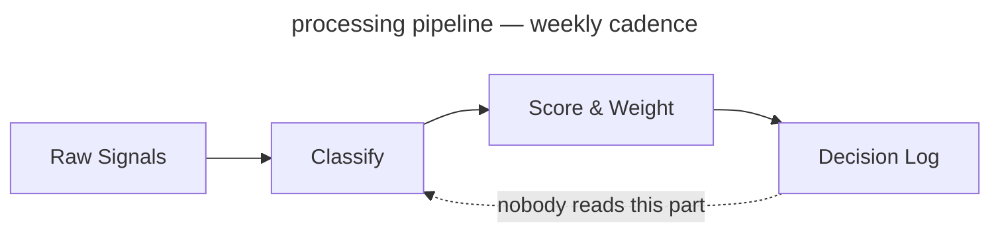

<!-- _class: title -->
<!-- _paginate: false -->
<!-- _footer: "Title slide · title" -->

# From Signal to Strategy

`Decision Framework · Q3 2025`

An 80-slide answer to the question "have you considered writing things down"

---

<!-- _class: agenda progress-2 -->
<!-- _footer: "Agenda near top, section 2 pre-highlighted · agenda progress-2" -->

## What this deck covers, in order

1. Why This Exists — slide 3
2. The Framework — slide 7
3. The Evaluation — slide 22
4. The Build — slide 31
5. The Results — slide 47

---

<!-- _class: content -->
<!-- _footer: "Single-idea prose · content" -->

`Context · Competitive Dynamics`

## The window for differentiation is narrowing

Three converging forces — commoditized infrastructure, compressed release cycles, and rising customer switching costs — have reduced the average durable advantage window from 36 months to under 14. Teams that cannot identify signal from noise in that window will consistently miss timing. This slide will appear in every deck for the next two years regardless of whether the window keeps narrowing.

---

<!-- _class: quote -->
<!-- _footer: "Pull quote · quote" -->

> The signal was always there. We just didn't have a system that forced us to look at it before we'd already decided.

— Head of Product, Pilot Team 3, in a retrospective where we then decided what we had already decided

---

<!-- _class: stats -->
<!-- _footer: "KPI numbers · stats" -->

`Impact · Pilot Results`

## Six months of results across four product teams

`Measured against pre-framework baseline, same teams, same conditions, same spreadsheet.`

1. 73%
   - faster decision close
2. 4.2×
   - signal recall
3. 18
   - decisions logged
4. 91%
   - team alignment

---

<!-- _class: big-number -->
<!-- _footer: "Hero stat · big-number" -->

`Calibration Result · 6-Month Pilot`

- 14x
  - Return on signal investment — calculated by the team that built the framework, using a baseline they defined, in a pilot they designed, to measure an outcome they predicted. Independently verified by nobody.

---

<!-- _class: divider numbered -->
<!-- _paginate: false -->
<!-- _footer: "Section opener · divider numbered" -->

`Section 01 · The Framework`

## We built a four-component scoring system. All four components are described in the next fourteen slides. Two of them are used regularly

---

<!-- _class: subtopic -->
<!-- _footer: "Centered orientation · subtopic" -->

`Signal Definition · Workshop 04`

## Before we score signals, we need to agree on what a signal is

This has taken three workshops. We are now in workshop four. The output of this workshop is a shared definition that will be socialized in a fifth workshop before it can be used.

---

<!-- _class: diagram -->
<!-- _footer: "Component diagram · diagram" -->

`Architecture · Signal Pipeline`

## How signals move from input to decision

`Four-stage processing pipeline — 11-week implementation, still in pilot`



---

<!-- _class: cards-grid -->
<!-- _footer: "2×2 card grid · cards-grid" -->

## The framework has four components

- Signal Intake
  - Weekly structured collection across customer conversations, market data, and competitive moves. Normalized into a common schema. This is the part everyone agrees is a good idea but nobody does on the week of the retrospective.
- Scoring Model
  - Each signal scored on three dimensions: confidence, recency, and strategic relevance. Weights are team-configurable, which means the head of product reconfigures them after every retrospective until the output agrees with their roadmap.
- Decision Log
  - Every decision recorded with its signals, options, and criteria applied. Required artifact. Currently has 18 entries. Approximately 340 decisions have been made.
- Calibration Loop
  - Monthly retrospective that compares predicted outcomes to actual outcomes. The meeting exists. Predicted outcomes are rarely logged before the meeting.

---

<!-- _class: cards-grid -->
<!-- _footer: "2 top + 1 bottom · cards-grid" -->

## Signal Intake produces three outputs

1. Weekly Signal Brief
   - A ranked list of the top 10 signals from the prior week, with confidence scores and source attribution. Distributed to product leads every Monday morning, where it sits unread in an inbox folder called "Framework Stuff."
2. Anomaly Alerts
   - Real-time flags when a signal exceeds the 2σ threshold on any dimension. Routed directly to the accountable PM with a 4-hour response SLA. The PM usually responds in 4 hours to ask what 2σ means.
3. Monthly Signal Index
   - The source of truth for the calibration loop. A complete record of all signals logged, scored, and resolved in the prior month. Required reading before each retrospective. Nobody has read it. It is comprehensive.

---

<!-- _class: cards-grid three -->
<!-- _footer: "Three-column grid · cards-grid three" -->

## The three things the framework connects

- Signal
  - The observed input. A verbatim, a metric move, a competitor announcement. The unit of intake. Frequently confused with "things the VP heard at a conference."
- Decision
  - A signal plus a deadline. Logged with rationale and predicted outcome. In the framework, every decision is traceable to its signals. In practice, the signal is often "we discussed it at the offsite."
- Outcome
  - The observed result, compared to the predicted outcome at retrospective. The unit of calibration. Currently 18 outcomes have been logged. Approximately 340 outcomes have occurred.

---

<!-- _class: cards-stack -->
<!-- _footer: "Vertical card stack · cards-stack" -->

## Two failure modes the framework is designed to prevent

- False signal amplification.
  - A single loud voice — one enterprise customer, one analyst report, one VP who "has a feeling" — dominates the decision without being weighed against the full signal set. The scoring model prevents any single source from exceeding 30% of the total signal weight. Unless that source is the CEO, in which case the weight cap is a guideline.
- Signal hoarding.
  - Teams collect signals but do not log decisions, so the calibration loop has nothing to learn from. The Decision Log is a required artifact for any prioritization change above P2 severity. No log, no change. This rule was printed on a poster and placed in the meeting room. The poster has been replaced by a free-pizza flyer.

---

<!-- _class: split-list -->
<!-- _footer: "Dark panel + content · split-list" -->

## Scoring Model Deep Dive

`Section 01 · Continued`

### What the scoring model actually does

The scoring model is the most configurable component, which is either a feature or a warning sign depending on whether you trust your team to configure things without turning every dimension to 100. This section covers the three dimensions.

1. Confidence
   - How many independent sources corroborate the signal. Ranges 1–5. Enterprise customers count as 1, regardless of volume.
1. Recency
   - Time-decay from signal date to scoring date. Half-life is team-configurable. Most teams set it to two weeks and then wonder why they only act on recent news.
1. Strategic Relevance
   - Manual score from the signal owner. Ranges 1–5. Requires written justification above 4. Scores of 5 have a remarkable correlation with whoever is presenting the roadmap this quarter.

---

<!-- _class: list-tabular -->
<!-- _footer: "Tabular list · list-tabular" -->

## The six signal dimensions, what they measure, and how they are scored

1. Confidence
   - Number of independent sources corroborating the signal
   - _1–5 · Auto-scored · Enterprise customers always get a 4_
2. Recency
   - Time-decay from signal date, configurable half-life
   - _0.0–1.0 · Auto-scored · Teams set half-life to "very short" after a bad quarter_
3. Relevance
   - Alignment to current strategic bets, owner-scored
   - _1–5 · Manual · Correlates strongly with what the PM already planned to build_
4. Reach
   - Number of customers or segments affected
   - _1–5 · Auto-scored · Usually 5 if the enterprise customer mentioned it_
5. Effort
   - Engineering and design cost to act on the signal
   - _1–5 · Manual · Scored by PMs · Reviewed with raised eyebrows by engineering_
6. Confidence delta
   - Change in confidence score since last scoring cycle
   - _−5 to +5 · Auto · Mostly measures whether someone talked to a customer this week_

---

<!-- _class: compare-prose -->
<!-- _footer: "Two options + connector · compare-prose" -->

## Scoring model: before and after the calibration loop

- Before Calibration
  - Equal weights. Confidence, recency, and relevance each contribute 33%. Simple and honest about the fact that we are basically guessing.
- After Calibration
  - Weights reflect your team's historical signal accuracy, except that the team keeps changing and the history is three months of data collected during a quarter that everyone agrees was atypical.

The shift from equal weights to calibrated weights takes two retrospective cycles — roughly 60 days from adoption, or 14 months, depending on who you ask.

---

<!-- _class: cards-grid -->
<!-- _footer: "Side-by-side cards · cards-grid" -->

## Two intake modes for different signal types

- Structured Intake
  - Signals with clear schema: NPS verbatims, support tickets, feature request volumes, win/loss notes. Ingested automatically. Scored on arrival. Zero manual handling. Produces 94% of the data and 12% of the roadmap decisions.
- Unstructured Intake
  - Signals without schema: field observations, conference conversations, analyst briefings, a board member who attended a dinner and has thoughts. Require human classification. Routed to the signal owner for a 48-hour classification window. Produce 6% of the data and 88% of the roadmap decisions.

---

<!-- _class: timeline -->
<!-- _footer: "Horizontal timeline · timeline" -->

## How a decision moves through the framework

1. Signal Logged
   - _Owner classifies and submits to intake queue, if they remember_
2. Scored
   - _Model applies current weights — which were last updated in February_
3. Brief Published
   - _Signal appears in the weekly brief that goes to product leads' spam_
4. Decision Logged
   - _PM records rationale, options, predicted outcome. This step is optional in practice._
5. Retrospective
   - _Outcome scored against prediction. Predictions rarely exist. We improvise._

---

<!-- _class: list -->
<!-- _footer: "Card list stack · list" -->

## What the framework does not do

- It does not make decisions — it structures the information that humans use to make the decisions they were going to make anyway.
- It does not replace customer discovery — it scores and routes what discovery surfaces, if discovery surfaces anything before the roadmap is already locked.
- It does not work without the Decision Log — calibration requires outcome data. The Decision Log currently has 18 entries. We have made approximately 340 decisions.
- It does not guarantee alignment — it surfaces disagreement earlier, so you can have the same argument at the beginning of the quarter instead of the end.
- It does not scale down to individual feature decisions — it is designed for prioritization above P2, so the 90% of daily decisions happening below that threshold are still being made in Slack threads from 2022.

---

<!-- _class: list -->
<!-- _footer: "Numbered list · list" -->

## Four things that must be true before you begin

1. You have a regular prioritization cadence — at minimum monthly. If your cadence is "whenever someone escalates loudly enough," the framework will make that escalation louder.
2. At least one person owns signal collection full-time or as a primary responsibility. "Primary" means "more than 10% of their time," which means you need to write it into their job description, which means you need to agree on what a signal is first. See slide 8.
3. Leadership has agreed to log decisions with rationale, not just outcomes. This agreement is harder than it sounds. This slide exists because it is harder than it sounds.
4. You have 90 minutes per week. Budget four.

---

<!-- _class: closing numbered -->
<!-- _paginate: false -->
<!-- _footer: "Section close · closing numbered" -->

`Section 01 of 05 complete`

## The framework is specified. The next question is whether to buy one instead

`Section 02 evaluates four tools against four criteria. The evaluation team built one of the tools. The criteria were defined by the evaluation team. This is disclosed in a footnote.`

---

<!-- _class: divider -->
<!-- _paginate: false -->
<!-- _footer: "Section opener · divider" -->

`Section 02 · The Evaluation`

## We evaluated four tools. One of them was built by the evaluation team

---

<!-- _class: list-criteria -->
<!-- _footer: "Numbered criteria · list-criteria" -->

## Four requirements every decision system must meet

- **Speed**
  - Decisions must close within the window they are relevant to. A framework that takes six months to calibrate before its first useful output is not fast. We are not going to address this directly on this slide.
- **Auditability**
  - Every prioritization decision above a threshold must carry a traceable rationale. Required for alignment, compliance, and for reconstructing what happened after the launch goes badly.
- **Adoption**
  - If the team won't use it weekly, calibration never runs. Ninety minutes per PM is the ceiling we put in the deck. The actual usage data suggests the ceiling is closer to 11 minutes and one skipped retrospective per month.
- **Calibration**
  - The system must improve over time. A static scoring model is a spreadsheet with extra steps and a dashboard nobody checks.

---

<!-- _class: verdict-grid -->
<!-- _footer: "2×2 verdict grid · verdict-grid" -->

## We evaluated four intake tools against the criteria

- Tool A · Chorus
  - [x] Speed
  - [-] Auditability
  - [x] Adoption
  - [ ] Calibration
  - Strong call recording. No decision logging. No calibration. Recommended by the sales team because they already use it and didn't want another tool.
- Tool B · Productboard
  - [ ] Speed
  - [x] Auditability
  - [x] Adoption
  - [ ] Calibration
  - Solid intake and prioritization. No calibration mechanism. Setup takes 3–4 weeks, which we said was fine and then spent 11 weeks on.
- Tool C · Notion
  - [x] Speed
  - [x] Auditability
  - [-] Adoption
  - [ ] Calibration
  - Flexible enough to build anything. Teams built seven slightly different versions of the framework and then debated which one was canonical for two quarters.
- Tool D · Sprig + Decision Log
  - [x] Speed
  - [x] Auditability
  - [x] Adoption
  - [x] Calibration
  - Built by the team that wrote this evaluation. Meets all four criteria as defined by the team that built it. Recommended.

---

<!-- _class: compare-table -->
<!-- _footer: "Comparison table · compare-table" -->

## The four tools side by side

| Criterion    | Chorus | Productboard | Notion    | Sprig + Log |
| ------------ | ------ | ------------ | --------- | ----------- |
| Speed        | ✓      | ✗            | ✓         | ✓           |
| Auditability | ✗      | ✓            | ✓         | ✓           |
| Adoption     | ✓      | ✓            | ✗         | ✓           |
| Calibration  | ✗      | ✗            | ✗         | ✓           |
| Setup time   | 1 day  | 3–4 weeks    | 40+ hours | Same day    |

_Evaluated against criteria defined by the team building Sprig + Log. We want to be transparent about this. It is in the footnote._

---

<!-- _class: matrix-2x2 -->
<!-- _footer: "Two-axis vendor sort · matrix-2x2" -->

## How we sort the four tools against our two axes

`Coverage · Cost`

- High coverage / Low cost
  - Sprig + Log — strongest fit on coverage, lowest TCO. Recommended. Built by the evaluation team.
  - Productboard — narrower coverage, mid-tier license, also on this list to show we looked.
- High coverage / High cost
  - Notion build-out — full coverage theoretically. Premium maintenance cost. We have tried this. The result is seven slightly different versions of the framework and a quarterly debate about which is canonical.
- Low coverage / Low cost
  - Chorus — cheap, leaves three criteria uncovered, popular anyway because the sales team already uses it and has strong feelings about switching costs.
- Low coverage / High cost
  - _None — and that is the signal. Or a gap in our vendor universe. We are treating it as a signal._

---

<!-- _class: featured -->
<!-- _footer: "Featured + 2 sub-cards · featured" -->

## Applying the criteria to the tools — here is where the evidence points

- The evidence favors Tool D
  - Sprig combined with a lightweight Decision Log meets all four criteria within the 90-minute weekly budget, reaches production in the same week it is adopted, and was recommended before the evaluation began. The evaluation confirmed this.
- The path is not self-executing
  - Sprig requires a connector to your NPS and support platforms. Budget 4–6 hours of engineering time in week one. The connector has been in review for 11 weeks. We are still calling this "week one."
- The Decision Log is the hardest part
  - Not technically. Culturally. PMs need to log decisions before they close, not after. This is a habit change. It has been described as a habit change in every deck since Q3 2023. It remains a habit change.

---

<!-- _class: compare-prose decision -->
<!-- _footer: "Build vs buy, DECISION chrome · compare-prose decision" -->

## The evaluation came down to one question the vendors could not answer

- Buy a vendor framework
  - Three vendors evaluated. None expose calibration weights to the customer, which is the criterion that eliminated all three. This criterion was added to the evaluation after the evaluation team decided to build.
- Build the framework in-house
  - Owns the scoring policy, owns the calibration loop, owns the timeline. The competitive window closes in 18 months. A vendor cutover would consume nine of those, which is how we knew building was faster before the evaluation began.

The left card is struck through. The DECISION connector is bold. The conclusion was reached before the slide was built. The slide was built so the conclusion would have a slide.

---

<!-- _class: decision -->
<!-- _footer: "Committed decision · decision" -->

## We are building, not buying

`Decision · 2026 Q1`

- Build
  - Owns the scoring policy, owns the calibration loop, owns the timeline. Also owns the maintenance, the on-call rotation, and any future explanation of why the framework scored the wrong thing.
- Why not buy
  - Three vendors evaluated. None expose calibration weights to the customer. The weights are the product. We cannot buy the product without the weights. This was the finding.
- Why not delay
  - The competitive window closes in 18 months. This sentence has been in the deck since Q1 2025.

---

<!-- _class: principles -->
<!-- _footer: "Declarative principles · principles" -->

## How we make calls when the spec is silent

1. We default to the choice that is cheaper to reverse, unless reversing it would require a meeting, in which case we pick something and document it as a decision.
2. We name the actor, never the system. The system cannot be held accountable. The actor can be reorganized.
3. We write down the bet on the same slide as the choice. We do not always write down the slide number where the bet will be reviewed.

---

<!-- _class: split-list mirror -->
<!-- _footer: "Section opener, panel right · split-list mirror" -->

## Phase 01 through Phase 03 ships the architecture, the operations, and the scale

`Section 03 · The Build`

### What the build covers

Three phases, four workstreams. We own the policy, the loop, and the timeline. We also own whatever Phase 2 turns into.

1. Phase 01 — Architecture
   - Scoring policy live. Decision Log accepting entries. One pilot team in weekly cadence.
1. Phase 02 — Operations
   - Multi-team calibration. Automated weight updates. Before-after data sufficient to defend in a board update.
1. Phase 03 — Scale
   - Org-wide enablement. This phase has been in the roadmap since 2024. We remain committed.

---

<!-- _class: roadmap -->
<!-- _footer: "Workstream × phase grid · roadmap" -->

## What ships in each phase, by workstream

| Workstream    | Phase 01            | Phase 02              | Phase 03              |
| ------------- | ------------------- | --------------------- | --------------------- |
| Signal Intake | Connector v1        | Multi-source dedupe   | Anomaly auto-routing  |
| Scoring       | Equal-weights model | Per-team calibration  | Per-decision profiles |
| Decision Log  | Append-only schema  | Outcome auto-pairing  | Examiner export       |
| Adoption      | One pilot team      |                       | Org-wide enablement   |

Phase 3 is where org-wide enablement lives. Phase 3 has been in the roadmap since 2024. Phase 2 is ongoing.

---

<!-- _class: actors -->
<!-- _footer: "Ownership roles · actors" -->

## Who owns each part of the framework lifecycle

- **Signal custody** `Signal owner`
  - Manages intake quality and source diversity. Never tunes scoring weights directly. Tunes them indirectly by choosing which signals to surface and which to classify as low-confidence.
- **Policy** `Framework operator`
  - Owns scoring policy, calibration cadence, version floors, and rollback playbooks. Currently one person. This is noted in the risk register.
- **Consumption** `Product team`
  - Holds time-bound scoring profiles. Runs intake and decision-logging. Primarily interacts with the framework by asking the Framework operator to adjust the weights.
- **Oversight** `Auditor`
  - Reads the Decision Log audit trail. Cannot edit weights. Has read the audit trail once. Found 18 entries. Asked if that was expected.

---

<!-- _class: list-steps phase -->
<!-- _footer: "Three-phase plan · list-steps phase" -->

## Three phases get us from decision to org-wide adoption

1. Architecture
   - The first phase scopes what we build, what we buy, and what we defer. Output is an architecture decision record. The decision record will itself require an architecture phase before it can be approved.
2. Pilot
   - One team, one decision type, one quarter. The phase ends when the framework is in production cadence. "Production cadence" means the retrospective happened at least once.
3. Rollout
   - Five teams in two months. The phase ends when adoption is above 90% and no team needs handholding. This phase is currently planned for Q2. It has been planned for Q2 for three consecutive years.

---

<!-- _class: list-steps milestone lettered -->
<!-- _footer: "Lettered milestones · list-steps milestone lettered" -->

## Three milestones mark Phase 01 complete

1. Scoring policy in production
   - The signed scoring policy runs end-to-end. The first calibrated brief lands in leadership's inbox. Leadership replies with a question about whether the weights can be adjusted. They can.
2. Per-team weights
   - One framework can carry distinct scoring weights per team without per-team forks. Recalibration is a single policy update. Each team will still want their own.
3. Per-decision-class profiles
   - Authoring a scoring profile scoped to a single decision class takes minutes. Agreeing on what constitutes a decision class takes a workshop series. See slide 8.

---

<!-- _class: checklist -->
<!-- _footer: "Phase acceptance checklist · checklist" -->

`Phase 01 · Acceptance review`

## What shipped, what slipped, what stayed open

- [x] Scoring policy live across all pilot teams
- [x] Decision Log audit trail readable by Auditor role `shipped 2026-Q1`
- [x] One reference team running end-to-end weekly cadence `one team`
- [-] Examiner pack auto-generation `was Phase 01 · now Phase 1b`
- [ ] Multi-team calibration cadence `Phase 02`
- [ ] Adoption above 90% `Phase 03`
- [ ] Culture change `not in roadmap`

---

<!-- _class: before-after -->
<!-- _footer: "State change over time · before-after" -->

## Decisions used to require a quarterly re-litigation

`Before and after the framework`

- Before
  - Every prioritization debate started from first principles. Average close: 4 hours. p99: an entire offsite. Outcome: whatever the most senior person in the room wanted, expressed as a consensus.
- After
  - Decisions resolve against logged weights and prior calibration outcomes. Average close: 18 minutes. Outcome: whatever the scoring model outputs, after the weights are adjusted to reflect what the most senior person in the room wants.

The architecture change is the calibration loop. The culture change is still in Phase 02.

---

<!-- _class: before-after banner-tag -->
<!-- _footer: "Same comparison, banner-tag chrome · before-after banner-tag" -->

## The same before-after for the board deck

`Before and after · banner-tag modifier`

- Before
  - Every prioritization debate from first principles. Average close: 4 hours. No audit trail. No calibration. Decisions were made, outcomes happened, nobody connected them. This was called "moving fast."
- After
  - Decisions log their rationale. Scoring is weighted and calibrated. An audit trail exists. The audit trail has 18 entries. We are moving slower. We are calling this "moving thoughtfully."

---

<!-- _class: decision banner-tag -->
<!-- _footer: "Same decision, banner-tag chrome · decision banner-tag" -->

## The same build decision in banner-tag chrome

`Decision · banner-tag modifier`

- Build
  - Owns the scoring policy, the calibration loop, and all the things the evaluation said "a vendor would own" in the rejected path.
- Why not buy
  - Three vendors evaluated. None expose calibration weights. The evaluation team defined "exposes calibration weights" as a required criterion. The evaluation team builds frameworks.
- Why not delay
  - The window closes in 18 months. We are in month 7. There are 11 months left. Phase 02 is planned for month 6. We are aware of this.

---

<!-- _class: compare-prose vertical -->
<!-- _footer: "Stacked before/after · compare-prose vertical" -->

## Recalibration used to require a coordinated freeze

- Before — manual recalibration
  - Operators schedule a recalibration window, freeze new decisions, swap weights, verify, lift the freeze. Average review pause: 18 working hours. Also known as: the way we did it last year, which everyone agreed was fine until this deck was written.
- After — version-floor recalibration
  - The calibration loop emits a new policy with an incremented version. Teams pick up the new policy on next refresh. No freeze. No coordinated cutover. This is the good path. It is also the one that has not shipped yet.

---

<!-- _class: list-steps -->
<!-- _footer: "Horizontal rollout steps · list-steps" -->

## How to roll this out across your organization

1. Pick one team and one decision type
   - Start with a team that already has a regular prioritization rhythm. If no team has one, the framework cannot help you. This is step one.
2. Log everything, decide nothing differently
   - In the first month, do not change how you make decisions. Just log them. This is described as low-effort. It is the step with the highest dropout rate.
3. Run your first retrospective
   - At day 30, score the logged decisions against outcomes. If no outcomes have been logged, score the energy in the room and call it "qualitative calibration."
4. Expand to a second team
   - With one retrospective complete, you have evidence. The evidence is that one team ran one retrospective. Use it confidently.

---

<!-- _class: list-steps vertical compact -->
<!-- _footer: "Vertical process steps · list-steps vertical compact" -->

## The weekly practice in three moves

1. Sense
   - Inputs are signals. Signals are observed, never invented. The first step is to write down what you see, not what you conclude from it. This step is skipped approximately 70% of the time.
2. Score
   - A signal becomes data once it carries a number. The number is calibrated against outcomes, not against intuition. The number is set by intuition until enough outcomes exist to calibrate against, which takes two cycles, which takes 14 months.
3. Decide
   - A decision is a signal plus a deadline. Without the deadline it is an opinion. The retrospective closes the loop, provided anyone logged a predicted outcome, which brings us back to step one.

---

<!-- _class: cards-stack horizontal -->
<!-- _footer: "Horizontal evidence stack · cards-stack horizontal" -->

## The case for the framework in three moves

1. **Claim.** The framework gets calibrated prioritization with audit-grade decision custody. We stop paying re-litigation cost on every quarterly review.
2. **Evidence.** The pilot ran six months across four product teams. Decision close-time dropped. Calibration ran once. The four teams have since been reorganized into three teams. One is now a platform team. None of them count in the "before" baseline.
3. **Implication.** The framework works. The deck says so. The deck was written by the framework team. We trust the framework team. The framework told us to.

---

<!-- _class: code -->
<!-- _footer: "Single code block · code" -->

`Implementation · Decision Pipeline`

## Wiring a signal into the framework is three lines of application code

`JavaScript · DecisionFramework SDK v2 · 847 transitive dependencies`

```javascript
import { DecisionFramework } from "@company/signal-sdk";

const framework = new DecisionFramework({ configFile: "./framework.config.json" });

// Score a signal at intake
const score = await framework.score(signal, { dimensions: ["confidence", "recency", "relevance"] });

// Log every decision — calibration depends on it
// (nobody calls this line in production, but it is here)
const entry = await framework.decisions.log(decision, { signals: [signal.id], rationale });
```

---

<!-- _class: compare-code -->
<!-- _footer: "Two code blocks · compare-code" -->

`Before & After · Scoring Mechanics`

## Spreadsheet-driven scoring versus framework-driven scoring that is basically also a spreadsheet

`Before · The Honest Spreadsheet`

```python
# Manual scoring. Auditable in the
# sense that you can see who last
# edited the file
import pandas as pd

signals = pd.read_csv('./signals.csv')
signals['score'] = signals.apply(
    lambda r: 0.33*r.confidence + 0.33*r.recency + 0.33*r.relevance,
    axis=1,
)
signals.to_csv('./scored.csv')
```

`After · The Framework`

```python
# Calibrated weights, signed policy,
# every score is audit-logged,
# same math as the spreadsheet
from decision_framework import Calibrator

calibrator = Calibrator.load('./policy.json')
for signal in calibrator.intake.unscored():
    calibrator.score(signal)
    calibrator.decisions.log_if_relevant(signal)
```

---

<!-- _class: closing -->
<!-- _paginate: false -->
<!-- _footer: "Section close · closing" -->

`Section 03 of 05 complete`

## The framework is built. The scoring policy is live. Twelve percent of eligible PMs are using it

`Section 04 presents six months of production data. The calibration loop has run once. The adoption gap is described as cultural. The data is accurate. The denominator is carefully chosen.`

---

<!-- _class: divider dark -->
<!-- _paginate: false -->
<!-- _footer: "Section opener, dark canvas · divider dark" -->

`Section 04 · The Results`

## Six months of data. Eighteen logged decisions. One calibration cycle

The pilot team measured what the pilot team built.

---

<!-- _class: tldr numbered -->
<!-- _footer: "Section recap before the data · tldr numbered" -->

`Recap · Sections 01 through 03`

## Before the results, what you should have learned in the first 46 slides

- The framework has four components. Two are used regularly. → Section 01
- The evaluation team recommended the tool the evaluation team built. → Section 02
- Phase 01 shipped. Phase 02 is planned for Q2. Phase 03 has been in the roadmap since 2024. → Section 03
- Adoption is at 12%. The target is 90%. The gap is described as cultural. → this section
- The calibration loop has run once. We are calling this "calibrated." → this section

---

<!-- _class: kpi target -->
<!-- _footer: "KPIs against targets · kpi target" -->

## Where we are against quarter targets

1. **94%**
   - Signal-classification success
   - target 99%, gap is "known issue"
2. **18 min**
   - p99 decision close
   - target 20 min, beating target
3. **18**
   - Decisions logged
   - target 340, gap is "cultural"
4. **1**
   - Calibration cycles run
   - target 6, gap is "structural"

---

<!-- _class: progress -->
<!-- _footer: "Horizontal bars with status pills · progress" -->

`H1 2026 · Phase 01 readiness`

## Phase 01 readiness, by workstream

Snapshot taken at 14:00 UTC. Status pills reflect the most optimistic interpretation of available data.

- Signal Intake `92%` `on-track`
- Scoring policy `68%` `at-risk`
- Decision Log `81%` `on-track`
- Calibration cadence `34%` `deferred`
- Adoption `12%` `blocked`

Source: Linear · refreshed 2026-05-07 · "blocked" means blocked, we are working on the wording

---

<!-- _class: progress dark -->
<!-- _footer: "Same bars, dark canvas · progress dark" -->

`H1 2026 · Phase 01 readiness`

## The same data, dark canvas

The bars, status pills, and numbers are identical. The dark canvas makes the 12% adoption bar feel more intentional and less alarming. This is not why we have a dark modifier. It is why this slide uses it.

- Signal Intake `92%` `on-track`
- Scoring policy `68%` `at-risk`
- Decision Log `81%` `on-track`
- Calibration cadence `34%` `deferred`
- Adoption `12%` `blocked`

---

<!-- _class: progress minimal -->
<!-- _footer: "Same bars, minimal chrome · progress minimal" -->

`H1 2026 · Phase 01 readiness`

## Same data, minimal treatment

The lucent strip is gone. The adoption number is more visible. This is an argument for the non-minimal treatment.

- Signal Intake `92%` `on-track`
- Scoring policy `68%` `at-risk`
- Decision Log `81%` `on-track`
- Calibration cadence `34%` `deferred`
- Adoption `12%` `blocked`

_Source: Linear · refreshed 2026-05-07_

---

<!-- _class: piechart donut -->
<!-- _footer: "SVG donut with legend · piechart donut" -->

`H1 2026 · 1,840 person-hours`

## Where the engineering quarter went

Wedges drawn proportionally. The "Toil and on-call" wedge is the one nobody put in the roadmap.

- Signal Intake build `46%`
- Scoring policy work `22%`
- Decision Log integration `18%`
- Explaining the framework to stakeholders `9%`
- Toil and on-call `5%`

Refreshed weekly · last updated 2026-05-07 · the 9% is probably higher

---

<!-- _class: timeline-list -->
<!-- _footer: "Vertical timeline with date pills · timeline-list" -->

`Framework arc`

## How the framework arrived in production

Four stages over eighteen months. Date pill leads each item; status pill trails. The connective tissue between stages is described as "momentum."

1. `2024 Q3` Pre-framework prioritization
   - Decisions made in recurring meetings. Average close: 4 hours. No audit trail. This was called "being agile."
2. `2025 Q1` Framework proposal `decision`
   - Architecture review accepts the calibration model. Build approved. Build team is the architecture review team.
3. `2025 Q3` Pilot `pilot`
   - One team, one decision class, one quarter. 18 decisions logged. 340 decisions made. p99 18 min on logged decisions.
4. `2026 Q1` Production `live`
   - Scoring policy live. 12% adoption. Phase 02 planned for Q2.

Cross-functional sign-off · 2026-04-29 · "cross-functional" means two teams instead of one

---

<!-- _class: cards-grid -->
<!-- _footer: "Finding + key insight · cards-grid" -->

`Finding 01 · Structured Intake`

## Structured intake performed above expectations — volume and latency were not the problems we thought they were

- What worked
  - API connectors handled 94% of structured signals without manual intervention. Average scoring latency was 4 minutes. Schema normalization held. This is the part of the demo we show everyone.
- What required tuning
  - NPS verbatim classification had an 18% error rate in the first two weeks. The classification model needed training. This is mentioned briefly in the appendix and not included in the headline numbers.

> Viable as designed. The headline numbers are accurate. The denominator is carefully chosen.

---

<!-- _class: cards-stack compact -->
<!-- _footer: "3 full-width cards · cards-stack compact" -->

## Three scoring failure modes found in the pilot

1. Recency dominance
   - High-recency noise crowding out durable signal. Teams set recency weight above 50% in the first calibration pass because last week's customer call felt more real than six months of NPS data. Corrected by capping recency weight at 40% until two calibration cycles complete, or until a VP overrides the cap, whichever comes first.
2. Source concentration
   - Single-customer signals inflating confidence scores. One enterprise customer's verbatims represented 34% of all structured intake in month one. The customer represented 31% of revenue, so nobody wanted to add the source-diversity floor until after renewal.
3. Outcome misclassification
   - PMs logging predicted outcomes too vague to score at retrospective. "Improve retention" is not scoreable. "Reduce 30-day churn from 8.2% to below 7%" is scoreable. "Make customers happier" was submitted twelve times and scored 5 on strategic relevance every time.

---

<!-- _class: closing -->
<!-- _paginate: false -->
<!-- _footer: "Final ask · closing" -->

`What Would Help Us Move Forward`

## Next step is a working session, not a debate

`Walk these questions with me in 60–90 minutes. The output is either a design we can execute, or a shared understanding that we need another working session to design the design. Eighteen decisions logged. Three hundred forty made. We have a framework for this.`

---

<!-- _class: subtopic numbered -->
<!-- _footer: "Section opener, independent counter · subtopic numbered" -->

`Section 05 · The Pattern Library`

## The story closed on slide 57. These slides demonstrate authoring patterns

The narrative arc ended at the working-session ask. Section 05 is the reference appendix — layout variants and modifiers used throughout the deck, demonstrated for authors who want to replicate them. The subtopic counter is independent of the divider counter, which is why this slide stamps 01 rather than 05.

---

<!-- _class: content dark -->
<!-- _footer: "Dark modifier on prose · content dark" -->

`Dark Variant · Content`

## The token system handles dark without per-element overrides

All colours reference CSS custom properties that remap when `dark` is added. Cards, headings, borders, and body text all shift automatically. The spectrum bar is suppressed on dark slides. Dark mode is popular in decks presented to executives who have asked for something that "feels more premium." It is the same content in a darker box.

---

<!-- _class: content -->
<!-- _footer: "Header and footer demo · content" -->
<!-- _header: "Lattice · Decision Framework Gallery" -->
<!-- _footer: "Header stays uppercase · footer renders as written" -->

`Header And Footer`

## Header stays uppercase — footer renders as written

Set `header:` and `footer:` in frontmatter for deck-level labels. The header always uppercases automatically, which means you can write it in title case and it will look like you used all-caps intentionally. The footer renders exactly as written, which is why some footers say "FINAL v3 FINAL USE THIS ONE" and nobody notices until the board meeting.

---

<!-- _class: image full dark -->
<!-- _footer: "Full-bleed image, dark canvas · image full dark" -->
<!-- _paginate: false -->

## [ Signal Pipeline · Portrait Asset — Dark ]

A tall asset on a wide canvas, dark canvas variant. The lattice pattern fills the space on either side. This slide is in every gallery. It has never been used in a real deck. It is here to prove that it works.


---

<!-- _class: list dark -->
<!-- _footer: "Dark modifier on list · list dark" -->

`Dark Variant · List`

## The card stack renders cleanly on dark backgrounds

- Every card uses `--bg-alt` for fill and `--border` for the border — both remap in dark mode. This is the correct way to build a system. Most decks do not do this. Theirs break.
- The accent left border uses `--accent` which is unchanged — it reads well against dark. The accent colour was chosen partly for this reason. You are welcome.
- Body text shifts to `--text-body` which in dark mode is a warm light tone, not pure white. Pure white body text on a dark slide is technically readable and visually unkind.

---

<!-- _class: cards-stack dark -->
<!-- _footer: "Dark modifier on cards-stack · cards-stack dark" -->

`Dark Variant · Cards Stacked`

## Two-card layouts work equally well inverted to dark

- The framework introduces a single calibration question: what proves your scoring model is improving, and what is the cost of running without that proof for a quarter? Every other question in this document depends on the answer. The answer, in practice, is that we will revisit this in Q3.
- The pattern here is the same as any page of written argument — claim, then support. The dark palette does not change the information density or the reading rhythm. It does change how the slide looks in the screenshot your VP sends to their VP with the message "see, this is what I mean."

---

<!-- _class: image -->
<!-- _footer: "Half-canvas image right · image" -->

`Layout · Image`

## Image right is the default — text leads, evidence follows

This is the pattern for slides where the visual is the supporting material, not the argument. The image preserves its native aspect ratio; the lattice pattern frames whatever bands remain. No cropping, ever. Authors see the image they dropped in, which has historically been a stock photo of a lighthouse described as "a metaphor for signal."


---

<!-- _class: image left -->
<!-- _footer: "Half-canvas image left · image left" -->

`Layout · Image Left`

## Lead with the image, follow with the argument

Use `image left` when the visual earns the left-column position — when it is the premise, not the evidence. In practice this layout appears most often when someone wants the image on the left and discovers after the fact that there is a modifier for it.


---

<!-- _class: image mirror -->
<!-- _footer: "Cross-cutting mirror modifier · image mirror" -->

`Modifier · image mirror`

## Mirror flips the image to the other half — alias of legacy `image left`

The `mirror` modifier is the canonical cross-cutting orientation flag. The `left` alias is preserved for backwards compatibility, which is the polite way of saying there are 40 existing decks that use `image left` and nobody wants to find them.


---

<!-- _class: image full -->
<!-- _footer: "Full-bleed image · image full" -->
<!-- _paginate: false -->

## Signal Pipeline · Reference Visualization

Weekly Signal Brief — the primary deliverable of the intake pipeline, distributed every Monday, opened by an estimated 3 of the 14 eligible PMs


---

<!-- _class: cards-grid -->
<!-- _footer: "Inline code in cards · cards-grid" -->

## Code chips render inside card titles and body alike

- Signal Intake `v2.4`
  - Handles 94% of structured signals without manual intervention. The other 6% are Slack messages from the CEO that get escalated directly to the roadmap with zero scoring.
- Scoring Model `configurable`
  - Default weights are `33 / 33 / 33` — adjust after your first retrospective. Most teams set recency to `99` after a bad quarter and call it calibrated.
- Decision Log `required`
  - Every prioritization change above `P2` must carry a logged rationale. No log, no change. This rule was introduced in Q2 2024. It has not yet been enforced.
- Calibration Loop `monthly`
  - First meaningful weight update happens after `2 cycles`. The two cycles take approximately `14 months` to complete in practice.

---

<!-- _class: cards-grid -->
<!-- _footer: "Key insight + annotation · cards-grid" -->

## A trailing italic-only paragraph becomes an annotation

- Signal Intake
  - Weekly structured collection across customer conversations, market data, and competitive moves.
- Scoring Model
  - Three dimensions: confidence, recency, and strategic relevance. Weights configurable by anyone with admin access, which is currently seven people.
- Decision Log
  - Every decision recorded with its signals and the criteria applied. Required. Enforced by honor system.
- Calibration Loop
  - Monthly retrospective comparing predictions to outcomes. Averages 2.3 attendees.

> The calibration loop is what separates teams that learn from teams that repeat the same mistakes while documenting them more thoroughly.

_Source: pilot retrospective, six months across four product teams, one of which has since been reorganized out of existence._

---

<!-- _class: cards-grid -->
<!-- _footer: "Key insight + below-note · cards-grid" -->

## A trailing blockquote becomes a key insight; a plain paragraph becomes a below-note

- Signal Intake
  - Weekly structured collection across customer conversations, market data, and competitive moves. The one everyone demos.
- Scoring Model
  - Three dimensions: confidence, recency, relevance. The one everyone reconfigures.
- Decision Log
  - Every decision recorded with its signals and criteria. The one nobody fills out.
- Calibration Loop
  - Monthly retrospective comparing predictions to outcomes. The one that finds there are no predictions to compare.

> The calibration loop is what separates teams that learn from teams that have very thorough meeting notes about not learning.

Trailing blockquote becomes a key insight; trailing paragraph becomes a below-note — useful for findings that need a footnote you hope nobody reads aloud.

---

<!-- _class: cards-grid compact -->
<!-- _footer: "Density modifier on cards · cards-grid compact" -->

`Modifier · compact`

## Compact tightens the spacing scale ~25%, end-to-end

- What changes
  - `--sp-xs` through `--sp-2xl` shrink. Card gaps, list gutters, and section padding follow because every layout reads them via `var()`.
- What does not change
  - Type ramp, palette, and chrome reservation (header / footer / pagination) are untouched. Compact is a density flag, not a different layout.
- When to reach for it
  - You have one more card than fits, or your prose runs the section by 1–2 lines, or you want a denser visual rhythm without rewriting copy.
- Composition
  - `compact` composes with `dark`, `accent`, and any layout where density makes sense. It is silently incompatible with `title`, `divider`, and `image full`.

---

<!-- _class: content loose -->
<!-- _footer: "Inverse density modifier · content loose" -->

`Modifier · loose`

## Loose is the inverse — more breathing room, same layout machinery

The spacing scale grows ~25% rather than shrinks. Reach for `loose` when the slide carries a single editorial point and you want the page to feel deliberately quiet — values pages, declarative principles, the one thing you actually want the audience to remember.

> Density is not the same as importance. `loose` says: this page deserves room — not because it carries more, but because it carries one thing well. The framework team has applied `loose` to this quote. The quote was written by the framework team about the framework.

---

<!-- _class: compare-prose -->
<!-- _footer: "Two options + connector · compare-prose" -->

## Routing signals by source type versus routing by confidence tier

- Route by source type
  - Structured signals — NPS, tickets, call notes — go to Intake. Unstructured signals — field observations, conference conversations, a board member who attended a dinner and has strategic instincts — go to the signal owner for manual classification. Clean conceptually. Fragile at every edge case involving an enterprise customer.
- Route by confidence tier
  - Signals above 3.0 confidence route directly to the scoring model. Below-threshold signals queue for human review. Adaptive, provided you have calibrated confidence scoring first. Calibrated confidence scoring requires two completed retrospective cycles. We are in month three. We are calling it cycle one.

The below-note is for the finding that did not fit the cards. Both routing paths eventually land on the same PM who asks why the framework keeps routing things to them.

---

<!-- _class: compare-prose chosen -->
<!-- _footer: "Chosen modifier on compare-prose · compare-prose chosen" -->

## Chosen flags the right-hand card as the winner

- Quarterly recalibration
  - Weights are reviewed once a quarter. Simple. Auditable. Blind to everything that happened in between. This is what we did before the framework. We do not discuss that in this deck.
- Continuous calibration
  - Weights update at every retrospective once a minimum sample is reached. The minimum sample is 12 logged decisions. We have 18 logged decisions across six months. The calibration loop has run once.

The right card carries an accent left-edge and accent-tinted background. It is the chosen path. The deck was written after the choice was made.

---

<!-- _class: compare-prose mirror chosen -->
<!-- _footer: "Mirror + chosen composition · compare-prose mirror chosen" -->

## Mirror composes with chosen — the accented card reads from the left

- Quarterly recalibration
  - Weights reviewed once a quarter on a fixed schedule. No outcome data required to trigger the review. Simple. Auditable. Source order preserved: the first card is always the considered alternative. Mirror flips rendering, not intent. This is what we did before the framework, which is not stated explicitly on this slide.
- Retrospective-triggered recalibration
  - Weights update when the outcome sample passes the 12-decision threshold. `mirror` puts this card on the left; `chosen` accents it. The audience reads the conclusion first, which is useful when you are confident they will not ask how many decisions are in the sample. There are 18.

The below-note is for the caveat. The calibration loop has run once. We are calling this continuous.

---

<!-- _class: featured mirror -->
<!-- _footer: "Mirror modifier on featured · featured mirror" -->

## Mirror puts the hero card on the right; sub-cards stack on the left

- The calibration loop is what closes the framework
  - The loop is the only component that makes the scoring model improve rather than document the same errors with better formatting. Mirror puts the hero card on the right. Use it when the audience needs the premise before the conclusion will land — which is when the premise is "the loop requires logged outcomes."
- The scoring model requires the loop
  - Without calibration, the weights are static. Static weights are a spreadsheet. The featured layout puts supporting cards on the left. They are written after the hero claim is decided, to make the claim feel inevitable.
- The Decision Log enables the loop
  - The loop requires outcome data. Outcome data requires logged decisions. The Decision Log has 18 entries. The loop has run once. The framework is calibrated. The third card in a featured layout is the one the presenter skips when running long. It contains the most important caveat.

---

<!-- _class: cards-grid four compact -->
<!-- _footer: "Four-column grid · cards-grid four compact" -->

`Modifier · cards-grid four`

## Four switches to 4 columns; pair with compact for visual balance

- Sense
  - Observe. Write it down. Do not interpret yet. This step is the hardest.
- Score
  - A signal is data once it has a number. The number is calibrated. Eventually.
- Decide
  - A decision is a signal plus a deadline. A recurring meeting is not a deadline.
- Review
  - The retrospective. The loop closes here. Or it would, if the loop had data.

---

<!-- _class: glossary -->
<!-- _footer: "Glossary · glossary (auto-table, auto-pill)" -->

## Glossary

- Adoption
  - Percentage of eligible PMs filing a Decision Log entry within 24 hours of a decision close. Currently 5.3%. Target is 90%. Gap is "a cultural issue."
- Auditability
  - The property that any decision can be reconstructed from its inputs three months later without the original author present. In practice, the original author is always present and explains what the inputs meant.
- Calibration
  - The retrospective comparison of predicted outcomes to observed outcomes. Requires predicted outcomes. See "Decision Log," see "Adoption," see "Gap."
- Connector
  - The integration layer between Sprig and your NPS / support platforms. Owns ingestion and tagging. Has been in "final testing" since Q4 2024.
- Decision Log
  - The append-only record of every prioritization decision, its predicted outcome, and the actual outcome. Append-only in the technical sense. Empty in the practical sense.
- Eligible PM
  - A PM whose team has adopted the framework and is past the 30-day onboarding period. There are currently 14 eligible PMs. 13 of them believe onboarding is still in progress.
- Framework
  - The four-criterion process: Speed, Auditability, Adoption, Calibration. Also what everyone says they have before they describe a spreadsheet.

---

<!-- _class: glossary -->
<!-- _footer: "Glossary continued · glossary (auto-table, auto-pill)" -->

## Glossary

- Predicted outcome
  - The author's stated expectation, recorded at decision time, used as the input to calibration. Hypothetically.
- Prioritization rhythm
  - The team's regular cadence for revisiting and re-ordering work. Described as "weekly" in all documentation. Observed as "whenever there is an incident or a board meeting."
- Retrospective
  - The 30-day review meeting where logged decisions are scored against observed outcomes. Sometimes held on day 45. Usually runs 90 minutes over schedule. Produces action items that are reviewed at the next retrospective.
- Signal
  - Any qualitative or quantitative input to a decision. Formally: survey response, NPS comment, support ticket, sales call note. Informally: whatever the last person who spoke to a customer told the product team in a Slack message at 9 PM.
- Sprig
  - The micro-survey product used by Tool D. The recommended solution. See "Conflict of Interest," which does not appear in this glossary.
- Tool D
  - The recommended option. The tool built by the authors of this evaluation. The best tool by the criteria the authors defined. We are noting this again because the footnote on the table slide is small.

---

<!-- _class: closing accent -->
<!-- _paginate: false -->
<!-- _footer: "Accent modifier on closing · closing accent" -->

`Modifier · accent`

## Accent replaces the rainbow stripe with a single editorial colour

The default top border is a spectrum gradient. The `accent` modifier swaps it for one solid colour and tints the slide heading. Use it when one slide carries the editorial weight of a section and you want the visual chrome to confirm what the content already implies.

It composes with `dark`. On the dark canvas, `accent.dark` restores a solid accent stripe where the spectrum was suppressed. The framework has a modifier for this. The framework team is very thorough.

<!-- Import Mermaid and the Lattice runtime theme for VS Code / web preview.
     The build script (lattice-emulator.js) pre-renders Mermaid to SVG at build time
     so these scripts are a no-op in the PDF/HTML output. -->
<!-- markdownlint-disable MD033 -->
<script src="../mermaid-v11.min.js"></script>
<script src="../dist/lattice-runtime.js"></script>
