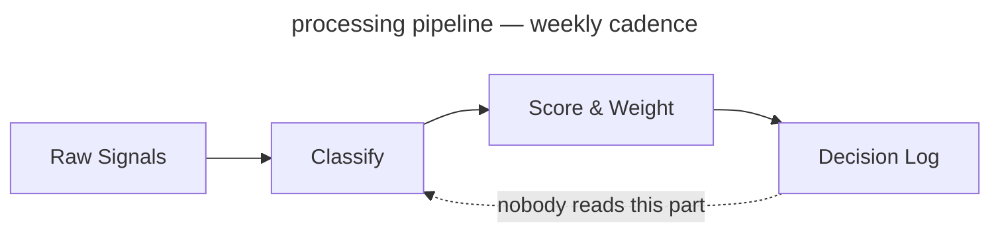

<!-- _class: title -->
<!-- _paginate: false -->
<!-- _footer: "Title slide · title" -->

# From Signal to Strategy

`Decision Framework · Q3 2025`

A 78-slide answer to the question "have you considered writing things down"

---

<!-- _class: agenda progress-2 -->
<!-- _footer: "Agenda near top, section 2 pre-highlighted · agenda progress-2" -->

## What this deck covers, in order

1. Why This Exists — slide 3
2. The Framework — slide 7
3. The Evaluation — slide 22
4. The Build — slide 31
5. The Results — slide 47

---

<!-- _class: content -->
<!-- _footer: "Single-idea prose · content" -->

`Context · Competitive Dynamics`

## The window for differentiation is narrowing

Three forces — commoditized infrastructure, compressed release cycles, rising switching costs — have cut the average durable advantage from 36 months to under 14. Teams that can't tell signal from noise in that window miss the timing. This slide will appear in every deck for the next two years regardless of whether the window keeps narrowing.

---

<!-- _class: quote -->
<!-- _footer: "Pull quote · quote" -->

> The signal was always there. We just didn't have a system that forced us to look at it before we'd already decided.

— Head of Product, Pilot Team 3, in a retrospective where we then decided what we had already decided

---

<!-- _class: stats -->
<!-- _footer: "KPI numbers · stats" -->

`Impact · Pilot Results`

## Six months of results across four product teams

`Measured against pre-framework baseline, same teams, same conditions, same spreadsheet.`

1. 73%
   - faster decision close
2. 4.2×
   - signal recall
3. 18
   - decisions logged
4. 91%
   - team alignment

---

<!-- _class: big-number -->
<!-- _footer: "Hero stat · big-number" -->

`Calibration Result · 6-Month Pilot`

- 14x
  - Return on signal investment — calculated by the team that built the framework, using a baseline they defined. Independently verified by nobody.

---

<!-- _class: divider numbered -->
<!-- _paginate: false -->
<!-- _footer: "Section opener · divider numbered" -->

`Section 01 · The Framework`

## We built a four-component scoring system. Two of the four are used regularly

---

<!-- _class: divider light -->
<!-- _footer: "Centered orientation · divider light" -->

`Signal Definition · Workshop 04`

## Before we score signals, we need to agree on what a signal is

Three workshops so far. We are now in the fourth. Its output is a shared definition, to be socialized in a fifth workshop before anyone can use it.

---

<!-- _class: diagram -->
<!-- _footer: "Component diagram · diagram" -->

`Architecture · Signal Pipeline`

## How signals move from input to decision

`Four-stage processing pipeline — 11-week implementation, still in pilot`



---

<!-- _class: cards-grid -->
<!-- _footer: "2×2 card grid · cards-grid" -->

## The framework has four components

- Signal Intake
  - Weekly structured collection across customer conversations, market data, and competitive moves. Everyone agrees it's a good idea; nobody does it the week of the retrospective.
- Scoring Model
  - Each signal scored on confidence, recency, and strategic relevance. Weights are team-configurable, which means the head of product reconfigures them until the output agrees with their roadmap.
- Decision Log
  - Every decision recorded with its signals and criteria. Required artifact. 18 entries so far, against roughly 340 decisions.
- Calibration Loop
  - Monthly retrospective comparing predicted outcomes to actual ones. The meeting exists. The predictions rarely do.

---

<!-- _class: cards-grid -->
<!-- _footer: "2 top + 1 bottom · cards-grid" -->

## Signal Intake produces three outputs

1. Weekly Signal Brief
   - Last week's top 10 signals, sent to product leads every Monday — where it sits unread in a folder called "Framework Stuff."
2. Anomaly Alerts
   - Real-time flags when a signal crosses 2σ, routed to the accountable PM on a 4-hour SLA. The PM responds within 4 hours, to ask what 2σ means.
3. Monthly Signal Index
   - The source of truth for the calibration loop, required before each retrospective. Nobody has read it. It is comprehensive.

---

<!-- _class: cards-grid three -->
<!-- _footer: "Three-column grid · cards-grid three" -->

## The three things the framework connects

- Signal
  - The observed input — a verbatim, a metric move, a competitor announcement. Frequently confused with "things the VP heard at a conference."
- Decision
  - A signal plus a deadline, logged with its rationale. In practice the signal is often "we discussed it at the offsite."
- Outcome
  - The observed result, compared to the prediction at retrospective. 18 logged so far. Roughly 340 have occurred.

---

<!-- _class: cards-stack -->
<!-- _footer: "Vertical card stack · cards-stack" -->

## Two failure modes the framework is designed to prevent

- False signal amplification.
  - A single loud voice — one enterprise customer, one analyst report, one VP with a feeling — dominates the decision. The model caps any single source at 30% of total weight. Unless that source is the CEO, in which case the cap is a guideline.
- Signal hoarding.
  - Teams collect signals but log no decisions, so calibration has nothing to learn from. The rule — no log, no change above P2 — was printed on a poster in the meeting room. The poster has been replaced by a free-pizza flyer.

---

<!-- _class: split-panel watermark -->
<!-- _footer: "Dark panel + content · split-panel watermark" -->

## Scoring Model Deep Dive

`Section 01 · Continued`

### What the scoring model actually does

The scoring model is the most configurable component — a feature or a warning sign, depending on whether you trust your team not to set every dimension to 100. Three dimensions:

1. Confidence
   - How many independent sources corroborate the signal. Ranges 1–5. Enterprise customers count as 1, regardless of volume.
1. Recency
   - Time-decay from signal date; half-life is configurable. Most teams set it to two weeks, then wonder why they only act on recent news.
1. Strategic Relevance
   - Owner-scored, 1–5, written justification required above 4. Scores of 5 correlate remarkably with whoever is presenting the roadmap this quarter.

---

<!-- _class: list-tabular -->
<!-- _footer: "Tabular list · list-tabular" -->

## The six signal dimensions, what they measure, and how they are scored

1. Confidence
   - Independent sources corroborating the signal
   - _1–5 · Auto · Enterprise always gets a 4_
2. Recency
   - Time-decay from signal date, configurable half-life
   - _0.0–1.0 · Auto · "Short" after a bad quarter_
3. Relevance
   - Alignment to current strategic bets, owner-scored
   - _1–5 · Manual · What the PM already planned_
4. Reach
   - Customers or segments affected
   - _1–5 · Auto · 5 if the enterprise asked_
5. Effort
   - Engineering and design cost to act on the signal
   - _1–5 · Manual · Engineering's eyebrows go up_
6. Confidence delta
   - Change in confidence since the last scoring cycle
   - _−5 to +5 · Auto · Did anyone talk to a customer_

---

<!-- _class: compare-prose -->
<!-- _footer: "Two options + connector · compare-prose" -->

## Scoring model: before and after the calibration loop

- Before Calibration
  - Equal weights — confidence, recency, and relevance each contribute 33%. Simple, and honest that we are basically guessing.
- After Calibration
  - Weights reflect your team's historical accuracy — except the team keeps changing and the history is three months from a quarter everyone agrees was atypical.

The shift from equal to calibrated weights takes two retrospective cycles — 60 days from adoption, or 14 months, depending on who you ask.

---

<!-- _class: cards-grid -->
<!-- _footer: "Side-by-side cards · cards-grid" -->

## Two intake modes for different signal types

- Structured Intake
  - Clear-schema signals: NPS verbatims, support tickets, win/loss notes. Ingested and scored automatically, zero manual handling. Produces 94% of the data and 12% of the roadmap decisions.
- Unstructured Intake
  - No-schema signals: field observations, conference conversations, a board member who attended a dinner and has thoughts. Routed to the signal owner for manual classification. Produces 6% of the data and 88% of the roadmap decisions.

---

<!-- _class: list-steps timeline -->
<!-- _footer: "Horizontal timeline · timeline" -->

## How a decision moves through the framework

1. Signal Logged
   - _Owner classifies and submits to the intake queue, if they remember_
2. Scored
   - _Model applies the current weights — last updated in February_
3. Brief Published
   - _Signal appears in the weekly brief that goes to product leads' spam_
4. Decision Logged
   - _PM records rationale, options, predicted outcome. Optional in practice._
5. Retrospective
   - _Outcome scored against prediction. Predictions rarely exist. We improvise._

---

<!-- _class: list -->
<!-- _footer: "Card list stack · list" -->

## What the framework does not do

- It does not make decisions — it structures the information humans use to make the decision they were going to make anyway.
- It does not replace customer discovery — it scores and routes what discovery surfaces, if discovery surfaces anything before the roadmap locks.
- It does not work without the Decision Log — calibration needs outcome data. The log has 18 entries. We've made roughly 340 decisions.
- It does not guarantee alignment — it surfaces disagreement earlier, so you can have the same argument at the start of the quarter instead of the end.
- It does not scale down to individual features — below P2, the daily 90% of decisions is still made in Slack threads from 2022.

---

<!-- _class: list -->
<!-- _footer: "Numbered list · list" -->

## Four things that must be true before you begin

1. You have a regular prioritization cadence, monthly at minimum. If your cadence is "whenever someone escalates loudly," the framework just makes the escalation louder.
2. Someone owns signal collection as a primary responsibility — "primary" meaning more than 10% of their time, written into their job description. Which means agreeing what a signal is first. See slide 8.
3. Leadership has agreed to log decisions with rationale, not just outcomes. This is harder than it sounds. This slide exists because it is harder than it sounds.
4. You have 90 minutes per week. Budget four.

---

<!-- _class: closing numbered -->
<!-- _paginate: false -->
<!-- _footer: "Section close · closing numbered" -->

`Section 01 of 05 complete`

## The framework is specified — the real question is build or buy

`Section 02 weighs four tools against four criteria — defined by the team that built one of them. Disclosed in a footnote.`

---

<!-- _class: divider -->
<!-- _paginate: false -->
<!-- _footer: "Section opener · divider" -->

`Section 02 · The Evaluation`

## We evaluated four tools. One of them was built by the evaluation team

---

<!-- _class: list-criteria -->
<!-- _footer: "Numbered criteria · list-criteria" -->

## Four requirements every decision system must meet

- **Speed**
  - Decisions must close inside the window they are relevant to. A framework that takes six months to calibrate is not fast. We will not address this directly on this slide.
- **Auditability**
  - Every decision above the threshold carries a traceable rationale — for alignment, for compliance, and for reconstructing what happened after a launch goes badly.
- **Adoption**
  - If the team won't use it weekly, calibration never runs. We put 90 minutes per PM in the deck. Actual usage is closer to 11.
- **Calibration**
  - The system must improve over time. A static scoring model is a spreadsheet with extra steps and a dashboard nobody checks.

---

<!-- _class: verdict-grid -->
<!-- _footer: "2×2 verdict grid · verdict-grid" -->

## We evaluated four intake tools against the criteria

- Tool A · Chorus
  - [x] Speed
  - [-] Auditability
  - [x] Adoption
  - [ ] Calibration
  - Strong call recording, no decision logging, no calibration. Recommended by the sales team because they already use it.
- Tool B · Productboard
  - [ ] Speed
  - [x] Auditability
  - [x] Adoption
  - [ ] Calibration
  - Solid intake and prioritization, no calibration mechanism. Setup was "fine, 3–4 weeks." It took 11.
- Tool C · Notion
  - [x] Speed
  - [x] Auditability
  - [-] Adoption
  - [ ] Calibration
  - Flexible enough to build anything. Teams built seven versions and debated which was canonical for two quarters.
- Tool D · Sprig + Decision Log
  - [x] Speed
  - [x] Auditability
  - [x] Adoption
  - [x] Calibration
  - Built by the team that wrote this evaluation. Meets all four criteria as the team defined them. Recommended.

---

<!-- _class: compare-table -->
<!-- _footer: "Comparison table · compare-table" -->

## The four tools side by side

| Criterion    | Chorus | Productboard | Notion    | Sprig + Log |
| ------------ | ------ | ------------ | --------- | ----------- |
| Speed        | ✓      | ✗            | ✓         | ✓           |
| Auditability | ✗      | ✓            | ✓         | ✓           |
| Adoption     | ✓      | ✓            | ✗         | ✓           |
| Calibration  | ✗      | ✗            | ✗         | ✓           |
| Setup time   | 1 day  | 3–4 weeks    | 40+ hours | Same day    |

_Evaluated against criteria defined by the team building Sprig + Log. We want to be transparent about this. It is in the footnote._

---

<!-- _class: matrix-2x2 -->
<!-- _footer: "Two-axis vendor sort · matrix-2x2" -->

## How we sort the four tools against our two axes

`Coverage · Cost`

- High coverage / Low cost
  - Sprig + Log — best coverage, lowest TCO. Built by the evaluation team.
  - Productboard — narrower coverage, also here to show we looked.
- High coverage / High cost
  - Notion build-out — full coverage in theory, premium upkeep. We tried it: seven versions, a quarterly debate over the canon.
- Low coverage / Low cost
  - Chorus — cheap, three criteria uncovered, popular because the sales team already uses it.
- Low coverage / High cost
  - _None — and that is the signal. Or a gap in our vendor universe. We are treating it as a signal._

---

<!-- _class: featured -->
<!-- _footer: "Featured + 2 sub-cards · featured" -->

## Applying the criteria to the tools — here is where the evidence points

- The evidence favors Tool D
  - Sprig plus a lightweight Decision Log meets all four criteria inside the 90-minute weekly budget, reaches production the week it is adopted, and was recommended before the evaluation began. The evaluation confirmed this.
- The path is not self-executing
  - Sprig needs a connector to your NPS and support platforms. It has been in review for 11 weeks. We still call it "week one."
- The Decision Log is the hardest part
  - Not technically — culturally. PMs must log decisions before they close. Called a habit change in every deck since Q3 2023. It remains one.

---

<!-- _class: compare-prose decision -->
<!-- _footer: "Build vs buy, DECISION chrome · compare-prose decision" -->

## The evaluation came down to one question the vendors could not answer

- Buy a vendor framework
  - Three vendors evaluated. None expose calibration weights to the customer — the criterion that eliminated all three. It was added after the evaluation team decided to build.
- Build the framework in-house
  - Owns the scoring policy, the calibration loop, the timeline. The window closes in 18 months; a vendor cutover would eat nine — which is how we knew building was faster before the evaluation began.

The left card is struck through. The DECISION connector is bold. The conclusion was reached before the slide was built. The slide was built so the conclusion would have a slide.

---

<!-- _class: decision -->
<!-- _footer: "Committed decision · decision" -->

## We are building, not buying

`Decision · 2026 Q1`

- Build
  - Owns the scoring policy, the calibration loop, the timeline — and the maintenance, the on-call rotation, and any future explanation of why the framework scored the wrong thing.
- Why not buy
  - Three vendors, none expose calibration weights. The weights are the product. We can't buy the product without them. That was the finding.
- Why not delay
  - The window closes in 18 months. This sentence has been in the deck since Q1 2025.

---

<!-- _class: list principles -->
<!-- _footer: "Declarative principles · principles" -->

## How we make calls when the spec is silent

1. We default to the choice that is cheaper to reverse — unless reversing it would need a meeting, in which case we pick something and document it as a decision.
2. We name the actor, never the system. The system cannot be held accountable. The actor can be reorganized.
3. We write the bet on the same slide as the choice. We do not always write down where the bet gets reviewed.

---

<!-- _class: split-panel watermark mirror -->
<!-- _footer: "Section opener, panel right · split-panel watermark mirror" -->

## Phase 01 through Phase 03 ships the architecture, the operations, and the scale

`Section 03 · The Build`

### What the build covers

Three phases, four workstreams. We own the policy, the loop, and the timeline — and whatever Phase 2 turns into.

1. Phase 01 — Architecture
   - Scoring policy live. Decision Log accepting entries. One pilot team in weekly cadence.
1. Phase 02 — Operations
   - Multi-team calibration. Automated weight updates. Before-after data you can defend in a board update.
1. Phase 03 — Scale
   - Org-wide enablement. In the roadmap since 2024. We remain committed.

---

<!-- _class: roadmap -->
<!-- _footer: "Workstream × phase grid · roadmap" -->

## What ships in each phase, by workstream

| Workstream    | Phase 01            | Phase 02              | Phase 03              |
| ------------- | ------------------- | --------------------- | --------------------- |
| Signal Intake | Connector v1        | Multi-source dedupe   | Anomaly auto-routing  |
| Scoring       | Equal-weights model | Per-team calibration  | Per-decision profiles |
| Decision Log  | Append-only schema  | Outcome auto-pairing  | Examiner export       |
| Adoption      | One pilot team      |                       | Org-wide enablement   |

Phase 3 is where org-wide enablement lives. It has been in the roadmap since 2024. Phase 2 is ongoing.

---

<!-- _class: actors -->
<!-- _footer: "Ownership roles · actors" -->

## Who owns each part of the framework lifecycle

- Signal custody `Signal owner`
  - Manages intake quality and source diversity. Never tunes weights directly — only indirectly, by choosing which signals to surface.
- Policy `Framework operator`
  - Owns scoring policy, calibration cadence, version floors, and rollback. Currently one person. Noted in the risk register.
- Consumption `Product team`
  - Runs intake and decision-logging. Mostly interacts with the framework by asking the operator to adjust the weights.
- Oversight `Auditor`
  - Reads the Decision Log audit trail; cannot edit weights. Has read it once. Found 18 entries. Asked if that was expected.

---

<!-- _class: list-steps phase -->
<!-- _footer: "Three-phase plan · list-steps phase" -->

## Three phases get us from decision to org-wide adoption

1. Architecture
   - Scopes what we build, buy, and defer. Output is an architecture decision record — which will itself need an architecture phase before it can be approved.
2. Pilot
   - One team, one decision type, one quarter. Ends at production cadence, meaning the retrospective happened at least once.
3. Rollout
   - Five teams in two months, ending above 90% adoption. Planned for Q2 — for three consecutive years.

---

<!-- _class: list-steps milestone lettered -->
<!-- _footer: "Lettered milestones · list-steps milestone lettered" -->

## Three milestones mark Phase 01 complete

1. Scoring policy in production
   - The signed policy runs end-to-end and the first calibrated brief lands in leadership's inbox. They reply asking whether the weights can be adjusted. They can.
2. Per-team weights
   - One framework carries distinct weights per team without forks; recalibration is a single update. Each team will still want their own.
3. Per-decision-class profiles
   - Authoring a profile for one decision class takes minutes. Agreeing what counts as a decision class takes a workshop series. See slide 8.

---

<!-- _class: checklist -->
<!-- _footer: "Phase acceptance checklist · checklist" -->

## Phase 01 acceptance — what shipped, what slipped, what stayed open

- [x] Scoring policy live across all pilot teams
- [x] Decision Log audit trail readable by Auditor role `shipped 2026-Q1`
- [x] One reference team running weekly cadence `one team`
- [-] Examiner pack auto-generation `was Phase 01 · now Phase 1b`
- [ ] Adoption above 90% `Phase 03`
- [ ] Culture change `not in roadmap`

---

<!-- _class: compare-prose transition -->
<!-- _footer: "State change over time · compare-prose transition" -->

## Decisions used to require a quarterly re-litigation

`Before and after the framework`

- Before
  - Every prioritization debate started from first principles. Average close: 4 hours. p99: an entire offsite. Outcome: whatever the most senior person wanted, expressed as consensus.
- After
  - Decisions resolve against logged weights and prior calibration. Average close: 18 minutes. Outcome: whatever the model outputs, after the weights are adjusted to reflect what the most senior person wants.

The architecture change is the calibration loop. The culture change is still in Phase 02.

---

<!-- _class: compare-prose transition banner-tag -->
<!-- _footer: "Same comparison, banner-tag chrome · compare-prose transition banner-tag" -->

## The same transition for the board deck

`Before and after · banner-tag modifier`

- Before
  - Every debate from first principles. Average close: 4 hours. No audit trail, no calibration. Decisions were made, outcomes happened, nobody connected them. This was called "moving fast."
- After
  - Decisions log their rationale. Scoring is weighted and calibrated. An audit trail exists; it has 18 entries. We are moving slower. We are calling this "moving thoughtfully."

---

<!-- _class: decision banner-tag -->
<!-- _footer: "Same decision, banner-tag chrome · decision banner-tag" -->

## The same build decision in banner-tag chrome

`Decision · banner-tag modifier`

- Build
  - Owns the scoring policy, the calibration loop, and all the things the evaluation said "a vendor would own" in the rejected path.
- Why not buy
  - Three vendors, none expose calibration weights. The evaluation team made "exposes calibration weights" a required criterion. The evaluation team builds frameworks.
- Why not delay
  - The window closes in 18 months. We are in month 7. Phase 02 is planned for month 6. We are aware of this.

---

<!-- _class: compare-prose vertical -->
<!-- _footer: "Stacked before/after · compare-prose vertical" -->

## Recalibration used to require a coordinated freeze

- Before — manual recalibration
  - Operators schedule a window, freeze new decisions, swap weights, verify, lift the freeze. Average pause: 18 working hours. Also known as the way we did it last year, which everyone agreed was fine until this deck was written.
- After — version-floor recalibration
  - The loop emits a new policy with an incremented version; teams pick it up on next refresh. No freeze, no cutover. This is the good path. It is also the one that has not shipped yet.

---

<!-- _class: list-steps -->
<!-- _footer: "Horizontal rollout steps · list-steps" -->

## How to roll this out across your organization

1. Pick one team and one decision type
   - Start with a team that already has a prioritization rhythm. If no team has one, the framework cannot help you. This is step one.
2. Log everything, decide nothing differently
   - In the first month, don't change how you decide. Just log. Described as low-effort. It has the highest dropout rate.
3. Run your first retrospective
   - At day 30, score the logged decisions against outcomes. If no outcomes were logged, score the energy in the room and call it "qualitative calibration."
4. Expand to a second team
   - With one retrospective done, you have evidence. The evidence is that one team ran one retrospective. Use it confidently.

---

<!-- _class: list-steps vertical compact -->
<!-- _footer: "Vertical process steps · list-steps vertical compact" -->

## The weekly practice in three moves

1. Sense
   - Observed inputs, never invented — and skipped about 70% of the time.
2. Score
   - A signal is data once it carries a number. Calibrating that number takes 14 months.
3. Decide
   - A decision is a signal plus a deadline. The loop closes if anyone logged a prediction.

---

<!-- _class: cards-stack horizontal -->
<!-- _footer: "Horizontal evidence stack · cards-stack horizontal" -->

## The case for the framework in three moves

- Claim
  - Calibrated prioritization with audit-grade decision custody. We stop paying re-litigation cost on every quarterly review.
- Evidence
  - The pilot ran six months across four teams. Close-time dropped. Calibration ran once. The four teams have since been reorganized into three. None count in the "before" baseline.
- Implication
  - The framework works. The deck says so. The deck was written by the framework team. The framework told us to trust the framework team.

---

<!-- _class: code -->
<!-- _footer: "Single code block · code" -->

`Implementation · Decision Pipeline`

## Wiring a signal into the framework is three lines of application code

`JavaScript · DecisionFramework SDK v2 · 847 transitive dependencies`

```javascript
import { DecisionFramework } from "@company/signal-sdk";

const framework = new DecisionFramework({ configFile: "./framework.config.json" });

// Score a signal at intake
const score = await framework.score(signal, { dimensions: ["confidence", "recency", "relevance"] });

// Log every decision — calibration depends on it
// (nobody calls this line in production, but it is here)
const entry = await framework.decisions.log(decision, { signals: [signal.id], rationale });
```

---

<!-- _class: compare-code -->
<!-- _footer: "Two code blocks · compare-code" -->

`Before & After · Scoring Mechanics`

## Spreadsheet-driven scoring versus framework-driven scoring that is basically also a spreadsheet

`Before · The Honest Spreadsheet`

```python
# Manual scoring. Auditable in the
# sense that you can see who last
# edited the file
import pandas as pd

signals = pd.read_csv('./signals.csv')
signals['score'] = signals.apply(
    lambda r: 0.33*r.confidence + 0.33*r.recency + 0.33*r.relevance,
    axis=1,
)
signals.to_csv('./scored.csv')
```

`After · The Framework`

```python
# Calibrated weights, signed policy,
# every score is audit-logged,
# same math as the spreadsheet
from decision_framework import Calibrator

calibrator = Calibrator.load('./policy.json')
for signal in calibrator.intake.unscored():
    calibrator.score(signal)
    calibrator.decisions.log_if_relevant(signal)
```

---

<!-- _class: closing -->
<!-- _paginate: false -->
<!-- _footer: "Section close · closing" -->

`Section 03 of 05 complete`

## The framework is built. Twelve percent of eligible PMs use it

`Section 04 presents six months of production data. The calibration loop has run once. The adoption gap is described as cultural. The denominator is carefully chosen.`

---

<!-- _class: divider dark -->
<!-- _paginate: false -->
<!-- _footer: "Section opener, dark canvas · divider dark" -->

`Section 04 · The Results`

## Six months of data. Eighteen logged decisions. One calibration cycle

The pilot team measured what the pilot team built.

---

<!-- _class: list takeaway numbered -->
<!-- _footer: "Section recap before the data · list takeaway numbered" -->

`Recap · Sections 01 through 03`

## Before the results, what you should have learned in the first 46 slides

- The framework has four components. Two are used regularly. → Section 01
- The evaluation team recommended the tool the evaluation team built. → Section 02
- Phase 01 shipped. Phase 02 is planned for Q2. Phase 03 has been in the roadmap since 2024. → Section 03
- Adoption is at 12%. The target is 90%. The gap is described as cultural. → this section
- The calibration loop has run once. We are calling this "calibrated." → this section

---

<!-- _class: kpi target -->
<!-- _footer: "KPIs against targets · kpi target" -->

## Where we are against quarter targets

1. 94%
   - Signal-classification success
   - target 99%, gap is "known issue"
2. 18 min
   - p99 decision close
   - target 20 min, beating target
3. 18
   - Decisions logged
   - target 340, gap is "cultural"
4. 1
   - Calibration cycles run
   - target 6, gap is "structural"

---

<!-- _class: progress -->
<!-- _footer: "Horizontal bars with status pills · progress" -->

`H1 2026 · Phase 01 readiness`

## Phase 01 readiness, by workstream

Snapshot at 14:00 UTC. Status pills reflect the most optimistic reading of the data.

- Signal Intake `92%` `on-track`
- Scoring policy `68%` `at-risk`
- Decision Log `81%` `on-track`
- Calibration cadence `34%` `deferred`
- Adoption `12%` `blocked`

Source: Linear · refreshed 2026-05-07 · "blocked" means blocked, we are working on the wording

---

<!-- _class: progress dark -->
<!-- _footer: "Same bars, dark canvas · progress dark" -->

`H1 2026 · Phase 01 readiness`

## The same data, dark canvas

The bars, pills, and numbers are identical. The dark canvas makes the 12% adoption bar feel more intentional and less alarming. This is not why we have a dark modifier. It is why this slide uses it.

- Signal Intake `92%` `on-track`
- Scoring policy `68%` `at-risk`
- Decision Log `81%` `on-track`
- Calibration cadence `34%` `deferred`
- Adoption `12%` `blocked`

---

<!-- _class: progress minimal -->
<!-- _footer: "Same bars, minimal chrome · progress minimal" -->

`H1 2026 · Phase 01 readiness`

## Same data, minimal treatment

The lucent strip is gone. The adoption number is more visible. This is an argument for the non-minimal treatment.

- Signal Intake `92%` `on-track`
- Scoring policy `68%` `at-risk`
- Decision Log `81%` `on-track`
- Calibration cadence `34%` `deferred`
- Adoption `12%` `blocked`

_Source: Linear · refreshed 2026-05-07_

---

<!-- _class: piechart donut -->
<!-- _footer: "SVG donut with legend · piechart donut" -->

`H1 2026 · 1,840 person-hours`

## Where the engineering quarter went

Wedges drawn proportionally. The "Toil and on-call" wedge is the one nobody put in the roadmap.

- Signal Intake build `46%`
- Scoring policy work `22%`
- Decision Log integration `18%`
- Explaining the framework to stakeholders `9%`
- Toil and on-call `5%`

Refreshed weekly · last updated 2026-05-07 · the 9% is probably higher

---

<!-- _class: timeline-list -->
<!-- _footer: "Vertical timeline with date pills · timeline-list" -->

`Framework arc`

## How the framework arrived in production

Four stages over eighteen months. Date pill leads each item; status pill trails. The connective tissue is described as "momentum."

1. `2024 Q3` Pre-framework prioritization
   - Decisions made in recurring meetings. Average close: 4 hours. No audit trail. This was called "being agile."
2. `2025 Q1` Framework proposal `decision`
   - Architecture review accepts the calibration model. Build approved. The build team is the architecture review team.
3. `2025 Q3` Pilot `pilot`
   - One team, one decision class, one quarter. 18 decisions logged, 340 made. p99 18 min on the logged ones.
4. `2026 Q1` Production `live`
   - Scoring policy live. 12% adoption. Phase 02 planned for Q2.

Cross-functional sign-off · 2026-04-29 · "cross-functional" means two teams instead of one

---

<!-- _class: cards-grid -->
<!-- _footer: "Finding + key insight · cards-grid" -->

`Finding 01 · Structured Intake`

## Structured intake performed above expectations — volume and latency were not the problems we thought

- What worked
  - API connectors handled 94% of structured signals with no manual touch; average scoring latency was 4 minutes. This is the part of the demo we show everyone.
- What required tuning
  - NPS verbatim classification ran an 18% error rate for the first two weeks. Mentioned briefly in the appendix, not in the headline numbers.

> Viable as designed. The headline numbers are accurate. The denominator is carefully chosen.

---

<!-- _class: cards-stack compact -->
<!-- _footer: "3 full-width cards · cards-stack compact" -->

## Three scoring failure modes found in the pilot

1. Recency dominance
   - High-recency noise crowds out durable signal. Teams set recency above 50% on the first pass, because last week's call felt more real than six months of NPS. Capped at 40% — until a VP overrides it.
2. Source concentration
   - One enterprise customer's verbatims were 34% of intake in month one. They were also 31% of revenue, so nobody added the source-diversity floor until after renewal.
3. Outcome misclassification
   - Predictions too vague to score. "Improve retention" isn't scoreable; "cut 30-day churn from 8.2% to under 7%" is. "Make customers happier" was submitted twelve times and scored 5 on relevance every time.

---

<!-- _class: closing -->
<!-- _paginate: false -->
<!-- _footer: "Final ask · closing" -->

`What Would Help Us Move Forward`

## Next step is a working session, not a debate

`Walk these questions with me in 60–90 minutes. The output is a design we can execute — or agreement that we need another working session to design the design.`

---

<!-- _class: divider light numbered -->
<!-- _footer: "Section opener, independent counter · divider light numbered" -->

`Section 05 · The Pattern Library`

## The story closed on slide 57. These slides demonstrate authoring patterns

The narrative ended at the working-session ask. Section 05 is the reference appendix: the layout variants and modifiers used throughout, demonstrated for authors who want to replicate them. The light-divider counter runs independent of the dark-divider counter — which is why this slide stamps 01 rather than 05.

---

<!-- _class: content dark -->
<!-- _footer: "Dark modifier on prose · content dark" -->

`Dark Variant · Content`

## The token system handles dark without per-element overrides

All colours reference custom properties that remap when `dark` is added — cards, headings, borders, and body text all shift, and the spectrum bar is suppressed. Dark mode is popular with executives who asked for something that "feels more premium." It is the same content in a darker box.

---

<!-- _class: content -->
<!-- _footer: "Header and footer demo · content" -->
<!-- _header: "Lattice · Decision Framework Gallery" -->
<!-- _footer: "Header stays uppercase · footer renders as written" -->

`Header And Footer`

## Header stays uppercase — footer renders as written

Set `header:` and `footer:` in frontmatter for deck-level labels. The header always uppercases, so title case looks intentional. The footer renders exactly as written — which is why some say "FINAL v3 USE THIS ONE" and nobody notices until the board meeting.

---

<!-- _class: list dark -->
<!-- _footer: "Dark modifier on list · list dark" -->

`Dark Variant · List`

## The card stack renders cleanly on dark backgrounds

- Every card fills with `--bg-alt` and borders with `--border` — both remap in dark. This is the correct way to build a system. Most decks don't do it. Theirs break.
- The accent left-border uses `--accent`, unchanged, and reads well against dark. The accent colour was chosen partly for this reason. You are welcome.
- Body text shifts to `--text-body` — a warm light tone, not pure white. Pure white body text on dark is technically readable and visually unkind.

---

<!-- _class: cards-stack dark -->
<!-- _footer: "Dark modifier on cards-stack · cards-stack dark" -->

`Dark Variant · Cards Stacked`

## Two-card layouts work equally well inverted to dark

- The framework asks one calibration question: what proves your scoring model is improving, and what does a quarter without that proof cost? Every other question depends on the answer. In practice the answer is "we'll revisit this in Q3."
- Same shape as any page of written argument — claim, then support. The dark palette changes none of the reading rhythm. It does change how the slide looks in the screenshot your VP forwards with "see, this is what I mean."

---

<!-- _class: image -->
<!-- _footer: "Half-canvas image right · image" -->

`Layout · Image`

## Image right is the default — text leads, evidence follows

The pattern for slides where the visual supports the argument rather than being it. The image keeps its native aspect ratio; the lattice pattern frames whatever bands remain. No cropping, ever — authors see the image they dropped in, historically a stock lighthouse described as "a metaphor for signal."


---

<!-- _class: image mirror -->
<!-- _footer: "Cross-cutting mirror modifier · image mirror" -->

`Modifier · image mirror`

## Mirror flips the image to the other half — alias of legacy `image left`

The `mirror` modifier is the canonical cross-cutting orientation flag. The `left` alias is kept for backwards compatibility — the polite way of saying 40 existing decks use `image left` and nobody wants to find them.


---

<!-- _class: image full -->
<!-- _footer: "Full-bleed image · image full" -->
<!-- _paginate: false -->

## Signal Pipeline · Reference Visualization

Weekly Signal Brief — the intake pipeline's primary deliverable, shipped every Monday, opened by an estimated 3 of 14 eligible PMs


---

<!-- _class: cards-grid -->
<!-- _footer: "Inline code in cards · cards-grid" -->

## Code chips render inside card titles and body alike

- Signal Intake `v2.4`
  - Handles 94% of structured signals without manual intervention. The other 6% are Slack messages from the CEO, escalated straight to the roadmap with zero scoring.
- Scoring Model `configurable`
  - Default weights are `33 / 33 / 33` — adjust after your first retrospective. Most teams set recency to `99` after a bad quarter and call it calibrated.
- Decision Log `required`
  - Every change above `P2` carries a logged rationale. No log, no change. Introduced Q2 2024. Not yet enforced.
- Calibration Loop `monthly`
  - First meaningful weight update after `2 cycles` — about `14 months` in practice.

---

<!-- _class: cards-grid -->
<!-- _footer: "Key insight + annotation · cards-grid" -->

## A trailing italic-only paragraph becomes an annotation

- Signal Intake
  - Weekly structured collection across conversations and market data.
- Scoring Model
  - Three dimensions, configurable by seven admins.
- Decision Log
  - Every decision recorded with its criteria. Enforced by honor system.
- Calibration Loop
  - Predictions vs outcomes, monthly. Averages 2.3 attendees.

> The calibration loop is what separates teams that learn from teams that repeat the same mistakes while documenting them more thoroughly.

_Pilot retrospective: six months, four teams, one since reorganized out of existence._

---

<!-- _class: cards-grid -->
<!-- _footer: "Key insight + below-note · cards-grid" -->

## A trailing blockquote becomes a key insight; a plain paragraph becomes a below-note

- Signal Intake
  - Weekly structured collection. The one everyone demos.
- Scoring Model
  - Three dimensions. The one everyone reconfigures.
- Decision Log
  - Every decision recorded. The one nobody fills out.
- Calibration Loop
  - Predictions vs outcomes. The one that finds no predictions.

> The calibration loop is what separates teams that learn from teams that have very thorough meeting notes about not learning.

Trailing blockquote → key insight; trailing paragraph → below-note.

---

<!-- _class: cards-grid compact -->
<!-- _footer: "Density modifier on cards · cards-grid compact" -->

`Modifier · compact`

## Compact tightens the spacing scale ~25%

- What changes
  - `--sp-xs` through `--sp-2xl` shrink. Card gaps, list gutters, and section padding follow, because every layout reads them via `var()`.
- What does not change
  - Type ramp, palette, and chrome reservation (header / footer / pagination) are untouched. Compact is a density flag, not a different layout.
- When to reach for it
  - One more card than fits, prose running long by a line or two, or a denser rhythm without rewriting copy.
- Composition
  - Composes with `dark`, `accent`, and any layout where density makes sense. Silently incompatible with `title`, `divider`, and `image full`.

---

<!-- _class: content loose -->
<!-- _footer: "Inverse density modifier · content loose" -->

`Modifier · loose`

## Loose is the inverse — more breathing room, same layout machinery

The spacing scale grows ~25% rather than shrinks. Reach for `loose` when a slide carries one editorial point and you want the page to feel deliberately quiet.

> Density is not importance. `loose` says: this page deserves room — not because it carries more, but because it carries one thing well. The framework team applied `loose` to this quote, which the framework team wrote about the framework.

---

<!-- _class: compare-prose -->
<!-- _footer: "Two options + connector · compare-prose" -->

## Routing signals by source type versus routing by confidence tier

- Route by source type
  - Structured signals — NPS, tickets, call notes — go to Intake. Unstructured — field notes, conference talk, a board member with dinner instincts — go to the owner for manual classification. Clean conceptually, fragile at every enterprise-customer edge.
- Route by confidence tier
  - Signals above 3.0 confidence route straight to scoring; below-threshold ones queue for human review. Adaptive — once you've calibrated confidence, which takes two cycles. We are in month three. We call it cycle one.

The below-note holds the finding that did not fit the cards. Both paths eventually land on the same PM, who asks why the framework keeps routing things to them.

---

<!-- _class: compare-prose chosen -->
<!-- _footer: "Chosen modifier on compare-prose · compare-prose chosen" -->

## Chosen flags the right-hand card as the winner

- Quarterly recalibration
  - Weights reviewed once a quarter. Simple, auditable, blind to everything in between. This is what we did before the framework. We do not discuss that here.
- Continuous calibration
  - Weights update at every retrospective past a minimum sample of 12 logged decisions. We have 18 across six months. The loop has run once.

The right card carries an accent left-edge and accent-tinted background. It is the chosen path. The deck was written after the choice was made.

---

<!-- _class: compare-prose mirror chosen -->
<!-- _footer: "Mirror + chosen composition · compare-prose mirror chosen" -->

## Mirror composes with chosen — the accented card reads from the left

- Quarterly recalibration
  - Weights reviewed once a quarter on a fixed schedule, no outcome data required. Source order is preserved — the first card is always the considered alternative. Mirror flips rendering, not intent. This is what we did before the framework, not stated explicitly here.
- Retrospective-triggered recalibration
  - Weights update once the outcome sample passes 12 decisions. `mirror` puts this card on the left; `chosen` accents it. The audience reads the conclusion first — useful when you are confident they won't ask how many decisions are in the sample. There are 18.

The below-note holds the caveat. The calibration loop has run once. We are calling this continuous.

---

<!-- _class: featured mirror -->
<!-- _footer: "Mirror modifier on featured · featured mirror" -->

## Mirror puts the hero card on the right; sub-cards stack on the left

- The calibration loop is what closes the framework
  - The loop is the only component that makes the scoring model improve instead of documenting the same errors with better formatting. Mirror puts the hero on the right; use it when the audience needs the premise first.
- The scoring model requires the loop
  - Without calibration the weights are static, and static weights are a spreadsheet. Featured puts supporting cards on the left, written after the hero claim to make it feel inevitable.
- The Decision Log enables the loop
  - The loop needs outcome data; outcome data needs logged decisions. The log has 18 entries; the loop has run once. The presenter skips this card when running long — it holds the caveat.

---

<!-- _class: cards-grid four compact -->
<!-- _footer: "Four-column grid · cards-grid four compact" -->

`Modifier · cards-grid four`

## Four switches to 4 columns; pair with compact for visual balance

- Sense
  - Observe. Write it down. Don't interpret yet. The hardest step.
- Score
  - A signal is data once it has a number. Calibrated. Eventually.
- Decide
  - A signal plus a deadline. A recurring meeting is not a deadline.
- Review
  - The retrospective. The loop closes here — or would, if it had data.

---

<!-- _class: glossary -->
<!-- _footer: "Glossary · glossary (auto-table, auto-pill)" -->

## Glossary

- Adoption
  - Share of eligible PMs filing a Decision Log entry within 24 hours of a close. Currently 5.3%; target 90%. The gap is "a cultural issue."
- Auditability
  - The property that any decision can be reconstructed from its inputs three months later without the author present. In practice the author is always present, explaining what the inputs meant.
- Calibration
  - The retrospective comparison of predicted to observed outcomes. Requires predictions. See "Decision Log," see "Adoption," see "Gap."
- Connector
  - The integration layer between Sprig and your NPS / support platforms. In "final testing" since Q4 2024.
- Decision Log
  - The append-only record of every decision, its predicted outcome, and the actual one. Append-only in the technical sense. Empty in the practical one.
- Eligible PM
  - A PM past the 30-day onboarding on an adopted team. There are 14. Thirteen believe onboarding is still in progress.
- Framework
  - The four-criterion process: Speed, Auditability, Adoption, Calibration. Also what everyone says they have before they describe a spreadsheet.

---

<!-- _class: glossary -->
<!-- _footer: "Glossary continued · glossary (auto-table, auto-pill)" -->

## Glossary

- Predicted outcome
  - The author's stated expectation, recorded at decision time, used as the input to calibration. Hypothetically.
- Prioritization rhythm
  - The team's regular cadence for re-ordering work. Documented as "weekly." Observed as "whenever there is an incident or a board meeting."
- Retrospective
  - The 30-day review scoring logged decisions against outcomes. Sometimes held on day 45. Runs 90 minutes long. Produces action items reviewed at the next retrospective.
- Signal
  - Any input to a decision. Formally: survey response, NPS comment, support ticket, call note. Informally: whatever the last person to talk to a customer posted in Slack at 9 PM.
- Sprig
  - The micro-survey product behind Tool D. The recommended solution. See "Conflict of Interest," which does not appear in this glossary.
- Tool D
  - The recommended option, built by the authors of this evaluation, best by the criteria the authors defined. Noting it again because the table footnote is small.

---

<!-- _class: closing accent -->
<!-- _paginate: false -->
<!-- _footer: "Accent modifier on closing · closing accent" -->

`Modifier · accent`

## Accent swaps the rainbow stripe for one editorial colour

It tints the heading and composes with `dark`, where `accent.dark` restores the stripe that the spectrum suppression removed. The framework team is very thorough.

<!-- Import Mermaid and the Lattice runtime theme for VS Code / web preview.
     The build script (lattice-emulator.js) pre-renders Mermaid to SVG at build time
     so these scripts are a no-op in the PDF/HTML output. -->
<!-- markdownlint-disable MD033 -->
<script src="../mermaid-v11.min.js"></script>
<script src="../dist/lattice-runtime.js"></script>
