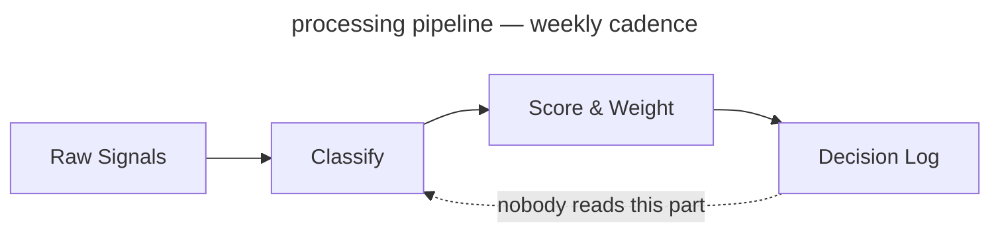

<!-- _class: title -->
<!-- _paginate: false -->
<!-- _footer: "Title slide · title" -->

# From Signal to Strategy

`Decision Framework · Q3 2025`

A 78-slide answer to the question "have you considered writing things down"

---

<!-- _class: agenda progress-2 -->
<!-- _footer: "Agenda near top, section 2 pre-highlighted · agenda progress-2" -->

## What this deck covers, in order

1. Why This Exists — slide 3
2. The Framework — slide 7
3. The Evaluation — slide 22
4. The Build — slide 31
5. The Results — slide 47

---

<!-- _class: content -->
<!-- _footer: "Single-idea prose · content" -->

`Context · Competitive Dynamics`

## The window for differentiation is narrowing

Commoditized infrastructure, compressed release cycles, and rising switching costs have cut the average durable advantage from 36 months to under 14. This slide will appear in every deck for the next two years regardless of whether that stays true.

---

<!-- _class: quote -->
<!-- _footer: "Pull quote · quote" -->

> The signal was always there. We just didn't have a system that forced us to look at it before we'd already decided.

— Head of Product, Pilot Team 3, in a retrospective where we then decided what we'd already decided

---

<!-- _class: stats -->
<!-- _footer: "KPI numbers · stats" -->

`Impact · Pilot Results`

## Six months of results across four product teams

`Same teams, same conditions, same spreadsheet.`

1. 73%
   - faster decision close
2. 4.2×
   - signal recall
3. 18
   - decisions logged
4. 91%
   - team alignment

---

<!-- _class: big-number -->
<!-- _footer: "Hero stat · big-number" -->

`Calibration Result · 6-Month Pilot`

- 14x
  - Return on signal investment — on a baseline the framework team defined. Verified by nobody.

---

<!-- _class: divider numbered -->
<!-- _paginate: false -->
<!-- _footer: "Section opener · divider numbered" -->

`Section 01 · The Framework`

## We built a four-component scoring system. Two of the four are used regularly

---

<!-- _class: divider light -->
<!-- _footer: "Centered orientation · divider light" -->

`Signal Definition · Workshop 04`

## Before we score signals, we need to agree on what a signal is

Three workshops in. The definition gets socialized in a fifth before anyone can use it.

---

<!-- _class: diagram -->
<!-- _footer: "Component diagram · diagram" -->

`Architecture · Signal Pipeline`

## How signals move from input to decision

`Four-stage pipeline — 11 weeks in, still in pilot`



---

<!-- _class: cards-grid -->
<!-- _footer: "2×2 card grid · cards-grid" -->

## The framework has four components

- Signal Intake
  - Weekly structured collection across customer conversations, market data, and competitive moves. Everyone agrees it's a good idea. Nobody does it the week of the retrospective.
- Scoring Model
  - Confidence, recency, and strategic relevance, each weighted. The weights are team-configurable — which means the head of product reconfigures them until the output agrees with the roadmap.
- Decision Log
  - Every decision recorded with its signals and criteria. A required artifact. It holds 18 entries, against roughly 340 decisions actually made.
- Calibration Loop
  - A monthly retrospective comparing predicted outcomes to real ones. The meeting reliably exists. The predictions, reliably, do not.

---

<!-- _class: cards-grid -->
<!-- _footer: "2 top + 1 bottom · cards-grid" -->

## Signal Intake produces three outputs

1. Weekly Signal Brief
   - Last week's top 10 signals, ranked, with confidence scores and sources. Sent to product leads every Monday — where it sits unread in a folder called "Framework Stuff."
2. Anomaly Alerts
   - Real-time flags when a signal crosses the 2σ threshold, routed to the accountable PM on a 4-hour SLA. The PM usually replies inside the 4 hours — to ask what 2σ means.
3. Monthly Signal Index
   - The source of truth for the calibration loop, and required reading before every retrospective. Nobody has read it. It is comprehensive.

---

<!-- _class: cards-grid three -->
<!-- _footer: "Three-column grid · cards-grid three" -->

## The three things the framework connects

- Signal
  - The observed input — a verbatim, a metric move, a competitor's announcement. The unit of intake. Frequently confused with "things the VP heard at a conference."
- Decision
  - A signal plus a deadline, logged with its rationale. Every decision is meant to trace to a signal. In practice the signal is "we discussed it at the offsite."
- Outcome
  - The result, measured against the prediction at retrospective. The unit of calibration. 18 have been logged. Roughly 340 have occurred.

---

<!-- _class: cards-stack -->
<!-- _footer: "Vertical card stack · cards-stack" -->

## Two failure modes the framework is designed to prevent

- False signal amplification.
  - A single loud voice — one enterprise customer, one analyst report, one VP with a feeling — dominates the decision without ever being weighed against the full signal set. The model caps any one source at 30% of total weight. Unless that source is the CEO, in which case the cap is a guideline.
- Signal hoarding.
  - Teams collect signals but never log decisions, so the calibration loop has nothing to learn from. The rule — no log, no change above P2 — was printed on a poster and hung in the meeting room. The poster has since been replaced by a free-pizza flyer.

---

<!-- _class: split-panel watermark -->
<!-- _footer: "Dark panel + content · split-panel watermark" -->

## Scoring Model Deep Dive

`Section 01 · Continued`

### What the scoring model actually does

The most configurable component — a feature or a warning sign, depending on your team. Three dimensions:

1. Confidence
   - Independent corroborating sources, 1–5. Enterprise customers count as 1, regardless of volume.
1. Recency
   - Time-decay, configurable half-life. Set to two weeks, then surprised only recent news scores.
1. Strategic Relevance
   - Owner-scored, 1–5. A 5 correlates with whoever is presenting the roadmap this quarter.

---

<!-- _class: list-tabular -->
<!-- _footer: "Tabular list · list-tabular" -->

## The six signal dimensions, what they measure, and how they are scored

1. Confidence
   - Independent sources corroborating the signal
   - _1–5 · Auto · Enterprise always gets a 4_
2. Recency
   - Time-decay from signal date, configurable half-life
   - _0.0–1.0 · Auto · "Short" after a bad quarter_
3. Relevance
   - Alignment to current strategic bets, owner-scored
   - _1–5 · Manual · What the PM already planned_
4. Reach
   - Customers or segments affected
   - _1–5 · Auto · 5 if the enterprise asked_
5. Effort
   - Engineering and design cost to act on the signal
   - _1–5 · Manual · Engineering's eyebrows go up_
6. Confidence delta
   - Change in confidence since the last scoring cycle
   - _−5 to +5 · Auto · Did anyone talk to a customer_

---

<!-- _class: compare-prose -->
<!-- _footer: "Two options + connector · compare-prose" -->

## Scoring model: before and after the calibration loop

- Before Calibration
  - Equal weights — confidence, recency, and relevance each contribute 33%. Simple, and at least honest that we are basically guessing.
- After Calibration
  - Weights reflect your team's historical accuracy — except the team keeps changing, and the history is three months of data from a quarter everyone agrees was atypical.

The shift from equal to calibrated weights takes two retrospective cycles — 60 days from adoption, or 14 months, depending on who you ask.

---

<!-- _class: cards-grid -->
<!-- _footer: "Side-by-side cards · cards-grid" -->

## Two intake modes for different signal types

- Structured Intake
  - Clear-schema signals — NPS verbatims, support tickets, win/loss notes. Ingested and scored automatically, with zero manual handling. Produces 94% of the data and 12% of the roadmap decisions.
- Unstructured Intake
  - No-schema signals — field notes, conference hallway talk, a board member who had thoughts at a dinner. Routed to the owner for manual classification. Produces 6% of the data and 88% of the roadmap decisions.

---

<!-- _class: list-steps timeline -->
<!-- _footer: "Horizontal timeline · timeline" -->

## How a decision moves through the framework

1. Signal Logged
   - _Owner submits to the queue, if they remember_
2. Scored
   - _Current weights — last updated in February_
3. Brief Published
   - _Lands in the weekly brief, lands in spam_
4. Decision Logged
   - _Rationale + predicted outcome. Optional in practice._
5. Retrospective
   - _Scored against a prediction that rarely exists. We improvise._

---

<!-- _class: list -->
<!-- _footer: "Card list stack · list" -->

## What the framework does not do

- Doesn't make decisions — it formalizes the one you'd have made anyway.
- Doesn't replace discovery — it routes whatever surfaces before the roadmap locks.
- Doesn't work without the Decision Log. 18 entries; ~340 decisions made.
- Doesn't guarantee alignment — the same argument, just earlier in the quarter.
- Doesn't scale below P2 — the daily 90% still lives in Slack threads from 2022.

---

<!-- _class: list -->
<!-- _footer: "Numbered list · list" -->

## Four things that must be true before you begin

1. A monthly prioritization cadence. "Whenever someone escalates loudly" doesn't count — it just gets louder.
2. Someone who owns signal collection. Which means defining a signal first. See slide 8.
3. Leadership logging rationale, not just outcomes. This slide exists because that part is hard.
4. 90 minutes a week. Budget four.

---

<!-- _class: closing numbered -->
<!-- _paginate: false -->
<!-- _footer: "Section close · closing numbered" -->

`Section 01 of 05 complete`

## The framework is specified — the real question is build or buy

`Section 02 weighs four tools against four criteria — defined by the team that built one. Disclosed in a footnote.`

---

<!-- _class: divider -->
<!-- _paginate: false -->
<!-- _footer: "Section opener · divider" -->

`Section 02 · The Evaluation`

## We evaluated four tools. One of them was built by the evaluation team

---

<!-- _class: list-criteria -->
<!-- _footer: "Numbered criteria · list-criteria" -->

## Four requirements every decision system must meet

- **Speed**
  - Decisions close inside their window. Six months to calibrate isn't fast. We won't dwell on that here.
- **Auditability**
  - Every decision above the threshold carries a traceable rationale — for after the launch goes badly.
- **Adoption**
  - Weekly use, or calibration never runs. We budgeted 90 minutes per PM. Actual: 11.
- **Calibration**
  - It has to improve. A static model is a spreadsheet with a dashboard nobody checks.

---

<!-- _class: verdict-grid -->
<!-- _footer: "2×2 verdict grid · verdict-grid" -->

## We evaluated four intake tools against the criteria

- Tool A · Chorus
  - [x] Speed
  - [-] Auditability
  - [x] Adoption
  - [ ] Calibration
  - Great call recording, no logging, no calibration. The sales team already uses it.
- Tool B · Productboard
  - [ ] Speed
  - [x] Auditability
  - [x] Adoption
  - [ ] Calibration
  - Solid intake, no calibration. Setup was "3–4 weeks." It took 11.
- Tool C · Notion
  - [x] Speed
  - [x] Auditability
  - [-] Adoption
  - [ ] Calibration
  - Build anything. Teams built seven, then debated the canon for two quarters.
- Tool D · Sprig + Decision Log
  - [x] Speed
  - [x] Auditability
  - [x] Adoption
  - [x] Calibration
  - Built by this evaluation's authors. Meets all four — as they defined them.

---

<!-- _class: compare-table -->
<!-- _footer: "Comparison table · compare-table" -->

## The four tools side by side

| Criterion    | Chorus | Productboard | Notion    | Sprig + Log |
| ------------ | ------ | ------------ | --------- | ----------- |
| Speed        | ✓      | ✗            | ✓         | ✓           |
| Auditability | ✗      | ✓            | ✓         | ✓           |
| Adoption     | ✓      | ✓            | ✗         | ✓           |
| Calibration  | ✗      | ✗            | ✗         | ✓           |
| Setup time   | 1 day  | 3–4 weeks    | 40+ hours | Same day    |

_Criteria defined by the team building Sprig + Log. We're transparent about it. It's in the footnote._

---

<!-- _class: matrix-2x2 -->
<!-- _footer: "Two-axis vendor sort · matrix-2x2" -->

## How we sort the four tools against our two axes

`Coverage · Cost`

- High coverage / Low cost
  - Sprig + Log — best coverage, lowest TCO. Built by the evaluation team.
  - Productboard — narrower, here to show we looked.
- High coverage / High cost
  - Notion — full coverage in theory. We tried it: seven versions, a quarterly canon debate.
- Low coverage / Low cost
  - Chorus — cheap, three criteria short. The sales team likes it.
- Low coverage / High cost
  - _None — either the signal or a gap. We're treating it as a signal._

---

<!-- _class: featured -->
<!-- _footer: "Featured + 2 sub-cards · featured" -->

## Applying the criteria to the tools — here is where the evidence points

- The evidence favors Tool D
  - Sprig plus a lightweight Decision Log meets all four criteria inside the 90-minute weekly budget, reaches production the week it's adopted, and was recommended before the evaluation began. The evaluation confirmed this.
- The path is not self-executing
  - Sprig needs a connector to your NPS and support platforms — budget 4–6 hours in week one. The connector has been in review for 11 weeks. We still call it "week one."
- The Decision Log is the hardest part
  - Not technically — culturally. PMs have to log decisions before they close, not after. It's been described as a habit change in every deck since Q3 2023. It remains one.

---

<!-- _class: compare-prose decision -->
<!-- _footer: "Build vs buy, DECISION chrome · compare-prose decision" -->

## The evaluation came down to one question the vendors could not answer

- Buy a vendor framework
  - Three vendors evaluated. None expose calibration weights to the customer — the criterion that eliminated all three. It was added to the rubric after the team decided to build.
- Build the framework in-house
  - Owns the scoring policy, the calibration loop, and the timeline. The window closes in 18 months; a vendor cutover would eat nine of them — which is how we knew building was faster before the evaluation began.

The left card is struck through; the DECISION connector is bold. The conclusion came first — the slide was built to hold it.

---

<!-- _class: decision -->
<!-- _footer: "Committed decision · decision" -->

## We are building, not buying

`Decision · 2026 Q1`

- Build
  - Owns the scoring policy, the calibration loop, and the timeline — plus the maintenance, the on-call rotation, and every future explanation of why the framework scored the wrong thing.
- Why not buy
  - Three vendors, none exposing calibration weights. The weights are the product; you cannot buy the product without them. That was the finding.
- Why not delay
  - The window closes in 18 months — a sentence that has been in this deck, unchanged, since Q1 2025.

---

<!-- _class: list principles -->
<!-- _footer: "Declarative principles · principles" -->

## How we make calls when the spec is silent

1. Default to the choice that's cheaper to reverse — unless reversing it needs a meeting.
2. Name the actor, never the system. The system can't be held accountable. The actor can be reorganized.
3. Write the bet on the slide with the choice. Not always where it gets reviewed.

---

<!-- _class: split-panel watermark mirror -->
<!-- _footer: "Section opener, panel right · split-panel watermark mirror" -->

## Three phases ship the architecture, the operations, and the scale — and Phase 01 has shipped

`Section 03 · The Build`

### What the build covers

Three phases, four workstreams. We own the policy, the loop, the timeline — and whatever Phase 2 becomes.

1. Phase 01 — Architecture
   - Scoring policy live, the Decision Log accepting entries, one pilot team in weekly cadence.
1. Phase 02 — Operations
   - Multi-team calibration, automated weight updates, and before-after data you could defend in a board update.
1. Phase 03 — Scale
   - Org-wide enablement. In the roadmap since 2024. We remain committed.

---

<!-- _class: roadmap -->
<!-- _footer: "Workstream × phase grid · roadmap" -->

## What ships in each phase, by workstream

| Workstream    | Phase 01            | Phase 02              | Phase 03              |
| ------------- | ------------------- | --------------------- | --------------------- |
| Signal Intake | Connector v1        | Multi-source dedupe   | Anomaly auto-routing  |
| Scoring       | Equal-weights model | Per-team calibration  | Per-decision profiles |
| Decision Log  | Append-only schema  | Outcome auto-pairing  | Examiner export       |
| Adoption      | One pilot team      |                       | Org-wide enablement   |

Phase 3 holds org-wide enablement. In the roadmap since 2024. Phase 2 is ongoing.

---

<!-- _class: actors -->
<!-- _footer: "Ownership roles · actors" -->

## Who owns each part of the framework lifecycle

- Signal custody `Signal owner`
  - Manages intake quality. Tunes weights only by choosing what to surface.
- Policy `Framework operator`
  - Owns scoring, cadence, rollback. One person. Noted in the risk register.
- Consumption `Product team`
  - Runs intake and logging. Mostly asks the operator to change the weights.
- Oversight `Auditor`
  - Reads the audit trail. Read it once, found 18 entries, asked if that was expected.

---

<!-- _class: list-steps phase -->
<!-- _footer: "Three-phase plan · list-steps phase" -->

## Three phases get us from decision to org-wide adoption

1. Architecture
   - Scopes what we build, what we buy, and what we defer. The output is an architecture decision record — which will itself need an architecture phase before it can be approved.
2. Pilot
   - One team, one decision type, one quarter. The phase ends at production cadence — meaning the retrospective happened at least once.
3. Rollout
   - Five teams in two months, ending above 90% adoption. Planned for Q2 — as it has been for three consecutive years.

---

<!-- _class: list-steps milestone lettered -->
<!-- _footer: "Lettered milestones · list-steps milestone lettered" -->

## Three milestones mark Phase 01 complete

1. Scoring policy in production
   - The signed policy runs end-to-end and the first calibrated brief lands in leadership's inbox. Their first reply asks whether the weights can be adjusted. They can.
2. Per-team weights
   - One framework carries distinct weights per team without forks; recalibration is a single update. Each team will still want its own.
3. Per-decision-class profiles
   - Authoring a profile for one decision class takes minutes. Agreeing what counts as a decision class takes a workshop series. See slide 8.

---

<!-- _class: checklist -->
<!-- _footer: "Phase acceptance checklist · checklist" -->

## Phase 01 acceptance — what shipped, what slipped, what stayed open

- [x] Scoring policy live across all pilot teams
- [x] Decision Log audit trail readable by Auditor role `shipped 2026-Q1`
- [x] One reference team running weekly cadence `one team`
- [-] Examiner pack auto-generation `was Phase 01 · now Phase 1b`
- [ ] Adoption above 90% `Phase 03`
- [ ] Culture change `not in roadmap`

---

<!-- _class: compare-prose transition -->
<!-- _footer: "State change over time · compare-prose transition" -->

## Decisions used to require a quarterly re-litigation

`Before and after the framework`

- Before
  - First principles every time. Close: 4 hours, p99 an offsite. Outcome: what the senior person wanted, called consensus.
- After
  - Resolved against logged weights. Close: 18 minutes. Outcome: what the model says — once the weights match the senior person.

The architecture change is the calibration loop. The culture change is still in Phase 02.

---

<!-- _class: compare-prose transition banner-tag -->
<!-- _footer: "Same comparison, banner-tag chrome · compare-prose transition banner-tag" -->

## The same transition for the board deck

`Before and after · banner-tag modifier`

- Before
  - Every prioritization debate from first principles. Average close: 4 hours, p99 an entire offsite. No audit trail, no calibration — decisions were made, outcomes happened, nobody connected them. We called it "moving fast."
- After
  - Decisions log their rationale; scoring is weighted and calibrated; an audit trail exists. It has 18 entries. We are moving slower now. We are calling this "moving thoughtfully."

---

<!-- _class: decision banner-tag -->
<!-- _footer: "Same decision, banner-tag chrome · decision banner-tag" -->

## The same build decision in banner-tag chrome

`Decision · banner-tag modifier`

- Build
  - Owns the scoring policy, the calibration loop, and every responsibility the evaluation said "a vendor would own" in the path we rejected.
- Why not buy
  - Three vendors, none exposing calibration weights — the criterion set by the evaluation team. The evaluation team builds frameworks.
- Why not delay
  - The window closes in 18 months. We are in month 7. Phase 02 is planned for month 6. We are aware of this.

---

<!-- _class: compare-prose vertical -->
<!-- _footer: "Stacked before/after · compare-prose vertical" -->

## Recalibration used to require a coordinated freeze

- Before — manual recalibration
  - Operators schedule a window, freeze new decisions, swap the weights, verify, then lift the freeze. Average review pause: 18 working hours. Also known as the way we did it last year, which everyone agreed was fine until this deck was written.
- After — version-floor recalibration
  - The loop emits a new policy with an incremented version; teams pick it up on next refresh. No freeze, no coordinated cutover. This is the good path. It is also the one that has not shipped yet.

---

<!-- _class: list-steps -->
<!-- _footer: "Horizontal rollout steps · list-steps" -->

## How to roll this out across your organization

1. Pick one team and one decision type
   - Start with a team that has a real rhythm. No rhythm, no framework.
2. Log everything, decide nothing differently
   - Just log, for a month. "Low-effort." Highest dropout rate.
3. Run your first retrospective
   - Day 30, score against outcomes. No outcomes? Score the room, call it "qualitative."
4. Expand to a second team
   - Your evidence: one team ran one retrospective. Use it confidently.

---

<!-- _class: list-steps vertical compact -->
<!-- _footer: "Vertical process steps · list-steps vertical compact" -->

## The weekly practice in three moves

1. Sense
   - Observed inputs, never invented. Skipped about 70% of the time.
2. Score
   - A signal is data once it carries a number. Calibrating it takes 14 months.
3. Decide
   - A signal plus a deadline. The loop closes if anyone logged a prediction.

---

<!-- _class: cards-stack horizontal -->
<!-- _footer: "Horizontal evidence stack · cards-stack horizontal" -->

## The case for the framework in three moves

- Claim
  - Calibrated prioritization with audit-grade decision custody. We stop paying the re-litigation cost on every quarterly review.
- Evidence
  - Six months across four product teams. Close-time dropped; calibration ran once. The four teams have since been reorganized into three. None of them count in the "before" baseline.
- Implication
  - The framework works. The deck says so. The deck was written by the framework team. We trust the framework team — the framework told us to.

---

<!-- _class: code -->
<!-- _footer: "Single code block · code" -->

`Implementation · Decision Pipeline`

## Wiring a signal into the framework is three lines of application code

`JavaScript · DecisionFramework SDK v2 · 847 transitive dependencies`

```javascript
import { DecisionFramework } from "@company/signal-sdk";

const framework = new DecisionFramework({ configFile: "./framework.config.json" });

// Score a signal at intake
const score = await framework.score(signal, { dimensions: ["confidence", "recency", "relevance"] });

// Log every decision — calibration depends on it
// (nobody calls this line in production, but it is here)
const entry = await framework.decisions.log(decision, { signals: [signal.id], rationale });
```

---

<!-- _class: compare-code -->
<!-- _footer: "Two code blocks · compare-code" -->

`Before & After · Scoring Mechanics`

## Spreadsheet-driven scoring versus framework-driven scoring that is basically also a spreadsheet

`Before · The Honest Spreadsheet`

```python
# Manual scoring. Auditable in the
# sense that you can see who last
# edited the file
import pandas as pd

signals = pd.read_csv('./signals.csv')
signals['score'] = signals.apply(
    lambda r: 0.33*r.confidence + 0.33*r.recency + 0.33*r.relevance,
    axis=1,
)
signals.to_csv('./scored.csv')
```

`After · The Framework`

```python
# Calibrated weights, signed policy,
# every score is audit-logged,
# same math as the spreadsheet
from decision_framework import Calibrator

calibrator = Calibrator.load('./policy.json')
for signal in calibrator.intake.unscored():
    calibrator.score(signal)
    calibrator.decisions.log_if_relevant(signal)
```

---

<!-- _class: closing -->
<!-- _paginate: false -->
<!-- _footer: "Section close · closing" -->

`Section 03 of 05 complete`

## The framework is built. Twelve percent of eligible PMs use it

`Section 04 presents six months of production data. The denominator is carefully chosen.`

---

<!-- _class: divider dark -->
<!-- _paginate: false -->
<!-- _footer: "Section opener, dark canvas · divider dark" -->

`Section 04 · The Results`

## Six months of data. Eighteen logged decisions. One calibration cycle

The pilot team measured what the pilot team built.

---

<!-- _class: list takeaway numbered -->
<!-- _footer: "Section recap before the data · list takeaway numbered" -->

`Recap · Sections 01 through 03`

## Before the results, what you should have learned in the first 46 slides

- Four components. Two used regularly. → Section 01
- The evaluation team recommended the tool the evaluation team built. → Section 02
- Phase 01 shipped. Phase 03 in the roadmap since 2024. → Section 03
- Adoption is 12%. Target 90%. The gap is "cultural." → this section
- The calibration loop has run once. We call it "calibrated." → this section

---

<!-- _class: kpi target -->
<!-- _footer: "KPIs against targets · kpi target" -->

## Where we are against quarter targets

1. 94%
   - Signal-classification success
   - target 99%, gap is "known issue"
2. 18 min
   - p99 decision close
   - target 20 min, beating target
3. 18
   - Decisions logged
   - target 340, gap is "cultural"
4. 1
   - Calibration cycles run
   - target 6, gap is "structural"

---

<!-- _class: progress -->
<!-- _footer: "Horizontal bars with status pills · progress" -->

`H1 2026 · Phase 01 readiness`

## Phase 01 readiness, by workstream

The status pills reflect the most optimistic reading of the data.

- Signal Intake `92%` `on-track`
- Scoring policy `68%` `at-risk`
- Decision Log `81%` `on-track`
- Calibration cadence `34%` `deferred`
- Adoption `12%` `blocked`

Source: Linear · "blocked" means blocked, we are working on the wording

---

<!-- _class: progress dark -->
<!-- _footer: "Same bars, dark canvas · progress dark" -->

`H1 2026 · Phase 01 readiness`

## The same data, dark canvas

Same bars, same numbers. Dark makes the 12% adoption bar feel intentional, not alarming. That is not why we have a dark modifier. It is why this slide uses it.

- Signal Intake `92%` `on-track`
- Scoring policy `68%` `at-risk`
- Decision Log `81%` `on-track`
- Calibration cadence `34%` `deferred`
- Adoption `12%` `blocked`

---

<!-- _class: progress minimal -->
<!-- _footer: "Same bars, minimal chrome · progress minimal" -->

`H1 2026 · Phase 01 readiness`

## Same data, minimal treatment

The lucent strip is gone, so the adoption number is louder. An argument for the non-minimal treatment.

- Signal Intake `92%` `on-track`
- Scoring policy `68%` `at-risk`
- Decision Log `81%` `on-track`
- Calibration cadence `34%` `deferred`
- Adoption `12%` `blocked`

_Source: Linear · refreshed 2026-05-07_

---

<!-- _class: piechart donut -->
<!-- _footer: "SVG donut with legend · piechart donut" -->

`H1 2026 · 1,840 person-hours`

## Where the engineering quarter went

The "Toil and on-call" wedge is the one nobody put in the roadmap.

- Signal Intake build `46%`
- Scoring policy work `22%`
- Decision Log integration `18%`
- Explaining the framework to stakeholders `9%`
- Toil and on-call `5%`

Last updated 2026-05-07 · the 9% is probably higher

---

<!-- _class: timeline-list -->
<!-- _footer: "Vertical timeline with date pills · timeline-list" -->

`Framework arc`

## How the framework arrived in production

Four stages over eighteen months. The connective tissue is described as "momentum."

1. `2024 Q3` Pre-framework prioritization
   - Decisions in recurring meetings. Close: 4 hours. No trail. We called it "being agile."
2. `2025 Q1` Framework proposal `decision`
   - Architecture review approves the build. The build team is the architecture review team.
3. `2025 Q3` Pilot `pilot`
   - One team, one quarter. 18 logged, 340 made. p99 18 min on the logged ones.
4. `2026 Q1` Production `live`
   - Policy live. 12% adoption. Phase 02 planned for Q2.

Cross-functional sign-off · "cross-functional" means two teams instead of one

---

<!-- _class: cards-grid -->
<!-- _footer: "Finding + key insight · cards-grid" -->

`Finding 01 · Structured Intake`

## Structured intake performed above expectations — volume and latency were not the problems we thought

- What worked
  - API connectors handled 94% of structured signals with no manual touch, at 4-minute average latency. This is the part of the demo we show everyone.
- What required tuning
  - NPS verbatim classification ran an 18% error rate for the first two weeks. It's mentioned in the appendix, not in the headline numbers.

> Viable as designed. The headline numbers are accurate. The denominator is carefully chosen.

---

<!-- _class: cards-stack compact -->
<!-- _footer: "3 full-width cards · cards-stack compact" -->

## Three scoring failure modes found in the pilot

1. Recency dominance
   - Recency set above 50% — last week felt more real than six months of NPS. Capped at 40%, until a VP overrides it.
2. Source concentration
   - One customer was 34% of intake. Also 31% of revenue, so the diversity floor waited for renewal.
3. Outcome misclassification
   - "Improve retention" won't score. "Make customers happier" was submitted twelve times, scored 5 each.

---

<!-- _class: closing -->
<!-- _paginate: false -->
<!-- _footer: "Final ask · closing" -->

`What Would Help Us Move Forward`

## Next step is a working session, not a debate

`Walk these questions with me in 60–90 minutes. The output is a design we can execute — or agreement that we need another session to design it.`

---

<!-- _class: divider light numbered -->
<!-- _footer: "Section opener, independent counter · divider light numbered" -->

`Section 05 · The Pattern Library`

## The story closed on slide 57. These slides demonstrate authoring patterns

The reference appendix: the layout variants and modifiers used above. Its counter runs independent of the dark divider's — so it stamps 01, not 05.

---

<!-- _class: content dark -->
<!-- _footer: "Dark modifier on prose · content dark" -->

`Dark Variant · Content`

## The token system handles dark without per-element overrides

Every colour is a custom property that remaps on `dark` — cards, text, borders, the suppressed spectrum bar. Popular with executives who want "more premium." Same content, darker box.

---

<!-- _class: content -->
<!-- _footer: "Header and footer demo · content" -->
<!-- _header: "Lattice · Decision Framework Gallery" -->
<!-- _footer: "Header stays uppercase · footer renders as written" -->

`Header And Footer`

## Header stays uppercase — footer renders as written

Set `header:` and `footer:` in frontmatter. The header always uppercases; the footer renders as written — which is how "FINAL v3 USE THIS ONE" reaches the board.

---

<!-- _class: list dark -->
<!-- _footer: "Dark modifier on list · list dark" -->

`Dark Variant · List`

## The card stack renders cleanly on dark backgrounds

- Every card fills from `--bg-alt`, and its border remaps too — both shift automatically on dark. Most decks don't build this way. Theirs break.
- The accent edge keeps `--accent` unchanged, because it already reads on dark. That's partly why the accent was chosen. You're welcome.
- Body text becomes a warm light tone via `--text-body` — never pure white. Pure white on dark is technically readable and visually unkind.

---

<!-- _class: cards-stack dark -->
<!-- _footer: "Dark modifier on cards-stack · cards-stack dark" -->

`Dark Variant · Cards Stacked`

## Two-card layouts work equally well inverted to dark

- The framework asks one calibration question: what proves your scoring model is improving, and what does a quarter without that proof cost? Every other question in this deck depends on the answer. In practice the answer is "we'll revisit it in Q3" — which is also the quarter the workshop to define "improving" is scheduled for.
- It's the same shape as any page of written argument — claim, then support. The dark palette changes none of the reading rhythm or the information density. What it changes is how the slide looks in the screenshot your VP forwards to their VP with "see, this is what I mean." The content is identical to the light version. The forward is the feature.

---

<!-- _class: image -->
<!-- _footer: "Half-canvas image right · image" -->

`Layout · Image`

## Image right is the default — text leads, evidence follows

For slides where the visual supports the argument. Native aspect ratio, no cropping — usually a stock lighthouse called "a metaphor for signal."


---

<!-- _class: image mirror -->
<!-- _footer: "Cross-cutting mirror modifier · image mirror" -->

`Modifier · image mirror`

## Mirror flips the image to the other half — alias of legacy `image left`

`mirror` is the canonical orientation flag. The `left` alias survives for the 40 decks nobody wants to find.


---

<!-- _class: image full -->
<!-- _footer: "Full-bleed image · image full" -->
<!-- _paginate: false -->

## Signal Pipeline · Reference Visualization

Weekly Signal Brief — shipped every Monday, opened by an estimated 3 of 14 eligible PMs


---

<!-- _class: cards-grid -->
<!-- _footer: "Inline code in cards · cards-grid" -->

## Code chips render inside card titles and body alike

- Signal Intake `v2.4`
  - 94% of structured signals. The other 6% are CEO Slack messages, escalated unscored.
- Scoring Model `configurable`
  - Defaults `33 / 33 / 33`. Most set recency to `99` after a bad quarter, call it calibrated.
- Decision Log `required`
  - Every change above `P2` needs a rationale. Introduced Q2 2024. Not yet enforced.
- Calibration Loop `monthly`
  - First real update after `2 cycles` — about `14 months`.

---

<!-- _class: cards-grid -->
<!-- _footer: "Key insight + annotation · cards-grid" -->

## A trailing italic-only paragraph becomes an annotation

- Signal Intake
  - Weekly collection across conversations and market data.
- Scoring Model
  - Three dimensions, configurable by seven admins.
- Decision Log
  - Every decision recorded. Enforced by honor system.
- Calibration Loop
  - Predictions vs outcomes. Averages 2.3 attendees.

> The calibration loop separates teams that learn from teams that repeat the same mistakes more thoroughly.

_Pilot retrospective: six months, four teams, one since reorganized out of existence._

---

<!-- _class: cards-grid -->
<!-- _footer: "Key insight + below-note · cards-grid" -->

## A trailing blockquote becomes a key insight; a plain paragraph becomes a below-note

- Signal Intake
  - The one everyone demos.
- Scoring Model
  - The one everyone reconfigures.
- Decision Log
  - The one nobody fills out.
- Calibration Loop
  - The one that finds no predictions.

> The calibration loop separates teams that learn from teams with very thorough meeting notes about not learning.

Trailing blockquote → key insight; trailing paragraph → below-note.

---

<!-- _class: cards-grid compact -->
<!-- _footer: "Density modifier on cards · cards-grid compact" -->

`Modifier · compact`

## Compact tightens the spacing scale ~25%

- What changes
  - `--sp-xs` through `--sp-2xl` shrink. Card gaps, gutters, and padding follow, via `var()`.
- What does not change
  - Type, palette, and chrome reservation are untouched. A density flag, not a new layout.
- When to reach for it
  - One card too many, prose a line long, or a denser rhythm.
- Composition
  - Composes with `dark`, `accent`. Not with `title`, `divider`, `image full`.

---

<!-- _class: content loose -->
<!-- _footer: "Inverse density modifier · content loose" -->

`Modifier · loose`

## Loose is the inverse — more breathing room, same layout machinery

The spacing scale grows ~25%. Reach for `loose` when a slide carries one editorial point and wants to feel quiet.

> Density is not importance. `loose` says this page deserves room — because it carries one thing well. The framework team applied it to this quote, which the framework team wrote about the framework.

---

<!-- _class: compare-prose -->
<!-- _footer: "Two options + connector · compare-prose" -->

## Routing signals by source type versus routing by confidence tier

- Route by source type
  - Structured signals — NPS, tickets, call notes — go to Intake. Unstructured ones — field notes, conference talk, a board member with dinner instincts — route to the owner for manual classification. Clean in theory, fragile at every edge involving an enterprise customer.
- Route by confidence tier
  - Signals above 3.0 confidence route straight to scoring; everything below queues for human review. Adaptive — once you've calibrated confidence, which takes two completed cycles. We're in month three, calling it cycle one.

Both paths land on the same PM, who asks why the framework keeps routing things to them.

---

<!-- _class: compare-prose chosen -->
<!-- _footer: "Chosen modifier on compare-prose · compare-prose chosen" -->

## Chosen flags the right-hand card as the winner

- Quarterly recalibration
  - Weights reviewed once a quarter. Simple, auditable, and blind to everything that happened in between. This is what we did before the framework. We do not discuss that here.
- Continuous calibration
  - Weights update at every retrospective once the sample passes 12 logged decisions. We have 18, across six months. The loop has run once.

The right card carries the accent edge and tint — the chosen path. Chosen after the choice was made.

---

<!-- _class: compare-prose mirror chosen -->
<!-- _footer: "Mirror + chosen composition · compare-prose mirror chosen" -->

## Mirror composes with chosen — the accented card reads from the left

- Quarterly recalibration
  - Reviewed once a quarter on a fixed schedule, no outcome data required to trigger it. Source order is preserved — the first card is always the considered alternative. Mirror flips the rendering, not the intent.
- Retrospective-triggered recalibration
  - Weights update once the outcome sample passes 12 decisions. `mirror` puts this card on the left; `chosen` accents it. The audience reads the conclusion first — useful when you're confident they won't ask how many decisions are in the sample. There are 18.

The below-note holds the caveat. The loop ran once. We call it continuous.

---

<!-- _class: featured mirror -->
<!-- _footer: "Mirror modifier on featured · featured mirror" -->

## Mirror puts the hero card on the right; sub-cards stack on the left

- The calibration loop is what closes the framework
  - The only component that makes the model improve instead of documenting failures better. `mirror` puts it right — premise before conclusion.
- The scoring model requires the loop
  - No calibration, static weights — a spreadsheet. Sub-cards go left, written to make the hero inevitable.
- The Decision Log enables the loop
  - Loop needs outcomes; outcomes need logged decisions. 18 entries, one run. The card the presenter skips.

---

<!-- _class: cards-grid four compact -->
<!-- _footer: "Four-column grid · cards-grid four compact" -->

`Modifier · cards-grid four`

## Four switches to 4 columns; pair with compact for visual balance

- Sense
  - Observe. Write it down. Don't interpret yet.
- Score
  - A signal is data once it has a number. Calibrated. Eventually.
- Decide
  - A signal plus a deadline. A recurring meeting is not a deadline.
- Review
  - The retrospective. The loop closes here — if it had data.

---

<!-- _class: glossary -->
<!-- _footer: "Glossary · glossary (auto-table, auto-pill)" -->

## Glossary

- Adoption
  - PMs logging within 24h of a close. 5.3% now; target 90%. The gap is "cultural."
- Auditability
  - Reconstruct any decision months later without its author. The author is always there anyway.
- Calibration
  - Predicted vs observed. Requires predictions. See "Decision Log," "Adoption," "Gap."
- Connector
  - Sprig ↔ your NPS / support platforms. In "final testing" since Q4 2024.
- Decision Log
  - The append-only record of every decision. Append-only in theory, empty in practice.
- Eligible PM
  - Past 30-day onboarding on an adopted team. 14 exist; 13 think they're still onboarding.
- Framework
  - Speed, Auditability, Adoption, Calibration. Also what people call a spreadsheet.

---

<!-- _class: glossary -->
<!-- _footer: "Glossary continued · glossary (auto-table, auto-pill)" -->

## Glossary

- Predicted outcome
  - The expectation logged at decision time, fed to calibration. Hypothetically.
- Prioritization rhythm
  - Documented "weekly." Observed "whenever there's an incident or a board meeting."
- Retrospective
  - Day-30 scoring of decisions vs outcomes. Often day 45. Always runs long.
- Signal
  - A survey, an NPS comment, a ticket. Or a 9 PM Slack from whoever last saw a customer.
- Sprig
  - The micro-survey behind Tool D. See "Conflict of Interest" — not in this glossary.
- Tool D
  - The recommended option, built by this evaluation's authors, best by their criteria.

---

<!-- _class: closing accent -->
<!-- _paginate: false -->
<!-- _footer: "Accent modifier on closing · closing accent" -->

`Modifier · accent`

## Accent swaps the rainbow stripe for one editorial colour

It tints the heading and composes with `dark`, where `accent.dark` restores the suppressed stripe. The framework team is very thorough.

<!-- Import Mermaid and the Lattice runtime theme for VS Code / web preview.
     The build script (lattice-emulator.js) pre-renders Mermaid to SVG at build time
     so these scripts are a no-op in the PDF/HTML output. -->
<!-- markdownlint-disable MD033 -->
<script src="../mermaid-v11.min.js"></script>
<script src="../dist/lattice-runtime.js"></script>
