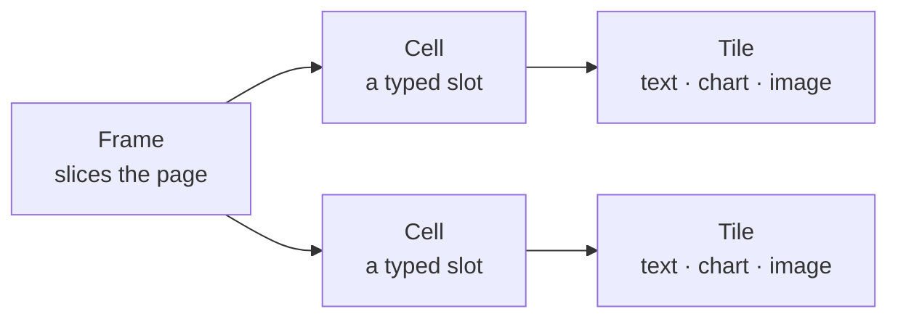

<!-- _class: title -->
<!-- _header: '' -->
<!-- _paginate: false -->

# Lattice

`The story of why I built it`

I got tired of slide software that works against the person using it. So I built one that doesn't.

---

<!-- _class: content -->

`Where this starts`

## PowerPoint was a breakthrough nobody has questioned since.

Every tool since has copied its shape. A blank canvas. A master slide the whole deck inherits — until your first override sends the rest drifting. You still can't see what changed from one version to the next.

---

<!-- _class: content -->

`The idea`

## So I made the deck a plain text file.

You write the words in Markdown, the plainest text there is. The engine holds the structure and the finish. Change a line and that is all that moves — poor taste runs out of places to hide.

---

<!-- _class: cards-grid four -->

`The name is the plan`

## Four words, borrowed from people who work with their hands.

- Function
  - What is this slide for? You decide that.
- Form
  - How is it built? From a fixed set of layouts, never a blank page.
- Substance
  - What goes inside? The engine fills the slots.
- Finish
  - How should it feel? One line changes the whole look.

— A tailor talks about form. A shoemaker talks about finish. I borrowed their words on purpose.

---

<!-- _class: content -->

`One rule the whole thing rests on`

## No layout ever names a colour.

Every colour comes from a token. Pick a palette and the colours change; the spacing, the type, and the structure do not move an inch. Reskinning an entire deck is one line.

---

<!-- _class: diagram -->

`For the engineers in the room`

## Every slide is three pieces.

`A cell holds a tile, never another frame — I cut infinite nesting; it earns nothing on a slide.`

---

<!-- _class: cards-grid -->

`Taste, enforced`

## The engine says no, so the deck stays clean.

- Forty words a slide
  - Go past it and the engine tells you to split. The font never shrinks to make room.
- Six bullets, then stop
  - A slide is not a document. The limit keeps it readable from the back row.
- One idea per slide
  - When two thoughts are fighting, they each get their own page.

---

<!-- _class: list-steps timeline -->

`How it got built`

## It started as a stylesheet and grew a spine.

1. A handful of layouts
   - _April 2026. A small palette and a few cards, built on top of Marp._
2. A real catalog
   - _Spring. Native charts, a typography system, a proper component library._
3. My own engine
   - _June. I rebuilt the foundation as an engine of my own._
4. Learning to bend
   - _Now. The same deck reflows from boardroom screen to phone._

---

<!-- _class: content dark -->
<!-- _header: '' -->

`Credit where it's due`

## Lattice stands on the shoulders of Marp.

Yuki Hattori's Marp taught me the method: a slide is just Markdown, the rest is CSS. I fought it and layered over it for years — and I'm grateful for every round. The best foundation there is.

---

<!-- _class: progress -->

`Measured against where I started`

## Rebuilt as my own, it renders about five times faster.

- Lattice `100%`
- Marp `19%`

— The same 79-slide deck: Marp at 208 milliseconds, Lattice at 39, and 42 megabytes lighter to install. Same method, my own engine underneath.

---

<!-- _class: content -->

`Keeping it honest`

## I had every layout graded twice, and the first scores stung.

One pass built each layout. A separate pass, blind to the first, tried to tear it down. The first score was a seven out of ten — solid bones, rough finish. So I set the bar at ten and held it there.

---

<!-- _class: stats -->

`Where it stands`

## What's in the box today.

1. 50+
   - layouts, ready to drop in
2. 14
   - colour palettes, light and dark
3. 2,000+
   - tests that run on every change
4. AA
   - contrast that passes on every surface

---

<!-- _class: content -->

`What's next`

## It is version one, and it is learning to bend.

Lattice runs on its own engine now. The work in front of me is reflow: one deck that reads right on a projector, a tablet, or a phone, without rewriting a word.

---

<!-- _class: closing -->
<!-- _header: '' -->
<!-- _paginate: false -->

`That is the whole idea`

## You write the words. The structure holds.

`Lattice · lattice.style`
