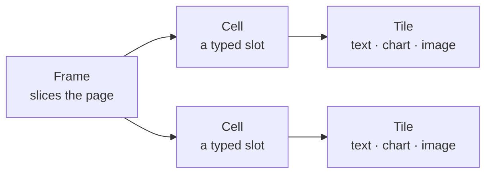

<!-- _class: title -->
<!-- _header: '' -->
<!-- _paginate: false -->

# Lattice

`Why I built it`

I can't stand what slide tools do to the people who use them. So I built one that doesn't.

---

<!-- _class: content -->

`The problem`

## PowerPoint was revolutionary. Nobody has questioned it since.

Every tool after it copied the shape. A blank canvas. A master slide everything inherits from — until your first override sends the whole deck drifting. You still can't see what changed from one version to the next.

---

<!-- _class: content -->

`The fix`

## So I made the deck a plain text file.

You write the words in Markdown. The engine holds the structure; taste is built in, not left to chance. Change a line and that line is all that moves — and poor taste runs out of places to hide.

---

<!-- _class: cards-grid four -->

`The name is the plan`

## Four words, borrowed from people who work with their hands.

- Function
  - Does it work? What the slide is for.
- Form
  - What's its shape? A fixed layout, never a blank page.
- Substance
  - What's it made of? The engine fills the slots.
- Finish
  - How's it finished? One line sets the whole look.

— A tailor talks about form. A shoemaker talks about finish. I borrowed their words on purpose.

---

<!-- _class: content -->

`The one rule`

## No layout ever names a colour.

Every colour comes from a token. Swap the palette and the colours change; the spacing, the type, the structure don't move an inch. Restyle the whole deck in one line.

---

<!-- _class: diagram -->

`For the engineers in the room`

## Every slide is three pieces.

`A cell holds a tile, never another frame — I cut infinite nesting; it earns nothing on a slide.`

---

<!-- _class: cards-grid -->

`Taste, enforced`

## The engine says no, so the deck stays clean.

- Forty words a slide
  - Go past it and the engine tells you to split. The font never shrinks to make room.
- Six bullets, then stop
  - A slide isn't a document. The limit keeps it readable from the back row.
- One idea per slide
  - When two thoughts are fighting, they each get their own page.

---

<!-- _class: list-steps timeline -->

`How it got built`

## It started as a stylesheet. It ended up an engine of its own.

1. A handful of layouts
   - _April 2026. A small palette and a few cards, built on top of Marp._
2. A real catalog
   - _Spring. Native charts, a typography system, a proper component library._
3. My own engine
   - _June. I rebuilt the foundation as an engine of my own._
4. Learning to bend
   - _Now. The same deck reflows from boardroom screen to phone._

---

<!-- _class: content dark -->
<!-- _header: '' -->

`Credit where it's due`

## Lattice stands on the shoulders of Marp.

Yuki Hattori's Marp helped me see the art of the possible. I fought it plenty — layered my own styles over it, dropped to plain CSS to get my way — but it had the best foundation to build on, and the method was the insight. For that, I'm grateful.

---

<!-- _class: progress -->

`Measured against Marp`

## Rebuilt as my own, it renders five times faster.

- Lattice `100%`
- Marp `19%`

— The same 79-slide deck: Marp at 208 milliseconds, Lattice at 39, and 42 megabytes lighter to install. Same method, my own engine underneath.

---

<!-- _class: content -->

`Keeping it honest`

## I had every layout graded twice, and the first scores stung.

One pass built each layout. A separate pass, blind to the first, tried to tear it down. The first score was a seven out of ten — built well, finished poorly. I set the bar at ten and didn't move it.

---

<!-- _class: stats -->

`Where it stands`

## Everything here ships today.

1. 52
   - layouts, ready to drop in
2. 14
   - colour palettes, light and dark
3. 2,000+
   - tests that run on every change
4. AA
   - contrast that passes on every surface

---

<!-- _class: content -->

`What's next`

## It's version one. Reflow is the next job.

One deck that reads right on a projector, a tablet, or a phone — without rewriting a word.

---

<!-- _class: closing -->
<!-- _header: '' -->
<!-- _paginate: false -->

`That's the whole idea`

## You write the words. The structure holds.

`Lattice · lattice.style`
