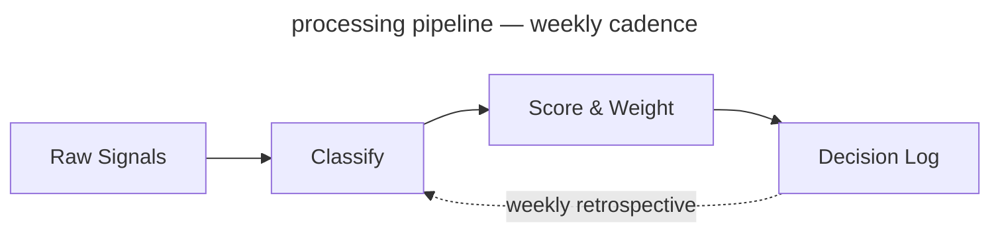

<!-- _class: title -->
<!-- _paginate: false -->
<!-- _footer: "Title slide · title" -->

# From Signal to Strategy

`Product Strategy · Q3 2025`

A decision framework for product leaders navigating market uncertainty

---

<!-- _class: divider -->
<!-- _paginate: false -->
<!-- _footer: "Section break · divider" -->

`Section 01 · Foundations`

## The landscape has shifted. Here is what that means for us.

---

<!-- _class: subtopic -->
<!-- _footer: "Centered orientation · subtopic" -->

`Module 02`

## Before we score signals, we need to agree on what a signal is.

The word is overloaded. We use it to mean anything from a customer complaint to a macro trend. This framework requires a tighter definition.

---

<!-- _class: content -->
<!-- _footer: "Single-idea prose · content" -->

`Context · Competitive Dynamics`

## The window for differentiation is narrowing.

Three converging forces — commoditized infrastructure, compressed release cycles, and rising customer switching costs — have reduced the average durable advantage window from 36 months to under 14. Teams that cannot identify signal from noise in that window will consistently miss timing.

---

<!-- _class: diagram -->
<!-- _footer: "Component diagram · diagram" -->

`Architecture · Signal Pipeline`

## How signals move from input to decision.

`Four-stage processing pipeline — weekly cadence`



---

<!-- _class: stats -->
<!-- _footer: "KPI numbers · stats" -->

`Impact · Pilot Results`

## Six months of results across four product teams.

`Measured against pre-framework baseline, same teams, same market conditions.`

1. **73%** faster close
2. **4.2×** signal recall
3. **18** decisions logged
4. **91%** team alignment

---

<!-- _class: cards-grid -->
<!-- _footer: "2×2 card grid · cards-grid" -->

## The framework has four components.

- Signal Intake
  - Weekly structured collection across customer conversations, market data, and competitive moves. Normalized into a common schema before scoring.
- Scoring Model
  - Each signal scored on three dimensions: confidence, recency, and strategic relevance. Weights are team-configurable and reviewed quarterly.
- Decision Log
  - Every decision recorded with the signals that informed it, the options considered, and the criteria applied. Feeds the calibration loop.
- Calibration Loop
  - Monthly retrospective that compares predicted outcomes to actual outcomes and adjusts scoring weights accordingly.

---

<!-- _class: cards-grid -->
<!-- _footer: "Inline code in cards · cards-grid" -->

## Code in card headers and body text.

- Signal Intake `v2.4`
  - Handles 94% of structured signals without manual intervention. Average latency: `4 min` from ingestion to scored entry.
- Scoring Model `configurable`
  - Three dimensions: confidence, recency, relevance. Default weights are `33 / 33 / 33` — adjust after your first retrospective.
- Decision Log `required`
  - Every prioritization change above `P2` must carry a logged rationale. No log, no change.
- Calibration Loop `monthly`
  - Compares predicted outcomes to actuals. First meaningful weight update happens after `2 cycles`.

---

<!-- _class: cards-grid -->
<!-- _footer: "2 top + 1 bottom · cards-grid" -->

## Signal Intake produces three outputs.

1. Weekly Signal Brief
   - A ranked list of the top 10 signals from the prior week, with confidence scores and source attribution. Distributed to product leads every Monday morning.
2. Anomaly Alerts
   - Real-time flags when a signal exceeds the 2σ threshold on any dimension. Routed directly to the accountable PM with a 4-hour response SLA.
3. Monthly Signal Index
   - The source of truth for the calibration loop. A complete record of all signals logged, scored, and resolved in the prior month. Required reading before each retrospective.

---

<!-- _class: cards-stack -->
<!-- _footer: "Vertical card stack · cards-stack" -->

## Two failure modes the framework is designed to prevent.

- **False signal amplification.** A single loud voice — one enterprise customer, one analyst report, one competitive announcement — dominates the decision without being weighed against the full signal set. The scoring model prevents any single source from exceeding 30% of the total signal weight in a given decision.
- **Signal hoarding.** Teams collect signals but do not log decisions, so the calibration loop has nothing to learn from. The Decision Log is a required artifact for any prioritization change above P2 severity. No log, no change.

---

<!-- _class: cards-grid -->
<!-- _footer: "Side-by-side cards · cards-grid" -->

## Two intake modes for different signal types.

- Structured Intake
  - Signals with clear schema: NPS verbatims, support ticket categories, feature request volumes, win/loss notes. Ingested automatically via API connectors. Scored on arrival. Zero manual handling.
- Unstructured Intake
  - Signals without schema: field observations, conference conversations, analyst briefings, competitive demos. Require human classification before scoring. Routed to the signal owner for a 48-hour classification window.

---

<!-- _class: compare-prose -->
<!-- _footer: "Two options + connector · compare-prose" -->

## Scoring model: before and after the calibration loop.

- Before Calibration
  - Equal weights across all three dimensions. Confidence, recency, and relevance each contribute 33% to the final score. Simple, consistent, but blind to what your market actually rewards.
- After Calibration
  - Weights reflect your team's historical signal accuracy. If recency has consistently been the weakest predictor for your product, it gets downweighted. The model becomes a record of what you have learned.

The shift from equal weights to calibrated weights takes two retrospective cycles — roughly 60 days from adoption.

---

<!-- _class: quote -->
<!-- _footer: "Pull quote · quote" -->

> The signal was always there. We just didn't have a system that forced us to look at it before we'd already decided.

— Head of Product, Pilot Team 3

---

<!-- _class: timeline -->
<!-- _footer: "Horizontal timeline · timeline" -->

## How a decision moves through the framework.

1. Signal Logged
   - _Owner classifies and submits to intake queue_
2. Scored
   - _Model applies current weights, generates score_
3. Brief Published
   - _Signal appears in weekly brief with rank_
4. Decision Logged
   - _PM records rationale, signals, predicted outcome_
5. Retrospective
   - _Outcome scored, weights updated accordingly_

---

<!-- _class: list -->
<!-- _footer: "Card list stack · list" -->

## What the framework does not do.

- It does not make decisions — it structures the information that humans use to decide.
- It does not replace customer discovery — it scores and routes what discovery surfaces.
- It does not work without the Decision Log — calibration requires outcome data to learn from.
- It does not guarantee alignment — it surfaces disagreement earlier, which still requires resolution.
- It does not scale down to individual feature decisions — it is designed for prioritization above P2.

---

<!-- _class: list -->
<!-- _footer: "Numbered list · list" -->

## Four things that must be true before you begin.

1. You have a regular prioritization cadence — at minimum monthly.
2. At least one person owns signal collection full-time or as a primary responsibility.
3. Leadership has agreed to log decisions with rationale, not just outcomes.
4. You have 90 minutes per week to run the intake and scoring process.

---

<!-- _class: big-number -->
<!-- _footer: "Hero stat · big-number" -->

`Calibration Result · 6-Month Pilot`

- 14x
  - Return on signal investment — measured as decisions that reached the right outcome on the first attempt, versus the baseline rate before the framework was adopted.

---

<!-- _class: split-panel -->
<!-- _footer: "Dark panel + content · split-panel" -->

## Scoring Model Deep Dive

`Section 02`

### What this section covers

The scoring model is the most configurable component. This section covers the three dimensions, how weights are set initially, and how calibration updates them over time.

1. Confidence
   - How many independent sources corroborate the signal. Ranges 1–5.
1. Recency
   - Time-decay applied from signal date to scoring date. Half-life is team-configurable.
1. Strategic Relevance
   - Manual score from the signal owner. Ranges 1–5. Requires justification above 4.

---

<!-- _class: closing -->
<!-- _footer: "Dark closing bookend · closing" -->
<!-- _paginate: false -->

`What Would Help Us Move Forward`

## Next step is a working session, not a debate.

`Walk these questions with me in 60–90 minutes. The output is either a design we can execute, or a shared list of what needs more work before we commit.`

---

<!-- _class: cards-grid -->
<!-- _footer: "Finding + key insight · cards-grid" -->

`Finding 01 · Structured Intake`

## Structured intake performed above expectations — volume and latency were not concerns.

- **What worked**
  - API connectors handled 94% of structured signals without manual intervention. Average scoring latency was 4 minutes from ingestion. Schema normalization held across all five connected sources.
- **What required tuning**
  - NPS verbatim classification had an 18% error rate in the first two weeks. Required a training pass on the classification model before accuracy reached the 92% target.

> Viable as designed — NLP classification requires a 2-week warm-up period on new deployments.

---

<!-- _class: cards-grid -->
<!-- _footer: "Key insight + below-note · cards-grid" -->

## Key insight works on any card-bearing layout.

- Signal Intake
  - Weekly structured collection across customer conversations, market data, and competitive moves.
- Scoring Model
  - Each signal scored on three dimensions: confidence, recency, and strategic relevance.
- Decision Log
  - Every decision recorded with the signals that informed it and the criteria applied.
- Calibration Loop
  - Monthly retrospective that compares predicted outcomes to actual outcomes.

> The calibration loop is what separates teams that learn from teams that repeat the same mistakes.

¹ Trailing blockquote becomes a key insight. Trailing paragraph becomes a below-note.

---

<!-- _class: cards-wide -->
<!-- _footer: "3 full-width cards · cards-wide" -->

## Three scoring failure modes found in the pilot.

1. **Recency dominance**
   - High-recency noise crowding out durable signal. Teams set recency weight above 50% in the first calibration pass. Corrected by capping recency weight at 40% until two calibration cycles complete.
2. **Source concentration**
   - Single-customer signals inflating confidence scores. One enterprise customer's verbatims represented 34% of all structured intake in month one. Corrected by adding a source-diversity floor to the scoring model.
3. **Outcome misclassification**
   - PMs logging predicted outcomes that were too vague to score at retrospective. "Improve retention" is not scoreable. "Reduce 30-day churn from 8.2% to below 7%" is.

---

<!-- _class: list-criteria -->
<!-- _footer: "Numbered criteria · list-criteria" -->

## Four requirements every decision system must meet.

- **Speed**
  - Decisions must close within the window they are relevant to. Systems that add latency consume the value they exist to protect.
- **Auditability**
  - Every prioritization decision above a threshold must carry a traceable rationale. Required for alignment and compliance.
- **Adoption**
  - If the team won't use it weekly, calibration never runs and the model never improves. Ninety minutes per PM is the ceiling.
- **Calibration**
  - The system must improve over time. A static scoring model is a spreadsheet with extra steps.

---

<!-- _class: verdict-grid -->
<!-- _footer: "2×2 verdict grid · verdict-grid" -->

## We evaluated four intake tools against the criteria.

- **Tool A · Chorus**
  - [x] Speed
  - [~] Auditability
  - [x] Adoption
  - [ ] Calibration
  - Strong call recording and summarization. No decision logging or calibration loop. Requires separate tooling for everything downstream of intake.
- **Tool B · Productboard**
  - [ ] Speed
  - [x] Auditability
  - [x] Adoption
  - [ ] Calibration
  - Solid intake and prioritization. Decision logging exists but is manual and rarely used. No calibration mechanism. Setup takes 3–4 weeks.
- **Tool C · Notion**
  - [x] Speed
  - [x] Auditability
  - [~] Adoption
  - [ ] Calibration
  - Flexible enough to build the full system. But building it takes 40+ hours and the result is fragile. Teams abandon maintenance after the first quarter.
- **Tool D · Sprig + Decision Log**
  - [x] Speed
  - [x] Auditability
  - [x] Adoption
  - [x] Calibration
  - Meets all four criteria within the 90-minute weekly budget. Reaches production in the same week it is adopted. Recommended.

---

<!-- _class: compare-table -->
<!-- _footer: "Comparison table · compare-table" -->

## The four tools side by side.

| Criterion    | Chorus | Productboard | Notion    | Sprig + Log |
| ------------ | ------ | ------------ | --------- | ----------- |
| Speed        | ✓      | ✗            | ✓         | ✓           |
| Auditability | ✗      | ✓            | ✓         | ✓           |
| Adoption     | ✓      | ✓            | ✗         | ✓           |
| Calibration  | ✗      | ✗            | ✗         | ✓           |
| Setup time   | 1 day  | 3–4 weeks    | 40+ hours | Same day    |

_Evaluated against the same four teams and the same 90-minute weekly budget constraint._

---

<!-- _class: featured -->
<!-- _footer: "Featured + 2 sub-cards · featured" -->

## Applying the criteria to the tools — here is where the evidence points.

- The evidence favors Tool D
  - Sprig combined with a lightweight Decision Log meets all four criteria within the 90-minute weekly budget, reaches production in the same week it is adopted, and leaves a clean exit ramp if a better native solution emerges.
- The path is not self-executing
  - Sprig requires a connector built to your NPS and support platforms. Budget 4–6 hours of engineering time in week one. After that, zero maintenance overhead.
- The Decision Log is the hardest part
  - Not technically. Culturally. PMs need to log decisions with predicted outcomes before they close, not after. This is a habit change, not a tool change.

---

<!-- _class: compare-prose -->
<!-- _footer: "Two options + connector · compare-prose" -->

## Two options with a connector and an explanatory note below.

- Option A · Label
  - Body text describing the first option. Enough detail to fill the card naturally and show how the layout handles a few lines of prose.
- Option B · Label
  - Body text describing the second option. The connector arrow between them implies direction or causality — before/after, input/output, cause/effect.

The below-note sits under the cards after a hairline rule. Use it for a single contextual sentence.

---

<!-- _class: list-steps -->
<!-- _footer: "Horizontal steps · list-steps" -->

## How to roll this out across your organization.

1. Pick one team and one decision type
   - Start with a team that already has a regular prioritization rhythm. Apply the framework only to a single decision category for the first 30 days.
2. Log everything, decide nothing differently
   - In the first month, do not change how you make decisions. Just log signals and decisions as you would have made them anyway.
3. Run your first retrospective
   - At day 30, score the logged decisions against outcomes. This is where the model gets its first calibration pass.
4. Expand to a second team
   - With one retrospective complete, you have evidence. Use it to onboard the second team with real data, not promises.

---

<!-- _class: list-tabular -->
<!-- _footer: "Tabular list · list-tabular" -->

## The six signal dimensions, what they measure, and how they are scored.

1. **Confidence**
   - Number of independent sources corroborating the signal
   - _1–5 · Auto-scored_
2. **Recency**
   - Time-decay from signal date, configurable half-life
   - _0.0–1.0 · Auto-scored_
3. **Relevance**
   - Alignment to current strategic bets, owner-scored
   - _1–5 · Manual_
4. **Reach**
   - Number of customers or segments affected
   - _1–5 · Auto-scored_
5. **Effort**
   - Engineering and design cost to act on the signal
   - _1–5 · Manual_
6. **Confidence delta**
   - Change in confidence score since last scoring cycle
   - _−5 to +5 · Auto_

---

<!-- _class: content -->
<!-- _footer: "Header and footer demo · content" -->
<!-- _header: "Lattice · Layout Gallery" -->
<!-- _footer: "Header stays uppercase · footer renders as written" -->

`Header And Footer`

## Header stays uppercase — footer renders as written.

Set `header:` and `footer:` in frontmatter for deck-level labels, or use per-slide comment directives. The header uses uppercase text-transform automatically, so you write it in any case. The footer renders exactly as written.

---

<!-- _class: code -->
<!-- _footer: "Single code block · code" -->

`Implementation · Token Pipeline`

## The tokenization call is three lines of application code.

`JavaScript · SDK v2 interface`

```javascript
import { TokenVault } from "@company/token-sdk";

const vault = new TokenVault({ keyFile: "./vault.key" });

// Tokenize at ingestion
const token = await vault.tokenize(ssn, { field: "ssn", tenant: "acme" });

// Detokenize only at point of use — every call is logged
const plaintext = await vault.detokenize(token, { requestor: "claims-svc" });
```

---

<!-- _class: compare-code -->
<!-- _footer: "Two code blocks · compare-code" -->

`Before & After · Key Distribution`

## File-distributed keys versus vault-integrated keys.

`Before · File-distributed`

```python
# Key material on disk — anyone with
# filesystem access can read it
with open('./vault.key', 'rb') as f:
    key = f.read()

cipher = AES(key)
token = cipher.encrypt(ssn)
```

`After · HSM / KMS integrated`

```python
# Key never leaves the HSM —
# every operation is audited
import boto3

kms = boto3.client('kms')
token = kms.encrypt(
    KeyId='alias/tokenization',
    Plaintext=ssn
)['CiphertextBlob']
```

---

<!-- _class: image -->
<!-- _footer: "Real image · image" -->

`Layout · Image`

## Image right is the default — text leads, evidence follows.

A landscape asset in a half-canvas slot. The image preserves its native aspect ratio; the lattice pattern frames whatever bands remain. No cropping, ever — authors see the image they dropped in.


---

<!-- _class: image left -->
<!-- _footer: "Real image · image left" -->

`Layout · Image Left`

## Lead with the image, follow with the argument.

A portrait asset in a half-canvas slot — the image fits proportionally, and the lattice pattern shows through on either side. Same rule, different aspect.


---

<!-- _class: image-full -->
<!-- _footer: "Image full · image-full" -->
<!-- _paginate: false -->

## Signal Pipeline · Reference Visualization

Weekly Signal Brief — the primary output of the intake pipeline, distributed every Monday


---

<!-- _class: divider dark -->
<!-- _paginate: false -->
<!-- _footer: "Dark variant — section break · divider dark" -->

`Dark Variant · Any Layout Class`

# The dark modifier works on any layout.

Add `dark` alongside any class — palette remaps automatically

---

<!-- _class: content dark -->
<!-- _footer: "Dark variant — prose · content dark" -->

`Dark Variant · Content`

## The token system handles dark without per-element overrides.

All colours reference CSS variables — `--bg`, `--text-heading`, `--text-body`, `--border` — that remap when `dark` is added. Cards, headings, body text, and borders all shift automatically. The spectrum bar is suppressed on dark slides.

---

<!-- _class: image-full dark -->
<!-- _footer: "Image full dark · image-full dark" -->
<!-- _paginate: false -->

## [ Signal Pipeline · Portrait Asset — Dark ]

A tall asset on a wide canvas — the lattice pattern frames the image on the left and right, replacing dead space with brand chrome.


---

<!-- _class: list dark -->
<!-- _footer: "Dark variant — list · list dark" -->

`Dark Variant · List`

## The card stack renders cleanly on dark backgrounds.

- Every card uses `--bg-alt` for fill and `--border` for the border — both remap in dark mode.
- The accent left border uses `--accent` which is unchanged — the gold reads well against dark.
- Body text shifts to `--text-body` which in dark mode is a warm light tone, not pure white.

---

<!-- _class: cards-stack dark -->
<!-- _footer: "Dark variant — stacked cards · cards-stack dark" -->

`Dark Variant · Cards Stacked`

## Two-card layouts work equally well inverted to dark.

- The architecture introduces a single key distribution question: what protects the file containing key material, and what is the blast radius if it leaves the host? Every other question in this document depends on the answer.
- The pattern here is the same as any page of written argument — claim, then support. The dark palette does not change the information density or the reading rhythm.

---

<!-- _class: list-steps phase -->
<!-- _footer: "Modifier — list-steps phase · list-steps phase" -->

`Modifier · list-steps phase`

## The phase modifier renames the prefix word from STEP to PHASE.

1. Architecture
   - The first phase scopes the technical surface — what we build, what we buy, what we defer. Output is an architecture decision record signed by the platform owner.
2. Pilot
   - One internal team, one workload, one quarter. The phase ends when the integration is in production and the on-call rota covers it.
3. Rollout
   - Five teams in two months. The phase ends when no team needs handholding and incident volume is at or below pre-rollout baseline.

---

<!-- _class: list-steps milestone lettered -->
<!-- _footer: "Modifier — list-steps milestone lettered · list-steps milestone lettered" -->

`Modifier · list-steps milestone lettered`

## Modifiers compose: milestone renames the word, lettered swaps the format.

1. Codebook signing in production
   - The HSM-anchored signing pipeline runs end-to-end. The first signed codebook installs cleanly on a real client.
2. Multi-tenant DEKs
   - One codebook can carry distinct DEKs per tenant without per-tenant rebuilds. Crypto-shred is a single HSM op.
3. Per-purpose codebooks
   - Authoring a codebook scoped to a single business purpose takes minutes, not days. Audit trails distinguish purposes by default.

---

<!-- _class: list-steps vertical compact -->
<!-- _footer: "Modifier — list-steps vertical · list-steps vertical compact" -->

`Modifier · list-steps vertical`

## Vertical stacks the steps as rows; the connector becomes a down-arrow.

1. Sense
   - Inputs are signals. Signals are observed, never invented. The first step is to write down what you see, not what you conclude.
2. Score
   - A signal becomes data once it carries a number. The score is calibrated against outcomes, not against intuition.
3. Decide
   - A decision is a signal plus a deadline. Without the deadline it is an opinion, not a decision. The retrospective closes the loop on the score that earned it.

---

<!-- _class: cards-grid compact -->
<!-- _footer: "Modifier — compact · cards-grid compact" -->

`Modifier · compact`

## Compact tightens the spacing scale ~25 %, end-to-end.

- **What changes**
  - `--sp-xs` through `--sp-2xl` shrink. Card gaps, list gutters, and section padding follow because every layout reads them via `var()`.
- **What does not change**
  - Type ramp, palette, and chrome reservation (header / footer / pagination) are untouched. Compact is a density flag, not a different layout.
- **When to reach for it**
  - You have one more card than fits, or your prose runs the section by 1-2 lines, or you want a denser visual rhythm without rewriting copy.
- **Composition**
  - `compact` composes with `dark`, `accent`, and any layout where density makes sense. It is silently incompatible with `title`, `divider`, and `image-full`.

---

<!-- _class: content loose -->
<!-- _footer: "Modifier — loose · content loose" -->

`Modifier · loose`

## Loose is the inverse — more breathing room, same layout machinery.

The spacing scale grows ~25 % rather than shrinks. Sections that already look generous become luxurious; sections that look cramped become balanced. Reach for `loose` when the slide carries a single editorial point and you want the page to feel deliberately quiet — values pages, declarative principles, the closing line of an argument.

The discipline is the same as `compact` from the other side: do not change the type ramp, do not change the chrome, do not change the layout. Only the variables that govern between-element rhythm move.

> Density is not the same as importance. `loose` says: this page deserves room — not because it carries more, but because it carries one thing well.

---

<!-- _class: closing accent -->
<!-- _paginate: false -->
<!-- _footer: "Modifier — accent · closing accent" -->

`Modifier · accent`

## Accent replaces the rainbow stripe with a single editorial colour.

The default top border is a spectrum gradient — a system signal that the page is part of a wider deck. The `accent` modifier swaps that stripe for one solid colour and tints the slide heading. Use it when one slide carries the editorial weight of a section and you want the visual chrome to say so.

It composes with `dark`: on the dark canvas the spectrum top-stripe is suppressed entirely, so `accent.dark` restores a solid accent stripe in its place — preserving the visual signal across both canvases.

<!-- Import Mermaid and the Lattice runtime theme for VS Code / web preview.
     The build script (lattice.js) pre-renders Mermaid to SVG at build time
     so these scripts are a no-op in the PDF/HTML output. -->
<!-- markdownlint-disable MD033 -->
<script src="../node_modules/mermaid/dist/mermaid.min.js"></script>
<script src="../lattice-runtime.js"></script>
