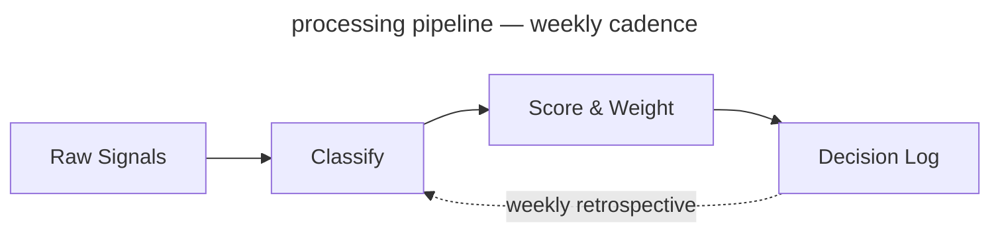

<!-- _class: title -->
<!-- _paginate: false -->
<!-- _footer: "Title slide · title" -->

# From Signal to Strategy

`Product Strategy · Q3 2025`

A decision framework for product leaders navigating market uncertainty

---

<!-- _class: divider -->
<!-- _paginate: false -->
<!-- _footer: "Section break · divider" -->

`Section 01 · Foundations`

## The landscape has shifted. Here is what that means for us.

---

<!-- _class: subtopic -->
<!-- _footer: "Centered orientation · subtopic" -->

`Module 02`

## Before we score signals, we need to agree on what a signal is.

The word is overloaded. We use it to mean anything from a customer complaint to a macro trend. This framework requires a tighter definition.

---

<!-- _class: content -->
<!-- _footer: "Single-idea prose · content" -->

`Context · Competitive Dynamics`

## The window for differentiation is narrowing.

Three converging forces — commoditized infrastructure, compressed release cycles, and rising customer switching costs — have reduced the average durable advantage window from 36 months to under 14. Teams that cannot identify signal from noise in that window will consistently miss timing.

---

<!-- _class: diagram -->
<!-- _footer: "Component diagram · diagram" -->

`Architecture · Signal Pipeline`

## How signals move from input to decision.

`Four-stage processing pipeline — weekly cadence`



---

<!-- _class: stats -->
<!-- _footer: "KPI numbers · stats" -->

`Impact · Pilot Results`

## Six months of results across four product teams.

`Measured against pre-framework baseline, same teams, same market conditions.`

1. **73%** faster close
2. **4.2×** signal recall
3. **18** decisions logged
4. **91%** team alignment

---

<!-- _class: cards-grid -->
<!-- _footer: "2×2 card grid · cards-grid" -->

## The framework has four components.

- Signal Intake
  - Weekly structured collection across customer conversations, market data, and competitive moves. Normalized into a common schema before scoring.
- Scoring Model
  - Each signal scored on three dimensions: confidence, recency, and strategic relevance. Weights are team-configurable and reviewed quarterly.
- Decision Log
  - Every decision recorded with the signals that informed it, the options considered, and the criteria applied. Feeds the calibration loop.
- Calibration Loop
  - Monthly retrospective that compares predicted outcomes to actual outcomes and adjusts scoring weights accordingly.

---

<!-- _class: cards-grid -->
<!-- _footer: "Inline code in cards · cards-grid" -->

## Code in card headers and body text.

- Signal Intake `v2.4`
  - Handles 94% of structured signals without manual intervention. Average latency: `4 min` from ingestion to scored entry.
- Scoring Model `configurable`
  - Three dimensions: confidence, recency, relevance. Default weights are `33 / 33 / 33` — adjust after your first retrospective.
- Decision Log `required`
  - Every prioritization change above `P2` must carry a logged rationale. No log, no change.
- Calibration Loop `monthly`
  - Compares predicted outcomes to actuals. First meaningful weight update happens after `2 cycles`.

---

<!-- _class: cards-grid -->
<!-- _footer: "2 top + 1 bottom · cards-grid" -->

## Signal Intake produces three outputs.

1. Weekly Signal Brief
   - A ranked list of the top 10 signals from the prior week, with confidence scores and source attribution. Distributed to product leads every Monday morning.
2. Anomaly Alerts
   - Real-time flags when a signal exceeds the 2σ threshold on any dimension. Routed directly to the accountable PM with a 4-hour response SLA.
3. Monthly Signal Index
   - The source of truth for the calibration loop. A complete record of all signals logged, scored, and resolved in the prior month. Required reading before each retrospective.

---

<!-- _class: cards-stack -->
<!-- _footer: "Vertical card stack · cards-stack" -->

## Two failure modes the framework is designed to prevent.

- **False signal amplification.** A single loud voice — one enterprise customer, one analyst report, one competitive announcement — dominates the decision without being weighed against the full signal set. The scoring model prevents any single source from exceeding 30% of the total signal weight in a given decision.
- **Signal hoarding.** Teams collect signals but do not log decisions, so the calibration loop has nothing to learn from. The Decision Log is a required artifact for any prioritization change above P2 severity. No log, no change.

---

<!-- _class: cards-grid -->
<!-- _footer: "Side-by-side cards · cards-grid" -->

## Two intake modes for different signal types.

- Structured Intake
  - Signals with clear schema: NPS verbatims, support ticket categories, feature request volumes, win/loss notes. Ingested automatically via API connectors. Scored on arrival. Zero manual handling.
- Unstructured Intake
  - Signals without schema: field observations, conference conversations, analyst briefings, competitive demos. Require human classification before scoring. Routed to the signal owner for a 48-hour classification window.

---

<!-- _class: compare-prose -->
<!-- _footer: "Two options + connector · compare-prose" -->

## Scoring model: before and after the calibration loop.

- Before Calibration
  - Equal weights across all three dimensions. Confidence, recency, and relevance each contribute 33% to the final score. Simple, consistent, but blind to what your market actually rewards.
- After Calibration
  - Weights reflect your team's historical signal accuracy. If recency has consistently been the weakest predictor for your product, it gets downweighted. The model becomes a record of what you have learned.

The shift from equal weights to calibrated weights takes two retrospective cycles — roughly 60 days from adoption.

---

<!-- _class: quote -->
<!-- _footer: "Pull quote · quote" -->

> The signal was always there. We just didn't have a system that forced us to look at it before we'd already decided.

— Head of Product, Pilot Team 3

---

<!-- _class: timeline -->
<!-- _footer: "Horizontal timeline · timeline" -->

## How a decision moves through the framework.

1. Signal Logged
   - _Owner classifies and submits to intake queue_
2. Scored
   - _Model applies current weights, generates score_
3. Brief Published
   - _Signal appears in weekly brief with rank_
4. Decision Logged
   - _PM records rationale, signals, predicted outcome_
5. Retrospective
   - _Outcome scored, weights updated accordingly_

---

<!-- _class: list -->
<!-- _footer: "Card list stack · list" -->

## What the framework does not do.

- It does not make decisions — it structures the information that humans use to decide.
- It does not replace customer discovery — it scores and routes what discovery surfaces.
- It does not work without the Decision Log — calibration requires outcome data to learn from.
- It does not guarantee alignment — it surfaces disagreement earlier, which still requires resolution.
- It does not scale down to individual feature decisions — it is designed for prioritization above P2.

---

<!-- _class: list -->
<!-- _footer: "Numbered list · list" -->

## Four things that must be true before you begin.

1. You have a regular prioritization cadence — at minimum monthly.
2. At least one person owns signal collection full-time or as a primary responsibility.
3. Leadership has agreed to log decisions with rationale, not just outcomes.
4. You have 90 minutes per week to run the intake and scoring process.

---

<!-- _class: big-number -->
<!-- _footer: "Hero stat · big-number" -->

`Calibration Result · 6-Month Pilot`

- 14x
  - Return on signal investment — measured as decisions that reached the right outcome on the first attempt, versus the baseline rate before the framework was adopted.

---

<!-- _class: split-panel -->
<!-- _footer: "Dark panel + content · split-panel" -->

## Scoring Model Deep Dive

`Section 02`

### What this section covers

The scoring model is the most configurable component. This section covers the three dimensions, how weights are set initially, and how calibration updates them over time.

1. Confidence
   - How many independent sources corroborate the signal. Ranges 1–5.
1. Recency
   - Time-decay applied from signal date to scoring date. Half-life is team-configurable.
1. Strategic Relevance
   - Manual score from the signal owner. Ranges 1–5. Requires justification above 4.

---

<!-- _class: closing -->
<!-- _footer: "Dark closing bookend · closing" -->
<!-- _paginate: false -->

`What Would Help Us Move Forward`

## Next step is a working session, not a debate.

`Walk these questions with me in 60–90 minutes. The output is either a design we can execute, or a shared list of what needs more work before we commit.`

---

<!-- _class: cards-grid -->
<!-- _footer: "Finding + key insight · cards-grid" -->

`Finding 01 · Structured Intake`

## Structured intake performed above expectations — volume and latency were not concerns.

- What worked
  - API connectors handled 94% of structured signals without manual intervention. Average scoring latency was 4 minutes from ingestion. Schema normalization held across all five connected sources.
- What required tuning
  - NPS verbatim classification had an 18% error rate in the first two weeks. Required a training pass on the classification model before accuracy reached the 92% target.

> Viable as designed — NLP classification requires a 2-week warm-up period on new deployments.

---

<!-- _class: cards-grid -->
<!-- _footer: "Key insight + below-note · cards-grid" -->

## Key insight works on any card-bearing layout.

- Signal Intake
  - Weekly structured collection across customer conversations, market data, and competitive moves.
- Scoring Model
  - Each signal scored on three dimensions: confidence, recency, and strategic relevance.
- Decision Log
  - Every decision recorded with the signals that informed it and the criteria applied.
- Calibration Loop
  - Monthly retrospective that compares predicted outcomes to actual outcomes.

> The calibration loop is what separates teams that learn from teams that repeat the same mistakes.

Trailing blockquote becomes a key insight; trailing paragraph becomes a below-note with a hairline rule above it.

---

<!-- _class: cards-grid -->
<!-- _footer: "Key insight + annotation · cards-grid" -->

## A trailing italic-only paragraph becomes an annotation.

- Signal Intake
  - Weekly structured collection across customer conversations, market data, and competitive moves.
- Scoring Model
  - Each signal scored on three dimensions: confidence, recency, and strategic relevance.
- Decision Log
  - Every decision recorded with the signals that informed it and the criteria applied.
- Calibration Loop
  - Monthly retrospective that compares predicted outcomes to actual outcomes.

> The calibration loop is what separates teams that learn from teams that repeat the same mistakes.

_Source: pilot retrospective, six months across four product teams._

---

<!-- _class: cards-wide -->
<!-- _footer: "3 full-width cards · cards-wide" -->

## Three scoring failure modes found in the pilot.

1. Recency dominance
   - High-recency noise crowding out durable signal. Teams set recency weight above 50% in the first calibration pass. Corrected by capping recency weight at 40% until two calibration cycles complete.
2. Source concentration
   - Single-customer signals inflating confidence scores. One enterprise customer's verbatims represented 34% of all structured intake in month one. Corrected by adding a source-diversity floor to the scoring model.
3. Outcome misclassification
   - PMs logging predicted outcomes that were too vague to score at retrospective. "Improve retention" is not scoreable. "Reduce 30-day churn from 8.2% to below 7%" is.

---

<!-- _class: list-criteria -->
<!-- _footer: "Numbered criteria · list-criteria" -->

## Four requirements every decision system must meet.

- Speed
  - Decisions must close within the window they are relevant to. Systems that add latency consume the value they exist to protect.
- Auditability
  - Every prioritization decision above a threshold must carry a traceable rationale. Required for alignment and compliance.
- Adoption
  - If the team won't use it weekly, calibration never runs and the model never improves. Ninety minutes per PM is the ceiling.
- Calibration
  - The system must improve over time. A static scoring model is a spreadsheet with extra steps.

---

<!-- _class: verdict-grid -->
<!-- _footer: "2×2 verdict grid · verdict-grid" -->

## We evaluated four intake tools against the criteria.

- Tool A · Chorus
  - [x] Speed
  - [~] Auditability
  - [x] Adoption
  - [ ] Calibration
  - Strong call recording and summarization. No decision logging or calibration loop. Requires separate tooling for everything downstream of intake.
- Tool B · Productboard
  - [ ] Speed
  - [x] Auditability
  - [x] Adoption
  - [ ] Calibration
  - Solid intake and prioritization. Decision logging exists but is manual and rarely used. No calibration mechanism. Setup takes 3–4 weeks.
- Tool C · Notion
  - [x] Speed
  - [x] Auditability
  - [~] Adoption
  - [ ] Calibration
  - Flexible enough to build the full system. But building it takes 40+ hours and the result is fragile. Teams abandon maintenance after the first quarter.
- Tool D · Sprig + Decision Log
  - [x] Speed
  - [x] Auditability
  - [x] Adoption
  - [x] Calibration
  - Meets all four criteria within the 90-minute weekly budget. Reaches production in the same week it is adopted. Recommended.

---

<!-- _class: compare-table -->
<!-- _footer: "Comparison table · compare-table" -->

## The four tools side by side.

| Criterion    | Chorus | Productboard | Notion    | Sprig + Log |
| ------------ | ------ | ------------ | --------- | ----------- |
| Speed        | ✓      | ✗            | ✓         | ✓           |
| Auditability | ✗      | ✓            | ✓         | ✓           |
| Adoption     | ✓      | ✓            | ✗         | ✓           |
| Calibration  | ✗      | ✗            | ✗         | ✓           |
| Setup time   | 1 day  | 3–4 weeks    | 40+ hours | Same day    |

_Evaluated against the same four teams and the same 90-minute weekly budget constraint._

---

<!-- _class: glossary -->
<!-- _footer: "Glossary · glossary (auto-table, auto-pill)" -->

## Glossary

- Adoption
  - Percentage of eligible PMs filing a Decision Log entry within 24 hours of a decision close.
- Auditability
  - The property that any decision can be reconstructed from its inputs three months later without the original author present.
- Calibration
  - The retrospective comparison of predicted to observed outcomes, used to score the framework's accuracy.
- Connector
  - The integration layer between Sprig and your NPS / support platforms. Owns ingestion and tagging.
- Decision Log
  - The append-only record of every prioritization decision, its predicted outcome, and the actual outcome at retrospective time.
- Eligible PM
  - A PM whose team has adopted the framework and is past the 30-day onboarding period.
- Framework
  - The four-criterion process: Speed, Auditability, Adoption, Calibration. The deck's central artifact.

---

<!-- _class: glossary -->
<!-- _footer: "Glossary continued · glossary (auto-table, auto-pill)" -->

## Glossary

- Predicted outcome
  - The author's stated expectation, recorded at decision time, used as the input to calibration.
- Prioritization rhythm
  - The team's regular cadence (weekly, biweekly) for revisiting and re-ordering work.
- Retrospective
  - The 30-day review meeting where logged decisions are scored against observed outcomes.
- Signal
  - Any qualitative or quantitative input to a decision — survey response, NPS comment, support ticket, sales call note.
- Sprig
  - The micro-survey product used by Tool D to capture qualitative signal in-product.
- Tool D
  - The recommended option in the four-tool comparison: Sprig combined with a lightweight Decision Log.

---

<!-- _class: featured -->
<!-- _footer: "Featured + 2 sub-cards · featured" -->

## Applying the criteria to the tools — here is where the evidence points.

- The evidence favors Tool D
  - Sprig combined with a lightweight Decision Log meets all four criteria within the 90-minute weekly budget, reaches production in the same week it is adopted, and leaves a clean exit ramp if a better native solution emerges.
- The path is not self-executing
  - Sprig requires a connector built to your NPS and support platforms. Budget 4–6 hours of engineering time in week one. After that, zero maintenance overhead.
- The Decision Log is the hardest part
  - Not technically. Culturally. PMs need to log decisions with predicted outcomes before they close, not after. This is a habit change, not a tool change.

---

<!-- _class: compare-prose -->
<!-- _footer: "Two options + connector · compare-prose" -->

## Two options with a connector and an explanatory note below.

- Option A · Label
  - Body text describing the first option. Enough detail to fill the card naturally and show how the layout handles a few lines of prose.
- Option B · Label
  - Body text describing the second option. The connector arrow between them implies direction or causality — before/after, input/output, cause/effect.

The below-note sits under the cards after a hairline rule. Use it for a single contextual sentence.

---

<!-- _class: list-steps -->
<!-- _footer: "Horizontal steps · list-steps" -->

## How to roll this out across your organization.

1. Pick one team and one decision type
   - Start with a team that already has a regular prioritization rhythm. Apply the framework only to a single decision category for the first 30 days.
2. Log everything, decide nothing differently
   - In the first month, do not change how you make decisions. Just log signals and decisions as you would have made them anyway.
3. Run your first retrospective
   - At day 30, score the logged decisions against outcomes. This is where the model gets its first calibration pass.
4. Expand to a second team
   - With one retrospective complete, you have evidence. Use it to onboard the second team with real data, not promises.

---

<!-- _class: list-tabular -->
<!-- _footer: "Tabular list · list-tabular" -->

## The six signal dimensions, what they measure, and how they are scored.

1. Confidence
   - Number of independent sources corroborating the signal
   - _1–5 · Auto-scored_
2. Recency
   - Time-decay from signal date, configurable half-life
   - _0.0–1.0 · Auto-scored_
3. Relevance
   - Alignment to current strategic bets, owner-scored
   - _1–5 · Manual_
4. Reach
   - Number of customers or segments affected
   - _1–5 · Auto-scored_
5. Effort
   - Engineering and design cost to act on the signal
   - _1–5 · Manual_
6. Confidence delta
   - Change in confidence score since last scoring cycle
   - _−5 to +5 · Auto_

---

<!-- _class: content -->
<!-- _footer: "Header and footer demo · content" -->
<!-- _header: "Lattice · Layout Gallery" -->
<!-- _footer: "Header stays uppercase · footer renders as written" -->

`Header And Footer`

## Header stays uppercase — footer renders as written.

Set `header:` and `footer:` in frontmatter for deck-level labels, or use per-slide comment directives. The header uses uppercase text-transform automatically, so you write it in any case. The footer renders exactly as written.

---

<!-- _class: code -->
<!-- _footer: "Single code block · code" -->

`Implementation · Token Pipeline`

## The tokenization call is three lines of application code.

`JavaScript · SDK v2 interface`

```javascript
import { TokenVault } from "@company/token-sdk";

const vault = new TokenVault({ keyFile: "./vault.key" });

// Tokenize at ingestion
const token = await vault.tokenize(ssn, { field: "ssn", tenant: "acme" });

// Detokenize only at point of use — every call is logged
const plaintext = await vault.detokenize(token, { requestor: "claims-svc" });
```

---

<!-- _class: compare-code -->
<!-- _footer: "Two code blocks · compare-code" -->

`Before & After · Key Distribution`

## File-distributed keys versus vault-integrated keys.

`Before · File-distributed`

```python
# Key material on disk — anyone with
# filesystem access can read it
with open('./vault.key', 'rb') as f:
    key = f.read()

cipher = AES(key)
token = cipher.encrypt(ssn)
```

`After · HSM / KMS integrated`

```python
# Key never leaves the HSM —
# every operation is audited
import boto3

kms = boto3.client('kms')
token = kms.encrypt(
    KeyId='alias/tokenization',
    Plaintext=ssn
)['CiphertextBlob']
```

---

<!-- _class: image -->
<!-- _footer: "Image · default cover · image" -->

`Layout · Image`

## Image right is the default — text leads, evidence follows.

The image fills its half-canvas slot edge-to-edge. A 1px hairline marks the join between text and image — boardroom polish, no placeholder pattern visible behind a real photo.


---

<!-- _class: image mirror -->
<!-- _footer: "Image · cover, mirrored · image mirror" -->

`Layout · Image Mirror`

## Mirror flips the slot — image left, text right.

`mirror` is the cross-cutting orientation modifier; `image left` is preserved as a deprecated alias for one release.


---

<!-- _class: image contain -->
<!-- _footer: "Image · contain (no crop) · image contain" -->

`Layout · Image Contain`

## When a chart or screenshot must show in full, opt into `contain`.

The image is centred at native aspect on a clean `--bg-alt` matte — an editorial plate, not a placeholder. Use this for diagrams, schematics, and any asset where cropping would destroy meaning.


---

<!-- _class: image full -->
<!-- _footer: "Image full · cover · image full" -->
<!-- _paginate: false -->

## Signal Pipeline · Reference Visualization

Weekly Signal Brief — the primary output of the intake pipeline, distributed every Monday


---

<!-- _class: divider dark -->
<!-- _paginate: false -->
<!-- _footer: "Dark variant — section break · divider dark" -->

`Dark Variant · Any Layout Class`

# The dark modifier works on any layout.

Add `dark` alongside any class — palette remaps automatically

---

<!-- _class: content dark -->
<!-- _footer: "Dark variant — prose · content dark" -->

`Dark Variant · Content`

## The token system handles dark without per-element overrides.

All colours reference CSS variables — `--bg`, `--text-heading`, `--text-body`, `--border` — that remap when `dark` is added. Cards, headings, body text, and borders all shift automatically. The spectrum bar is suppressed on dark slides.

---

<!-- _class: image full contain dark -->
<!-- _footer: "Image full contain dark · image full contain dark" -->
<!-- _paginate: false -->

## Signal Pipeline · Portrait Asset

A tall asset on a wide canvas — `contain` replaces the lattice pattern with a quiet `--bg-alt` matte, so the image reads as a museum plate rather than a placeholder.


---

<!-- _class: list dark -->
<!-- _footer: "Dark variant — list · list dark" -->

`Dark Variant · List`

## The card stack renders cleanly on dark backgrounds.

- Every card uses `--bg-alt` for fill and `--border` for the border — both remap in dark mode.
- The accent left border uses `--accent` which is unchanged — the gold reads well against dark.
- Body text shifts to `--text-body` which in dark mode is a warm light tone, not pure white.

---

<!-- _class: cards-stack dark -->
<!-- _footer: "Dark variant — stacked cards · cards-stack dark" -->

`Dark Variant · Cards Stacked`

## Two-card layouts work equally well inverted to dark.

- The architecture introduces a single key distribution question: what protects the file containing key material, and what is the blast radius if it leaves the host? Every other question in this document depends on the answer.
- The pattern here is the same as any page of written argument — claim, then support. The dark palette does not change the information density or the reading rhythm.

---

<!-- _class: list-steps phase -->
<!-- _footer: "Modifier — list-steps phase · list-steps phase" -->

`Modifier · list-steps phase`

## The phase modifier renames the prefix word from STEP to PHASE.

1. Architecture
   - The first phase scopes the technical surface — what we build, what we buy, what we defer. Output is an architecture decision record signed by the platform owner.
2. Pilot
   - One internal team, one workload, one quarter. The phase ends when the integration is in production and the on-call rota covers it.
3. Rollout
   - Five teams in two months. The phase ends when no team needs handholding and incident volume is at or below pre-rollout baseline.

---

<!-- _class: list-steps milestone lettered -->
<!-- _footer: "Modifier — list-steps milestone lettered · list-steps milestone lettered" -->

`Modifier · list-steps milestone lettered`

## Modifiers compose: milestone renames the word, lettered swaps the format.

1. Codebook signing in production
   - The HSM-anchored signing pipeline runs end-to-end. The first signed codebook installs cleanly on a real client.
2. Multi-tenant DEKs
   - One codebook can carry distinct DEKs per tenant without per-tenant rebuilds. Crypto-shred is a single HSM op.
3. Per-purpose codebooks
   - Authoring a codebook scoped to a single business purpose takes minutes, not days. Audit trails distinguish purposes by default.

---

<!-- _class: list-steps vertical compact -->
<!-- _footer: "Modifier — list-steps vertical · list-steps vertical compact" -->

`Modifier · list-steps vertical`

## Vertical stacks the steps as rows; the connector becomes a down-arrow.

1. Sense
   - Inputs are signals. Signals are observed, never invented. The first step is to write down what you see, not what you conclude.
2. Score
   - A signal becomes data once it carries a number. The score is calibrated against outcomes, not against intuition.
3. Decide
   - A decision is a signal plus a deadline. Without the deadline it is an opinion, not a decision. The retrospective closes the loop on the score that earned it.

---

<!-- _class: compare-prose chosen -->
<!-- _footer: "Modifier — compare-prose chosen · compare-prose chosen" -->

`Modifier · compare-prose chosen`

## Chosen flags the right-hand card as the winner.

- Vault round-trip
  - Every detokenize is a network call to a central vault. Latency is a function of distance, not code. p99 60 ms, vault outages cascade.
- In-process codebook
  - Detokenize is a local function call against an SDK-resident codebook. p99 8 ms, vault outages do not affect tokenized-record reads.

The right card carries an accent left-edge and accent-tinted background — the same visual contract used by featured cards.

---

<!-- _class: compare-prose decision -->
<!-- _footer: "Modifier — compare-prose decision · compare-prose decision" -->

`Modifier · compare-prose decision`

## Decision composes chosen + rejected with a labelled connector.

- Buy a vendor
  - Three vendors evaluated; none cover the regulatory boundary in-process. Time-to-integrate is six months at best; ongoing per-tenant licensing.
- Build in-house
  - Owns the architecture, owns the operating model, owns the timeline. The compliance window closes in 18 months and a vendor cutover would consume nine of those.

The left card is struck through to read as the option considered then dropped; the right card carries the chosen visual; the connector is amplified and labelled DECISION.

---

<!-- _class: compare-prose vertical -->
<!-- _footer: "Modifier — compare-prose vertical · compare-prose vertical" -->

`Modifier · compare-prose vertical`

## Vertical stacks the two cards; the arrow connector rotates 90°.

- Before — manual rotation
  - Operators schedule a rotation window, freeze writes on the affected scope, swap codebooks, run a verification pass, lift the freeze. Average outage 18 minutes.
- After — version-floor rotation
  - The signing pipeline emits a new codebook with an incremented version. Clients install the new codebook on next refresh. No write freeze. No coordinated cutover.

---

<!-- _class: cards-grid three -->
<!-- _footer: "Modifier — cards-grid three · cards-grid three" -->

`Modifier · cards-grid three`

## Three switches the grid from 2 columns to 3 columns.

- Codebook
  - The signed envelope an SDK installs. Carries policy, wrapped DEK, version, expiry. The codebook is the unit of distribution.
- DEK
  - Data encryption key. Wrapped by a KEK; lives plaintext only inside native SDK memory. Never leaves the host.
- KEK
  - Key encryption key. Lives in the HSM, never exported. The crypto-shred operation on a tenant is a single HSM op against its KEK.

---

<!-- _class: cards-grid four compact -->
<!-- _footer: "Modifier — cards-grid four · cards-grid four compact" -->

`Modifier · cards-grid four`

## Four switches to 4 columns; pair with compact for visual balance.

- Sense
  - Signals are observed, never invented. Inputs are written down before they are interpreted.
- Score
  - A signal becomes data once it carries a number. Calibration is against outcomes, not intuition.
- Decide
  - A decision is a signal plus a deadline. Without a deadline it is an opinion.
- Review
  - The retrospective closes the loop on the score that earned the decision. The model improves only here.

---

<!-- _class: cards-stack horizontal -->
<!-- _footer: "Modifier — cards-stack horizontal · cards-stack horizontal" -->

`Modifier · cards-stack horizontal`

## Horizontal flips cards-stack from a vertical stack to a row.

- **Claim.** The codebook model gets in-process latency with vault-grade key custody. We do not pay round-trip latency on every read.
- **Evidence.** The pilot ran six months across four product teams. p99 detokenize landed at 8 ms; vault outages did not cascade into application outages.
- **Implication.** A vendor cutover is unnecessary. We continue investing in the in-house architecture and ship the operational runbook in the next phase.

---

<!-- _class: image mirror -->
<!-- _footer: "Modifier — image mirror · image mirror" -->

`Modifier · image mirror`

## Mirror flips the image slot — same vocabulary as featured, split-panel, compare-prose.

The half-canvas image moves from the right slot to the left, and the text padding swaps to match. `mirror` is the cross-cutting orientation flag in the Lattice grammar; `image left` is preserved as a backwards-compatible alias for one release.


---

<!-- _class: featured mirror -->
<!-- _footer: "Modifier — featured mirror · featured mirror" -->

## Mirror puts the hero card on the right; sub-cards stack on the left.

- The hero card now reads from the right
  - The featured layout normally leads with the accented hero card on the left and stacks supporting cards on the right. Mirror swaps the columns without touching the markdown contract.
- First supporting card on the left
  - Useful when the rest of the deck reads left-to-right and the editorial weight needs to land on the right edge as the next slide opens.
- Second supporting card below
  - Identical structure, identical authoring; only the visual side changes.

---

<!-- _class: split-panel mirror -->
<!-- _footer: "Modifier — split-panel mirror · split-panel mirror" -->

## Section opener with the accent panel on the right.

`Section 02 · Mirror`

### What this section covers

Mirror moves the dark accent panel to the right. The watermark, eyebrow, and section number all stay anchored to the panel's own box — only the column position flips.

1. Confidence
   - How many independent sources corroborate the signal. Ranges 1–5.
1. Recency
   - Time-decay applied from signal date to scoring date. Half-life is team-configurable.
1. Strategic Relevance
   - Manual score from the signal owner. Ranges 1–5. Requires justification above 4.

---

<!-- _class: compare-prose mirror chosen -->
<!-- _footer: "Modifier — compare-prose mirror chosen · compare-prose mirror chosen" -->

## Mirror composes with chosen — the accented card reads from the left.

- Considered alternative
  - Source order keeps this card first, so `chosen` rules continue to target the second card in the markdown. Mirror only flips the rendering; the editorial intent (left = considered, right = chosen) is preserved by reading order.
- The choice
  - With `mirror`, the chosen card now appears on the left visually. Use this when the surrounding deck reads right-to-left or when the chosen path needs to land first in the audience's scan path.

The below-note still appears under both cards after the hairline rule.

---

<!-- _class: divider numbered -->
<!-- _footer: "Modifier — divider numbered · divider numbered" -->

`Modifier · divider numbered`

## Numbered stamps an auto-counter in the top-right corner.

The CSS counter walks the whole deck once and increments on every `divider.numbered` slide. Authors do not number sections by hand — the layout does it.

---

<!-- _class: subtopic numbered -->
<!-- _footer: "Modifier — subtopic numbered · subtopic numbered" -->

`Modifier · subtopic numbered`

## Each bookend layout owns its own counter.

The subtopic counter is independent of the divider counter, so a mid-deck subtopic stamps `01` even when the dividers are already at `04`.

---

<!-- _class: closing numbered -->
<!-- _footer: "Modifier — closing numbered · closing numbered" -->
<!-- _paginate: false -->

`Closing · numbered`

## The closing series gets its own auto-stamp too.

`Use it for multi-part decks where the closing slide of each part should carry the part number.`

---

<!-- _class: matrix-2x2 -->
<!-- _footer: "New layout — matrix-2x2 · matrix-2x2" -->

## How we sort vendors against our two axes.

`Coverage · Cost`

- High coverage / Low cost
  - Vendor A — strongest fit on coverage, second-lowest TCO of the four.
  - Vendor B — narrower coverage but cheapest license tier.
- High coverage / High cost
  - Vendor C — full coverage, premium pricing, niche differentiators we do not need.
- Low coverage / Low cost
  - Vendor D — cheap, but leaves three regulatory boundaries uncovered.
- Low coverage / High cost
  - _none — and that is the signal._

---

<!-- _class: decision -->
<!-- _footer: "New layout — decision · decision" -->

## We are building, not buying.

`Decision · 2026 Q1`

- **Build**
  - Owns the architecture, owns the operating model, owns the timeline.
- **Why not buy**
  - Three vendors evaluated; none cover the regulatory boundary in-process.
- **Why not delay**
  - The compliance window closes in 18 months.

---

<!-- _class: before-after -->
<!-- _footer: "New layout — before-after · before-after" -->

## Detokenize used to require a vault round-trip.

`Latency story · before vs after`

- **Before**
  - Every detokenize call: network round-trip to the central vault, average 18 ms, p99 60 ms. Vault outages cascaded into application outages.
- **After**
  - Detokenize is a local function call. p99 8 ms. Vault outages do not affect tokenized-record reads.

The architecture change is the codebook model — local, signed, time-bound key material — not a vault optimisation.

---

<!-- _class: principles -->
<!-- _footer: "New layout — principles · principles" -->

## How we make calls when the spec is silent.

1. We default to the choice that is cheaper to reverse.
2. We name the actor, never the system.
3. We write down the bet on the same slide as the choice.

---

<!-- _class: roadmap -->
<!-- _footer: "New layout — roadmap · roadmap" -->

## What ships in each phase, by workstream.

| Workstream | Phase 01          | Phase 02              | Phase 03              |
| ---------- | ----------------- | --------------------- | --------------------- |
| Platform   | Codebook signing  | Multi-tenant DEKs     | Per-purpose codebooks |
| Operations | Manual rotation   | Automated rotation    | Crypto-shred          |
| Compliance | Audit trail (HSM) | Centralised log       | Examiner pack         |
| SDK        | Java              |                       | Polyglot parity       |

The first column is sticky workstream label; phase columns carry numbered chrome; empty cells render as a thin dash.

---

<!-- _class: kpi target -->
<!-- _footer: "New layout — kpi · kpi target" -->

## Where we are against quarter targets.

1. **94%**
   - Token-issuance success
   - target 99%, +2pp QoQ
2. **8 ms**
   - p99 detokenize
   - target 10 ms, -3 ms QoQ
3. **0**
   - Examiner findings
   - target 0, flat
4. **3.2×**
   - Detokenize headroom
   - target 2×, +0.4× QoQ

---

<!-- _class: agenda progress-2 -->
<!-- _footer: "New layout — agenda · agenda progress-2" -->

## What this deck covers, in order.

1. The Design — page 7
2. The Phasing — page 18
3. The Choices — page 26
4. Appendices — page 35
5. Closing — page 64

---

<!-- _class: actors -->
<!-- _footer: "New layout — actors · actors" -->

## Who owns each part of the codebook lifecycle.

- **Key custody** `HSM admin`
  - Manages KEK ceremonies and rotation. Never holds plaintext DEKs.
- **Policy** `Platform operator`
  - Owns codebook policy, signing keys, version floors, and revocation playbooks.
- **Consumption** `Application team`
  - Holds time-bound codebooks; tokenizes and detokenizes in-process.
- **Oversight** `Examiner`
  - Reads the HSM audit trail; cannot read plaintext.

---

<!-- _class: tldr numbered -->
<!-- _footer: "New layout — tldr · tldr numbered" -->

`Section 03 · Recap`

## What this section will tell you, in five lines.

- The codebook model gets in-process latency with vault-grade key custody. → slide 8
- Rotation is a version-floor increment, not a coordinated cutover. → slide 12
- Per-tenant KEKs make crypto-shred a single HSM op. → slide 18
- Phase 1 ships the architecture, Phase 2 ships the operations. → slide 22
- Five questions stay open until Phase 1 closes them on the record. → slide 27

---

<!-- _class: cards-grid compact -->
<!-- _footer: "Modifier — compact · cards-grid compact" -->

`Modifier · compact`

## Compact tightens the spacing scale ~25 %, end-to-end.

- What changes
  - `--sp-xs` through `--sp-2xl` shrink. Card gaps, list gutters, and section padding follow because every layout reads them via `var()`.
- What does not change
  - Type ramp, palette, and chrome reservation (header / footer / pagination) are untouched. Compact is a density flag, not a different layout.
- When to reach for it
  - You have one more card than fits, or your prose runs the section by 1-2 lines, or you want a denser visual rhythm without rewriting copy.
- Composition
  - `compact` composes with `dark`, `accent`, and any layout where density makes sense. It is silently incompatible with `title`, `divider`, and `image-full`.

---

<!-- _class: content loose -->
<!-- _footer: "Modifier — loose · content loose" -->

`Modifier · loose`

## Loose is the inverse — more breathing room, same layout machinery.

The spacing scale grows ~25 % rather than shrinks. Sections that already look generous become luxurious; sections that look cramped become balanced. Reach for `loose` when the slide carries a single editorial point and you want the page to feel deliberately quiet — values pages, declarative principles, the closing line of an argument.

The discipline is the same as `compact` from the other side: do not change the type ramp, do not change the chrome, do not change the layout. Only the variables that govern between-element rhythm move.

> Density is not the same as importance. `loose` says: this page deserves room — not because it carries more, but because it carries one thing well.

---

<!-- _class: content with-period -->
<!-- _footer: "Modifier — with-period · content with-period" -->

`Modifier · with-period`

## Headings gain a closing period automatically

Authors who prefer sentence-style heading punctuation can set `class: with-period` in front matter once and stop thinking about it. The transform appends a period to any heading that does not already end with terminal punctuation — `.` `!` `?` `:` `…` — so mixed slides are safe.

The mirror modifier is `no-period`, which strips trailing periods instead. Both are deck-wide opt-ins via the global `class:` front-matter key; per-slide override with `<!-- _class: with-period -->` works too.

---

<!-- _class: content no-period -->
<!-- _footer: "Modifier — no-period · content no-period" -->

`Modifier · no-period`

<!-- markdownlint-disable-next-line MD026 -->
## Authors typed this heading with a period. It is gone.

Some teams author headings with periods out of habit, then strip them in review. `class: no-period` automates the strip so the source can stay as written and the output stays clean.

Only a literal trailing `.` is removed — `!`, `?`, `:`, and `…` pass through untouched. Combine with any layout class; the modifier composes cleanly because it operates on the heading text alone and touches no structural chrome.

---

<!-- _class: divider -->
<!-- _paginate: false -->
<!-- _footer: "Background Library — section break · divider" -->

`Background Library · Any Layout Class`

# bg-* classes add peripheral accents from the active palette

Add a `bg-*` class alongside any layout class — gradient wash or SVG mark, light canvas or dark, single pattern or layered pair.

---

<!-- _class: content bg-corner-tl -->
<!-- _footer: "Background — corner glow · content bg-corner-tl" -->

`Background · Corner Glow`

## A radial glow anchored at the corner fades before reaching the content zone

`bg-corner-tl` places an elliptical accent at the top-left — 12% opacity at the corner, transparent before mid-slide. The four `bg-corner-*` variants share the same weight and fade profile; only the anchor differs.

All gradients use `color-mix(in srgb, var(--accent) 12%, transparent)`. Switching palette or adding the `dark` modifier remaps the accent automatically — no per-pattern overrides.

---

<!-- _class: content bg-orbit-br dark -->
<!-- _footer: "Background — SVG marks · content bg-orbit-br dark" -->

`Background · SVG Marks · Dark`

## SVG accent marks are painted through a mask in the active accent colour

`bg-orbit-br` places concentric rings and satellite dots in the bottom-right corner. The shapes render via `::before` + `mask-image`: the SVG defines the alpha channel (white = opaque, transparent = hidden) and the paint colour is `color-mix(in srgb, var(--accent) 28%, transparent)` — resolved from the theme at render time. Same class, light canvas or dark, the shapes are always visible and always on-brand.

---

<!-- _class: content bg-vignette bg-edge-right -->
<!-- _footer: "Background — layered radial + linear · content bg-vignette bg-edge-right" -->

`Background · Layered`

## One class from each slot layers without conflict

Every `bg-*` class writes to either `--_bg-radial` or `--_bg-linear`. A compositor rule assembles both slots into a single `background-image` with two live layers. Stack one class from each column and both render:

- `bg-vignette` — radial slot — accent-tinted perimeter, open center
- `bg-edge-right` — linear slot — wash bleeding in from the right edge

The SVG mark patterns follow the same rule: their atmospheric haze writes to its slot, and the `::before` shapes compose on top independently.

---

<!-- _class: divider -->
<!-- _paginate: false -->
<!-- _footer: "Chart — gantt + kanban · divider" -->

`Chart Layouts · gantt + kanban`

## Timeline bars and board columns from a two-level list

---

<!-- _class: gantt -->
<!-- _footer: "Chart — gantt · gantt" -->

`2026 Q1 → 2026 Q4`

## Feature delivery by workstream

- Design
  - Foundations `Q1` `done`
  - Component audit `Q2` `done`
  - Token refresh `Q3`
- Engineering
  - API v2 `Q1` `done`
  - SDK release `Q2 → Q3` `in-progress`
  - Migration guide `Q4`
- Growth
  - Onboarding v2 `Q2` `done`
  - Referral flow `Q3 → Q4`

---

<!-- _class: kanban -->
<!-- _footer: "Chart — kanban · kanban" -->

`Board · Phase 2 delivery`

## Where Phase 2 work stands today

- Backlog
  - API contract review
  - Load-test harness
- In progress
  - SDK v2 alpha `in-progress`
  - Onboarding redesign `in-progress`
- Review
  - Token migration spec `review`
- Done
  - Scope sign-off `done`
  - Design freeze `done`

---

<!-- _class: closing accent -->
<!-- _paginate: false -->
<!-- _footer: "Modifier — accent · closing accent" -->

`Modifier · accent`

## Accent replaces the rainbow stripe with a single editorial colour.

The default top border is a spectrum gradient — a system signal that the page is part of a wider deck. The `accent` modifier swaps that stripe for one solid colour and tints the slide heading. Use it when one slide carries the editorial weight of a section and you want the visual chrome to say so.

It composes with `dark`: on the dark canvas the spectrum top-stripe is suppressed entirely, so `accent.dark` restores a solid accent stripe in its place — preserving the visual signal across both canvases.

<!-- Import Mermaid and the Lattice runtime theme for VS Code / web preview.
     The build script (lattice-emulator.js) pre-renders Mermaid to SVG at build time
     so these scripts are a no-op in the PDF/HTML output. -->
<!-- markdownlint-disable MD033 -->
<script src="../node_modules/mermaid/dist/mermaid.min.js"></script>
<script src="../lattice-runtime.js"></script>
