<!-- _class: title -->
<!-- _paginate: false -->
<!-- _footer: '' -->
<!-- _header: '' -->

##### Mermaid 11.14 · Lattice Theme

# Every Mermaid diagram, one slide each.

*A reference gallery of the 26 diagram types Mermaid supports, rendered with the Lattice palette so you can see what each one looks like in production.*

---

<!-- _class: split-panel -->

## How this gallery is organised.

##### Orientation · How to use this deck

### Three groups, twenty-six diagrams

Stable diagrams render with full theme control. Experimental ones marked 🔥 may evolve in syntax and have limited theming surfaces.

- **15**
  - **Stable**
  - Flowchart, sequence, class, state, ER, journey, gantt, pie, quadrant, requirement, gitgraph, c4, mindmap, timeline, zenuml.
- **11**
  - **Experimental 🔥**
  - Sankey, xy chart, block, packet, kanban, architecture, radar, treemap, venn, ishikawa, treeView.
- **6**
  - **Themeable**
  - Flowchart, sequence, pie, state, class, journey have named themeVariables. Everything else inherits from the core six.

---

<!-- _class: divider -->
<!-- _paginate: false -->
<!-- _footer: '' -->

##### Group 01 · Stable diagrams

# The fifteen well-supported types.

---

<!-- _class: diagram -->

### 01 · Flowchart

## Boxes and arrows. The most-used diagram type.

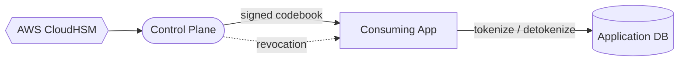
```mermaid
flowchart LR
  A{{"AWS CloudHSM"}} --> B(["Control Plane"])
  B -->|"signed codebook"| C["Consuming App"]
  C -->|"tokenize / detokenize"| D[("Application DB")]
  B -.->|"revocation"| C
```

> Full theme support — node fills, borders, edge colors, cluster fills, edge labels all controllable via themeVariables.

---

<!-- _class: diagram -->

### 02 · Sequence Diagram

## Actors and signals over time.

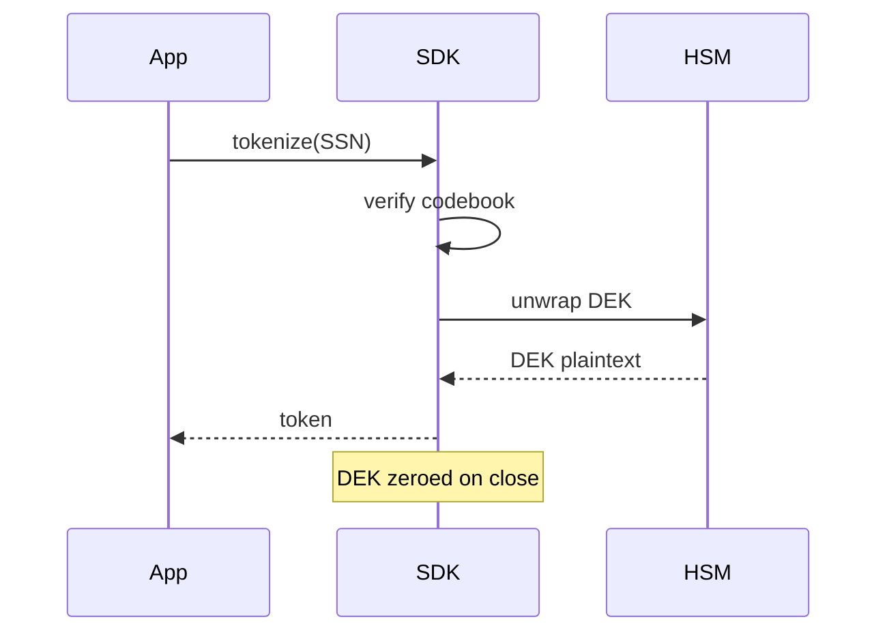
```mermaid
sequenceDiagram
  participant App
  participant SDK
  participant HSM
  App->>SDK: tokenize(SSN)
  SDK->>SDK: verify codebook
  SDK->>HSM: unwrap DEK
  HSM-->>SDK: DEK plaintext
  SDK-->>App: token
  Note over SDK: DEK zeroed on close
```

> Full theme support — actor backgrounds, signal colors, activation bars, note styling all themeable.

---

<!-- _class: diagram -->

### 03 · Class Diagram

## UML classes with attributes, methods, and inheritance.

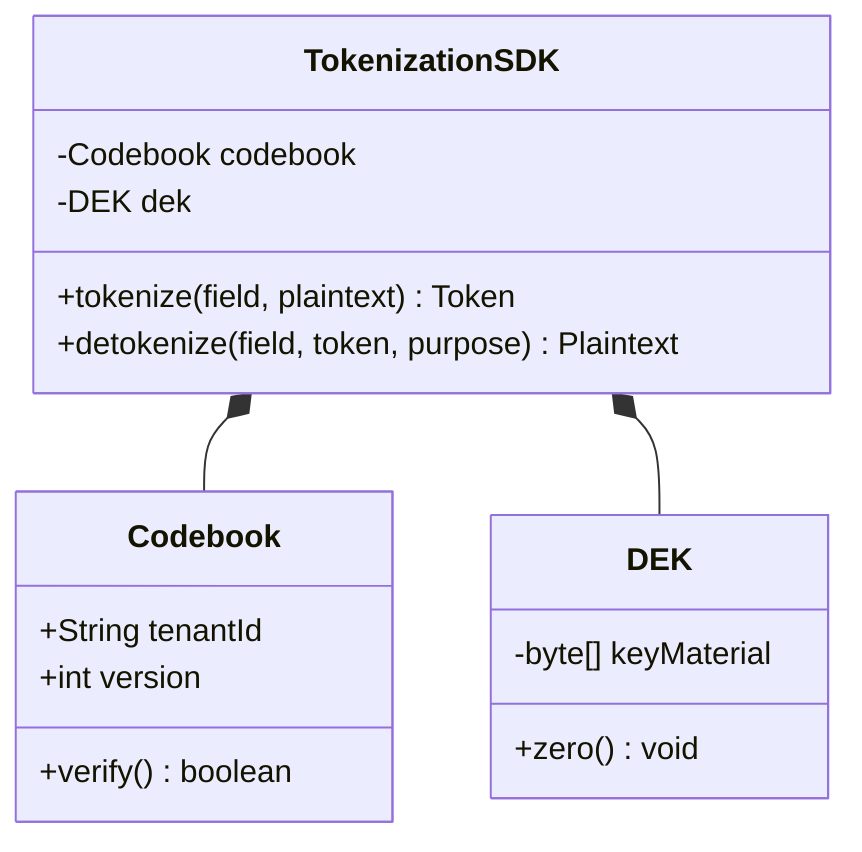
```mermaid
classDiagram
  class TokenizationSDK {
    -Codebook codebook
    -DEK dek
    +tokenize(field, plaintext) Token
    +detokenize(field, token, purpose) Plaintext
  }
  class Codebook {
    +String tenantId
    +int version
    +verify() boolean
  }
  class DEK {
    -byte[] keyMaterial
    +zero() void
  }
  TokenizationSDK *-- Codebook
  TokenizationSDK *-- DEK
```

> Themeable — `classText` controls label color; node fills inherit from `primaryColor`.

---

<!-- _class: diagram -->

### 04 · State Diagram

## A finite state machine.

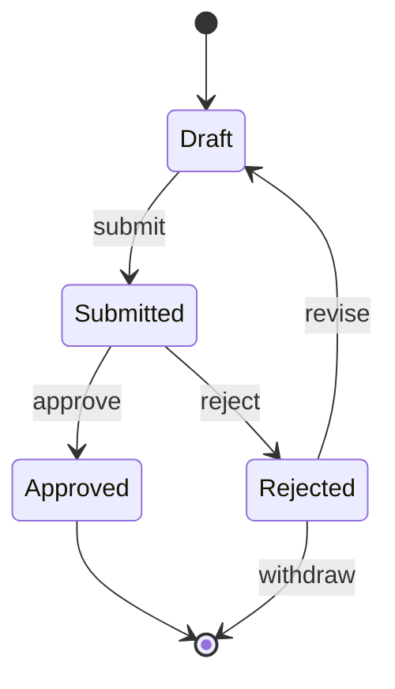
```mermaid
stateDiagram-v2
  [*] --> Draft
  Draft --> Submitted: submit
  Submitted --> Approved: approve
  Submitted --> Rejected: reject
  Approved --> [*]
  Rejected --> Draft: revise
  Rejected --> [*]: withdraw
```

> Themeable — `labelColor` and `altBackground` for composite states. State fills inherit from primary.

---

<!-- _class: diagram -->

### 05 · Entity Relationship Diagram

## Database tables and their relationships.

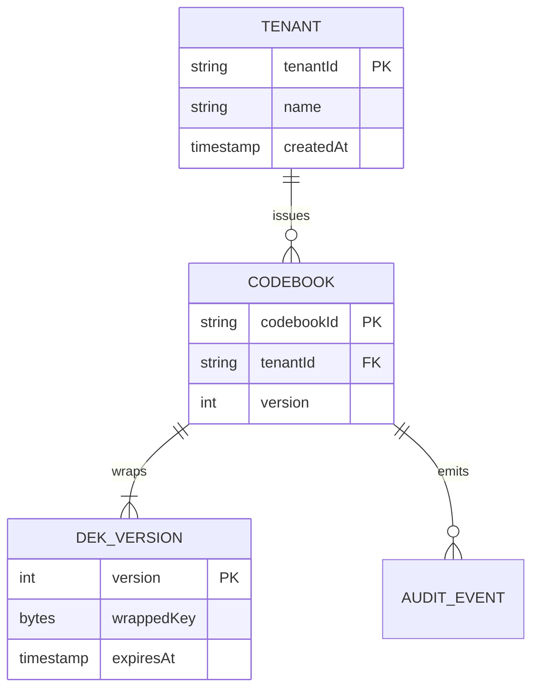
```mermaid
erDiagram
  TENANT ||--o{ CODEBOOK : "issues"
  CODEBOOK ||--|{ DEK_VERSION : "wraps"
  CODEBOOK ||--o{ AUDIT_EVENT : "emits"
  TENANT {
    string tenantId PK
    string name
    timestamp createdAt
  }
  CODEBOOK {
    string codebookId PK
    string tenantId FK
    int version
  }
  DEK_VERSION {
    int version PK
    bytes wrappedKey
    timestamp expiresAt
  }
```

> No named themeVariables — inherits border / text / fill from core variables.

---

<!-- _class: diagram -->

### 06 · User Journey

## Steps and the emotional state at each one.

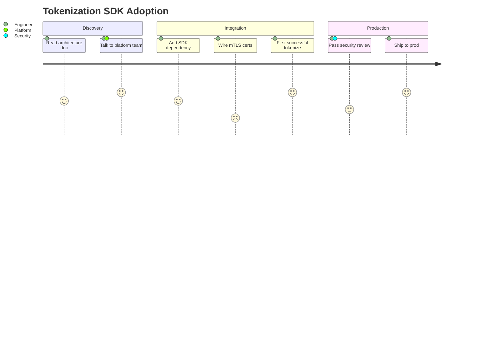
```mermaid
journey
  title Tokenization SDK Adoption
  section Discovery
    Read architecture doc: 4: Engineer
    Talk to platform team: 5: Engineer, Platform
  section Integration
    Add SDK dependency: 4: Engineer
    Wire mTLS certs: 2: Engineer
    First successful tokenize: 5: Engineer
  section Production
    Pass security review: 3: Engineer, Security
    Ship to prod: 5: Engineer
```

> Themeable — eight `fillType0..7` variables for the section coloring.

---

<!-- _class: diagram -->

### 07 · Gantt

## Tasks across a timeline, with dependencies.

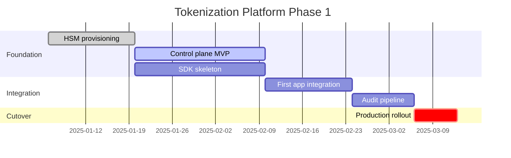
```mermaid
gantt
  title Tokenization Platform Phase 1
  dateFormat YYYY-MM-DD
  section Foundation
    HSM provisioning      :done,   hsm,   2025-01-06, 14d
    Control plane MVP     :active, cp,    after hsm, 21d
    SDK skeleton          :        sdk,   after hsm, 21d
  section Integration
    First app integration :        int1,  after cp, 14d
    Audit pipeline        :        audit, after int1, 10d
  section Cutover
    Production rollout    :crit,   roll,  after audit, 7d
```

> Lots of dedicated themeVariables — task bar, active task, done task, critical, today line all separately controllable.

---

<!-- _class: diagram -->

### 08 · Pie Chart

## Proportions of a whole.

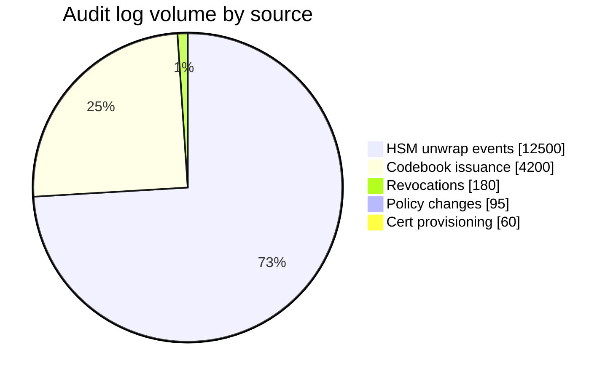
```mermaid
pie showData
  title Audit log volume by source
  "HSM unwrap events" : 12500
  "Codebook issuance" : 4200
  "Revocations" : 180
  "Policy changes" : 95
  "Cert provisioning" : 60
```

> Most theme-rich diagram — twelve `pie1..12` slot colors plus title, section, legend, stroke variables.

---

<!-- _class: diagram -->

### 09 · Quadrant Chart

## Two-axis priority scatter.

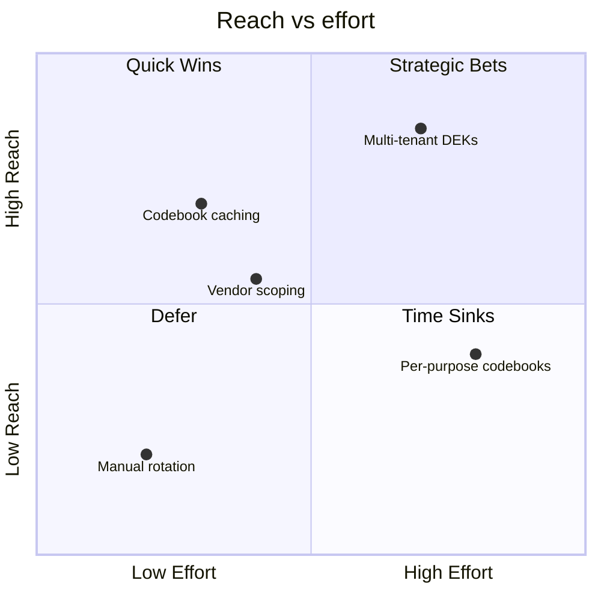
```mermaid
quadrantChart
  title Reach vs effort
  x-axis Low Effort --> High Effort
  y-axis Low Reach --> High Reach
  quadrant-1 Strategic Bets
  quadrant-2 Quick Wins
  quadrant-3 Defer
  quadrant-4 Time Sinks
  Codebook caching: [0.3, 0.7]
  Multi-tenant DEKs: [0.7, 0.85]
  Per-purpose codebooks: [0.8, 0.4]
  Vendor scoping: [0.4, 0.55]
  Manual rotation: [0.2, 0.2]
```

> Themeable — four quadrant fills and text colors, axis labels, point fill all controllable.

---

<!-- _class: diagram -->

### 10 · Requirement Diagram

## SysML-style requirements with traceability.

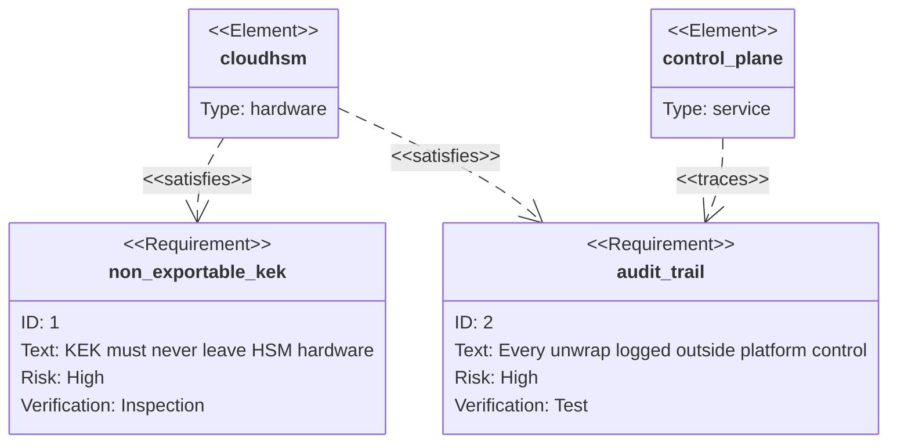
```mermaid
requirementDiagram
  requirement non_exportable_kek {
    id: 1
    text: "KEK must never leave HSM hardware"
    risk: high
    verifymethod: inspection
  }
  requirement audit_trail {
    id: 2
    text: "Every unwrap logged outside platform control"
    risk: high
    verifymethod: test
  }
  element cloudhsm {
    type: hardware
  }
  element control_plane {
    type: service
  }
  cloudhsm - satisfies -> non_exportable_kek
  cloudhsm - satisfies -> audit_trail
  control_plane - traces -> audit_trail
```

> Inherits from core variables. No diagram-specific theme keys.

---

<!-- _class: diagram -->

### 11 · GitGraph

## Branching, merging, tags.

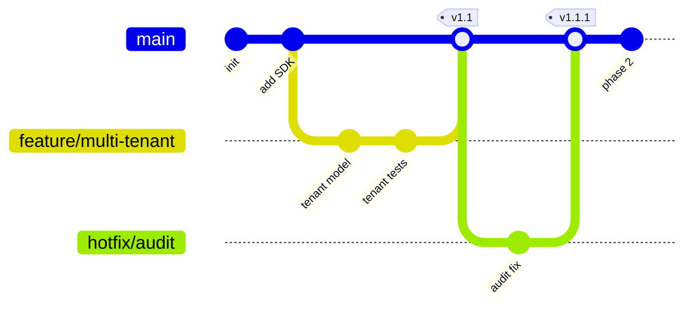
```mermaid
gitGraph
  commit id: "init"
  commit id: "add SDK"
  branch feature/multi-tenant
  checkout feature/multi-tenant
  commit id: "tenant model"
  commit id: "tenant tests"
  checkout main
  merge feature/multi-tenant tag: "v1.1"
  branch hotfix/audit
  commit id: "audit fix"
  checkout main
  merge hotfix/audit tag: "v1.1.1"
  commit id: "phase 2"
```

---

<!-- _class: diagram -->

### 12 · C4 Diagram

## Software architecture at four zoom levels.

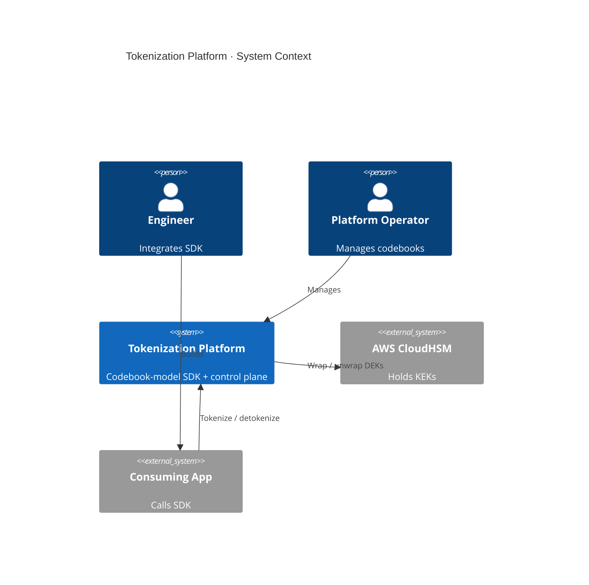
```mermaid
C4Context
  title Tokenization Platform · System Context
  Person(eng, "Engineer", "Integrates SDK")
  Person(ops, "Platform Operator", "Manages codebooks")
  System(platform, "Tokenization Platform", "Codebook-model SDK + control plane")
  System_Ext(hsm, "AWS CloudHSM", "Holds KEKs")
  System_Ext(app, "Consuming App", "Calls SDK")
  Rel(eng, app, "Builds")
  Rel(app, platform, "Tokenize / detokenize")
  Rel(ops, platform, "Manages")
  Rel(platform, hsm, "Wrap / unwrap DEKs")
```

> Marked 🦺⚠️ in the docs — supported but the team flags it as work-in-progress. Theme support partial.

---

<!-- _class: diagram -->

### 13 · Mindmap

## Hierarchical brainstorm.

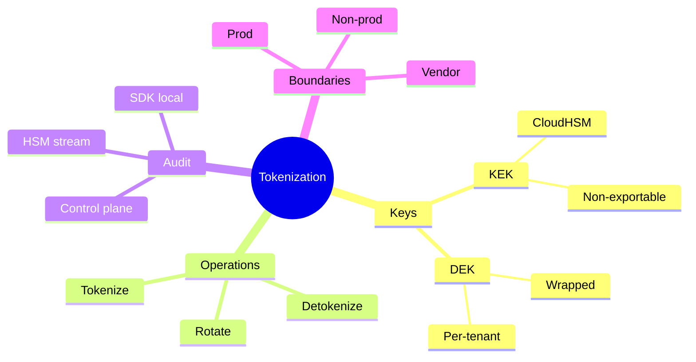
```mermaid
mindmap
  root((Tokenization))
    Keys
      KEK
        CloudHSM
        Non-exportable
      DEK
        Wrapped
        Per-tenant
    Operations
      Tokenize
      Detokenize
      Rotate
    Audit
      HSM stream
      Control plane
      SDK local
    Boundaries
      Prod
      Non-prod
      Vendor
```

> Inherits from core. Multiple shape syntaxes: `((round))`, `[square]`, `(rounded)`, `))cloud((`, `)hex(`.

---

<!-- _class: diagram -->

### 14 · Timeline

## Events on a horizontal axis.

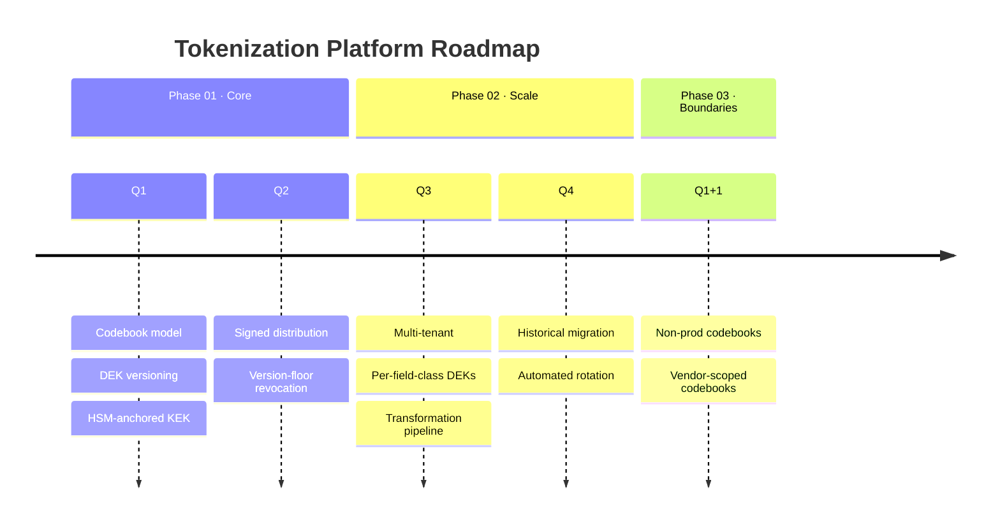
```mermaid
timeline
  title Tokenization Platform Roadmap
  section Phase 01 · Core
    Q1 : Codebook model
       : DEK versioning
       : HSM-anchored KEK
    Q2 : Signed distribution
       : Version-floor revocation
  section Phase 02 · Scale
    Q3 : Multi-tenant
       : Per-field-class DEKs
       : Transformation pipeline
    Q4 : Historical migration
       : Automated rotation
  section Phase 03 · Boundaries
    Q1+1 : Non-prod codebooks
         : Vendor-scoped codebooks
```

> Inherits from core. The section coloring uses the `cScale` palette.

---

<!-- _class: diagram -->

<!-- _class: content -->

### 15 · ZenUML

## A simpler sequence-diagram dialect.

ZenUML is a Mermaid diagram type that emits HTML+SVG with Tailwind CSS classes for styling. The Mermaid CLI can produce the markup, but it does not bundle the @zenuml/core stylesheet — so static SVG export renders the structure without the visual styling. ZenUML works in browser contexts where the Tailwind utilities resolve.

For static-PDF pipelines like this one, prefer the standard `sequenceDiagram` (slide 5) — same conceptual model, fully supported by the Mermaid CLI, themable through `themeVariables`.

```
zenuml
  title Order
  Customer->Order.create() {
    Order->Inventory.check() {
      return available
    }
    return confirmed
  }
```

> ZenUML uses HTML/Tailwind rendering rather than pure SVG. Use sequenceDiagram for static export contexts.

---

<!-- _class: divider -->
<!-- _paginate: false -->
<!-- _footer: '' -->

##### Group 02 · Experimental diagrams

# The eleven new types marked 🔥.

---

<!-- _class: diagram -->

### 16 · Sankey 🔥

## Flow volumes between nodes.

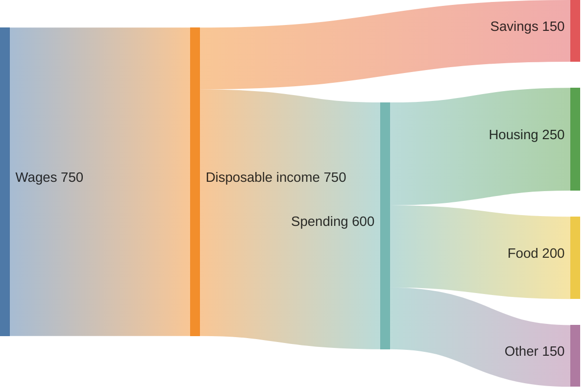
```mermaid
sankey-beta
Wages,Disposable income,750
Disposable income,Savings,150
Disposable income,Spending,600
Spending,Housing,250
Spending,Food,200
Spending,Other,150
```

> CSV-style input. Theme inheritance only — link colors are computed from node colors via the `linkColor` config.

---

<!-- _class: diagram -->

### 17 · XY Chart 🔥

## Bar and line chart on a numeric axis.

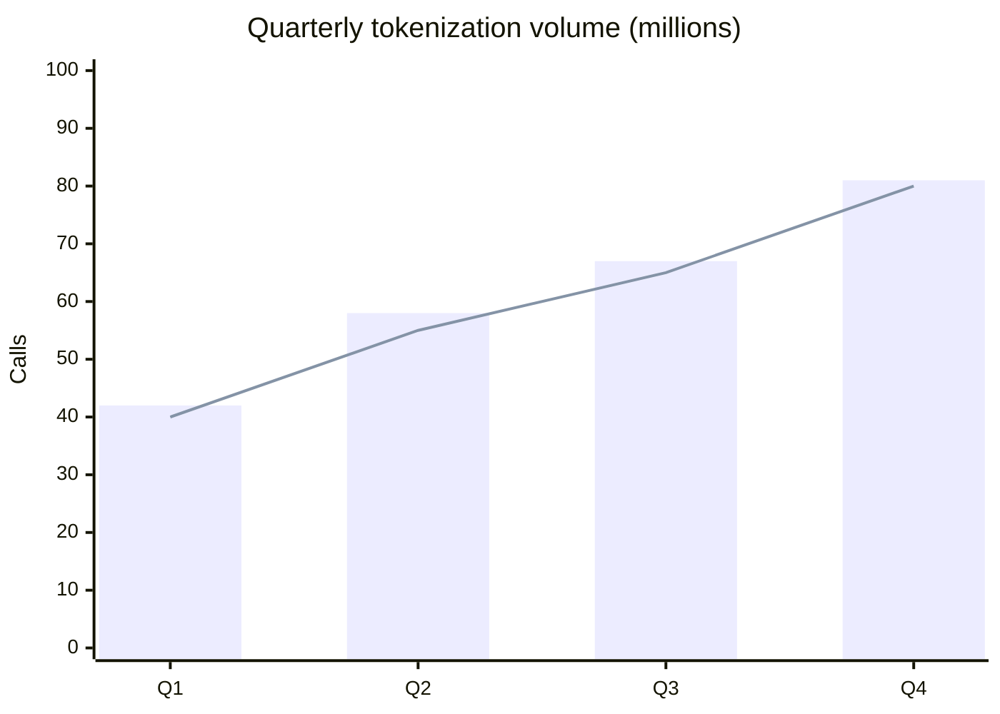
```mermaid
xychart-beta
    title "Quarterly tokenization volume (millions)"
    x-axis [Q1, Q2, Q3, Q4]
    y-axis "Calls" 0 --> 100
    bar [42, 58, 67, 81]
    line [40, 55, 65, 80]
```

> Inherits from core. The plot color palette can be overridden but per-series control is limited.

---

<!-- _class: diagram -->

### 18 · Block Diagram 🔥

## Tile layout for system blocks.

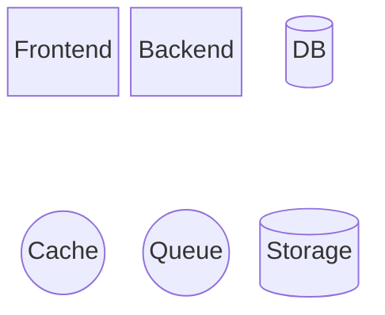
```mermaid
block-beta
  columns 3
  Frontend["Frontend"] Backend["Backend"] Database[("DB")]
  space:3
  Cache(("Cache")) Queue(("Queue")) Storage[("Storage")]
```

> Inherits from core. Spacing controlled by the `space:N` directive.

---

<!-- _class: diagram -->

### 19 · Packet 🔥

## Bit-level packet layout.

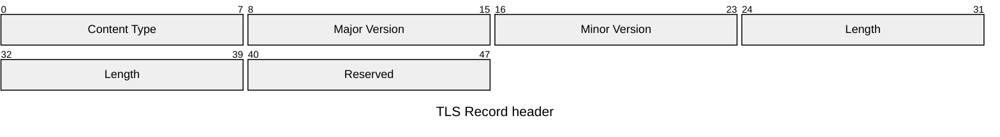
```mermaid
packet-beta
title TLS Record header
0-7: "Content Type"
8-15: "Major Version"
16-23: "Minor Version"
24-39: "Length"
40-47: "Reserved"
```

> Inherits from core. Width-fixed at 32 bits per row by default; `0-N` ranges define each field.

---

<!-- _class: diagram -->

### 20 · Kanban 🔥

## A board with swim-lane columns.

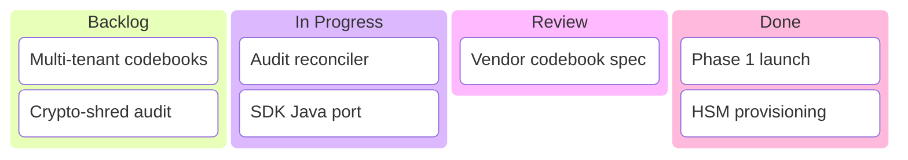
```mermaid
kanban
  Backlog
    [Multi-tenant codebooks]
    [Crypto-shred audit]
  In Progress
    [Audit reconciler]
    [SDK Java port]
  Review
    [Vendor codebook spec]
  Done
    [Phase 1 launch]
    [HSM provisioning]
```

> Inherits from core. Per-card `[Title]@{ assigned: ..., priority: ... }` metadata supported but optional.

---

<!-- _class: diagram -->

### 21 · Architecture 🔥

## Cloud-architecture style with services and groups.

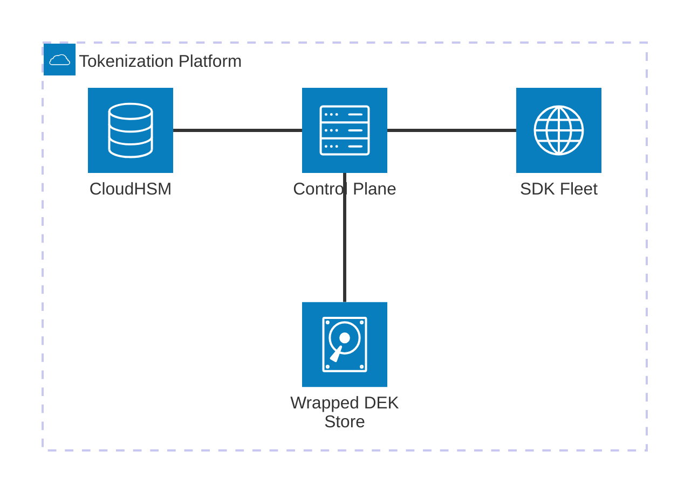
```mermaid
architecture-beta
  group platform(cloud)[Tokenization Platform]
  service hsm(database)[CloudHSM] in platform
  service cp(server)[Control Plane] in platform
  service sdk(internet)[SDK Fleet] in platform
  service store(disk)[Wrapped DEK Store] in platform
  hsm:R -- L:cp
  cp:R -- L:sdk
  cp:B -- T:store
```

> Inherits from core. Icons drawn from a registered set; default set is limited — register more via `mermaid.registerIconPacks`.

---

<!-- _class: diagram -->

### 22 · Radar 🔥

## Multi-axis polar chart.

```mermaid
radar-beta
  title Architecture review · scoring
  axis Speed, Resilience, Auditability, Cost, Simplicity
  curve Codebook["Codebook model"]{85, 90, 95, 70, 60}
  curve Vault["Vault-only"]{60, 70, 80, 50, 80}
```

> Inherits from core. Multiple `curve` lines plot on the same axes.

---

<!-- _class: diagram -->

### 23 · Treemap 🔥

## Nested rectangles sized by value.

```mermaid
treemap-beta
"Tokenization Platform"
  "SDK"
    "Java": 4200
    "Python": 1800
    "Go": 800
  "Control Plane"
    "API": 2400
    "Signing": 1200
    "Audit": 900
  "Wrapped DEK Store"
    "Postgres": 600
    "Backup": 200
```

> Inherits from core. Sized values cascade from leaves up; intermediate nodes don't take a value.

---

<!-- _class: diagram -->

### 24 · Venn 🔥

## Set overlap.

```mermaid
venn-beta
  set A["Prod"]
  set B["Non-prod"]
  set V["Vendor"]
  union A, B["shared schemas"]
  union B, V["vendor pilot"]
```

> Inherits from core. `union A, B` for two-set overlap; `set X["Label"]` to give a display name distinct from the identifier; `union A, B["..."]` to label an intersection region.

---

<!-- _class: diagram -->

### 25 · Ishikawa 🔥

## Fishbone cause-and-effect.

```mermaid
ishikawa-beta
fishbone
    Effect: "Audit reconciliation drift"
    People:
        Skill gap on crypto
        On-call rotation thin
    Process:
        Manual rotation
        No drill cadence
    Tooling:
        Log schema versioning
        SIEM coverage gaps
    Environment:
        Multi-region replication
```

> Inherits from core. Branches default to four (people, process, tooling, environment) but any heading is allowed.

---

<!-- _class: diagram -->

### 26 · TreeView 🔥

## Indented file-tree style hierarchy.

```mermaid
treeView-beta
    "src/"
        "main.js"
        "lib/"
            "tokenize.js"
            "verify.js"
    "package.json"
```

> Three named theme variables: `labelFontSize`, `labelColor`, `lineColor`. Indentation alone determines the tree.

---

<!-- _class: closing -->
<!-- _paginate: false -->
<!-- _footer: '' -->
<!-- _header: '' -->

##### Mermaid 11.14 · Lattice Theme

## Twenty-six diagrams, one theme.

*Stable diagrams have rich theme control. Experimental diagrams marked 🔥 inherit from the core six variables and may evolve in syntax. Use this gallery as a reference for which diagram fits a given problem.*


<!-- Import Mermaid and the Lattice runtime theme for VS Code / web preview.
     The build script (lattice.js) pre-renders Mermaid to SVG at build time
     so these scripts are a no-op in the PDF/HTML output. -->
<script src="../node_modules/mermaid/dist/mermaid.min.js"></script>
<script src="../lattice-runtime.js"></script>
