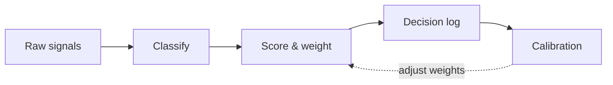

<!-- _class: title -->

`Lattice · Portrait layouts`

# Even the dense slides go vertical.

KPIs, comparisons and split panels reflow to the taller frame — no rebuild, just `size:`.

---

<!-- _class: kpi -->

`Financial · Q4`

## Ahead of plan on every line.

1. $2.4B
   - Total revenue
   - +9% vs target `On plan` `Board`
2. 42%
   - Gross margin
   - +2pp QoQ `On plan`
3. $1.1B
   - Cash
   - +$180M QoQ `On plan`

---

<!-- _class: verdict-grid -->

## Four tools, one clear winner.

- Chorus
  - [x] Speed
  - [ ] Auditability
  - Strong recording; no decision log.
- Sprig + Log
  - [x] Speed
  - [x] Auditability
  - Meets every criterion. Recommended.

---

<!-- _class: split-compare -->

`Decision`

## Build or buy the data layer?

The difference is where the next 18 months go.

- Build in-house
  - Full control of schema
  - 2–3 engineer-quarters
- Buy + configure
  - Ship in 6 weeks
  - Engineering goes to product

> Buy the infrastructure. Build the differentiation.

---

<!-- _class: diagram -->

## A flow that reads top-to-bottom on a phone.

---

<!-- _class: closing -->

`Ship it`

## Boardroom rigor, feed-native shape.

`One source. Every aspect ratio.`
