<!-- _class: title silent spectrum -->

# How to Think About Systems

`A tutorial for new engineers`

We start with one engineer's Tuesday, and we finish by designing Instagram.

---

<!-- _class: agenda -->

## Where this goes.

1. A Tuesday — one engineer, wake to sleep
2. The words — naming what you just watched
3. Protagonist and antagonist — where a design starts
4. Solution types — which answer is wanted
5. Six kits — data, compute, network, scale, reliability, security
6. Instagram — the graph, the design, and the worksheet you keep

---

<!-- _class: divider -->

`Part zero`

## Before anything is a system, it is a Tuesday.

---

<!-- _class: content -->

`The rules of this part`

## Maya has been an engineer for seven months. Today she wants one thing.

She wants pull request 482 merged before the release window closes at four o'clock.

Watch her Tuesday. This part uses no technical words on purpose. Everything Part one names happens here first, so you see each idea before you have a word for it.

---

<!-- _class: timeline-list -->

`Morning`

## Five things happen to Maya before she reaches her desk.

1. `06:55` The shower
   - The water runs too hot. Maya turns it down and it runs too cold. She corrects it twice more.
2. `08:05` The train map
   - The map shows wrong distances and wrong shapes. Maya has never got lost using it.
3. `08:20` A signal failure
   - A signal fails and the train sits nine minutes. Nobody aboard can change it. Maya opens Instagram.
4. `08:50` At her desk
   - Maya uses the wifi, the VPN and the package registry. She thinks about none of them.
5. `09:05` The registry goes down
   - Three teams cannot build. Maya thinks about the registry now.

---

<!-- _class: content -->

`09:15 · standup`

## Four people met twice this week, and only one meeting worked.

On Monday each person reported to the manager in turn. That meeting ran twenty minutes and settled nothing. Today they talked to each other instead, and Maya learned in one sentence that Priya had already read the code she was about to start.

The four people did not change. Only who talked to whom changed.

---

<!-- _class: quote bare -->

> Get 482 merged before the window closes.

*Maya wrote this on a sticky note at 09:30. Nothing else is written on it.*

---

<!-- _class: cards-grid four -->

`09:45 · in the way`

## Four limits shape Maya's day, and she chose none of them.

- The build takes twelve minutes
  - Every push costs twelve minutes. Maya cannot shorten that or skip it.
- The team is three people
  - Nobody on the team is free to review her code this morning.
- The one reviewer is asleep
  - He is six time zones away and will not read anything before three o'clock.
- Production data stays in production
  - She may not copy it to her laptop, even to reproduce the bug.

---

<!-- _class: timeline-list -->

`Midday`

## By lunchtime, other people decide what Maya works on.

1. `10:15` A favor
   - Another team asks Maya to fix a flaky test in their repository. She says no.
2. `10:40` A page
   - The checkout service is failing. Maya does not own it, and she is second on call.
3. `11:00` The loop
   - Maya pushes, waits twelve minutes, finds her own mistake and pushes again. She does this twice.
4. `12:30` A branch left behind
   - Her second attempt sits half-finished on a branch, and she forgets it.
5. `13:30` The queue
   - Five pull requests are waiting for one reviewer, and he is asleep.

---

<!-- _class: timeline-list -->

`Afternoon`

## Maya spends the afternoon answering questions about the work she is not doing.

1. `15:30` The spiral
   - Nobody has reviewed 482. Someone asks for a status update, so Maya stops work to answer.
2. `15:50` She stops answering
   - Maya turns down the fourth request and saves every reply until four o'clock.
3. `16:00` The window closes
   - The reviewer wakes at three. One hour is not enough, and 482 does not merge.
4. `16:30` One thing held
   - The main branch stayed ready to deploy every minute of the day.
5. `17:00` A small realization
   - Maya checks the history. Nothing merges on Thursdays either, and nobody planned that.

---

<!-- _class: content -->

`22:40 · the reveal`

## You just watched a system run for sixteen hours.

It had a goal it did not meet, and one hour that decided whether it would. Two things fed themselves in circles, one of them in her shower. Something invisible held the whole thing up until nine o'clock, when it stopped. One promise never broke, on the day everything else did.

The reviewer woke at three and the window shut at four. Everything Maya did in the sixteen hours around that hour reached the outcome only through it — and for twenty of those sixty minutes she was answering questions about 482 instead of standing ready to act on whatever came back about it.

You have watched all ten. You do not yet have the words.

---

<!-- _class: divider numbered -->

`Part one`

## Now we give each of those things its name.

---

<!-- _class: split-panel proof cat-1 -->
<!-- _header: "" -->

`Word one · system`

## A system is parts, connected, doing something together.

Maya's morning is one. The shower, the train, the laptop and the registry between them do what none of them does alone: put Maya at a desk, able to work, at nine.

- In Maya's day
  - Nothing on that list is a system. The order she does them in is.
- Listing the parts is easy
  - Shower, train, laptop, registry. Anyone can write that list.
- The connections are the system
  - Change what depends on what, and the behavior changes with the same parts.

---

<!-- _class: diagram -->

`09:15 · the same four people`

## Rewire a system without changing a single part, and it behaves differently.

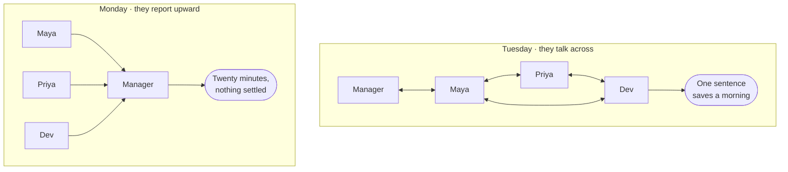

---

<!-- _class: split-panel proof cat-2 -->
<!-- _header: "" -->

`Word two · purpose`

## A purpose becomes visible at the moment you miss it.

Maya wrote it on a sticky note at half past nine: get 482 merged before four. At four o'clock it had not merged, and the gap between those two facts is the clearest thing in her whole day.

- In Maya's day
  - She wrote hers down at 09:30, which is why she could tell at 16:00 that she had missed it.
- Write it down or you will drift
  - An unwritten purpose gets quietly replaced by whatever arrived most recently.
- A system's purpose is what it does
  - Not what its owners say it does. Watch the outputs, not the mission statement.

---

<!-- _class: split-panel proof cat-3 -->
<!-- _header: "" -->

`Word three · boundary`

## The boundary is the line between what you change and what you ask for.

At quarter past ten another team asked Maya to fix a flaky test in their repository. She said no. That refusal is the boundary, and she could feel exactly where it was because saying no was uncomfortable.

- In Maya's day
  - She could decline the favor. She could not decline the release window.
- Inside is what you change
  - Your code, your schema, your deploys, the alerts that wake you.
- Outside is what you negotiate
  - The reviewer's time zone, the registry, the build, another team's repository.

---

<!-- _class: split-panel proof cat-4 -->
<!-- _header: "" -->

`Word four · environment`

## The environment is everything that arrives without asking.

A signal failure held her train for nine minutes. A page pulled her into an outage in a service she does not own. Neither was load, neither was a bug, and neither was hers.

- In Maya's day
  - She had no say over either. She did have a say over what happened to 482 while she was gone, and had not decided it in advance.
- It is not the same as load
  - Regulation, a partner's outage and a colleague's holiday are environment too.
- You design for it, not against it
  - You cannot stop the page. You can decide what happens to 482 when it comes.

---

<!-- _class: split-panel proof cat-5 -->
<!-- _header: "" -->

`Word five · process`

## A process is a repeatable transformation, and it runs at a rate.

Push, wait twelve minutes for the build, read a comment, fix, push again. Maya ran that loop twice. Every process has inputs, a transformation, outputs, a rate, and something it leaves behind.

- In Maya's day
  - Twenty-four minutes of her day were spent waiting for a machine, and she chose none of them.
- The rate is part of the definition
  - "Run the tests" is not a process until you say twelve minutes, and how often.
- Leftover state is where bugs live
  - Her abandoned branch is the same shape as a half-applied database migration.

---

<!-- _class: diagram -->

`11:00 · the loop, drawn`

## Every process leaves something behind, and that is the part nobody draws.

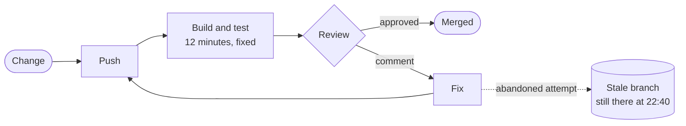

---

<!-- _class: split-panel proof cat-6 -->
<!-- _header: "" -->

`Word six · model`

## A model is a deliberate simplification, and it is useful because it is wrong.

The transit map Maya read at five past eight is geographically false. Distances are invented, angles are fiction, the river is the wrong shape. She has never once been lost using it.

- In Maya's day
  - Her plan for Tuesday was a model too, and it left out a six-hour time difference.
- It keeps what answers one question
  - "Which line, which direction, how many stops." It throws away everything else.
- Name what you left out
  - An omission you cannot state is not a simplification. It is a bug you have not found.

---

<!-- _class: split-panel proof cat-7 -->
<!-- _header: "" -->

`Word seven · constraint`

## A constraint is a limit that removes options rather than adding caveats.

Four of them bounded Maya's day, and each one came from a different place: a build that takes twelve minutes, a team of three, a sleeping reviewer, and a rule about production data.

- In Maya's day
  - Physical, economic, human and legal limits, all four of them landing before ten in the morning.
- Real constraints carry numbers
  - "The build is slow" is a complaint. "Twelve minutes" is something you can design against.
- Some you chose, and can revisit
  - A team of three is a decision. The speed of the build is arithmetic.

---

<!-- _class: split-panel proof cat-8 -->
<!-- _header: "" -->

`Word eight · invariant`

## An invariant is a claim that stays true on the day everything else fails.

Main was deployable every minute of Maya's Tuesday. It was true while the registry was down, while she was paged, and at four o'clock when 482 did not land.

- In Maya's day
  - She missed her goal and broke no invariant, and those are two different kinds of bad day.
- Write them as sentences
  - "Main is always deployable." "A balance is never negative." Then name the alert.
- They constrain other people
  - A real invariant changes what your teammates are allowed to merge.

---

<!-- _class: diagram -->

`06:55 and 15:30 · two loops`

## Two loops look identical until you find the sign.

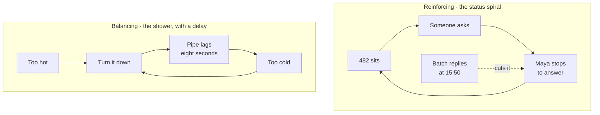

*A balancing loop pushes back toward a target, and the eight-second delay in the pipe is exactly why she overshoots. A reinforcing loop pushes harder in the direction it is already going.*

---

<!-- _class: split-panel capstone cat-1 -->
<!-- _header: "" -->

`Word nine · infrastructure`

## Infrastructure is what you only notice on the day it stops.

Wifi, the VPN, the package registry, the build fleet, the identity provider. Maya used every one of them before nine o'clock and thought about none of them until 09:05, when the registry went down and three teams stopped.

- The test
  - If it vanishing stops several unrelated things at once, it is infrastructure.
- Boring is the requirement
  - It earns its place by being predictable, never by being interesting.
- It is someone else's system
  - Your infrastructure is another team's product, with its own boundary and invariants.

---

<!-- _class: content -->

`17:00 · the last word`

## Emergence is a pattern the parts fall into, that none of them contains.

Nothing merges on Thursdays. Maya checked six weeks. It is a rhythm, and nobody built a rhythm.

Four things feed each other rather than add up. Work that misses the window waits at the front of tomorrow. A review that comes back with comments sends the same change to the back of the queue. The queue is served one hour a day. And nobody ships into a weekend, so Thursday is the last window of the week — the day the backlog is deepest and the day it has to clear.

No policy names Thursday. You find it by watching the queue for six weeks.

---

<!-- _class: premise -->

## Five words describe the thing itself.

You did not learn these from a definition. You watched each one happen first, which is the order that sticks.

1. System
   - Parts, connected, with a purpose.
   - The whole morning.
2. Purpose
   - What it does, not what it says.
   - The gap at four o'clock.
3. Boundary
   - What you change, not ask for.
   - The favor she declined.
4. Environment
   - What arrives uninvited.
   - The page.
5. Process
   - A transformation with a rate.
   - Push, build, review.

---

<!-- _class: premise -->

## Three more are the tools you think with.

You never handle the system itself. You handle a drawing of it, its limits and its promises — standing on infrastructure you notice only when it stops.

1. Model
   - A simplification you chose.
   - The transit map.
2. Constraint
   - A limit that removes options.
   - Twelve minutes.
3. Invariant
   - What must never go false.
   - Main is deployable.

---

<!-- _class: compare-table -->

`The translation`

## Every move in Maya's day has a name in software.

| In her Tuesday | In a system | What it decides |
| --- | --- | --- |
| Five pull requests, one reviewer | The bottleneck | Where any improvement has to land |
| Declining the fourth status ask | Admission control | Whether load sheds or the system collapses |
| A twelve-minute build | A fixed cost per attempt | How many attempts a day can hold |
| The abandoned branch | Leftover state | What a retry finds when it arrives |
| Nothing merges on Thursdays | Emergence | What no single owner can fix |

---

<!-- _class: divider numbered -->

`Part two`

## Every design starts with someone who wants something, and something in the way.

---

<!-- _class: content -->

`The frame`

## Name the person and the force, and everything downstream has an answer.

Juniors skip both, almost every time. They write "users" instead of one person with one goal, and they write "scale" instead of a force with a number on it. Neither produces a single design decision.

The protagonist is who the system is for. The antagonist is what makes serving them hard. Everything downstream — the purpose, the boundary, the invariants, the first move — falls out of that pair.

---

<!-- _class: code -->

`The drill`

## Two sentences, ninety seconds, and four things you no longer have to guess.

```text
Protagonist:  <name> wants to <do X> so that <Y>.
Antagonist:   But <W> — and W is <a number>.

  Purpose       one sentence: what counts as this working
  Boundary      what is mine when W happens, and what I only ask for
  Invariant     what must stay true or <name> stops trusting this
  First move    what W does to the cheapest design that could work
```

*Run it on a turnstile, then a cash machine, then the thing on your screen right now. It gets fast.*

---

<!-- _class: compare-prose -->

`The drill, on Tuesday`

## Maya is the protagonist of her own day, and the interruptions are the antagonist.

- Maya wants 482 merged before four o'clock
  - So that a bug affecting real users stops affecting them, and so she is not carrying it into next week.
- But she is interrupted about half a dozen times
  - Not once by anything unreasonable. A page, a favor, four status requests. Each costs the reload, not just the minute.

---

<!-- _class: content -->

`The trap`

## Most systems have several protagonists, and you must say which one loses.

Instagram has at least four: the reader opening the app, the ordinary poster, the celebrity with five hundred million followers, and the engineer carrying the pager. They want incompatible things.

Naming one as the protagonist is not a slogan, it is a decision about who waits. Say who you are not designing for, out loud, and most of the arguments later in the design turn out to be about that.

---

<!-- _class: compare-table -->

`The join`

## The antagonist chooses which kind of solution you are allowed to build.

| The antagonist is… | You are building | Because |
| --- | --- | --- |
| Nobody knows if they exist | An MVP | The risk is demand, not load |
| Growth — the protagonist multiplies | A scaled system | The limit is real and namable |
| Cost on a path you have profiled | An optimized system | The measurement came first |
| Physics — you are near a real bound | An optimal system | Only here is a proof worth it |
| A person who wants in | Security work, at any rung | It is not a rung, it is a floor |

---

<!-- _class: split-panel proof cat-2 -->
<!-- _header: "" -->

`Instagram · the casting`

## Our protagonist reads on a phone and gives us about a second.

She opens the app a dozen times a day, on a cellular network, usually while doing something else. She wants photographs from the people she chose, recent, ranked, and hers. The poster is a supporting character: he tolerates a spinner, and every time the design has a choice, work goes onto his side.

- The reader's demand
  - A fresh, personal page in under a second, twelve times a day, from anywhere.
- The poster can wait
  - Uploading, transcoding and delivery may all take their time. Nobody is watching.
- Casting decides the design
  - It is why the feed is built when someone posts, not when someone reads.

---

<!-- _class: split-panel capstone cat-3 -->
<!-- _header: "" -->

`Instagram · the antagonist`

## The antagonist is not scale. It is the shape of the follow graph.

Scale is a quantity, and quantities have a price you can pay. The thing you cannot buy your way out of is a distribution. Follower counts are heavy-tailed, so the average is a lie and the far tail sits six orders of magnitude from the middle.

- The number that matters
  - The median account has about 150 followers. The largest has five hundred million.
- One algorithm cannot serve both
  - Nothing else in this design spans six orders of magnitude. That is why there are two paths.
- Hold on to this
  - Every hard decision in Part five is this one fact again.

---

<!-- _class: divider numbered -->

`Part three`

## "Design Instagram" is five different questions.

---

<!-- _class: content -->

`Before the boxes`

## Before you design anything, say which kind of answer is wanted.

The same words — design a photo sharing app — have five legitimate answers that share almost no architecture. A build that takes a week and a build that takes two years are both correct, for different questions.

Gall's law says it plainly: a complex system that works is invariably found to have evolved from a simple system that worked. You climb this ladder. You do not parachute onto it.

---

<!-- _class: premise -->

## Each rung costs more and commits harder than the one below it.

You move up when the rung you are standing on stops paying, and you move up one rung at a time.

1. MVP
   - Buys information fast.
   - Does anyone want this?
2. Scaled
   - Holds up as load grows.
   - Will it survive success?
3. Optimized
   - Cuts cost on a known path.
   - Where is the money going?
4. Optimal
   - Provably best, for one model.
   - What is the real limit?
5. Specialized
   - An advantage nobody can copy.
   - What can only we do?

---

<!-- _class: split-panel proof cat-4 -->
<!-- _header: "" -->

`Rung one · MVP`

## An MVP is an experiment wearing a product's clothes.

Its job is to produce a decision, not to last. Every hour spent making it durable is an hour spent on a system you may correctly delete next month.

- The tell
  - The riskiest thing is whether anyone wants it, and being wrong is cheap.
- Buy simplicity, not capacity
  - One database, one service, one region, boring technology, nothing clever anywhere.
- Name the exit in advance
  - Write down the number that means "stop, this now has to be built properly."

---

<!-- _class: split-panel proof cat-5 -->
<!-- _header: "" -->

`Rung two · scaled`

## A scaled system survives ten times the load without a rewrite.

You have stopped buying information and started buying headroom. The question moves from "does it work" to "what breaks first, and how do I move that limit."

- The tell
  - Growth is real, and the current design has a ceiling you can point at.
- A bigger box first, then the four moves
  - Vertical scaling is not one of the four; it is what buys time before you need them, and it is reversible. Then reduce, duplicate, defer — and spread last, because partitioning is the one you cannot undo cheaply.
- Cost per unit starts counting
  - Cost per request stops being noise and becomes the second constraint on every choice.

---

<!-- _class: split-panel proof cat-6 -->
<!-- _header: "" -->

`Rung three · optimized`

## Optimizing means moving one measured number on one hot path.

Optimization without a profile is decoration. You need the measurement first, the target second, and a willingness to accept the complexity you are about to add.

- The tell
  - A profile shows which tenth of the work is most of the cost.
- Premature is half the quote
  - Knuth also wrote that we should not pass up the critical three percent. Both halves.
- Complexity is the invoice
  - Each optimization narrows the assumptions the system is allowed to break.

---

<!-- _class: split-panel proof cat-7 -->
<!-- _header: "" -->

`Rung four · optimal`

## Optimal means provably best against an objective you wrote down.

Rarer than it sounds. It needs a stated objective, a stated model, and a proof or a bound — and it is optimal only for the assumptions you fixed in place.

- The tell
  - The objective is a function and the constraints are inequalities, on paper.
- The proof is against a model
  - Change the assumptions and the optimal answer changes underneath you.
- It ages badly
  - An optimal design pinned to last year's hardware is a legacy system with a certificate.

---

<!-- _class: split-panel capstone cat-8 -->
<!-- _header: "" -->

`Rung five · specialized`

## A specialized system trades generality for something nobody can copy.

Custom silicon, a purpose-built storage engine, a scheduler that knows your physics. You give up flexibility, portability and hiring pool for a capability the market cannot sell you.

- The signal
  - The advantage is durable, measurable, and central to why customers choose you.
- The cost never ends
  - You now maintain what everyone else gets free from a vendor, forever.
- Almost nobody is here
  - Most teams reaching for this rung needed the optimized one and got excited.

---

<!-- _class: decision -->

`The rule`

## Climb one rung at a time, and only on evidence.

- Move up when the current rung fails on a measurement
  - A number, a profile, a named risk. Not a feeling that things are getting big.
- Move up exactly one rung
  - Jumping from MVP to optimal buys rigor for assumptions nobody has tested yet.
- Move back down when the evidence changes
  - A rewrite that simplifies is a legitimate move, not an admission of anything.

---

<!-- _class: divider numbered -->

`Part four`

## Every kit entry answers the same three questions, in the same order.

---

<!-- _class: content -->

`How to read a kit`

## Reach for it when, walk away when, and the constraint you inherit.

One shape for every entry, so you can hold two options side by side without re-reading a manual. Each kit opens with a diagram of the patterns it covers, and closes with the invariants that hold across all of them.

The entries name concepts, not products. Products turn over every few years. The constraint that an append-only store puts on your reads does not.

---

<!-- _class: divider -->

`Data`

## Every storage choice is a bet about how you will read it later.

---

<!-- _class: diagram -->

`Data kit · the patterns`

## Four shapes cover almost everything you will store.

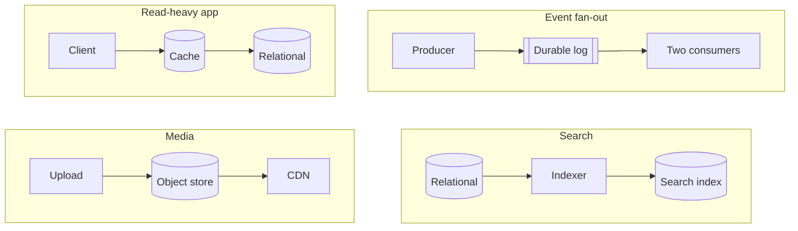

---

<!-- _class: premise -->

## The product name is the last thing you decide about a store.

Answer these before anyone says a brand. Most database arguments are really a disagreement about question two.

1. Shape
   - How the data is structured.
   - Rows, documents, or edges?
2. Access
   - How it is read and written.
   - Lookups, ranges, or scans?
3. Consistency
   - What a reader may see.
   - Must it be the latest?
4. Scale
   - Size, throughput, growth.
   - Does it fit one machine?
5. Cost
   - Money, operations, skill.
   - Who runs it at 3am?

---

<!-- _class: diagram -->

`Data kit · the decision`

## Start at relational and branch out. That is how the decision actually gets made.

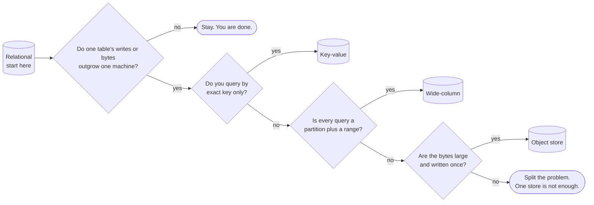

---

<!-- _class: cards-stack -->

`Data kit · relational`

## A relational store is the default until you can name why it is not.

- Reach for it when
  - Entities relate, writes touch several at once, and the questions will keep changing.
- Walk away when
  - One table outgrows one machine's writes, or the schema genuinely differs per row.
- The constraint you inherit
  - Joins and transactions need a coordinator. Self-sharding loses both; a distributed engine charges a round trip.

---

<!-- _class: cards-stack -->

`Data kit · key-value`

## A key-value store is a hash map with an operations team.

- Reach for it when
  - You always know the exact key, and handing the value back is the store's only job.
- Walk away when
  - You need to ask any question at all about what is inside the value.
- The constraint you inherit
  - There is no second way in. Every new query means a new key you write and maintain yourself.

---

<!-- _class: cards-stack -->

`Data kit · document`

## Choosing a document store means choosing to keep one object whole.

- Reach for it when
  - A read fetches one self-contained object, and the shape varies between records.
- Walk away when
  - The same fact lives in many documents and has to stay consistent across them.
- The constraint you inherit
  - Denormalized copies. Every update to a shared fact becomes a fan-out — one write you now owe to many places.

---

<!-- _class: compare-table -->

`Data kit · the scan`

## Five columns, applied to the five stores you reach for first.

| Store | Access | Consistency | Scales by | Weak at |
| --- | --- | --- | --- | --- |
| Relational | Key, range, join | Strong on the leader | Replicas, then partitioning | Cross-shard writes |
| Key-value | Exact key | Engine-specific | Horizontal | Rich queries |
| Document | Key, secondary index | Engine-specific | Horizontal | Facts split across documents |
| Wide-column | Partition plus range | Tunable | Horizontal | New query patterns |
| Graph | Traversal | Engine-specific | Horizontal, with effort | Cutting the graph across machines |

---

<!-- _class: cards-stack -->

`Data kit · wide-column`

## A wide-column store buys enormous write throughput and freezes your queries.

- Reach for it when
  - Writes are relentless, and every read is a partition key plus a sorted range.
- Walk away when
  - Query patterns are still moving, or you need a transaction across partitions.
- The constraint you inherit
  - The primary key is the schema. Changing how you query means rewriting the data.

---

<!-- _class: cards-stack -->

`Data kit · graph`

## A graph store is for questions that traverse, not questions that filter.

- Reach for it when
  - The query walks relationships of unknown depth: reachability, paths, recommendations.
- Walk away when
  - You have relationships but only ever join two hops. A relational store does that faster.
- The constraint you inherit
  - Traversals resist partitioning, so scaling out is genuinely harder here than anywhere else.

---

<!-- _class: content -->

`Halfway`

## Two stores you filed as derived are holding truth.

An object store and a time-series store are usually where a fact first lands — nothing regenerates a photograph or last Tuesday's CPU samples. They are sources of truth wearing the clothes of a derived tier.

The genuinely derived stores are the search index, the vector index, the cache and the warehouse. Anything derived must be rebuildable, must be allowed to lag, and must never be the only copy.

---

<!-- _class: cards-stack -->

`Data kit · object store`

## An object store is the cheapest home for a write-once file.

- Reach for it when
  - Items are large, written once, fetched by key, and must survive for a decade.
- Walk away when
  - You need to modify part of an object, or to list and filter by what is inside it.
- The constraint you inherit
  - Listing is slow and expensive. The index of what you stored belongs somewhere else.

---

<!-- _class: cards-stack -->

`Data kit · cache`

## A cache converts a correctness problem into a timing problem.

- Reach for it when
  - Reads repeat, the source is expensive, and slightly stale is genuinely acceptable.
- Walk away when
  - Staleness is unsafe, or the working set is larger than the cache will ever be.
- The constraint you inherit
  - Invalidation. You now own a second copy whose wrongness is measured in seconds.

---

<!-- _class: cards-stack -->

`Data kit · durable log`

## A durable log turns "do it now" into "do it reliably, soon."

- Reach for it when
  - Producers outpace consumers, or several systems need to see the same events.
- Walk away when
  - The caller needs the result inside the same request.
- The constraint you inherit
  - At-least-once delivery. Every consumer must be idempotent or you will charge somebody twice.

---

<!-- _class: diagram -->

`Data kit · under a partition`

## CAP prices a partition. Consistency charges you the rest of the time.

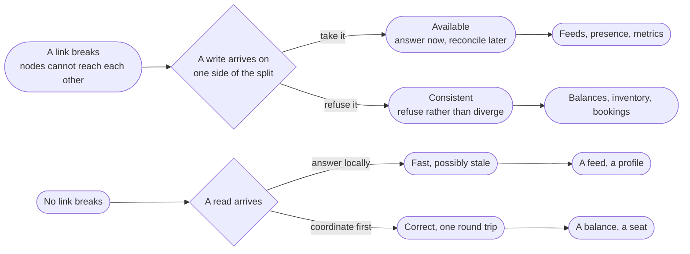

---

<!-- _class: list-tabular -->

`Data kit · consistency`

## Three rungs cover almost every argument you will have about consistency.

1. Linearizable
   - Every read sees the latest write. Costs a coordination round trip, every time.
2. Read your writes
   - You always see your own edits. The least a person who just typed something accepts.
3. Eventual
   - Replicas agree in the end. Cheapest, and correct for feeds, counters and presence.

---

<!-- _class: compare-prose axis -->

`Data kit · two philosophies`

## ACID and BASE answer different questions.

Ask whether coordinating now costs less than reconciling later.

1. ACID
   - Coordinate first, so the data is never observably wrong. You pay in latency and in how far you can partition.
2. BASE
   - Diverge now, converge later. You pay in application code, because every reader must tolerate stale state.

---

<!-- _class: split-panel proof cat-1 -->
<!-- _header: "" -->

`Data kit · indexes`

## An index is a second copy of your data, sorted for exactly one question.

Indexes make reads fast by making writes slower and storage larger. Each one is a promise to maintain a sorted structure on every single insert, update and delete, forever.

- The tell
  - You can name the exact query each index exists to serve, out loud, right now.
- The bill arrives on writes
  - Five indexes mean five extra structures touched per insert, not one.
- Selectivity, not cardinality
  - Three evenly spread values get ignored. Three where one appears in 0.1 percent do not.

---

<!-- _class: diagram -->

`Data kit · partitioning`

## Sharding buys throughput by giving up the questions that cross shards.

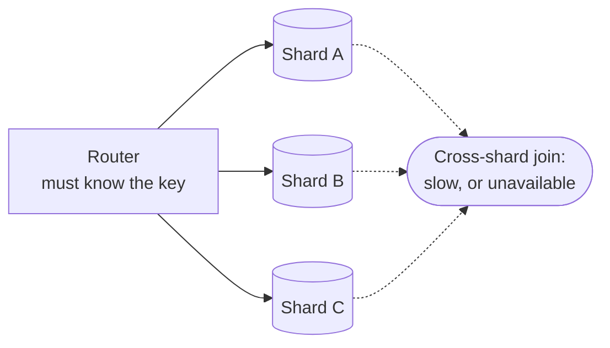

---

<!-- _class: cards-grid three -->

`Data kit · the shard key`

## The shard key is the decision you cannot undo cheaply.

- By hash of the key
  - Spreads load evenly and destroys range queries. The safe default.
- By range
  - Keeps ranges fast and invites a hot spot on the newest range.
- By tenant or region
  - Matches both the access pattern and the law, until one tenant grows enormous.

> Name the query that will now cross shards. If you cannot, you have not chosen a key — you have chosen a hash.

---

<!-- _class: list-criteria -->

`Data kit · the invariants`

## Four sentences should hold in any data design. Which does yours break?

1. Exactly one source of truth per fact
   - Every other copy is derived, and is labeled as derived where people can see it.
2. Every derived store can be rebuilt
   - If the search index burns down, a job restores it from the source, unattended.
3. Every consumer of a queue is idempotent
   - At-least-once delivery is the only delivery anyone actually gets.
4. Every write path states its consistency level
   - "Whatever the database does by default" is not a stated level.

---

<!-- _class: divider -->

`Compute`

## Choosing compute is choosing how much of the machine you still own.

---

<!-- _class: diagram -->

`Compute kit · the patterns`

## Each of these hands the machine to somebody else.

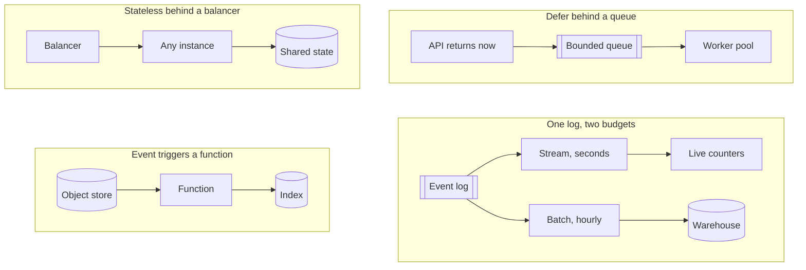

---

<!-- _class: cards-stack -->

`Compute kit · virtual machines`

## A virtual machine is what you reach for when the process outlives the request.

- Reach for it when
  - The workload runs continuously, holds state in memory, or needs unusual kernel settings.
- Walk away when
  - Traffic is spiky and idle machines start to dominate the bill.
- The constraint you inherit
  - Patching, capacity planning, and the gap between staging and production are now yours.

---

<!-- _class: cards-stack -->

`Compute kit · containers`

## A container makes the deployable unit identical everywhere it runs.

- Reach for it when
  - You run many services, deploy often, and want one packaging story across all of them.
- Walk away when
  - You run one small service. An orchestrator costs more than it saves at that size.
- The constraint you inherit
  - The orchestrator is now infrastructure, with its own failure modes and its own pager.

---

<!-- _class: cards-stack -->

`Compute kit · functions`

## A function is compute you rent by the millisecond, so idle costs you nothing.

- Reach for it when
  - Traffic is spiky or rare, the work is short, and per-request isolation is welcome.
- Walk away when
  - Runs are long, or steady traffic makes per-request pricing dearer than a machine.
- The constraint you inherit
  - Cold starts, unless you pay to keep instances warm — which is paying for idle again.

---

<!-- _class: compare-prose -->

`Compute kit · the property`

## Statelessness is what makes a machine replaceable.

- A stateful instance
  - It holds something no other instance has: a session, a lock, a warm cache, an open connection. Scaling means moving that state, and a crash means losing it.
- A stateless instance
  - Any instance serves any request because the state lives somewhere else. Scaling is arithmetic and failure is a routing change.

---

<!-- _class: list-criteria -->

`Compute kit · the invariants`

## Anything you run should satisfy these four. Which does yours break?

1. Any instance can be killed without a customer noticing
   - If that is false, you have state you have not named yet.
2. Deployments are reversible
   - A rollback is a routine operation, not an incident response.
3. Capacity is a number somebody owns
   - Not "it autoscales" — the ceiling, the cost, and who gets paged at it.
4. Startup does not depend on startup order
   - Services retry into each other instead of requiring a sequence.

---

<!-- _class: divider -->

`Network`

## Distance is the one cost you cannot optimize away.

---

<!-- _class: diagram -->

`Network kit · the patterns`

## Distance costs you differently in each of these.

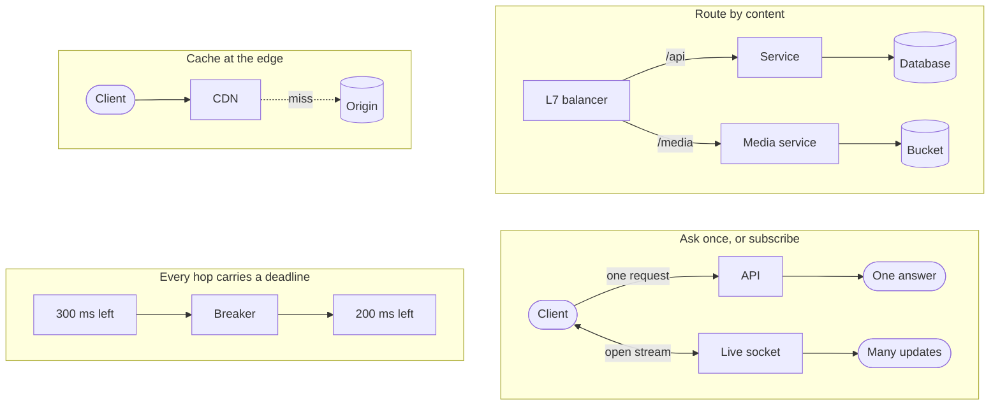

---

<!-- _class: diagram -->

`Network kit · the request path`

## Four hops separate a tap from your service, each spending budget.

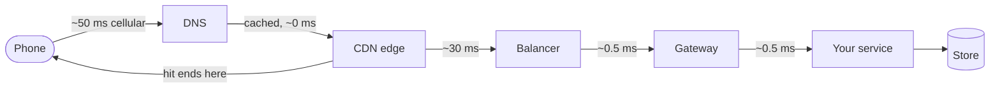

---

<!-- _class: list-tabular metric -->

`Network kit · the numbers`

## Three numbers settle most latency arguments before they start.

1. Memory read
   - 100 ns
2. Datacenter hop
   - 0.5 ms
3. Cross-continent round trip
   - 150 ms

---

<!-- _class: content -->

`Why that number is final`

## Light in fiber covers about 200 kilometers per millisecond.

Nothing changes that. The measured 150 milliseconds is well above the straight-line floor, because packets do not travel in straight lines and every hop queues.

A design that needs three sequential intercontinental round trips has spent half a second before it executes an instruction. Replication, caching and edge delivery all exist to buy that distance back, and none of them makes it free.

---

<!-- _class: cards-stack -->

`Network kit · the CDN`

## A CDN moves bytes closer to readers, and ends the connection there too.

- Reach for it when
  - The content is large, popular, and identical for many people.
- Walk away when
  - Nothing is shared and nothing is far. A personal response still wins the handshake back.
- The constraint you inherit
  - A second copy with its own staleness. Version immutable URLs; purge the rest, and time the purge.

---

<!-- _class: split-panel proof cat-2 -->
<!-- _header: "" -->

`Network kit · timeouts`

## A request with no timeout is a resource leak waiting for a bad afternoon.

Every waiting request holds a connection, a thread and some memory. Under a slow dependency, unbounded waits turn one struggling service into a queue of stuck callers — which is the shape of the page that pulled Maya in at twenty to eleven.

- What good looks like
  - Every outbound call has a deadline, and the deadline shrinks as it propagates.
- Retries need a budget
  - Retrying without a cap turns a brief failure into a flood you built yourself.
- Backoff must be random
  - Synchronized retries arrive together and rebuild the spike you just survived.

---

<!-- _class: list-criteria -->

`Network kit · the invariants`

## A call that leaves your process owes you these four.

1. Every remote call has a deadline
   - Inherited from the caller, and always shorter than the caller's own.
2. Every retry has a budget and jitter
   - Bounded attempts, randomized delays, and a breaker when the target is down.
3. Every write is idempotent or keyed
   - The network will deliver your request twice. Decide now what that means.
4. Distance appears in the design
   - Round trips between regions are counted on purpose, not discovered in production.

---

<!-- _class: divider -->

`Scale`

## Every scaling change is one of four moves.

---

<!-- _class: diagram -->

`Scale kit · the patterns`

## The four moves, and what each one costs you.

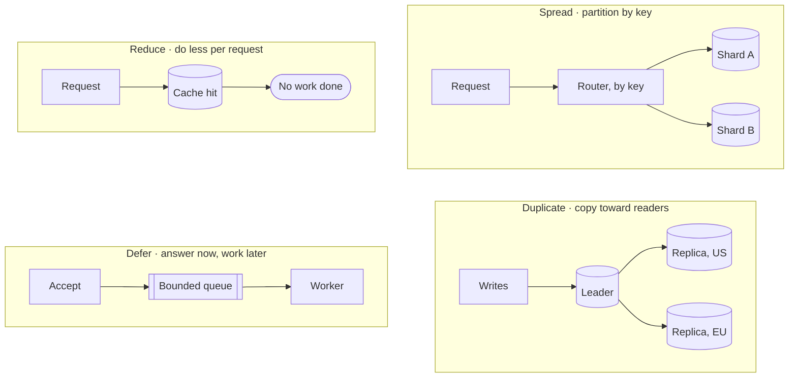

---

<!-- _class: math -->

`Scale kit · the one formula`

## Little's law ties concurrency, throughput and latency together.

$$ L = \lambda W $$

- $L$ — requests in flight at once
- $\lambda$ — arrivals per second
- $W$ — time each one spends inside

---

<!-- _class: content -->

`Using it`

## The formula sizes your thread pool before anyone guesses.

At 2,000 requests per second averaging 50 milliseconds each, 100 requests are in flight at any moment. That is your minimum concurrency, and no tuning makes it smaller while the other two numbers hold.

It also explains the outage. If latency triples during an incident, concurrency triples with it, and a pool sized for the good day is now the thing that fails. Find your own numbers: arrivals on the load balancer, duration in the handler.

---

<!-- _class: split-panel proof cat-3 -->
<!-- _header: "" -->

`Scale kit · tail latency`

## The average request is a fiction, and your users live in the tail.

A page that makes 100 parallel calls waits for the slowest one. With a one-percent chance of a slow call, 63 percent of pages hit at least one — that is one minus 0.99 to the hundredth, and you can redo it on a napkin.

- The check
  - You report the 99th percentile per dependency, and the mean nowhere.
- Fan-out amplifies it
  - More parallel calls turn a rare slow response into a common slow page.
- Hedging buys it back
  - Send a duplicate after the 95th percentile and take whichever answers first.

---

<!-- _class: cards-grid four -->

`Scale kit · caching`

## Each caching pattern owns a different failure.

- Cache-aside
  - The app fills the cache on a miss. Simple, and it stampedes on a cold key.
- Read-through
  - The cache fetches for you. Cleaner code, and now the cache is on the critical path.
- Write-through
  - Write both together. Always fresh, and every write pays the cache's latency.
- Write-behind
  - Write the cache, flush later. Fastest writes, and a crash loses them.

> Choose by which failure you can survive, not by which pattern reads best in code.

---

<!-- _class: split-panel proof cat-4 -->
<!-- _header: "" -->

`Scale kit · idempotency`

## Idempotency is what makes a retry safe, and retries are not optional.

Networks duplicate, clients retry, queues redeliver. The only question is whether the second delivery is harmless or charges somebody twice.

- The rule
  - Every mutating endpoint takes a client-supplied key and deduplicates on it.
- The key comes from the caller
  - Generated before the first attempt, reused on every retry of that same intent.
- Store the result, not the fact
  - A repeat returns the original answer, not an error saying it already happened.

---

<!-- _class: list-criteria -->

`Scale kit · the invariants`

## Check these four before you call anything scalable.

1. The bottleneck is named and measured
   - Not suspected. A number, a graph, and the resource it belongs to.
2. Every queue is bounded
   - An unbounded queue turns a throughput problem into a memory outage.
3. Load sheds before it collapses
   - The system rejects work at the edge rather than failing everywhere at once.
4. Adding a machine is routine
   - No manual steps, no rebalancing outage, no cold-cache stampede.

---

<!-- _class: divider -->

`Reliability`

## Failure is the environment, not the exception.

---

<!-- _class: diagram -->

`Reliability kit · the patterns`

## Each of these keeps one failure from becoming every failure.

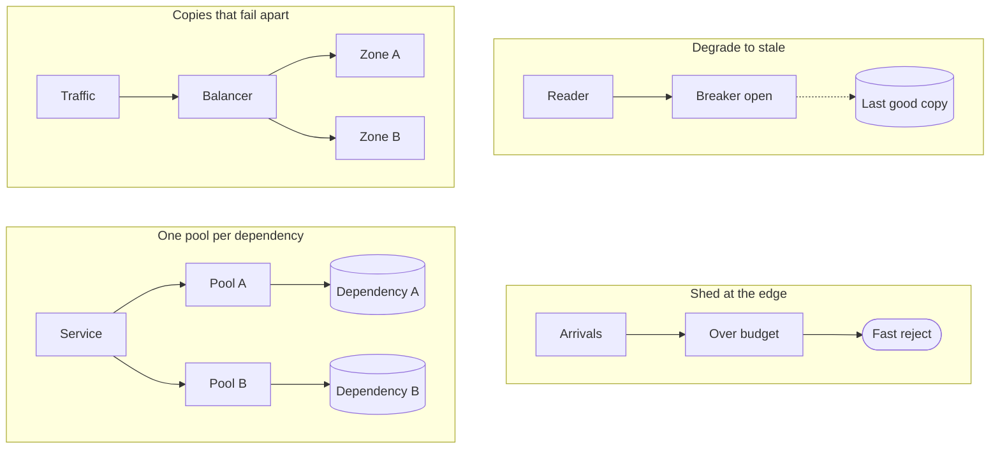

---

<!-- _class: diagram -->

`Reliability kit · failure domains`

## Redundancy only helps when the copies can fail apart.

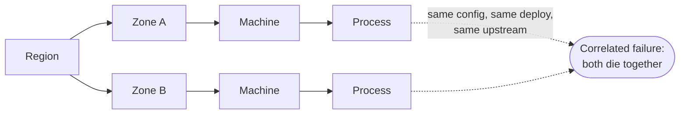

---

<!-- _class: list-steps -->

`Reliability kit · containment`

## Four mechanisms keep a slow dependency from taking the building.

1. Timeout
   - Bound the wait, so a slow callee cannot hold your resources.
2. Retry with backoff
   - Recover from a blip, with a budget and jitter so you do not amplify it.
3. Circuit breaker
   - Stop calling something that is clearly down, and let it recover.
4. Bulkhead
   - Give each dependency its own pool, so one queue cannot drain them all.

---

<!-- _class: list-tabular def -->

`Reliability kit · the objectives`

## Four terms decide what you are allowed to ship this week.

1. SLI
   - The measurement: the share of requests served under 300 milliseconds.
2. SLO
   - Your internal target for it, such as 99.9 percent over 28 days.
3. SLA
   - The external promise, with money attached, and always looser than the SLO.
4. Budget
   - What the objective lets you spend. Exhausted, feature work stops.

---

<!-- _class: list-tabular metric -->

`Reliability kit · the nines`

## An availability target is a budget that shrinks fast.

1. 99 percent
   - 3.65 days per year
2. 99.9 percent
   - 8.8 hours per year
3. 99.99 percent
   - 53 minutes per year
4. 99.999 percent
   - 5.3 minutes per year

---

<!-- _class: content -->

`Reading that table`

## Past three nines the humans stop being fast enough.

Fifty-three minutes a year is about one incident with a page, a login, a look at a dashboard and a decision. So four nines does not mean a faster on-call engineer. It means automatic failover and automatic rollback, because a person is no longer in the loop.

Each nine roughly multiplies the cost. Pick the number the business actually needs, and write down what you are choosing not to buy.

---

<!-- _class: cards-grid three -->

`Reliability kit · observability`

## Three signals answer three different questions. None replaces another.

- Metrics
  - Cheap, aggregate, always on. They tell you that something is wrong.
- Logs
  - Detailed, expensive, one event at a time. They tell you what happened in one case.
- Traces
  - One request across every service. They tell you where the time actually went.

> If you cannot answer "which dependency is slow" inside a minute, you have metrics, not observability.

---

<!-- _class: split-panel proof cat-5 -->
<!-- _header: "" -->

`Reliability kit · degradation`

## A well-designed system gets worse in an order somebody chose.

Under pressure something has to give. Either you decided in advance which features degrade, or the system decides at random and drops the one that takes money.

- The rule
  - Every feature has a stated tier, and the lowest tier fails first by design.
- Read paths outlive write paths
  - Serving something slightly stale beats serving an error page, for almost every product.
- The fallback is exercised
  - An untested degraded mode is untested code running in your worst hour.

---

<!-- _class: list-criteria -->

`Reliability kit · the invariants`

## Trust nothing in production until these four hold.

1. Every dependency has a defined failure behavior
   - Written down: degrade, queue, or fail fast. Never "we will see."
2. Redundant copies fail independently
   - Different zones, different deploys, different upstreams. Otherwise it is one copy.
3. Recovery is practiced
   - Restores, failovers and rollbacks happen on a schedule, not for the first time at 3am.
4. The system tells you before a user does
   - Alerts fire on the indicator, never on the complaint.

---

<!-- _class: divider -->

`Security`

## Assume the boundary is already crossed.

---

<!-- _class: diagram -->

`Security kit · the patterns`

## All four of these assume somebody is already inside.

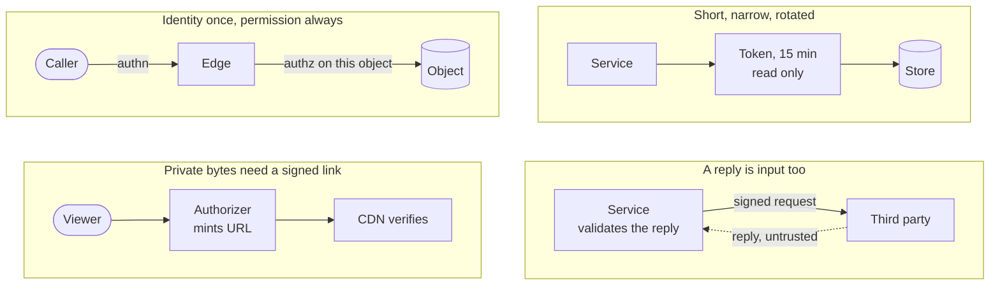

---

<!-- _class: diagram -->

`Security kit · trust boundaries`

## Every arrow that crosses a trust boundary needs a check on the far side.

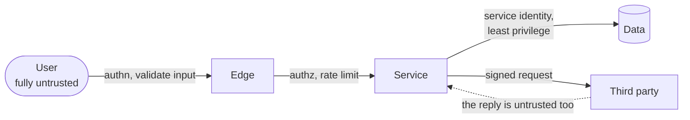

---

<!-- _class: compare-prose -->

`Security kit · the pair`

## Authentication asks who you are. Authorization asks what you may touch.

- Authentication
  - Establishes identity once, at the edge, and hands down a claim anyone downstream can verify. Getting it wrong lets the wrong person in.
- Authorization
  - Decides, on every single request, whether this identity may touch this specific object. Getting it wrong lets the right person read somebody else's data.

---

<!-- _class: split-panel proof cat-6 -->
<!-- _header: "" -->

`Security kit · least privilege`

## Least privilege is measured by what one stolen credential can reach.

Assume any single credential eventually leaks. The design question is not whether that happens; it is how far the person holding it can travel, and for how long.

- The check
  - You can say in one sentence what each service account could reach if stolen.
- Scope it and expire it
  - Narrow permissions, short lifetimes and automatic rotation beat a careful human.
- Separate read from write
  - Most services need one or the other. Almost none needs to delete.

---

<!-- _class: list-tabular def -->

`Security kit · encryption`

## Encryption has three states, and a fourth thing that outranks all of them.

1. Transit
   - TLS everywhere, including between your own services. Networks are untrusted.
2. Rest
   - Disk and backup encryption. Stops a stolen device, not a stolen credential.
3. Use
   - Decrypted in memory to be processed. The hardest state, and the one attacked.
4. Keys
   - A managed store or an HSM, rotated on a schedule, never in the repository.

---

<!-- _class: checklist -->

`Security kit · threat modeling`

## Six questions find most of the holes before somebody else does.

- [ ] Can someone pretend to be another identity? `spoofing`
- [ ] Can data be changed in transit or at rest? `tampering`
- [ ] Can an actor deny having done something? `repudiation`
- [ ] Can private data reach the wrong reader? `disclosure`
- [ ] Can one caller exhaust a shared resource? `denial`
- [ ] Can a caller gain rights nobody granted? `elevation`

---

<!-- _class: list-criteria -->

`Security kit · the invariants`

## Sign your name to a design only when these four are true.

1. Every request is authorized against the specific object
   - Not the endpoint. Object-level checks are where the breaches happen.
2. Secrets never enter the repository or a log line
   - They live in a managed store, are injected at runtime, and they rotate.
3. All input is untrusted, including from your own services
   - A compromised internal caller is the ordinary case, not the exotic one.
4. Every privileged action is attributable
   - An immutable record of who, what, when, and from where.

---

<!-- _class: divider numbered -->

`Part five`

## Now we design the thing Maya opened while the train sat.

---

<!-- _class: code -->

`Instagram · the worksheet`

## Nine fields, filled in before a single box goes on the board.

```text
Protagonist   A reader on a phone. Twelve opens a day, on cellular.
Antagonist    The shape of the follow graph — a tail at 5×10⁸ edges.
Purpose       A fresh, personal, ranked page in under a second.
Boundary      In: feed, posts, edges, media. Out: the phone, the network, the law.
Environment   Spiky traffic, partitions, duplicate deliveries, people who want in.
Constraints   200 ms p99 · 60 reads per write · media durable forever
Invariants    A post reaches eligible followers · media never lost · a like counts once
Bottleneck    Hydration lookups: 70K feed reads/s, but ~5.6M backend reads/s
Solution type Scaled. Not an MVP, not optimal.
```

---

<!-- _class: list-criteria -->

`Instagram · what it must do`

## Four operations carry the entire product.

1. Post a photo
   - Upload media, attach a caption, publish it to the people who follow you.
2. Follow an account
   - Build the directed graph that decides whose posts you are eligible to see.
3. Read a feed
   - A ranked, paginated page of recent posts from the accounts you follow.
4. React
   - Like and comment, with counts visible on every post.

---

<!-- _class: list-criteria -->

`Instagram · what it must guarantee`

## Four guarantees decide the architecture more than the features do.

1. The feed serves in under 200 milliseconds
   - Server-side, 99th percentile, measured from the reader's own region.
2. Reads dominate writes by about sixty to one
   - At the API. Push fan-out inverts it underneath: 330K feed writes a second against 70K reads.
3. Posts, media and the graph are durable forever
   - Lose any of the three and nothing rebuilds them. Only derived data rebuilds.
4. Eventual consistency is fine on the feed
   - A late post and a lagging count are fine. A blank count is not.

---

<!-- _class: content -->

`Instagram · the estimate, worked`

## Two assumptions and some division give you every number that matters.

Assume 500 million daily users opening the feed twelve times a day, and 100 million photos posted a day. The rest is division: reads are `500M × 12 ÷ 86,400`, or about `70K/s`; writes are `100M ÷ 86,400`, or about `1.2K/s`; bytes are `100M × 2MB`, or `200 TB/day`. That puts the ratio near `60:1`.

The twelve is the only number doing real work. Change the 500 million while holding opens and posts per user fixed, and the ratio does not move. Change how often people post, and it does.

---

<!-- _class: list-tabular metric -->

`Instagram · the envelope`

## The architecture starts arguing at five numbers.

1. Daily active users
   - 500 M
2. Photos per day
   - 100 M
3. Average writes
   - 1.2 K per second
4. Average feed reads
   - 70 K per second
5. Media stored daily
   - 200 TB

---

<!-- _class: content -->

`Your turn`

## Redo it for a smaller product before you turn the page.

Fifty million daily users, opening the app four times a day, posting two million photos. Work out reads per second, writes per second, and the ratio between them.

Do it now, on paper, in under a minute. Cover the next slide until you have one. The point is not the answer; it is that you can produce one at all, in the meeting where it is being decided.

---

<!-- _class: content -->

`The answer`

## The ratio moved, and the reason it moved is the lesson.

`50M × 4 = 200M reads/day ÷ 86,400 ≈ 2.3K reads/s` · `2M ÷ 86,400 ≈ 23 writes/s` · `ratio ≈ 100:1`

A thirtieth of the read traffic, and the ratio went from 60:1 to 100:1. It moved because you changed how often each person posts, not just how many people there are. The ratio is opens per user divided by posts per user: it survives being wrong about population, never about behavior.

---

<!-- _class: diagram -->

`Instagram · the graph`

## The follow graph is directed, and the two directions are not the same size.

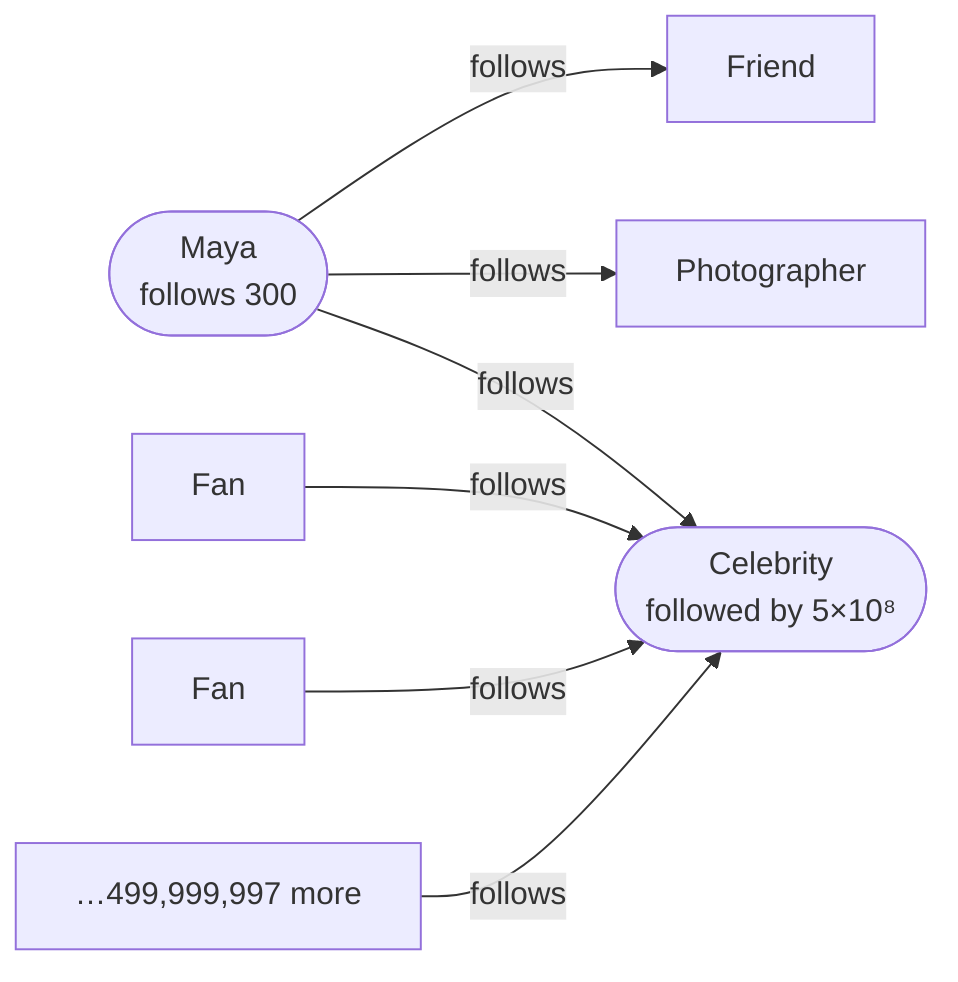

*Out-degree is capped at 7,500 by product policy. In-degree is capped by nothing. Every hard problem in this design lives on the right-hand side of this picture.*

---

<!-- _class: split-panel capstone cat-7 -->
<!-- _header: "" -->

`Instagram · the one sentence`

## Your following list is capped. Your followers list is capped by nothing.

Instagram limits how many accounts you may follow to seven and a half thousand. Nobody limits how many people may follow you. Bounded out-degree, unbounded in-degree — and every hard problem in this design lives on the unbounded side.

- Following, per person
  - At most 7,500. A read of that list is one partition and a sorted range.
- Followers, per person
  - Median a few hundred. Maximum five hundred million. Six orders of magnitude apart.
- Everything after this
  - Is a consequence of that asymmetry. Nothing else in the design spans that range.

---

<!-- _class: code -->

`Instagram · the storage`

## The edge is stored twice, because it answers two different questions.

```text
following                              followers
  PK  (source_id)                        PK  (target_id, bucket)
  CK  (target_id)                        CK  (created_at DESC, source_id)
  "does A follow B?" is a point read     the follower list, newest first
  capped at 7,500 rows                   bucket = hash(source) % B(target)
                                         B = clamp(followers / 10_000, 1, 512)
```

*The forward edge is the source of truth; the reverse is materialized from the log and repaired by a background job. `B` may only ratchet upward — shrink it and edges become unreachable — and because early edges were written under a smaller `B`, the low buckets carry several times the average in the mid range — and barely more than it once `B` is capped.*

---

<!-- _class: compare-table -->

`Instagram · what each read costs`

## Four of these reads are cheap. The fifth is the whole problem.

| The read | The path | What it costs |
| --- | --- | --- |
| Does A follow B? | `following (A)` then `B` | One point read |
| Who does A follow? | `following (A)` range | 7,500 rows, one partition |
| Who follows B, ordinary B? | `followers (B, 0)` range | ~10⁴ rows, one partition |
| Follower count | `user_edge_stats` | One point read, cached |
| **Who follows B, celebrity B?** | `followers (B, 0..511)` | **5×10⁸ rows, 512 partitions** |

---

<!-- _class: content -->

`Let us get this wrong`

## Design it the obvious way: when you post, write into every follower's feed.

The reader then does almost nothing. One lookup, one page, no merging, no ranking across sources. It is fast, it is simple, and for an account with two hundred followers it is unambiguously correct: two hundred small writes, and every reader gets a page in a millisecond.

Hold that design in your head. Now a single account with five hundred million followers posts one photograph. Before you turn the page, predict what happens.

---

<!-- _class: split-panel metric -->

`One post, one celebrity`

## 25 GB

Five hundred million feed inserts at roughly fifty bytes each, from a single API call.

- 500 seconds of queue
  - At a million inserts a second, that is eight minutes serving nobody else.
- 330K inserts a second
  - The platform's ordinary load: 1.2K posts times a mean fan-out near 280. Totals need the mean. The median is far lower and would halve your estimate.
- 25 minutes of backlog
  - One celebrity post is that much of everyone else's work, arriving at once.

---

<!-- _class: cards-grid four -->

`One super node, four fires`

## Writing 25 GB from one call is only the first thing that breaks.

- The fan-out queue
  - 25 GB of inserts from one call, in front of everybody else's posts.
- The hot partition
  - Unbucketed, those edges are one partition key on one replica set.
- The cache
  - 25 GB of churn evicts the working set of readers who did nothing wrong.
- The thundering herd
  - One cache key, invalidated on publish, missed by a million readers at once.

> A skewed key produces a system where one machine is on fire and the rest are idle.

---

<!-- _class: content -->

`Why the hybrid is forced`

## The graph decides where the two cost curves cross.

Pushing costs one write per follower, and the follower count is unbounded. Pulling costs one read per followee, and the followee count is capped at seven and a half thousand. So push is cheap exactly where the unbounded side is small, and pull is cheap exactly where the bounded side is what you walk.

There is a second reason, and it is the better one: a celebrity's recent-posts list is written once and read five hundred million times. It is the most cacheable object in the system.

---

<!-- _class: split-compare -->

`Decision`

## Push below the threshold, pull above it, and merge at read.

The two strategies fail at opposite ends of the same graph, so the design uses each one where the other breaks.

- One strategy for everyone
  - Simple to explain, guaranteed to fail at one end. Push drowns on celebrities; pull costs hundreds of reads per page for everyone else.
- Split at the threshold
  - Push from ordinary accounts, pull from high-follower accounts, merge the two at read time. Ordinary posts land in a page that is already built; the celebrities she follows are fetched on demand and merged in, so no writer ever fans out to millions. The read costs one lookup plus ten to thirty fetches, and each strategy runs where its cost curve is the lower one.

> The threshold is not a preference. It is where two cost curves cross, and the graph draws it.

---

<!-- _class: content -->

`Instagram · the threshold`

## Fifty thousand followers is the line. The real predicate is a rate.

Fifty thousand puts a fraction of a percent of accounts on the pull path. Someone following three hundred typically has ten to thirty above the line.

Run the tail arithmetic: at thirty pulls and a one-percent slow call, `1 - 0.99^30` is twenty-six percent of pages hitting at least one. So **cap the pulls at twenty**, taking the sources that posted most recently. A cap trades completeness for a bounded tail, and you should say out loud which one you are buying: past the cap, a reader misses posts from the quietest accounts they follow. Crossing the threshold does not rewrite history — old entries age out.

The better predicate is fan-out work per day: fifty thousand followers posting forty times a day costs more than two hundred thousand posting weekly.

---

<!-- _class: split-panel capstone cat-8 -->
<!-- _header: "" -->

`Instagram · the hinge`

## The celebrity is a protagonist of the product and the antagonist of your design.

The product exists partly for her. She is the reason a hundred million people opened the app this morning, and the reason the write path cannot be one code path. Both things are true at once, and holding both is what designing feels like.

- For the product
  - She is the most valuable account on the platform, and she must post instantly.
- For the design
  - She is a five-hundred-million-edge node that breaks every uniform assumption.
- What you do about it
  - You do not resolve the tension. You build a second path and name why it exists.

---

<!-- _class: diagram -->

`Instagram · the write path`

## The graph service is the box everyone forgets to draw.

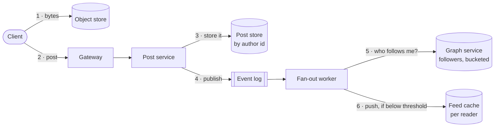

---

<!-- _class: diagram -->

`Instagram · the read path`

## The read path is one lookup, plus whatever the celebrities added.

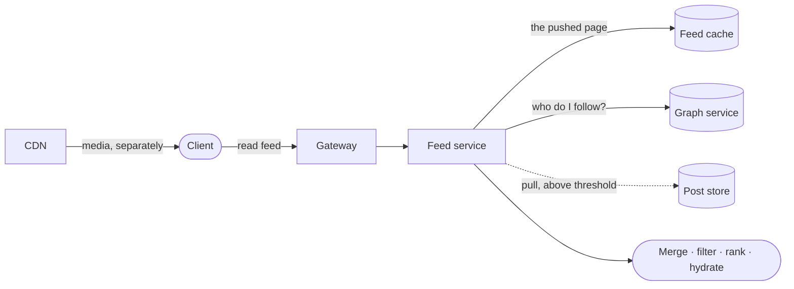

---

<!-- _class: list-steps -->

`Instagram · assembling a page`

## Hydration costs more than the other three stages together.

1. Fetch and merge
   - Read the precomputed page, then pull recent posts from the celebrities she follows.
2. Filter
   - Drop blocked accounts, deleted posts and private accounts she does not follow.
3. Rank
   - Score the candidates. Paginate on a stable key, never on the score.
4. Hydrate
   - Fetch each post, its media URLs, its counts, and whether she already liked it.

---

<!-- _class: content -->

`The number we missed`

## Seventy thousand feed reads a second is really five million lookups a second.

A twenty-item page needs four lookups an item — the post row, the media variants, the counts, and whether this reader liked it. Eighty a page, times seventy thousand pages a second, is 5.6 million.

Batch them all. Do not fold the count into the feed entry — that entry is written at post time, when the count is zero. Fold the like check the other way instead: one batched read across the twenty candidates.

Batching is not only throughput. Eighty parallel calls put `1 - 0.99^80`, fifty-five percent, of pages on a slow dependency — against a 99th-percentile promise.

---

<!-- _class: split-panel proof cat-1 -->
<!-- _header: "" -->

`Instagram · the likely bug`

## Your own post must appear instantly, or people think the upload failed.

The feed is eventually consistent, which is correct for everyone else's posts and completely wrong for your own. A person who posts and does not see it reads that as data loss, not as staleness, and posts again.

- Where it comes from
  - Read-your-writes, the consistency rung from part four, applied to something.
- Write your own feed synchronously
  - Inside the POST request, before it returns. One extra write, on one key.
- And let the client help
  - It inserts the post it just created optimistically, and reconciles on the next fetch.

---

<!-- _class: diagram -->

`Instagram · the media path`

## Media never touches your API servers, and private media never touches an open URL.

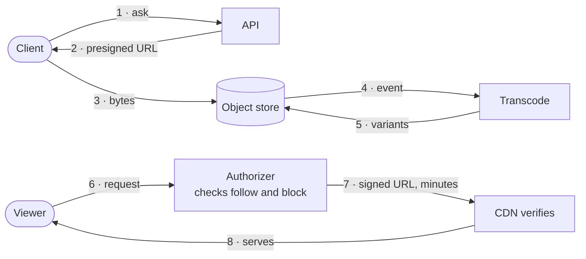

*Step 2 is the one place an untrusted client writes straight into your storage, so the grant carries its own limits: one content type, a byte ceiling, a short expiry, and a rate per account. Without them the presign is an unmetered write to storage you pay for, and step 4 hands attacker-chosen bytes to a decoder. All input is untrusted, including the input you asked for.*

---

<!-- _class: split-panel proof cat-4 -->
<!-- _header: "" -->

`Instagram · the path nobody designs`

## A million likes on one post is the follower list again, on a different axis.

Every like is a write against the same post id — one key, one partition, one leader — arriving tens of thousands a second. That is the hot key the data kit warned about, and delivery is at-least-once.

- The row is the truth
  - Store the pair once, keyed by reader and post. The count is an aggregate you rebuild from it, which is what survives a redelivery or an unlike.
- Shard the counter
  - Increment one of a hundred sibling keys at random; sum them on read. One hot key becomes a hundred warm ones.
- Comments are the second unbounded list
  - Bounded per reader, unbounded per post. Page them; never load them with the post.

---

<!-- _class: cards-grid four -->

`Instagram · where it breaks`

## You already have the answer to every failure that is certain here.

- Celebrity post
  - The fan-out queue floods. Answer: the pull path above the threshold.
- Feed cache eviction
  - Cold readers cost a rebuild. Answer: rebuild lazily from posts and edges.
- Redelivery
  - The queue delivers twice. Answer: the feed entry is keyed on reader and post.
- Zone loss
  - A whole zone disappears. Answer: media replicated, every derived store rebuildable.

---

<!-- _class: checklist -->

`Instagram · the invariants`

## Six sentences hold, or the design is not finished.

- [x] A post is visible to every eligible follower who reaches it. `eventually`
- [x] Media is never lost once an upload is acknowledged. `durable`
- [x] A like counts exactly once per reader and post. `idempotent`
- [x] A feed page never repeats or skips an item. `stable cursor`
- [ ] A blocked account is filtered at read — but a signed media URL outlives the check. `keep the TTL short`
- [x] Every derived store rebuilds from posts and edges. `rebuildable`

---

<!-- _class: divider numbered -->

`Part six`

## Every choice came out of a kit, including the one we refused.

---

<!-- _class: compare-table -->

`The tie-back · store and run`

## Each store-and-run entry landed somewhere specific in the design.

| Kit entry | Where it landed | Why that one |
| --- | --- | --- |
| Wide-column | The two edge tables | A partition key plus a sorted range is an adjacency list |
| Object store | Photo bytes and variants | Large, immutable, fetched by key, kept for years |
| Key-value | The feed cache | The key is known exactly and nothing is asked of the value |
| Durable log | Post events into fan-out | Producers outpace consumers, deliberately |
| Stateless services | Feed and post service | Any instance serves any reader; state lives elsewhere |
| Bounded queue | Fan-out and transcode | Unbounded, one celebrity means an outage |

---

<!-- _class: compare-table -->

`The tie-back · scale and defense`

## The network, scale, reliability and security kits landed here.

| Kit entry | Where it landed | Why that one |
| --- | --- | --- |
| Reduce | One cached list per celebrity | Written once, read five hundred million times |
| Spread | Posts by author, edges by bucket | The bucket bounds the biggest list we still fan out |
| Defer | Fan-out on write, below the threshold | Moves the cost out of the reader's 200 milliseconds |
| CDN with versioned URLs | Every photo variant | Same bytes for many readers, and purging is eventual |
| Bulkhead | Fan-out workers kept off the read path | A burst of ordinary fan-out must not starve the pool serving feeds |
| Object-level authorization | Every hydration | The endpoint check passes; the object check stops the breach |

---

<!-- _class: split-panel capstone cat-2 -->
<!-- _header: "" -->

`The entry we refused`

## The most useful entry here is the one we refused.

Most juniors asked to design Instagram reach for a graph database, because the words "social graph" are right there. The data kit already answered it, fifty slides before anybody had heard of a super node.

- What the card said
  - Walk away when you have relationships but only ever join two hops.
- What the feed actually does
  - Walks one graph hop, me to the people I follow, then a keyed lookup that is not a traversal.
- Why the refusal matters most
  - A kit that only says yes is a catalog. One that says no is a tool.

---

<!-- _class: code -->

`The artifact`

## This is the whole method, and it fits on one page.

```text
Protagonist   ______________________  wants to ______________  so that ________
Antagonist    But ________________  —  and it is this big: ____________________

Purpose       ______________________________________________________________
Boundary      In: _________________________  Out: _________________________
Environment   ______________________________________________________________
Constraints   physical ______  economic ______  human ______  legal ______
Invariants    1 ____________________  2 ____________________  3 ____________
Bottleneck    ______________________________  measured at ____________________
Solution type MVP  ·  scaled  ·  optimized  ·  optimal  ·  specialized
```

---

<!-- _class: checklist -->

`The review`

## Six questions to ask of any design, starting with your own.

- [ ] Who is the protagonist, and who are we not designing for? `casting`
- [ ] What is the antagonist, and what number describes it? `evidence`
- [ ] Which rung of the ladder is this, and does everyone agree? `frame`
- [ ] What breaks first at ten times the load? `scale`
- [ ] What happens when each dependency is slow rather than down? `failure`
- [ ] What can one stolen credential reach? `security`

---

<!-- _class: list-steps -->

`What to do on Monday`

## The last of these four is the one that teaches you.

1. Pick the unglamorous system
   - Not a famous one. The service you were debugging on Thursday, or the pipeline nobody wants to own.
2. Cast it before you draw it
   - Protagonist and antagonist first, one sentence each. If you cannot name them, you do not understand it yet.
3. Fill the other seven fields
   - Let them argue with you. A field you cannot answer is the design question you have been avoiding.
4. Bring the page to your one-on-one
   - Ask the person across from you which field you got wrong. That conversation is the whole point of learning this.

---

<!-- _class: closing silent spectrum -->

## Name the person, name the force, and the design follows.

`How to Think About Systems`

Maya never designed anything on Tuesday, and she used every word in Part one before she went to bed.
