<!-- _class: title silent spectrum -->

# Systems, and How to Design Them

`A mentorship kit`

Seven words, five kinds of solution, six kits, and two systems designed end to end.

---

<!-- _class: quote bare -->

> A complex system that works is invariably found to have evolved from a simple system that worked.

*John Gall, 1975 — the sentence most system design goes wrong by ignoring*

---

<!-- _class: cards-grid three -->

`Why this is hard`

## Nobody is stuck on the technology. They are stuck on the thinking.

- No vocabulary
  - Without words for boundary and invariant, the discussion becomes a list of product names.
- No frame
  - "Design Instagram" has no answer until someone says which solution is wanted.
- No reference
  - Advice arrives as folklore, one anecdote at a time, never as a kit you carry.

> A small vocabulary, one framing question, and six kits you keep for a career.

---

<!-- _class: agenda -->

## What we build together, in five parts.

1. The vocabulary — system, process, model, and five more
2. Model your day — the method on a problem you know
3. Solution types — which answer is being asked for
4. Six kits — data, compute, network, scale, reliability, security
5. Two systems — a photo feed and a chat model

---

<!-- _class: divider numbered -->

`Part one`

## Seven words do most of the work.

---

<!-- _class: premise -->

## Stop calling everything "the system" and the design gets easier.

Four words separate what you are building from the world it sits in.

1. System
   - Parts joined by relationships.
   - What does the whole do?
2. Boundary
   - The line between in and out.
   - What is mine to fix?
3. Environment
   - What acts on you from outside.
   - What can I not control?
4. Process
   - A repeatable transformation.
   - What turns input into output?

---

<!-- _class: premise -->

## Three more words are what you actually reason with.

You never handle the system itself. You handle a drawing of it, its limits, and its promises.

1. Model
   - A chosen simplification.
   - What did I leave out?
2. Constraint
   - A limit you design within.
   - What is not negotiable?
3. Invariant
   - A claim that must stay true.
   - What would mean broken?

---

<!-- _class: split-panel proof -->

`Word one · System`

## A system is parts, connected, doing something together.

*What is it made of, and what is it for?* Parts, the relationships between them, and a purpose no part serves alone. Remove one and you have a pile.

- You know you're here when
  - You can name a behavior the whole has that no single part has.
- The parts are the easy half
  - Servers, queues, people, a database, a payment provider. You can list them.
- The relationships are the system
  - Same parts, different wiring, completely different behavior.

---

<!-- _class: diagram -->

`The definition, drawn`

## The same parts, wired differently, are a different system.

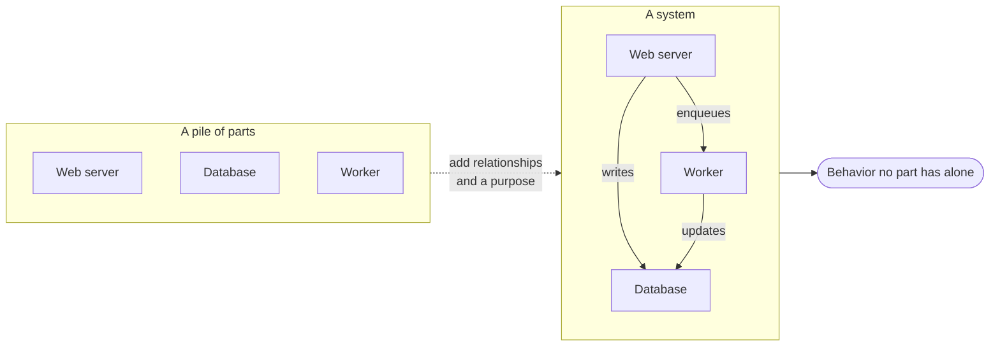

---

<!-- _class: split-panel proof -->

`Word two · Boundary`

## The boundary is the line you are accountable for.

*What is mine, and what is merely near me?* Inside, you change things. Outside, you make requests and handle refusals. Drawing that line is the first real design decision.

- You know you're here when
  - You can say which failures page you at 3am and which ones do not.
- Inside is what you change
  - Your code, your schema, your deploys, your rotation.
- Outside is what you negotiate
  - A payment provider, an identity service, a customer's browser.

---

<!-- _class: split-panel proof -->

`Word three · Environment`

## The environment acts on you and never asks permission.

*What arrives that I did not choose?* Traffic spikes, hostile users, dying disks, changing laws, a partner shipping a breaking version on a Friday. None of it is yours.

- You know you're here when
  - You have written down what arrives, not what you plan to build.
- It is not the same as load
  - Regulation, competitors and staff turnover are environment too.
- You design for it, not against it
  - You cannot stop a partition. You can decide what happens during one.

---

<!-- _class: split-panel proof -->

`Word four · Process`

## A process is a repeatable transformation that takes time.

*What turns this input into that output?* A system is a noun; a process is a verb. Each one has inputs, a transformation, outputs, a rate, and state it leaves behind.

- You know you're here when
  - Someone else could run the sequence without asking you a question.
- Rate is part of the definition
  - "Resize an image" is not a process until you say how many per second.
- Leftover state is where bugs live
  - Half-finished work, retries and duplicates all come from an interrupted run.

---

<!-- _class: diagram -->

`Process, drawn`

## Every process is five things, and four of them are usually left unsaid.

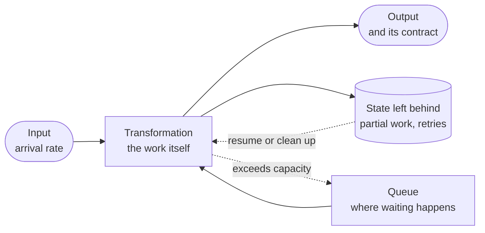

---

<!-- _class: split-panel proof -->

`Word five · Model`

## A model is a simplification you chose on purpose.

*What did I leave out, and can I defend it?* Not a smaller copy of the system. It keeps what matters for one question and drops the rest, so you reason faster than you build.

- You know you're here when
  - You can name something real your drawing deliberately does not show.
- Fidelity is not the goal
  - A model as detailed as the system is as hard to think about.
- Each model answers one question
  - The data-flow diagram is the wrong one for explaining failure.

---

<!-- _class: compare-prose axis -->

`Two facets of one idea`

## A model is useful because it is wrong in a way you control.

The value is not in what a model captures. It is in what it drops.

1. What it keeps
   - The few variables that move the answer to the one question you are asking.
2. What it drops
   - Everything else, named out loud. An unstated omission is a bug you have not found.

*Ask an engineer what their diagram leaves out. The ones who can answer drew it on purpose.*

---

<!-- _class: split-panel proof -->

`Word six · Constraint`

## A constraint is a limit that does not care what you prefer.

*What is genuinely not negotiable?* Constraints narrow the design space, and that is the good news: a problem with no constraints has infinite answers and no way to choose.

- You know you're here when
  - Naming the limit removes options rather than adding caveats.
- Real constraints are measurable
  - "Fast" is a wish. "Under 200ms at the 99th percentile" is a constraint.
- Some constraints are chosen
  - A team of three and one cloud provider are elected limits you can revisit.

---

<!-- _class: cards-grid four -->

`Constraint families`

## Constraints come from four places, and they behave differently.

- Physical
  - Light speed, disk seeks, memory bandwidth. Nothing negotiates these.
- Economic
  - Budget, headcount, the price of a GPU-hour. Money moves these slowly.
- Human
  - What the team knows, what a user tolerates, what a rotation sustains.
- Regulatory
  - Residency, retention, consent, audit. Breaking these beats an outage.

> Physical constraints set the ceiling. Human constraints decide whether you reach it.

---

<!-- _class: split-panel proof -->

`Word seven · Invariant`

## An invariant is a sentence that must never become false.

*What would mean this is broken, even with nothing crashed?* An invariant outranks a requirement. It holds during a deploy, a partition, a retry storm, and a live migration.

- You know you're here when
  - The claim is true now and must still be true tomorrow.
- Write them as sentences
  - "A balance is never negative." "Every order has exactly one payment."
- They tell you where to test
  - Each one names a check, an alert, and usually a database constraint.

---

<!-- _class: split-panel capstone -->

`The eighth word`

## Infrastructure is the part you rely on and do not want to think about.

*What holds everything else up?* Compute, storage, network, identity, deployment, observability. The word names a relationship, not a technology: infrastructure is whatever you build on and expect to keep working.

- The test
  - If it vanishing stops many unrelated things at once, it is infrastructure.
- It is someone else's product
  - Your infrastructure is another team's system, with its own invariants.
- Boring is the requirement
  - It earns its place by being predictable, not by being interesting.

---

<!-- _class: diagram -->

`How systems misbehave`

## Feedback loops explain almost every surprise a system gives you.

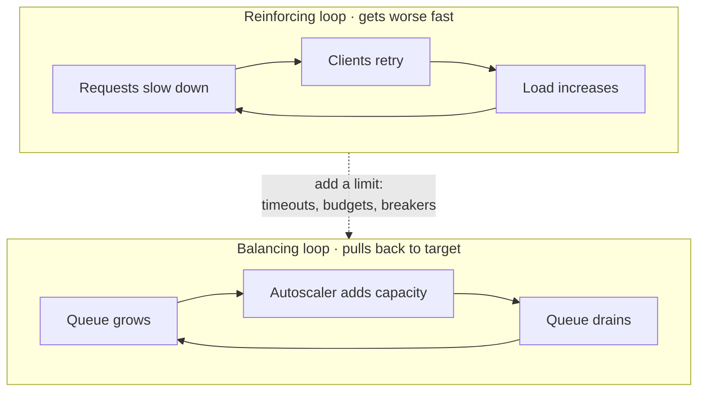

---

<!-- _class: list-steps -->

`The method · framing`

## Three questions turn a vague ask into a bounded problem.

1. Name the boundary
   - What is inside, what is outside, who owns each side.
2. Name the environment
   - What arrives uninvited: load, failures, adversaries, rules.
3. Name the constraints
   - Physical, economic, human, regulatory — as numbers where numbers exist.

---

<!-- _class: list-steps -->

`The method · deciding`

## Three more turn a bounded problem into a design.

1. Name the invariants
   - The sentences that must never go false, and how you would notice.
2. Choose the solution type
   - An MVP and an optimal build are different answers to the same words.
3. Find the bottleneck
   - One resource limits the whole; everything else is decoration until it moves.

---

<!-- _class: divider numbered -->

`Part two`

## Model a Tuesday before you model a datacenter.

---

<!-- _class: content -->

`The worked example`

## You already run a system with hard constraints and a real bottleneck.

Your day has inputs you do not choose, a boundary you defend badly, constraints you never wrote down, and at least one queue that keeps growing. Modeling it takes ten minutes and teaches every move you will use on a distributed system.

We will do it once, in full, and then name what transfers.

---

<!-- _class: diagram -->

`Step one · draw the process`

## A day is a pipeline with one shared resource and no admission control.

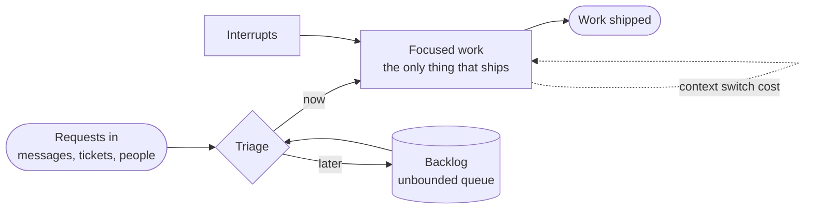

---

<!-- _class: list-tabular def -->

`Step two · name the parts`

## Four questions describe a day exactly as they describe a datacenter.

1. Elements
   - Your attention, your calendar, your inbox, your colleagues, your tools.
2. Boundary
   - What you can decline is inside. What you must answer is outside.
3. Environment
   - Meetings you did not book, outages, a manager's priorities, your own energy curve.
4. Purpose
   - What the day is actually for, stated as one outcome rather than a task list.

---

<!-- _class: cards-grid four -->

`Step three · name the constraints`

## Four limits shape every day, and only one of them is time.

- Attention
  - Roughly four hours of deep work exist per day. Physical, not negotiable.
- Switching
  - Every interrupt costs the reload, not just the interruption.
- Dependency
  - Work blocked on a review moves at someone else's pace.
- Energy
  - Capacity is not flat. The same task costs more at 5pm than at 9am.

> Only one of these is measured in hours, which is why a calendar never fixes a day.

---

<!-- _class: big-number -->

`Step four · the bottleneck`

- 4h
  - of deep work per day, versus the 8 hours a calendar sells you. Everything else queues behind it.

---

<!-- _class: diagram -->

`Step five · find the loop`

## Bad days repeat because the system is wired to reinforce them.

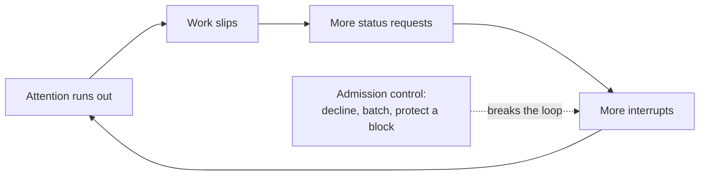

---

<!-- _class: split-panel proof -->

`Step six · state the invariant`

## An invariant on your day reads exactly like one on a service.

*What must never go false?* "One protected block of two hours exists every working day." It survives a busy week, a launch, and a manager's reorganized calendar — or it was never an invariant, only a preference.

- You know you're here when
  - You can name the alert: the day the block disappears, something is wrong.
- It constrains other people
  - A real invariant changes what others may put on your calendar.
- It is falsifiable
  - You can look at last week and say plainly whether it held.

---

<!-- _class: list-steps capsule -->

`The transferable method`

## Five moves model anything, from a Tuesday to a global service.

1. Draw the process
   - Inputs, transformation, outputs, and every queue between them.
2. Name the boundary
   - Split what you control from what you only negotiate with.
3. Measure the constraints
   - Write each limit as a number, even a rough one.
4. Find the bottleneck and the loop
   - One resource is scarce; one feedback loop makes it worse.

---

<!-- _class: content -->

`What transfers`

## Every move you just made has a direct counterpart in software.

The backlog is an unbounded queue. Interrupts are context switches. Declining work is admission control. A protected block is a reserved resource pool. The energy curve is a system that performs differently under sustained load than in a benchmark.

Nothing about the method changes when the parts become machines. Only the units do.

---

<!-- _class: divider numbered -->

`Part three`

## "Design Instagram" is five different questions.

---

<!-- _class: quote bare -->

> Premature optimization is the root of all evil. Yet we should not pass up our opportunities in that critical three percent.

*Donald Knuth, 1974 — usually quoted with the second sentence removed*

---

<!-- _class: content -->

`The framing question`

## Before you design anything, ask which kind of answer is wanted.

The same words — "design a photo sharing app" — have five legitimate answers that share almost no architecture. An MVP that takes a week and a specialized build that takes two years are both correct, for different questions.

Getting this wrong is the most expensive mistake in the room, and it happens before a single box is drawn.

---

<!-- _class: premise -->

## Five kinds of solution, and each one is right somewhere.

Each rung costs more, commits harder, and buys a different thing. You move up only when the rung below stops paying.

1. MVP
   - Buys information fast.
   - Does anyone want this?
2. Scaled
   - Holds up as load grows.
   - Will it survive success?
3. Optimized
   - Cuts cost on a known path.
   - Where is the money going?
4. Optimal
   - Provably best, for one model.
   - What is the real limit?
5. Specialized
   - An advantage nobody can copy.
   - What can only we do?

---

<!-- _class: split-panel proof -->

`Type one · MVP`

## An MVP is an experiment wearing a product's clothes.

*Does anyone want this?* Its job is to produce a decision, not to last. Every hour spent making it durable is an hour spent on a system you may correctly delete next month.

- You know you're here when
  - The riskiest thing is demand, not scale, and a wrong answer is cheap.
- Buy simplicity, not capacity
  - One database, one service, one region, boring technology, no cleverness.
- The exit is planned
  - Name in advance the metric that means "stop, this must now be built properly."

---

<!-- _class: split-panel proof -->

`Type two · Scaled`

## A scaled system survives ten times the load without a rewrite.

*Will it survive success?* You are no longer buying information; you are buying headroom. The design question shifts from "does it work" to "what breaks first, and how do I move that limit."

- You know you're here when
  - Growth is real and the current design has a limit you can name.
- Add axes, not machines
  - Statelessness, partitioning, caching and queues buy scale. A bigger box only postpones.
- Cost per unit matters now
  - Cost per request stops being noise and starts being the second constraint.

---

<!-- _class: split-panel proof -->

`Type three · Optimized`

## Optimizing means moving one measured number on one known path.

*Where is the cost actually going?* Optimization without a profile is decoration. You need the measurement first, the target second, and the willingness to accept the complexity you are about to add.

- You know you're here when
  - A profile shows which tenth of the work is most of the cost.
- The path must be hot
  - Optimizing a path that runs twice a day avoids the real problem.
- Complexity is the price
  - Each optimization narrows the assumptions the system may safely break.

---

<!-- _class: split-panel proof -->

`Type four · Optimal`

## Optimal means provably best against an objective you wrote down.

*What is the actual limit?* This is a rarer thing than it sounds. It requires a stated objective, a stated model, and a proof or a bound — and it is only optimal for the assumptions you fixed.

- You know you're here when
  - The objective is written as a function and the constraints are written as inequalities.
- The proof is against a model
  - Change the assumptions and the optimal answer changes with them.
- It ages badly
  - An optimal design pinned to last year's hardware is a legacy system with a certificate.

---

<!-- _class: split-panel capstone -->

`Type five · Specialized`

## A specialized system trades generality for an advantage nobody can copy.

*What can only we do?* Custom silicon, a purpose-built storage engine, a physics-aware scheduler. You give up flexibility, portability and hiring pool in exchange for a capability the market cannot buy.

- The signal
  - The advantage is durable, measurable, and central to why customers choose you.
- The cost is permanent
  - You now maintain what everyone else gets for free from a vendor.
- Almost nobody is here
  - Most teams reaching for this rung actually needed the optimized one.

---

<!-- _class: compare-table -->

`The ladder, compared`

## Each rung buys a different thing, and charges for it differently.

| Type | Buys | Costs | Reversible |
| --- | --- | --- | --- |
| MVP | Information | Almost nothing | Fully |
| Scaled | Headroom | Design effort | Mostly |
| Optimized | Cost or latency | Complexity | Partly |
| Optimal | A proven bound | Rigor and assumptions | Rarely |
| Specialized | An advantage | Permanent maintenance | No |

*Move up one rung at a time, and only when the rung you are on has stopped paying.*

---

<!-- _class: matrix-2x2 -->

`When to climb`

## Two questions decide which rung you belong on.

- **Low uncertainty · Low cost of error.**
  - Ship the MVP
  - Learn from real usage
- **Low uncertainty · High cost of error.**
  - Optimize or prove optimal
  - The path is known and expensive
- **High uncertainty · Low cost of error.**
  - Always the MVP
  - Buy information before capacity
- **High uncertainty · High cost of error.**
  - Reduce uncertainty first
  - Prototype, model, measure, then build

---

<!-- _class: decision -->

`The rule`

## Climb the ladder one rung at a time, and never skip on a hunch.

- Move up when the current rung fails on evidence
  - A measured limit, a real cost, a named risk — not an anticipated one.
- Move up one rung only
  - Skipping from MVP to optimal buys rigor for assumptions you have not yet tested.
- Move back down when the evidence changes
  - A rewrite that simplifies is a legitimate move, not an admission of failure.

---

<!-- _class: divider numbered -->

`Part four`

## Six kits, to keep for the rest of your career.

---

<!-- _class: content -->

`How to read a kit`

## Every kit entry answers the same three questions, on purpose.

Reach for it when. Walk away when. The constraint you inherit. One shape for every entry, so you can compare two options without re-reading a manual. Each kit then closes with the invariants that hold across all of its entries.

The entries name concepts, not products. Products change every three years; the constraint an append-only store puts on your reads does not.

---

<!-- _class: divider -->

`Kit one`

## Data: where state lives, and what that costs you.

---

<!-- _class: premise -->

## Five questions pick a data store, and the product name comes last.

Answer these before naming a technology. Most arguments about databases are really disagreements about question two.

1. Shape
   - How the data is structured.
   - Rows, documents, or edges?
2. Access
   - How it is read and written.
   - Lookups, ranges, or scans?
3. Consistency
   - What a reader may see.
   - Must it be the latest?
4. Scale
   - Size, throughput, growth.
   - Does it fit one machine?
5. Cost
   - Money, operations, skill.
   - Who runs it at 3am?

---

<!-- _class: diagram -->

`The decision tree`

## Access pattern picks the store; the data's shape only narrows the field.

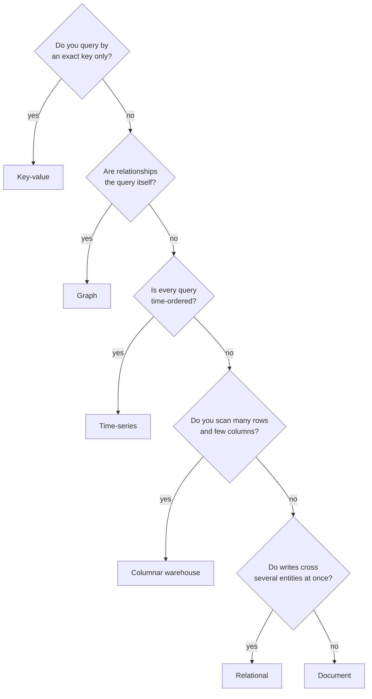

---

<!-- _class: cards-stack -->

`Data kit · Relational`

## A relational store is the default until you can name why it is not.

- Reach for it when
  - Entities relate, writes touch several at once, and the questions will change.
- Walk away when
  - One table outgrows one machine's writes, or the schema genuinely differs per row.
- The constraint you inherit
  - Joins and transactions assume a single coordinator. Sharding gives up both.

---

<!-- _class: cards-stack -->

`Data kit · Key-value`

## A key-value store is a hash map with an operations team.

- Reach for it when
  - You always know the exact key, and you need microseconds rather than milliseconds.
- Walk away when
  - You need to ask any question about the value's contents.
- The constraint you inherit
  - No secondary access path. Every new query means a new key you must write yourself.

---

<!-- _class: cards-stack -->

`Data kit · Document`

## A document store trades joins for keeping one object whole.

- Reach for it when
  - Reads fetch one self-contained object and the shape varies between records.
- Walk away when
  - The same fact appears in many documents and must stay consistent across them.
- The constraint you inherit
  - Denormalized copies. Every update is a fan-out you now own.

---

<!-- _class: cards-stack -->

`Data kit · Wide-column`

## A wide-column store buys enormous write throughput with a fixed query shape.

- Reach for it when
  - Writes are relentless, and every read is a partition key plus a sorted range.
- Walk away when
  - Query patterns are still moving, or you need cross-partition transactions.
- The constraint you inherit
  - The primary key is the schema. Changing how you query means rewriting the data.

---

<!-- _class: cards-stack -->

`Data kit · Graph`

## A graph store is for questions that traverse, not questions that filter.

- Reach for it when
  - The query walks relationships of unknown depth: reachability, paths, recommendations.
- Walk away when
  - You have relationships but only ever join two hops. A relational store does that faster.
- The constraint you inherit
  - Traversals are hard to partition, so scale-out is genuinely harder here than elsewhere.

---

<!-- _class: content -->

`Halfway through the data kit`

## The five stores above can hold truth. The seven below mostly borrow it.

A relational, key-value, document, wide-column or graph store can be the place a fact lives. The rest — search, vector, cache, warehouse, log — are almost always derived from one of those, and that changes how you treat them.

Anything derived must be rebuildable, must be allowed to lag, and must never be the only copy.

---

<!-- _class: cards-stack -->

`Data kit · Time-series`

## A time-series store assumes time is the primary key and never changes.

- Reach for it when
  - Appends dominate, records are immutable, and every read has a time range.
- Walk away when
  - Records get updated, or the interesting axis is anything other than time.
- The constraint you inherit
  - Retention and downsampling become design decisions, not settings.

---

<!-- _class: cards-stack -->

`Data kit · Search index`

## A search index is a derived view, never a source of truth.

- Reach for it when
  - Users query text they typed, and ranking and relevance matter more than exactness.
- Walk away when
  - The result must be transactionally correct at the instant it is read.
- The constraint you inherit
  - It lags. Every search index is eventually consistent with whatever feeds it.

---

<!-- _class: cards-stack -->

`Data kit · Vector index`

## A vector index answers "most similar to this", not "equal to this".

- Reach for it when
  - Retrieval is by meaning: semantic search, recommendations, grounding a model's answer.
- Walk away when
  - An exact filter or a keyword match would do. It is slower and approximate.
- The constraint you inherit
  - Results are approximate by construction, and the embedding model becomes part of your schema.

---

<!-- _class: cards-stack -->

`Data kit · Object store`

## An object store is the cheapest durable place to put large immutable bytes.

- Reach for it when
  - Items are large, written once, read by key, and must survive for years.
- Walk away when
  - You need to modify part of an object, or list and filter by content.
- The constraint you inherit
  - Listing is slow and expensive. The index of what you stored belongs somewhere else.

---

<!-- _class: cards-stack -->

`Data kit · Cache`

## A cache is a bet that the same answer will be wanted again soon.

- Reach for it when
  - Reads repeat, the source is expensive, and slightly stale is acceptable.
- Walk away when
  - Staleness is unsafe, or the working set is larger than the cache.
- The constraint you inherit
  - Invalidation. A cache converts a correctness problem into a timing problem.

---

<!-- _class: cards-stack -->

`Data kit · Log and queue`

## A durable log turns "do it now" into "do it reliably, soon."

- Reach for it when
  - Producers outpace consumers, or several systems need the same events.
- Walk away when
  - The caller needs the result in the same request.
- The constraint you inherit
  - At-least-once delivery. Every consumer must be idempotent or you will double-charge someone.

---

<!-- _class: cards-stack -->

`Data kit · Columnar warehouse`

## A warehouse is built to scan billions of rows and read four columns.

- Reach for it when
  - Questions are aggregate, analysts write them, and minutes are an acceptable answer time.
- Walk away when
  - A user is waiting for the result, or you need single-row updates.
- The constraint you inherit
  - It is loaded from somewhere else, so it is always behind the operational store.

---

<!-- _class: compare-table -->

`The scan table`

## Five columns compare any two stores you are choosing between.

| Store | Access | Consistency | Scales by | Weak at |
| --- | --- | --- | --- | --- |
| Relational | Key, range, join | Strong | Vertical, read replicas | Cross-shard writes |
| Key-value | Exact key | Tunable | Horizontal | Any other query |
| Document | Key, secondary index | Per document | Horizontal | Cross-document facts |
| Wide-column | Partition plus range | Tunable | Horizontal | New query patterns |
| Object store | Key | Read-after-write | Effectively unbounded | Listing, partial updates |

---

<!-- _class: diagram -->

`The theorem everyone misquotes`

## CAP is a choice you make during a partition, and only then.

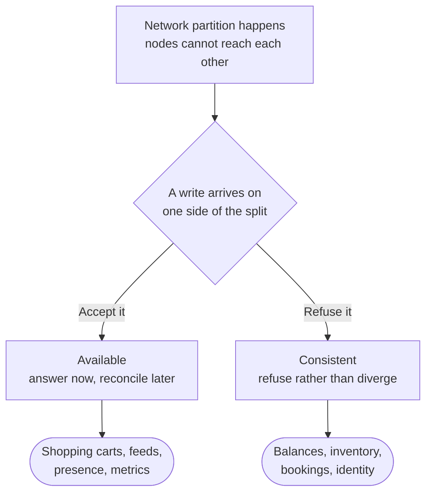

---

<!-- _class: compare-prose -->

`The everyday version`

## PACELC is the more useful theorem, because partitions are rare and latency is not.

- During a partition
  - Choose availability or consistency. This is CAP, and it applies for the few minutes a year a link is actually broken.
- In normal operation
  - Choose latency or consistency. Every replicated write pays a round trip to be safe, and that is the choice you make a billion times a day.

---

<!-- _class: list-tabular -->

`The consistency ladder`

## Consistency is a ladder, not a switch, and each rung has a price.

1. Linearizable
   - The latest write, always. Costs a round trip.
2. Sequential
   - One shared order, possibly behind. Cheaper.
3. Causal
   - Related events ordered, unrelated ones maybe not.
4. Read your writes
   - You see your own edits. The minimum.
5. Eventual
   - Replicas converge in the end. Cheapest.

---

<!-- _class: compare-prose axis -->

`Two transaction philosophies`

## ACID and BASE are not rivals; they are answers to different questions.

Both are correct. The question is whether the cost of being briefly wrong is higher than the cost of coordinating.

1. ACID
   - Coordinate first, so the data is never observably wrong. Pay in latency and in a limit on how far you can partition.
2. BASE
   - Accept divergence, converge afterwards. Pay in application complexity: every reader must tolerate stale or conflicting state.

---

<!-- _class: split-panel proof -->

`Data kit · Indexes`

## An index is a second copy of your data, sorted for one question.

*What does it really cost?* Indexes make reads fast by making writes slower and storage larger. Every index is a promise to maintain a sorted structure on every single write, forever.

- You know you're here when
  - You can name the exact query each index exists to serve.
- The cost is on writes
  - Five indexes mean five extra structures updated per insert.
- Selectivity decides
  - An index over a column with three distinct values will be ignored.

---

<!-- _class: diagram -->

`Partitioning`

## Sharding buys throughput by giving up the questions that cross shards.

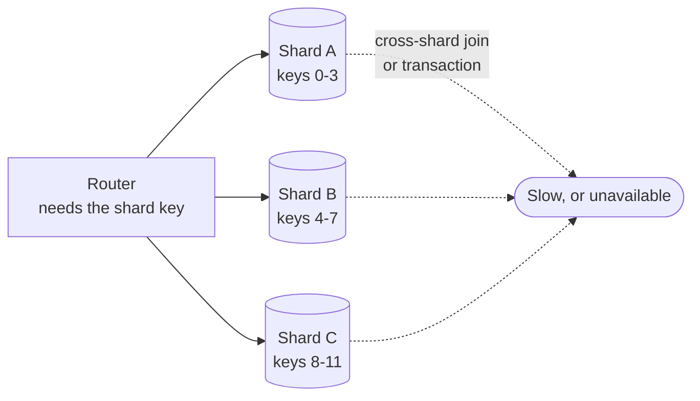

---

<!-- _class: cards-grid three -->

`Choosing a shard key`

## The shard key is the hardest decision, and the one you cannot undo cheaply.

- By hash of the key
  - Spreads load evenly, destroys range queries. The safe default.
- By range
  - Keeps ranges fast, invites hot spots on the newest range.
- By tenant or region
  - Matches the access pattern and the law, until one tenant grows enormous.

> A skewed shard key produces a system where one machine is on fire and the rest idle.

---

<!-- _class: diagram -->

`Replication`

## Replication topology decides what you lose when a machine dies.

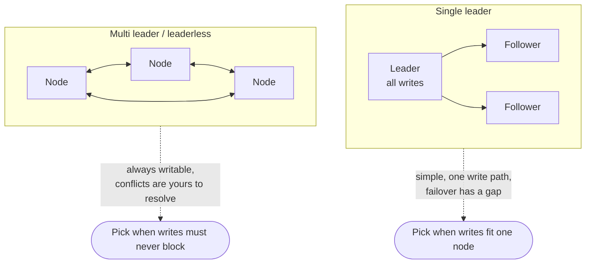

---

<!-- _class: compare-table -->

`Isolation`

## Isolation levels name exactly which anomaly you have agreed to tolerate.

| Level | Prevents | Still allows | Typical use |
| --- | --- | --- | --- |
| Read committed | Dirty reads | Non-repeatable reads | The common default |
| Repeatable read | Non-repeatable reads | Phantoms, write skew | Reports inside a transaction |
| Snapshot | Most read anomalies | Write skew | Read-heavy applications |
| Serializable | Everything | Nothing, at a cost | Money, inventory, bookings |

*Read committed is the default in most systems, which means most applications tolerate anomalies they never chose.*

---

<!-- _class: list-criteria -->

`Data invariants`

## Four sentences should hold in any data design you ship.

1. Exactly one source of truth per fact
   - Every other copy is derived, and is labeled as derived.
2. Every derived store can be rebuilt
   - If the search index burns down, a job restores it from the source.
3. Every consumer of a queue is idempotent
   - At-least-once delivery is the only delivery you actually get.
4. Every write path has a stated consistency level
   - "Whatever the database does by default" is not a stated level.

---

<!-- _class: divider -->

`Kit two`

## Compute: where work happens, and who owns the machine.

---

<!-- _class: diagram -->

`The compute ladder`

## Every rung hands more of the machine to someone else, and takes flexibility back.

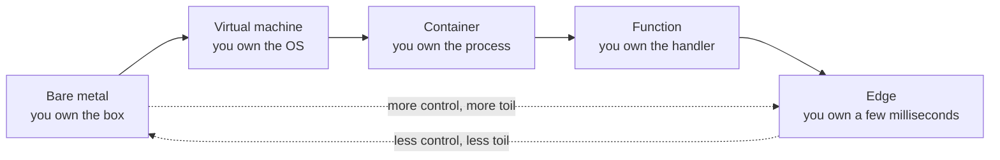

---

<!-- _class: cards-stack -->

`Compute kit · Virtual machines`

## A virtual machine is the unit you reach for when the process is long-lived.

- Reach for it when
  - The workload runs continuously, holds state in memory, or needs unusual kernel settings.
- Walk away when
  - Traffic is spiky and idle machines dominate the bill.
- The constraint you inherit
  - You now own patching, capacity planning, and the difference between staging and production.

---

<!-- _class: cards-stack -->

`Compute kit · Containers`

## A container makes the deployable unit identical everywhere it runs.

- Reach for it when
  - You run many services, deploy often, and want one packaging story across all of them.
- Walk away when
  - You have one small service. An orchestrator costs more than it saves at that size.
- The constraint you inherit
  - The orchestrator becomes infrastructure, with its own failure modes and its own on-call.

---

<!-- _class: cards-stack -->

`Compute kit · Functions`

## A function is compute you rent by the millisecond and cannot keep warm.

- Reach for it when
  - Traffic is spiky or rare, work is short, and per-request isolation is welcome.
- Walk away when
  - Latency floors matter, runs are long, or steady traffic makes per-request pricing expensive.
- The constraint you inherit
  - Cold starts and no local state. Every connection pool is rebuilt or externalized.

---

<!-- _class: cards-stack -->

`Compute kit · Edge`

## Edge compute buys distance, and pays for it in capability.

- Reach for it when
  - The work is small, the user is far away, and the round trip is the cost.
- Walk away when
  - The work needs your database, which is not at the edge.
- The constraint you inherit
  - Tight memory and time limits, a restricted runtime, and data that is far from the code.

---

<!-- _class: compare-prose -->

`The property that decides everything`

## Statelessness is not a style; it is what makes a machine replaceable.

- Stateful services
  - The instance holds something no other instance has: a session, a lock, a cache, a connection. Scaling means moving state, and failure means losing it.
- Stateless services
  - Any instance can serve any request because the state lives elsewhere. Scaling is arithmetic, and failure is a routing change.

---

<!-- _class: compare-prose transition -->

`Two ways to process`

## Batch and stream are the same computation with different latency budgets.

- Batch
  - Collect, then process a bounded set on a schedule. Simple to reason about, easy to re-run, and always behind by one interval.
- Stream
  - Process each event as it arrives, holding windows and watermarks. Fresh answers, at the cost of handling late and out-of-order events forever.

---

<!-- _class: list-criteria -->

`Compute invariants`

## Anything you run should satisfy these four claims.

1. Any instance can be killed without a customer noticing
   - If that is false, you have hidden state you have not named.
2. Deployments are reversible
   - A rollback is a routine operation, not an incident response.
3. Capacity is a number someone owns
   - Not "it autoscales" — the ceiling, the cost, and who is paged when it is hit.
4. Startup does not depend on startup order
   - Services retry into each other rather than requiring a sequence.

---

<!-- _class: divider -->

`Kit three`

## Network: distance is a cost you cannot optimize away.

---

<!-- _class: list-tabular metric -->

`The numbers to memorize`

## Five numbers explain most latency arguments before they start.

1. L1 cache read
   - 1 ns
2. Main memory read
   - 100 ns
3. Flash random read
   - 0.1 ms
4. Datacenter hop
   - 0.5 ms
5. Cross-continent hop
   - 150 ms

---

<!-- _class: content -->

`Why the numbers matter`

## Light in fiber travels about 200 kilometers per millisecond, and that is final.

No caching layer, protocol version, or vendor changes it. A design that requires three sequential round trips between continents has a floor near half a second before it has executed a single instruction.

This is why replication, caching and edge delivery exist. All three are ways of buying distance, and none of them makes distance free.

---

<!-- _class: diagram -->

`The request path`

## Four hops sit between a tap and your service, and each one can fail.

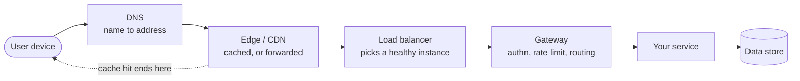

---

<!-- _class: cards-stack -->

`Network kit · DNS`

## DNS is the first request, the slowest to change, and a real dependency.

- Reach for it when
  - You need a stable name in front of an address that will change.
- Walk away when
  - You need failover in seconds. Caches downstream ignore your intentions.
- The constraint you inherit
  - TTL is a promise about the past. Old answers stay in resolvers you cannot reach.

---

<!-- _class: cards-stack -->

`Network kit · CDN`

## A CDN moves bytes closer to readers and moves nothing else.

- Reach for it when
  - Content is large, popular, and the same for many users.
- Walk away when
  - Every response is personalized and cacheable for nobody but one person.
- The constraint you inherit
  - Purging is eventual. Versioned URLs beat invalidation every time.

---

<!-- _class: compare-prose -->

`Two ways to balance load`

## A layer-four balancer moves packets; a layer-seven balancer reads requests.

- Layer four
  - Routes by address and port without looking inside. Very fast, protocol agnostic, and blind to what the request actually asks for.
- Layer seven
  - Parses the request, so it can route by path, retry safely, split traffic and terminate encryption. More capable, more expensive, and now it is a system with opinions.

---

<!-- _class: compare-table -->

`API styles`

## Four API styles, and the one question that separates them.

| Style | Best at | Weak at | Choose when |
| --- | --- | --- | --- |
| REST | Cacheable resources | Chatty multi-entity reads | Public, resource-shaped APIs |
| RPC | Typed internal calls | Browser reach, evolution | Service-to-service traffic |
| GraphQL | Client-shaped queries | Caching, cost control | Many clients, one backend |
| Streaming | Continuous updates | Simplicity, statelessness | Live feeds and progress |

---

<!-- _class: split-panel proof -->

`Network kit · Timeouts`

## A request without a timeout is a resource leak waiting for a bad day.

*What does an unbounded wait actually cost?* Every waiting request holds a connection, a thread and memory. Under a slow dependency, unbounded waits convert one slow service into a total outage.

- You know you're here when
  - Every outbound call has a deadline, and the deadline shrinks as it propagates.
- Retries need a budget
  - Retrying without a cap turns a brief failure into a self-inflicted flood.
- Backoff must be random
  - Synchronized retries arrive together and rebuild the exact spike you just survived.

---

<!-- _class: list-criteria -->

`Network invariants`

## A call that leaves your process owes you four promises.

1. Every remote call has a deadline
   - Inherited from the caller, and always shorter than the caller's own.
2. Every retry has a budget and jitter
   - Bounded attempts, randomized delays, and a breaker when the target is down.
3. Every write is idempotent or keyed
   - The network will deliver your request twice. Decide now what that means.
4. Distance appears in the design
   - Round trips between regions are counted, not discovered in production.

---

<!-- _class: divider -->

`Kit four`

## Scale: four moves, and knowing which one the bottleneck needs.

---

<!-- _class: premise -->

## There are only four ways to make a system handle more.

Everything else is a variation. When someone proposes a scaling change, ask which of these four it is, and which bottleneck it moves.

1. Reduce
   - Do less work per request.
   - Can this be reused?
2. Spread
   - Split work across machines.
   - Can this be partitioned?
3. Defer
   - Move work out of the request.
   - Must this happen now?
4. Duplicate
   - Copy data closer to readers.
   - Are reads the pressure?

---

<!-- _class: math -->

`The one formula to memorize`

## Concurrency, throughput and latency are one equation, not three numbers.

$$ L = \lambda W $$

- $L$ — requests in the system at once (concurrency)
- $\lambda$ — arrival rate (requests per second)
- $W$ — time each request spends inside (latency)

---

<!-- _class: content -->

`Using it`

## The formula tells you the thread pool size before you guess it.

At 2,000 requests per second with an average of 50 milliseconds each, 100 requests are in flight at any moment. That is your minimum concurrency, and no amount of tuning makes it smaller while both other numbers hold.

It also explains the failure: if latency triples during an incident, concurrency triples too, and a pool sized for the good case is now the outage.

---

<!-- _class: split-panel proof -->

`Scale kit · Tail latency`

## The average request is a fiction; users live in the tail.

*Why does a fast service feel slow?* A page that makes 100 parallel calls waits for the slowest. With a one-percent chance of a slow call, roughly two thirds of pages hit at least one.

- You know you're here when
  - You report the 99th percentile, not the mean, and you report it per dependency.
- Fan-out amplifies it
  - More parallel calls make a rare slow response into a common slow page.
- Hedging buys it back
  - Send a duplicate request after the 95th percentile and take whichever answers first.

---

<!-- _class: diagram -->

`Scale kit · Caching`

## A cache exists at every layer, and each one lies to you differently.

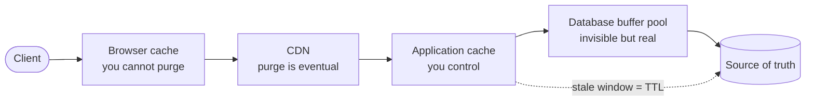

---

<!-- _class: cards-grid four -->

`Cache strategies`

## Four caching patterns, and the failure each one owns.

- Cache-aside
  - The app fills the cache on a miss. Simple, and stampedes on a cold key.
- Read-through
  - The cache fetches for you. Cleaner code, and the cache is now on the critical path.
- Write-through
  - Write both together. Always fresh, and every write pays the cache's latency.
- Write-behind
  - Write the cache, flush later. Fastest writes, and a crash loses them.

> Choose by which failure you can survive, not by which pattern reads best in code.

---

<!-- _class: diagram -->

`Scale kit · Consistent hashing`

## Consistent hashing exists so adding a machine does not move all the keys.

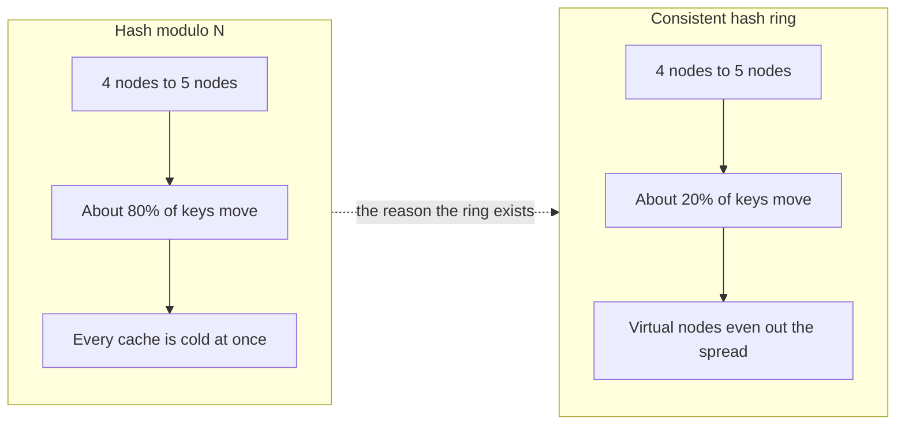

---

<!-- _class: split-panel proof -->

`Scale kit · Idempotency`

## Idempotency is what makes a retry safe, and retries are not optional.

*What happens when the same request arrives twice?* Networks duplicate. Clients retry. Queues redeliver. The only question is whether the second delivery is harmless or charges a customer again.

- You know you're here when
  - Every mutating endpoint takes a client-supplied key and deduplicates on it.
- The key comes from the caller
  - Generated before the first attempt, reused on every retry of that same intent.
- Store the result, not just the fact
  - A repeat must return the original answer, not an error saying it already happened.

---

<!-- _class: cards-stack -->

`Scale kit · Rate limiting`

## A rate limit protects the system from its users, and from itself.

- Reach for it when
  - Any shared resource can be exhausted by one caller, deliberately or accidentally.
- Walk away when
  - The limit is applied so late that the work is already done when you reject.
- The constraint you inherit
  - Limits are per-key state, so a distributed limiter is itself a consistency problem.

---

<!-- _class: compare-prose -->

`The oldest question`

## Scaling up is faster to do; only scaling out keeps working.

- Vertical, a bigger machine
  - No code changes, no distribution, no new failure modes. It works until the largest machine is not large enough, and it never removes the single point of failure.
- Horizontal, more machines
  - Unbounded headroom and real redundancy, bought with partitioning, coordination and a distributed system's whole class of new bugs.

---

<!-- _class: list-criteria -->

`Scale invariants`

## Check these four before calling any design scalable.

1. The bottleneck is named and measured
   - Not suspected. A number, a graph, and the resource it belongs to.
2. Every queue is bounded
   - An unbounded queue converts a throughput problem into a memory outage.
3. Load sheds before it collapses
   - The system rejects work at the edge rather than failing everywhere at once.
4. Adding a machine is a routine act
   - No manual steps, no rebalancing outage, no cold cache stampede.

---

<!-- _class: divider -->

`Kit five`

## Reliability: failure is the environment, not an exception.

---

<!-- _class: diagram -->

`Failure domains`

## Redundancy only helps when the copies fail independently.

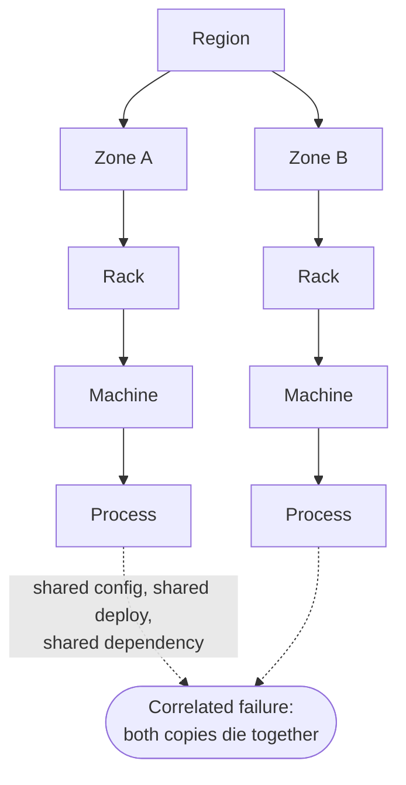

---

<!-- _class: list-steps -->

`Reliability kit · Containment`

## Four mechanisms stop one failure from becoming every failure.

1. Timeout
   - Bound how long you wait, so a slow dependency cannot hold your resources.
2. Retry with backoff
   - Recover from a blip, with a budget and jitter so you do not amplify it.
3. Circuit breaker
   - Stop calling a service that is clearly down, and let it recover.
4. Bulkhead
   - Give each dependency its own pool, so one queue cannot drain them all.

---

<!-- _class: list-tabular def -->

`Reliability kit · Objectives`

## Four terms, often confused, that decide what you are allowed to ship.

1. Indicator
   - The SLI: the share of requests served under 300 milliseconds.
2. Objective
   - The SLO: your internal target, such as 99.9 percent over 28 days.
3. Agreement
   - The SLA: the external promise, with money attached and always looser.
4. Budget
   - What the objective lets you spend. Exhausted, feature work stops.

---

<!-- _class: list-tabular metric -->

`What the nines cost`

## Availability targets are budgets, and the budget shrinks fast.

1. 99 percent
   - 3.65 days down per year
2. 99.9 percent
   - 8.8 hours per year
3. 99.99 percent
   - 52 minutes per year
4. 99.999 percent
   - 5.3 minutes per year

---

<!-- _class: content -->

`Reading that table`

## Past three nines, the humans stop being fast enough.

Fifty-two minutes a year is less than one incident with a page, a login, a look at a dashboard and a decision. Four nines therefore means automatic failover and automatic rollback, not a faster on-call engineer.

Each nine roughly multiplies cost. Pick the number the business actually needs, and write down what you are not buying.

---

<!-- _class: cards-grid three -->

`Reliability kit · Observability`

## Three signals answer three different questions; none of them replaces the others.

- Metrics
  - Cheap, aggregate, always on. Tells you that something is wrong.
- Logs
  - Detailed, expensive, per event. Tells you what happened in one case.
- Traces
  - One request across every service. Tells you where the time went.

> If you cannot answer "which dependency is slow" in one minute, you have metrics but not observability.

---

<!-- _class: split-panel proof -->

`Reliability kit · Degradation`

## A well-designed system gets worse in an order you chose.

*What do you drop first?* Under pressure something must give. Either you decided in advance which features degrade, or the system decides at random and drops the checkout page.

- You know you're here when
  - Every feature has a stated tier, and the lowest tier fails first by design.
- Read paths outlive write paths
  - Serving stale data beats serving an error page for most products.
- The fallback is tested
  - An untested degraded mode is an untested code path in your worst hour.

---

<!-- _class: list-criteria -->

`Reliability invariants`

## Trust a system in production only when these four hold.

1. Every dependency has a defined failure behavior
   - Written down: degrade, queue, or fail fast. Never "we will see."
2. Redundant copies fail independently
   - Different zones, different deploys, different upstreams. Otherwise it is one copy.
3. Recovery is practiced
   - Restores, failovers and rollbacks are exercised on a schedule, not improvised.
4. The system tells you before the user does
   - Alerts fire on the indicator, not on the complaint.

---

<!-- _class: divider -->

`Kit six`

## Security: assume the boundary is already crossed.

---

<!-- _class: diagram -->

`Trust boundaries`

## Every arrow that crosses a trust boundary needs a check on the far side.

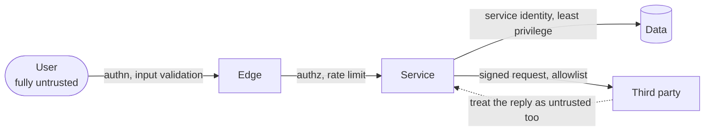

---

<!-- _class: compare-prose -->

`The pair everyone conflates`

## Authentication asks who you are; authorization asks what you may do.

- Authentication
  - Establishes identity once, at the edge, and hands down a verifiable claim. Getting it wrong lets the wrong person in.
- Authorization
  - Decides, on every single request, whether this identity may touch this specific object. Getting it wrong lets the right person read someone else's data.

---

<!-- _class: split-panel proof -->

`Security kit · Least privilege`

## Least privilege is measured by what a stolen credential can reach.

*How far does one compromise travel?* Assume any single credential will eventually leak. The design question is what an attacker holding it can do, and for how long.

- You know you're here when
  - You can state the blast radius of each service account in one sentence.
- Scope it and expire it
  - Narrow permissions, short lifetimes, and automatic rotation beat a careful human.
- Separate read from write
  - Most services need one or the other, and almost none need to delete.

---

<!-- _class: list-tabular def -->

`Security kit · Encryption`

## Encryption has three states, and the keys matter more than the algorithm.

1. In transit
   - TLS everywhere, including between your own services. Networks are untrusted.
2. At rest
   - Disk and backup encryption. Stops a stolen device, not a stolen credential.
3. In use
   - Decrypted in memory to be processed. The hardest state, and the one attacked.
4. Keys
   - A managed store or an HSM, rotated on a schedule, never in the repository.

---

<!-- _class: checklist -->

`Security kit · Threat modeling`

## Six questions find most of the holes before an attacker does.

- [x] Can someone pretend to be another identity? `spoofing`
- [x] Can data be changed in transit or at rest? `tampering`
- [x] Can an actor deny having done something? `repudiation`
- [x] Can private data leak to the wrong reader? `disclosure`
- [x] Can one caller exhaust a shared resource? `denial`
- [x] Can a caller gain rights they were not granted? `elevation`

---

<!-- _class: list-criteria -->

`Security invariants`

## Sign your name to a design only if these four are true.

1. Every request is authorized against the specific object
   - Not the endpoint. Object-level checks are where real breaches happen.
2. Secrets never enter the repository or a log line
   - They live in a managed store, are injected at runtime, and rotate.
3. All input is untrusted, including from your own services
   - A compromised internal caller is the ordinary case, not the exotic one.
4. Every privileged action is attributable
   - An immutable audit record naming who, what, when, and from where.

---

<!-- _class: divider numbered -->

`Part five`

## Two systems, designed end to end.

---

<!-- _class: list-steps -->

`The method · frame it`

## Three steps before a single box goes on the whiteboard.

1. Requirements
   - What it must do, what it must guarantee, and which solution type is wanted.
2. Estimates
   - Users, requests per second, bytes per day, and the read-to-write ratio.
3. Interfaces and data
   - The handful of API calls, and the entities behind them.

---

<!-- _class: list-steps -->

`The method · build it`

## Three steps that turn the frame into a defensible design.

1. Architecture
   - The components, the request path, and the store behind each one.
2. Bottleneck and tradeoff
   - Name the scarce resource, then name the choice you made and what it cost.
3. Failure modes
   - What breaks first, what degrades, and which invariants must survive.

---

<!-- _class: divider -->

`Design one`

## A photo feed at global scale.

---

<!-- _class: list-criteria -->

`Instagram · functional`

## Four operations carry the whole product.

1. Post a photo
   - Upload media, attach a caption, publish to followers.
2. Follow an account
   - Build the social graph that decides whose posts you see.
3. Read a feed
   - A ranked, paginated list of recent posts from accounts you follow.
4. React
   - Like and comment, with counts visible on every post.

---

<!-- _class: list-criteria -->

`Instagram · non-functional`

## Four guarantees decide the architecture more than the features do.

1. Feed loads in under 200 milliseconds
   - At the 99th percentile, on a mobile network, anywhere.
2. Reads dominate writes by about a hundred to one
   - Every design decision should favor the reader.
3. Media is durable forever
   - A lost photo is unrecoverable and unforgivable. Metadata can be rebuilt.
4. Eventual consistency is acceptable on the feed
   - A post appearing a few seconds late is fine. A missing like count is not.

---

<!-- _class: list-tabular metric -->

`Instagram · envelope`

## Five numbers, and the architecture is already half decided.

1. Daily active users
   - 500 M
2. Photos per day
   - 100 M
3. Average writes
   - 1.2 K per second
4. Peak feed reads
   - 200 K per second
5. Media stored daily
   - 200 TB

---

<!-- _class: content -->

`Reading the envelope`

## The ratio, not the totals, is what the design has to answer.

Two hundred thousand reads against twelve hundred writes is a hundred-to-one product. That single ratio says: precompute the feed, cache aggressively, and pay whatever the write path costs to make the read path trivial.

The storage numbers say something else. Two hundred terabytes a day of immutable media belongs in an object store, and never in a database.

---

<!-- _class: code -->

`Instagram · the interface`

## Eight endpoints, and one pagination choice that stops duplicates.

```http
POST   /v1/media          -> { upload_url, media_id }   # presigned, direct to blob
POST   /v1/posts          { media_id, caption }         # Idempotency-Key required
GET    /v1/feed?cursor=   -> { items[], next_cursor }   # cursor, never offset
GET    /v1/posts/{id}     -> { post, media, counts }    # single post, cache friendly
GET    /v1/users/{id}/posts?cursor=                     # profile grid, same cursor
POST   /v1/posts/{id}/like                              # idempotent by (user, post)
POST   /v1/follows        { target_id }                 # idempotent by (user, target)
DELETE /v1/posts/{id}                                   # tombstone, feeds filter it
```

*A cursor encodes the last item seen. An offset renumbers itself every time somebody posts, so page two repeats what page one already showed.*

---

<!-- _class: diagram -->

`Instagram · the data`

## Six entities, and the one you read from is not a source of truth.

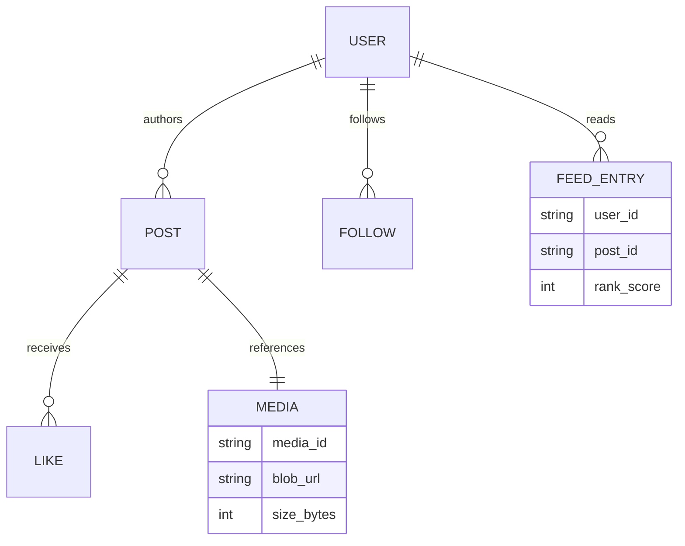

*FEED_ENTRY is the precomputed feed, held in cache and rebuildable from POST. Everything else is stored.*

---

<!-- _class: diagram -->

`Instagram · the architecture`

## The write path does the work so the read path stays a lookup.

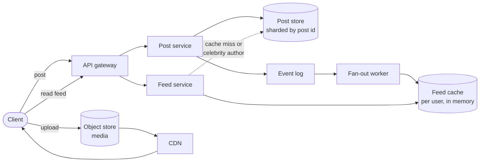

---

<!-- _class: compare-prose -->

`Instagram · the central tradeoff`

## Fan-out on write and fan-out on read fail at opposite ends of one graph.

- Fan-out on write
  - Push each post into every follower's feed when it is published. Reads become one lookup, and a celebrity turns one post into 50 million writes.
- Fan-out on read
  - Assemble the feed at request time from the accounts you follow. Writes are trivial, and every read now costs hundreds of queries.

---

<!-- _class: split-compare -->

`Decision`

## Use both, and let follower count choose between them.

The two strategies fail in opposite directions, so the design uses each where the other breaks.

- Pick one strategy for everyone
  - Simple to build and simple to explain. It is also guaranteed to fail at one end: write fan-out drowns on celebrities, read fan-out blows the latency budget for everyone.
- Hybrid, split at a follower threshold
  - Push from ordinary accounts, pull from high-follower accounts, merge at read time. Two code paths instead of one, and the threshold becomes a tuning knob you own forever.

> Fan out on write below the threshold, pull at read above it, and merge in the feed service.

---

<!-- _class: diagram -->

`Instagram · media`

## Media never touches your API servers, in either direction.

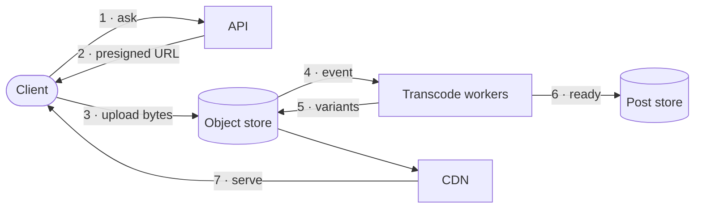

---

<!-- _class: cards-grid four -->

`Instagram · where it breaks`

## Four failures are certain, and each has a designed answer.

- Celebrity post
  - Fan-out queue floods. Answer: the read-time pull path above the threshold.
- Feed cache eviction
  - Cold users cost a rebuild. Answer: rebuild from the post store, lazily.
- Transcode backlog
  - Uploads outpace workers. Answer: bounded queue, serve the original meanwhile.
- Region loss
  - A whole zone disappears. Answer: media replicated, feeds rebuildable from source.

> Every answer here is either a queue with a bound or a store that can be rebuilt.

---

<!-- _class: checklist -->

`Instagram · invariants`

## Five sentences hold, or the design is not finished.

- [x] A published post reaches every follower's feed. `eventually`
- [x] Media is never lost once an upload is acknowledged. `durable`
- [x] A like counts exactly once per user and post. `idempotent`
- [x] A feed page never repeats or skips an item. `cursor`
- [x] Every derived store rebuilds from the post store. `rebuildable`

---

<!-- _class: divider -->

`Design two`

## A conversational model service.

---

<!-- _class: content -->

`Why this one is different`

## The scarce resource is not the database. It is attached memory on a GPU.

Every design so far treated storage and network as the limits. Model serving moves the bottleneck: a request holds a slice of GPU memory for the entire time it is generating, and generation is slow on purpose because the user reads it as it arrives.

That single fact reshapes queuing, batching, caching and cost.

---

<!-- _class: list-criteria -->

`Chat service · functional`

## Four operations, and the second one is the whole product.

1. Send a message
   - A prompt plus the conversation so far, returning a generated reply.
2. Stream the reply
   - Tokens arrive as they are produced, not in one block at the end.
3. Keep conversation history
   - Prior turns are retrievable and become part of the next request's context.
4. Ground answers in documents
   - Retrieve relevant text at request time so answers cite current facts.

---

<!-- _class: list-criteria -->

`Chat service · non-functional`

## Four guarantees, and the first two are in direct conflict.

1. First token in under 500 milliseconds
   - Perceived speed is time to first token, not time to the last one.
2. Cost per million tokens must fall every quarter
   - Which means large batches, which means waiting, which fights the line above.
3. No prompt or reply leaks between users
   - A shared cache keyed carelessly is a data breach, not a bug.
4. Degrade rather than refuse
   - Under load, route to a smaller model before returning an error.

---

<!-- _class: list-tabular metric -->

`Chat service · envelope`

## Five numbers, all order-of-magnitude, all decisive.

1. Messages per day
   - 1 B
2. Peak requests
   - 40 K per second
3. Tokens per reply
   - 500
4. Seconds per slot
   - 10 s
5. Concurrent streams
   - 400 K

---

<!-- _class: content -->

`Reading the envelope`

## Little's Law turns a request rate into a hardware order.

Forty thousand requests per second, each holding a slot for ten seconds, is four hundred thousand concurrent generations. Divide by the sequences one accelerator can hold in memory at once, and you have the fleet size before you have chosen a framework.

Latency and fleet size are the same number here. Halve generation time and you halve the hardware.

---

<!-- _class: diagram -->

`Chat service · the architecture`

## Two stores, one scheduler, and a fleet that is always the constraint.

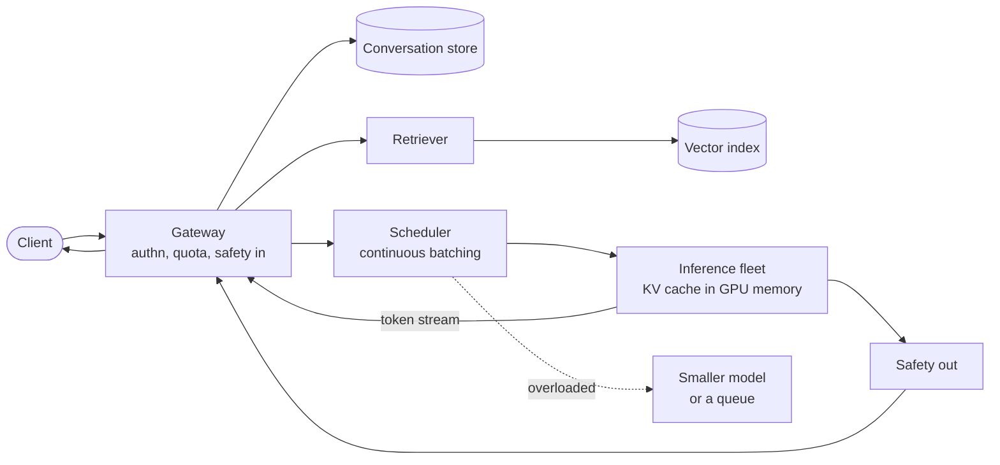

---

<!-- _class: split-panel proof -->

`Chat service · the constraint`

## Generation is memory-bound, which is why batching is the only real lever.

*Why is one request per accelerator wasteful?* Producing one token reads the entire model from memory and does very little arithmetic with it. The hardware sits idle waiting on memory unless many sequences share that read.

- You know you're here when
  - Utilization is low while latency is high, and adding machines barely helps.
- Batching amortizes the read
  - Sixty-four sequences share one weight read, so throughput rises almost linearly.
- The KV cache is the ceiling
  - Each sequence holds attention state for every token, and that memory is the limit.

---

<!-- _class: compare-prose -->

`Chat service · the tradeoff`

## Bigger batches make it cheaper for everyone and slower for each person.

- Large batches
  - More sequences per weight read, so cost per token falls and the fleet shrinks. Each request waits longer to join a batch and generates more slowly inside it.
- Small batches
  - First token arrives fast and generation feels responsive. The same traffic now needs several times the hardware, and cost per token rises with it.

---

<!-- _class: diagram -->

`Chat service · the request`

## Two phases with opposite shapes hide inside one request.

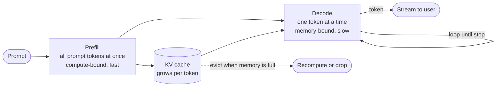

---

<!-- _class: cards-grid four -->

`Chat service · what you cache`

## Four caches, and only one of them is safe to share between users.

- Prefix cache
  - Reuses the KV state of a shared system prompt. Safe, and a large win.
- Conversation KV
  - Keeps a live chat's state warm between turns. Per user, never shared.
- Retrieval cache
  - Caches document lookups. Shared only across users with identical access.
- Response cache
  - Caches whole answers. Tempting, and the usual route to a cross-user leak.

> A cache key that omits the identity is how private text reaches a stranger.

---

<!-- _class: diagram -->

`Chat service · grounding`

## Retrieval puts current facts in the context the weights never learned.

```mermaid
flowchart LR
  Q(["User question"]) --> EMB["Embed"]
  EMB --> VEC[("Vector index")]
  VEC --> RANK["Rank and filter<br/>by permission"]
  RANK --> CTX["Assemble context<br/>budgeted in tokens"]
  CTX --> M["Model"]
  M --> A(["Answer with citations"])
  RANK -.->|"nothing relevant"| SAY(["Say so, do not invent"])
```

---

<!-- _class: cards-grid three -->

`Chat service · safety`

## Safety is three checks in three places, not one filter in the middle.

- On input
  - Classify the request before spending a GPU-second on it.
- On output
  - Check the generated text before the user sees it, streaming in chunks.
- On action
  - Any tool the model can call is authorized as the user, never as the service.

> The output check must work on a stream, because the user is already reading.

---

<!-- _class: checklist -->

`Chat service · invariants`

## The service is not safe to run unless these five hold.

- [x] No user's text reaches another user's context. `isolation`
- [x] Every cache key names the identity that may read it. `scoped`
- [x] A tool call carries the user's rights, not the service's. `delegated`
- [x] Every request has a token budget and a deadline. `bounded`
- [x] Overload degrades to a smaller model, never an error. `graceful`

---

<!-- _class: compare-table -->

`Side by side`

## The method is identical; only the scarce resource changes.

| Dimension | Photo feed | Chat service |
| --- | --- | --- |
| Scarce resource | Read throughput | GPU memory |
| Central tradeoff | Fan-out on write or read | Batch size against latency |
| Consistency | Eventual on the feed | Strict per conversation |
| Degrades by | Serving a stale feed | Routing to a smaller model |
| Cost driver | Storage and egress | Accelerator hours |

---

<!-- _class: divider numbered -->

`Part six`

## What to do with this on Monday.

---

<!-- _class: list-steps capsule -->

`The practice`

## Four habits turn a reference into judgment.

1. Model one a week
   - Draw a system you use. Name its bottleneck.
2. Say the type out loud
   - Name the rung before you design anything.
3. Invariants first
   - Three sentences that must never go false.
4. Estimate, then argue
   - Two numbers end most debates in a minute.

---

<!-- _class: checklist -->

`The review`

## Six questions to ask of any design, including your own.

- [x] Which solution type is this, and does everyone agree? `frame`
- [x] What is the bottleneck, and what number proves it? `evidence`
- [x] Which invariants must never go false? `correctness`
- [x] What breaks first under ten times the load? `scale`
- [x] What happens when each dependency is slow rather than down? `failure`
- [x] What can one stolen credential reach? `security`

---

<!-- _class: q-and-a -->

## Four questions expose more than an hour of diagrams.

- What did this drawing leave out on purpose?
  - No answer means a picture, not a model.
- Which resource runs out first, at what number?
  - No number means it was never sized.
- What does a user see during a partition?
  - This forces the consistency choice open.
- How would you rebuild this from the source?
  - A store you cannot rebuild fails silently.

---

<!-- _class: list takeaway numbered -->

`The principles`

## Five sentences worth keeping longer than any of the kits.

- Simple systems that work grow into complex systems that work. The reverse has never been observed.
- A model is defined by what it leaves out, and an unstated omission is a bug you have not found.
- Constraints are the good news: they turn infinite answers into a choice you can defend.
- Name the solution type before the architecture, or you will design a beautiful answer to another question.
- Every system has exactly one bottleneck at a time, and everything else is decoration until it moves.

---

<!-- _class: glossary -->

## Glossary, A to C

- ACID
  - The four transaction guarantees: all-or-nothing, rules hold, no visible interleaving, survives a crash.
- API
  - The contract one system offers another: the operations and what they promise.
- Backpressure
  - A slow consumer telling a fast producer to stop, instead of silently queueing forever.
- BASE
  - Accept that replicas diverge and converge later, paying in application complexity.
- Blast radius
  - Everything that stops working when one component, credential or zone fails.
- Bottleneck
  - The one resource that limits the whole. Improving anything else changes nothing.
- CAP
  - Split by a network fault, a system must answer with stale data or refuse.
- CDN
  - Caches placed near readers so bytes travel a short distance.
- CQRS
  - Read from a store shaped for reading, write to one shaped for writing.

---

<!-- _class: glossary -->

## Glossary, C to I

- CRUD
  - Create, read, update, delete: the smallest useful vocabulary for a data model.
- DNS
  - The global lookup turning a name a human types into an address.
- Fan-out
  - One event becoming many writes or many reads, depending on where you pay.
- GPU
  - A processor with fast attached memory, used for the matrix work inference is made of.
- HSM
  - A tamper-resistant device that signs on request, so the key never leaves it.
- Idempotent
  - Doing it twice has the same effect as doing it once. What makes a retry safe.
- Invariant
  - A claim that must never go false, during a deploy, a partition or a migration.
- IOPS
  - Separate reads or writes per second, usually the limit before raw bandwidth.

---

<!-- _class: glossary -->

## Glossary, J to R

- JWT
  - A signed bundle of claims a client carries, checkable without a database lookup.
- MVP
  - The smallest build that puts a real answer in front of a real user.
- OLAP
  - Query work that scans many rows and few columns to answer an aggregate question.
- OLTP
  - Query work that touches few rows across many columns for one user action.
- PACELC
  - Partitioned, choose availability or consistency; otherwise, latency or consistency.
- Partition
  - A network split that leaves nodes unable to reach each other, but still running.
- RAG
  - Fetching documents at request time so answers cite facts the weights never learned.
- REST
  - Resources acted on by a small fixed set of verbs, which is what makes responses cacheable.

---

<!-- _class: glossary -->

## Glossary, S to W

- Shard
  - One slice of a partitioned dataset. The shard key decides which questions stay cheap.
- SLI, SLO, SLA
  - The measurement, the internal target held against it, and the external promise.
- Tail latency
  - What the slowest few percent of requests experience. Where users actually live.
- TLS
  - Encrypts and authenticates a connection, so an untrusted network cannot read it.
- TTL
  - How long a cached or replicated copy may be served before it must be refreshed.
- WAL
  - An append-only record written before a change, so a crash replays forward.
- Write amplification
  - One logical write becoming several physical ones, across indexes, replicas and caches.

---

<!-- _class: closing silent spectrum -->

## Draw the boundary, name the constraint, state the invariant. Then design.

`Systems, and How to Design Them`

The kits will age. The seven words and the six questions will not — they are how you will read whatever replaces the technology in them.
