<!-- _class: title silent spectrum -->

# How to Think About Systems

`A tutorial for new engineers`

We start with one engineer's Tuesday. We design Instagram, then run the whole method again on a parking app you could ship this month.

---

<!-- _class: title silent spectrum -->

# How to Think About Systems

`A tutorial for new engineers`

We start with one engineer's Tuesday. We design Instagram, then run the whole method again on a parking app you could ship this month.

---

<!-- _class: agenda -->

## This deck runs in six movements.

1. A Tuesday — one engineer, wake to sleep
2. The words — naming what you just watched
3. Protagonist and antagonist — where a design starts
4. Solution types — which answer is wanted
5. Six kits — data, compute, network, scale, reliability, security
6. Two designs — Instagram, then a parking app from nothing

---

<!-- _class: divider -->

`Part zero`

## Before anything is a system, it is a Tuesday.

---

<!-- _class: content -->

`The rules of this part`

## Maya has been an engineer for seven months. Today she wants one thing.

She wants pull request 482 merged before the release window closes at four o'clock.

Watch her Tuesday. This part uses no systems-design words on purpose. Everything Part one names happens here first, so you see each idea before you have a word for it.

---

<!-- _class: timeline-list -->

`Morning`

## Five things happen to Maya before she reaches her desk.

1. `06:55` The shower
   - The water runs too hot. Maya turns it down and it runs too cold. She corrects it twice more.
2. `08:05` The plan
   - Maya reads her plan for the day. It has the build, the review and the four o'clock window in it.
3. `08:20` A signal failure
   - A signal fails and the train sits nine minutes. Nobody aboard can change it. Maya opens Instagram.
4. `08:50` At her desk
   - Maya uses the wifi, the VPN and the package registry. She thinks about none of them.
5. `09:05` The registry goes down
   - Three teams cannot build. Maya thinks about the registry now.

---

<!-- _class: content -->

`09:15 · standup`

## Four people met twice this week, and only one meeting worked.

On Monday each person reported to the manager in turn. That meeting ran twenty minutes and settled nothing. Today they talked to each other instead, and Maya learned in one sentence that Priya had already read the code she was about to start.

The four people did not change. Only who talked to whom changed.

---

<!-- _class: quote bare -->

> Get 482 merged before the window closes.

*Maya wrote this on a sticky note at 09:30. Nothing else is written on it.*

---

<!-- _class: cards-grid four -->

`09:45 · in the way`

## Four limits shape Maya's day, and she chose none of them.

- The build takes twelve minutes
  - Every push costs twelve minutes. Maya cannot shorten that or skip it.
- The team is three people
  - Nobody on the team is free to review her code this morning.
- The one reviewer is asleep
  - He is six time zones away and will not read anything before three o'clock.
- Production data stays in production
  - She may not copy it to her laptop, even to reproduce the bug.

---

<!-- _class: timeline-list -->

`Midday`

## By lunchtime, other people decide what Maya works on.

1. `10:15` A favor
   - Another team asks Maya to fix a flaky test in their repository. She says no.
2. `10:40` A page
   - The checkout service is failing. Maya does not own it, and she is second on call.
3. `11:00` The loop
   - Maya pushes, waits twelve minutes, finds her own mistake and pushes again. She does this twice.
4. `12:30` A branch left behind
   - Her second attempt sits half-finished on a branch, and she forgets it.
5. `13:30` The queue
   - Five pull requests are waiting for one reviewer, and he is asleep.

---

<!-- _class: timeline-list -->

`Afternoon`

## Maya spends the afternoon answering questions about the work she is not doing.

1. `15:30` The spiral
   - Nobody has reviewed 482. Someone asks for a status update, so Maya stops work to answer.
2. `15:50` She stops answering
   - Maya turns down the fourth request and saves every reply until four o'clock.
3. `16:00` The window closes
   - The reviewer wakes at three. One hour is not enough, and 482 does not merge.
4. `16:30` One thing held
   - The main branch stayed ready to deploy every minute of the day.
5. `17:00` A small realization
   - Maya checks the history. Nothing merges on Thursdays either, and nobody planned that.

---

<!-- _class: content -->

`22:40 · the reveal`

## You just watched a system run for sixteen hours.

Her day had a purpose it did not meet, and one hour that decided it. Two things ran in circles: the shower, and the questions about 482. Something she never thinks about held the day up until the registry stopped at nine. And main stayed deployable throughout — the one promise that held.

The reviewer woke at three and the window shut at four. Everything Maya did that day reached the outcome only through that hour. She spent twenty of its sixty minutes answering questions about 482, instead of waiting ready to act on whatever came back.

Ten ideas ran through that day. Part one gives you the words for them.

---

<!-- _class: divider numbered -->

`Part one`

## Now we give each of those things its name.

---

<!-- _class: split-panel proof cat-1 -->
<!-- _header: "" -->

`Word one · system`

## A system is parts, connected, doing something together.

Maya's morning is one. The shower, the train, the laptop and the registry between them do what none of them does alone: put Maya at a desk, able to work, at nine.

- In Maya's day
  - Nothing on that list is a system. The order she does them in is.
- Listing the parts is easy
  - Shower, train, laptop, registry. Anyone can write that list.
- The connections are the system
  - Change what depends on what, and the behavior changes with the same parts.

---

<!-- _class: diagram -->

`09:15 · the same four people`

## Rewire a system without changing a single part, and it behaves differently.

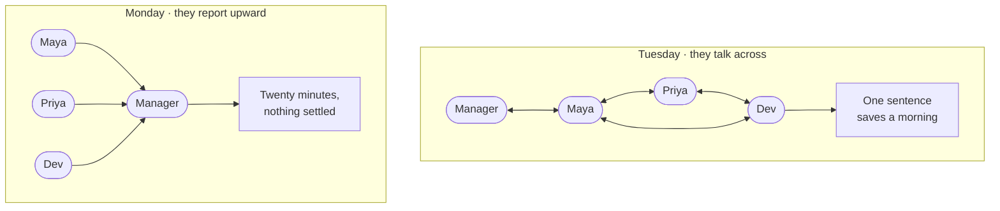

> Change nothing but who waits on whom, and you have changed the system.

---

<!-- _class: split-panel proof cat-2 -->
<!-- _header: "" -->

`Word two · purpose`

## A purpose becomes visible at the moment you miss it.

Maya wrote it on a sticky note at nine thirty: get 482 merged before four. At four o'clock it had not merged, and the gap between those two facts is the clearest thing in her whole day.

- In Maya's day
  - She wrote hers down at 09:30, which is why she could tell at 16:00 that she had missed it.
- Write it down or you will drift
  - An unwritten purpose gets quietly replaced by whatever arrived most recently.
- A system's purpose is what it does
  - Not what its owners say it does. Watch the outputs, not the mission statement.

---

<!-- _class: split-panel proof cat-3 -->
<!-- _header: "" -->

`Word three · boundary`

## The boundary is the line between what you change and what you ask for.

At ten fifteen another team asked Maya to fix a flaky test in their repository. She said no. That refusal is the boundary, and she could feel exactly where it was because saying no was uncomfortable.

- In Maya's day
  - She could decline the favor. She could not decline the release window.
- Inside is what you change
  - Your code, your schema, your deploys, the alerts that wake you.
- Outside is what you negotiate
  - The reviewer's time zone, the registry, the build, another team's repository.

---

<!-- _class: split-panel proof cat-4 -->
<!-- _header: "" -->

`Word four · environment`

## The environment is everything that arrives without asking.

A signal failure held her train for nine minutes. A page pulled her into an outage in a service she does not own. Neither was load, neither was a bug, and neither was hers.

- In Maya's day
  - She had no say over either. She did have a say over what happened to 482 while she was gone, and had not decided it in advance.
- It is not the same as load
  - Regulation, a partner's outage and a colleague's time off are environment too.
- You design for it, not against it
  - You cannot stop the page. You can decide what happens to 482 when it comes.

---

<!-- _class: split-panel proof cat-5 -->
<!-- _header: "" -->

`Word five · process`

## A process is a repeatable transformation, and it runs at a rate.

Push, wait twelve minutes for the build, read a comment, fix, push again. Maya ran that loop twice. Every process has inputs, a transformation, outputs, a rate, and something it leaves behind.

- In Maya's day
  - Twenty-four minutes of her day were spent waiting for a machine, and she chose none of them.
- The rate is part of the definition
  - "Run the tests" is not a process until you say twelve minutes, and how often.
- Leftover state is where bugs live
  - Her abandoned branch is the same shape as a half-applied database migration.

---

<!-- _class: diagram -->

`11:00 · the loop, drawn`

## Every process leaves something behind, and that is the part nobody draws.

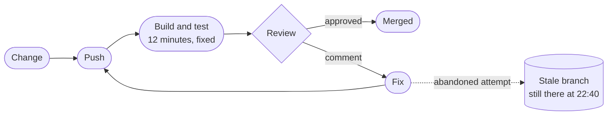

> Nothing in this loop deletes the branch. That is why it is still there at 22:40.

---

<!-- _class: split-panel proof cat-6 -->
<!-- _header: "" -->

`Word six · model`

## A model leaves things out on purpose. What beats you is the thing you left out by accident.

Maya's plan for Tuesday was a model. It held the build time, the review, and the four o'clock window. It did not hold the fact that her reviewer sleeps six time zones away, and that one gap decided the day.

- In Maya's day
  - Her plan was right about everything in it and silent about the thing that beat her.
- Every diagram in this deck is a model
  - Each one throws away something true so you can see one thing clearly.
- Say what you left out
  - An omission you can name is a simplification. One you cannot name is a bug.

---

<!-- _class: split-panel proof cat-7 -->
<!-- _header: "" -->

`Word seven · constraint`

## A constraint is a limit that removes options rather than adding caveats.

Four limits shaped Maya's day, and each came from somewhere different. A twelve-minute build. A team of three. A reviewer asleep six time zones away. A rule about production data.

- In Maya's day
  - Physical, economic, human and legal limits, all four of them landing before ten in the morning.
- Real constraints carry numbers
  - "The build is slow" is a complaint. "Twelve minutes" is something you can design against.
- Some you chose, and can revisit
  - A team of three is a decision. The speed of the build is arithmetic.

---

<!-- _class: split-panel proof cat-8 -->
<!-- _header: "" -->

`Word eight · invariant`

## An invariant is a claim that stays true on the day everything else fails.

Main was deployable every minute of Maya's Tuesday. It was true while the registry was down, while she was paged, and at four o'clock when 482 did not land.

- In Maya's day
  - She missed her goal and broke no invariant, and those are two different kinds of bad day.
- Write them as sentences
  - "Main is always deployable." "A balance is never negative." Then name the alert.
- They constrain other people
  - A real invariant changes what your teammates are allowed to merge.

---

<!-- _class: diagram -->

`06:55 and 15:30 · two loops`

## Two loops look identical until you ask which way each one pushes.

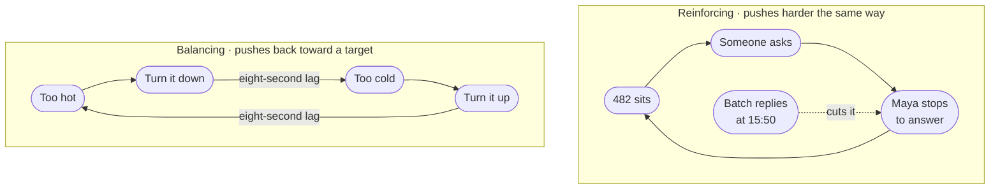

> Find the sign before you touch anything. One loop needs damping, the other needs a brake.

*A balancing loop pushes back toward a target, and the eight-second delay in the pipe is exactly why she overshoots. A reinforcing loop pushes harder in the direction it is already going.*

---

<!-- _class: split-panel capstone cat-1 -->
<!-- _header: "" -->

`Word nine · infrastructure`

## Infrastructure is what you only notice on the day it stops.

Wifi, the VPN, the package registry, the build fleet, the identity provider. Maya used every one of them before nine o'clock and thought about none of them until 09:05, when the registry went down and three teams stopped.

- The test
  - If it vanishing stops several unrelated things at once, it is infrastructure.
- Boring is the requirement
  - It earns its place by being predictable, never by being interesting.
- It is someone else's system
  - Your infrastructure is another team's product, with its own boundary and invariants.

---

<!-- _class: content -->

`17:00 · the last word`

## Emergence is a pattern the parts fall into, that none of them contains.

Nothing merges on Thursdays. Maya checked six weeks. It is a rhythm, and nobody built a rhythm.

Four things feed each other rather than add up. Work that misses the window waits at the front of tomorrow. A review that comes back with comments sends the same change to the back of the queue. The queue is served one hour a day. And nobody ships into a weekend, so Thursday is the last window of the week — the day the backlog is deepest and the day it has to clear.

No policy names Thursday. You find it by watching the queue for six weeks.

---

<!-- _class: premise -->

## These five words name what a system is made of.

You did not learn these from a definition. You watched each one happen first, which is the order that sticks.

1. System
   - Parts, connected, with a purpose.
   - The whole morning.
2. Purpose
   - What it does, not what it says.
   - The gap at four o'clock.
3. Boundary
   - What you change, not ask for.
   - The favor she declined.
4. Environment
   - What arrives uninvited.
   - The page.
5. Process
   - A transformation with a rate.
   - Push, build, review.

---

<!-- _class: premise -->

## Three more are things you make, not things you find.

You never handle the system itself. You handle a drawing of it, its limits and its promises — standing on infrastructure you notice only when it stops.

1. Model
   - A simplification you chose.
   - Her plan for the day.
2. Constraint
   - A limit that removes options.
   - Twelve minutes.
3. Invariant
   - What must never go false.
   - Main is deployable.

---

<!-- _class: compare-table -->

`The translation`

## Every move in Maya's day has a name in software.

| In her Tuesday | In a system | What it decides |
| --- | --- | --- |
| Five pull requests, one reviewer | The bottleneck | Where any improvement has to land |
| Declining the fourth status ask | Admission control | Whether load sheds or the system collapses |
| A twelve-minute build | A fixed cost per attempt | How many attempts a day can hold |
| The abandoned branch | Leftover state | What a retry finds when it arrives |
| Nothing merges on Thursdays | Emergence | What no single owner can fix |

---

<!-- _class: content -->

`Your turn`

## Take the turnstile at a station and name its parts before you turn the page.

You already know how one works. Write down five things: its purpose, its boundary, one constraint, one invariant, and the infrastructure it stands on. Two minutes, on paper, and cover the next slide until you have them.

Do not hunt for a clever answer. The point is that you now have words for a thing you have walked past a thousand times without ever describing.

---

<!-- _class: list-tabular -->

`One answer`

## Here is a turnstile, in the words you now have.

1. Purpose
   - Let paying people through, stop everyone else. Counting riders is a side effect.
2. Boundary
   - The gate, its reader, the local rules. Not the fare service it asks.
3. Constraint
   - One person at a time, about a second each. That sizes the hall.
4. Invariant
   - Never open without a valid fare. Never close on a person.
5. Infrastructure
   - Power, the link to the fare service, the floor.

---

<!-- _class: divider numbered -->

`Part two`

## Every design starts with someone who wants something, and something in the way.

---

<!-- _class: content -->

`The frame`

## Name the person and the force, and everything downstream has an answer.

Juniors skip both, almost every time. They write "users" instead of one person with one goal, and they write "scale" instead of a force with a number on it. Neither produces a single design decision.

The protagonist is who the system is for. The antagonist is what makes serving them hard. Everything downstream — the purpose, the boundary, the invariants, the first move — falls out of that pair.

---

<!-- _class: code -->

`The drill`

## Two sentences take ninety seconds and settle four things you were guessing at.

```text
Protagonist:  <name> wants to <do X> so that <Y>.
Antagonist:   But <W> — and W is <a number>.

  Purpose       one sentence: what counts as this working
  Boundary      what is mine when W happens, and what I only ask for
  Invariant     what must stay true or <name> stops trusting this
  First move    what W does to the cheapest design that could work
```

*Run it on a turnstile, then a cash machine, then the thing on your screen right now. It gets fast.*

---

<!-- _class: compare-prose -->

`The drill, on Tuesday`

## Maya is the protagonist of her own day, and the interruptions are the antagonist.

- Maya wants 482 merged before four o'clock
  - So that a bug affecting real users stops affecting them, and so she is not carrying it into next week.
- But she is interrupted six times
  - A page, a favor, four status requests. Not one of them unreasonable, and each costs the reload, not just the minute.

---

<!-- _class: content -->

`The trap`

## Most systems have several protagonists, and you must say which one loses.

Instagram has at least four: the reader opening the app, the ordinary poster, the celebrity with five hundred million followers, and the engineer carrying the pager. They want incompatible things.

Naming one as the protagonist decides who waits. Say who you are not designing for, out loud, and most of the arguments later in the design turn out to be about that.

---

<!-- _class: compare-table -->

`The join`

## The antagonist chooses which kind of solution you are allowed to build.

| The antagonist is… | You are building | Because |
| --- | --- | --- |
| Nobody knows if they exist | An MVP | The risk is demand, not load |
| Growth — the protagonist multiplies | A scaled system | The limit is real and namable |
| Cost on a path you have profiled | An optimized system | The measurement came first |
| Physics — you are near a real bound | An optimal system | Only here is a proof worth it |
| A person who wants in | Security work, at any rung | Required at every rung |

---

<!-- _class: split-panel proof cat-2 -->
<!-- _header: "" -->

`Instagram · the casting`

## Our protagonist reads on a phone and gives us about a second.

She opens the app a dozen times a day, on a cellular network, usually while doing something else. She wants photographs from the people she chose, recent, ranked, and hers. The poster is a supporting character: he tolerates a spinner, and every time the design has a choice, work goes onto his side.

- The reader's demand
  - A page on her phone in under a second, which is 200 ms of server time plus the network.
- The poster can wait
  - Uploading, transcoding and delivery may all take their time. Nobody is watching.
- Casting decides the design
  - It is why the feed is built when someone posts, not when someone reads.

---

<!-- _class: split-panel capstone cat-3 -->
<!-- _header: "" -->

`Instagram · the antagonist`

## The antagonist is not scale. It is the shape of the follow graph.

Scale is a quantity, and quantities have a price you can pay. The thing you cannot buy your way out of is a distribution. Follower counts are heavy-tailed: almost everyone has a few hundred, and a handful have hundreds of millions. No single account looks like the average, and the far end sits six orders of magnitude from the middle.

- The number that matters
  - The median account has about 150 followers. The largest has five hundred million.
- One algorithm cannot serve both
  - That gap is why the design ends up with two paths instead of one.
- Hold on to this
  - Every hard decision in Part five is this one fact again.

---

<!-- _class: content -->

`Your turn`

## Cast the last app you opened, in the same two sentences.

Pick something ordinary: a maps app, a chat client, the thing your team ships. Fill in both lines, exactly as the drill has them:

```text
Protagonist:  <name> wants to <do X> so that <Y>.
Antagonist:   But <W> — and W is <a number>.
```

The second line is the hard one. If you cannot put a number on W, you have just found the first thing worth going and measuring.

---

<!-- _class: compare-prose -->

`One answer`

## A maps app casts the same way, in two sentences.

- The protagonist
  - A driver already moving wants the next turn early enough to take it, so that the road and the screen never compete. Everyone else — the person searching, the person saving a place, the person reading reviews — is slower and can wait.
- The antagonist
  - The signal drops in the tunnel, and the tunnel is ninety seconds long. That number is the design: ninety seconds of route has to be on the phone before the phone goes quiet.

---

<!-- _class: divider numbered -->

`Part three`

## "Design Instagram" is five different questions.

---

<!-- _class: content -->

`Before the boxes`

## Before you design anything, say which kind of answer is wanted.

The same words — design a photo sharing app — have five legitimate answers that share almost no architecture. A build that takes a week and a build that takes two years are both correct, for different questions.

Gall's law says it plainly: a complex system that works is invariably found to have evolved from a simple system that worked. You climb this ladder. You do not parachute onto it.

---

<!-- _class: premise -->

## Each rung costs more and commits harder than the one below it.

You move up when the rung you are standing on stops paying, and you move up one rung at a time.

1. MVP
   - Buys information fast.
   - Does anyone want this?
2. Scaled
   - Holds up as load grows.
   - Will it survive success?
3. Optimized
   - Cuts cost on a known path.
   - Where is the money going?
4. Optimal
   - Provably best, for one model.
   - What is the real limit?
5. Specialized
   - An advantage nobody can copy.
   - What can only we do?

---

<!-- _class: split-panel proof cat-4 -->
<!-- _header: "" -->

`Rung one · MVP`

## An MVP is an experiment wearing a product's clothes.

Its job is to produce a decision, not to last. Every hour spent making it durable is an hour spent on a system you may correctly delete next month.

- The tell
  - The riskiest thing is whether anyone wants it, and being wrong is cheap.
- Buy simplicity, not capacity
  - One database, one service, one region, boring technology, nothing clever anywhere.
- Name the exit in advance
  - Write down the number that means "stop, this now has to be built properly."

---

<!-- _class: split-panel proof cat-5 -->
<!-- _header: "" -->

`Rung two · scaled`

## A scaled system survives ten times the load without a rewrite.

You have stopped buying information and started buying headroom. The question moves from "does it work" to "what breaks first, and how do I move that limit."

- The tell
  - Growth is real, and the current design has a ceiling you can point at.
- A bigger box first, then the four moves
  - Vertical scaling is not one of the four; it is what buys time before you need them, and it is reversible. Then reduce, duplicate, defer — and spread last, because partitioning is the one you cannot undo cheaply.
- Cost per unit starts counting
  - Cost per request stops being noise and becomes the second constraint on every choice.

---

<!-- _class: split-panel proof cat-6 -->
<!-- _header: "" -->

`Rung three · optimized`

## Optimizing means moving one measured number on one hot path.

Optimization without a profile is decoration. You need the measurement first, the target second, and a willingness to accept the complexity you are about to add.

- The tell
  - A profile shows which tenth of the work is most of the cost.
- Premature is half the quote
  - Knuth also wrote that we should not pass up the critical three percent. Both halves.
- Complexity is the invoice
  - Each optimization narrows the assumptions the system is allowed to break.

---

<!-- _class: split-panel proof cat-7 -->
<!-- _header: "" -->

`Rung four · optimal`

## Optimal means provably best against an objective you wrote down.

Rarer than it sounds. It needs a stated objective, a stated model, and a proof or a bound — and it is optimal only for the assumptions you fixed in place.

- The tell
  - The objective is a function and the constraints are inequalities, on paper.
- The proof is against a model
  - Change the assumptions and the optimal answer changes underneath you.
- It ages badly
  - An optimal design pinned to last year's hardware is a legacy system with a certificate.

---

<!-- _class: split-panel capstone cat-8 -->
<!-- _header: "" -->

`Rung five · specialized`

## A specialized system trades generality for something nobody can copy.

Custom silicon, a purpose-built storage engine, a scheduler that knows your physics. You give up flexibility, portability and hiring pool for a capability the market cannot sell you.

- The signal
  - The advantage is durable, measurable, and central to why customers choose you.
- The cost never ends
  - You now maintain what everyone else gets free from a vendor, forever.
- Almost nobody is here
  - Most teams reaching for this rung needed the optimized one and got excited.

---

<!-- _class: decision -->

`The rule`

## Climb one rung at a time, and only on evidence.

- Move up when the current rung fails on a measurement
  - A number, a profile, a named risk. Not a feeling that things are getting big.
- Move up exactly one rung
  - Jumping from MVP to optimal buys rigor for assumptions nobody has tested yet.
- Move back down when the evidence changes
  - A rewrite that simplifies is a legitimate move.

---

<!-- _class: split-panel capstone cat-2 -->
<!-- _header: "" -->

`The removal test`

## A design is finished when taking one more thing out would break it.

Antoine de Saint-Exupéry wrote that perfection arrives not when there is nothing left to add, but when there is nothing left to take away. Dieter Rams said it in three words: less, but better. Both are tests you can run on a whiteboard at four in the afternoon.

- Run it on every box
  - Delete it on paper and follow what happens. If nothing downstream changes, it was never holding anything up.
- Run it on every number
  - A figure nobody can act on is decoration. Turn it into a threshold or take it out.
- Less, but better, is not less
  - Rams designed for decades of use. Removing something the system needs is not restraint, it is a defect.

---

<!-- _class: content -->

`Your turn`

## Three requests arrive this week. Name the rung each one is asking for.

One: a founder wants to know whether anybody will pay for something that does not exist yet. Two: a service that works fine is about to take ten times the traffic, and nobody knows what gives first. Three: the bill for a single endpoint is now larger than the team that owns it.

Write a rung for each and one sentence on what it costs. Then turn the page.

---

<!-- _class: list-tabular -->

`One answer`

## The question sets the rung. The size of the company does not.

1. Will anybody pay?
   - MVP. You are buying information and paying for it with everything you will throw away.
2. Ten times the traffic
   - Scaled. You are buying headroom and paying in machines and the coordination they need.
3. The bill is too large
   - Optimized. You are buying back cost and paying in flexibility. Profile first, or you are decorating.

---

<!-- _class: list-steps -->

`The arc`

## Four movements carry a system from nothing to running, and this deck teaches the first two.

1. Discover
   - Who wants what, what is in the way, how big it is. Parts one to three.
2. Design
   - Which rung, which parts, what you can take out. Part four hands you the parts.
3. Develop
   - Build it, and find out whether the design held.
4. Deliver
   - Ship it and watch it. The running system names the field you guessed.

> Every exercise from here asks you to discover and to design. The last two are yours to run.

---

<!-- _class: divider numbered -->

`Part four`

## Six kits hold sixteen things you can reach for, and the invariants behind all of them.

---

<!-- _class: content -->

`How to read a kit`

## Every entry in every kit answers the same three questions.

One shape for every entry you choose between — a store, a runtime, a delivery tier, a quota — so you can hold two options side by side without re-reading a manual. Scale and reliability are mostly practices rather than choices, so those two kits run on diagrams, patterns and invariants instead. Every kit opens with a diagram and closes with its invariants.

The entries name concepts, not products. Products turn over every few years. The constraint that an append-only store puts on your reads does not.

---

<!-- _class: divider -->

`Data`

## Every storage choice is a bet about how you will read it later.

---

<!-- _class: diagram -->

`Data kit · the patterns`

## Almost everything you will ever store fits one of a few shapes.

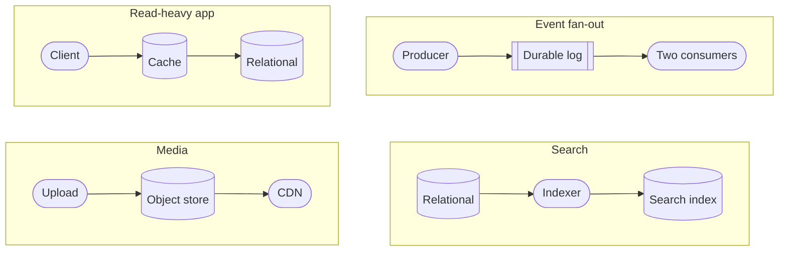

> Four shapes, and the boxes are interchangeable. What differs is what you may ask later.

---

<!-- _class: premise -->

## The product name is the last thing you decide about a store.

Answer these before anyone says a brand. Most database arguments are really a disagreement about question two.

1. Shape
   - How the data is structured.
   - Rows, documents, or edges?
2. Access
   - How it is read and written.
   - Lookups, ranges, or scans?
3. Consistency
   - What a reader may see.
   - Must it be the latest?
4. Scale
   - Size, throughput, growth.
   - Does it fit one machine?
5. Cost
   - Money, operations, skill.
   - Who runs it at 3am?

---

<!-- _class: content -->

`Data kit · the three passes`

## Those five questions do not all fire at once. The choice runs in three passes.

Pass one takes three of those five — shape, access, and whether it still fits one machine — and picks the store you start from. The next slide draws it as a tree, and for most systems it is the whole decision.

Pass two asks a sixth question the five do not cover: do you need a capability no shape provides? There are six of those, and one can delete a whole tier.

Pass three runs only when two candidates both fit, and settles it on how each behaves at 3am rather than on what it stores.

Consistency is not a pass. You carry it into all three.

---

<!-- _class: diagram -->

`Data kit · pass one, the first question`

## Start at relational, and the first question sends most systems home.

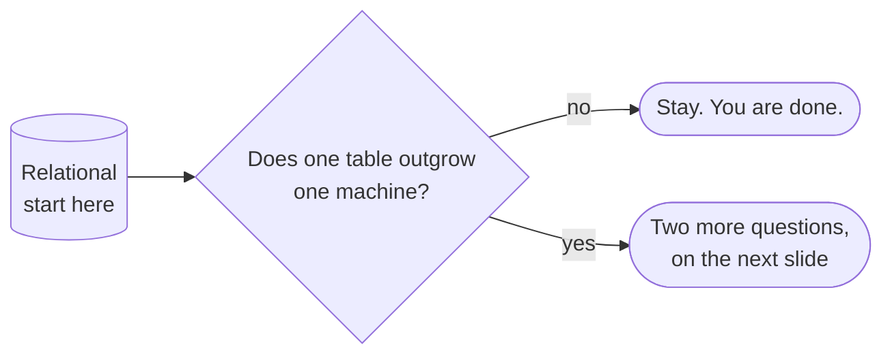

> Most systems answer no here. If you are not sure which you are, you are a no.

---

<!-- _class: diagram -->

`Data kit · pass one, keeping the joins`

## If you outgrew one machine, the next question is whether you still need joins.

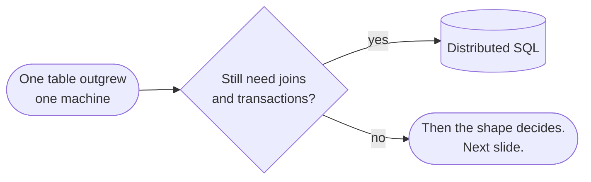

> An engine that partitions itself is the cheapest way to keep what relational gave you.

---

<!-- _class: diagram -->

`Data kit · pass one, the shape`

## Once you give up joins, four questions about shape pick the store.

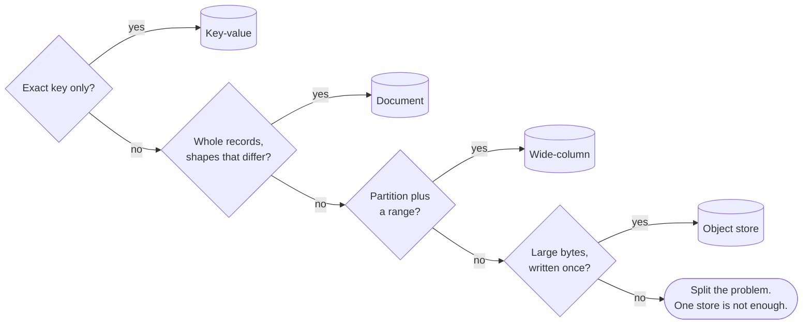

> Reaching the last box is not failure. It is the honest answer for a system with two jobs.
---

<!-- _class: cards-stack -->

`Data kit · relational`

## A relational store is the default until you can name why it is not.

- Reach for it when
  - Entities relate, writes touch several at once, and the questions will keep changing.
- Walk away when
  - One table outgrows one machine's writes, or the schema genuinely differs per row.
- The constraint you inherit
  - Joins and transactions need a coordinator. Self-sharding loses both; a distributed engine charges a round trip.

---

<!-- _class: cards-stack -->

`Data kit · distributed SQL`

## An engine that partitions itself saves you from sharding by hand.

- Reach for it when
  - One table outgrew one machine and you still want joins, transactions and a schema.
- Walk away when
  - Every query is a single exact key, or the budget cannot carry cross-partition coordination.
- The constraint you inherit
  - A transaction across partitions pays a round trip, so related rows still belong together.

---

<!-- _class: cards-stack -->

`Data kit · key-value`

## A key-value store is a hash map with an operations team.

- Reach for it when
  - You always know the exact key, and handing the value back is the store's only job.
- Walk away when
  - You need to ask any question at all about what is inside the value.
- The constraint you inherit
  - There is no second way in. Every new query means a new key you write and maintain yourself.

---

<!-- _class: cards-stack -->

`Data kit · document`

## Choosing a document store means choosing to keep one object whole.

- Reach for it when
  - A read fetches one self-contained object, and the shape varies between records.
- Walk away when
  - The same fact lives in many documents and has to stay consistent across them.
- The constraint you inherit
  - Denormalized copies. Every update to a shared fact becomes a fan-out — one write you now owe to many places.

---

<!-- _class: cards-stack -->

`Data kit · wide-column`

## A wide-column store buys enormous write throughput and freezes your queries.

- Reach for it when
  - Writes are relentless, and every read is a partition key plus a sorted range.
- Walk away when
  - Query patterns are still moving, or you need a transaction across partitions.
- The constraint you inherit
  - The primary key is the schema. Changing how you query means rewriting the data.

---

<!-- _class: cards-stack -->

`Data kit · object store`

## An object store is the cheapest home for a write-once file.

- Reach for it when
  - Items are large, written once, fetched by key, and must survive for a decade.
- Walk away when
  - You need to modify part of an object, or to list and filter by what is inside it.
- The constraint you inherit
  - Listing is slow and expensive. The index of what you stored belongs somewhere else.

---

<!-- _class: compare-table -->

`Data kit · pass two`

## A capability usually adds a store beside the source. Live push and retention replace the one you started from.

| Capability | The question it answers | Where it lives |
| --- | --- | --- |
| Similarity | What is closest in meaning to this? | A vector index |
| Ranked text | Which document best matches these words? | A search index |
| Proximity | What is within two kilometers? | A geospatial index |
| Live push | What changed, the moment it changed? | A store that streams |
| Retention | What did this metric do all month? | A time-series store |
| Unbounded traversal | Who is reachable from here, however many hops? | A graph store |

---

<!-- _class: cards-stack -->

`Data kit · graph`

## A graph store is for questions that traverse, not questions that filter.

- Reach for it when
  - The query walks relationships of unknown depth: reachability, paths, recommendations.
- Walk away when
  - You have relationships but only ever join two hops. A relational store does that faster.
- The constraint you inherit
  - Traversals resist partitioning, so scaling out is genuinely harder here than anywhere else.

---

<!-- _class: content -->

`Halfway`

## Two of the stores on that list look derived, and both are where truth lands.

Nothing regenerates a photograph or last Tuesday's CPU samples, so an object store and a time-series store are where those facts first arrive. They are sources of truth wearing the clothes of a derived tier.

The genuinely derived stores are the search index, the vector index, the cache and the warehouse. Anything derived must be rebuildable, must be allowed to lag, and must never be the only copy.

---

<!-- _class: cards-stack -->

`Data kit · cache`

## A cache converts a correctness problem into a timing problem.

- Reach for it when
  - Reads repeat, the source is expensive, and slightly stale is genuinely acceptable.
- Walk away when
  - Staleness is unsafe, or the working set is larger than the cache will ever be.
- The constraint you inherit
  - Invalidation. You now own a second copy whose wrongness is measured in seconds.

---

<!-- _class: cards-stack -->

`Data kit · durable log`

## A durable log turns "do it now" into "do it reliably, soon."

- Reach for it when
  - Producers outpace consumers, or several systems need to see the same events.
- Walk away when
  - The caller needs the result inside the same request.
- The constraint you inherit
  - At-least-once delivery. Every consumer must be idempotent or you will charge somebody twice.

---

<!-- _class: compare-table -->

`Data kit · the scan`

## Four columns settle most arguments about stores.

| Store | Access | Consistency | Scales by | Weak at |
| --- | --- | --- | --- | --- |
| Relational | Key, range, join | Strong on the leader | Replicas, then partitioning | Cross-shard writes |
| Distributed SQL | Key, range, join | Strong across partitions | Horizontal | Cross-partition transactions |
| Key-value | Exact key | Engine-specific | Horizontal | Rich queries |
| Document | Key, secondary index | Engine-specific | Horizontal | Facts split across documents |
| Wide-column | Partition plus range | Tunable | Horizontal | New query patterns |
| Object store | Exact key | Read-after-write on new keys | Effectively unbounded | Listing, and changing part of an object |

---

<!-- _class: compare-table -->

`Data kit · pass three`

## When two stores both fit, what settles it is how each one behaves on a bad night.

| Ask | Why it settles the tie |
| --- | --- |
| Who carries the pager? | A managed service, or your own team at 3am |
| What does a lost node cost? | Some engines lose capacity, some lose writes in flight |
| How does the bill grow? | Per gigabyte, per request, or per machine-hour |
| How does data get out? | A dump, a change stream, or nothing at all |
| How long is a restore? | Backups are easy. The restore is the number |
| Who already runs one here? | A store your team knows beats a better one nobody has run |

---

<!-- _class: cards-stack -->

`Data kit · replicas`

## A replica serves reads and always lags the copy it follows.

- Reach for it when
  - Reads outgrow one machine, and a few seconds behind is safe for most of them.
- Walk away when
  - A reader must see their own write, or you hoped the copy would take writes too.
- The constraint you inherit
  - Lag, and promotion. A reader sees a past you have left, and a promoted replica loses whatever never reached it.

---

<!-- _class: diagram -->

`Data kit · under a partition`

## When a link breaks, you pick. There is no third answer.

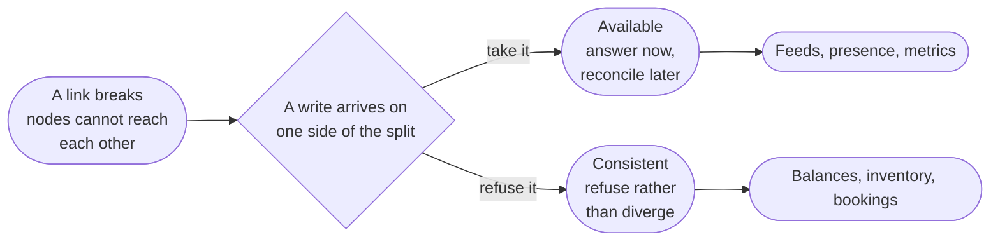

> This is CAP, and it only applies while the link is broken. That is rarer than people think.

---

<!-- _class: diagram -->

`Data kit · the rest of the time`

## The bill you actually pay is the one that arrives when nothing is broken.

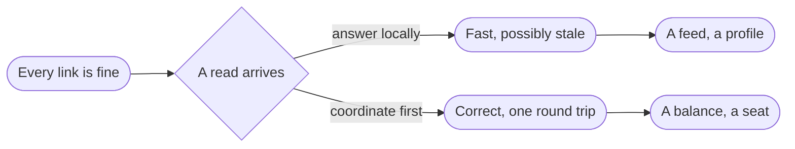

> A different question from CAP, and the one you answer on every read for years between outages.
---

<!-- _class: list-tabular -->

`Data kit · consistency`

## Consistency is not one thing, and most arguments are about which kind you meant.

1. Linearizable
   - Every read sees the latest write. Costs a coordination round trip, every time.
2. Read your writes
   - You always see your own edits. Anyone who has just typed something expects at least this.
3. Eventual
   - Replicas agree in the end. Cheapest, and correct for feeds, counters and presence.

---

<!-- _class: compare-prose axis -->

`Data kit · two philosophies`

## ACID and BASE answer different questions.

Ask whether coordinating now costs less than reconciling later.

1. ACID
   - Coordinate first, so the data is never observably wrong. You pay in latency and in how far you can partition.
2. BASE
   - Diverge now, converge later. You pay in application code, because every reader must tolerate stale state.

---

<!-- _class: split-panel proof cat-1 -->
<!-- _header: "" -->

`Data kit · indexes`

## An index is a second copy of your data, sorted for exactly one question.

Indexes make reads fast by making writes slower and storage larger. Each one is a promise to maintain a sorted structure on every single insert, update and delete, forever.

- The tell
  - You can name the exact query each index exists to serve, out loud, right now.
- The bill arrives on writes
  - Five indexes mean five extra structures touched on every insert.
- How many rows it removes, not how many values it has
  - An index earns its keep by how rare a match is. Three evenly spread values narrow nothing; three where one is rare narrow almost everything.

---

<!-- _class: diagram -->

`Data kit · partitioning`

## Sharding buys throughput by giving up the questions that cross shards.


> The dotted line is the query you will want in a year and cannot have.

---

<!-- _class: cards-grid three -->

`Data kit · the shard key`

## The shard key is the decision you cannot undo cheaply.

- By hash of the key
  - Spreads load evenly and destroys range queries. The safe default.
- By range
  - Keeps ranges fast and invites a hot spot on the newest range.
- By tenant or region
  - Matches both the access pattern and the law, until one tenant grows enormous.

> Name the query that will now cross shards. If you cannot, you have not chosen a key — you have chosen a hash.

---

<!-- _class: cards-stack -->

`Data kit · ordering and identity`

## Two machines never agree on the time, so never let a clock alone decide an order.

- Reach for it when
  - Anything is sorted, paged or deduplicated. A sortable id carries time and writer in one value.
- Walk away when
  - One writer owns the sequence and a unique id breaks the ties. Then a clock is enough.
- The constraint you inherit
  - An id you sort by can never change, and every page cursor comes to depend on it.

---

<!-- _class: list-steps -->

`Data kit · changing a schema`

## Changing a column on a running system takes five steps, not one.

1. Expand
   - Add the field. Nothing writes it, nothing reads it, both versions still work.
2. Write both
   - New code fills it alongside the old one. Nothing reads it, so mistakes are cheap.
3. Backfill
   - Fill rows written before step two, in restartable batches.
4. Cutover
   - Move reads across. Both are still written, so going back costs nothing.
5. Contract
   - Stop writing the old field, then drop it.

---

<!-- _class: content -->

`Data kit · why those five steps`

## A deploy is never atomic, so every change must tolerate the version beside it.

For the minutes or hours a rollout takes, two versions of your code run against one store. Both have to work. That is the entire reason for the five steps: each one is safe while the step before it is still live, which is exactly what a rollout cannot promise you about any bigger jump.

The same rule governs an API other people call. Add fields, never repurpose them. Make anything new optional. Remove nothing until you can show that nobody calls it — and if you cannot show that, you have not earned the right to remove it.

---

<!-- _class: cards-grid four -->

`Data kit · deleting for real`

## A delete is a fan-out that reaches every copy you ever made.

- The row itself
  - A tombstone, not a gap. Replicas have to learn the row is gone.
- Every derived copy
  - Caches, feeds, search indexes, aggregates. Each holds its own copy and each needs telling.
- The backups
  - You cannot rewrite a backup. Set a retention window and let the copy expire instead.
- The bytes at the edge
  - A CDN serves what it cached. Purging is eventual, so signed URLs need short lives.

> Design the delete when you design the write. Retrofitting one across six stores is a quarter of somebody's year.

---

<!-- _class: list-criteria -->

`Data kit · the invariants`

## Four sentences hold, or the data design is not one you can defend.

1. One source of truth per fact
   - Every other copy is derived and says so.
2. Every derived copy rebuilds — and deletes
   - Unattended from the source, and gone from all of them on request.
3. Every queue consumer is idempotent
   - At-least-once is the only delivery you get.
4. Every write path states its consistency
   - "Whatever the database does" is not a level.

---

<!-- _class: divider -->

`Compute`

## Choosing compute is choosing how much of the machine you still own.

---

<!-- _class: diagram -->

`Compute kit · the patterns`

## Every compute choice hands more of the machine to somebody else.

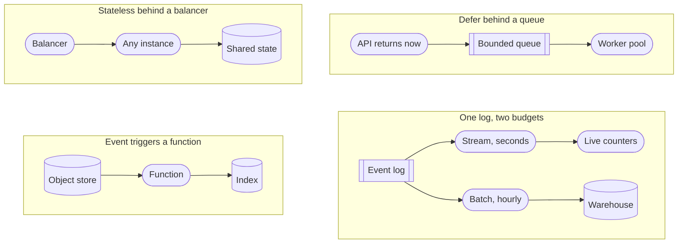

> Each step hands over a machine and takes away a dial.

---

<!-- _class: cards-stack -->

`Compute kit · virtual machines`

## A virtual machine is what you reach for when the process outlives the request.

- Reach for it when
  - The workload runs continuously, holds state in memory, or needs unusual kernel settings.
- Walk away when
  - Traffic is spiky and idle machines start to dominate the bill.
- The constraint you inherit
  - Patching, capacity planning, and the gap between staging and production are now yours.

---

<!-- _class: cards-stack -->

`Compute kit · containers`

## A container makes the deployable unit identical everywhere it runs.

- Reach for it when
  - You run many services, deploy often, and want one packaging story across all of them.
- Walk away when
  - You run one small service. The scheduler that places containers on machines costs more than it saves at that size.
- The constraint you inherit
  - The orchestrator is now infrastructure, with its own failure modes and its own pager.

---

<!-- _class: cards-stack -->

`Compute kit · functions`

## A function is compute you rent by the millisecond, so idle costs you nothing.

- Reach for it when
  - Traffic is spiky or rare, the work is short, and per-request isolation is welcome.
- Walk away when
  - Runs are long, or steady traffic makes per-request pricing more expensive than a machine.
- The constraint you inherit
  - Cold starts, unless you pay to keep instances warm — which is paying for idle again.

---

<!-- _class: compare-prose -->

`Compute kit · the property`

## Statelessness is what makes a machine replaceable.

- A stateful instance
  - It holds something no other instance has: a session, a lock, a warm cache, an open connection. Scaling means moving that state, and a crash means losing it.
- A stateless instance
  - Any instance serves any request because the state lives somewhere else. Scaling is arithmetic and failure is a routing change.

---

<!-- _class: list-criteria -->

`Compute kit · the invariants`

## Anything you run should satisfy all four before it meets real traffic.

1. Any instance can be killed without a customer noticing
   - If that is false, you have state you have not named yet.
2. Deployments are reversible
   - A rollback is a routine operation, not an incident response.
3. Capacity is a number somebody owns
   - Not "it autoscales" — the ceiling, the cost, and who gets paged at it.
4. Startup does not depend on startup order
   - Services retry into each other instead of requiring a sequence.

---

<!-- _class: divider -->

`Network`

## Distance is the one cost you cannot optimize away.

---

<!-- _class: diagram -->

`Network kit · the patterns`

## Distance charges a different price at every hop.

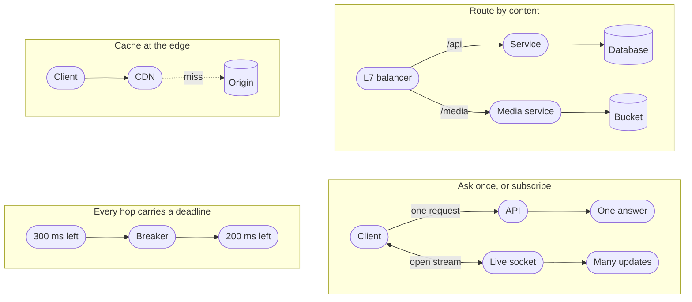

> Distance is the one price on this slide you cannot negotiate.

---

<!-- _class: diagram -->

`Network kit · the request path`

## A tap crosses several hops before your code sees it, and each one spends budget.

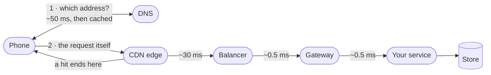

> Eighty of those milliseconds are spent before your code runs, and none of them are yours.

---

<!-- _class: list-tabular metric -->

`Network kit · the numbers`

## Most latency arguments end the moment somebody says the actual numbers.

1. Memory read
   - 100 ns
2. Read from an SSD
   - 100 us
3. Datacenter hop
   - 0.5 ms
4. Seek on a spinning disk
   - 10 ms
5. Cross-continent round trip
   - 150 ms

---

<!-- _class: content -->

`Why that number is final`

## Light in fiber covers about 200 kilometers per millisecond.

Nothing changes that. The measured 150 milliseconds is well above the straight-line floor, because packets do not travel in straight lines and every hop queues.

A design that needs three sequential intercontinental round trips has spent half a second before it executes an instruction. Replication, caching and edge delivery all exist to buy that distance back, and none of them makes it free.

---

<!-- _class: cards-stack -->

`Network kit · the CDN`

## A CDN moves bytes closer to readers, and ends the connection there too.

- Reach for it when
  - The content is large, popular, and identical for many people.
- Walk away when
  - Nothing is shared and nothing is far. A personal response still wins the handshake back.
- The constraint you inherit
  - A second copy with its own staleness. Version immutable URLs; purge the rest, and time the purge.

---

<!-- _class: split-panel proof cat-2 -->
<!-- _header: "" -->

`Network kit · timeouts`

## A request with no timeout is a resource leak waiting for a bad afternoon.

Every waiting request holds a connection, a thread and some memory. Under a slow dependency, unbounded waits turn one struggling service into a queue of stuck callers — which is the shape of the page that pulled Maya in at twenty to eleven.

- What good looks like
  - Every outbound call has a deadline, and the deadline shrinks as it propagates.
- Retries need a budget
  - Retrying without a cap turns a brief failure into a flood you built yourself.
- Backoff must be random
  - Synchronized retries arrive together and rebuild the spike you just survived.

---

<!-- _class: list-criteria -->

`Network kit · the invariants`

## A call that leaves your process owes you four things.

1. Every remote call has a deadline
   - Inherited from the caller, and always shorter than the caller's own.
2. Every retry has a budget and jitter
   - Bounded attempts, randomized delays, and a breaker when the target is down.
3. Every write is idempotent or keyed
   - The network will deliver your request twice. Decide now what that means.
4. Distance appears in the design
   - Round trips between regions are counted on purpose, not discovered in production.

---

<!-- _class: divider -->

`Scale`

## Every scaling change is one of four moves.

---

<!-- _class: diagram -->

`Scale kit · the patterns`

## Each of the four moves buys throughput and charges you for it.

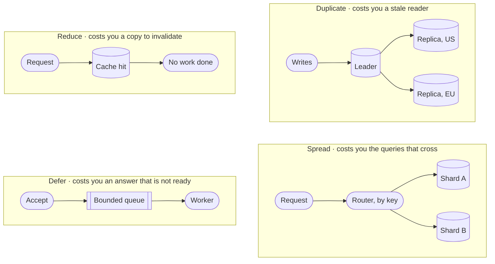

> Every one of the four leaves you something new to maintain.

---

<!-- _class: math -->

`Scale kit · the one formula`

## Little's law ties concurrency, throughput and latency together.

$$ L = \lambda W $$

- $L$ — requests in flight at once
- $\lambda$ — arrivals per second
- $W$ — time each one spends inside

---

<!-- _class: content -->

`Using it`

## The formula sizes your thread pool before anyone guesses.

At 2,000 requests per second averaging 50 milliseconds each, 100 requests are in flight at any moment. That is your minimum concurrency, and no tuning makes it smaller while the other two numbers hold.

Maya's Tuesday is the same arithmetic at human scale. Two builds a day, twelve minutes each, leave the pipeline idle for almost the whole day, so nothing she pushes ever queues — which is how you know the twelve minutes was never her bottleneck. The reviewer was. Find your own numbers — arrivals on the load balancer, duration in the handler.

---

<!-- _class: content -->

`When it goes wrong`

## Tripled latency breaks a bounded pool and an unbounded one in opposite directions.

Leave the pool unbounded and the arithmetic runs forward: latency triples, so the requests in flight triple with it, and a machine sized for the good day runs out of memory.

Bound it at 100 and concurrency cannot rise, so throughput falls instead. `100/0.15s` is about 667 a second against the 2,000 still arriving, and the queue in front grows without limit until something sheds it.

Neither is a tuning problem. The first is why pools have ceilings, and the second is why every queue behind one needs a ceiling too.

---

<!-- _class: split-panel proof cat-3 -->
<!-- _header: "" -->

`Scale kit · tail latency`

## The average request is a fiction, and your users live in the tail.

A page that makes 100 parallel calls waits for the slowest one. Give each call a one-percent chance of being slow. Then 63 percent of pages hit at least one slow call. That is `1 - 0.99^100`, and you can redo it on a napkin.

- The check
  - A percentile describes requests. A person makes dozens a day, so far more than one percent of people meet your p99. Report the 99th per dependency, and keep the average for capacity only.
- Fan-out amplifies it
  - More parallel calls turn a rare slow response into a common slow page.
- Hedging buys it back, on a budget
  - Send a duplicate after the 95th percentile and take whichever answers first. A hedge is a second request, so cap it — a few percent of traffic. Unbudgeted, it is the reinforcing loop again, arriving exactly when you are already slow.

---

<!-- _class: cards-grid four -->

`Scale kit · caching`

## Each caching pattern owns a different failure.

- Cache-aside
  - The app fills the cache on a miss. Simple, and it stampedes on a cold key unless one reader fills it while the rest wait on that one fill.
- Read-through
  - The cache fetches for you. Cleaner code, and now the cache is on the critical path.
- Write-through
  - Write both together. Always fresh, and every write pays the cache's latency.
- Write-behind
  - Write the cache, flush later. Fastest writes, and a crash loses them.

> Choose by which failure you can survive, not by which pattern reads best in code.

---

<!-- _class: split-panel proof cat-4 -->
<!-- _header: "" -->

`Scale kit · idempotency`

## Idempotency is what makes a retry safe, and retries are not optional.

Networks duplicate, clients retry, queues redeliver. The only question is whether the second delivery is harmless or charges somebody twice.

- The rule
  - Every mutating endpoint takes a client-supplied key and deduplicates on it.
- The key comes from the caller
  - Generated before the first attempt, reused on every retry of that same intent.
- Store the result, not the fact
  - A repeat returns the original answer, not an error saying it already happened.

---

<!-- _class: list-criteria -->

`Scale kit · the invariants`

## Nothing here is scalable until the last of the four is true.

1. The bottleneck is named and measured
   - Not suspected. A number, a graph, and the resource it belongs to.
2. Every queue is bounded
   - An unbounded queue turns a throughput problem into a memory outage.
3. Admission control sheds load before the system collapses
   - A balancing loop from Part one, and the move Maya made at 15:50 when she stopped answering.
4. Adding a machine is routine
   - No manual steps, no rebalancing outage, no cold-cache stampede.

---

<!-- _class: divider -->

`Reliability`

## Failure is the environment, not the exception.

---

<!-- _class: diagram -->

`Reliability kit · the patterns`

## Each pattern keeps one failure from becoming every failure.

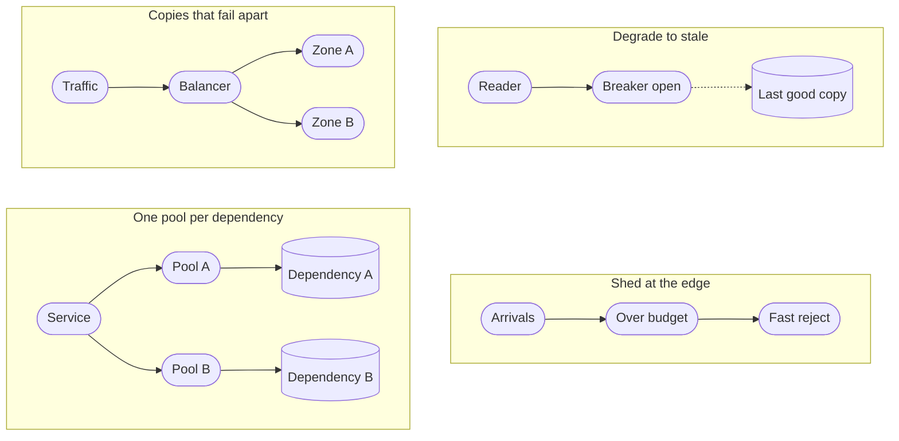

> Containment is cheaper than prevention, because you cannot prevent all of it.

---

<!-- _class: diagram -->

`Reliability kit · failure domains`

## Redundancy only helps when the copies can fail apart.

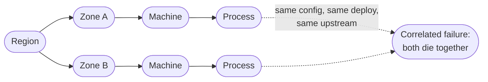

> Two copies of the same mistake is one copy.

---

<!-- _class: list-steps -->

`Reliability kit · containment`

## A slow dependency takes the whole building unless something bounds the wait.

1. Timeout
   - Bound the wait, so a slow callee cannot hold your resources.
2. Retry with backoff
   - Recover from a blip, with a budget and jitter. Retries without them are a reinforcing loop.
3. Circuit breaker
   - Stop calling something that is clearly down, and let it recover.
4. Bulkhead
   - Give each dependency its own pool, so one queue cannot drain them all.

---

<!-- _class: list-tabular def -->

`Reliability kit · the objectives`

## Four words people use interchangeably decide whether you may ship this week.

1. SLI
   - The measurement: the share of requests served under 300 milliseconds.
2. SLO
   - Your internal target for it, such as 99.9 percent over 28 days.
3. SLA
   - The external promise, with money attached, and always looser than the SLO.
4. Budget
   - What the objective lets you spend. Exhausted, feature work stops.

---

<!-- _class: list-tabular metric -->

`Reliability kit · the nines`

## An availability target is a budget that shrinks fast.

1. 99 percent
   - 3.65 days per year
2. 99.9 percent
   - 8.8 hours per year
3. 99.99 percent
   - 53 minutes per year
4. 99.999 percent
   - 5.3 minutes per year

---

<!-- _class: content -->

`Reading that table`

## Past three nines the humans stop being fast enough.

Fifty-three minutes a year is about one incident with a page, a login, a look at a dashboard and a decision. So four nines does not mean a faster on-call engineer. It means automatic failover and automatic rollback, because a person is no longer in the loop.

Each nine roughly multiplies the cost. Pick the number the business actually needs, and write down what you are choosing not to buy.

---

<!-- _class: cards-grid three -->

`Reliability kit · observability`

## Each signal answers a different question, and none of them replaces another.

- Metrics
  - Cheap, aggregate, always on. They tell you that something is wrong.
- Logs
  - Detailed, expensive, one event at a time. They tell you what happened in one case.
- Traces
  - One request across every service. They tell you where the time actually went.

> If you cannot answer "which dependency is slow" inside a minute, you have metrics, not observability.

---

<!-- _class: split-panel proof cat-5 -->
<!-- _header: "" -->

`Reliability kit · degradation`

## A well-designed system gets worse in an order somebody chose.

Under pressure something has to give. Either you decided in advance which features degrade, or the system decides at random and drops the one that takes money.

- The rule
  - Every feature has a stated tier, and the lowest tier fails first by design.
- Read paths outlive write paths
  - Serving something slightly stale beats serving an error page, for almost every product.
- The fallback is exercised
  - An untested degraded mode is untested code running in your worst hour.

---

<!-- _class: list-criteria -->

`Reliability kit · the invariants`

## Production earns trust one of these at a time.

1. Every dependency has a defined failure behavior
   - Written down: degrade, queue, or fail fast. Never "we will see."
2. Redundant copies fail independently
   - Different zones, different deploys, different upstreams. Otherwise it is one copy.
3. Recovery is practiced
   - Restores, failovers and rollbacks happen on a schedule, not for the first time at 3am.
4. The system tells you before a user does
   - Alerts fire on the indicator, never on the complaint.

---

<!-- _class: divider -->

`Security`

## Assume the boundary is already crossed.

---

<!-- _class: diagram -->

`Security kit · the patterns`

## All four defenses assume somebody is already inside.

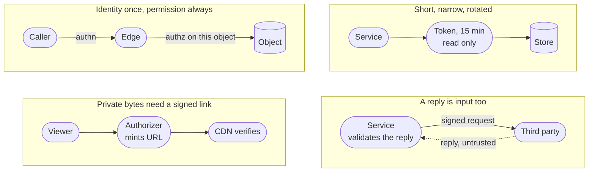

> All four of these assume the edge has already failed.

---

<!-- _class: diagram -->

`Security kit · trust boundaries`

## Every arrow that crosses a trust boundary needs a check on the far side.

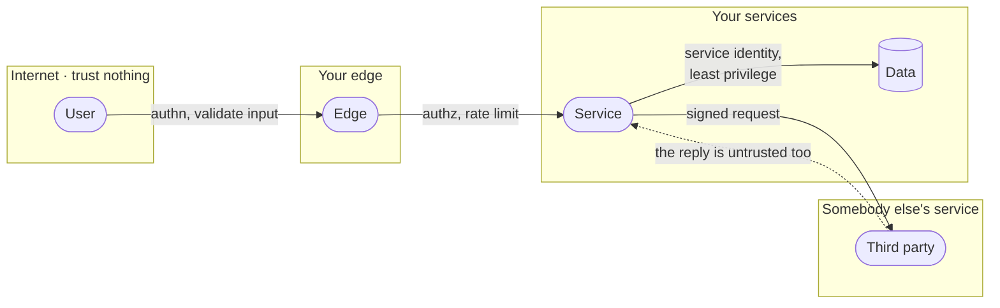

> The check belongs on the far side of the line, never the near side.

---

<!-- _class: compare-prose -->

`Security kit · the pair`

## Authentication asks who you are. Authorization asks what you may touch.

- Authentication
  - Establishes identity once, at the edge, and hands down a claim anyone downstream can verify. Getting it wrong lets the wrong person in.
- Authorization
  - Decides, on every single request, whether this identity may touch this specific object. Getting it wrong lets the right person read somebody else's data.

---

<!-- _class: split-panel proof cat-6 -->
<!-- _header: "" -->

`Security kit · least privilege`

## Least privilege is measured by what one stolen credential can reach.

Assume any single credential eventually leaks. The design question is not whether that happens; it is how far the person holding it can travel, and for how long.

- The check
  - You can say in one sentence what each service account could reach if stolen.
- Scope it and expire it
  - Narrow permissions, short lifetimes and automatic rotation beat a careful human.
- Separate read from write
  - Most services need one or the other. Almost none needs to delete.

---

<!-- _class: list-tabular def -->

`Security kit · encryption`

## Encryption has three states, and a fourth thing that outranks all of them.

1. Transit
   - TLS everywhere, including between your own services. Networks are untrusted.
2. Rest
   - Disk and backup encryption. Stops a stolen device, not a stolen credential.
3. Use
   - Decrypted in memory to be processed. The hardest state, and the one attacked.
4. Keys
   - A managed store or an HSM, rotated on a schedule, never in the repository.

---

<!-- _class: checklist -->

`Security kit · threat modeling`

## Six questions find the holes before somebody else does.

- [ ] Can someone pretend to be another identity? `spoofing`
- [ ] Can data be changed in transit or at rest? `tampering`
- [ ] Can an actor deny having done something? `repudiation`
- [ ] Can private data reach the wrong reader? `disclosure`
- [ ] Can one caller exhaust a shared resource? `denial`
- [ ] Can a caller gain rights nobody granted? `elevation`

---

<!-- _class: content -->

`Security kit · your dependencies`

## Most of the code you ship, you did not write and have not read.

Maya's Tuesday stopped when a package registry went down. That same registry is also the shortest path into her build: whoever can publish a version she installs can run their code on her machine, and then inside her deploy.

Pin exact versions and commit the lock file, so the build you tested is the build that ships. Keep an inventory of what you actually depend on, including everything your dependencies pulled in behind you. Take updates on a schedule you chose rather than the moment they appear, and read the diff of anything that touches a credential, a network call, or a build step.

---

<!-- _class: cards-stack -->

`Security kit · quotas`

## An authorized caller can still take the whole system down.

- Reach for it when
  - Anything is shared: a database, a queue, a paid third party, an image decoder.
- Walk away when
  - The caller is a trusted internal batch you would rather see fail loudly than throttled.
- The constraint you inherit
  - A limit needs an identity to count against. Use the account, the key and the address.

---

<!-- _class: list-criteria -->

`Security kit · the invariants`

## Sign your name to a design only when you can say all five.

1. Every request is authorized against the specific object
   - Not the endpoint. Object-level checks are where the breaches happen.
2. Secrets never enter the repository or a log line
   - They live in a managed store, are injected at runtime, and they rotate.
3. All input is untrusted, including from your own services
   - A compromised internal caller is the ordinary case. Design for it.
4. Every privileged action is attributable
   - An immutable record of who, what, when, and from where.
5. Every dependency is pinned, inventoried and rate-limited
   - You did not write most of your code, and an authorized caller can still exhaust you.

---

<!-- _class: content -->

`Your turn`

## Pick a store for each of these, and name the query that will hurt.

One: a table of orders, ten thousand a day, where support answers questions nobody has asked yet. Two: a session token, looked up on every request and never scanned. Three: eight years of sensor readings, written once, read by device and by day.

Write the store and the one query that will cross a partition. Then turn the page.

---

<!-- _class: list-tabular -->

`One answer`

## One of these never leaves relational. The other two were never relational to begin with.

1. Ten thousand orders a day
   - Relational, for years. Ten thousand a day is nothing, and the unasked questions are the requirement. Nothing crosses a partition, because nothing is partitioned.
2. A session token
   - Key-value. Exact key, no scan, expiry built in. The query that hurts is "which sessions belong to this user".
3. Eight years of readings
   - Wide-column by device and time — or a time-series store, which is that shape with retention built in. The query that hurts is one day across every device.

---

<!-- _class: content -->

`Your turn · discover`

## Registration opens at nine. Discover the system before you design any of it.

Twelve thousand students, every one of them refreshing at 08:59. Six thousand courses, most with a hard seat limit. A seat handed to two people is something a human has to unpick, by hand, with an apology.

Write four lines: the protagonist, the antagonist, one invariant that must never break, and the number that describes the antagonist. Then turn the page.

---

<!-- _class: code -->

`One answer · discover`

## Four lines, and the last two decide the design.

```text
Protagonist  A student at 08:59, one course short of a full timetable.
Antagonist   Twelve thousand people arriving in the same second.
Invariant    A seat is held by one student or by nobody. Never two.
The number   ~12,000 requests in the first second, then near zero all term.
```

The invariant wants one writer and a transaction. The number wants everything spread wide. Those two pulling against each other is the design.

---

<!-- _class: content -->

`Your turn · design`

## Now design it, on the same four lines.

You have the six kits and everything in them. Name the rung this is asking for, two entries you would reach for and what each one holds up, and one box you would take out on paper.

Do not draw an architecture. Four lines again, then turn the page.

---

<!-- _class: list-tabular -->

`One answer · design`

## The invariant picks the store. The spike picks what goes in front.

1. The rung
   - Scaled. The load is known and the invariant is not negotiable.
2. Relational, and the condition goes inside the write
   - Decrement `WHERE seats_left > 0`, then check how many rows changed. Read the count first and decide in your code, and two requests both see the last seat.
3. A bounded queue in front of it
   - Admitted in order, each told their place. The store never sees twelve thousand at once.
4. What you would remove
   - The queue, once registration closes. It earns its place one hour a year.

---

<!-- _class: divider numbered -->

`Part five`

## Now we design the thing Maya opened while the train sat.

---

<!-- _class: code -->

`Instagram · the worksheet`

## You fill in all of these before the first box, except the eighth. That one you discover.

```text
Protagonist   A reader on a phone. Twelve opens a day, on cellular.
Antagonist    The shape of the follow graph — a tail at 5×10⁸ edges.
Purpose       A fresh, personal, ranked page in under a second.
Boundary      In: feed, posts, edges, media. Out: the phone, the network, the law.
Environment   Evening peak ~2.5x the mean, partitions, duplicate deliveries, people who want in.
Constraints   200 ms p99 · 60 opens per write · media durable forever
Invariants    A post reaches eligible followers · media never lost · a like counts once
Bottleneck    Suspected: filling in each post. Confirm it once the read path exists.
Solution type Scaled. Not an MVP, not optimal.
```

---

<!-- _class: list-criteria -->

`Instagram · what it must do`

## The whole product rests on four operations.

1. Post a photo
   - Upload media, attach a caption, publish it to the people who follow you.
2. Follow an account
   - Build the directed graph that decides whose posts you are eligible to see.
3. Read a feed
   - A ranked, paginated page of recent posts from the accounts you follow.
4. React
   - Like and comment, with counts visible on every post.

---

<!-- _class: list-criteria -->

`Instagram · what it must guarantee`

## What you promise decides the architecture more than what you build.

1. The feed serves in under 200 milliseconds
   - Server-side, 99th percentile, measured from the reader's own region.
2. Reads dominate writes by about sixty to one
   - Counted in opens. Push fan-out nearly erases that underneath: 330K feed writes a second against 420K feed reads.
3. Posts, media and the graph are durable forever
   - Lose any of the three and nothing rebuilds them. Only derived data rebuilds.
4. Eventual consistency is fine on the feed
   - A late post and a lagging count are fine. A blank count is not.

---

<!-- _class: content -->

`Instagram · the estimate, worked`

## Two assumptions and some division give you every number that matters.

Assume 500 million daily users opening the feed twelve times a day, and 100 million photos posted a day. The rest is division. Twelve opens each, times five hundred million people, over the seconds in a day: about `70K` feed opens a second. A hundred million posts over the same day: `1.2K` writes. At two megabytes each: `200 TB` a day. The ratio lands near `60:1`.

One of those numbers does less work than it looks. Change the 500 million, holding opens and posts per person fixed, and the ratio does not move at all.

---

<!-- _class: list-tabular -->

`Instagram · what each number decides`

## Four numbers decide something here. The 500 million users decide nothing.

1. Writes · 1.2 K/s
   - One machine could take the posts. Each one becomes hundreds of feed writes, which is the hard part.
2. Feed opens · 70 K/s
   - The number everyone sizes from, and an open is not a request. The real one comes later.
3. Media · 200 TB a day
   - An object store, not a database. Settled right here.
4. Followers · up to 500 M
   - The only number with no ceiling. Two read paths come from this.

---

<!-- _class: content -->

`Your turn`

## Redo it for a smaller product before you turn the page.

Fifty million daily users, opening the app four times a day, posting two million photos. Work out reads per second, writes per second, and the ratio between them.

Do it now, on paper, in under a minute. Cover the next slide until you have one. The point is not the answer; it is that you can produce one at all, in the meeting where it is being decided.

---

<!-- _class: content -->

`The answer`

## The ratio moved, and the reason it moved is the lesson.

`50M × 4 = 200M reads/day ÷ 86,400 ≈ 2.3K reads/s` · `2M ÷ 86,400 ≈ 23 writes/s` · `ratio ≈ 100:1`

A thirtieth of the read traffic, and the ratio went from 60:1 to 100:1. It moved because you changed how often each person posts, not just how many people there are. The ratio is opens per user divided by posts per user: it survives being wrong about population, never about behavior.

---

<!-- _class: content -->

`Instagram · what the average hides`

## A daily average is not a capacity number, and two multipliers separate them.

Seventy thousand a second counts opens, averaged across a whole day. A fleet serves neither opens nor averages.

An open is a session: the reader scrolls, and every screenful is another fetch. Call it six, which already puts the mean read rate at 420K a second. Traffic is not flat either — the evening peak runs a few times the daily mean. Call it two and a half.

`70K × 6 × 2.5 ≈ 1M page-fetches a second.` Size against that, and write both multipliers next to it. Leaving them out is how a fleet gets built an order of magnitude too small, and this pair is the pair most often left out.

---

<!-- _class: diagram -->

`Instagram · the graph`

## The follow graph is directed, and the two directions are not the same size.

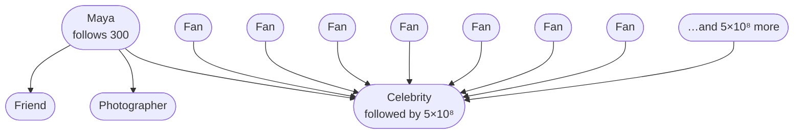

> Every hard problem in this design sits on the number nothing caps.

*The number of accounts you follow is capped at 7,500. The number who follow you is capped by nothing. Every hard problem in this design sits on that second number.*

---

<!-- _class: split-panel capstone cat-7 -->
<!-- _header: "" -->

`Instagram · the one sentence`

## Your following list is capped. Your followers list is capped by nothing.

Instagram caps your following list at seven and a half thousand accounts. Nobody limits how many people may follow you. An account on the far end of that second number — hundreds of millions of followers — is called a **super node**, and every hard problem here comes from one.

- Following, per person
  - At most 7,500. A read of that list is one partition and a sorted range.
- Followers, per person
  - About 150 for most people. Five hundred million at the top. A million times apart.
- Everything after this
  - Follows from that asymmetry. Nothing else in the design spans that range.

---

<!-- _class: code -->

`Instagram · the storage`

## The edge is stored twice, because it answers two different questions.

```text
following                              followers
  PK  (source_id)                        PK  (target_id, bucket)
  CK  (target_id)                        CK  (created_at DESC, source_id)
  val bucket, created_at                 the follower list, newest first
  "does A follow B?" is a point read     bucket = hash(source) % B(target)
  capped at 7,500 rows                   B = clamp(followers / 10_000, 1, 512)
```

*The forward edge stores the bucket its reverse row went into. Without that, an unfollow years later cannot find the row to delete: `B` has grown since, so recomputing `hash(source) % B` lands somewhere else. A background job rebuilds the reverse table from the forward edges and repairs any drift.*

---

<!-- _class: cards-stack -->

`Instagram · the number that must not shrink`

## B is a high-water mark on the account, not a live follower count.

- Counts fall, and B does not follow them down
  - Someone unfollows and the count drops. Shrink `B` and every edge in the buckets above it is stranded.
- A fan-out worker reads B fresh
  - Never from the cached count a profile page shows. A stale, smaller `B` scans too few buckets and skips the newest followers.
- The low buckets run heavy
  - Edges written while `B` was small crowd the early buckets, until `B` reaches its cap.

---

<!-- _class: compare-table -->

`Instagram · what each read costs`

## Four of these reads are cheap. The fifth is the whole problem.

| The read | The path | What it costs |
| --- | --- | --- |
| Does A follow B? | `following (A)` then `B` | One point read |
| Who does A follow? | `following (A)` range | 7,500 rows, one partition |
| Who follows B, below the bucket line? | `followers (B, 0)` range | ~10⁴ rows, one partition |
| Follower count | `user_edge_stats` | One point read, cached |
| **Who follows B, celebrity B?** | `followers (B, 0..511)` | **5×10⁸ rows, 512 partitions** |

---

<!-- _class: content -->

`Let us get this wrong`

## Design it the obvious way: when you post, write into every follower's feed.

The reader then does almost nothing. One lookup, one page, no merging, no ranking across sources. It is fast, it is simple, and for an account with two hundred followers it is unambiguously correct: two hundred small writes, and every reader gets a page in a millisecond.

Hold that design in your head. Now a single account with five hundred million followers posts one photograph. Before you turn the page, predict what happens.

---

<!-- _class: split-panel metric -->

`One post, one celebrity`

## 25 GB

Five hundred million feed inserts at roughly fifty bytes each, from a single API call.

- 500 seconds to drain, alone
  - At a million inserts a second with nothing else arriving. Ordinary posts keep coming at 330K, so the real clear is `5×10⁸ / (1M − 330K)`, about thirteen minutes.
- 330K inserts a second
  - The platform's ordinary load: 1.2K posts times a mean fan-out near 280. Totals need the mean. The median is far lower and would halve your estimate.
- 25 minutes of everyone else's work
  - Not a wait — a quantity. One post equals what the whole platform normally produces in twenty-five minutes.

---

<!-- _class: cards-grid four -->

`One super node, four fires`

## Writing 25 GB from one call is only the first thing that breaks.

- The fan-out queue
  - 25 GB of inserts from one call, in front of everybody else's posts.
- The hot partition
  - Unbucketed, those edges are one partition key on one replica set.
- The cache
  - 25 GB of churn evicts the working set of readers who did nothing wrong.
- The thundering herd
  - One cache key, invalidated on publish, missed by a million readers at once.

> A skewed key produces a system where one machine is on fire and the rest are idle.

---

<!-- _class: content -->

`Why the hybrid is forced`

## Neither strategy is wrong. Each one is wrong somewhere.

Pushing costs one write per follower, and the follower count is unbounded. Pulling costs one read per followee, and the followee count is capped at seven and a half thousand. So push is cheap exactly where the unbounded side is small, and pull is cheap exactly where the bounded side is what you walk.

There is a second reason, and it is the better one: a celebrity's recent-posts list is written once and read five hundred million times. Nothing else in the system has a ratio like that.

---

<!-- _class: split-compare -->

`Decision`

## Push below the threshold, pull above it, and merge at read.

The two strategies fail at opposite ends of the same graph, so the design uses each one where the other breaks.

- One strategy for everyone
  - Simple to explain, guaranteed to fail at one end. Push drowns on celebrities; pull costs hundreds of reads per page for everyone else.
- Split at the threshold
  - Ordinary posts land in a page that is already built; the celebrities she follows are fetched on demand and merged in, so no writer ever fans out to millions. The read costs one lookup plus the celebrity pulls.

> One writer fanning out to five hundred million is the case no amount of tuning survives. That is what sets the line.

---

<!-- _class: content -->

`Instagram · the threshold`

## Fifty thousand followers is the line, and the honest predicate is a rate.

Fifty thousand puts a fraction of a percent of accounts on the pull path, yet someone following three hundred typically has ten to thirty above it — the accounts a person picks are not a random sample.

Thirty pulls at a one-percent slow call puts the page in trouble, so **cap the pulls at twenty**, newest first.

The better predicate is fan-out work per day. Fifty thousand followers posting forty times a day costs more than two hundred thousand posting weekly, and the product is what you pay for.

---

<!-- _class: diagram -->

`Instagram · the honest predicate`

## A follower count is a proxy. The work is followers times how often they post.

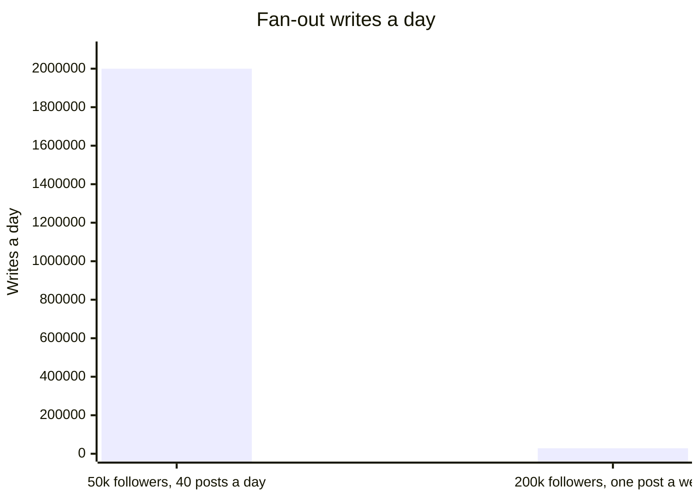

> The smaller account costs seventy times more. A follower count on its own cannot tell you that.

---

<!-- _class: split-panel proof cat-6 -->
<!-- _header: "" -->

`Instagram · checking the fix`

## Capping the pulls at twenty does not meet the promise it was chosen to meet.

At thirty pulls and a one-percent slow call, `1 - 0.99^30` puts twenty-six percent of pages on a slow dependency. Cap at twenty and it is eighteen percent — still eighteen times a 99th-percentile budget. The cap sounded like the answer and fails its own arithmetic, which is exactly why you run the check on your own fixes.

- The cache is what bounds it
  - Those pulls hit a cache, so their slow rate is far below one percent — measure it rather than assuming, because at 0.2 percent twenty pulls are still four percent of pages.
- The deadline is the backstop
  - Fire every pull, render at eighty milliseconds with whatever arrived, and let the stragglers land on the next fetch.
- A cap still costs someone
  - A reader following seven and a half thousand accounts can have hundreds above the line. For them twenty is not trimming the quietest — it is most of their pull path.

---

<!-- _class: split-panel capstone cat-8 -->
<!-- _header: "" -->

`Instagram · the hinge`

## The celebrity is a protagonist of the product and the antagonist of your design.

The product exists partly for her. She is the reason a hundred million people opened the app this morning, and the reason the write path cannot be one code path. Both things are true at once, and holding both is what designing feels like.

- For the product
  - She is the most valuable account on the platform, and she must post instantly.
- For the design
  - She is a five-hundred-million-edge node that breaks every uniform assumption.
- What you do about it
  - You do not resolve the tension. You build a second path and name why it exists.

---

<!-- _class: diagram -->

`Instagram · the write path`

## The graph service is the box everyone forgets to draw.

```mermaid
flowchart LR
  C(["Client"]) -->|"1 · presigned upload"| OS[("Object store")]
  OS -->|"2 · acknowledged"| C
  C -->|"3 · post"| API(["Gateway"]) --> W(["Post service"])
  W -->|"4 · store it"| PDB[("Post store<br/>by author id")]
  W -->|"5 · publish"| Q[["Event log"]]
  Q --> FAN(["Fan-out worker"])
  FAN -->|"6 · who follows me?"| GS[("Graph service<br/>followers, bucketed")]
  FAN -->|"7 · push, if below threshold"| FC[("Feed cache<br/>per reader")]
```

> Step 3 comes after step 2 on purpose. Publish first and the post exists without its picture.

*Step 3 comes after step 2 on purpose. Publish before the bytes are acknowledged and the post becomes readable while its media does not exist, so every reader who reaches it sees a broken tile. Transcoding may still be running — a variant that is not ready falls back to the original — but the original must be there before anybody is told the post exists.*

---

<!-- _class: diagram -->

`Instagram · the read path`

## For almost everybody, reading the feed is one lookup.

```mermaid
flowchart LR
  C(["Client"]) -->|"read feed"| API(["Gateway"]) --> FR(["Feed service"])
  FR -->|"the pushed page"| FC[("Feed cache")]
  FC -->|"the page"| C
  C -->|"then the pictures,<br/>separately"| CDN(["CDN"])
```

> The page is already sitting there, because somebody wrote it at post time.

---

<!-- _class: diagram -->

`Instagram · the read path, above the line`

## A celebrity in your feed is what turns one lookup into four.

```mermaid
flowchart LR
  FR(["Feed service"]) -->|"who do I follow?"| GS[("Graph service")]
  FR -->|"pull, above<br/>the threshold"| CC[("Celebrity list cache")]
  CC -.->|"only on a miss"| PDB[("Post store")]
  GS --> M(["Merge · filter<br/>rank · hydrate"])
  CC --> M
  M -->|"the page"| C(["Client"])
```

> The merge runs after the gather, never beside it.

*The pull goes through a cache, not straight to the store. That box is the whole reason the hybrid is affordable: one celebrity's recent-posts list is written once and read five hundred million times, so it is the most cacheable object in the system.*
---

<!-- _class: list-steps -->

`Instagram · assembling a page`

## Hydration costs more than the other three stages together.

1. Fetch and merge
   - Read the precomputed page, then pull recent posts from the celebrities she follows.
2. Filter
   - Drop blocked accounts, deleted posts and private accounts she does not follow.
3. Rank
   - Score the candidates. Paginate on a stable key, never on the score.
4. Hydrate
   - Fetch each post, its media URLs, its counts, and whether she already liked it.

---

<!-- _class: content -->

`The number we missed`

## Every page you serve is eighty lookups behind it, so the read number is eighty million a second.

A twenty-item page needs four lookups an item — the post row, the media variants, the counts, and whether this reader liked it. Eighty a page, against the million page-fetches a second the peak estimate gave you, is eighty million.

That is the number the worksheet left open, and it is larger than every number on it.

---

<!-- _class: content -->

`The number behind that number`

## Eighty million is rows. The number you size a fleet from is calls.

Batch the four lookups across the whole page and a page costs four calls, not eighty. Four million calls a second against eighty million rows. Rows are the work; calls are what your services receive, and sizing a fleet from the wrong one is a twentyfold mistake.

Do not fold the count into the feed entry; it is written at post time, when the count is zero. Fold the like check at read time: one batched read across the twenty candidates.

Batching is not only about throughput. Eighty parallel calls put fifty-five percent of pages on a slow dependency — that is `1 - 0.99^80`, against a 99th-percentile promise.

---

<!-- _class: split-panel proof cat-1 -->
<!-- _header: "" -->

`Instagram · the likely bug`

## Your own post must appear instantly, or people think the upload failed.

The feed is eventually consistent, which is correct for everyone else's posts and completely wrong for your own. A person who posts and does not see it reads that as data loss, not as staleness, and posts again.

- Where it comes from
  - Read-your-writes, the consistency level from Part four, applied to one reader's own posts.
- Write your own feed synchronously
  - Inside the POST request, before it returns. One extra write, on one key.
- And let the client help
  - It inserts the post it just created optimistically, and reconciles on the next fetch.

---

<!-- _class: diagram -->

`Instagram · the upload`

## Media never touches your API servers.

```mermaid
flowchart LR
  C(["Client"]) -->|"1 · ask"| API(["API"])
  API -->|"2 · presigned URL"| C
  C -->|"3 · bytes"| OS[("Object store")]
  OS -->|"4 · event"| TR(["Transcode"])
  TR -->|"5 · variants"| OS
```

> Step 2 is the only place an untrusted client writes straight into your storage.

*So the grant names the exact key it may write — let the client choose the key and it writes over somebody else's media — and carries four limits besides: one content type, a size ceiling, a short expiry, and a rate per account. Without those four, anyone can fill your storage at your expense, and step 4 hands bytes they chose to an image decoder.*

---

<!-- _class: diagram -->

`Instagram · serving it back`

## A private photo needs a link that expires.

```mermaid
flowchart LR
  V(["Viewer"]) -->|"1 · request"| AZ(["Authorizer<br/>checks follow and block"])
  AZ -->|"2 · signed URL,<br/>good for minutes"| CDN(["CDN verifies"])
  CDN -->|"3 · serves"| V
```

> The authorizer decides once. After that the CDN only checks a signature, and a signed link outlives the decision behind it.
---

<!-- _class: content -->

`Instagram · what video changes`

## One number in this design assumed a two-megabyte photo.

A phone uploads video in parts, because one request that dies at ninety percent would otherwise start over. So the presigned grant covers a multi-part upload rather than a single PUT.

Transcoding stops being "make a few sizes" and becomes a ladder of bitrates cut into short segments, so a player can step down when the signal weakens. The CDN then serves thousands of small objects per video instead of one.

The fallback goes too. You can serve a photo at full size while its variant renders; you cannot serve a source video, so the post stays unreadable until one rendition finishes. And the 200 TB a day becomes petabytes, where "durable forever" starts to cost real money.

---

<!-- _class: split-panel proof cat-4 -->
<!-- _header: "" -->

`Instagram · the path nobody designs`

## A million likes on one post is the follower list again, on a different axis.

Every like is a write against the same post id — one key, one partition, one leader — arriving tens of thousands a second. That is the hot spot the data kit warned about, and the queue will sometimes deliver the same like twice.

- The row is the truth
  - Store the pair once, keyed by reader and post. The count is an aggregate you rebuild from it, which is what survives a redelivery or an unlike.
- Shard the hot counter only
  - Increment a random one of a hundred sibling keys, but only when the row insert actually created a row. A blind increment double-counts every redelivery, forever.
- Comments are the second unbounded list
  - Bounded per reader, unbounded per post. Page them; never load them with the post.

---

<!-- _class: cards-grid four -->

`Instagram · the changes nobody draws`

## Every design gets drawn at rest. These four happen while it is running.

- A new follow
  - Their earlier posts fanned out before you followed them. Backfill a few, or state the gap.
- An unfollow
  - Pushed entries do not remove themselves. Filter at read against the current edge.
- The same post twice
  - A crossed threshold leaves it in the pushed page and in the pull. Dedupe at the merge.
- A cold celebrity key
  - A million readers miss it at once. Serve them one refill, not a million reads.

> A feed is a cache of a relationship. Change the relationship, leave the cache alone, and the reader is shown something untrue.

---

<!-- _class: cards-grid four -->

`Instagram · where it breaks`

## Three of these are certainties and one is only likely. Each already has its answer.

- Celebrity post
  - The fan-out queue floods. Answer: the pull path above the threshold.
- Feed cache eviction
  - Cold readers cost a rebuild. Answer: the same render deadline, then rebuild behind the request.
- Redelivery
  - The queue delivers twice. Answer: the feed entry is keyed on reader and post.
- Zone loss
  - A whole zone disappears. Answer: media replicated, every derived store rebuildable.

---

<!-- _class: checklist -->

`Instagram · the invariants`

## Six sentences have to hold, or the design is not finished.

- [ ] A post is visible to every eligible follower who reaches it — except past the pull cap, where the same quiet accounts lose every page. `rotate the cap, or say it out loud`
- [x] Media is never lost once an upload is acknowledged. `durable`
- [x] A like counts exactly once per reader and post. `idempotent`
- [x] A feed page never repeats or skips an item. `stable cursor + dedupe at merge`
- [ ] A blocked account is filtered at read — but a signed media URL outlives the check. `keep the TTL short`
- [x] Every derived store rebuilds from posts and edges. `rebuildable`

---

<!-- _class: divider numbered -->

`Part six`

## Now run the whole method again, on something you could ship this month.

---

<!-- _class: content -->

`Parking · the ask`

## A lot owner wants drivers to scan a sticker on the bay and pay to park.

No app to download. No account to create. A driver walks up, points a phone at a sticker, pays, and walks away.

Instagram was one design at one rung, and it was already enormous when we met it. This one starts at nothing and climbs, which is what your first year actually looks like.

---

<!-- _class: compare-prose -->

`Parking · the cast`

## The driver has one hand free and about thirty seconds of patience.

- The protagonist
  - A driver who has already parked, standing in the rain with a phone in one hand. They want to pay and walk away. They will not install anything and they will not make an account.
- The antagonist
  - The garage is underground and the signal is poor. A driver whose page hesitates taps Pay again, so the same park can be charged twice.

---

<!-- _class: code -->

`Parking · the worksheet, filled`

## You fill in eight of the nine before a single box goes on the board.

```text
Protagonist   A driver at the bay. One hand, thirty seconds, no app.
Antagonist    Poor signal underground, and a second tap on Pay.
Purpose       The car is paid for before the driver walks away.
Boundary      In: bays, sessions, payments, enforcement. Out: the card network.
Environment   Rain, cold hands, a low battery, a sticker somebody peeled.
Constraints   physical: no signal   economic: card fees
              human: thirty seconds  legal: refunds on request
Invariants    One park charges once · an expiry never extends by accident
Bottleneck    Suspected: none yet. Confirmed once wardens start asking.
Solution type MVP. Nobody knows yet whether drivers scan the sticker.
```

---

<!-- _class: cards-stack -->

`Parking · rung one, the MVP`

## Rung one is one lot, a printed sticker per bay, and the provider's card form.

- What you build
  - A sticker on every bay carrying a link with the lot and bay in it. The provider's own form takes the card, so the number never touches your server.
- What it buys
  - The only answer you need this month: do drivers scan the sticker, and do they finish paying.
- What it charges
  - A warden walks the lot typing bay numbers into a phone. That holds at one lot and gives out at ten.

---

<!-- _class: code -->

`Parking · rung one, the database`

## One table holds all of it: no partitioning, no cache, no queue.

```text
sessions
  id            uuid
  idem_key      unique. one park, one key, however many taps
  status        waiting, then paid or declined. a stale wait is swept
  lot_id, bay   which sticker was scanned
  plate         typed by the driver
  started_at    set when the payment clears
  expires_at    started_at plus the minutes bought
  amount_cents  what you charged
  payment_ref   the provider's id for the charge
```

Two hundred lots of forty bays turning over four times a day is 32,000 rows — one machine, for years.

---

<!-- _class: content -->

`Parking · what breaks first`

## Traffic breaks nothing here. Two other things break anyway.

Thirty-two thousand rows a day is a rounding error, so scale is not your problem and will not be for a long time. Say that out loud, because it stops a team building for a load that never arrives.

The first break is a double charge. The page hesitates on a weak signal, the driver taps Pay again, and one park costs them twice. That reaches a human the same day.

The second is the signal itself. The card form sits on the far side of a network that keeps disappearing.

---

<!-- _class: split-panel proof cat-2 -->
<!-- _header: "" -->

`Parking · rung one, charging once`

## Two taps on Pay have to produce one charge, and a retry must not add another.

The second tap is a different request that means the same thing. So the page mints one key for this attempt and keeps it across reloads, and the unique index decides — not your code.

- Insert first, before you charge
  - The key goes in a unique column, so a second tap conflicts on it instead of starting a second payment.
- On a conflict, read the row
  - Paid, hand back the receipt. Still waiting, charge again with that same key.
- One key, one stored answer
  - The provider saves the first result against that key and replays it, so a retry after a crash costs nothing.
- A refusal is an answer too
  - A declined key stays declined however often you send it. That attempt is over; the next needs a new key.

---

<!-- _class: content -->

`Parking · rung one, the weak signal`

## The phone can drop off after the card is charged, and it often does.

The card network answers your payment provider, not the driver's phone. So the provider calls you back on a webhook, and that call is what marks the session paid.

A lost signal then costs the driver a spinner rather than a park: the webhook lands, the row flips to paid, and the warden sees a paid bay whether or not the phone ever came back.

A decline is an answer, not a gap: write it down and let the driver start a fresh attempt with a fresh key. Only a row that never got any answer at all — a closed tab, a webhook that never came — is one you sweep.

---

<!-- _class: content -->

`Parking · rung one, the callback you did not write`

## Anyone on the internet can call that webhook, and your provider will call it twice.

Check the signature your provider sends before you believe a single field in it. Skip that and you have built a free parking machine: anyone who can post to the endpoint can mark any bay paid.

Then expect the same call more than once, because a provider retries until you answer. The charge carried your key, so find the row by that key and let the repeat land on a row already paid.

---

<!-- _class: content -->

`Your turn`

## Wardens arrive. Say what they ask, how often, and what answers it.

Two hundred lots have gone live. A warden walks a lot of forty bays and needs to know which cars are paid for right now.

Write down the one question they ask the system, roughly how often it is asked, and the one index that answers it. Then turn the page.

---

<!-- _class: list-tabular -->

`One answer`

## The warden asks one small question, and it stays small.

1. The question
   - Is bay 12 in lot 40 paid at this moment. One row, never a list.
2. How often
   - Two bays a minute per warden, two hundred lots: about 400 a minute. Under ten a second.
3. What answers it
   - An index on lot, bay and expiry. The question is a point read and it stays one.

---

<!-- _class: cards-stack -->

`Parking · rung two, scaled`

## Two hundred lots, and the manual parts give out before the machine does.

- What actually changed
  - Not the traffic. The manual work. One warden typing bay numbers held at one lot and gave out long before two hundred.
- Give the warden a list, not a keyboard
  - The point read becomes one range scan per walk: every live session in this lot. Their phone already knows the bays.
- Move slow work off the path a driver waits on
  - Owner reports go to a read replica. Receipts and nightly payouts go behind a bounded queue.

---

<!-- _class: split-panel metric -->

`Parking · rung three, optimized`

## 13%

What the card fee takes from a three-dollar park, at thirty cents plus 2.9 percent.

- Servers cost pennies
  - Thirty-two thousand rows a day runs on the smallest machine sold. Tuning it saves nothing worth having.
- The fee is the bill
  - Thirty-nine cents of every three dollars, and most of it is a flat charge per transaction.
- So settle once a day
  - Authorize each park on the spot and charge the day's four together: 65 cents of fees, not a dollar fifty-five.

---

<!-- _class: compare-table -->

`Parking · what we refused`

## A junior would build these three first, and only one of them has arrived yet.

| Refused | Why | What would earn it |
| --- | --- | --- |
| A mobile app | A driver in the rain will not install one | Regulars who park daily, once they exist |
| Accounts and login | A screen between the sticker and the money | Rung three's settlement earned it |
| A live map of free bays | Needs a sensor in every bay | Somebody willing to pay for the sensors |

---

<!-- _class: list-tabular -->

`Parking · the ladder, climbed`

## One product climbed three rungs, and we skipped nothing on the way up.

1. MVP
   - One lot, one table, a card form. Bought the answer to "will anyone scan this".
2. Scaled
   - Two hundred lots. A replica for reports, a queue for receipts. Nothing sharded.
3. Optimized
   - Batched charges, because the profile said the fee was the bill and the servers never were.

---

<!-- _class: content -->

`Parking · where the kits landed`

## Five moves carried this design, and every one of them came out of a kit.

Relational, because nothing here outgrows one machine and the questions keep changing — pass one ended there. An index, on the one question a warden asks. Idempotency twice over: on the driver's second tap, and on a webhook your provider will send again. A read replica, to keep reports off the path a driver waits on. A bounded queue, for the work nobody is waiting for.

The security kit arrived as practice, not a card: the provider's form keeps card numbers off your servers, and a signed webhook keeps a stranger from marking bays paid. Not one of those is a product name, and not one of them was a guess.

---

<!-- _class: divider numbered -->

`Part seven`

## Now map the feed design back to the kits, including the entry we refused.

---

<!-- _class: compare-table -->

`Instagram · store and run`

## Every store-and-run entry landed somewhere specific in the feed design.

| Kit entry | Where it landed | Why that one |
| --- | --- | --- |
| Wide-column | The two edge tables | One key, then a sorted list of who is on the other end |
| Object store | Photo bytes and variants | Large, immutable, fetched by key, kept for years |
| Key-value | The feed cache | The key is known exactly and nothing is asked of the value |
| Durable log | Post events into fan-out | Producers outpace consumers, deliberately |
| Stateless services | Feed and post service | Any instance serves any reader; state lives elsewhere |
| Bounded queue | Fan-out and transcode | Unbounded, one celebrity means an outage |

---

<!-- _class: compare-table -->

`Instagram · scale and defense`

## The network, scale, reliability and security kits landed here too.

| Kit entry | Where it landed | Why that one |
| --- | --- | --- |
| Reduce | One cached list per celebrity | Written once, read five hundred million times |
| Spread | Posts by author, edges by bucket | The bucket bounds the biggest list we still fan out |
| Defer | Fan-out on write, below the threshold | Moves the cost out of the reader's 200 milliseconds |
| CDN with versioned URLs | Every photo variant | Same bytes for many readers, and purging is eventual |
| Bulkhead | Fan-out workers kept off the read path | A burst of ordinary fan-out must not starve the pool serving feeds |
| Object-level authorization | Every hydration | The endpoint check passes; the object check stops the breach |

---

<!-- _class: split-panel capstone cat-2 -->
<!-- _header: "" -->

`The entry we refused`

## The most useful entry here is the one we refused.

Most juniors asked to design Instagram reach for a graph database, because the words "social graph" are right there. The data kit already answered it, sixty slides before this design began.

- What the card said
  - Walk away when you have relationships but only ever join two hops.
- What the feed actually does
  - Walks one graph hop, me to the people I follow, then a keyed lookup that is not a traversal.
- Why the refusal matters most
  - A kit that only says yes is a catalog. One that says no is a tool.

---

<!-- _class: split-panel capstone cat-8 -->
<!-- _header: "" -->

`The removal test, run`

## Take one box out on paper, and follow what happens to the rest.

Part three set the test. Saying where each piece landed proves nothing about whether it is needed. Deleting pieces on paper is what tells you the design is finished.

- The celebrity list cache
  - Remove it and every reader of every celebrity post reads the store directly. It stays.
- The event log before fan-out
  - Remove it and the write waits for the whole fan-out before returning. It stays.
- The follower count cache
  - Remove it and every display of a profile counts rows. Keep it for display, and read `B` fresh.

---

<!-- _class: code -->

`The artifact`

## This is the whole method, and it fits on one page.

```text
Protagonist   ______________________  wants to ______________  so that ________
Antagonist    But ________________  —  and it is this big: ____________________

Purpose       ______________________________________________________________
Boundary      In: _________________________  Out: _________________________
Environment   ______________________________________________________________
Constraints   physical ______  economic ______  human ______  legal ______
Invariants    1 ____________________  2 ____________________  3 ____________
Bottleneck    ______________________________  measured at ____________________
Solution type MVP  ·  scaled  ·  optimized  ·  optimal  ·  specialized
```

---

<!-- _class: checklist -->

`The review`

## Run these six on any design, starting with your own.

- [ ] Who is the protagonist, and who are we not designing for? `casting`
- [ ] What is the antagonist, and what number describes it? `evidence`
- [ ] Which rung of the ladder is this, and does everyone agree? `frame`
- [ ] What breaks first at ten times the load? `scale`
- [ ] What happens when each dependency is slow rather than down? `failure`
- [ ] What can one stolen credential reach? `security`

---

<!-- _class: content -->

`Develop and deliver`

## The two movements this deck skipped are the only real check on the two it taught.

Design is where the thinking lives, which is why the deck stops here. Building is where you find out whether the thinking held: the boundary you drew turns out to cut through another team, the invariant you wrote needs a lock nobody planned for, the number you estimated is wrong by ten.

So take one design you made in these pages and build the smallest version of it that actually runs. Not to ship it. To find out which of your nine fields was a guess.

---

<!-- _class: list-steps -->

`What to do on Monday`

## The last of these four is the one that teaches you.

1. Pick the unglamorous system
   - Not a famous one. The service you were debugging on Thursday, or the pipeline nobody wants to own.
2. Cast it before you draw it
   - Protagonist and antagonist first, one sentence each. If you cannot name them, you do not understand it yet.
3. Fill the other seven fields
   - Let them argue with you. A field you cannot answer is the design question you have been avoiding.
4. Bring the page to your one-on-one
   - Ask the person across from you which field you got wrong. That conversation is the whole point of learning this.

---

<!-- _class: closing silent spectrum -->

## Learn the concepts and how they connect. The technology will change under you.

`How to Think About Systems`

Name the person, name the force, and the design follows. Maya never designed anything on Tuesday, and she met every word in Part one before she went to bed — not one of which was a product name.
