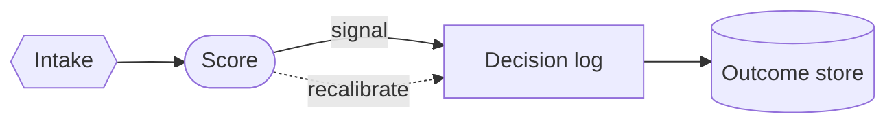
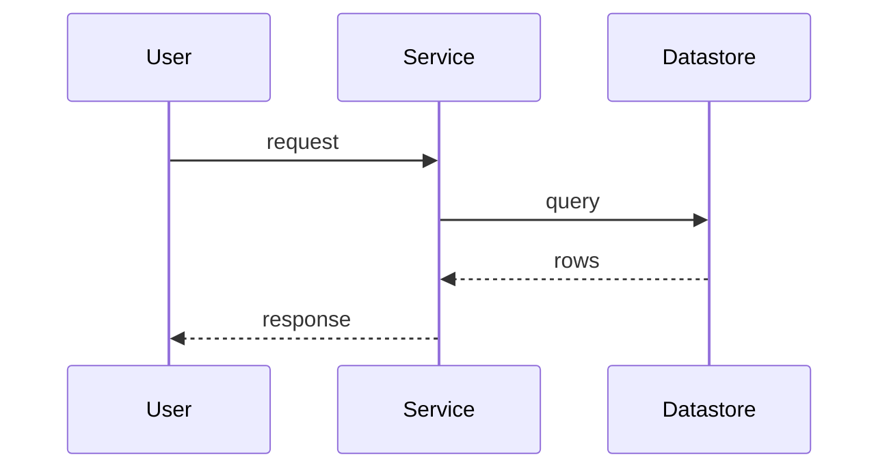
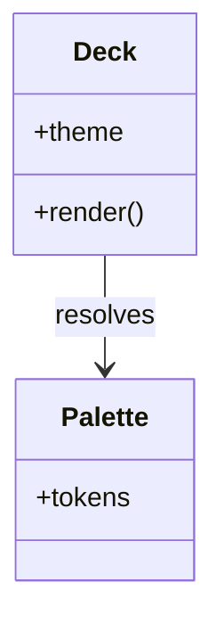

<!-- _class: title -->
<!-- _paginate: false -->
<!-- _header: '' -->
<!-- _footer: '' -->

# Borders and lines, named for the job.

`Universal token system · Phase 2`

*The diagram-structural foregrounds move off the `--c-` junk drawer onto the `--diagram-` group — same pixels, clearer names.*

---

<!-- _class: cards-grid -->

## Three structural foregrounds.

- diagram-stroke
  - The border around any categorical band fill (was `--c-stroke`).
- diagram-line
  - Edges, arrows, and connectors between nodes (was `--c-line`).
- diagram-accent-warm
  - A secondary warm accent — radar's second curve (was `--c-accent-warm`).

---

<!-- _class: diagram -->

`01 · Flowchart`

## Node borders read stroke; edges read line.

> Every box border is `--diagram-stroke`; every arrow and label connector is `--diagram-line` — both painted via the upgraded offline bridge.

---

<!-- _class: diagram -->

`02 · Sequence`

## Actor frames and signal lines, same two tokens.

> Actor boxes and the activation bars border on `--diagram-stroke`; the lifelines and signals draw on `--diagram-line`.

---

<!-- _class: diagram -->

`03 · Class`

## Boxes, dividers, and relations.

> Class-box borders and member dividers are `--diagram-stroke`; the relation arrow is `--diagram-line`.

---

<!-- _class: closing -->
<!-- _paginate: false -->
<!-- _header: '' -->
<!-- _footer: '' -->

## Structural foregrounds, off the junk drawer.

`Phase 2 of 7 · see engineering/decisions/2026-06-11-universal-token-system.md`
