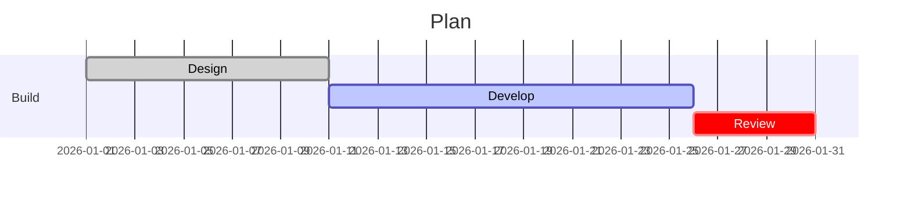
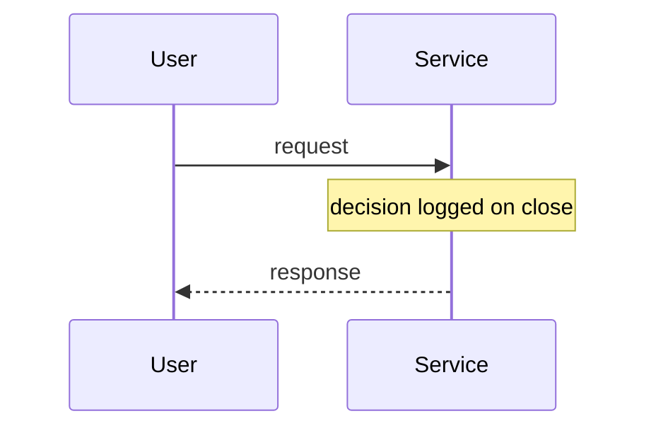

<!-- _class: title -->
<!-- _paginate: false -->
<!-- _header: '' -->
<!-- _footer: '' -->

# Two honest axes, not three muddled ones.

`Universal token system · Phase 3`

*One status vocabulary for the whole engine — and a separate, semantic name for the diagram lifecycle it was tangled with.*

---

<!-- _class: cards-grid -->

## Status is not lifecycle.

- Status axis
  - `--status-pass` / `-warn` / `-fail` / `-info` / `-mute` — one vocabulary shared by the state-discs and the charts.
- Diagram lifecycle
  - `--diagram-active` / `-done` / `-critical` — gantt task states, named for what they mean.
- Annotation
  - `--diagram-today` (the today line) and `--diagram-note` (aside surfaces).
- Why split
  - A gantt "in-progress" tone is not a "warn". Forcing them into one set was the magic; two axes is the truth.

---

<!-- _class: checklist -->

## Status axis — the state-discs.

- [x] Signal taxonomy ratified
- [x] Decision log live in staging
- [-] Pilot teams trained, two still circling back
- [ ] Exec sponsor confirmed for launch comms
- [/] Legacy export path — waived for v1

---

<!-- _class: diagram -->

`01 · Gantt`

## Diagram lifecycle — active, done, critical.

> Bars read `--diagram-done` / `--diagram-active` / `--diagram-critical` (each with its paired `-mark` stroke); the today line reads `--diagram-today`.

---

<!-- _class: diagram -->

`02 · Sequence + note`

## Annotation — note surface and today highlight.

> The note surface reads `--diagram-note`; its border borrows the `--diagram-today` highlight — value reuse made explicit, not hidden.

---

<!-- _class: closing -->
<!-- _paginate: false -->
<!-- _header: '' -->
<!-- _footer: '' -->

## One status vocabulary; an honest lifecycle.

`Phase 3 of 7 · see engineering/decisions/2026-06-11-universal-token-system.md`
