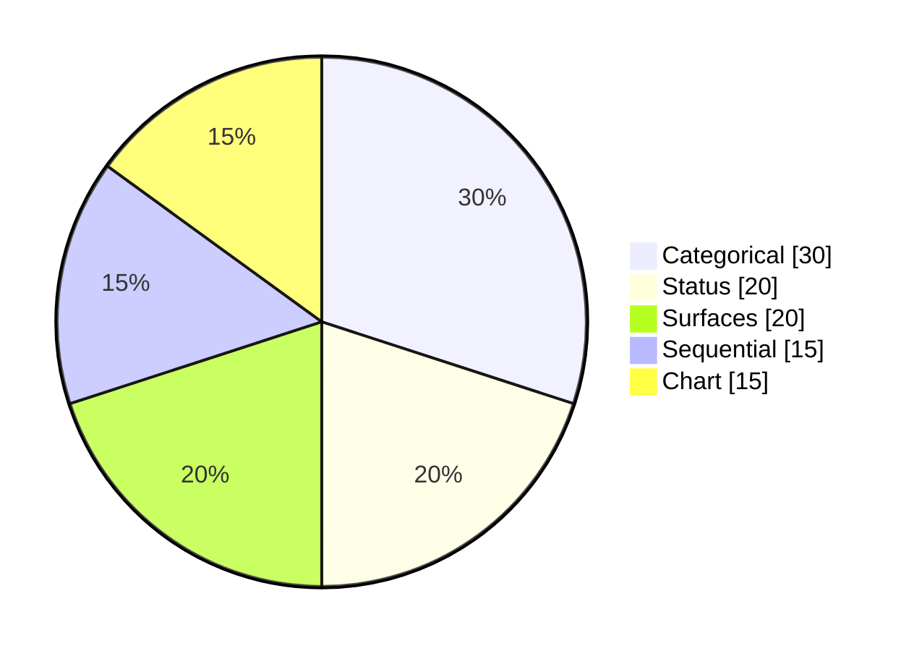

<!-- _class: title -->
<!-- _paginate: false -->
<!-- _header: '' -->
<!-- _footer: '' -->

# The universal token system, whole.

`Universal token system · Phase 7`

*Seven phases, one coherent vocabulary — what it means, how it is used, and a CI gate that keeps it that way.*

---

<!-- _class: cards-grid -->

## Organized on two axes.

- Abstraction
  - Primitive → Semantic → Component. What it means flows into how it is used.
- Render shape
  - css-rich (live cascade) vs bridge-flat (the offline Mermaid resolver) — now both evaluate the same expressions.
- Foreground
  - Ink, stroke, mark — painted on something. Named for its background with `on-`.
- Background
  - Surface, fill — things sit on it. Takes the bare role name.

---

<!-- _class: cards-grid -->

## Seven phases, each byte-identical.

- Categorical · structural
  - `--cat-N-fill/mark/on-fill/on-mark` and `--diagram-stroke/line`.
- Status · lifecycle
  - `--status-*` for the engine + charts; `--diagram-active/done/critical` for gantt.
- Surfaces · sequential
  - `--surface-inverse` + `--scheme-dark-*`; `--seq-*` frees "scale".
- Chart · self-policing
  - `--chart-cat-*` ends the bare-cat collision; a CI gate guards the vocabulary.

---

<!-- _class: diagram -->

`Proof`

## And it all still renders.

> Every colour above resolves through the new names across all three render paths — light and dark, fourteen palettes, zero visual change.

---

<!-- _class: closing -->
<!-- _paginate: false -->
<!-- _header: '' -->
<!-- _footer: '' -->

## A boardroom-ready token system, built to scale.

`Phase 7 of 7 · engineering/decisions/2026-06-11-universal-token-system.md`
