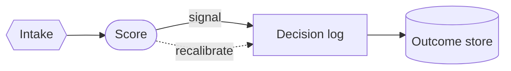
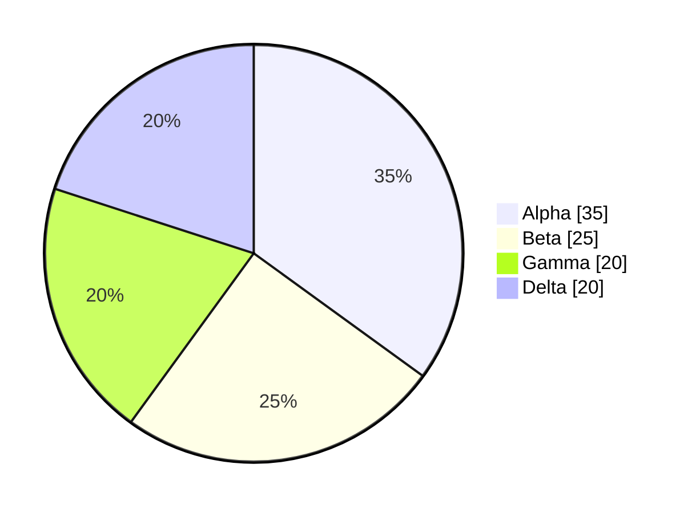
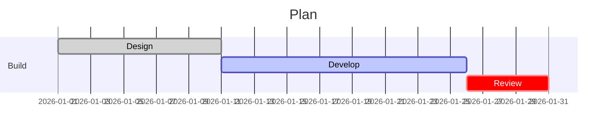

<!-- _class: title -->
<!-- _paginate: false -->
<!-- _header: '' -->
<!-- _footer: '' -->

# What you see is what it means.

`Universal token system · Phase 1`

*Self-describing colour tokens for the categorical layer — same pixels, clearer names, no magic.*

---

<!-- _class: cards-grid -->

## The categorical vocabulary, by role.

- cat-N-fill
  - Background. The pale categorical surface a band sits on (was `--cN-light`).
- cat-N-mark
  - Foreground. The saturated stroke, mark, or cScale feed (was `--cN-dark`).
- cat-on-fill
  - Foreground. Ink for text placed on a fill (was `--c-ink-light`).
- cat-on-mark
  - Foreground. Ink for text placed on a mark (was `--c-ink-dark`).

---

<!-- _class: divider -->

## Foreground or background — never ambiguous.

`The pairing law`

A background takes the bare role name; a foreground names the background it reads against with `on-`. Colour-scheme lives only inside the `light-dark()` value, never in a token name.

---

<!-- _class: diagram -->

`01 · Flowchart`

## Band fills and strokes resolve through the new names.

> Node fills read `--cat-1-fill`; borders read the structural stroke — both painted via the upgraded offline bridge.

---

<!-- _class: diagram -->

`02 · Pie`

## Categorical marks across the cycle.

> Wedges cycle `--cat-1-mark` … `--cat-4-mark`; the percentage labels read `--cat-on-fill`.

---

<!-- _class: diagram dark -->

`03 · Pie, dark canvas`

## The same names, dark branch.

> One token, both schemes: `light-dark()` inside each `--cat-*` value resolves to the dark branch here — proof the new names carry the scheme, not the name.

---

<!-- _class: diagram -->

`04 · Gantt`

## Categorical fills and semantic states, side by side.

> Task fills read `--cat-1-fill`; done / active / crit read the semantic states (a separate group, unchanged this phase).

---

<!-- _class: closing -->
<!-- _paginate: false -->
<!-- _header: '' -->
<!-- _footer: '' -->

## Byte-identical today; scalable tomorrow.

`Phase 1 of 7 · see engineering/decisions/2026-06-11-universal-token-system.md`
