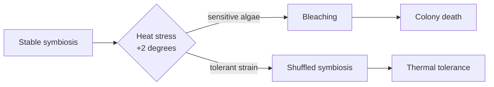

<!-- _class: title silent -->
<!-- tier: short -->

`BIOL 312 · Lecture 9 · Marine Adaptation`

# How corals survive a warming ocean

The cellular biology of thermal tolerance — and why some reefs are beating the heat.

---

<!-- _class: agenda -->
<!-- tier: short -->

## Where we are going in the next fifty minutes.

1. The puzzle — reefs that should be dead, but aren't
2. The mechanism — symbiosis under heat stress
3. The evidence — the Lizard Shoal transplant study
4. The frontier — what we still cannot explain

---

<!-- _class: content -->
<!-- tier: short -->

## A reef that bleached in 2016 came back greener than its neighbours.

Most of the central Coral Sea bleached when temperatures held 2 degrees above the summer mean for six weeks. Yet one shoal recovered in eighteen months while reefs forty kilometres away never did. That gap is today's question.

---

<!-- _class: content -->
<!-- tier: standard -->

## The textbook says corals cannot adapt this fast — the textbook is incomplete.

Reef-building corals are slow: a colony may take a decade to mature and centuries to build structure. Classical adaptation across that timescale cannot track a climate shifting in years. Something faster is doing the work.

- Generation time is far too long for selection alone to explain.
- The recovery happened within a single coral generation.

---

<!-- _class: content -->
<!-- tier: short -->

## The coral is not one organism — it is a partnership under negotiation.

Every coral hosts millions of single-celled algae, *Symbiodinium*, that photosynthesise inside its tissue and feed it. Heat ruptures that partnership: the algae turn toxic, the coral expels them, and the white skeleton shows through. That is bleaching.

---

<!-- _class: diagram -->
<!-- tier: short -->

## Heat tips a stable partnership into collapse — or into a swap.

---

<!-- _class: content -->
<!-- tier: standard -->

## The survivors did not evolve — they switched partners.

The recovered shoal hosted a different algal clade, *Durusdinium trenchii*, which tolerates heat the common *Cladocopium* strains cannot. The coral genome barely changed. The symbiont community did. Adaptation happened at the level of the partnership, not the host.

---

<!-- _class: stats -->
<!-- tier: standard -->

`Lizard Shoal transplant · 2016–2019`

## What the symbiont swap bought, measured against unswapped controls.

`Reciprocal transplant, n = 240 colonies, three reef sites, 36-month follow-up.`

1. +1.5°C
   - bleaching threshold raised
2. 84%
   - survival vs 31% control
3. 18 mo
   - to full recovery
4. −22%
   - growth rate trade-off

---

<!-- _class: content -->
<!-- tier: standard -->

## Tolerance is not free — the fast algae feed the coral less.

Colonies hosting the heat-tolerant clade grew 22% slower in normal years. The partnership that survives a heatwave is a worse provider the rest of the time. This is the central tension of thermal tolerance: resilience bought with growth.

---

<!-- _class: list-criteria -->
<!-- tier: short -->

## What a coral needs to survive the next marine heatwave.

1. A tolerant symbiont in reach
   - The heat-adapted algal clade must already be present in the local water column.
2. Flexible host physiology
   - The coral must be able to host more than one symbiont strain — not all species can.
3. A recovery window
   - Temperatures must fall back below threshold long enough to rebuild tissue.
4. Larval connectivity
   - Tolerant recruits must reach the reef to reseed what heat killed.

---

<!-- _class: content -->
<!-- tier: full -->

## Symbiont shuffling is real, but it is not a universal escape hatch.

Only about a quarter of reef-building genera can host multiple clades. For the rest, the partnership is fixed at settlement and cannot be renegotiated when the water warms. The flexible species may inherit the reef.

- Branching *Acropora* shuffle readily; massive *Porites* far less.
- A reef's future may hinge on which genera dominate it today.

---

<!-- _class: content -->
<!-- tier: full -->

## The frontier: can we seed tolerance before the heat arrives?

Assisted evolution trials are now inoculating coral larvae with heat-tolerant clades in the lab, then settling them on degraded reefs. Early results are promising and ethically fraught — we would be engineering the partnership that nature negotiates.

- First field outplants reached the central reef in 2025.
- Whether the tolerance persists across generations is unknown.

---

<!-- _class: closing -->
<!-- _paginate: false -->
<!-- _header: '' -->
<!-- _footer: '' -->
<!-- tier: short -->

## The coral that survives changes its partner, not its genes.

`Next lecture · larval dispersal and reef connectivity`
