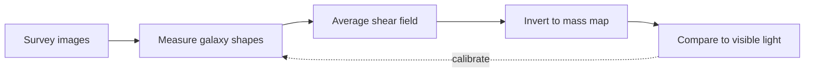

<!-- _class: title silent -->
<!-- tier: short -->

`Astrophysics Seminar · Department Colloquium`

# Weighing the invisible: dark matter from how galaxies bend light

A method seminar on reconstructing mass maps from gravitational lensing.

---

<!-- _class: agenda -->
<!-- tier: short -->

## What this seminar covers.

1. The problem — most of the universe is invisible
2. The tool — light bent by mass we cannot see
3. The pipeline — from distorted galaxies to a mass map
4. A result — the Ophion cluster reconstruction

---

<!-- _class: content -->
<!-- tier: short -->

## Five-sixths of the matter in the universe emits no light at all.

Galaxies rotate too fast to hold together on their visible mass alone. The missing mass — dark matter — outweighs everything we can see by roughly five to one. We cannot photograph it, so we map it by the one thing it still does: it bends light.

---

<!-- _class: content -->
<!-- tier: standard -->

## Mass curves spacetime, and curved spacetime bends the light passing through it.

A massive cluster between us and a distant galaxy acts as a lens. The background galaxy's image is stretched and sheared by an amount that depends only on the intervening mass. Measure the distortion and you have weighed the matter — visible or not.

- The distortion is called gravitational shear.
- Shear depends on total mass, dark matter included.

---

<!-- _class: content -->
<!-- tier: standard -->

## The signal is tiny — one galaxy tells you almost nothing.

A single background galaxy is shed by maybe one percent, lost in its own random shape. The trick is statistical: average the shapes of thousands of galaxies behind a cluster and the coherent lensing signal emerges from the noise of individual orientations.

- Per-galaxy shear is ~1%, buried in intrinsic shape scatter.
- Averaging thousands of sources recovers the coherent signal.

---

<!-- _class: diagram -->
<!-- tier: short -->

## How a mass map is reconstructed from distorted starlight.

---

<!-- _class: list-steps -->
<!-- tier: short -->

## The reconstruction pipeline, step by step.

1. Catalogue
   - Measure the shape of every background galaxy in the survey field, correcting for the telescope's own blur.
2. Bin
   - Average shapes across the sky to estimate the shear field, trading resolution for signal.
3. Invert
   - Solve the lensing equation to turn the shear field into a projected mass map.
4. Validate
   - Overlay the mass map on the visible light to check where dark and luminous matter agree and where they diverge.

---

<!-- _class: content -->
<!-- tier: standard -->

## The hardest step is the telescope, not the physics.

The atmosphere and the instrument blur every galaxy, mimicking the very shear we want to measure. Most of the pipeline's effort goes into modelling and removing that blur — the point-spread function — before any cosmology begins. Get it wrong and you map the telescope, not the universe.

- The point-spread function must be modelled per exposure.
- Residual blur is the dominant systematic error.

---

<!-- _class: content -->
<!-- tier: full -->

## A worked result: the Ophion cluster, weighed two ways.

Applying the pipeline to the Ophion cluster, we recover a total mass of 4.2 × 10¹⁴ solar masses — six times the mass of its visible stars and gas. The dark matter traces the galaxies but extends well beyond them, exactly as the cold-dark-matter model predicts.

- Lensing mass: 4.2 × 10¹⁴ solar masses.
- Dark-to-luminous ratio: roughly six to one.

---

<!-- _class: content -->
<!-- tier: full -->

## Where the dark and visible maps disagree is where the physics gets interesting.

In one sub-region of Ophion the mass peak sits offset from the gas — a signature of a recent cluster collision, where dark matter sailed through while the gas slowed. Offsets like these are among our cleanest evidence that dark matter is collisionless.

- A mass–gas offset marks a past collision.
- Collisionless behaviour constrains dark-matter physics.

---

<!-- _class: content -->
<!-- tier: full -->

## What the next survey generation changes.

Wide-field surveys now imaging billions of galaxies will shrink the shape noise by orders of magnitude, letting us map mass at the resolution of individual galaxy halos. The method does not change; the statistics finally become decisive.

- Billions of source galaxies replace thousands.
- Halo-scale mass mapping comes within reach.

---

<!-- _class: closing -->
<!-- _paginate: false -->
<!-- _header: '' -->
<!-- _footer: '' -->
<!-- tier: short -->

## We cannot see dark matter — but we can watch it bend the light around it.

`Speaker · Dr. Nadia Volkov · questions welcome`
