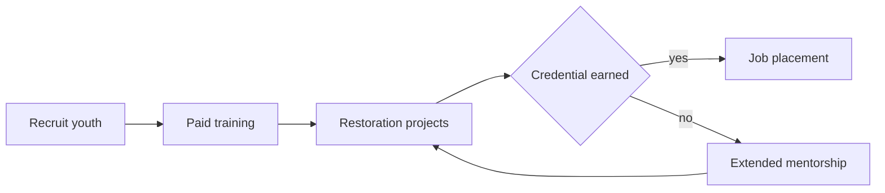

<!-- _class: title silent -->
<!-- tier: short -->

`Program overview · 2025`

# GreenRoots Youth Corps

A paid pathway from the Cedar River banks to a green-collar career, for youth the labor market left behind.

---

<!-- _class: content -->
<!-- tier: short -->

## We pay young people to restore the Cedar River — and train them into green jobs.

GreenRoots is a 16-week paid program for youth ages 16–24 in Cedar Rapids' East River neighborhoods. Crews restore habitat across the watershed while earning a wage, certifications, and a direct line to hiring partners.

- Participants earn $16/hour from their first day in the field.
- The work is real: erosion control, native planting, trail repair under contract.

---

<!-- _class: diagram -->
<!-- tier: short -->

## Our theory of change, from intake to a green career.

---

<!-- _class: list-steps -->
<!-- tier: short -->

## A participant's path through the program.

1. Recruit
   - Outreach through high schools and reentry partners brings youth into a paid four-week orientation.
2. Train
   - Twelve weeks of field training in habitat restoration, chainsaw and first-aid certs, and job-readiness coaching.
3. Work
   - Crews complete real restoration contracts across the Cedar River watershed, earning a wage and a portfolio.
4. Place
   - Case managers match graduates to employer partners or post-secondary programs and check in for a year.

---

<!-- _class: kpi -->
<!-- tier: short -->

`Outcomes · 2025`

## More youth enrolled, and more left with a job or a school seat.

1. 240
   - Youth enrolled
   - up from 180 `+33%` `2025`
2. 78%
   - Placed or in school
   - target 70% `On plan` `Verified`
3. 91%
   - Credential earned
   - of those who finished `On plan` `Audited`

---

<!-- _class: actors -->
<!-- tier: short -->

## Who we serve, and who delivers the program.

- Youth participants `Ages 16–24`
  - 240 young people from the East River neighborhoods, paid $16/hr while they train.
- Program staff `GreenRoots team`
  - Eight crew leaders and two case managers run daily restoration work and aftercare.
- Employer partners `14 partners`
  - Parks departments, utilities, and landscaping firms that hire our graduates directly.

---

<!-- _class: quote -->
<!-- tier: standard -->

> I'd been kicked out of two schools before this. Out here I learned I could lead a crew. Now I run a parks team and I'm back in night classes.

— Devon Reyes, 2025 graduate, GreenRoots Youth Corps

---

<!-- _class: big-number -->
<!-- tier: standard -->

`The earnings story behind a placement`

- $18,600
  - average annual earnings for a placed graduate one year out — first steady income for most.

---

<!-- _class: stats -->
<!-- tier: standard -->

`Impact · 2025`

## A single season of restoration, by the numbers.

1. 240
   - youth served
2. 78%
   - placed or in school
3. 38
   - watershed acres restored
4. 14
   - hiring partners

---

<!-- _class: content -->
<!-- tier: standard -->

## Recruitment reaches the young people other programs miss.

We draw enrollees from Cedar Rapids' three highest-unemployment neighborhoods. Two reentry organizations, the public library, and four high schools drive most qualified referrals into the program.

- 61% of the 240 enrollees came from those priority neighborhoods.
- 44% had a prior justice-system contact; 29% were not enrolled in school at intake.

---

<!-- _class: content -->
<!-- tier: standard -->

## The work itself is the curriculum.

Crews spend their days on contracted restoration — removing invasive honeysuckle, planting native buffers, and stabilizing eroded banks along the Cedar River. The wage and the certifications come from doing real work, not simulations.

- Field days are paired with two afternoons a week of certs and job-readiness coaching.
- Every graduate leaves with a portfolio of completed restoration sites.

---

<!-- _class: kpi -->
<!-- tier: full -->

`Equity · 2025`

## The program reaches and keeps the youth it sets out to serve.

1. 61%
   - From priority neighborhoods
   - of 240 enrolled `On plan` `Verified`
2. 44%
   - Prior justice contact
   - re-engaged through work `On plan` `Tracked`
3. 83%
   - Completion rate
   - finished all 16 weeks `On plan` `Audited`

---

<!-- _class: stats -->
<!-- tier: full -->

`Cost · 2025`

## Public dollars stretch further than a year of incarceration.

`All figures from audited spend over 240 enrollees and 187 placements.`

1. $6,200
   - cost per enrollee
2. $7,950
   - cost per placement
3. 84%
   - to direct services
4. 16%
   - to administration

---

<!-- _class: content -->
<!-- tier: full -->

## Two things ran harder than planned this year.

A spring flood closed three worksites for five weeks, compressing the field calendar. Our fall cohort enrolled 52 against a 70-seat plan after a bus-route cut stranded referrals.

- We recovered field hours by extending contracts into the dry early-winter weeks.
- A transit stipend restored the next cohort to full size.

---

<!-- _class: roadmap -->
<!-- tier: full -->

`The plan · 2026–2028`

## Where the next three seasons take the Corps.

| Workstream | Now `2025` | Build `2026` | Scale `2027` |
| --- | --- | --- | --- |
| Youth served | [x] 240 | [-] 320 | [ ] 450 |
| Hiring partners | [x] 14 | [-] 22 | [ ] 30 |
| Watersheds | [x] Cedar | [-] +Iowa River | [ ] +Wapsipinicon |
| Certifications | [x] 3 | [-] +Arborist | [ ] +Water quality |

---

<!-- _class: content -->
<!-- tier: full -->

## We are ready to grow — and we are asking partners to grow with us.

The model holds: 240 youth served, 78% placed or in school, 84 cents of every dollar reaching participants. We are inviting funders and employers to help extend the Corps to a second watershed in 2026.

- A second site would add 80 paid seats and eight new hiring partners.
- Every expansion dollar is matched by contracted restoration revenue.

---

<!-- _class: closing -->
<!-- _paginate: false -->
<!-- _header: '' -->
<!-- _footer: '' -->
<!-- tier: short -->

## Pay a young person to heal a river, and you get back both a watershed and a worker.

`Tessa Moreno · Program Director · programs@greenrootscorps.example`
