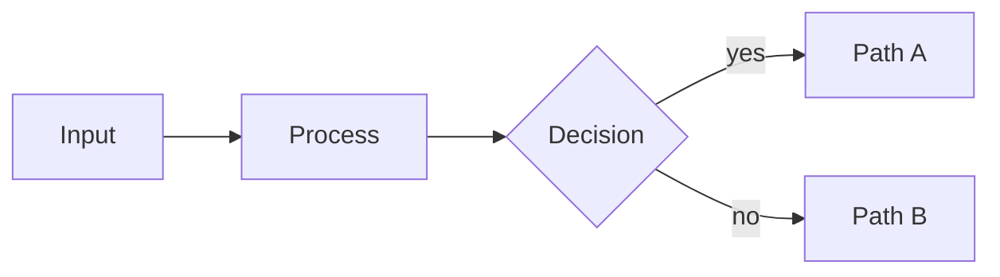

# diagram

> Mermaid diagram as the slide's centerpiece.

**Function** evidence · **Form** canvas · **Substance** graph

## When to use

Relational or topological visuals: flowcharts, sequence diagrams,
state machines, ER diagrams, mindmaps, gantt charts (Mermaid's),
journey maps. The diagram should occupy at least 50% of the slide
— if the heading and supporting prose dominate, it's a `content`
slide that happens to have a diagram, not a `diagram` slide.

For tabular data (axes + datapoints), prefer the `series`-substance
components: `quadrant`, `radar`, `progress`, `piechart`, `gantt`,
`timeline-list`.

## Authoring

````markdown
<!-- _class: diagram -->

## How signals move from input to decision.


````

The Mermaid block is pre-rendered to SVG at build time. Palette tokens
are injected via `%%{init}%%` so the diagram inherits the active
theme's colors without hand-editing.

## Slots

| Slot | Selector | Required | Notes |
|---|---|---|---|
| title | `h2` | yes | slide heading framing the diagram |
| subtitle | `p > code` | no | optional eyebrow caption |
| mermaid | `div.mermaid`, `svg` | yes | the fenced mermaid block |

## Variants

Layout-specific: *(none)*. Inherits universals + semi-universals.

## Engine notes

The diagram substance plugs into the **graph** plugin contract per
`docs/design-system.md` §5. To add a new graph language (D2, PlantUML)
follow the same recipe: detect the fence in all three render paths,
inject palette tokens, invoke the external CLI, inline the SVG.
