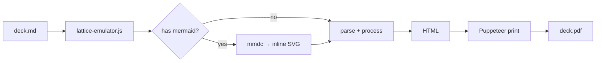

<!-- _class: title silent -->

# diagram

`Evidence · Canvas · Graph`

Mermaid diagram as the slide's centerpiece.

---

<!-- _class: diagram -->
<!-- _footer: "Default · diagram" -->

## How a Lattice slide goes from markdown to PDF.

---

<!-- _class: cards-grid -->
<!-- _footer: "Anti-patterns · diagram" -->

## When NOT to reach for diagram.

- **Tabular data on axes.** Quantitative datapoints across two axes are not flowchart material. Use quadrant, radar, progress, piechart, or timeline-list — the series-substance components are designed for plotted data.
- **Twenty-node spaghetti.** Past a dozen nodes the diagram stops being scannable. Split into two slides, hide leaf nodes behind a summary node, or move to a multi-page diagram-doc reference.
- **Inline color overrides.** Hand-set node colors break the theme contract. Let palette tokens drive everything; if you need to highlight one node, use mermaid's `class` mechanism so the highlight survives theme remapping.

---

<!-- _class: closing silent -->

# See also.

`Related components`

- `code` — the implementation, not the topology, is the argument
- `quadrant` — items positioned by two numeric attributes
- `radar` — options rated across several criteria
- `timeline-list` — the graph is a sequence in time, not a topology
- `content` — the diagram is one element in a prose slide
