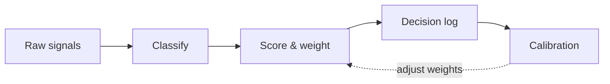

<!-- _class: title silent -->

# diagram

`1 component`

Diagram — graph-substance network visuals (external renderer).

---

<!-- _class: diagram -->

## How a signal moves from input to decision.

