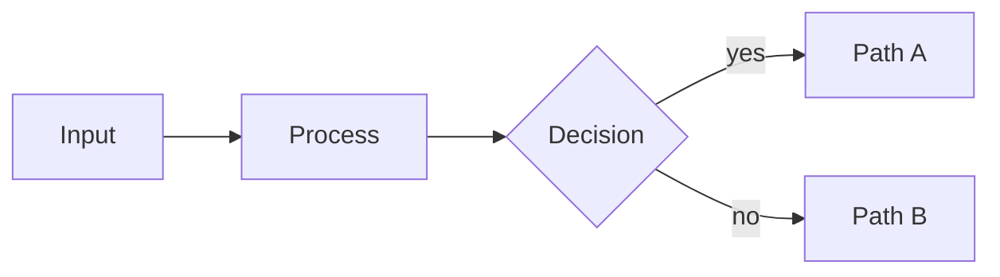

# diagram

> Mermaid diagram as the slide's centerpiece.

**Function** evidence · **Form** canvas · **Substance** graph

Use for relational or topological visuals — flowcharts, sequence diagrams, state machines, ER diagrams. The diagram should occupy at least half the slide.

## When to use

- **Relational structure is the message.** Flowcharts, sequence diagrams, state machines, ER diagrams, journey maps. The relationships between nodes carry meaning the audience needs to see at a glance.
- **Diagram occupies at least half the canvas.** If the heading and prose dominate and the diagram is a sidebar, it is a content slide that happens to have a diagram. Reach for diagram when the graph IS the slide.
- **Palette tokens render automatically.** Mermaid blocks are pre-rendered to SVG with palette tokens injected via `%%{init}%%`. Don't hand-set colors — the diagram inherits the active theme so dark / accent variants work without re-authoring.

## When NOT to use

- **Tabular data on axes.** Quantitative datapoints across two axes are not flowchart material. Use quadrant, radar, progress, piechart, or timeline-list — the series-substance components are designed for plotted data.
- **Twenty-node spaghetti.** Past a dozen nodes the diagram stops being scannable. Split into two slides, hide leaf nodes behind a summary node, or move to a multi-page diagram-doc reference.
- **Inline color overrides.** Hand-set node colors break the theme contract. Let palette tokens drive everything; if you need to highlight one node, use mermaid's `class` mechanism so the highlight survives theme remapping.

## Authoring

```markdown
<!-- _class: diagram -->

## How signals move from input to decision.


```

## Slots

| Slot | Selector | Required | Description |
|---|---|---|---|
| `title` | `h2` | yes | Slide heading framing what the diagram shows. |
| `subtitle` | `p > code` | no | Optional eyebrow caption. |
| `mermaid` | `div.mermaid, svg` | yes | Fenced ```mermaid block, pre-rendered to SVG at build time. |

## Anatomy

```text
┌─────────────────────────────────────────┐
│  header                                 │
│  Diagram heading.                       │
│                                         │
│       ┌────┐    ┌────┐    ┌────┐        │
│       │ A  │ →  │ B  │ →  │ C  │        │
│       └────┘    └────┘    └────┘        │
│                                         │
│        (Mermaid rendered as SVG)        │
│  footer                           1/19  │
└─────────────────────────────────────────┘
```

## Universal modifiers

This layout accepts all universal variants (`dark`, `compact`, `loose`, `accent`, state markers, treatments). See [reference/design-system.md §6.5](../../reference/design-system.md#65-universal-variants--three-tiers) for the catalog.

## Related components

- [`code`](../code/code.docs.md) — the implementation, not the topology, is the argument
- [`quadrant`](../quadrant/quadrant.docs.md) — items positioned by two numeric attributes
- [`radar`](../radar/radar.docs.md) — options rated across several criteria
- [`timeline-list`](../timeline-list/timeline-list.docs.md) — the graph is a sequence in time, not a topology
- [`content`](../content/content.docs.md) — the diagram is one element in a prose slide

## Demo deck

See [diagram.gallery.pdf](./diagram.gallery.pdf) for rendered examples of every variant.
