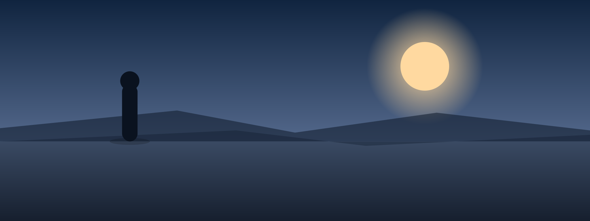

# image

> Image as the slide's anchor, with optional text alongside — composition adapts to the asset and the deck.

**Function** imagery · **Form** canvas · **Substance** prose

**Tags** `visual` · `showcase` · `pitch`

Use when a visual carries meaning on its own. You hand it any rectangle; the layout reads the asset's aspect at build time and, with the deck orientation, RESOLVES the composition for you — no modifier needed. The default is `clean` (a floated card shaped to the photo, ≈ zero crop); extreme aspects auto-pick `split` (shown whole) or `spotlight` (full-bleed cover). Name a composition to override: `clean` · `split` · `spotlight` · `gallery` (contain-on-matte, for diagrams) · `statement` (full-bleed + scrim + title). `mirror` flips the image side. Legacy `full`/`contain`/`museum` still work (→ spotlight/gallery/gallery).

## When to use

- **The visual carries meaning.** Product screenshots, architectural photographs, plots, satellite imagery — anywhere the image makes the argument and the prose is annotation. If the visual is decorative, drop it and use `content` instead.
- **Let the layout resolve it — override only with intent.** Drop in any aspect and the layout reads it: a moderate photo gets the `clean` floated card, a tall/wide one gets `split` (shown whole), a canvas-matching one gets `spotlight` (full-bleed). Override only when you mean it: `image gallery` to contain a diagram zero-crop, `image statement` for a scrim-and-title hero, `image spotlight` to force a full-bleed cover (accepting the crop).
- **Caption earns its line.** If the prose alongside the image just describes what the image shows, drop it — the audience can see the picture. The text slot is for the so-what: what the audience should take away from the visual.

## When NOT to use

- **Decorative stock photo.** A generic photograph of 'people in a meeting' next to a content slide is filler. Use `content` and trust the prose; reserve image for visuals that argue for themselves.
- **Image too small to read.** A diagram or screenshot small enough to fit inside a half-canvas text slot is unreadable from the back of the room. Reach for `image gallery` (contains it whole) or `image spotlight`, or move the diagram to its own `diagram` slide.
- **Image with five paragraphs of caption.** If the prose dominates and the image is a sidebar, you have a `content` slide that happens to have a photo. Either trust the image (drop the prose) or trust the prose (drop the image).

## Authoring

```markdown
<!-- _class: image -->

## Text leads; the image earns its place.

Swap the bg image below for your own asset — any aspect. The layout reads its shape and resolves the composition for you (a floated card, a full-height column, a full-bleed cover). Name a composition (`image spotlight`, `image gallery`, …) only to override.


```

## Slots

| Slot | Selector | Required | Description |
|---|---|---|---|
| `image` | `.lattice-bg` | yes | Marp background image syntax: `` or `` — rendered as a CSS background-image on the `.lattice-bg` panel (no ``). |
| `heading` | `h2` | no | Optional heading in the text slot. |
| `body` | `p` | no | Optional caption or body text. |

## Anatomy

```text
┌─────────────────────────────────────────┐
│  header                                 │
│                                         │
│  Text slot on     ┌──────────────────┐  │
│  the left, with   │                  │  │
│  optional         │   [image area]   │  │
│  caption.         │                  │  │
│                   └──────────────────┘  │
│                                         │
│  footer                           1/19  │
└─────────────────────────────────────────┘
```

## Variants (layout-specific)

### `clean` — Clean — the default floated card (auto)

The standing default for a moderate-aspect photo. A floated card whose ASPECT adapts to the asset (a square photo → square card, a wide photo → wide card), beside a text panel (landscape) or stacked above it (portrait). Cover-fill of a card shaped like the photo means ≈ zero crop. Auto-resolves for `square` and `wide` assets; name it to force a card on any asset.

```markdown
<!-- _class: image clean -->

## Activation is where the trial is won or lost.

Two-thirds of trials that reach the first generated report convert; the ones that stall almost never do.


```

### `split` — Split — an extreme-aspect photo, shown whole (auto)

For a `tall`/`column` asset on a landscape deck (a full-height image column + text) or a `wide`/`pano` asset on a portrait deck (a full-width image band + text below). Shows the whole photo with ≈ zero crop and fills the canvas a moderate card would leave empty.

```markdown
<!-- _class: image split -->

## Built for the long climb.

A portrait photo wants its full height. We give it a column and let the argument run alongside.


```

### `spotlight` — Spotlight — full-bleed cover + a solid card (auto)

For an asset whose aspect already MATCHES the canvas (a `pano` on landscape, a `tall` on portrait): the photo goes full-bleed and the text rides a SOLID card, so legibility never depends on the photo. Name it to force a full-bleed cover on any asset (accepting the crop).

```markdown
<!-- _class: image spotlight -->

## A panorama earns the full frame.

When the photo already matches the canvas, let it carry the slide — the message rides in a solid card so it never fights the image.


```

### `gallery` — Gallery — contain on a matte + placard (opt-in)

Opt-in. Contains the WHOLE asset on a matte with a centered placard caption — zero crop, letterboxed. For diagrams, screenshots, and plots where the whitespace is meaningful and every pixel matters. Never auto-resolved (we can't detect a diagram from aspect alone), so name it.

```markdown
<!-- _class: image gallery -->

## Exhibit 1 — the network, contained.

The whole asset on a matte with a placard. For diagrams and screenshots where the whitespace is the point.


```

### `statement` — Statement — full-bleed + scrim + editorial title (opt-in)

Opt-in. The title rides the photo on a diagonal scrim — a deliberate, editorial moment for an opener or closer. White text over an unknown photo is a legibility gamble, so it is never auto-resolved; reach for it when you know the photo carries it.

```markdown
<!-- _class: image statement -->

## The setup step is the real funnel.

The title rides the photo on a scrim — a deliberate, editorial choice.


```

### `mirror` — Mirror — flip the image to the other side

Flips the image/text side for the `clean` and `split` compositions (image left, text right). Equivalent to `![bg left]`. Use when the surrounding spread reads right-to-left or when the page-turn cue lands on the image side.

```markdown
<!-- _class: image mirror -->

## Mirror lands the image on the left.

Text leads from the right; image anchors from the left.


```

## Universal modifiers

This layout accepts all universal variants (`dark`, `compact`, `loose`, `accent`, state markers, treatments). See [design/design-system.md §6.5](../../../../design/design-system.md#65-universal-variants--three-tiers) for the catalog.

## Related components

- [`diagram`](../../diagram/diagram/diagram.docs.md) — the visual is a Mermaid graph, not a photo or screenshot
- [`content`](../../statement/content/content.docs.md) — the slide is mostly prose with one inline visual
- [`title`](../../anchor/title/title.docs.md) — the image is a bookend hero, not the body of a slide
- [`quote`](../../statement/quote/quote.docs.md) — the slide is a quotation, not an image

## Demo deck

See [image.gallery.light.pdf](./image.gallery.light.pdf) for rendered examples of every variant.
