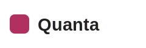
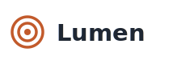

# logo-wall

> A grid of customer, partner, or funder logos as social proof.

**Function** inventory · **Form** grid · **Substance** prose

**Tags** `visual` · `showcase` · `pitch`

Use for the credibility slide — the 'trusted by' / 'our funders' / 'participating agencies' wall. Marks render desaturated and uniform so mismatched brand colours don't fight each other; the `color` variant keeps them branded when the hues carry meaning.

## When to use

- **The proof is the logos.** Customers, partners, funders, accreditations, participating agencies — anywhere a set of recognisable marks carries more weight than a sentence. The audience scans the wall and concludes 'serious company keeps this company.'
- **Marks read as one texture.** The default desaturates every mark to the same restrained grey so a loud red logo doesn't outshout a quiet one. The wall reads as a single credential, not a ransom note of competing brand colours.
- **Eight to eighteen marks.** Enough to signal breadth, few enough that each is legible. Fewer than six looks thin; past eighteen the marks shrink below recognition — curate to the most recognisable names or split across two slides.

## When NOT to use

- **Names that need a sentence.** If each entity needs a role, a quote, or a metric beside it, this is the wrong layout. Use `actors` (who owns what), `cards-grid` (a short body per item), or `quote` (a single testimonial).
- **Logos nobody recognises.** A wall of unknown marks proves nothing and asks the audience to squint. If the names don't carry on sight, state the count as a `big-number` ('400+ teams') instead.
- **Mismatched raster art.** Low-resolution PNG logos pulled from web pages look ragged at projector scale and break the uniform grey treatment. Source vector (SVG) marks; the desaturation assumes clean edges.

## Authoring

```markdown
<!-- _class: logo-wall -->

`Trusted by`

## The headline claim the logos back up.

- 
- 
- 
- 
- 
- 
```

## Slots

| Slot | Selector | Required | Description |
|---|---|---|---|
| `eyebrow` | `p > code:only-child` | no | Optional kicker above the headline — wrap a short label in backticks, e.g. `Trusted by`. |
| `title` | `h2` | no | Optional headline above the wall. A claim earns its place (‘400+ teams run board prep on Lattice’); a bare label (‘Customers’) does not. |
| `logos` | `ul > li` | yes | One list item per mark, authored as `- `. The alt text is the accessible label, not a rendered caption. SVG is preferred so marks stay crisp at projector scale. |

## Anatomy

```text
┌─────────────────────────────────────────┐
│  header                                 │
│               TRUSTED BY                │
│        The teams that run on us.        │
│                                         │
│       [Acme]  [Globex]  [Initech]       │
│       [Umbra] [Vantage] [Helios]        │
│                                         │
│  footer                           1/19  │
└─────────────────────────────────────────┘
```

## Variants (component-specific)

### `color` — Color — keep brand colours

Drops the desaturation so each mark renders in its own brand colour. Reserve for cases where the hues carry meaning — government insignia, university crests, certification badges — or where brand guidelines forbid recolouring. The grey default is the boardroom-restrained pick.

```markdown
<!-- _class: logo-wall color -->

`Our partners`

## The brands behind the programme.

- 
- 
- 
- 
- 
- 
- 
- 
```

### `dense` — Dense — more marks, smaller cells

Tightens to six columns with shorter cells for a longer roster — a member directory, a full funder list, every participating agency. Past about eighteen marks the recognition threshold gives out; split across two slides instead.

```markdown
<!-- _class: logo-wall dense -->

`Our funders`

## Eighteen organisations backed this year's work.

- 
- 
- 
- 
- 
- 
- 
- 
- 
- 
- 
- 
```

## Universal modifiers

This component accepts all universal variants (`dark`, `compact`, `loose`, `accent`, state markers, treatments). See [design/design-system.md §6.5](../../../../design/design-system.md#65-universal-variants--three-tiers) for the catalog.

## Related components

- [`actors`](../../inventory/actors/actors.docs.md) — each named entity owns a responsibility, not just lends its logo
- [`cards-grid`](../../inventory/cards-grid/cards-grid.docs.md) — each item needs a line of body text, not just a mark
- [`big-number`](../../statement/big-number/big-number.docs.md) — the proof is a count ('400+ teams'), not the individual marks
- [`quote`](../../statement/quote/quote.docs.md) — one customer's testimonial carries the slide
- [`image`](../../imagery/image/image.docs.md) — a single visual, not a grid of marks, is the evidence

## Demo deck

See [logo-wall.gallery.light.pdf](./logo-wall.gallery.light.pdf) for rendered examples of every variant.
