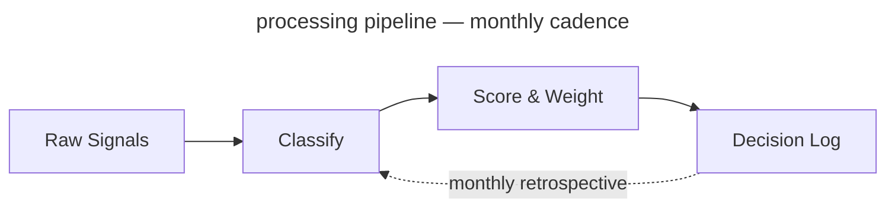

<!-- _class: title -->
<!-- _header: '' -->
<!-- _paginate: false -->
<!-- _footer: "Title slide · title" -->

# From Signal to Strategy

`Product Strategy · Q3 2026`

A decision framework for product leaders navigating market uncertainty, quarterly

---

<!-- _class: divider -->
<!-- _header: '' -->
<!-- _paginate: false -->
<!-- _footer: "Section break · divider" -->

`Section 01 · Foundations`

## The landscape has shifted. Here is what that means for us.

---

<!-- _class: divider light -->
<!-- _header: '' -->
<!-- _footer: "Centered orientation · divider light" -->

`Module 02`

## Before we score signals, we need to agree on what a signal is.

The word is overloaded. We use it to mean anything from a customer complaint to a macro trend. This framework requires a tighter definition.

---

<!-- _class: content -->
<!-- _footer: "Single-idea prose · content" -->

`Context · Competitive Dynamics`

## The window for differentiation is narrowing.

Three converging forces — commoditized infrastructure, compressed release cycles, and rising customer switching costs — have reduced the average durable advantage window from 36 months to under 14. Teams that cannot split signal from noise inside that window miss the timing — reliably, and then schedule a retrospective about it.

---

<!-- _class: diagram -->
<!-- _footer: "Component diagram · diagram" -->

`Architecture · Signal Pipeline`

## Signals move through four stages; opinions skip to the end.

`Four-stage processing pipeline — monthly cadence`



---

<!-- _class: stats -->
<!-- _footer: "KPI numbers · stats" -->

`Impact · Pilot Results`

## Six months of results across four product teams.

`Measured against pre-framework baseline, same teams, same market conditions. Alignment self-reported.`

1. 73%
   - faster close
2. 4.2×
   - signal recall
3. 18
   - decisions logged
4. 91%
   - team alignment

---

<!-- _class: cards-grid -->
<!-- _footer: "2×2 card grid · cards-grid" -->

## The framework has four components.

- Signal Intake
  - Weekly structured collection across customer conversations, market data, and competitive moves. Normalized into a common schema before scoring.
- Scoring Model
  - Each signal scored on three dimensions: confidence, recency, and strategic relevance. Weights are team-configurable — configured once, then defended forever.
- Decision Log
  - Every decision recorded with the signals that informed it, the options considered, and the criteria applied. Feeds the calibration loop.
- Calibration Loop
  - Monthly retrospective that compares predicted outcomes to actual outcomes and adjusts scoring weights accordingly.

---

<!-- _class: cards-grid -->
<!-- _footer: "Inline code in cards · cards-grid" -->

## The pipeline, by version number.

- Signal Intake `v2.4`
  - Handles 94% of structured signals without manual intervention. Average latency: `4 min` from ingestion to scored entry.
- Scoring Model `configurable`
  - Three dimensions: confidence, recency, relevance. Default weights are `33 / 33 / 33` — the diplomatic opening position.
- Decision Log `required`
  - Every prioritization change above `P2` must carry a logged rationale. No log, no change.
- Calibration Loop `monthly`
  - Compares predicted outcomes to actuals. First meaningful weight update happens after `2 cycles`.

---

<!-- _class: cards-grid -->
<!-- _footer: "2 top + 1 bottom · cards-grid" -->

## Signal Intake produces three outputs.

1. Weekly Signal Brief
   - The week's top ten signals, ranked and attributed. Lands Monday morning.
2. Anomaly Alerts
   - Real-time flags past the 2σ threshold, routed to the accountable PM. Four-hour response SLA, observed in spirit.
3. Monthly Signal Index
   - The calibration loop's source of truth. Required reading before each retrospective; skimming is detectable.

---

<!-- _class: cards-stack -->
<!-- _footer: "Vertical card stack · cards-stack" -->

## Two failure modes the framework is designed to prevent.

- False signal amplification
  - One loud voice dominating the decision. The model caps any source at 30% — a ceiling one enterprise customer tests monthly.
- Signal hoarding
  - Signals collected, decisions unlogged — the loop learns nothing. Above P2, the log is required. No log, no change.

---

<!-- _class: cards-grid -->
<!-- _footer: "Side-by-side cards · cards-grid" -->

## Two intake modes for different signal types.

- Structured Intake
  - Clear-schema signals — NPS verbatims, tickets, win/loss notes — ingested by connector, scored on arrival.
- Unstructured Intake
  - Schema-less signals — field notes, briefings, demos — need human classification. A 48-hour window; the productive hour is the forty-eighth.

---

<!-- _class: compare-prose -->
<!-- _footer: "Two options + connector · compare-prose" -->

## Scoring model: before and after the calibration loop.

- Before Calibration
  - Equal weights, 33% each. Simple, consistent, and blind to what the market rewards — which nobody minded until the market did.
- After Calibration
  - Weights track your historical accuracy; weak predictors get downweighted. The model becomes a record of what you have learned.

The shift from equal weights to calibrated weights takes two retrospective cycles — roughly 60 days from adoption, both of which must occur.

---

<!-- _class: quote -->
<!-- _footer: "Pull quote · quote" -->

> The signal was always there. We just didn't have a system that forced us to look at it before we'd already decided.

— Head of Product, Pilot Team 3

---

<!-- _class: list-steps timeline -->
<!-- _footer: "Horizontal timeline · timeline" -->

## How a decision moves through the framework.

1. Signal Logged
   - _Owner classifies and submits to intake queue_
2. Scored
   - _Model applies current weights, generates score_
3. Brief Published
   - _Signal appears in weekly brief with rank_
4. Decision Logged
   - _PM records rationale, signals, predicted outcome_
5. Retrospective
   - _Outcome scored, weights updated, precedent quietly set_

---

<!-- _class: list -->
<!-- _footer: "Card list stack · list" -->

## What the framework does not do.

- It does not make decisions — it structures the information that humans use to decide.
- It does not replace customer discovery — it scores and routes what discovery surfaces.
- It does not work without the Decision Log — calibration requires outcome data to learn from.
- It does not guarantee alignment — it surfaces disagreement earlier, when it is cheaper and louder.
- It does not scale down to individual feature decisions — it is designed for prioritization above P2.

---

<!-- _class: list -->
<!-- _footer: "Numbered list · list" -->

## Four things that must be true before you begin.

1. You have a regular prioritization cadence — at minimum monthly.
2. At least one person owns signal collection full-time or as a primary responsibility.
3. Leadership has agreed to log decisions with rationale, not just outcomes.
4. You have 90 minutes per week for intake and scoring — one standing meeting you already wanted to delete.

---

<!-- _class: big-number -->
<!-- _footer: "Hero stat · big-number" -->

`Calibration Result · 6-Month Pilot`

- 14x
  - Return on signal investment — measured as decisions that reached the right outcome on the first attempt, versus the baseline rate before the framework was adopted. The number survived two rounds of being asked to.

---

<!-- _class: split-panel watermark -->
<!-- _footer: "Dark panel + content · split-panel watermark" -->

## Scoring Model Deep Dive

`Section 02`

### What this section covers

The scoring model is the most configurable component, and therefore the most argued about. This section covers the three dimensions, how weights are set initially, and how calibration updates them over time.

1. Confidence
   - How many independent sources corroborate the signal. Ranges 1–5.
1. Recency
   - Time-decay applied from signal date to scoring date. Half-life is team-configurable.
1. Strategic Relevance
   - Manual score from the signal owner. Ranges 1–5. Requires justification above 4.

---

<!-- _class: closing -->
<!-- _header: '' -->
<!-- _footer: "Dark closing bookend · closing" -->
<!-- _paginate: false -->

`What Would Help Us Move Forward`

## Next step is a working session, not a debate.

`Walk these questions with me in 60–90 minutes. The output is either a design we can execute, or a shared list of what needs more work before we commit. Both count as progress; only one becomes another deck.`

---

<!-- _class: cards-grid -->
<!-- _footer: "Finding + key insight · cards-grid" -->

`Finding 01 · Structured Intake`

## Structured intake performed above expectations — volume and latency were not concerns.

- What worked
  - Connectors handled 94% of structured signals untouched; scoring latency averaged four minutes.
- What required tuning
  - Verbatim classification opened at an 18% error rate; one training pass reached the 92% target.

> Viable as designed — the classifier needs a 2-week warm-up on new deployments, booked under "known issue."

---

<!-- _class: cards-grid -->
<!-- _footer: "Key insight + below-note · cards-grid" -->

## Four parts, one insight — the loop is the product.

- Signal Intake
  - Weekly structured collection across customer conversations, market data, and competitive moves.
- Scoring Model
  - Each signal scored on three dimensions: confidence, recency, and strategic relevance.
- Decision Log
  - Every decision recorded with the signals that informed it and the criteria applied.
- Calibration Loop
  - Monthly retrospective that compares predicted outcomes to actual outcomes.

> The calibration loop is what separates teams that learn from teams that repeat the same mistakes.

The insight survived three reviews unedited — a first for this deck.

---

<!-- _class: cards-grid -->
<!-- _footer: "Key insight + annotation · cards-grid" -->

## The same four parts, now with the source on the record.

- Signal Intake
  - Weekly structured collection across customer conversations, market data, and competitive moves.
- Scoring Model
  - Each signal scored on three dimensions: confidence, recency, and strategic relevance.
- Decision Log
  - Every decision recorded with the signals that informed it and the criteria applied.
- Calibration Loop
  - Monthly retrospective that compares predicted outcomes to actual outcomes.

> The calibration loop is what separates teams that learn from teams that repeat the same mistakes.

_Source: pilot retrospective — six months, four teams, one deck, this one._

---

<!-- _class: cards-stack -->
<!-- _footer: "3 full-width cards · cards-stack" -->

## Three scoring failure modes found in the pilot.

1. Recency dominance
   - Fresh noise crowding out durable signal. Corrected by capping recency at 40% for two cycles.
2. Source concentration
   - One customer was 34% of month-one intake. Corrected with a source-diversity floor.
3. Outcome misclassification
   - Outcomes too vague to score. "Improve retention" is not scoreable. "Churn below 7%" is.

---

<!-- _class: list-criteria -->
<!-- _footer: "Numbered criteria · list-criteria" -->

## Four requirements every decision system must meet.

- **Speed**
  - Decisions close inside their window. Latency consumes the value the system protects.
- **Auditability**
  - Every decision above the threshold carries a traceable rationale.
- **Adoption**
  - Unused weekly, calibration never runs. Ninety minutes per PM is the ceiling.
- **Calibration**
  - It must improve over time. A static scoring model is a spreadsheet with extra steps.

---

<!-- _class: verdict-grid -->
<!-- _footer: "2×2 verdict grid · verdict-grid" -->

## We evaluated four paths against the criteria.

- Path A · The spreadsheet
  - [x] Speed
  - [ ] Auditability
  - [x] Adoption
  - [ ] Calibration
  - Open everywhere, version unknown. No trace — in fairness, the appeal.
- Path B · Vendor North
  - [x] Speed
  - [x] Auditability
  - [ ] Adoption
  - [ ] Calibration
  - Clean intake, real audit trail. The weights stay on their side of the contract.
- Path C · Vendor West
  - [x] Speed
  - [x] Auditability
  - [x] Adoption
  - [ ] Calibration
  - The better demo, by some distance. The weights are theirs; so is §9.2.
- Path D · Build in-house
  - [x] Speed
  - [x] Auditability
  - [x] Adoption
  - [x] Calibration
  - All four criteria, inside the budget, weights ours. Recommended.

---

<!-- _class: compare-table -->
<!-- _footer: "Comparison table · compare-table" -->

## The four paths side by side.

| Criterion    | Spreadsheet  | Vendor North | Vendor West | In-house build |
| ------------ | ------------ | ------------ | ----------- | -------------- |
| Speed        | ✓            | ✓            | ✓           | ✓              |
| Auditability | ✗            | ✓            | ✓           | ✓              |
| Adoption     | ✓            | ✗            | ✓           | ✓              |
| Calibration  | ✗            | ✗            | ✗           | ✓              |
| Setup time   | Already open | 3–4 weeks    | 6 weeks     | Same quarter   |

_Evaluated against the same four pilot teams and the same 90-minute weekly budget constraint._

---

<!-- _class: glossary -->
<!-- _footer: "Glossary · glossary (auto-table, auto-pill)" -->

## Glossary

- Adoption
  - Percentage of eligible PMs filing a Decision Log entry within 24 hours of a decision close.
- Auditability
  - The property that any decision can be reconstructed from its inputs three months later without the original author present.
- Calibration
  - The retrospective comparison of predicted to observed outcomes, used to score the framework's accuracy.
- Connector
  - The integration layer between signal intake and a source system. Owns ingestion and tagging.
- Decision Log
  - The append-only record of every prioritization decision, its predicted outcome, and the actual outcome at retrospective time.
- Eligible PM
  - A PM whose team has adopted the framework and is past the 30-day onboarding period.
- Framework
  - The four-part system — Signal Intake, Scoring Model, Decision Log, Calibration Loop — judged on four criteria: speed, auditability, adoption, calibration.

---

<!-- _class: glossary -->
<!-- _footer: "Glossary continued · glossary (auto-table, auto-pill)" -->

## Glossary

- Predicted outcome
  - The author's stated expectation, recorded at decision time, used as the input to calibration.
- Prioritization rhythm
  - The team's regular cadence (weekly, biweekly) for revisiting and re-ordering work.
- Retrospective
  - The 30-day review meeting where logged decisions are scored against observed outcomes.
- Signal
  - Any qualitative or quantitative input to a decision — survey response, NPS comment, support ticket, sales call note.
- Scoring policy
  - The weight set the calibration loop refits each cycle — the artifact neither vendor would expose.
- Vendor West
  - The stronger of the two vendors evaluated; the demo everyone remembers, and the author of §9.2.

---

<!-- _class: compare-prose -->
<!-- _footer: "Two options + connector · compare-prose" -->

## Two intake modes ran head to head for a quarter.

- Weekly Digest
  - Signals batch into a Monday summary. Coverage is high; attention is not. The digest is where signals go to be acknowledged.
- Live Feed
  - Signals land in the channel as they are scored. Attention is immediate, and so is the muting, usually by Thursday.

The pilot kept both — the feed for the two teams that mute nothing, the digest for everyone honest about themselves.

---

<!-- _class: list-steps -->
<!-- _footer: "Horizontal steps · list-steps" -->

## How to roll this out across your organization.

1. Pick one team and one decision type
   - A team with an existing rhythm, one decision category, thirty days.
2. Log everything, decide nothing differently
   - Month one changes nothing but the record. Decide as you always did; write it down.
3. Run your first retrospective
   - Day 30: score decisions against outcomes. The model's first calibration pass.
4. Expand to a second team
   - One retrospective in hand, onboard team two with data, not promises.

---

<!-- _class: list-tabular -->
<!-- _footer: "Tabular list · list-tabular" -->

## The six signal dimensions, what they measure, and how they are scored.

1. Confidence
   - Number of independent sources corroborating the signal
   - _1–5 · Auto-scored_
2. Recency
   - Time-decay from signal date, configurable half-life
   - _0.0–1.0 · Auto-scored_
3. Relevance
   - Alignment to current strategic bets, owner-scored, ceiling frequently tested
   - _1–5 · Manual_
4. Reach
   - Number of customers or segments affected
   - _1–5 · Auto-scored_
5. Effort
   - Engineering and design cost to act on the signal
   - _1–5 · Manual_
6. Confidence delta
   - Change in confidence score since last scoring cycle
   - _−5 to +5 · Auto_

---

<!-- _class: content -->
<!-- _footer: "Header and footer demo · content" -->
<!-- _header: "Lattice · Layout Gallery" -->
<!-- _footer: "Header stays uppercase · footer renders as written" -->

`Header And Footer`

## The chrome carries the labels, so the slides can carry the story.

Deck-wide `header:` and `footer:` put every slide's metadata in the margins — the layout name lives in the footer, and the header is capitalized regardless of how strongly you feel about it. The body stays free for content, a principle this deck enforces.

---

<!-- _class: code -->
<!-- _footer: "Single code block · code" -->

`Implementation · Decision Pipeline`

## Wiring a signal into the framework is three lines of code; the onboarding is three months.

`JavaScript · DecisionFramework SDK v2 interface`

```javascript
import { DecisionFramework } from "@company/signal-sdk";

const framework = new DecisionFramework({ configFile: "./framework.config.json" });

// Score a signal at intake
const score = await framework.score(signal, { dimensions: ["confidence", "recency", "relevance"] });

// Log every decision — calibration depends on it (nobody calls this in prod)
const entry = await framework.decisions.log(decision, { signals: [signal.id], rationale });
```

---

<!-- _class: compare-code -->
<!-- _footer: "Two code blocks · compare-code" -->

`Before & After · Scoring Mechanics`

## Spreadsheet-driven scoring versus framework-driven scoring.

`Before · The Honest Spreadsheet`

```python
# Manual scoring. Auditable in the
# sense that you can see who edited it
import pandas as pd

signals = pd.read_csv('./signals.csv')
signals['score'] = signals.apply(
    lambda r: 0.33*r.confidence + 0.33*r.recency + 0.33*r.relevance,
    axis=1,
)
```

`After · The Framework`

```python
# Calibrated weights, signed policy,
# every score is audit-logged
from decision_framework import Calibrator

calibrator = Calibrator.load('./policy.json')
for signal in calibrator.intake.unscored():
    calibrator.score(signal)
    calibrator.decisions.log_if_relevant(signal)
```

---

<!-- _class: image -->
<!-- _footer: "Image · auto → clean floated card · image" -->

`Offsite · Day One`

## The strategy offsite opened with a mandate and a lake view.

Think deeper, plan longer, decide once — the mandate fit on a napkin, so the venue got two days. The layout resolves the composition itself: a moderate-aspect photo lands as a floated card beside the argument, no modifier, no crop.


---

<!-- _class: image mirror -->
<!-- _footer: "Image · clean, mirrored · image mirror" -->

`Offsite · Day One, Continued`

## The afternoon session mirrored the morning session, exactly.

Same lake, same mandate, opposite wall. `mirror` flips the card — image left, text right — and the composition is otherwise unchanged, which was also true of the discussion.


---

<!-- _class: image gallery -->
<!-- _footer: "Image · opt-in gallery (contain, no crop) · image gallery" -->

`Offsite · The Artifact`

## The whiteboard was photographed before anyone could erase it.

`gallery` contains the whole asset at native aspect on a matte with a placard — for artifacts where cropping would destroy meaning. The whiteboard held the four framework parts and one org chart nobody claims to have drawn.


---

<!-- _class: image spotlight -->
<!-- _footer: "Image · auto → spotlight (full-bleed + solid card) · image spotlight" -->
<!-- _paginate: false -->

## The venue cost roughly what the calibration tooling would have.

A panorama goes full-bleed — the message rides a solid card, so it stays legible over any photo, including this one of the grounds we will reference in three consecutive planning cycles.


---

<!-- _class: image split -->
<!-- _footer: "Image · auto → split (extreme aspect, shown whole) · image split" -->

`Offsite · Team Building`

## The trust climb went vertical; so does the layout.

An extreme aspect would waste a card, so a tall photo shows whole in a full-height column with the argument alongside. The climb produced two insights and one signed waiver.


---

<!-- _class: image statement -->
<!-- _footer: "Image · opt-in statement (scrim + editorial title) · image statement" -->
<!-- _paginate: false -->

## Think deeper. Plan longer. Return unchanged.

`statement` rides the title on the photo over a scrim — the editorial moment reserved for a line the room will repeat. This one made the T-shirts before it made the plan.


---

<!-- _class: divider dark -->
<!-- _header: '' -->
<!-- _paginate: false -->
<!-- _footer: "Dark variant — section break · divider dark" -->

`Dark Variant · Any Layout Class`

## Night falls on the offsite; the deck keeps working.

Add `dark` alongside any class — the palette remaps automatically, which is more than can be said for the agenda

---

<!-- _class: content dark -->
<!-- _footer: "Dark variant — prose · content dark" -->

`Offsite · Evening Session`

## The evening session covered what the daytime one avoided.

Ownership of the weights, the CSV retirement date, and who carries the pager — worked item by item on the dark canvas, every color still `var()`-mapped, nobody able to see anyone check the time. The spectrum bar is suppressed after dark. It returns at sunrise.

---

<!-- _class: image spotlight dark -->
<!-- _footer: "Image · spotlight, dark · image spotlight dark" -->
<!-- _paginate: false -->

## By dinner, the mandate had survived its first sunset.

The mandate, projected after dinner, stayed legible — card, scrim, and matte all track the theme after dark, and the photo carries the rest.


---

<!-- _class: list dark -->
<!-- _footer: "Dark variant — list · list dark" -->

`Offsite · After Sunset`

## Three things got decided after sunset.

- The weights stay with the framework operator — one owner, one pager, no committee.
- The CSV retirement gets a date, and the date gets an owner.
- The exec dashboard stays unbuilt — reaffirmed nine to one, one abstention, one dashboard.

---

<!-- _class: cards-stack dark -->
<!-- _footer: "Dark variant — stacked cards · cards-stack dark" -->

`Dark Variant · Cards Stacked`

## The hard question kept its shape after dark.

- One hard question — who owns the weights when they change. Forty slides now defer it, confidently, with resources.
- The counter, for the record: four engineers costs less than either vendor's floor. The record was filed; the deferral held.

---

<!-- _class: list-steps phase -->
<!-- _footer: "Modifier — list-steps phase · list-steps phase" -->

`Modifier · list-steps phase`

## Three phases stand between the decision and the habit.

1. Architecture
   - Scope what we build, buy, and defer. Output: a decision record the platform owner signs.
2. Pilot
   - One team, one workload, one quarter. Done when production holds and on-call covers it.
3. Rollout
   - Five teams in two months. Done when nobody needs handholding and incidents hold baseline.

---

<!-- _class: list-steps milestone lettered -->
<!-- _footer: "Modifier — list-steps milestone lettered · list-steps milestone lettered" -->

`Modifier · list-steps milestone lettered`

## Three milestones, lettered, before the org believes it.

1. Scoring policy in production
   - The first calibrated brief lands in leadership's inbox, which we are calling general availability.
2. Per-team weights
   - One framework, per-team weights, no forks. Each team will still want its own anyway.
3. Per-decision-class profiles
   - Minutes to author, a workshop series to agree on. The audit trail survives both.

---

<!-- _class: list-steps vertical compact -->
<!-- _footer: "Modifier — list-steps vertical · list-steps vertical compact" -->

`Modifier · list-steps vertical`

## Sense, score, decide — the loop in three verbs.

1. Sense
   - Inputs are signals, observed and never invented — write down what you see, not what you conclude.
2. Score
   - A signal becomes data once it carries a number, calibrated against outcomes.
3. Decide
   - A decision is a signal plus a deadline; without the deadline it is an opinion.

---

<!-- _class: compare-prose chosen -->
<!-- _footer: "Modifier — compare-prose chosen · compare-prose chosen" -->

`Modifier · compare-prose chosen`

## The re-litigation lost to the weights on time alone.

- Quarterly re-litigation
  - Every decision reopened from first principles. Average close 4 hours — longer when the board joins.
- Calibrated weights
  - Decisions resolve against logged weights and outcomes. Average 18 minutes; the argument stops cascading — a property we discovered after building it.

The accent edge marks the winner — the same contract every recommended card in this deck honors.

---

<!-- _class: compare-prose decision -->
<!-- _footer: "Modifier — compare-prose decision · compare-prose decision" -->

`Modifier · compare-prose decision`

## Buy was considered, struck through, and kept for the record.

- Buy a vendor
  - Two vendors evaluated; neither exposes the calibration weights to the customer. Six months to integrate, then per-seat licensing in perpetuity, renegotiated each year by whoever has not yet left.
- Build in-house
  - Owns the architecture, the operating model, and the timeline. Also owns the on-call rota, which is the line item nobody put in the business case.

The struck card stays on the slide — the framework logs its rejected options too.

---

<!-- _class: compare-prose vertical -->
<!-- _footer: "Modifier — compare-prose vertical · compare-prose vertical" -->

`Modifier · compare-prose vertical`

## Recalibration went from a war room to a version bump.

- Before — manual recalibration
  - Book a window, freeze decisions, swap weights, verify, unfreeze. Pause: 18 working hours. Post-mortem: ninety.
- After — version-floor recalibration
  - The loop emits a versioned policy; teams pick it up on refresh. No freeze, no heroics worth an all-hands slide.

---

<!-- _class: cards-grid three -->
<!-- _footer: "Modifier — cards-grid three · cards-grid three" -->

`Modifier · cards-grid three`

## Three nouns carry the whole system.

- Signal
  - The observed input — frequently confused with "things the VP heard at a conference," which score a 5 on relevance every time.
- Decision
  - A signal plus a deadline, logged with rationale. In practice, often "we discussed it at the offsite," logged after the fact.
- Outcome
  - The result, scored at retrospective. Eighteen logged, against roughly three hundred forty that occurred.

---

<!-- _class: cards-grid four compact -->
<!-- _footer: "Modifier — cards-grid four · cards-grid four compact" -->

`Modifier · cards-grid four`

## The loop, in four verbs, at meeting pace.

- Sense
  - Signals are observed, never invented. Inputs are written down before they are interpreted.
- Score
  - A signal becomes data once it carries a number. Calibration is against outcomes, not intuition.
- Decide
  - A decision is a signal plus a deadline. Without a deadline it is an opinion.
- Review
  - The retrospective closes the loop on the score that earned the decision. The model improves only here.

---

<!-- _class: cards-stack horizontal -->
<!-- _footer: "Modifier — cards-stack horizontal · cards-stack horizontal" -->

`Modifier · cards-stack horizontal`

## Claim, evidence, implication — the board reads left to right.

- Claim
  - The framework buys calibrated prioritization with audit-grade decision custody — a sentence we will be repeating verbatim for two years.
- Evidence
  - Six-month pilot, four product teams, decision close-time down to 18 min, calibration run once — measured by the team that predicted exactly this.
- Implication
  - No vendor cutover. We keep funding the in-house build and ship org-wide enablement "next phase," as is tradition.

---

<!-- _class: image mirror -->
<!-- _footer: "Modifier — image mirror · image mirror" -->

`Offsite · Day Two`

## Day two opened from the other shore.

Same lake, opposite bank, one session earlier than scheduled. The image card crosses to the left and the text pads to match — `![bg left]` still works, for the traditionalists. The lake is unchanged.


---

<!-- _class: split-panel watermark mirror -->
<!-- _footer: "Modifier — split-panel watermark mirror · split-panel watermark mirror" -->

## The scoring model gets day two.

`Section 02 · Mirror`

### What day two covers

The panel crosses to the right and takes its watermark, eyebrow, and section number with it. The dimensions below survived the night unedited; the agenda, as ever, holds.

1. Confidence
   - How many independent sources corroborate the signal. Ranges 1–5.
1. Recency
   - Time-decay applied from signal date to scoring date. Half-life is team-configurable.
1. Strategic Relevance
   - Manual score from the signal owner. Ranges 1–5. Requires justification above 4.

---

<!-- _class: compare-prose mirror chosen -->
<!-- _footer: "Modifier — compare-prose mirror chosen · compare-prose mirror chosen" -->

## Risk went first, and the room read it from the left.

- Savings first
  - The comfortable order — open on the per-seat delta, let the room warm up, land the weights question late and softened.
- Risk first
  - The chosen order — the weights question opens, the savings close. Executives scan left first; plan accordingly.

With `mirror`, the chosen card lands first in the scan path — the order of arguments turned out to be an argument.

---

<!-- _class: divider numbered -->
<!-- _header: '' -->
<!-- _footer: "Modifier — divider numbered · divider numbered" -->

`Modifier · divider numbered`

## The sections number themselves now.

The CSS counter walks the whole deck once and increments on every `divider.numbered` slide. Authors do not number sections by hand — the layout does it, and unlike authors it can count.

---

<!-- _class: divider light numbered -->
<!-- _header: '' -->
<!-- _footer: "Modifier — divider light numbered · divider light numbered" -->

`Modifier · divider light numbered`

## Every series keeps its own count.

The divider light counter is independent of the dark-divider counter, so a mid-deck light divider stamps `01` even when the dark dividers are already at `04`. Each series keeps its own score, like the teams.

---

<!-- _class: closing numbered -->
<!-- _header: '' -->
<!-- _footer: "Modifier — closing numbered · closing numbered" -->
<!-- _paginate: false -->

`Closing · numbered`

## Each part earns its own ending.

`Use it for multi-part decks where the closing slide of each part should carry the part number — this deck, for example, is a trilogy.`

---

<!-- _class: matrix-2x2 -->
<!-- _footer: "New layout — matrix-2x2 · matrix-2x2" -->

## How the four paths sort against our two axes.

`Coverage · Cost`

- High coverage / Low cost
  - In-house build — cheapest once the slide omits the engineers. Built by the evaluators.
- High coverage / High cost
  - Vendor West — premium seats; the roadmap is mostly our logo.
- Low coverage / Low cost
  - The spreadsheet — two criteria, no cost, popular anyway.
- Low coverage / High cost
  - Vendor North — narrower than the demo, once connectors were priced.

---

<!-- _class: decision -->
<!-- _footer: "New layout — decision · decision" -->

## We are building, not buying.

`Decision · 2026 Q1`

- **Build**
  - Owns the scoring policy, the calibration loop, the timeline. And the pager.
- **Why not buy**
  - Two vendors evaluated; neither exposes the calibration weights to the customer, and both decks were the same deck.
- **Why not delay**
  - The competitive window closes in 18 months — two reorgs from now.

---

<!-- _class: compare-prose transition -->
<!-- _footer: "Comparison variant — compare-prose transition · compare-prose transition" -->

## Decisions used to require a quarterly re-litigation.

`Decision close-time · before vs after`

- **Before**
  - Every prioritization debate from first principles. Average close 4 hours, p99 an entire offsite, and the outcome was whatever the most senior person wanted, expressed as consensus.
- **After**
  - Decisions resolve against logged weights and prior outcomes. Average close 18 minutes. The argument reaches the retrospective, not the next quarter.

The architecture change is the calibration loop — logged, weighted, time-bound scoring — not a meeting we ran until everyone stopped arguing.

---

<!-- _class: list principles -->
<!-- _footer: "New layout — principles · principles" -->

## How we make calls when the spec is silent.

1. We default to the choice that is cheaper to reverse.
2. We name the actor, never the system.
3. We write down the bet on the same slide as the choice, so hindsight has a paper trail.

---

<!-- _class: roadmap -->
<!-- _footer: "New layout — roadmap · roadmap" -->

## What ships in each phase, by workstream.

| Workstream    | Phase 01            | Phase 02             | Phase 03              |
| ------------- | ------------------- | -------------------- | --------------------- |
| Signal Intake | Connector v1        | Multi-source dedupe  | Anomaly auto-routing  |
| Scoring       | Equal-weights model | Per-team calibration | Per-decision profiles |
| Decision Log  | Append-only schema  | Outcome auto-pairing | Examiner export       |
| Adoption      | One pilot team      |                      | Org-wide enablement   |

The first column is sticky workstream label; phase columns carry numbered chrome; empty cells render as a thin dash — see Adoption, Phase 02.

---

<!-- _class: kpi target -->
<!-- _footer: "New layout — kpi · kpi target" -->

## Where we are against the targets we set ourselves.

1. 94%
   - Signal-classification success
   - target 99%, gap is "known issue"
2. 18 min
   - p99 decision close
   - target 20 min, beating target
3. 18
   - Decisions logged
   - target 340, gap is "cultural"
4. 1
   - Calibration cycles run
   - target 6, gap is "structural"

---

<!-- _class: agenda progress-2 -->
<!-- _footer: "New layout — agenda · agenda progress-2" -->

## What this deck covers, in order.

1. The Design — page 7
2. The Phasing — page 18
3. The Choices — page 26
4. Appendices, all of them — page 35
5. Closing — page 64

---

<!-- _class: actors -->
<!-- _footer: "New layout — actors · actors" -->

## Who owns each part of the framework lifecycle.

- Signal custody `Signal owner`
  - Runs intake quality. Never tunes the weights — only picks which signals surface.
- Policy `Framework operator`
  - Owns scoring policy, calibration cadence, and the rollback playbook nobody has run. One person.
- Consumption `Product team`
  - Holds scoring profiles; runs intake and decision-logging; finds the bugs first.
- Oversight `Auditor`
  - Reads the trail, edits nothing — the one role anyone fears, having read it once.

---

<!-- _class: list takeaway numbered -->
<!-- _footer: "List variant — list takeaway · list takeaway numbered" -->

`Section 03 · Recap`

## What this section will tell you, in five lines.

- The framework buys calibrated prioritization with audit-grade decision custody. → slide 8
- Recalibration is a version-floor increment, not a coordinated freeze, not a war room. → slide 12
- Per-team weights make recalibration a single policy update. → slide 18
- Phase 1 ships the architecture, Phase 2 ships the operations, Phase 3 ships the apology. → slide 22
- Five questions stay open until Phase 1 is forced to close them on the record. → slide 27

---

<!-- _class: cards-grid compact -->
<!-- _footer: "Modifier — compact · cards-grid compact" -->

`Modifier · compact`

## The agenda grew; the spacing gave.

- The added item
  - Item five arrived Tuesday. `compact` absorbed it without a rewrite.
- The unchanged part
  - Type, palette, chrome — density moved, nothing else did.
- The habit
  - One more card than fits is how every deck ends up compact.
- The limit
  - Composes with `dark` and `accent`; `title` and `divider` decline politely.

---

<!-- _class: content loose -->
<!-- _footer: "Modifier — loose · content loose" -->

`Modifier · loose`

## One point, given the room it asked for.

The spacing scale grows ~25 % rather than shrinks. Reach for `loose` when a slide carries one editorial point and should feel deliberately quiet — values pages, principles, closing lines. Used here, once, as restraint. The discipline mirrors `compact`: type ramp, chrome, and layout hold still; only the rhythm between elements moves.

> Density is not the same as importance. `loose` says: this page deserves room — not because it carries more, but because it carries one thing well.

---

<!-- _class: content with-period -->
<!-- _footer: "Modifier — with-period · content with-period" -->

`Modifier · with-period`

## The offsite ended and the punctuation arrived on schedule

Set `class: with-period` once and headings close themselves — this one arrived bare and shipped with a period. Mixed slides stay safe, and the style-guide argument ends here.

The mirror modifier is `no-period`, which strips trailing periods instead. Both are deck-wide opt-ins via the global `class:` front-matter key; per-slide override with `<!-- _class: with-period -->` works too.

---

<!-- _class: content no-period -->
<!-- _footer: "Modifier — no-period · content no-period" -->

`Modifier · no-period`

<!-- markdownlint-disable-next-line MD026 -->
## The mandate lost its full stop somewhere after dinner.

Typed with a period, shipped without — `class: no-period` strips the trailing `.` so review threads about punctuation end, one comment at a time, at zero.

Only a literal trailing `.` is removed — `!`, `?`, and `…` pass through untouched, as does the mandate.

---

<!-- _class: divider -->
<!-- _header: '' -->
<!-- _paginate: false -->
<!-- _footer: "Treatment Library — section break · divider" -->

`Treatment Library · Any Layout Class`

## The annexes get decoration — rationed, tokenized, approved

Add a tint or mark class alongside any layout class — gradient wash or SVG mark, light canvas or dark, single pattern or layered pair. Decoration, at last, with governance.

---

<!-- _class: content tint-corner at-tl -->
<!-- _footer: "Background — corner glow · content tint-corner at-tl" -->

`Background · Corner Glow`

## A corner of warmth, held to 12% and away from the content

`tint-corner at-tl` places an elliptical accent at the top-left — 12% opacity at the corner, transparent before mid-slide. The four `at-*` placements share the same weight and fade profile; only the anchor differs.

All gradients use `color-mix(in srgb, var(--accent) 12%, transparent)`. Switching palette or adding the `dark` modifier remaps the accent automatically — no per-pattern overrides, no committee.

---

<!-- _class: content mark-orbit dark -->
<!-- _footer: "Background — SVG marks · content mark-orbit dark" -->

`Background · SVG Marks · Dark`

## Rings in the corner, orbiting nothing in particular

`mark-orbit` places concentric rings and satellite dots in the bottom-right corner. The shapes render via `::before` + `mask-image`: the SVG defines the alpha channel (white = opaque, transparent = hidden) and the paint colour is `color-mix(in srgb, var(--accent) 28%, transparent)` — resolved from the theme at render time. Same class, light canvas or dark — always on-brand. The strategy team, seeing the orbits, related.

---

<!-- _class: content tint-vignette tint-edge at-right -->
<!-- _footer: "Background — layered radial + linear · content tint-vignette tint-edge at-right" -->

`Background · Layered`

## Two washes share one slide without a turf war

Every tint class (and `mark-seeds`) writes to either `--_bg-radial` or `--_bg-linear`. A compositor rule assembles both slots into one `background-image`. Stack one class from each column and both render:

- `tint-vignette` — radial slot — accent-tinted perimeter, open center
- `tint-edge at-right` — linear slot — wash bleeding in from the right edge

The SVG mark patterns follow the same rule: their atmospheric haze writes to its slot, and the `::before` shapes compose on top independently. Two backgrounds, one slide, zero escalations.

---

<!-- _class: divider -->
<!-- _header: '' -->
<!-- _paginate: false -->
<!-- _footer: "Chart — gantt + kanban · divider" -->

`Chart Layouts · gantt + kanban`

## Timeline bars and board columns, from the same two-level list the plan was hiding in

---

<!-- _class: gantt -->
<!-- _footer: "Chart — gantt · gantt" -->

`2026 Q1 .. 2026 Q4`

## Four workstreams carry the rollout across the year

- Intake
  - Connector wiring `Q1..Q1` `done`
  - Source-system sweep `Q2..Q2` `done`
  - CSV retirement `Q3..Q4`
- Scoring
  - Policy v1 freeze `Q1..Q1` `done`
  - Calibrated weights `Q2..Q3` `live`
  - Policy v2 `Q4` `milestone`
- Decision Log
  - Pilot log `Q1..Q2` `done`
  - Org-wide log `Q3..Q4`
- Enablement
  - Team onboarding `Q2..Q3` `live`
  - Operating rhythm `Q3..Q4`

---

<!-- _class: kanban -->
<!-- _footer: "Chart — kanban · kanban" -->

`Board · Phase 2 rollout`

## The Phase 2 board is honest, for once

- Backlog
  - Exec dashboard, unrequested
  - Per-team weighting UI, descoped again
- In progress
  - Team onboarding, wave two `in-progress`
  - CRM connector `in-progress`
- Review
  - Scoring policy v2 draft `review`
- Done
  - Pilot retro pack `done`
  - Rhythm sign-off `done`

---

<!-- _class: divider -->
<!-- _header: '' -->
<!-- _paginate: false -->
<!-- _footer: "Chart — evidence suite · divider" -->

`Chart Layouts · the evidence suite`

## Ten chart layouts, drawn from plain lists — the evidence, as the board will see it

---

<!-- _class: funnel -->
<!-- _footer: "Chart — funnel · funnel" -->

## Most signals die long before they change a decision.

- Signals logged `12,000`
  - Two-thirds arrive from the same three teams
- Triaged `4,800`
- Scored `2,160`
- Surfaced to a decision `864`
- Logged, with the decision `18`
  - The other 846 were, in fairness, acknowledged

---

<!-- _class: piechart -->
<!-- _footer: "Chart — piechart · piechart" -->

`H1 2026 · 1,840 person-hours`

## Where the planning quarter actually went.

Nearly half went to producing decks; the deciding itself was the smallest slice.

- Deck production `46%`
  - 92 decks, averaging 18 slides each
- Meetings about meetings `22%`
- Realigning on priorities `18%`
- Stakeholder management `9%`
- Actually deciding `5%`

---

<!-- _class: progress -->
<!-- _footer: "Chart — progress · progress" -->

`H1 2026 · Phase 1 readiness`

## Phase 1 readiness varies wildly by workstream.

- Signal Intake `92%` `on-track`
- Scoring policy `68%` `at-risk`
- Decision Log `81%` `on-track`
- Calibration cadence `34%` `deferred`
- Adoption `12%` `blocked`

---

<!-- _class: radar -->
<!-- _footer: "Chart — radar · radar" -->

`Scale · 0–10`

## The build and the two vendors trade blows on every axis but one.

- Build in-house
  - Coverage `6`
  - Integration `7`
  - Calibration transparency `9`
  - Support `5`
  - Cost predictability `8`
- Vendor North
  - Coverage `8`
  - Integration `7`
  - Calibration transparency `2`
  - Support `8`
  - Cost predictability `4`
- Vendor West
  - Coverage `9`
  - Integration `8`
  - Calibration transparency `2`
  - Support `7`
  - Cost predictability `3`

---

<!-- _class: quadrant -->
<!-- _footer: "Chart — quadrant · quadrant" -->

`Effort 0–10 → Reach 0–100`

## Where to put the next quarter.

Effort in analyst-weeks; reach as the percent of teams that would adopt it, optimistically.

- Quick Wins
  - Weekly signal digest `2, 82`
  - Slack intake bot `3, 72`
- Strategic Bets
  - Scoring model v2 `8, 88`
  - Decision-log API `7, 74`
- Defer
  - Per-team weighting UI `2, 28`
  - Maturity self-assessment `1, 20`
- Time Sinks
  - Bespoke board exports `8, 18`
  - Custom calibration tooling `9, 26`

---

<!-- _class: map -->
<!-- _footer: "Chart — map · map" -->

## The signal volume is nowhere near where the roadmap thinks it is.

- United States `48.2`
  - Half of it from the two coastal sales teams
- Germany `36.4`
- Japan `31.0`
- Brazil `27.5`
- India `19.3`
- United Kingdom `14.1`
- Australia `11.8`
- Mexico `9.6`

---

<!-- _class: journey -->
<!-- _footer: "Chart — journey · journey" -->

## A team's first month runs from pain to belief, in that order, twice.

- Onboard
  - Kickoff workshop `@team` `@strategy` `:2`
  - Taxonomy training `@team` `:2`
  - Intake setup `@team` `@platform` `:1`
- Operate
  - First signal scored `@team` `:4`
  - First decision logged `@team` `:4`
- Believe
  - First calibration review `@team` `@strategy` `:5`

---

<!-- _class: timeline-list -->
<!-- _footer: "Chart — timeline-list · timeline-list" -->

`Decision framework`

## How the framework arrived in production.

1. `2024 Q3` First workshop
   - The one where we agreed to agree on a definition of "signal."
2. `2025 Q1` Framework approved `decision`
   - The steering committee accepts the scoring model.
3. `2025 Q3` Pilot live `live`
   - Four product teams onboarded; the decision log opens.
4. `2026 Q1` Operating rhythm `live`
   - The weekly review lands on every team's calendar.

---

<!-- _class: state-chart lr -->
<!-- _footer: "Chart — state-chart · state-chart lr" -->

`Decision lifecycle`

## How a call moves through the log.

1. Logged `start`
   - `score => 2`
2. Scored `on-track`
   - `review => 3`
3. In Review `at-risk`
   - `approve => 4`
   - `reject => 1`
   - `revise => self`
4. Decided `decision`
   - `calibrate => 5`
5. Calibrated `end`

*Rejected entries return to intake; revisions stay in review.*

---

<!-- _class: word-cloud -->
<!-- _footer: "Chart — word-cloud · word-cloud" -->

## What 24 pilot retros kept saying, unprompted.

- calibration `5`
- workshops `4`
- taxonomy `4`
- dashboards `3`
- adoption `3`
- weights `2`
- renewals `2`
- log `1`
- momentum `1`

---

<!-- _class: divider -->
<!-- _header: '' -->
<!-- _paginate: false -->
<!-- _footer: "Split Layouts · split-panel + split-panel metric + split-panel steps + split-compare + split-panel pullquote" -->

`Split Layouts · five variants`

## A structured left panel drives five layouts; the argument rides shotgun

---

<!-- _class: split-panel -->
<!-- _footer: "Split — brief · split-panel" -->

`Q2 Signal Review`

## The signals called Q2 before the dashboard did

Three signal clusters explain most of the quarter's surprise — every one logged before the numbers moved.

- Renewal-risk signals clustered at the segment ceiling
  - Four flagged accounts declined renewal. The log shows the flags eight weeks before the CRM noticed.
- Legal review surfaced as the pipeline chokepoint
  - Cycle time rose 18 days after March's security addendum. Scored, logged, and ignored twice.
- Displacement pressure concentrated in one tier
  - Seven competitive losses, one competitor, one pattern — unlogged until intake caught the eighth attempt.

---

<!-- _class: split-panel metric -->
<!-- _footer: "Split — metric · split-panel metric" -->

`Decision Log Coverage`

## 6<em>%</em>

Measured across the pilot's first six months, all four teams, no grading curve.

- Eighteen entries against roughly three hundred decisions
  - Six percent — reconstructible three months later without the author in the room.
- Coverage doubles each cycle since the rhythm landed
  - Four entries a month, now nine. The trend is the argument; the base is the confession.
- The framework needs the expensive decisions, not all of them
  - Conveniently, those are the ones people remember to log.

---

<!-- _class: split-panel steps -->
<!-- _footer: "Split — steps · split-panel steps" -->

`02`

## Enablement, Finally

Four weeks. The workstream previously known as "next phase," now with dates.

1. Team Onboarding
   - Two workshops per team. The second exists because the first one always runs long.
2. Intake Wiring
   - Connectors for the top three source systems. The CSV uploads keep their dignity for now.
3. Scoring Dry Run
   - Two weeks of shadow scores against live decisions. No bonus is attached; honesty spikes accordingly.
4. Rhythm Sign-off
   - Written sign-off on the monthly retrospective — the one meeting this plan refuses to let become optional.

---

<!-- _class: split-compare -->
<!-- _footer: "Split — compare · split-compare" -->

`Decision Required`

## Build the whole stack, or just the part that thinks?

Building is settled. The remaining question is which layers deserve our engineers.

- Build everything
  - Owns the plumbing and the scoring alike
  - Two engineer-quarters before anyone scores a signal
  - The pager stays ours, all layers
- Buy the plumbing
  - Connectors ship in six weeks
  - Engineering stays on the scoring and the log
  - Exit stays honest — the weights never existed to lose

> Buy the plumbing. Build the framework. Revisit at the 24-month calibration review.

---

<!-- _class: split-panel pullquote -->
<!-- _footer: "Split — statement · split-panel pullquote" -->

> The framework did not make us smarter. It made us unable to pretend we had not known.

`Head of Product · Pilot Team 3 · month five`

- The log is the memory the org declined to fund
  - Decisions were reconstructible — from whoever was in the room and still employed.
- Calibration turns opinion into a track record
  - After two cycles, "I had a feeling" carries a batting average.
- Belief arrived with the second retro
  - The first produced attendance. The second produced behavior.

---

<!-- _class: divider -->
<!-- _header: '' -->
<!-- _paginate: false -->
<!-- _footer: "Legal Layouts · statute-stack + authority-chain + obligation-matrix + citation-card + regulatory-update + redline" -->

`Legal Layouts · six components`

## Whichever platform wins, the data obligations do not move

---

<!-- _class: statute-stack dark -->
<!-- _footer: "Legal — statute-stack · statute-stack dark" -->

## The signal store answers to three regimes on day one.

- Federal `15 U.S.C. §45`
  - Reasonable security for stored customer conversations.
  - An FTC consent order follows the data, not the vendor.
  - `In effect · FTC Act §5`
- State `Cal. Civ. §1798.100`
  - Access, deletion, and correction rights over logged signals.
  - DSAR handling within 45 days; deletion verified.
  - `Enforced 2023`
- International `GDPR Art. 5`
  - Purpose limitation and storage limits on intake data.
  - Minimization applies to the transcript, not the summary.
  - `In effect since 2018`

---

<!-- _class: authority-chain dark -->
<!-- _footer: "Legal — authority-chain · authority-chain dark" -->

## The retention rule on signal data has a chain of custody.

1. Statute
   - `GDPR Art. 5(1)(e)`
   - Storage limitation — keep personal data no longer than the purpose needs.
2. Regulation
   - `EDPB Guidelines 03/2019`
   - Retention criteria for recorded interactions; deletion must be demonstrable.
3. Guidance
   - `ICO Retention Guidance · 2023`
   - "Because the vendor keeps it" is not a lawful basis.
4. Policy
   - `DATA-RET-004 · internal`
   - Signals purge at 24 months; the decision log keeps the summary, not the transcript.

---

<!-- _class: obligation-matrix -->
<!-- _footer: "Legal — obligation-matrix · obligation-matrix" -->

## The signal store inherits every regime we sell into.

| Regulation | Notice | Consent | Retention | Breach | DSAR  |
| ---------- | :----: | :-----: | :-------: | :----: | :---: |
| GDPR       | [x]    | [x]     | [x]       | [x]    | [x]   |
| CCPA/CPRA  | [x]    | [-]     | [x]       | [x]    | [x]   |
| LGPD       | [x]    | [x]     | [x]       | [x]    | [x]   |
| PIPEDA     | [x]    | [x]     | [-]       | [x]    | [-]   |
| HIPAA      | [x]    | [x]     | [x]       | [x]    | [-]   |

Filled = applies, half = partial, empty = exempt — a rare grid where empty is the good news. Neutral ink; data first.

---

<!-- _class: citation-card -->
<!-- _footer: "Legal — citation-card · citation-card" -->

## The signals we log are "personal information" under CCPA.

`Cal. Civ. Code §1798.140(o) · CCPA/CPRA`

> "Personal information" means information that identifies, relates to, describes, is reasonably capable of being associated with, or could reasonably be linked, directly or indirectly, with a particular consumer or household.

- **What we must do.**
  - Treat the decision log as a PI store: device and household identifiers ride along with every intake transcript, whichever platform hosts it. The statute does not care who won the bake-off.

---

<!-- _class: regulatory-update -->
<!-- _footer: "Legal — regulatory-update · regulatory-update" -->

## The quarter moved three rules that touch the scoring model.

`Federal · State · International`

1. EU AI Act
   - `Title III`
   - Conformity assessment for high-risk systems — a scoring model that ranks people qualifies.
   - `Effective Feb 2026`
2. Colorado AI Act
   - `SB 24-205`
   - Deployer duties for consequential-decision systems; the decision log is the audit trail.
   - `Effective Feb 2026`
3. Texas DPSA
   - `§541.151`
   - DSAR opt-out portal mandatory; intake transcripts are in scope.
   - `Effective Mar 2026`

---

<!-- _class: redline -->
<!-- _footer: "Legal — redline · redline" -->

## Vendor West's redlines moved the exit clause, quietly.

`MSA §9.2 Data Return · Vendor West draft 3 (2026)`

> Upon termination, Provider shall return Customer Data in <del>an open, machine-readable format</del> <ins>Provider's standard export format</ins> within <del>thirty (30)</del> <ins>ninety (90)</ins> days, <ins>subject to a data-processing fee at then-current rates,</ins> after which Provider <del>shall delete</del> <ins>may retain for archival purposes</ins> all Customer Data.

- **Why this matters.** The exit clause is where per-seat pricing hides. Draft 3 makes leaving slower, billable, and optional for them — the calibration weights were never coming back anyway.

---

<!-- _class: divider -->
<!-- _header: '' -->
<!-- _paginate: false -->
<!-- _footer: "Operating Layouts · math + inventory + checklist + pricing + q-and-a + logo-wall" -->

`Operating Layouts · six components`

## The plan made operational — model, roster, readiness, and terms

---

<!-- _class: math -->
<!-- _footer: "Math — closed form · math" -->

`Scoring model · OLS`

## The scoring model fits on one line.

$$ \hat\beta = (X^\top X)^{-1} X^\top y $$

- $\hat\beta$ — the signal-weight vector the vendors would not sell
- $X$ — design matrix of scored signals, $n \times p$
- $y$ — observed outcomes, length $n$
- $X^\top X$ — Gram matrix, $p \times p$, must be invertible

---

<!-- _class: inventory -->
<!-- _footer: "Ops — inventory · inventory" -->

`Framework · Four Components`

## The system has four moving parts.

- **Signal Intake.** Weekly structured collection across conversations and market data.
- **Scoring Model.** Each signal scored on confidence, recency, and relevance.
- **Decision Log.** Every call recorded with the signals that informed it.
- **Calibration Loop.** Outcomes compared to predictions each cycle. Run once so far; the once was humbling.

> Signals without decisions are just noise.

---

<!-- _class: checklist -->
<!-- _footer: "Ops — checklist · checklist" -->

## The go-live checklist is honest about the gaps.

- [x] Signal taxonomy ratified, in workshop four of three
- [x] Scoring weights agreed by the steering committee
- [x] Decision log live in staging
- [-] Pilot teams trained, two still "circling back"
- [-] Operating rhythm on the calendar, attendance optional in practice
- [ ] Exec sponsor confirmed for the launch comms
- [/] Per-team weighting UI, descoped to next half

---

<!-- _class: pricing -->
<!-- _footer: "Ops — pricing · pricing" -->

## What the vendors quoted, before procurement has its say.

- Vendor North `$38 / seat / mo`
  - [x] Signal-intake connectors
  - [/] Calibration weights exposed
  - [/] Exit without repricing
  - For teams that enjoy renewals.
- Vendor West `$52 / seat / mo` *Most popular*
  - [x] Signal-intake connectors
  - [/] Calibration weights exposed
  - [/] Exit without repricing
  - For teams that enjoy nicer renewals.
- Build in-house `4 engineers`
  - [x] Signal-intake connectors
  - [x] Calibration weights exposed
  - [x] Exit without repricing
  - For us, apparently, again.

---

<!-- _class: q-and-a -->
<!-- _footer: "Ops — q-and-a · q-and-a" -->

## The board will press on three questions; here are the answers.

- Why not just buy Vendor West?
  - Neither vendor sells the weights — the framework itself. We would rent back our own judgment.
- What does staying in-house actually cost?
  - Four engineers, plus the enablement we kept deferring — now in the plan, with a date.
- When do we revisit this decision?
  - The 24-month review, log as evidence. If our scores stop winning, the log says so.

---

<!-- _class: logo-wall -->
<!-- _footer: "Ops — logo-wall · logo-wall" -->

`The intake wall`

## Eight source systems already feed the intake — seven willingly.

- 
  - Acme
  - `API`
- 
  - Globex
  - `CSV`
- 
  - Vantage
  - `API`
- 
  - Umbra
  - `Webhook`
- 
  - Meridian
  - `CSV`
- 
  - Helios
  - `API`
- 
  - Northwind
  - `Manual`
- 
  - Cobalt
  - `API`

---

<!-- _class: divider -->
<!-- _header: '' -->
<!-- _paginate: false -->
<!-- _footer: "Connect Layouts · contact + wifi" -->

`Connect Layouts · two components`

## Two codes close the room out — a person and a network, one of them always on

---

<!-- _class: contact -->
<!-- _footer: "Connect — contact · contact" -->

## The framework has an owner, and she answers email.

- Dana Reyes `name`
- VP Strategy · framework owner `title`
- Strategy Office `org`
- dana.reyes@strategy.example `email`
- +1-555-0142 `phone`
- strategy.example/decision-log `url`
- Scan to add me `caption`

---

<!-- _class: wifi -->
<!-- _footer: "Connect — wifi · wifi" -->

`Offsite · Room Wi-Fi`

## The war room has its own network.

- Offsite-Guest `ssid`
- boardroom2026 `password`
- WPA2 `security`
- Scan to connect `caption`

---

<!-- _class: closing accent -->
<!-- _header: '' -->
<!-- _paginate: false -->
<!-- _footer: "Modifier — accent · closing accent" -->

`Modifier · accent`

## The deck ends on one color, chosen on purpose.

The default top border is a spectrum gradient — a signal that the page belongs to a wider deck. The `accent` modifier swaps that stripe for one solid color and tints the heading. Use it when one slide carries a section's editorial weight and the chrome should say so.

It composes with `dark`: the dark canvas suppresses the spectrum stripe, so `accent.dark` restores a solid one in its place. Slide 115, for the record: decision logged, retrospective booked, attendance aspirational.

<!-- Import Mermaid and the Lattice runtime theme for VS Code / web preview.
     The build script (lattice-emulator.js) pre-renders Mermaid to SVG at build time
     so these scripts are a no-op in the PDF/HTML output. -->
<!-- markdownlint-disable MD033 -->
<script src="../node_modules/mermaid/dist/mermaid.min.js"></script>
<script src="../dist/lattice-runtime.js"></script>
